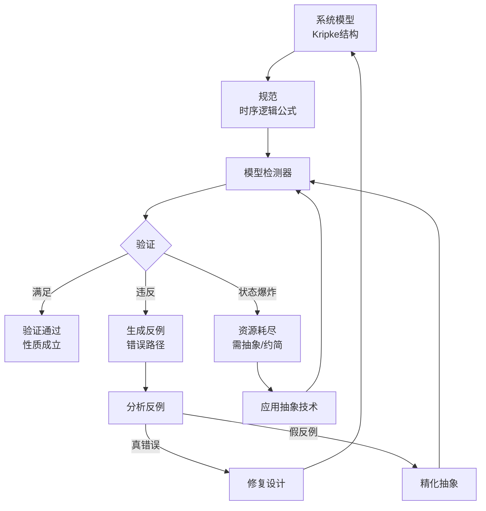
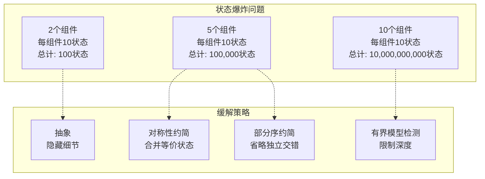

# 模型检测

> **所属单元**: formal-methods/03-model-taxonomy/05-verification-methods | **前置依赖**: [01-logic-methods](01-logic-methods.md) | **形式化等级**: L5-L6

## 1. 概念定义 (Definitions)

### Def-M-05-02-01 模型检测 (Model Checking)

模型检测是**自动验证有限状态系统**是否满足时序逻辑规范的技术：

$$\mathcal{MC}: (\mathcal{M}, \phi) \to \{\top, \bot, \text{CounterExample}\}$$

其中：

- $\mathcal{M} = (S, S_0, R, L)$：Kripke结构模型
- $\phi$：时序逻辑公式（通常CTL或LTL）
- 输出：满足、不满足（附反例）、或资源耗尽

### Def-M-05-02-02 Kripke结构

模型检测的基础语义结构：

$$\mathcal{M} = (S, S_0, R, L, AP)$$

- $S$：有限状态集合
- $S_0 \subseteq S$：初始状态集合
- $R \subseteq S \times S$：全转移关系
- $L: S \to 2^{AP}$：状态标记函数
- $AP$：原子命题集合

**执行路径**：无限状态序列 $\pi = s_0 s_1 s_2 ...$ 满足 $(s_i, s_{i+1}) \in R$。

### Def-M-05-02-03 计算树逻辑 (CTL)

CTL是分支时序逻辑，公式由**路径量词**和**时序算子**组合：

**路径量词**：

- $A$：All paths（所有路径）
- $E$：Exists path（存在路径）

**时序算子**：

- $X$：neXt（下一状态）
- $F$：Future（最终）
- $G$：Globally（总是）
- $U$：Until（直到）

**CTL语法**：
$$\phi ::= p \ | \ \neg\phi \ | \ \phi \land \phi \ | \ AX\phi \ | \ EX\phi \ | \ AF\phi \ | \ EF\phi \ | \ AG\phi \ | \ EG\phi \ | \ A(\phi U \phi) \ | \ E(\phi U \phi)$$

### Def-M-05-02-04 线性时序逻辑 (LTL)

LTL描述单条路径上的性质：

$$\phi ::= p \ | \ \neg\phi \ | \ \phi \land \phi \ | \ X\phi \ | \ F\phi \ | \ G\phi \ | \ \phi U \phi$$

**语义**：在路径 $\pi$ 上解释，如 $\pi \models G\phi$ 表示 $\phi$ 在 $\pi$ 的所有后缀上成立。

### Def-M-05-02-05 显式状态模型检测

显式状态方法直接枚举状态空间：

$$\text{ExplicitMC}(\mathcal{M}, \phi) = \text{DFS/BFS}(S_{reach}, \phi)$$

**算法**：

1. 从 $S_0$ 开始遍历状态空间
2. 对每个状态检查是否违反 $\phi$
3. 若发现反例，立即返回

**复杂度**：$O(|S| \cdot |\phi|)$ 时间和空间。

### Def-M-05-02-06 符号模型检测 (Symbolic MC)

符号方法使用**布尔函数**表示状态集合：

$$\text{SymbolicMC}(\mathcal{M}, \phi) = \text{FixedPoint}(BDD, \phi)$$

**核心思想**：

- 状态集合 → 布尔特征函数
- 转移关系 → 布尔关系
- 集合操作 → 布尔运算

**数据结构**：

- **BDD**（二元决策图）：规范化布尔函数表示
- **SAT求解器**：用于有界模型检测

## 2. 属性推导 (Properties)

### Lemma-M-05-02-01 CTL与LTL表达能力

- CTL和LTL表达能力**不可比较**
- $AF(p \land AXq)$ 无法表达为LTL
- $F(p \land Xq)$ 无法表达为CTL

**交集**：简单公式如 $AG p$、$AF p$ 两者都可表达。

### Lemma-M-05-02-02 状态爆炸问题

状态空间随组件数指数增长：

$$|S_{total}| = \prod_{i=1}^{n} |S_i|$$

对于 $n$ 个组件各 $k$ 个状态，总状态数 $k^n$。

### Prop-M-05-02-01 模型检测复杂度

| 逻辑 | 复杂度 | 说明 |
|-----|-------|------|
| CTL | $O(|\mathcal{M}| \cdot |\phi|)$ | 线性 |
| LTL | $O(|\mathcal{M}| \cdot 2^{|\phi|})$ | 指数于公式大小 |
| CTL* | PSPACE-完全 | 结合分支和线性 |
| 公平性LTL | PSPACE-完全 | 含Büchi条件 |

### Prop-M-05-02-02 符号方法优势

BDD表示的紧凑性：

- 某些结构的状态集合：$O(n)$ BDD节点 vs $O(2^n)$ 显式状态
- 对称性约简：$n!$ 状态缩减为1个等价类

## 3. 关系建立 (Relations)

### 模型检测方法谱系

```
显式状态
    ├── BFS/DFS遍历
    └── 部分序约简（POR）

符号方法
    ├── BDD-based（SMV, NuSMV）
    └── SAT-based（有界模型检测）

抽象方法
    ├── 谓词抽象
    ├── 反例制导抽象精化（CEGAR）
    └── 抽象解释
```

### 工具生态系统

| 工具 | 方法 | 适用逻辑 | 特点 |
|-----|------|---------|------|
| SPIN | 显式状态 | LTL | 通信协议验证 |
| NuSMV | 符号BDD | CTL/LTL | 硬件验证 |
| CBMC | SAT-based | LTL | C代码验证 |
| UPPAAL | 显式+符号 | TCTL | 时序系统 |
| PRISM | 符号 | PCTL | 概率系统 |

## 4. 论证过程 (Argumentation)

### 状态爆炸的缓解策略

1. **抽象**：隐藏无关细节
2. **对称性约简**：利用系统对称性
3. **部分序约简**：忽略独立动作的交错
4. **组合验证**：分组件验证后组合
5. **有界模型检测**：限制搜索深度

### 模型检测 vs 定理证明

| 特性 | 模型检测 | 定理证明 |
|-----|---------|---------|
| 自动化 | 全自动 | 交互式 |
| 适用范围 | 有限状态 | 无限状态 |
| 反例 | 自动提供 | 手动构造 |
| 复杂度 | 状态爆炸 | 证明难度 |
| 典型应用 | 协议验证 | 算法正确性 |

## 5. 形式证明 / 工程论证 (Proof / Engineering Argument)

### Thm-M-05-02-01 CTL模型检测算法

**定理**：CTL模型检测可在 $O(|\mathcal{M}| \cdot |\phi|)$ 时间内完成。

**算法**（标记法）：

**核心思想**：自底向上标记满足子公式的状态。

```
Mark(phi):
  case phi of
    p: return {s | p ∈ L(s)}
    ¬ψ: return S - Mark(ψ)
    ψ1 ∧ ψ2: return Mark(ψ1) ∩ Mark(ψ2)
    AXψ: return {s | ∀(s,s')∈R: s' ∈ Mark(ψ)}
    EXψ: return {s | ∃(s,s')∈R: s' ∈ Mark(ψ)}
    AFψ: return FixedPoint(λT.Mark(ψ) ∪ {s | ∀(s,s')∈R: s'∈T})
    EFψ: return FixedPoint(λT.Mark(ψ) ∪ {s | ∃(s,s')∈R: s'∈T})
    AGψ: return FixedPoint(λT.Mark(ψ) ∩ {s | ∀(s,s')∈R: s'∈T})
    EGψ: return FixedPoint(λT.Mark(ψ) ∩ {s | ∃(s,s')∈R: s'∈T})
    A(ψ1 U ψ2): ...
    E(ψ1 U ψ2): ...
```

**不动点计算**：$AF\psi$ 计算满足 $\psi$ 或所有后继都在集合中的状态。

**复杂度分析**：

- 每个子公式标记：$O(|\mathcal{M}|)$
- 子公式数：$O(|\phi|)$
- 总复杂度：$O(|\mathcal{M}| \cdot |\phi|)$

### Thm-M-05-02-02 有界模型检测正确性

**定理**：若有界模型检测在深度 $k$ 发现错误，则原系统确实存在错误。

**逆否命题**：若系统在深度 $k$ 无错误，不能推出系统无错误。

**完备性条件**：若系统有直径 $d$（从初始状态到任意状态的最长最短路径），则 $k \geq d$ 时的BMC是完备的。

**算法**：

1. 将系统和取反性质编码为SAT公式
2. $[[M, \neg\phi]]_k$：长度为 $k$ 的展开
3. 若SAT，则存在反例路径
4. 若UNSAT，增加 $k$ 继续搜索

## 6. 实例验证 (Examples)

### 实例1：互斥协议（SPIN/Promela）

```promela
// 互斥协议 - Peterson算法
#define N 2
bool flag[N];
byte turn;

proctype P(byte i) {
    byte j = 1 - i;

    do
    ::
        flag[i] = true;
        turn = j;

        // 等待条件
        (flag[j] == false || turn == i);

        // 临界区
        printf("P%d in critical section\n", i);

        flag[i] = false;

        // 非临界区
    od
}

init {
    atomic {
        run P(0);
        run P(1);
    }
}

// 安全性：互斥（不能同时在临界区）
// 活性：最终进入临界区

ltl mutex { []((P@critical_0 && P@critical_1) == false) }
```

### 实例2：NuSMV同步电路验证

```smv
MODULE main
VAR
    request : boolean;
    state   : {ready, busy};

ASSIGN
    init(state) := ready;
    next(state) := case
        state = ready & request : busy;
        state = busy            : ready;
        TRUE                    : state;
    esac;

    next(request) := {TRUE, FALSE};  -- 非确定输入

-- 安全性：busy时request必须为真
LTLSPEC G (state = busy -> request)

-- 活性：请求最终得到响应
LTLSPEC G (request -> F state = busy)
```

### 实例3：有界模型检测Python实现

```python
from pysat.solvers import Solver

def bmc_check(kripke, property_neg, max_depth=100):
    """
    有界模型检测简化实现
    """
    for k in range(1, max_depth + 1):
        # 编码转移关系为CNF
        cnf = encode_transition(kripke, k)

        # 编码取反性质
        cnf.extend(encode_property(property_neg, k))

        # SAT求解
        solver = Solver()
        for clause in cnf:
            solver.add_clause(clause)

        if solver.solve():
            # 发现反例
            model = solver.get_model()
            counterexample = extract_path(model, k)
            return False, counterexample, k

        solver.delete()

    return True, None, max_depth  # 在深度范围内无错误

def encode_transition(kripke, k):
    """将k步转移编码为CNF"""
    cnf = []
    for step in range(k):
        # 对每个状态和转移关系编码
        for s in kripke.states:
            for next_s in kripke.successors(s):
                # 状态变量的布尔编码
                cnf.append(encode_step(s, next_s, step))
    return cnf
```

## 7. 可视化 (Visualizations)

### 模型检测流程



### CTL公式标记过程

```mermaid
graph TB
    subgraph "模型结构"
        S0((s0)) --> S1((s1))
        S0 --> S2((s2))
        S1 --> S3((s3<br/>p))
        S2 --> S3
        S3 --> S3
    end

    subgraph "标记过程: EF p"
        M0[步骤0: Markp = {s3}]
        M1[步骤1: 添加前驱<br/>{s1, s2, s3}]
        M2[步骤2: 添加前驱<br/>{s0, s1, s2, s3}]
    end

    M0 --> M1
    M1 --> M2

    style S3 fill:#90EE90
```

### 状态爆炸与缓解



## 8. 引用参考 (References)
