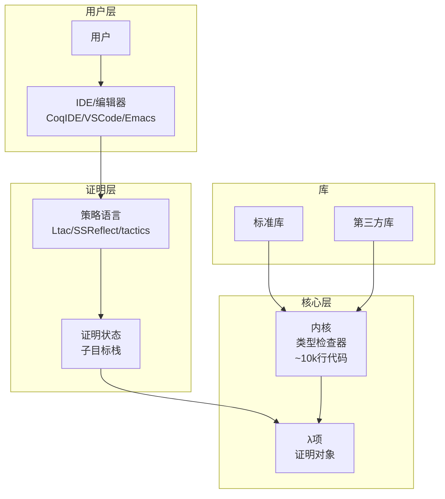
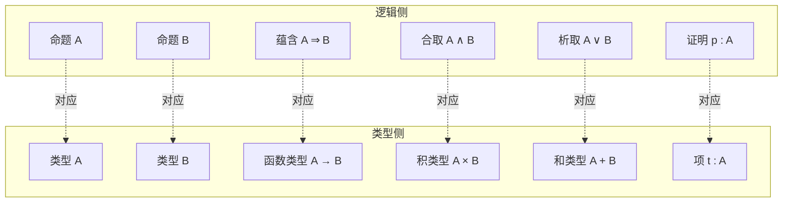
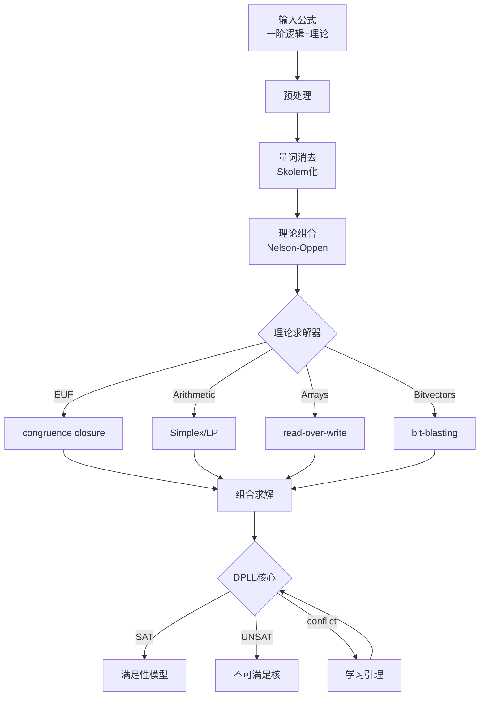

# 定理证明

> **所属单元**: formal-methods/03-model-taxonomy/05-verification-methods | **前置依赖**: [02-model-checking](02-model-checking.md) | **形式化等级**: L6

## 1. 概念定义 (Definitions)

### Def-M-05-03-01 定理证明器 (Theorem Prover)

定理证明器是辅助构造数学证明的交互式软件工具：

$$\mathcal{TP}: (\Gamma, P) \to \text{Proof} \ | \ \text{Incomplete}$$

其中：

- $\Gamma$：上下文（公理、定义、已有引理）
- $P$：待证命题
- Proof：形式化证明项

**核心组件**：

- **内核**（Kernel）：小型的证明检查器，确保可靠性
- **策略**（Tactics）：高级证明自动化命令
- **证明状态**：待证子目标集合

### Def-M-05-03-02 构造演算 (Calculus of Constructions, CoC)

CoC是依赖类型λ演算，是Coq的基础：

$$\mathcal{C} = (\mathcal{S}, \mathcal{V}, \mathcal{E}, \Gamma, \vdash)$$

**项语法**：

$$t ::= x \ | \ \lambda x:T.t \ | \ t\ t' \ | \ \Pi x:T.U \ | \ \text{Prop} \ | \ \text{Set} \ | \ \text{Type}$$

**类型规则**（核心）：

$$\frac{\Gamma \vdash A: s \quad \Gamma, x:A \vdash B: s'}{\Gamma \vdash \Pi x:A.B : s'}$$

$$\frac{\Gamma, x:A \vdash t:B}{\Gamma \vdash \lambda x:A.t : \Pi x:A.B}$$

$$\frac{\Gamma \vdash f:\Pi x:A.B \quad \Gamma \vdash a:A}{\Gamma \vdash f\ a : B[x/a]}$$

### Def-M-05-03-03 Curry-Howard对应

Curry-Howard同构建立**证明与程序**的对应：

| 逻辑 | 类型论 | 编程 |
|-----|-------|------|
| 命题 $P$ | 类型 $T$ | 类型 |
| 证明 $p$ | 项 $t:T$ | 程序 |
| $P \Rightarrow Q$ | $T \to U$ | 函数类型 |
| $P \land Q$ | $T \times U$ | 积类型 |
| $P \lor Q$ | $T + U$ | 和类型 |
| $\forall x.P$ | $\Pi x:A.T$ | 依赖函数 |
| $\exists x.P$ | $\Sigma x:A.T$ | 依赖对 |

### Def-M-05-03-04 归纳类型 (Inductive Types)

归纳类型由**构造子**定义：

```coq
Inductive nat : Set :=
  | O : nat
  | S : nat -> nat.
```

**归纳原理**：

$$\forall P: nat \to \text{Prop}, P(O) \Rightarrow (\forall n, P(n) \Rightarrow P(S(n))) \Rightarrow \forall n, P(n)$$

### Def-M-05-03-05 SMT求解器 (Satisfiability Modulo Theories)

SMT求解器判定一阶逻辑公式在组合理论下的可满足性：

$$\text{SMT}(T_1, ..., T_n): \phi \to \{SAT, UNSAT, UNKNOWN\}$$

**支持理论**：

- **EUF**：等式和未解释函数
- **LIA**：线性整数算术
- **LRA**：线性实数算术
- **Arrays**：数组理论
- **Bitvectors**：位向量

## 2. 属性推导 (Properties)

### Lemma-M-05-03-01 类型安全性

构造演算满足**强规范化**和**合流性**：

- **强规范化**：所有良类型项有有限归约序列
- **合流性**：归约顺序不影响最终结果

**推论**：证明检查是可判定的。

### Lemma-M-05-03-02 证明无关性 (Proof Irrelevance)

对于命题类型 $P: \text{Prop}$，所有证明 $p_1, p_2: P$ 在计算中等价：

$$\forall p_1, p_2: P, p_1 = p_2$$

这允许在提取可执行代码时擦除证明部分。

### Prop-M-05-03-01 主要定理证明器对比

| 特性 | Coq | Isabelle/HOL | HOL4 | Lean |
|-----|-----|-------------|------|------|
| 逻辑基础 | CIC | 高阶逻辑 | 高阶逻辑 | CIC |
| 核心大小 | 小 | 中等 | 小 | 小 |
| 自动化 | 中等 | 强（Sledgehammer）| 中等 | 强 |
| 证明语言 | Ltac/Gallina | Isar/ML | ML | Lean |
| 生态系统 | 数学部件 | Archive of Formal Proofs | 硬件验证 | mathlib |

### Prop-M-05-03-02 SMT求解器能力

SMT在以下领域有效：

- **程序验证**：Hoare逻辑验证条件
- **测试生成**：约束求解生成测试用例
- **协议分析**：小状态空间协议验证
- **调度问题**：约束满足求解

## 3. 关系建立 (Relations)

### 证明工具层次

```
自动定理证明（ATP）
    └── 一阶逻辑、等式推理

SMT求解器
    └── 量词自由片段、组合理论

交互式定理证明（ITP）
    ├── Coq（构造逻辑）
    ├── Isabelle/HOL（经典逻辑）
    └── Lean（依赖类型）

证明助手的自动化
    └── 策略（Tactics）、自动证明搜索
```

### 应用领域映射

| 领域 | 推荐工具 | 理由 |
|-----|---------|------|
| 程序验证 | Coq/Isabelle | 提取可执行代码 |
| 数学证明 | Lean/Coq | 数学库丰富 |
| 硬件验证 | HOL4/Isabelle | 位向量支持 |
| 协议分析 | Tamarin/ProVerif | 专用领域 |

## 4. 论证过程 (Argumentation)

### 为什么使用定理证明？

**超越模型检验**：

- 处理**无限状态**系统
- 验证**参数化**系统（任意 $n$）
- 证明**超性质**（如信息非干扰）
- 形式化**数学定理**

**成本与挑战**：

- 高技能门槛
- 时间成本高（数周到数月）
- 需要数学思维

### 证明自动化策略

**小规模自动化**：

- **auto/eauto**：简单推理链
- **omega/arith**：算术决策过程
- **congruence**：等式推理

**大规模自动化**：

- **Sledgehammer**（Isabelle）：外部ATP/SMT调用
- **CoqHammer**（Coq）：类似功能
- **hint databases**：用户可扩展的提示库

## 5. 形式证明 / 工程论证 (Proof / Engineering Argument)

### Thm-M-05-03-01 Coq归纳类型正确性

**定理**：Coq归纳类型满足**严格正性条件**时，归纳原理是有效的。

**严格正性**：

- 归纳类型 $I$ 仅出现在构造子参数的正位置
- 禁止：$\text{bad}: (I \to \text{nat}) \to I$（负位置）

**证明框架**：

1. 构造 $I$ 的语义域作为不动点
2. 证明构造子在域中封闭
3. 归纳原理对应最小不动点原理

**可靠性保证**：

- 内核仅接受通过类型检查的项
- 归纳原理自动生成且语法验证

### Thm-M-05-03-02 霍尔逻辑正确性

**霍尔三元组**：$\{P\} C \{Q\}$ 表示若 $P$ 在 $C$ 执行前成立，则 $Q$ 在执行后成立。

**霍尔规则**：

$$\frac{}{\{Q[x/e]\} x := e \{Q\}} \text{（赋值）}$$

$$\frac{\{P\} C_1 \{R\} \quad \{R\} C_2 \{Q\}}{\{P\} C_1; C_2 \{Q\}} \text{（顺序）}$$

$$\frac{\{P \land B\} C_1 \{Q\} \quad \{P \land \neg B\} C_2 \{Q\}}{\{P\} \text{if } B \text{ then } C_1 \text{ else } C_2 \{Q\}} \text{（条件）}$$

**最弱前置条件**（wp）：

$$wp(C, Q) = \text{最弱的 } P \text{ 使得 } \{P\} C \{Q\}$$

**正确性**：若 $P \Rightarrow wp(C, Q)$，则 $\{P\} C \{Q\}$ 有效。

## 6. 实例验证 (Examples)

### 实例1：Coq列表反转证明

```coq
(* 列表定义 *)
Inductive list (A : Type) : Type :=
  | nil : list A
  | cons : A -> list A -> list A.

(* 追加函数 *)
Fixpoint app {A} (l1 l2 : list A) : list A :=
  match l1 with
  | nil => l2
  | cons x l1' => cons x (app l1' l2)
  end.

(* 反转函数 *)
Fixpoint rev {A} (l : list A) : list A :=
  match l with
  | nil => nil
  | cons x l' => app (rev l') (cons x nil)
  end.

(* 定理：反转是自身的逆 *)
Theorem rev_involutive : forall (A : Type) (l : list A),
  rev (rev l) = l.
Proof.
  intros A l.
  induction l as [| x l' IHl'].
  - (* 基本情况: l = nil *)
    simpl. reflexivity.
  - (* 归纳步骤: l = cons x l' *)
    simpl.
    (* 关键引理：rev (app l1 l2) = app (rev l2) (rev l1) *)
    rewrite rev_app_distr.
    rewrite IHl'.
    simpl.
    reflexivity.
Qed.

(* 辅助引理 *)
Lemma rev_app_distr : forall (A : Type) (l1 l2 : list A),
  rev (app l1 l2) = app (rev l2) (rev l1).
Proof.
  intros A l1 l2.
  induction l1 as [| x l1' IHl1'].
  - simpl. rewrite app_nil_r. reflexivity.
  - simpl. rewrite IHl1'. rewrite app_assoc. reflexivity.
Qed.

Lemma app_nil_r : forall (A : Type) (l : list A),
  app l nil = l.
Proof.
  intros A l. induction l; simpl; auto. rewrite IHl. reflexivity.
Qed.
```

### 实例2：霍尔逻辑程序验证

```coq
(* 阶乘函数 *)
Fixpoint fact (n : nat) : nat :=
  match n with
  | 0 => 1
  | S n' => n * fact n'
  end.

(* 命令式阶乘 - 使用霍尔逻辑 *)
Require Import Hoare.

Definition fact_imp (n : nat) : com :=
  Z ::= ANum 1;;
  Y ::= ANum n;;
  WHILE BNot (BEq (AId Y) (ANum 0)) DO
    Z ::= AMult (AId Z) (AId Y);;
    Y ::= AMinus (AId Y) (ANum 1)
  END.

(* 正确性定理 *)
Theorem fact_correct : forall n,
  {{ fun st => st Y = n }}
  fact_imp n
  {{ fun st => st Z = fact n }}.
Proof.
  intros n.
  unfold fact_imp.
  eapply hoare_seq.
  - (* 循环不变式 *)
    eapply hoare_consequence with
      (P' := fun st => st Z * fact (st Y) = fact n)
      (Q' := fun st => st Z * fact (st Y) = fact n /\ bassn (BNot (BEq (AId Y) (ANum 0))) st).
    + apply hoare_while.
      eapply hoare_seq.
      * apply hoare_asgn.
      * apply hoare_asgn.
    + (* 蕴含证明 *)
      intros st [H1 H2]. unfold bassn in H2. simpl in H2.
      rewrite negb_false_iff in H2. apply beq_nat_true in H2.
      rewrite H2 in H1. rewrite <- H1. simpl. omega.
    + (* 蕴含证明 *)
      intros st H. split; auto.
  - (* 初始化 *)
    eapply hoare_seq.
    + apply hoare_asgn.
    + apply hoare_asgn.
Qed.
```

### 实例3：Isabelle/HOL简单验证

```isabelle
(* 列表反转 *)
theory ListRev
imports Main
begin

fun rev :: "'a list ⇒ 'a list" where
  "rev [] = []"
| "rev (x#xs) = rev xs @ [x]"

fun itrev :: "'a list ⇒ 'a list ⇒ 'a list" where
  "itrev [] ys = ys"
| "itrev (x#xs) ys = itrev xs (x#ys)"

(* 定理：itrev等价于rev + append *)
lemma itrev_rev: "itrev xs ys = rev xs @ ys"
  apply(induction xs arbitrary: ys)
   apply(auto)
  done

(* 推论：itrev []等价于rev *)
corollary "itrev xs [] = rev xs"
  by(simp add: itrev_rev)

(* 定理：反转是自身的逆 *)
lemma rev_rev: "rev (rev xs) = xs"
  apply(induction xs)
   apply(auto)
  done

end
```

## 7. 可视化 (Visualizations)

### 定理证明器架构



### Curry-Howard对应图解



### SMT求解器流程



## 8. 引用参考 (References)
