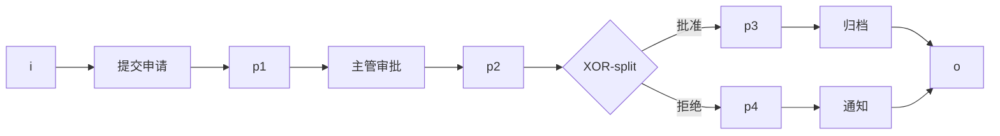
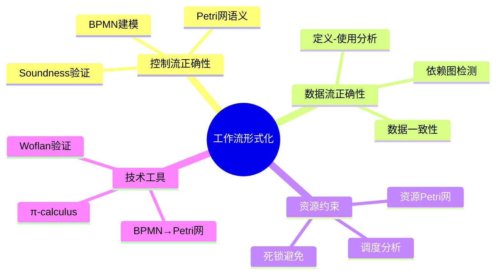
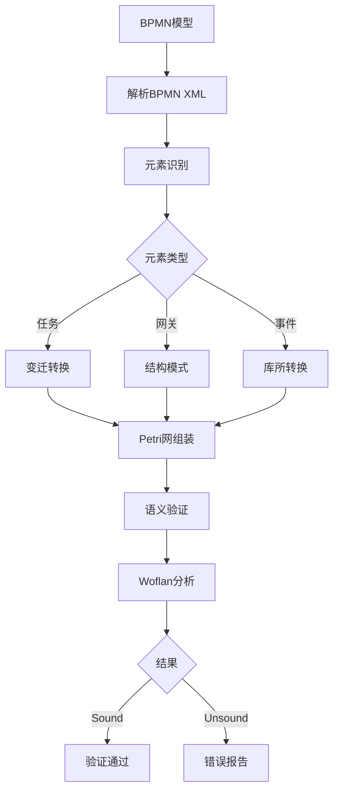

# 工作流系统形式化目标与技术栈

> **所属单元**: formal-methods/04-application-layer/01-workflow | **前置依赖**: [formal-methods/03-distributed-systems/02-consensus-protocols](../../03-distributed-systems/02-consensus-protocols.md) | **形式化等级**: L4-L5

## 1. 概念定义 (Definitions)

### Def-A-01-01: 工作流系统 (Workflow System)

工作流系统是一个五元组 $\mathcal{W} = (\mathcal{A}, \mathcal{D}, \mathcal{C}, \mathcal{R}, \mathcal{M})$，其中：

- $\mathcal{A}$: 活动集合 (Activities)，表示系统中的原子任务单元
- $\mathcal{D}$: 数据元素集合 (Data Elements)，表示流转的数据对象
- $\mathcal{C}$: 控制流关系 $\mathcal{C} \subseteq \mathcal{A} \times \mathcal{A} \times \mathcal{T}$，其中 $\mathcal{T} = \{\text{seq}, \text{par}, \text{choice}, \text{loop}\}$ 为连接类型
- $\mathcal{R}$: 资源集合 (Resources)，表示执行活动所需的计算资源
- $\mathcal{M}$: 映射函数 $\mathcal{M}: \mathcal{A} \rightarrow 2^{\mathcal{R}}$，表示活动到资源的分配

### Def-A-01-02: 工作流网 (Workflow Net)

一个工作流网是一个特殊的Petri网 $N = (P, T, F, i, o)$，其中：

- $(P, T, F)$ 是标准Petri网结构（库所、变迁、流关系）
- $i \in P$ 是唯一的输入库所，满足 $^{\bullet}i = \emptyset$
- $o \in P$ 是唯一的输出库所，满足 $o^{\bullet} = \emptyset$
- 添加短接变迁 $t^*$ 连接 $o$ 到 $i$ 后，网 $(P, T \cup \{t^*\}, F \cup \{(o, t^*), (t^*, i)\})$ 是强连通的

> **直观解释**: 工作流网确保了从起始到终止的完整流程路径，短接操作使我们可以分析流程的循环结构。

### Def-A-01-03: 控制流正确性 (Control Flow Correctness)

控制流正确性要求对于工作流网 $N$ 的任意可达标识 $M$：

$$\forall M \in \mathcal{R}(N, [i]): \exists \sigma \in T^*: M \xrightarrow{\sigma} [o]$$

即从任意可达状态都能到达终止状态。

### Def-A-01-04: 数据流正确性 (Data Flow Correctness)

数据流正确性要求对于所有活动 $a \in \mathcal{A}$：

- **定义-使用一致性**: 若活动 $a$ 读取数据 $d$，则存在前驱活动 $a'$ 写入 $d$
- **无丢失写**: 每个数据元素在被覆盖前至少被读取一次
- **无冗余读**: 不存在读取永不被使用数据的活动

形式化表示为数据依赖图 $G_D = (\mathcal{A}, E_D)$ 是无环的，其中 $(a_i, a_j) \in E_D$ 当且仅当 $a_j$ 读取 $a_i$ 写入的数据。

## 2. 属性推导 (Properties)

### Lemma-A-01-01: 控制流正确性蕴含可达性

若工作流网 $N$ 满足控制流正确性，则对于初始标识 $[i]$，终止标识 $[o]$ 是可达的：

$$\text{ControlFlowCorrect}(N) \Rightarrow [o] \in \mathcal{R}(N, [i])$$

**证明概要**: 由控制流正确性的定义直接可得，取 $M = [i]$ 即可。

### Lemma-A-01-02: 数据流无环性保证终止性

若数据依赖图 $G_D$ 是无环的，且每个活动执行时间是有限的，则工作流必然终止。

**证明**: 无环图存在拓扑序，活动按拓扑序执行，每个活动执行有限时间，故总执行时间有限。

### Prop-A-01-01: 控制流与数据流一致性条件

工作流系统 $\mathcal{W}$ 是**一致的**当且仅当：

- 控制流图 $G_C = (\mathcal{A}, E_C)$ 与数据依赖图 $G_D$ 满足：$E_D \subseteq E_C^*$（数据依赖必须是控制流的传递闭包子集）

即数据依赖不能跨越控制流顺序。

## 3. 关系建立 (Relations)

### 3.1 BPMN到Petri网的映射

BPMN (Business Process Model and Notation) 可通过系统化转换映射到Petri网：

| BPMN元素 | Petri网模式 |
|---------|------------|
| 顺序流 | 顺序连接（库所-变迁-库所链） |
| 并行网关 (AND-split/join) | 分叉/汇合变迁 |
| 排他网关 (XOR-split/join) | 选择变迁与条件弧 |
| 包容网关 (OR-split/join) | 复杂选择结构 |
| 事件 | 带颜色的库所（颜色表示事件类型） |

### 3.2 π-calculus服务编排

服务编排可通过π-calculus进程表示：

$$P_{workflow} = \nu \tilde{c}.(\prod_{i} P_{service_i} | P_{orchestrator})$$

其中：

- $P_{service_i}$: 第 $i$ 个服务进程
- $P_{orchestrator}$: 编排器进程，协调服务调用顺序
- $\nu \tilde{c}$: 限制通道集合，表示内部通信

编排器通过名称传递实现动态服务发现：

$$P_{orchestrator} = \bar{x}\langle y \rangle.P' \mid x(z).P_{service}(z)$$

### 3.3 与Petri网的对比

```
┌─────────────────┬──────────────────┬──────────────────┐
│     特性        │     Petri网       │   π-calculus     │
├─────────────────┼──────────────────┼──────────────────┤
│ 状态表示        │ 显式（标识）       │ 隐式（进程项）    │
│ 并发模型        │ 真并发            │ 交叠并发          │
│ 动态拓扑        │ 静态              │ 支持（新名称）    │
│ 验证工具        │ Woflan, LoLA      │ Mobility Workbench│
│ 可判定性        │ 部分可判定         │ 一般不可判定      │
│ 工业应用        │ BPMN验证          │ 服务编排建模      │
└─────────────────┴──────────────────┴──────────────────┘
```

## 4. 论证过程 (Argumentation)

### 4.1 形式化目标的三层结构

工作流形式化的目标可分为三个层次：

**L4 - 结构正确性**:

- 语法正确性：BPMN模型符合规范
- 良构性：无悬空连接、无孤立节点

**L5 - 行为正确性**:

- Soundness：van der Aalst三条件
- 弱/强Soundness变体

**L6 - 性能正确性**:

- 资源约束满足
- 时序约束满足
- 吞吐量保证

### 4.2 资源约束形式化

资源约束可建模为带资源标识的Petri网：

$$N_R = (P, T, F, R, \rho, \kappa)$$

其中：

- $R$: 资源类型集合
- $\rho: T \rightarrow 2^{R \times \mathbb{N}}$: 变迁的资源需求
- $\kappa: R \rightarrow \mathbb{N}$: 资源容量

**资源死锁**: 当存在变迁集合 $T' \subseteq T$ 使得：

$$\forall t \in T': \exists (r, n) \in \rho(t): \text{available}(r) < n$$

且 $T'$ 中变迁互相等待资源释放时，发生资源死锁。

## 5. 形式证明 / 工程论证

### 5.1 BPMN到Petri网转换的语义保持性

**定理 (转换正确性)**: 设 $\mathcal{B}$ 为BPMN模型，$\Phi(\mathcal{B})$ 为其Petri网转换，则：

$$\mathcal{B} \models \phi \iff \Phi(\mathcal{B}) \models \phi'$$

其中 $\phi$ 是BPMN性质，$\phi'$ 是对应的Petri网性质。

**证明概要**: 对BPMN元素结构归纳：

*基础情形*：原子任务转换为一个变迁，语义显然保持。

*归纳步骤*：

- 顺序结构：Petri网顺序组合保持迹等价
- 并行结构：AND-split/join 保持交错语义
- 选择结构：XOR-split/join 保持选择语义
- 循环结构：通过短接变迁模拟循环

### 5.2 Woflan验证工具链

Woflan (Workflow Analyzer) 提供以下验证能力：

```
BPMN模型 → [转换器] → Petri网 → [Woflan] → 分析结果
                           ↓
                    ├─ Soundness检查
                    ├─ 死锁检测
                    ├─ 活锁检测
                    └─ 性能分析
```

**验证复杂度**:

- 结构Soundness: PTIME (多项式时间)
- 弱Soundness: PSPACE-complete
- 强Soundness: EXPSPACE-hard

## 6. 实例验证 (Examples)

### 6.1 简单审批流程

考虑一个请假审批工作流：

```bpmn
[提交申请] → [主管审批] → {XOR} → [批准] → [归档]
                      ↓
                   [拒绝] → [通知]
```

对应的Petri网表示：



### 6.2 π-calculus编排示例

```
// 服务定义
Service_Order = order(x).(process(x).Service_Order + reject(x).Service_Order)
Service_Payment = pay(y).(confirm(y).Service_Payment + fail(y).Service_Payment)

// 编排器
Orchestrator = new c1 c2.
  (OrderClient⟨c1⟩ | PaymentClient⟨c2⟩ |
   c1(order).c2(pay).(confirm.OrderComplete + fail.OrderFailed))
```

## 7. 可视化 (Visualizations)

### 7.1 工作流形式化技术栈全景



### 7.2 BPMN到Petri网转换流程



### 7.3 技术栈对比雷达图（表格形式）

```
维度                    Petri网    π-calculus    TLA+
─────────────────────────────────────────────────────
表达能力                ★★★★☆      ★★★★★       ★★★★☆
验证效率                ★★★★★      ★★★☆☆       ★★★★☆
工业工具支持            ★★★★★      ★★★☆☆       ★★★★☆
学习曲线                ★★★☆☆      ★★☆☆☆       ★★☆☆☆
动态性支持              ★★☆☆☆      ★★★★★       ★★★☆☆
─────────────────────────────────────────────────────
```

## 8. 关系建立 (Relations)

### 与可串行化的关系

工作流形式化与可串行化（Serializability）在并发控制和执行正确性方面密切相关。工作流系统的活动执行可视为事务，需要保证并发执行的正确性。

- 详见：[可串行化](../../../98-appendices/wikipedia-concepts/16-serializability.md)

工作流与可串行化的对应关系：

- **活动 → 事务**: 工作流中的每个活动可视为一个事务
- **数据流 → 读写依赖**: 活动间的数据传递对应事务间的读写操作
- **控制流 → 调度顺序**: 工作流的控制流约束对应事务的串行化顺序

### 可串行化在工作流验证中的应用

**冲突可串行化分析**:

- 识别工作流活动间的冲突操作（读写、写读、写写）
- 构建冲突图检测是否存在循环依赖
- 确保工作流执行等价于某个串行执行

**严格可串行化**:

- 工作流事务按真实时间顺序可串行化
- 保证事务的实时顺序与串行化顺序一致
- 适用于时间敏感的工作流场景

---

## 9. 引用参考 (References)
