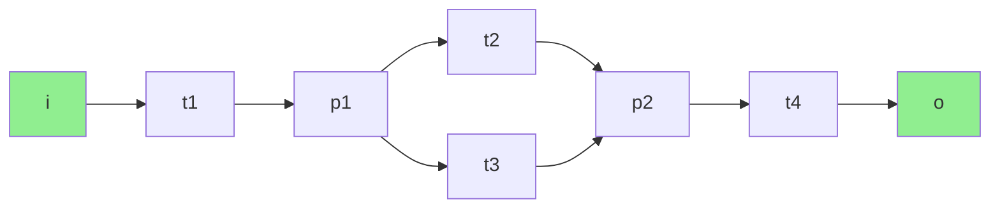
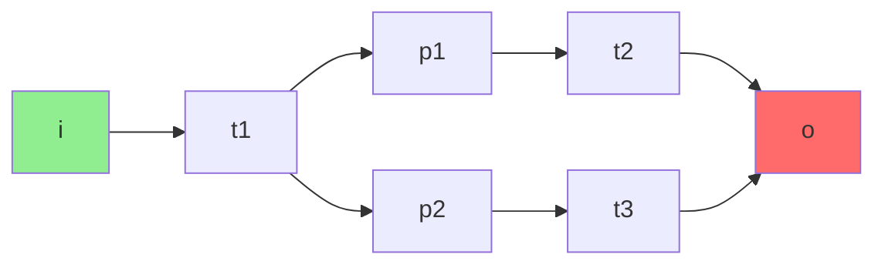
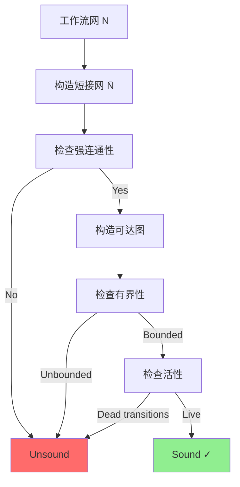
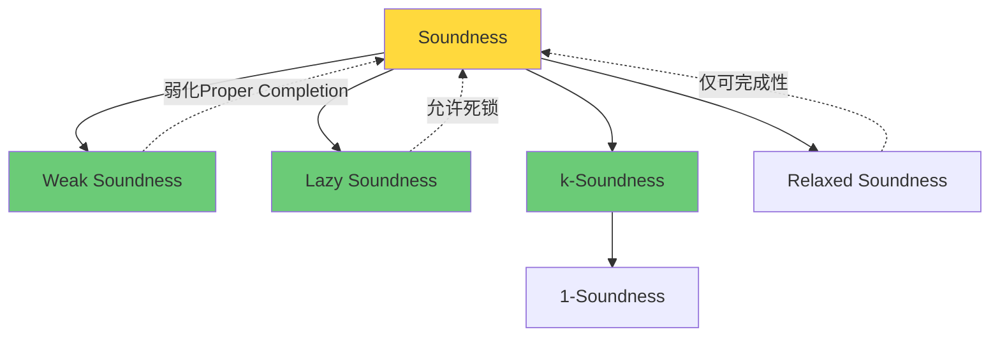
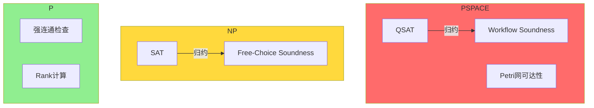

# Soundness公理系统 (van der Aalst)

> **所属单元**: formal-methods/04-application-layer/01-workflow | **前置依赖**: [01-workflow-formalization](./01-workflow-formalization.md) | **形式化等级**: L5

## 1. 概念定义 (Definitions)

### Def-A-02-01: Soundness三条件

设 $N = (P, T, F, i, o)$ 是一个工作流网，其**Soundness**定义如下三个条件：

**条件 I - Option to Complete (可完成性)**:
$$\forall M \in \mathcal{R}(N, [i]): [o] \in \mathcal{R}(N, M)$$
从任意可达标识都能到达终止标识。

**条件 II - Proper Completion (正确完成)**:
$$\forall M \in \mathcal{R}(N, [i]): M \geq [o] \Rightarrow M = [o]$$
当输出库所被标记时，其他库所均无标记。

**条件 III - No Dead Tasks (无死任务)**:
$$\forall t \in T: \exists M, M' \in \mathcal{R}(N, [i]): M \xrightarrow{t} M'$$
每个变迁在至少一个执行序列中都是可达的。

### Def-A-02-02: 短接网 (Short-Circuited Net)

工作流网 $N$ 的短接网 $\bar{N}$ 定义为：

$$\bar{N} = (P, T \cup \{t^*\}, F \cup \{(o, t^*), (t^*, i)\})$$

其中 $t^*$ 是新增短接变迁，连接输出库所 $o$ 到输入库所 $i$。

### Def-A-02-03: Lazy Soundness (惰性Soundness)

工作流网 $N$ 是**Lazy Sound**的，当且仅当：

$$\forall M \in \mathcal{R}(N, [i]): M \xrightarrow{*} [o] \text{ 或 } M \text{ 是死标识}$$

即要么能完成，要么陷入死锁（允许非期望终止）。

### Def-A-02-04: k-Soundness (k-Soundness)

工作流网 $N$ 是**k-Sound**的，当且仅当：

$$\forall M \in \mathcal{R}(N, k[i]): k[o] \in \mathcal{R}(N, M)$$

即从 $k$ 个初始令牌开始，必能到达 $k$ 个输出令牌的状态。

## 2. 属性推导 (Properties)

### Lemma-A-02-01: Soundness等价于短接网的有界性和活性

工作流网 $N$ 是Sound的，当且仅当短接网 $\bar{N}$ 是有界的且是活性的。

**证明概要**:

*($\Rightarrow$)*:

- 有界性：若 $\bar{N}$ 无界，则 $N$ 中可从 $[i]$ 到达无界状态，违反Proper Completion
- 活性：若 $\bar{N}$ 非活，则存在变迁在 $N$ 中不可执行，违反No Dead Tasks

*($\Leftarrow$)*:

- 有界性保证Proper Completion
- 活性保证Option to Complete和No Dead Tasks

### Lemma-A-02-02: Soundness蕴含1-Soundness

$$\text{Sound}(N) \Rightarrow \text{1-Sound}(N)$$

**证明**: 由Soundness定义直接可得，取 $k=1$ 即满足1-Soundness条件。

### Prop-A-02-01: Lazy Soundness弱化条件

$$\text{Sound}(N) \Rightarrow \text{Lazy Sound}(N)$$

但逆命题不成立。

**反例**: 包含死锁但无死任务的工作流网是Lazy Sound但不是Sound的。

### Lemma-A-02-03: 结构Soundness判定条件

对于自由选择网 (Free-Choice Net)，Soundness可通过以下结构条件判定：

- 每个有向回路都包含至少一个库所
- 短接网是强连通的
- 无死变迁

## 3. 关系建立 (Relations)

### 3.1 Soundness变体层次结构

```
Soundness
    │
    ├──→ Weak Soundness (弱化Proper Completion)
    │
    ├──→ Lazy Soundness (允许死锁)
    │
    ├──→ k-Soundness (k个实例)
    │       └──→ 1-Soundness (单实例)
    │
    └──→ Relaxed Soundness (仅要求可完成性)
```

### 3.2 与Petri网经典性质的关系

| Soundness条件 | Petri网性质 | 对应关系 |
|-------------|-----------|---------|
| Option to Complete | 活性 (Liveness) | 等价于 $\bar{N}$ 的活性 |
| Proper Completion | 有界性 (Boundedness) | 隐含于有界性 |
| No Dead Tasks | 准活性 (Quasi-liveness) | 等价于准活性 |

### 3.3 短接网判定算法的理论基础

短接网方法基于以下观察：

$$\text{Sound}(N) \iff \bar{N} \text{ 是有界且活的}$$

这使得Soundness判定可以转化为Petri网的经典性质分析，利用成熟的有界性和活性判定算法。

## 4. 论证过程 (Argumentation)

### 4.1 短接网判定算法

**算法**: ShortCircuitSoundnessCheck($N$)

```
输入: 工作流网 N = (P, T, F, i, o)
输出: Sound / Unsound

1. 构造短接网 $\bar{N}$
2. 检查 $\bar{N}$ 的有界性:
   - 构造可达图或使用覆盖树算法
   - 若存在 $\omega$ 标记，返回 Unsound
3. 检查 $\bar{N}$ 的活性:
   - 对于每个变迁 $t \in T \cup \{t^*\}$
   - 检查是否存在从 $[i]$ 出发的 firing sequence 使能 $t$
   - 若存在变迁不满足，返回 Unsound
4. 返回 Sound
```

**复杂度分析**:

- 可达图构造: EXPSPACE (状态空间指数级)
- 有界性检查: PSPACE-complete
- 活性检查: PSPACE-complete
- 总体: PSPACE-complete

### 4.2 复杂度下界证明

**定理**: 工作流网Soundness判定是PSPACE-complete的。

**证明**:

*上界*: 通过构造短接网的可达图，可在多项式空间内完成判定。

*下界*: 从Petri网可达性问题归约：

- Petri网可达性已知是EXPSPACE-hard，但工作流网的特殊结构使其降低为PSPACE-complete
- 具体地，从QSAT (Quantified Boolean Satisfiability) 问题归约

归约构造：
给定QSAT公式 $\Phi = \forall x_1 \exists x_2 \forall x_3 ... \phi$，构造工作流网 $N_\Phi$ 使得：

$$N_\Phi \text{ is Sound} \iff \Phi \text{ is satisfiable}$$

### 4.3 Lazy Soundness与容错设计

Lazy Soundness允许死锁存在，这在实际系统中有重要意义：

**场景**: 异常处理流程

- 正常流程：Sound
- 异常分支：可能进入死锁（等待人工干预）
- 整体：Lazy Sound

这种设计模式在BPMN的**边界事件**中常见，允许流程在异常时"暂停"而非强制完成。

## 5. 形式证明 / 工程论证

### 5.1 van der Aalst Soundness定理完整证明

**定理**: 设 $N$ 为工作流网，$\bar{N}$ 为其短接网，则：

$$N \text{ is Sound} \iff \bar{N} \text{ is bounded and live}$$

**证明**:

*($\Rightarrow$) Sound $\Rightarrow$ Bounded & Live*:

**有界性证明**:
假设 $\bar{N}$ 无界，则存在可达标识序列 $M_0, M_1, ...$ 使得 $M_0 = [i]$ 且 $M_{i+1} > M_i$（按分量）。

由无界性，存在库所 $p$ 使得令牌数无界增长。分两种情况：

1. $p = o$: 则存在 $M$ 使得 $M(o) > 1$，违反Proper Completion
2. $p \neq o$: 则存在从 $M$ 到 $[o]$ 的 firing sequence，途中令牌累积，最终 $[o]$ 时其他库所仍有令牌，违反Proper Completion

故 $\bar{N}$ 必须有界。

**活性证明**:

- 对任意 $t \in T$，由No Dead Tasks，存在 $M, M'$ 使得 $M \xrightarrow{t} M'$
- 对 $t^*$，由Option to Complete，$[o]$ 可达，故 $t^*$ 可触发

*($\Leftarrow$) Bounded & Live $\Rightarrow$ Sound*:

**Option to Complete**:
由 $\bar{N}$ 的活性，$t^*$ 是活的，故从任意可达 $M$，存在 $\sigma$ 使能 $t^*$，即 $M \xrightarrow{\sigma} M'$ 且 $M'(o) \geq 1$。由有界性，$M' = [o]$。

**Proper Completion**:
假设 $M \geq [o]$ 但 $M \neq [o]$，则存在 $p \neq o$ 使得 $M(p) > 0$。由活性，可触发 $t^*$，导致 $[i]$ 有多个令牌，与有界性矛盾。

**No Dead Tasks**:
由 $\bar{N}$ 的活性直接可得。

### 5.2 结构化工作流网的高效判定

对于特定子类，Soundness可在多项式时间判定：

| 网类 | Soundness复杂度 | 判定算法 |
|-----|---------------|---------|
| 自由选择网 (Free-Choice) | PTIME | rank定理 |
| 非对称选择网 | PTIME | 扩展rank定理 |
| 扩展自由选择网 | PTIME | 分解方法 |
| 一般工作流网 | PSPACE-complete | 可达图分析 |

**自由选择网的rank定理**:

对于自由选择工作流网，Soundness等价于：

1. $\bar{N}$ 是强连通的
2. 关联矩阵的rank满足特定条件
3. 每个有向回路至少包含一个库所

## 6. 实例验证 (Examples)

### 6.1 Sound工作流示例



**验证**:

- 短接网强连通 ✓
- 有界性: 每个库所最多1个令牌 ✓
- 活性: 所有变迁都可触发 ✓
- **结论**: Sound

### 6.2 Unsound工作流示例（违反Proper Completion）



**问题**: $t_2$ 和 $t_3$ 都触发后，$p_1$ 或 $p_2$ 可能仍有令牌，违反Proper Completion。

### 6.3 Woflan验证报告示例

```
========================================
Woflan Analysis Report
========================================
Input: leave-approval.pnml

Structural Analysis:
  - Free-Choice: Yes
  - Workflow Net: Yes
  - Strongly Connected (short-circuited): Yes

Behavioral Analysis:
  - Bounded: Yes (k=1)
  - Live: Yes
  - Sound: YES ✓

Diagnosis:
  No errors found.

Recommendations:
  Model is ready for deployment.
========================================
```

## 7. 可视化 (Visualizations)

### 7.1 Soundness判定算法流程



### 7.2 Soundness变体关系图



### 7.3 复杂度类关系



## 8. 引用参考 (References)
