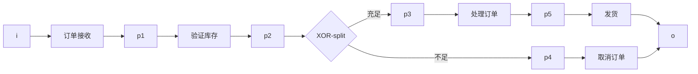
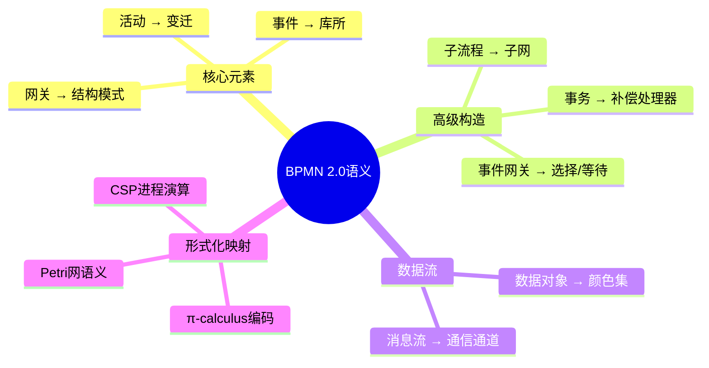
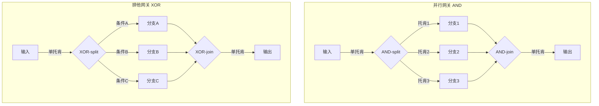
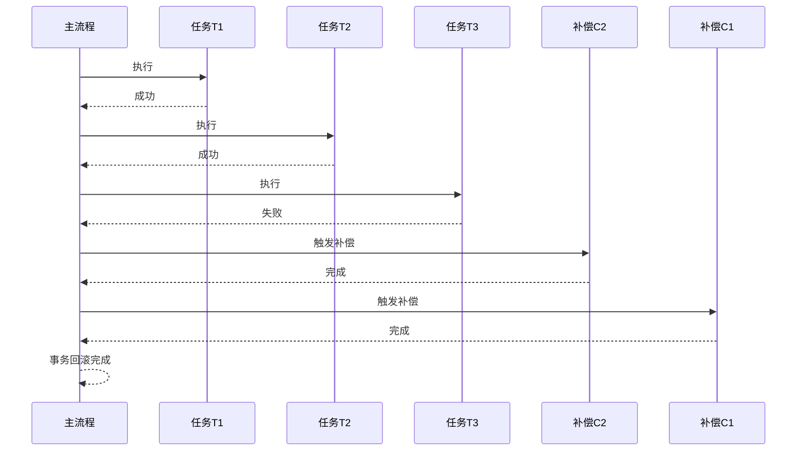
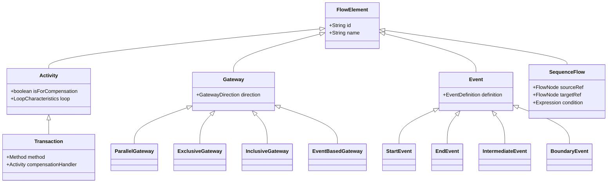

# BPMN 2.0形式化语义

> **所属单元**: formal-methods/04-application-layer/01-workflow | **前置依赖**: [01-workflow-formalization](01-workflow-formalization.md) | **形式化等级**: L5-L6

## 1. 概念定义 (Definitions)

### Def-A-01-08: BPMN 2.0核心元素

BPMN 2.0业务流程模型是一个六元组 $\mathcal{B} = (N, F, G, E, D, A)$，其中：

- $N$: 流节点集合，包括活动 (Activity)、网关 (Gateway)、事件 (Event)
- $F \subseteq N \times N$: 顺序流关系
- $G$: 网关集合，细分为 $G = G_{xor} \cup G_{and} \cup G_{or} \cup G_{complex}$
- $E$: 事件集合，包括 $E_{start}$, $E_{end}$, $E_{intermediate}$
- $D$: 数据对象集合
- $A$: 关联关系，连接活动与数据对象

### Def-A-01-09: Petri网转换映射

BPMN到Petri网的转换是一个函子 $\Phi: \mathbf{BPMN} \rightarrow \mathbf{Petri}$：

| BPMN元素 | Petri网构造 |
|---------|------------|
| 任务 (Task) | 变迁 $t$ + 输入/输出库所 |
| 顺序流 | 库所 $p$ + 流关系 $F$ |
| 并行网关 (AND) | 分叉变迁 $t_{split}$ / 汇合变迁 $t_{join}$ |
| 排他网关 (XOR) | 带守卫条件的变迁 $t_{cond}$ |
| 包容网关 (OR) | 复杂选择结构（多路分支） |
| 开始事件 | 初始托肯生成库所 |
| 结束事件 | 终止库所 |

### Def-A-01-10: 事件网关语义

事件网关 (Event-Based Gateway) 语义定义为等待第一个发生的事件：

$$G_{event} = \lambda E_{set}.\, \min_{\prec} \{e \in E_{set} \mid triggered(e)\}$$

其中 $\prec$ 是事件优先级偏序。

**基于事件的网关** (Exclusive Event-Based Gateway)：

- 等待多个事件中的第一个
- 触发后取消其他事件的等待

**并行事件网关** (Parallel Event-Based Gateway)：

- 等待所有配置的事件
- 所有事件触发后才继续

### Def-A-01-11: 补偿和事务语义

**补偿处理器** (Compensation Handler)：

对于已完成的原子活动 $a$，其补偿 $\ominus a$ 满足：

$$\text{do}(a); \text{do}(\ominus a) \approx \text{skip}$$

**事务子流程** (Transaction Sub-process)：

事务 $T$ 是一个三元组 $(A, C, R)$：

- $A$: 活动集合
- $C$: 提交条件
- $R$: 回滚/补偿程序

事务执行结果：

$$\text{Result}(T) = \begin{cases} \text{Commit} & \text{if } C(A) = \text{true} \\ \text{Compensate} & \text{if } C(A) = \text{false} \land R \neq \emptyset \\ \text{Fail} & \text{otherwise} \end{cases}$$

### Def-A-01-12: BPMN形式化语义函数

BPMN语义由标记转移系统 (LTS) 定义：

$$\llbracket \mathcal{B} \rrbracket = (S, s_0, \rightarrow, L)$$

- $S$: 状态集合，每个状态包含托肯分布和活动状态
- $s_0$: 初始状态
- $\rightarrow \subseteq S \times Label \times S$: 带标签转移关系
- $L$: 标签集合

## 2. 属性推导 (Properties)

### Lemma-A-01-05: 网关组合性质

并行网关与排他网关满足对偶律：

$$\text{AND-split} \circ \text{AND-join} = \text{id} \quad \text{(当分支数相同时)}$$
$$\text{XOR-split} \circ \text{XOR-join} = \text{id} \quad \text{(当选择相同分支时)}$$

### Lemma-A-01-06: 补偿幂等性

补偿操作满足幂等性约束：

$$\ominus(\ominus a) = a \quad \text{(补偿的补偿等于原操作)}$$

**证明概要**: 补偿的定义要求语义上撤销原操作效果，两次撤销应恢复原状态。

### Prop-A-01-03: 事务原子性

事务子流程满足原子性 (Atomicity)：

$$\forall T: \text{Result}(T) \in \{\text{Commit}, \text{Compensate}, \text{Fail}\}$$

不存在部分提交状态。

**证明**: 由BPMN 2.0规范，事务在提交点进行检查，要么全部提交，要么全部补偿。

### Lemma-A-01-07: 事件网关确定性

基于事件的排他网关是确定性的：

$$|E_{triggered}| \geq 1 \Rightarrow \exists! e_{first}: \forall e' \neq e_{first}, time(e_{first}) < time(e')$$

## 3. 关系建立 (Relations)

### 3.1 BPMN 2.0到Colored Petri网映射

复杂BPMN元素需要Colored Petri网 (CPN) 表示：

| BPMN特性 | CPN构造 |
|---------|--------|
| 数据对象 | 颜色集 (Color Set) |
| 条件表达式 | 弧守卫 (Arc Guard) |
| 多实例活动 | 令牌颜色编码实例ID |
| 消息流 | 跨网通信通道 |
| 计时事件 | 时间戳颜色字段 |

### 3.2 BPMN与YAWL的关系

```
┌─────────────────┬──────────────────┬──────────────────┐
│     特性        │     BPMN 2.0      │     YAWL         │
├─────────────────┼──────────────────┼──────────────────┤
│ 基础形式化      │ Petri网变体        │ 工作流网 (WF-net) │
│ 模式支持        │ 20/43工作流模式    │ 全部43种模式      │
│ 动态性          │ 有限支持           │ 完全支持          │
│ 数据流          │ 显式数据对象       │ 隐式变量          │
│ 组织模型        │ 泳道/池            │ 组织单元          │
│ 工具支持        │ 商业工具丰富       │ 学术工具为主      │
└─────────────────┴──────────────────┴──────────────────┘
```

### 3.3 BPMN到π-calculus编码

BPMN流程可编码为π-calculus进程：

**顺序流**：

```
SEQ(A, B) = νc.(A | c(x).B)  where A outputs on c when complete
```

**并行网关**：

```
AND_SPLIT = νc1,c2.(input(x).(c1⟨x⟩ | c2⟨x⟩))
AND_JOIN  = c1(x).c2(y).output(x,y)
```

**排他网关**：

```
XOR_SPLIT = input(x).(if cond1(x) then c1⟨x⟩ else c2⟨x⟩)
XOR_JOIN  = c1(x).output(x) + c2(x).output(x)
```

## 4. 论证过程 (Argumentation)

### 4.1 BPMN语义层次

```
BPMN语义层次 (从抽象到具体)
├── 抽象语法 (Abstract Syntax)
│   └── XML Schema定义的结构
├── 具体语法 (Concrete Syntax)
│   └── 图形符号与表示
├── 结构化语义 (Structured Semantics)
│   └── 流程构造的解释
├── 执行语义 (Execution Semantics)
│   └── 标记转移系统/CPN
└── 验证语义 (Verification Semantics)
    └── 模型检查属性
```

### 4.2 网关语义比较

| 网关类型 | 输入语义 | 输出语义 | 形式化特性 |
|---------|---------|---------|-----------|
| 并行分叉 (AND-split) | 单托肯进入 | 多托肯并行输出 | 确定性 |
| 并行汇合 (AND-join) | 等待所有输入 | 单托肯输出 | 同步点 |
| 排他分叉 (XOR-split) | 单托肯 | 选择单一路径 | 条件决策 |
| 排他汇合 (XOR-join) | 任一输入 | 单托肯输出 | 合并 |
| 包容分叉 (OR-split) | 单托肯 | 选择子集路径 | 非确定性 |
| 包容汇合 (OR-join) | 等待"足够"输入 | 单托肯输出 | 复杂同步 |
| 复杂网关 | 自定义逻辑 | 自定义逻辑 | 可编程 |

### 4.3 补偿处理器的复杂性

**Saga模式** vs **事务子流程**：

```
Saga模式:
  T1 → T2 → T3 → ... → Tn
   ↓    ↓    ↓         ↓
  C1   C2   C3        Cn  (补偿链反向执行)

事务子流程:
  ┌─────────────────────┐
  │  T1 → T2 → T3 → T4  │
  │   ↓ (失败触发)      │
  │  [补偿处理器]       │
  └─────────────────────┘
        ↓
  协议事件 (Protocol Events)
```

## 5. 形式证明 / 工程论证

### 5.1 BPMN到Petri网转换的正确性

**定理**: 转换 $\Phi$ 保持可达性性质。

**证明**:

设 $\mathcal{B}$ 为BPMN模型，$\Phi(\mathcal{B})$ 为其Petri网转换。

*结构归纳法*：

**基础情形**：

- 原子任务 $\rightarrow$ 单变迁：语义显然保持

**归纳步骤**：

1. **顺序组合**：
   - BPMN: $A \xrightarrow{f} B$
   - Petri网: $p_A \rightarrow t_f \rightarrow p_B$
   - 保持：执行顺序等价

2. **并行组合**：
   - BPMN AND-split/join 对应 Petri网分叉/汇合
   - 保持：同步语义等价

3. **选择组合**：
   - BPMN XOR 对应 Petri网带守卫的变迁
   - 保持：选择语义等价

4. **循环**：
   - BPMN循环边界 $\rightarrow$ Petri网反馈弧
   - 保持：迭代语义等价

**引理**: 每个BPMN控制流构造都有对应的Petri网模式保持行为语义。

### 5.2 完整形式化语义表

#### 5.2.1 核心元素语义表

| BPMN元素 | Petri网模式 | 语义条件 | 形式化规则 |
|---------|------------|---------|-----------|
| 开始事件 | $p_{start}$ 含初始托肯 | $M_0(p_{start}) = 1$ | $\langle p_{start}, 1 \rangle \in M_0$ |
| 结束事件 | $p_{end}$ 作为终止库所 | $\forall M \in R: M(p_{end}) > 0 \Rightarrow \text{terminated}$ | $M \xrightarrow{t} M' \land M'(p_{end}) > 0$ |
| 任务 | 变迁 $t$ 带输入/输出库所 | ${}^\bullet t = \{p_{in}\}, t^\bullet = \{p_{out}\}$ | $M \xrightarrow{t} M'$ |
| 子流程 | 子网 $N_{sub}$ 作为宏变迁 | 保持内部结构 | $\Phi(N_{sub})$ 嵌入 |

#### 5.2.2 网关语义表

| 网关类型 | 输入构造 | 输出构造 | 触发条件 |
|---------|---------|---------|---------|
| 并行分叉 | $p_{in} \rightarrow t_{split}$ | $t_{split}^\bullet = \{p_1, p_2, ..., p_n\}$ | $M(p_{in}) \geq 1$ |
| 并行汇合 | $\{p_1, ..., p_n\} \rightarrow t_{join}$ | $t_{join}^\bullet = \{p_{out}\}$ | $\forall i: M(p_i) \geq 1$ |
| 排他分叉 | $p_{in} \rightarrow \{t_1, ..., t_n\}$ | $t_i^\bullet = \{p_i\}$ | $guard_i(M)$ |
| 排他汇合 | $\{p_1, ..., p_n\} \rightarrow t_{merge}$ | $t_{merge}^\bullet = \{p_{out}\}$ | $\exists i: M(p_i) \geq 1$ |
| 包容分叉 | $p_{in} \rightarrow \{t_1, ..., t_n\}$ | $t_i^\bullet = \{p_i\}$ | $\forall i: guard_i(M)$ |
| 包容汇合 | $\{p_1, ..., p_n\} \rightarrow t_{join}$ | $t_{join}^\bullet = \{p_{out}\}$ | $\forall i: M(p_i) \geq 1$ (默认语义) |

#### 5.2.3 事件语义表

| 事件类型 | Petri网表示 | 触发机制 | 形式化 |
|---------|------------|---------|--------|
| 无开始 | 初始托肯 | 自动 | $M_0(p) = 1$ |
| 消息开始 | 消息库所 | 外部消息 | $M(msg_p) = 1$ |
| 计时开始 | 时间延迟 | 定时器 | $\delta(t) \geq \tau$ |
| 信号开始 | 信号库所 | 广播信号 | $\exists s \in Signals: M(s) > 0$ |
| 条件开始 | 条件守卫 | 条件满足 | $condition(M) = true$ |
| 消息中间 | 变迁带消息输入 | 消息到达 | $\bar{c}\langle msg \rangle$ 触发 |
| 计时中间 | 延迟变迁 | 时间到期 | $\Delta t \geq timeout$ |
| 边界事件 | 替代弧 | 中断/非中断 | $interrupt(t)$ 或 $non\_interrupt(t)$ |

### 5.3 事件网关的严格语义

**基于事件的排他网关**形式化：

$$\text{EventGateway}(E_{catch}) = \nu \tilde{c}.\left(\prod_{e_i \in E_{catch}} c_i(x).P_i \,\big|\, \tau.\bar{c}_j\langle data_j \rangle \text{ when } event_j \text{ fires first}\right)$$

其中 $\tau$ 表示内部选择第一个触发的事件。

**并行事件网关**形式化：

$$\text{ParallelEventGateway}(E_{catch}) = \nu \tilde{c}.\left(\prod_{e_i \in E_{catch}} c_i(x).P' \,\big|\, \prod_{e_j \in E_{catch}} \bar{c}_j\langle data_j \rangle \text{ when } event_j \text{ fires}\right)$$

等待所有事件触发后才执行 $P'$。

## 6. 实例验证 (Examples)

### 6.1 订单处理流程BPMN到Petri网

```bpmn
[订单接收] → [验证库存] → {XOR} → [库存充足] → [处理订单] → [发货]
                      ↓
                [库存不足] → [取消订单]
```

对应Petri网：



### 6.2 补偿处理示例

```bpmn
[预订酒店] → [预订航班] → {事务}
                ↓ (补偿)
         [取消航班] ← [取消酒店]
```

π-calculus编码：

```
BookingProcess = νc1,c2.
  (HotelBooking | c1(h).FlightBooking |
   c1(h).c2(f).(Confirm + Compensation))

Compensation = CancelFlight(f).CancelHotel(h)
```

### 6.3 事件网关实现

```java
import java.util.List;

// 基于事件的排他网关实现
class EventBasedGateway {
    List<Event> waitingEvents;

    void waitForFirstEvent() {
        CompletableFuture<Object> firstEvent =
            CompletableFuture.anyOf(
                waitingEvents.stream()
                    .map(e -> e.toCompletableFuture())
                    .toArray(CompletableFuture[]::new)
            );

        // 取消其他事件的等待
        firstEvent.thenAccept(result -> {
            waitingEvents.stream()
                .filter(e -> !e.isCompleted())
                .forEach(e -> e.cancel());
        });
    }
}
```

## 7. 可视化 (Visualizations)

### 7.1 BPMN到Petri网转换总览



### 7.2 网关语义对比图



### 7.3 补偿执行流程



### 7.4 BPMN 2.0元模型结构



## 8. 引用参考 (References)
