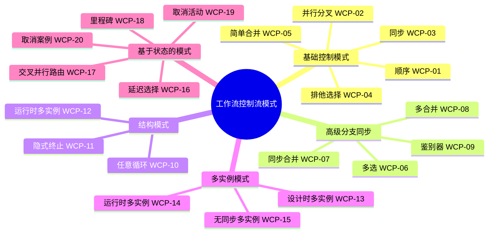
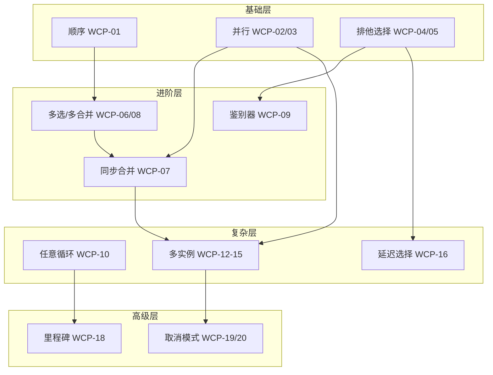
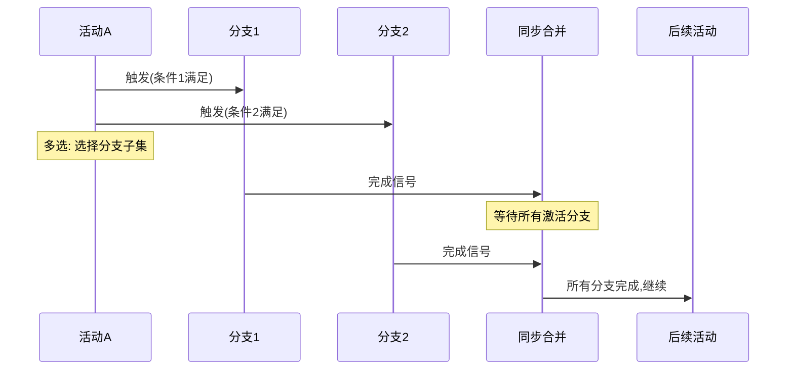

# 工作流控制流模式

> **所属单元**: formal-methods/04-application-layer/01-workflow | **前置依赖**: [03-bpmn-semantics](03-bpmn-semantics.md) | **形式化等级**: L5-L6

## 1. 概念定义 (Definitions)

### Def-A-01-13: 工作流控制流模式

工作流控制流模式是描述业务流程控制流语义的抽象构造。van der Aalst等人定义的43种模式分为5类：

$$\mathcal{P} = \{P_{basic}, P_{advanced\_branch}, P_{struct}, P_{multiple}, P_{state\_based}, P_{cancellation}\}$$

- **基础控制模式** (Basic Control Patterns): 顺序、并行、选择、循环
- **高级分支同步模式** (Advanced Branching): 多选、同步合并、鉴别器等
- **结构模式** (Structural Patterns): 任意循环、隐式终止等
- **多实例模式** (Multiple Instances): 运行时确定实例数
- **基于状态的模式** (State-based): 延迟选择、交叉并行路由
- **取消模式** (Cancellation): 任务/案例取消

### Def-A-01-14: 模式的π-calculus编码框架

π-calculus编码模式使用以下语法框架：

$$P ::= 0 \mid \bar{x}\langle y \rangle.P \mid x(z).P \mid (\nu x)P \mid P|Q \mid !P \mid [b]P$$

其中 $[b]P$ 是条件守卫 (如果 $b$ 为真则执行 $P$)。

### Def-A-01-15: 模式组合算子

模式可通过组合算子构建复杂流程：

- **顺序组合** ($P \gg Q$): $P$ 完成后执行 $Q$
- **并行组合** ($P \parallel Q$): $P$ 和 $Q$ 并发执行
- **选择组合** ($P \lhd b \rhd Q$): 根据条件 $b$ 选择 $P$ 或 $Q$
- **迭代** ($\mu X.P$): 递归执行 $P$

### Def-A-01-16: 模式验证属性

每个模式 $p$ 需要验证：

- **安全性** (Safety): $AG(\neg deadlock \lor intended\_deadlock)$
- **活性** (Liveness): $AF(completion)$
- **正确终止** (Proper Completion): 所有托肯最终到达终止库所
- **无孤立活动** (No Orphan Activities): 每个活动可执行

## 2. 属性推导 (Properties)

### Lemma-A-01-08: 模式闭包性

π-calculus编码的工作流模式在并行组合下封闭：

$$P, Q \in \mathcal{P}_{encodable} \Rightarrow P|Q \in \mathcal{P}_{encodable}$$

**证明概要**: π-calculus的并行组合保持进程可执行性。

### Lemma-A-01-09: 模式层次关系

某些模式可以编码其他模式：

$$P_{multi\_merge} \succeq P_{synchronizing\_merge} \succeq P_{simple\_merge}$$

即多合并模式表达力 $\geq$ 同步合并 $\geq$ 简单合并。

### Prop-A-01-04: 模式的完备性

43种控制流模式在表达力上是完备的：

$$\forall \text{ control-flow } C: \exists \vec{P} \in \mathcal{P}^{*}: encode(\vec{P}) \approx C$$

任何控制流都可由模式组合表达。

### Lemma-A-01-10: π-calculus编码的语义保持

若模式 $P$ 编码为π-calculus进程 $E(P)$，则：

$$P \xrightarrow{a} P' \iff E(P) \xrightarrow{\bar{a}} E(P')$$

**证明**: 对模式结构归纳，编码函数保持转移关系。

## 3. 关系建立 (Relations)

### 3.1 模式分类与形式化方法对应

```
┌────────────────────┬──────────────────┬──────────────────┐
│     模式类别        │     π-calculus   │    Petri网       │
├────────────────────┼──────────────────┼──────────────────┤
│ 基础控制模式        │ 顺序/并行/选择   │ 顺序/AND/XOR     │
│ 高级分支同步        │ 通道同步         │ 复杂网关构造     │
│ 结构模式            │ 递归定义         │ 循环子网         │
│ 多实例模式          │ 复制构造 !P      │ 有色托肯         │
│ 基于状态的模式      │ 延迟输入         │ 触发器库所       │
│ 取消模式            │ kill通道         │ 重置弧           │
└────────────────────┴──────────────────┴──────────────────┘
```

### 3.2 BPMN 2.0与模式支持

| 模式 | BPMN 2.0支持 | 实现元素 | 形式化复杂度 |
|-----|-------------|---------|------------|
| 顺序 (WCP-01) | ✓ 完全 | 顺序流 | 简单 |
| 并行分叉 (WCP-02) | ✓ 完全 | 并行网关 | 简单 |
| 同步 (WCP-03) | ✓ 完全 | 并行网关 | 简单 |
| 排他选择 (WCP-04) | ✓ 完全 | 排他网关 | 简单 |
| 简单合并 (WCP-05) | ✓ 完全 | 排他网关 | 简单 |
| 多选 (WCP-06) | ✓ 完全 | 包容网关 | 中等 |
| 同步合并 (WCP-07) | △ 部分 | 复杂网关 | 复杂 |
| 多合并 (WCP-08) | ✓ 完全 | 包容网关 | 中等 |
| 鉴别器 (WCP-09) | ✗ 无 | 需扩展 | 复杂 |
| 任意循环 (WCP-10) | ✓ 完全 | 循环标记 | 中等 |

### 3.3 YAWL与模式的原生支持

YAWL (Yet Another Workflow Language) 是专门为支持全部43种模式设计的：

```
YAWL原语:
├── 任务 (Task)
│   ├── 原子任务
│   ├── 复合任务 (嵌套网)
│   └── 多实例任务
├── 条件 (Condition)
│   ├── 输入条件
│   ├── 输出条件
│   └── 内部条件
├── 流 (Flow)
│   ├── 默认流
│   ├── 条件流
│   └── 取消流
└── 扩展:
    ├── OR-join (同步合并)
    ├── 鉴别器
    └── 多实例同步
```

## 4. 论证过程 (Argumentation)

### 4.1 43种模式完整分类

**基础控制模式** (WCP-01 ~ WCP-05):

| 编号 | 模式名称 | 描述 | 常见度 |
|-----|---------|------|--------|
| WCP-01 | Sequence | 顺序执行 | 100% |
| WCP-02 | Parallel Split | 并行分叉 | 100% |
| WCP-03 | Synchronization | 并行汇合 | 100% |
| WCP-04 | Exclusive Choice | 排他选择 | 100% |
| WCP-05 | Simple Merge | 简单合并 | 100% |

**高级分支与同步模式** (WCP-06 ~ WCP-09):

| 编号 | 模式名称 | 描述 | 支持度 |
|-----|---------|------|--------|
| WCP-06 | Multi-Choice | 多选（选择子集） | 高 |
| WCP-07 | Structured Synchronizing Merge | 同步合并 | 中 |
| WCP-08 | Multi-Merge | 多合并 | 高 |
| WCP-09 | Structured Discriminator | 鉴别器（第一完成触发） | 低 |

**结构模式** (WCP-10 ~ WCP-12):

| 编号 | 模式名称 | 描述 |
|-----|---------|------|
| WCP-10 | Arbitrary Cycles | 任意循环 |
| WCP-11 | Implicit Termination | 隐式终止 |
| WCP-12 | Multiple Instances (no prior runtime knowledge) | 运行时确定实例数 |

**多实例模式** (WCP-13 ~ WCP-15):

| 编号 | 模式名称 | 描述 |
|-----|---------|------|
| WCP-13 | Multiple Instances (design time knowledge) | 设计时确定实例数 |
| WCP-14 | Multiple Instances (runtime knowledge) | 运行时确定实例数 |
| WCP-15 | Multiple Instances (no sync) | 多实例无同步 |

**基于状态的模式** (WCP-16 ~ WCP-20):

| 编号 | 模式名称 | 描述 |
|-----|---------|------|
| WCP-16 | Deferred Choice | 延迟选择 |
| WCP-17 | Interleaved Parallel Routing | 交叉并行路由 |
| WCP-18 | Milestone | 里程碑 |
| WCP-19 | Cancel Activity | 取消活动 |
| WCP-20 | Cancel Case | 取消案例 |

**取消和强制完成模式** (WCP-21 ~ WCP-43) 包含更高级的特性如：

- 强制完成 (Complete Case)
- 强制失败 (Force Failure)
- 阻塞读 (Blocking Read)
- 同步接受 (Synchronized Accept)

### 4.2 模式选择复杂度

```
模式实现复杂度排序 (从简到繁):

顺序 → 并行分叉 → 并行汇合 → 排他选择 → 简单合并
    ↓
多选 → 多合并 → 任意循环 → 结构化同步合并
    ↓
鉴别器 → 交叉并行路由 → 延迟选择 → 里程碑
    ↓
运行时多实例 → 取消/强制模式 → 完整同步合并
```

## 5. 形式证明 / 工程论证

### 5.1 43种模式的π-calculus编码

#### 基础控制模式编码

**WCP-01: 顺序 (Sequence)**

```
Sequence(A, B) = νc.(A⟨c⟩ | c.B)
```

$A$ 输出完成信号到通道 $c$，触发 $B$。

**WCP-02: 并行分叉 (Parallel Split)**

```
ParallelSplit(A, B, C) = νc1,c2.(A⟨c1,c2⟩ | c1.B | c2.C)
```

$A$ 完成后同时触发 $B$ 和 $C$。

**WCP-03: 同步 (Synchronization)**

```
Synchronization(A, B, C) = νc1,c2.(c1.c2.C + c2.c1.C) | A⟨c1⟩ | B⟨c2⟩
```

等待 $A$ 和 $B$ 都完成后执行 $C$。

**WCP-04: 排他选择 (Exclusive Choice)**

```
ExclusiveChoice(A, B, C, cond) = νc1,c2.
  (A | [cond]c1.B + [¬cond]c2.C)
```

根据条件选择 $B$ 或 $C$。

**WCP-05: 简单合并 (Simple Merge)**

```
SimpleMerge(A, B, C) = νc.(c.C | A⟨c⟩ + B⟨c⟩)
```

$A$ 或 $B$ 任一完成即触发 $C$。

#### 高级分支同步模式编码

**WCP-06: 多选 (Multi-Choice)**

```
MultiChoice(A, Bs, conds) = νcs.
  (A⟨cs⟩ | ∏_{i}( [conds[i]]cs[i].Bs[i] ))
```

根据多个条件选择执行多个分支的子集。

**WCP-07: 同步合并 (Synchronizing Merge)**

```
SynchronizingMerge(Bs, C) = νcs, sync.
  (SyncBarrier(cs, |Bs|)⟨sync⟩ | sync.C | ∏_{i}(Bs[i]⟨cs[i]⟩))

SyncBarrier(cs, n) = 等待n个cs通道信号后输出sync
```

需要知道实际激活的分支数才能正确同步。

**WCP-08: 多合并 (Multi-Merge)**

```
MultiMerge(Bs, C) = νcs.
  (|_{i}(cs[i].C) | ∏_{i}(Bs[i]⟨cs[i]⟩))
```

每个分支完成都独立触发 $C$。

**WCP-09: 鉴别器 (Discriminator)**

```
Discriminator(Bs, C, R) = νcs, done, reset.
  (First(cs)⟨done⟩.done.C.reset.R |
   ∏_{i}(Bs[i]⟨cs[i]⟩))

First(cs) = cs[1].cs[2]...cs[n].重置其他未完成分支
```

第一个完成的分支触发 $C$，其他分支被重置/取消。

#### 结构模式编码

**WCP-10: 任意循环 (Arbitrary Cycles)**

```
ArbitraryCycles(P, Q, backCond) = μX.
  (P ≫ ([backCond]X + [¬backCond](Q ≫ X)))
```

使用递归实现任意循环。

**WCP-11: 隐式终止 (Implicit Termination)**

```
ImplicitTermination(Ps) = νend.
  (∏_{i}Ps[i] | CheckNoActive(Ps)⟨end⟩.0)
```

当无活动可执行时自动终止。

**WCP-12: 运行时多实例**

```
MIRuntime(A, n, B) = νc.
  (A⟨c⟩ | c(x).CreateInstances(x, B))

CreateInstances(n, B) =
  if n > 0 then (B | CreateInstances(n-1, B)) else 0
```

#### 多实例模式编码

**WCP-13: 设计时多实例**

```
MIDesignTime(B, n) = ∏_{i=1}^{n} B_i
```

静态展开 $n$ 个实例。

**WCP-14: 运行时多实例 (已知数)**

```
MIRuntimeKnown(A, B) = νc.
  (A⟨c⟩ | c(n).∏_{i=1}^{n} B_i)
```

**WCP-15: 多实例无同步**

```
MINoSync(A, B, C) = νc.
  (A⟨c⟩ | c(n).∏_{i=1}^{n}(B_i ≫ c_i.done) |
   WaitAny(c_i).C)
```

#### 基于状态的模式编码

**WCP-16: 延迟选择 (Deferred Choice)**

```
DeferredChoice(A, Bs, triggers) = νcs.
  (A ≫ (∏_{i}(trigger[i].cs[i].Bs[i])))
```

等待外部事件决定选择，非预设条件。

**WCP-17: 交叉并行路由**

```
Interleaved(A, B) = νlock.
  (lock.A ≫ lock.B ≫ lock.release |
   lock.B ≫ lock.A ≫ lock.release)
```

$A$ 和 $B$ 必须交叉执行，不能真正并行。

**WCP-18: 里程碑 (Milestone)**

```
Milestone(M, A) = νm.
  (M⟨m⟩ | m.A)
```

$A$ 只能在里程碑 $M$ 达到后执行。

#### 取消模式编码

**WCP-19: 取消活动**

```
CancelActivity(A, cancel) = νdone.
  (A⟨done⟩ + cancel.0 | done.0)
```

**WCP-20: 取消案例**

```
CancelCase(Ps, cancel) = νc.
  (∏_{i}(Ps[i] ≫ c) | cancel.∏_{i}kill_i)
```

### 5.2 模式形式化验证

**验证框架**：

```
模式P的验证:
1. 编码为π-calculus E(P)
2. 转换为标记转移系统 LTS(E(P))
3. 模型检查验证性质:
   - 死锁自由: AG(EX(true))
   - 正确终止: AF(end)
   - 活性: AG(φ → AF(ψ))
```

**验证定理**: 对于每个模式 $P \in \mathcal{P}$，存在有效算法验证其形式化编码的正确性。

**证明**:

1. π-calculus的LTS是有限的（限制递归深度）
2. 使用模型检查器（如MWB）可验证时序逻辑性质
3. 每个模式有特定的验证模式

**示例验证**: 同步模式

```
性质: 两个输入都完成前，输出不会开始
公式: AG((started(A) ∧ started(B)) → AF(started(C)))

验证步骤:
1. 构建LTS
2. 检查所有路径
3. 确认无违反路径
```

## 6. 实例验证 (Examples)

### 6.1 完整流程的模式组合

```
订单处理流程 =
  Sequence(
    ReceiveOrder,
    ParallelSplit(
      CheckInventory,
      VerifyPayment,
      Synchronization(
        CheckInventory,
        VerifyPayment,
        ExclusiveChoice(
          ProcessOrder,
          CancelOrder,
          inventoryOK ∧ paymentOK
        )
      )
    )
  )
```

### 6.2 多选+同步合并实现

```bpmn
[审批请求] → {OR-split} → [经理审批]
                   ↓
              [财务审批]
                   ↓
              [HR审批] → {同步合并} → [归档]
```

π-calculus:

```
Process = νc1,c2,c3,sync.
  (Request ≫ ([needManager]c1.Manager + [needFinance]c2.Finance + [needHR]c3.HR) |
   SyncMerge([c1,c2,c3], sync) ≫ Archive)
```

### 6.3 YAWL实现示例

```xml
<task id="t1" name="MultiChoiceExample">
  <split type="OR">
    <condition expression="amount > 1000" target="t2"/>
    <condition expression="urgent == true" target="t3"/>
    <condition expression="vip == true" target="t4"/>
  </split>
</task>

<task id="t5" name="SyncMerge">
  <join type="OR"/>
</task>
```

### 6.4 模式验证工具代码

```python
# 使用pycsp验证模式
from pycsp import *

@process
def sequence(A, B, C):
    A()
    B()
    C()

@process
def parallel_split(A, B, C):
    A()
    Parallel(B(), C())

@process
def synchronizing_merge(A, B, C):
    c1, c2 = Channel(), Channel()
    Parallel(
        A() >> c1.write,
        B() >> c2.write,
        c1.read() >> c2.read() >> C()
    )

# 验证死锁自由
def verify_deadlock_freedom(process):
    """检查进程是否死锁自由"""
    # 使用CSP/FDR模型检查
    pass
```

## 7. 可视化 (Visualizations)

### 7.1 43种工作流模式全景



### 7.2 模式关系层次图



### 7.3 π-calculus编码模式

```mermaid
flowchart TD
    A[工作流模式] --> B{模式类型}
    B -->|顺序| C[Sequence A≫B]
    B -->|并行| D[Parallel A|B]
    B -->|选择| E[Choice A+B]
    B -->|同步| F[Barrier c1.c2.C]
    B -->|递归| G[Recursion μX.P]
    B -->|复制| H[Replication !P]

    C --> I[π-calculus进程]
    D --> I
    E --> I
    F --> I
    G --> I
    H --> I

    I --> J[模型检查]
    J --> K[验证性质]
    K -->|安全| L[无死锁]
    K -->|活性| M[必完成]
```

### 7.4 同步合并模式详细



## 8. 引用参考 (References)
