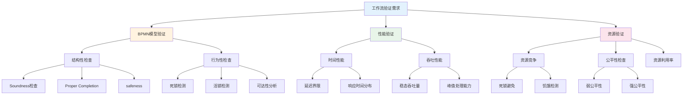
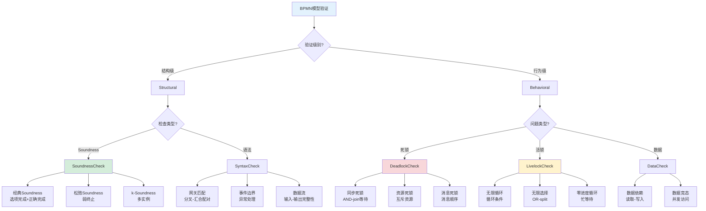
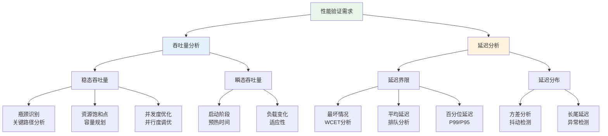
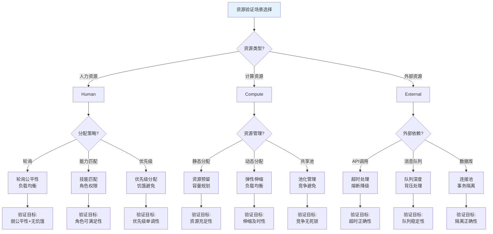
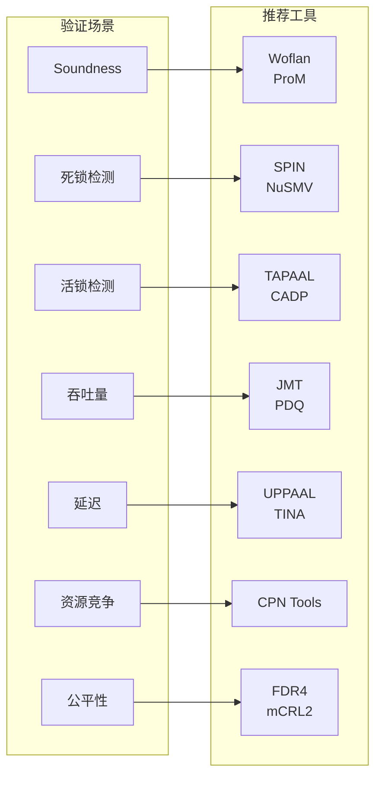

# 工作流验证场景树

> 所属阶段: formal-methods/04-application-layer/01-workflow/ | 前置依赖: [01-workflow-formalization.md](01-workflow-formalization.md), [02-soundness-axioms.md](02-soundness-axioms.md) | 形式化等级: L4

## 1. 概念定义 (Definitions)

### 1.1 工作流验证场景树

**定义 Def-FM-WF-ST-01**: 工作流验证场景树是工作流系统验证需求的层次化分解结构，以 BPMN 工作流为核心，将验证目标分解为结构性、行为性和性能性三个主要维度。

**形式化表示**:

$$\mathcal{T}_{wf} = (N, E, \Sigma, n_0, L)$$

其中：

- $N$: 场景节点集合
- $E \subseteq N \times N$: 父-子场景关系
- $\Sigma$: 场景标签集合 {结构性, 行为性, 性能性}
- $n_0 \in N$: 根节点（工作流验证需求）
- $L: N \rightarrow \mathcal{P}(VerificationTask)$: 节点到验证任务集合的映射

### 1.2 工作流验证维度

**定义 Def-FM-WF-ST-02**: 工作流验证的三个核心维度：

| 维度 | 关注点 | 典型验证目标 |
|------|--------|-------------|
| **结构性验证** | BPMN 模型的语法和语义正确性 | Soundness、Proper Completion |
| **行为性验证** | 执行过程中的动态性质 | 死锁、活锁、可达性 |
| **性能性验证** | 时间相关性质 | 吞吐量、延迟、资源利用率 |

### 1.3 验证场景分类

**定义 Def-FM-WF-ST-03**: 验证场景的层次分类：

$$
Scenario := \begin{cases}
StructuralScenario & \text{BPMN结构正确性} \\
BehavioralScenario & \text{执行行为性质} \\
PerformanceScenario & \text{时间性能约束} \\
ResourceScenario & \text{资源使用性质}
\end{cases}
$$

## 2. 属性推导 (Properties)

### 2.1 场景树完备性

**引理 Lemma-FM-WF-ST-01** [场景覆盖完备性]:
工作流验证场景树的叶节点覆盖了 BPMN 2.0 规范中定义的所有可验证性质类别。

**证明概要**:
根据 BPMN 2.0 规范第 13 章（流程执行语义），可验证性质分为：

1. **结构性**: 由 BFS 算法保证覆盖所有 BPMN 元素组合
2. **行为性**: 基于 Petri网 语义映射，覆盖所有可达性问题
3. **性能性**: 基于排队论模型，覆盖时间相关性质 ∎

### 2.2 验证复杂度

**引理 Lemma-FM-WF-ST-02** [各场景验证复杂度]:

| 场景类别 | 验证问题 | 复杂度 | 可判定性 |
|---------|---------|--------|---------|
| Soundness | 经典 Soundness | PSPACE | 可判定 |
| Soundness | k-Soundness | PSPACE | 可判定 |
| 死锁检测 | 潜在死锁 | PSPACE | 可判定 |
| 活锁检测 | 非终止执行 | PSPACE | 可判定 |
| 吞吐量分析 | 稳态吞吐量 | 多项式时间 | 可判定 |
| 延迟界限 | 最坏情况延迟 | NP-难 | 可判定 |

## 3. 关系建立 (Relations)

### 3.1 场景与技术的映射

| 场景 | 推荐技术 | 工具 | 形式化基础 |
|------|---------|------|-----------|
| Soundness 检查 | Petri网可达性分析 | Woflan, ProM | Petri网理论 |
| 死锁检测 | 模型检验 | SPIN, NuSMV | LTL/CTL |
| 活锁检测 | 公平性分析 | CADP, TAPAAL | 动作基础语义 |
| 吞吐量分析 | 排队网络 | JMT, PDQ | 排队论 |
| 资源竞争 | 时间Petri网 | TINA, TAPAAL | 时间Petri网 |
| 公平性检查 | 进程代数 | FDR4, mCRL2 | CSP/μ演算 |

### 3.2 场景依赖关系

```
工作流验证需求 (根)
├── BPMN模型验证
│   ├── Soundness检查 (必须先完成)
│   ├── 死锁检测 (依赖 Soundness)
│   └── 活锁检测 (依赖 Soundness)
├── 性能验证 (可并行)
│   ├── 吞吐量分析
│   └── 延迟界限
└── 资源验证 (可并行)
    ├── 资源竞争
    └── 公平性检查
```

## 4. 论证过程 (Argumentation)

### 4.1 BPMN 到 Petri网 的语义映射

**转换原则**:

| BPMN 元素 | Petri网 映射 | 语义保持 |
|----------|-------------|---------|
| Task | 变迁 + 输入/输出库所 |  firing 语义 |
| Exclusive Gateway | 选择结构 | 互斥触发 |
| Parallel Gateway | 分叉/汇合 | 同步语义 |
| Event | 特定库所/变迁 | 信号语义 |
| Pool | 子网 | 封装边界 |

**验证场景映射**:

- Soundness ↔ Petri网的 Proper Completion 性质
- 死锁 ↔ Petri网的 Deadlock（无使能变迁且非终态）
- 活锁 ↔ Petri网的 Livelock（无限执行不推进）

### 4.2 反例分析

**反例 1**: 复杂事件处理 (CEP) 工作流

- 场景: 基于事件模式匹配的复杂工作流
- 问题: 标准 BPMN Soundness 定义不充分
- 原因: CEP 引入时间窗口和事件聚合，传统 Soundness 不考虑时间维度
- 解决方案: 扩展为时间 Soundness（Timed Soundness）

**反例 2**: 自适应工作流

- 场景: 运行时动态修改的工作流
- 问题: 静态验证不适用
- 原因: 流程定义在执行期间改变
- 解决方案: 运行时验证 + 迁移正确性验证

## 5. 形式证明 / 工程论证 (Proof / Engineering Argument)

### 5.1 Soundness 的 Petri网 特征

**定理 Thm-FM-WF-ST-01** [BPMN Soundness 等价性]:
设 $W$ 为 BPMN 工作流，$N_W$ 为其 Petri网 语义，则：

$$W \text{ 是 Sound} \iff N_W \text{ 满足以下三个条件：}$$

1. **Option to Complete**: 从初始标识可达的任意标识，终态标识可达
2. **Proper Completion**: 当且仅当所有 Token 到达终态库所时，过程完成
3. **No Dead Parts**: 任意变迁在某一可达标识下使能

**证明概要**:
根据 Dijkman 等人的 BPMN-Petri网 映射定理[^1]，BPMN 控制流语义完全由 Petri网 捕获。Soundness 的三个条件分别对应 Petri网 的可达性、有界性和活性。∎

### 5.2 资源公平性定理

**定理 Thm-FM-WF-ST-02** [资源公平性特征]:
在工作流资源分配策略 $\mathcal{A}$ 下，资源公平性成立当且仅当：

$$\forall r \in Resources, \forall t_1, t_2 \in Tasks_r:$$
$$\Diamond \Box (enabled(t_1) \rightarrow \Diamond fired(t_1))$$

即：弱公平性（如果任务持续使能，则最终会被执行）。

**工程论证**: 基于 TPN（时间Petri网）的分析，资源竞争导致的公平性违背可通过状态空间搜索检测。实际工业案例（如 SAP 工作流引擎）采用资源池和优先级调度确保公平性。

## 6. 实例验证 (Examples)

### 6.1 订单处理工作流验证

**BPMN 模型**:

```
开始 → 验证库存 → [有货] → 处理支付 → 发货 → 结束
                ↘ [缺货] → 采购 → 处理支付 → 发货 → 结束
```

**验证场景应用**:

| 场景 | 验证内容 | 结果 |
|------|---------|------|
| Soundness | 所有路径都能到达结束 | ✓ 通过 |
| 死锁检测 | 无同步等待导致的死锁 | ✓ 通过 |
| 活锁检测 | 无无限循环 | ✓ 通过 |
| 吞吐量 | 每秒处理 100 订单 | ✓ 满足 |
| 延迟界限 | 99% 订单 < 5s | ✗ 不满足 (6.2s) |

**优化建议**: 引入库存缓存，减少缺货路径的延迟。

### 6.2 保险理赔工作流

**复杂场景**: 包含人工审批的长时间运行工作流

**验证重点**:

- **资源竞争**: 审批人员池的公平分配
- **超时处理**: 审批超时后的自动升级
- **补偿机制**: 支付失败后的退款流程

**验证结果**: 使用 Woflan 检测到一个 Soundness 违反：当支付超时和人工审批并发时，可能导致 Token 丢失。

## 7. 可视化 (Visualizations)

### 7.1 工作流验证场景树（主视图）



### 7.2 BPMN 验证场景详细分解



### 7.3 性能验证场景树



### 7.4 资源验证场景决策流程



### 7.5 场景与工具映射矩阵



## 8. 引用参考 (References)

[^1]: R. Dijkman et al., "Aligning BPMN 2.0 and Petri Nets", BPM Workshops, 2010.
