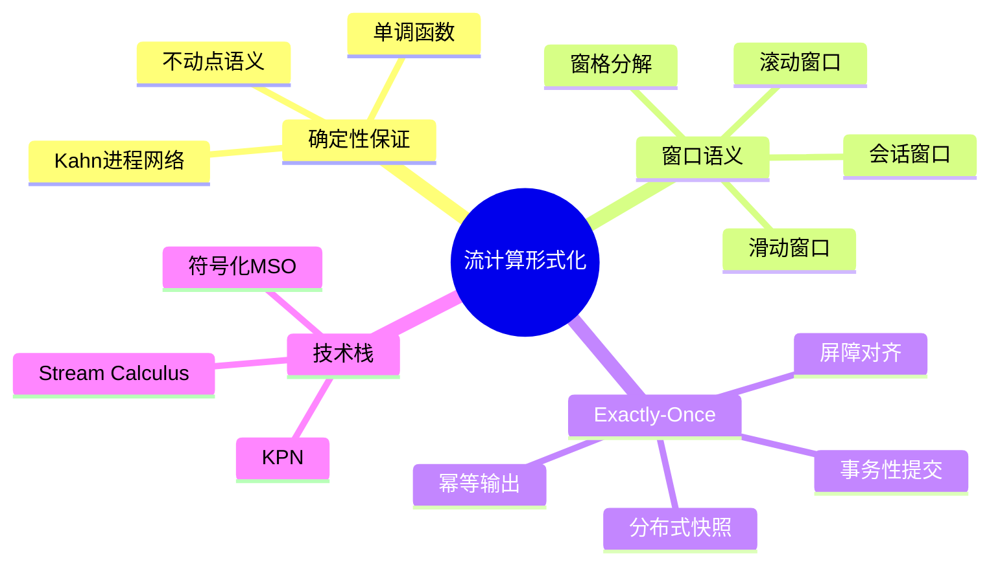
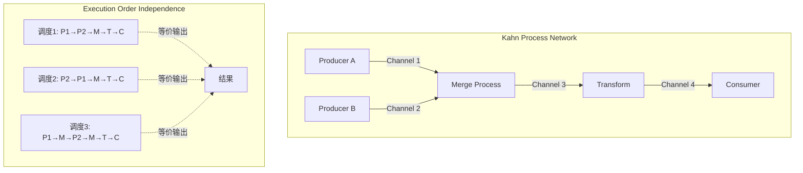
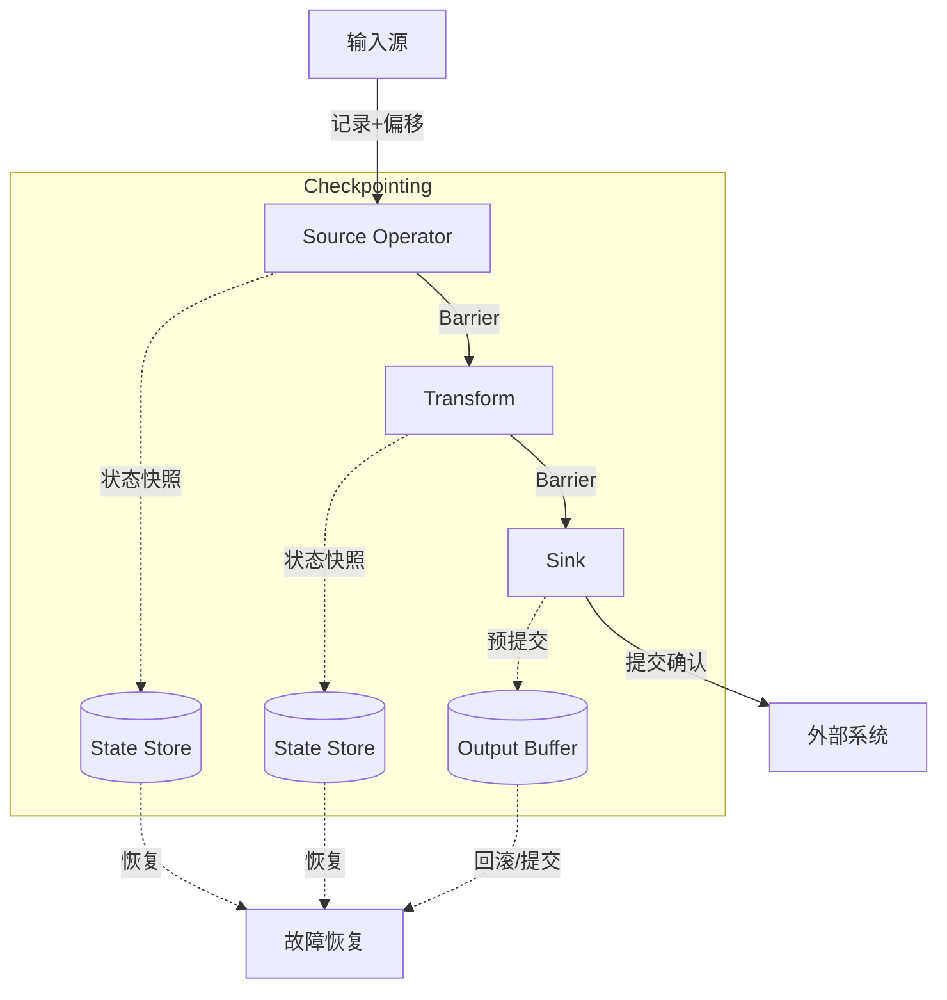

# 流计算系统形式化目标与技术栈

> **所属单元**: formal-methods/04-application-layer/02-stream-processing | **前置依赖**: [formal-methods/03-distributed-systems/01-time-and-order](../../03-distributed-systems/01-time-and-order.md) | **形式化等级**: L4-L5

## 1. 概念定义 (Definitions)

### Def-A-02-01: 流计算系统 (Stream Processing System)

流计算系统是一个六元组 $\mathcal{S} = (\mathcal{O}, \mathcal{F}, \mathcal{W}, \Sigma, \tau, \Gamma)$，其中：

- $\mathcal{O}$: 有向无环图 (DAG) 表示的操作符拓扑，顶点为操作符，边为数据流
- $\mathcal{F}$: 操作符函数集合，$f \in \mathcal{F}$ 表示转换函数 $f: Stream(A) \rightarrow Stream(B)$
- $\mathcal{W}$: 窗口策略，定义时间/计数窗口的触发和回收
- $\Sigma$: 状态空间，记录操作符的中间计算结果
- $\tau$: 时间模型，可为事件时间 (event-time) 或处理时间 (processing-time)
- $\Gamma$: 一致性保证级别，如 At-Most-Once、At-Least-Once、Exactly-Once

### Def-A-02-02: Kahn进程网络 (Kahn Process Network, KPN)

KPN是一个计算模型 $\mathcal{K} = (P, C)$，其中：

- $P = \{p_1, p_2, ..., p_n\}$: 进程集合
- $C \subseteq P \times P$: 通道 (channel) 集合，表示单向FIFO连接

每个进程 $p_i$ 是一个连续函数：

$$p_i: \prod_{j \in In(i)} Stream(A_j) \rightarrow \prod_{k \in Out(i)} Stream(B_k)$$

满足**单调性**: 输入流的扩展导致输出流的扩展（非严格扩展）。

### Def-A-02-03: 确定性保证 (Determinism Guarantee)

流计算系统 $\mathcal{S}$ 是**确定的**，当且仅当对于任意输入流 $I$ 和配置 $C$：

$$\forall I_1 = I_2: \mathcal{S}(I_1, C) = \mathcal{S}(I_2, C)$$

即相同输入产生相同输出，与执行调度无关。

### Def-A-02-04: 窗口语义 (Window Semantics)

窗口是一个四元组 $\mathcal{W} = (T, P, E, F)$：

- $T$: 时间域 (discrete 或 continuous)
- $P: T \rightarrow 2^T$: 窗格 (pane) 分配函数，将时间戳映射到窗口集合
- $E: \mathcal{W} \times Event \rightarrow \{Trigger,\; Ignore\}$: 触发策略
- $F: 2^{Event} \rightarrow Result$: 聚合函数

窗口类型定义：

- **滚动窗口 (Tumbling)**: $P(t) = \{\lfloor t/w \rfloor \cdot w\}$，不重叠
- **滑动窗口 (Sliding)**: $P(t) = \{k \cdot s \mid k \cdot s \leq t < k \cdot s + w\}$，步长 $s$，大小 $w$
- **会话窗口 (Session)**: $P(t)$ 由超时阈值 $\delta$ 动态确定，间隙 $> \delta$ 时关闭

### Def-A-02-05: Exactly-Once语义

Exactly-Once处理语义要求对于每条输入记录 $e$：

$$|\{o \in Output \mid cause(o) = e\}| = 1$$

其中 $cause(o) = e$ 表示输出 $o$ 由输入 $e$ 因果导致。

形式化上，需要满足：

- **幂等性 (Idempotency)**: 重复处理不产生副作用
- **事务性输出 (Transactional Output)**: 输出与状态更新原子提交
- **可重放性 (Replayability)**: 失败时可从检查点重放

## 2. 属性推导 (Properties)

### Lemma-A-02-01: KPN的确定性

任何Kahn进程网络都是确定的。

**证明概要**:

- 进程函数单调 $\Rightarrow$ 组合函数单调
- 单调连续函数在CPO上有唯一最小不动点
- 该不动点即为网络语义，与求值顺序无关

### Lemma-A-02-02: 窗口分配函数的性质

对于任意窗口分配函数 $P$：

$$\forall t \in T: |P(t)| \leq \omega$$

其中 $\omega$ 是最大并发窗口数。对于：

- 滚动窗口: $\omega = 1$
- 滑动窗口: $\omega = \lceil w/s \rceil$
- 会话窗口: $\omega$ 无界（理论上）

### Prop-A-02-01: Exactly-Once与检查点的关系

若流计算系统实现**分布式快照** (Chandy-Lamport) 作为检查点机制，则：

$$\text{Exactly-Once} \iff \text{幂等输出} \land \text{屏障对齐}$$

**证明概要**:

- ($\Rightarrow$): Exactly-Once要求失败重放不重复输出，即幂等；屏障对齐确保状态一致性
- ($\Leftarrow$): 幂等保证重复安全，屏障对齐保证快照一致性，结合可得Exactly-Once

### Lemma-A-02-03: Stream Calculus的组合性

Stream Calculus操作符满足以下代数定律：

1. **映射融合**: $map(f) \circ map(g) = map(f \circ g)$
2. **过滤交换**: $filter(p) \circ filter(q) = filter(q) \circ filter(p)$
3. **窗口分配结合**: $window(w_1) \cdot window(w_2) = window(w_1 \circ w_2)$（当复合有意义时）

## 3. 关系建立 (Relations)

### 3.1 流计算模型对比

**工业实现**: [Apache Flink形式化模型](./04-flink-formalization.md) - Flink计算模型与Exactly-Once语义的形式化定义

| 特性 | KPN | Dataflow | Actor模型 | Stream Calculus |
|-----|-----|----------|----------|----------------|
| 确定性 | 是 | 配置决定 | 否 | 是 |
| 阻塞语义 | 读阻塞 | 令牌驱动 | 消息驱动 | 惰性求值 |
| 动态拓扑 | 否 | 有限 | 是 | 否 |
| 时间语义 | 无 | 显式 | 隐式 | 显式 |
| 实现代表 | 仿真器 | Flink, Spark | Akka, Orleans | StreamIt |

### 3.2 符号化MSO与流查询

 monadic second-order logic (MSO) 可用于表达流查询：

$$\phi(x) = \exists y: y < x \land P_a(y) \land \forall z: (y < z < x) \rightarrow P_b(z)$$

表示"存在 $a$ 在 $x$ 之前，且其间只有 $b$"。

Stream Calculus操作符与MSO的对应：

| 操作符 | MSO表达式 |
|-------|----------|
| $filter(\phi)$ | $\{x \mid \phi(x)\}$ |
| $map(f)$ | 无直接对应（改变值域）|
| $window(k)$ | 有限上下文MSO |
| $aggregate(g)$ | 聚合谓词 |

### 3.3 窗口语义与SQL扩展

流SQL扩展（如 CQL, StreamSQL）的窗口语义可映射到形式化定义：

```sql
SELECT AVG(price) FROM Trades
GROUP BY TUMBLE(timestamp, INTERVAL '1' MINUTE)
```

对应形式化：

- $P(t) = \{\lfloor t/60 \rfloor \cdot 60\}$
- $F = avg$
- $E = \text{水印触发}$

## 4. 论证过程 (Argumentation)

### 4.1 时间模型的形式化

**事件时间** (Event Time): 记录产生时的时间戳 $\tau_e: Event \rightarrow \mathbb{T}$

**处理时间** (Processing Time): 记录被处理时的时间戳 $\tau_p: Event \rightarrow \mathbb{T}$

**时间偏序关系**:

$$e_1 \prec e_2 \iff \tau_e(e_1) < \tau_e(e_2)$$

**乱序到达**:

$$disorder = \max_{e \in Buffer} (\tau_p(e) - \tau_e(e))$$

### 4.2 Watermark的形式化

Watermark是事件时间的下界估计：

$$W(t_p) = \min_{e \in InFlight} \tau_e(e) - \delta$$

其中 $\delta$ 是允许的最大乱序延迟。

**Watermark完备性**:

$$\forall e: \tau_e(e) \leq W(t_p) \Rightarrow e \text{ 已到达}$$

### 4.3 Exactly-Once实现策略对比

| 策略 | 机制 | 延迟 | 吞吐 | 复杂度 |
|-----|------|------|------|--------|
| 至少一次+幂等 | 去重键 | 低 | 高 | 中 |
| 事务性输出 | 两阶段提交 | 中 | 中 | 高 |
| 分布式快照 | Chandy-Lamport | 中 | 中 | 中 |
| 精确一次日志 | WAL+偏移 | 低 | 高 | 中 |

## 5. 形式证明 / 工程论证

### 5.1 KPN确定性定理证明

**定理**: Kahn进程网络具有确定性的输入-输出行为。

**证明**:

设 $\mathcal{K} = (P, C)$ 为KPN，$Streams$ 为有限和无限序列的CPO。

**步骤1**: 定义进程语义

每个进程 $p_i$ 是连续函数：

$$[\![p_i]\!]: \prod_{j \in In(i)} Streams \rightarrow \prod_{k \in Out(i)} Streams$$

**步骤2**: 组合函数构造

整体网络函数 $F: Streams^{|In|} \rightarrow Streams^{|Out|}$ 通过以下不动点方程定义：

$$F(in) = \mu \lambda out. \Phi(in, out)$$

其中 $\Phi$ 组合所有进程函数，将输入流和反馈流映射到输出流。

**步骤3**: 不动点存在唯一性

由于：

- $Streams$ 是CPO（以前缀序）
- 每个进程函数单调连续
- 连续函数的组合连续

由Kleene不动点定理，存在唯一最小不动点。

**步骤4**: 调度无关性

任何合法调度（满足FIFO和阻塞读）都收敛到同一不动点，因为：

- 单调性保证部分结果可扩展
- 连续性保证极限存在

因此输出与调度无关，系统确定。

### 5.2 窗口语义的一致性

**定理**: 对于任意输入流，窗口分配产生不相交或可合并的结果集。

**证明**: 根据窗口类型：

*滚动窗口*:

- $P(t_1) \cap P(t_2) \neq \emptyset \Rightarrow P(t_1) = P(t_2)$
- 窗口互不重叠，结果自然不相交

*滑动窗口*:

- 重叠窗口的结果需通过窗格分解合并
- 窗格 $pane(w, t)$ 是可组合的monoid

*会话窗口*:

- 动态边界确保间隙分隔
- 超时后窗口关闭，结果确定

## 6. 实例验证 (Examples)

### 6.1 KPN示例：生产者-消费者

```python
# 生产者进程
def producer():
    n = 0
    while True:
        yield n
        n += 1

# 消费者进程
def consumer(input_stream):
    for x in input_stream:
        yield x * 2

# KPN组合
channel = []
prod = producer()
cons = consumer(channel)
```

### 6.2 Stream Calculus表达式

```haskell
-- 过滤并映射
stream2 = map (*2) (filter (>10) stream1)

-- 窗口聚合
windowed = tumblingWindow 60 (aggregate avg) trades

-- 多流连接
joined = joinByKey streamA streamB 300  -- 300秒窗口
```

### 6.3 Exactly-Once检查点实现

```java
// Flink风格的Barrier处理
class ExactlyOnceOperator {
    void processElement(Element e) {
        state.update(e);
        output.collect(transform(e));
    }

    void processBarrier(Barrier b) {
        // 异步快照状态
        snapshotState(b.checkpointId);
        // 向下游传播barrier
        output.broadcast(b);
    }

    void snapshotState(long checkpointId) {
        // 状态写入持久存储
        stateBackend.asyncSnapshot(state, checkpointId);
    }
}
```

## 7. 可视化 (Visualizations)

### 7.1 流计算形式化技术栈



### 7.2 KPN拓扑与执行模型



### 7.3 窗口类型对比

```mermaid
gantt
    title 窗口类型时间线图
    dateFormat X
    axisFormat %s

    section 滚动窗口
    Window 1      :0, 10
    Window 2      :10, 20
    Window 3      :20, 30

    section 滑动窗口 (50%)
    Window 1      :0, 10
    Window 2      :5, 15
    Window 3      :10, 20
    Window 4      :15, 25

    section 会话窗口
    Session A     :0, 7
    Session B     :12, 18
    Session C     :25, 30
```



### 7.4 Exactly-Once实现架构



## 8. 引用参考 (References)
