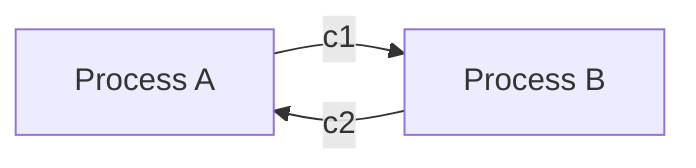
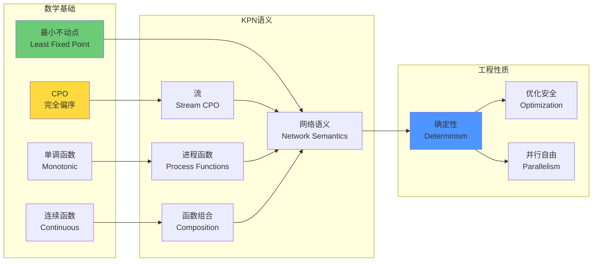
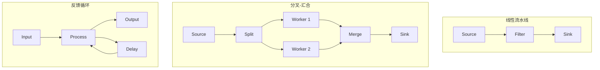

# Kahn不动点定理详解

> **所属单元**: formal-methods/04-application-layer/02-stream-processing | **前置依赖**: [01-stream-formalization](./01-stream-formalization.md) | **形式化等级**: L5-L6

## 1. 概念定义 (Definitions)

### Def-A-02-01: CPO (Complete Partial Order)

偏序集 $(D, \sqsubseteq)$ 是**完全偏序** (CPO)，当且仅当：

- $D$ 有最小元 $\bot$（底部）
- $D$ 中任意递增链 $d_0 \sqsubseteq d_1 \sqsubseteq d_2 \sqsubseteq ...$ 都有上确界（最小上界）

$$\bigsqcup_{i \geq 0} d_i \in D$$

### Def-A-02-02: 单调函数 (Monotonic Function)

函数 $f: D \rightarrow D$ 是**单调的**，当且仅当：

$$\forall x, y \in D: x \sqsubseteq y \Rightarrow f(x) \sqsubseteq f(y)$$

### Def-A-02-03: 连续函数 (Continuous Function)

函数 $f: D \rightarrow D$ 是**连续的**，当且仅当：

- $f$ 是单调的
- $f$ 保持上确界：$f(\bigsqcup_{i \geq 0} d_i) = \bigsqcup_{i \geq 0} f(d_i)$

### Def-A-02-04: 流 (Stream)

在域 $A$ 上的流是 $A^\infty = A^* \cup A^\omega$，其中：

- $A^*$: 有限序列集合
- $A^\omega$: 无限序列集合

流的CPO结构：

- 序关系 $\sqsubseteq$: 前缀序，$s \sqsubseteq t$ 当且仅当 $s$ 是 $t$ 的前缀
- 最小元 $\bot$: 空序列 $\epsilon$
- 上确界: 链的极限（有限或无限序列）

### Def-A-02-05: 不动点 (Fixed Point)

元素 $x \in D$ 是函数 $f: D \rightarrow D$ 的**不动点**，当且仅当：

$$f(x) = x$$

**最小不动点** (Least Fixed Point, LFP) 是不动点集合中的最小元：

$$\text{lfp}(f) = \bigsqcup_{n \geq 0} f^n(\bot)$$

## 2. 属性推导 (Properties)

### Lemma-A-02-01: 流的CPO性质

$(A^\infty, \sqsubseteq)$ 是一个CPO。

**证明**:

- 最小元：空序列 $\epsilon$
- 链的上确界：对于递增链 $s_0 \sqsubseteq s_1 \sqsubseteq ...$，定义 $s = \lim_{i \to \infty} s_i$：
  - 若链稳定（存在 $n$ 使得 $s_n = s_{n+1} = ...$），则 $s = s_n \in A^*$
  - 否则，$s$ 是无限序列，$s \in A^\omega$

### Lemma-A-02-02: 单调性蕴含链保持

若 $f$ 单调，则对于任意链 $\{d_i\}$，$\{f(d_i)\}$ 也是链。

**证明**:
由 $d_i \sqsubseteq d_{i+1}$ 和单调性，$f(d_i) \sqsubseteq f(d_{i+1})$。

### Lemma-A-02-03: 连续性蕴含单调性

$$f \text{ 连续} \Rightarrow f \text{ 单调}$$

**证明**: 取链 $x \sqsubseteq y \sqsubseteq y \sqsubseteq ...$，其上确界为 $y$。由连续性：

$$f(y) = f(\bigsqcup \{x, y\}) = \bigsqcup \{f(x), f(y)\}$$

故 $f(x) \sqsubseteq f(y)$。

### Prop-A-02-01: Kleene链收敛性

对于连续函数 $f$，Kleene链 $\{f^n(\bot)\}_{n \geq 0}$ 是递增链：

$$\bot \sqsubseteq f(\bot) \sqsubseteq f^2(\bot) \sqsubseteq ...$$

**证明**: 归纳法。

- 基础：$\bot \sqsubseteq f(\bot)$ 因 $\bot$ 是最小元
- 归纳：若 $f^n(\bot) \sqsubseteq f^{n+1}(\bot)$，则 $f^{n+1}(\bot) \sqsubseteq f^{n+2}(\bot)$ 由单调性

## 3. 关系建立 (Relations)

### 3.1 KPN到不动点语义的映射

| KPN概念 | 不动点语义概念 | 对应关系 |
|--------|--------------|---------|
| 进程 $p$ | 连续函数 $f_p$ | 进程语义即函数 |
| 通道 | 流值 $s \in A^\infty$ | 流的CPO |
| 网络执行 | 函数组合 | $F = f_n \circ ... \circ f_1$ |
| 网络语义 | 最小不动点 | $\text{lfp}(F)$ |
| 阻塞读 | 严格性分析 | 函数严格性决定阻塞点 |

### 3.2 推理链：单调 → 连续 → 不动点 → 确定性

```
┌─────────────┐    ┌─────────────┐    ┌─────────────┐    ┌─────────────┐
│   单调性     │ → │   连续性     │ → │   不动点     │ → │   确定性     │
│ Monotonicity │    │ Continuity  │    │ Fixed Point │    │ Determinism │
└─────────────┘    └─────────────┘    └─────────────┘    └─────────────┘
       │                  │                  │                  │
       ▼                  ▼                  ▼                  ▼
  前缀保持            极限保持            唯一语义           调度无关
  Prefix              Limit               Unique             Schedule
  Preserving          Preserving          Semantics          Independent
```

### 3.3 与其他并发模型的关系

| 模型 | 确定性 | 不动点语义 | 表达能力 |
|-----|-------|-----------|---------|
| KPN | 是 | 直接应用 | 有界非确定性 |
| Dataflow | 配置决定 | 带控制令牌 | 更丰富 |
| CSP | 否 | 失败语义 | 外部选择 |
| Actor | 否 | 无标准不动点 | 动态拓扑 |

## 4. 论证过程 (Argumentation)

### 4.1 函数严格性分析

函数 $f: A^\infty \rightarrow B^\infty$ 是**严格的**，当且仅当：

$$f(\bot) = \bot$$

即需要输入才能产生输出。

在KPN中，**阻塞读**对应严格性：

- 严格函数：需要输入，表现为阻塞
- 非严格函数：可产生输出而不需要输入（如常数生成器）

### 4.2 网络连通性与死锁

KPN可能出现**死锁**，当且仅当存在进程环路上所有进程都在等待输入。

形式化：进程 $p$ 在状态 $s$ 死锁，当：

$$\forall c \in In(p): s(c) = \epsilon \land p \text{ 对所有输入严格}$$

**死锁检测**: 构造等待图，检测环。

### 4.3 有限 vs 无限流

Kahn定理对有限和无限流同样适用：

- **有限流**: 实际计算终止，输出有限序列
- **无限流**: 表示持续运行的系统，输出无限序列

在无限情况下，不动点给出极限语义（可能部分定义的无限行为）。

## 5. 形式证明 / 工程论证

### 5.1 Kleene不动点定理

**定理**: 设 $(D, \sqsubseteq)$ 是CPO，$f: D \rightarrow D$ 是连续函数，则 $f$ 有最小不动点：

$$\text{lfp}(f) = \bigsqcup_{n \geq 0} f^n(\bot)$$

**完整证明**:

**步骤1**: 证明Kleene链是递增的

由Lemma A-04-01，$\bot \sqsubseteq f(\bot)$ 因 $\bot$ 是最小元。

假设 $f^n(\bot) \sqsubseteq f^{n+1}(\bot)$，由单调性：

$$f^{n+1}(\bot) = f(f^n(\bot)) \sqsubseteq f(f^{n+1}(\bot)) = f^{n+2}(\bot)$$

故链递增。

**步骤2**: 证明上确界存在

因 $D$ 是CPO，递增链有上确界：

$$d^* = \bigsqcup_{n \geq 0} f^n(\bot) \in D$$

**步骤3**: 证明 $d^*$ 是不动点

$$\begin{aligned}
f(d^*) &= f(\bigsqcup_{n \geq 0} f^n(\bot)) \\
&= \bigsqcup_{n \geq 0} f(f^n(\bot)) \quad \text{（连续性）} \\
&= \bigsqcup_{n \geq 0} f^{n+1}(\bot) \\
&= \bigsqcup_{n \geq 1} f^n(\bot) \\
&= \bigsqcup_{n \geq 0} f^n(\bot) \quad \text{（$f^0(\bot) = \bot$ 不影响上确界）} \\
&= d^*
\end{aligned}$$

故 $f(d^*) = d^*$。

**步骤4**: 证明最小性

设 $e$ 是任意不动点，即 $f(e) = e$。

归纳证明 $\forall n: f^n(\bot) \sqsubseteq e$:
- $n=0$: $\bot \sqsubseteq e$（最小元性质）
- 归纳步：若 $f^n(\bot) \sqsubseteq e$，则 $f^{n+1}(\bot) = f(f^n(\bot)) \sqsubseteq f(e) = e$（单调性+不动点）

故 $e$ 是链的上界，$d^* = \bigsqcup f^n(\bot) \sqsubseteq e$。

因此 $d^*$ 是最小不动点。

### 5.2 Kahn网络确定性定理

**定理**: Kahn进程网络具有确定性的输入-输出关系。

**证明**:

设 $\mathcal{K} = (P, C)$ 是KPN，$n = |P|$。

**步骤1**: 定义网络函数

将网络视为函数 $F: (A^\infty)^n \rightarrow (A^\infty)^n$，其中输入/输出对应进程的所有输入/输出通道。

对于进程 $p_i$，其语义为：

$$f_i: \prod_{j \in In(i)} A^\infty \rightarrow \prod_{k \in Out(i)} A^\infty$$

**步骤2**: 组合为网络函数

网络函数 $F$ 由进程函数和通道连接决定：

$$F(\vec{x}) = (f_1(\vec{x}_{In(1)}), ..., f_n(\vec{x}_{In(n)}))$$

其中 $\vec{x}_{In(i)}$ 提取进程 $p_i$ 的输入通道。

**步骤3**: 连续性和单调性

- 每个 $f_i$ 是连续的（KPN定义）
- 连续函数的组合和投影保持连续性
- 故 $F$ 是连续函数

**步骤4**: 应用Kleene定理

由Kleene不动点定理，$F$ 有唯一最小不动点：

$$\text{lfp}(F) = \bigsqcup_{k \geq 0} F^k(\bot^n)$$

**步骤5**: 调度无关性

任何合法调度（满足FIFO和阻塞读）产生的执行迹都是Kleene链的逼近：
- 第 $k$ 步调度对应 $F^k(\bot^n)$ 的某个逼近
- 极限时所有调度收敛到同一不动点

故输出与调度无关，系统确定。

### 5.3 工程应用：确定性保证的实现

**应用1**: 编译器优化
- 基于KPN的编译器可安全重排操作，不改变语义
- 例：合并相邻的map操作

**应用2**: 并行调度
- 运行时调度器可自由选择并行度，不影响正确性
- 例：动态调整线程数

**应用3**: 容错恢复
- 从检查点恢复时，重新计算得到相同结果
- 例：Flink的分布式快照

## 6. 实例验证 (Examples)

### 6.1 简单KPN及其不动点计算

**网络**: 生产者 → 翻倍 → 消费者

```haskell
-- 生产者: 输出自然数序列
producer = iterate (+1) 0  -- [0, 1, 2, 3, ...]

-- 翻倍: map (*2)
double = map (*2)

-- 组合
network = double . producer
```

**不动点计算**:

```
F^0(⊥) = ⊥
F^1(⊥) = [0]
F^2(⊥) = [0, 2]
F^3(⊥) = [0, 2, 4]
...
lfp(F) = [0, 2, 4, 6, ...]  -- 偶数序列
```

### 6.2 反馈网络（递归定义）

```haskell
-- fib = 0 : 1 : zipWith (+) fib (tail fib)
fib = fix (\s -> 0 : 1 : zipWith (+) s (tail s))
```

不动点迭代：
```
F^0(⊥) = ⊥
F^1(⊥) = [0, 1]
F^2(⊥) = [0, 1, 1]
F^3(⊥) = [0, 1, 1, 2]
F^4(⊥) = [0, 1, 1, 2, 3]
...
lfp(F) = [0, 1, 1, 2, 3, 5, 8, ...]  -- 斐波那契序列
```

### 6.3 死锁检测示例



- A 等待 c2，B 等待 c1
- 形成循环等待
- **死锁！**

## 7. 可视化 (Visualizations)

### 7.1 Kahn定理推理链



### 7.2 Kleene链收敛图示

```mermaid
graph TB
    subgraph "Kleene迭代"
        B[⊥<br/>空序列]
        F1[f¹(⊥)<br/>部分结果1]
        F2[f²(⊥)<br/>部分结果2]
        F3[f³(⊥)<br/>部分结果3]
        DOTS[...]
        LFP[⨆fⁿ(⊥)<br/>最小不动点]

        B --> F1
        F1 --> F2
        F2 --> F3
        F3 --> DOTS
        DOTS --> LFP
    end

    subgraph "序关系"
        B -.->|⊑| F1
        B -.->|⊑| F2
        B -.->|⊑| F3
        F1 -.->|⊑| F2
        F1 -.->|⊑| F3
        F2 -.->|⊑| F3
    end

    style B fill:#FF6B6B
    style LFP fill:#90EE90
```

### 7.3 KPN拓扑类型



## 8. 引用参考 (References)

[^1]: G. Kahn, "The Semantics of a Simple Language for Parallel Programming", Information Processing 74, North-Holland, 1974.
[^2]: G. Kahn and D.B. MacQueen, "Coroutines and Networks of Parallel Processes", Information Processing 77, North-Holland, 1977.
[^3]: A. Tarski, "A Lattice-Theoretical Fixpoint Theorem and its Applications", Pacific Journal of Mathematics, 5(2), 1955.
[^4]: S.C. Kleene, "Introduction to Metamathematics", North-Holland, 1952.
[^5]: J. Stoy, "Denotational Semantics: The Scott-Strachey Approach to Programming Language Theory", MIT Press, 1977.
[^6]: E.A. Lee and T.M. Parks, "Dataflow Process Networks", Proceedings of the IEEE, 83(5), 1995.
[^7]: G. Huet, "Confluent Reductions: Abstract Properties and Applications to Term Rewriting Systems", Journal of the ACM, 27(4), 1980.
[^8]: R.M. Amadio and P.L. Curien, "Domains and Lambda-Calculi", Cambridge University Press, 1998.
[^9]: S. Abramsky and A. Jung, "Domain Theory", Handbook of Logic in Computer Science, Vol. 3, 1994.
[^10]: M. Hennessy, "The Semantics of Programming Languages: An Elementary Introduction Using Operational Semantics", Wiley, 1990.
