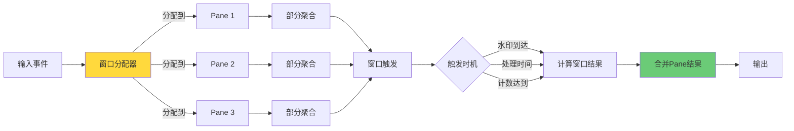
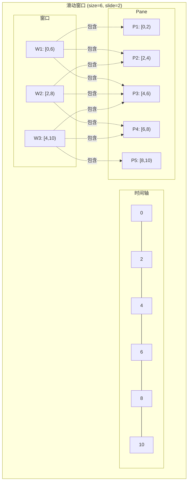
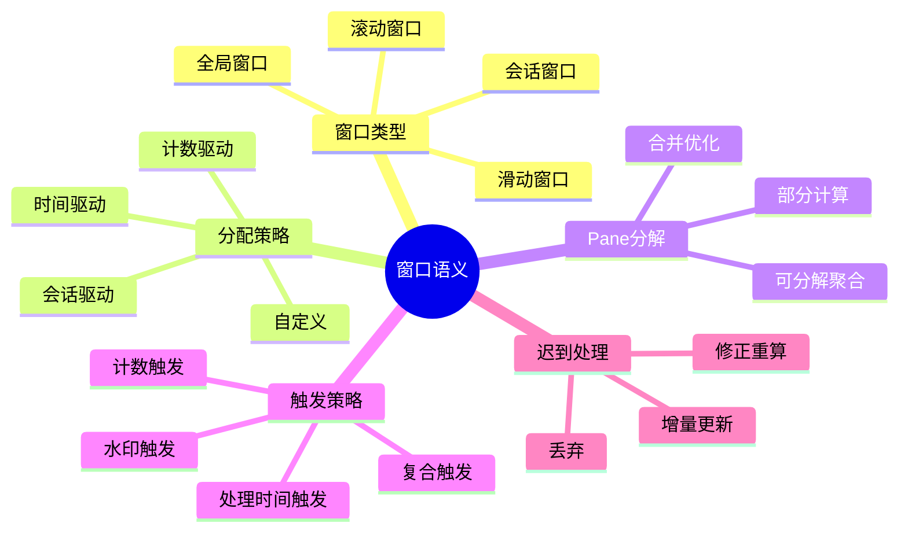

# 窗口语义与Pane分解

> **所属单元**: formal-methods/04-application-layer/02-stream-processing | **前置依赖**: [02-kahn-theorem](./02-kahn-theorem.md) | **形式化等级**: L4-L5

## 1. 概念定义 (Definitions)

### Def-A-02-01: k-符号流自动机 (k-Symbolic Lookback Automaton, k-SLA)

k-SLA是一个七元组 $\mathcal{A}_k = (Q, \Sigma, \delta, q_0, F, \eta, k)$，其中：

- $Q$: 有限状态集合
- $\Sigma$: 输入符号集合（事件类型）
- $\delta: Q \times \Sigma^k \rightarrow Q$: 转移函数，依赖最近 $k$ 个符号
- $q_0 \in Q$: 初始状态
- $F \subseteq Q$: 接受状态集合
- $\eta: Q \rightarrow \mathbb{B}$: 窗口触发判定函数
- $k \in \mathbb{N}$:  lookback深度

**窗口识别**: 自动机接受的语言 $L(\mathcal{A}_k)$ 定义了窗口边界模式。

### Def-A-02-02: 窗格 (Pane)

窗格是窗口计算的最小原子单元。对于窗口 $w$ 和事件 $e$，其窗格分解为：

$$pane(w, e) = \{(w', agg(e)) \mid e \in w' \land w' \in P(\tau_e(e))\}$$

其中 $P(t)$ 是时间戳 $t$ 对应的窗口集合。

### Def-A-02-03: 窗格分解 (Pane Decomposition)

窗口聚合函数的**窗格分解**要求存在二元运算 $\oplus$ 使得：

$$\text{Aggregate}(w) = \bigoplus_{p \in Panes(w)} \text{Partial}(p)$$

即整体聚合可通过部分结果的增量计算得到。

**可分解性条件**:

- 结合律: $(a \oplus b) \oplus c = a \oplus (b \oplus c)$
- 交换律: $a \oplus b = b \oplus a$（对于无序窗格）
- 单位元: $\exists e: e \oplus a = a$

### Def-A-02-04: 窗口类型形式化

**滚动窗口 (Tumbling Window)**:

$$W_{tumble}(t, size) = \{t' \mid \lfloor t/size \rfloor \cdot size \leq t' < (\lfloor t/size \rfloor + 1) \cdot size\}$$

**滑动窗口 (Sliding Window)**:

$$W_{slide}(t, size, slide) = \{t' \mid \exists n \in \mathbb{Z}: n \cdot slide \leq t < n \cdot slide + size \land t' \in [n \cdot slide, n \cdot slide + size)\}$$

**会话窗口 (Session Window)**:

$$W_{session}(t, timeout) = \{t' \mid gap(t, t') < timeout\}$$

其中 $gap$ 是事件间时间差函数。

### Def-A-02-05: 触发策略 (Trigger Strategy)

触发策略是一个谓词 $Trigger: \mathcal{W} \times State \rightarrow \{Fire, Hold\}$，常见策略：

- **水印触发**: $Trigger(w, s) = Fire \iff W_s \geq \max_{e \in w} \tau_e(e)$
- **处理时间触发**: $Trigger(w, s) = Fire \iff \tau_p(current) - \tau_p(start(w)) \geq duration$
- **计数触发**: $Trigger(w, s) = Fire \iff |w| \geq count$
- **模式触发**: $Trigger(w, s) = Fire \iff pattern(w)$

## 2. 属性推导 (Properties)

### Lemma-A-02-01: 窗格分解的正确性

若聚合函数 $agg$ 可分解为 $(\oplus, init)$，则：

$$agg(\{e_1, ..., e_n\}) = init \oplus agg(\{e_1\}) \oplus ... \oplus agg(\{e_n\})$$

**证明**: 由可分解性定义，通过归纳法可得。

### Lemma-A-02-02: 滑动窗口重叠度

对于滑动窗口 $(size, slide)$，任意时刻 $t$ 的活跃窗口数为：

$$N_{active}(t) = \lceil size / slide \rceil$$

**证明**: 窗口每 $slide$ 时间启动一个，持续 $size$ 时间，故同时存在 $\lceil size/slide \rceil$ 个窗口。

### Prop-A-02-01: k-SLA的表达能力

k-SLA可以识别所有正则窗口模式，且对于固定 $k$：

$$L(k\text{-}SLA) = \{w \in \Sigma^* \mid w \text{ 满足长度为} k \text{的局部约束}\}$$

**证明概要**:

- 任何 $k$ 阶正则语言可由k-SLA识别
- 通过将历史编码到状态，模拟 $(k+1)$-阶依赖

### Lemma-A-02-03: 会话窗口的有限性条件

会话窗口系统产生有限个窗口，当且仅当：

$$\exists \delta > 0: \forall e_i, e_{i+1}: \tau_e(e_{i+1}) - \tau_e(e_i) \leq \delta \text{（有限间隔）}$$

或事件流是有限的。

## 3. 关系建立 (Relations)

### 3.1 窗口类型关系图谱

```
窗口类型
    │
    ├── 时间驱动
    │      ├── 滚动 (Tumbling)
    │      ├── 滑动 (Sliding)
    │      └── 会话 (Session)
    │
    └── 计数驱动
           ├── 固定计数
           └── 动态计数 (Delta)
```

### 3.2 窗格分解与Monoid

可分解聚合函数形成**monoid**结构 $(V, \oplus, e)$：

| 聚合函数 | 值域 $V$ | 运算 $\oplus$ | 单位元 $e$ |
|---------|---------|--------------|-----------|
| Sum | $\mathbb{R}$ | + | 0 |
| Count | $\mathbb{N}$ | + | 0 |
| Min | $\mathbb{R} \cup \{\infty\}$ | min | $\infty$ |
| Max | $\mathbb{R} \cup \{-\infty\}$ | max | $-\infty$ |
| Mean | $(sum, count)$ | 分量加 | (0, 0) |

不可分解的聚合（如Median、Top-K）需要特殊处理。

### 3.3 与流SQL的对应

| SQL扩展 | 窗口类型 | 触发策略 |
|--------|---------|---------|
| `TUMBLE(ts, interval)` | 滚动 | 水印/处理时间 |
| `HOP(ts, slide, size)` | 滑动 | 水印/处理时间 |
| `SESSION(ts, gap)` | 会话 | 超时+水印 |
| `RANGE BETWEEN` | 滑动 | 计数 |

## 4. 论证过程 (Argumentation)

### 4.1 窗口分配算法的复杂度

**滚动窗口分配**: $O(1)$ 时间

- 计算: $wid = timestamp / size$

**滑动窗口分配**: $O(size/slide)$ 时间

- 需要分配到所有重叠窗口

**会话窗口分配**: $O(\log n)$ 时间（使用有序集合）

- 查找最近的活跃会话
- 合并或创建新会话

### 4.2 Pane分解优化效果

**无Pane分解**:

- 每个窗口触发时遍历所有事件
- 复杂度: $O(|w|)$ 每次触发

**有Pane分解**:

- 预计算部分聚合
- 复杂度: $O(|Panes|)$ 每次触发
- 当窗口重叠度高时，$|Panes| \ll |w|$

**加速比**:

$$Speedup = \frac{|w|}{|Panes|} = \frac{size}{slide} \text{（对于滑动窗口）}$$

### 4.3 乱序处理与窗口修正

当迟到的事件 $e_{late}$ 到达时（$\tau_p(e_{late}) > W(t)$）：

**修正策略**:

1. **丢弃**: 忽略迟到事件（有损）
2. **修正**: 重新计算受影响窗口
3. **增量修正**: 使用Pane分解，仅更新相关Pane

**增量修正复杂度**: $O(\text{受影响Pane数})$，而非 $O(|w|)$

## 5. 形式证明 / 工程论证

### 5.1 Pane分解等价性定理

**定理**: 设 $agg$ 是可分解聚合，则Pane分解计算与传统全量计算等价：

$$\bigoplus_{p \in Panes(w)} \text{Partial}(p) = agg(\{e \mid e \in w\})$$

**证明**:

设 $w$ 包含事件 $\{e_1, ..., e_n\}$，Pane集合为 $\{p_1, ..., p_m\}$。

**步骤1**: 定义Pane映射

每个事件 $e_i$ 映射到一个或多个Pane：

$$Panes(e_i) = \{p_j \mid e_i \in p_j\}$$

**步骤2**: 部分聚合定义

$$Partial(p_j) = \bigoplus_{e_i \in p_j} agg(\{e_i\})$$

**步骤3**: 合并Pane结果

$$\begin{aligned}
\bigoplus_{p_j} Partial(p_j) &= \bigoplus_{p_j} \bigoplus_{e_i \in p_j} agg(\{e_i\}) \\
&= \bigoplus_{e_i} \bigoplus_{p_j \ni e_i} agg(\{e_i\}) \quad \text{（交换律+结合律）} \\
&= \bigoplus_{e_i} agg(\{e_i\}) \quad \text{（每个事件在有限个Pane中）} \\
&= agg(\{e_1, ..., e_n\}) \quad \text{（可分解性）}
\end{aligned}$$

### 5.2 k-SLA窗口识别完备性

**定理**: 对于任意 $k$-阶正则窗口模式，存在k-SLA识别。

**证明概要**: 构造性证明。

给定 $k$-阶正则表达式 $R$，构造 $\mathcal{A}_k$：
- 状态 $Q$ 对应 $R$ 的 $k$ 阶偏导数
- 转移 $\delta(q, (a_1, ..., a_k))$ 根据 $R$ 的线性形式计算
- 接受状态对应窗口结束模式

通过Thompson构造的扩展，可处理长度为 $k$ 的lookback。

### 5.3 工程实现：Dataflow模型窗口

Apache Beam/Dataflow的窗口语义实现：

```java
// [伪代码片段 - 不可直接运行] 仅展示核心逻辑
// 窗口策略定义
Window.into(FixedWindows.of(Duration.standardMinutes(1)))
    .triggering(
        AfterWatermark.pastEndOfWindow()
            .withEarlyFirings(AfterProcessingTime.pastFirstElementInPane()
                .plusDelayOf(Duration.standardSeconds(10)))
            .withLateFirings(AfterPane.elementCountAtLeast(1))
    )
    .withAllowedLateness(Duration.standardHours(1))
    .accumulatingFiredPanes();
```

**关键设计**:
- 水印驱动主触发
- 处理时间驱动早期触发
- 允许迟到数据修正
- 累积/丢弃模式选择

## 6. 实例验证 (Examples)

### 6.1 滑动窗口Pane分解示例

输入事件: `[e1@t=1, e2@t=3, e3@t=5, e4@t=7]`
窗口参数: `size=6, slide=3`

窗口分配:
- Window 1: [0, 6) → e1, e2, e3
- Window 2: [3, 9) → e2, e3, e4

Pane分解 (Sum聚合):

| Pane | 事件 | 部分和 |
|-----|------|-------|
| [0,3) | e1 | 1 |
| [3,6) | e2, e3 | 5 |
| [6,9) | e4 | 7 |

Window 1结果: 1 + 5 = 6
Window 2结果: 5 + 7 = 12

### 6.2 会话窗口动态合并

输入事件: `[e1@t=1, e2@t=4, e3@t=12, e4@t=15]`
超时: `5`

会话形成:
- Session 1: [e1, e2] (间隔 3 < 5)
- Session 2: [e3, e4] (间隔 3 < 5, 但与Session 1间隔 8 > 5)

当 `e2'@t=8` 到达时:
- 原 Session 1: [e1, e2]
- 新合并: [e1, e2, e2'] (间隔 4 < 5)
- 需要重新触发 Session 1 的修正计算

### 6.3 k-SLA模式识别

识别"连续3个错误后触发窗口"：

```
States: {q0, q1, q2, q_win}
Transitions:
  q0 --[ERROR]--> q1
  q1 --[ERROR]--> q2
  q2 --[ERROR]--> q_win
  q* --[SUCCESS]--> q0

Trigger: η(q_win) = Fire
```

## 7. 可视化 (Visualizations)

### 7.1 窗口类型时间线对比

```mermaid
gantt
    title 窗口类型对比时间线
    dateFormat X
    axisFormat %s

    section 滚动窗口 (size=4)
    W1 [0,4)  :0, 4
    W2 [4,8)  :4, 8
    W3 [8,12) :8, 12

    section 滑动窗口 (size=6, slide=2)
    W1 [0,6)  :0, 6
    W2 [2,8)  :2, 8
    W3 [4,10) :4, 10
    W4 [6,12) :6, 12

    section 会话窗口 (gap=3)
    S1 (e1,e2,e3) :0, 7
    S2 (e4,e5)    :10, 14
```



### 7.2 Pane分解架构



### 7.3 窗格分解与重叠窗口



### 7.4 窗口语义层次结构



## 8. 引用参考 (References)

[^1]: T. Akidau et al., "The Dataflow Model: A Practical Approach to Balancing Correctness, Latency, and Cost in Massive-Scale, Unbounded, Out-of-Order Data Processing", PVLDB, 8(12), 2015.
[^2]: A. Arasu et al., "STREAM: The Stanford Stream Data Manager", IEEE Data Engineering Bulletin, 26(1), 2003.
[^3]: J. Li et al., "No Pane, No Gain: Efficient Evaluation of Sliding-Window Aggregates over Data Streams", SIGMOD 2005.
[^4]: B. Babcock et al., "Scalable Distributed Stream Processing", CIDR 2003.
[^5]: Apache Beam Documentation, "Windowing", https://beam.apache.org/documentation/programming-guide/#windowing
[^6]: R. Motwani et al., "Query Processing, Resource Management, and Approximation in a Data Stream Management System", CIDR 2003.
[^7]: D.J. Abadi et al., "The Design of the Borealis Stream Processing Engine", CIDR 2005.
[^8]: S. Chandrasekaran et al., "TelegraphCQ: Continuous Dataflow Processing for an Uncertain World", CIDR 2003.
[^9]: J. Gama and M. Gaber, "Learning from Data Streams: Processing Techniques in Sensor Networks", Springer, 2007.
[^10]: F. McSherry et al., "Differential Dataflow", CIDR 2013.
