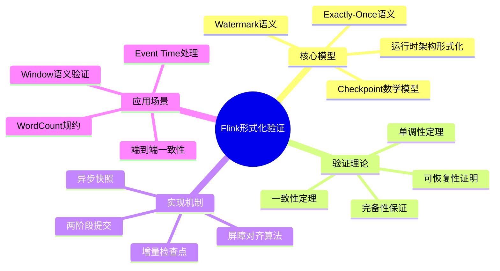
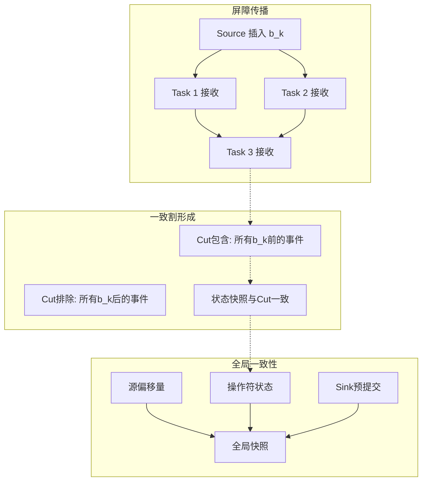
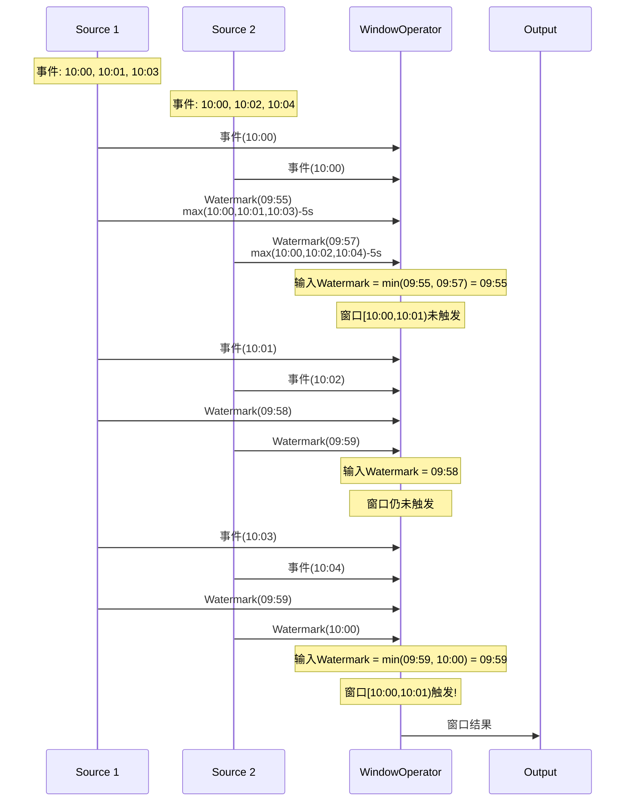
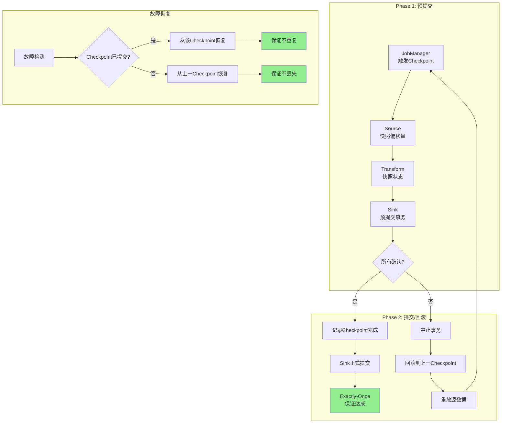
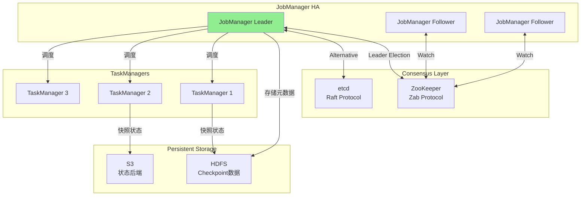
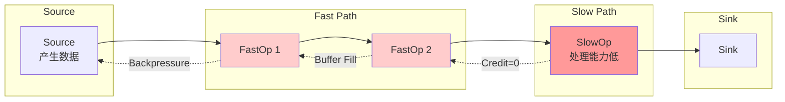

# Apache Flink形式化验证与验证理论

> **所属单元**: formal-methods/04-application-layer/02-stream-processing | **前置依赖**: [04-flink-formalization](04-flink-formalization.md), [01-stream-formalization](01-stream-formalization.md) | **形式化等级**: L6

## 1. 概念定义 (Definitions)

### Def-FL-04-01: Flink运行时架构形式化

Apache Flink运行时架构形式化为九元组 $\mathcal{R} = (J, T, S, O, C, W, K, B, \Gamma)$：

- $J$: JobManager集合，负责协调和调度，$J = \{jm_1\}$（HA模式下为多个）
- $T$: TaskManager集合，$T = \{tm_1, tm_2, ..., tm_n\}$
- $S$: Slot集合，$S = \bigcup_{tm \in T} slots(tm)$，每个TaskManager提供多个slot
- $O$: 操作符实例集合，$O = \{o_1, o_2, ..., o_m\}$
- $C$: 数据通道集合，$C \subseteq O \times O$，表示操作符间的数据流连接
- $W$: Watermark传播函数，$W: O \times \mathbb{T} \rightarrow \mathbb{T}$
- $K$: 检查点协调器，$K = (ckpt\_id, barriers, state\_handles)$
- $B$: 反压传播机制，$B: O \rightarrow \{\text{Normal}, \text{Backpressure}\}$
- $\Gamma$: 全局状态，$\Gamma = (\Sigma_O, \Sigma_C, \Sigma_K)$，包含操作符状态、通道状态和检查点状态

**部署映射函数**：

$$\text{deploy}: O \rightarrow S$$

表示操作符实例到执行槽位的映射，满足负载均衡约束：

$$\forall tm \in T: |\{o \in O \mid deploy(o) \in slots(tm)\}| \leq capacity(tm)$$

### Def-FL-04-02: Checkpoint机制数学模型

Flink Checkpoint机制形式化为分布式快照协议 $\mathcal{P}_{ckpt} = (B, \Sigma, \Phi, \tau)$：

**Barrier结构**：

$$b_k = (id=k, type \in \{PRE\_CHECKPOINT, POST\_CHECKPOINT\}, timestamp)$$

其中 $k \in \mathbb{N}^+$ 是检查点ID。

**屏障对齐(Barrier Alignment)**：

对于多输入操作符 $o$ 有输入通道 $In(o) = \{c_1, c_2, ..., c_n\}$，屏障对齐定义为：

$$\text{aligned}(o, k) \iff \forall c \in In(o): b_k \in \text{received}(c)$$

**状态快照函数**：

$$\text{snapshot}: \Sigma \times \mathbb{N} \rightarrow \text{StateHandle}$$

$$\text{snapshot}(\sigma, k) = h_k, \text{ where } h_k \text{ 是状态句柄，指向持久化存储}$$

**增量检查点**：

对于状态序列 $\Sigma_0, \Sigma_1, ..., \Sigma_k$，增量快照为：

$$\Delta_k = \Sigma_k \ominus \Sigma_{k-1}$$

其中 $\ominus$ 表示状态差异操作，满足：

$$\Sigma_k = \Sigma_{k-1} \oplus \Delta_k$$

**检查点成本模型**：

$$\text{cost}(ckpt) = \alpha \cdot |\Sigma| + \beta \cdot |C| + \gamma \cdot \text{align\_delay}$$

其中 $\alpha, \beta, \gamma$ 是权重系数，分别表示状态大小、通道数和屏障对齐延迟的影响。

### Def-FL-04-03: Watermark语义形式化

Watermark是事件时间进展的标记，形式化为四元组 $\mathcal{W} = (w, \tau, \delta, \pi)$：

**Watermark值**：

$$w \in \mathbb{T} \cup \{+\infty\}$$

$+\infty$ 表示流结束标记。

**源操作符Watermark生成**：

对于源操作符 $s$ 有输入事件缓冲区 $B_s$，允许延迟为 $\delta$：

$$w_{out}^{(s)}(t) = \max_{e \in B_s(t)} \tau(e) - \delta$$

其中 $\tau(e)$ 是事件 $e$ 的事件时间戳。

**Watermark传播规则**：

- **单输入操作符**：$w_{out} = f(w_{in})$，其中 $f$ 保持单调性
- **多输入操作符**（如union、join）：$w_{out} = \min_{i \in inputs} w_{in}^{(i)}$
- **多输出操作符**：每个输出 $j$ 有独立Watermark $w_{out}^{(j)}$

**Watermark单调性约束**：

$$\forall t_1 < t_2: w(t_1) \leq w(t_2)$$

**空闲源处理**：

对于标记为空闲的源 $s$，在超时 $\theta$ 后：

$$w_{out}^{(s)} = +\infty$$

使得下游Watermark推进不受阻塞。

**Watermark完备性断言**：

$$\forall e: \tau(e) < w \Rightarrow e \in \text{processed} \lor e \in \text{late\_data}$$

### Def-FL-04-04: Exactly-Once语义

Flink Exactly-Once语义形式化为执行属性 $\mathcal{E} = (I, O, \rightarrow, \ll, \approx)$：

**输入输出关系**：

对于输入流 $I = \langle e_1, e_2, e_3, ... \rangle$ 和输出流 $O = \langle o_1, o_2, o_3, ... \rangle$，定义因果关系：

$$e \rightarrow o \iff o \text{ 由处理 } e \text{ 产生}$$

**Exactly-Once正确性定义**：

$$\text{Exactly-Once}(I, O) \iff \forall e \in I: |\{o \in O \mid e \rightarrow o\}| = 1$$

即每条输入事件恰好产生一次输出影响。

**两阶段提交协议(2PC)**：

$$\text{2PC} = (V, P, C, A)$$

- $V$: 投票阶段(Vote)，参与者预提交并报告状态
- $P$: 预提交阶段(Pre-commit)，持久化但未可见
- $C$: 提交阶段(Commit)，全局提交后可见
- $A$: 中止阶段(Abort)，回滚到上一状态

**事务性Sink语义**：

$$\text{Transaction}(tx) = (state \in \{OPEN, PRE\_COMMITTED, COMMITTED, ABORTED\}, data, checkpoint\_id)$$

**端到端Exactly-Once条件**：

$$\text{E2E\_Exactly\_Once} \iff \text{Source\_Replayable} \land \text{Processing\_Deterministic} \land \text{Sink\_Transactional}$$

### Def-FL-04-05: State Backend形式化

State Backend是状态存储抽象，形式化为 $\mathcal{B} = (T, \sigma, \phi, \rho)$：

**类型分类**：

$$T \in \{\text{MEMORY}, \text{FILESYSTEM}, \text{ROCKSDB}\}$$

**状态访问接口**：

$$\sigma: Key \times Namespace \rightarrow Value$$

$$\sigma(k, ns) = v, \text{ where } v \in Value \cup \{\bot\}$$

**状态快照操作**：

$$\phi: \Sigma \times Path \rightarrow StateHandle$$

将状态持久化到存储路径，返回状态句柄。

**状态恢复操作**：

$$\rho: StateHandle \rightarrow \Sigma$$

从状态句柄恢复状态。

**异步快照**：

$$\phi_{async}(\sigma) = (future, \sigma_{materialized})$$

其中 $future$ 在后台完成，不阻塞处理。

**性能特征**：

| Backend | 访问延迟 | 状态大小 | 快照方式 |
|---------|---------|---------|---------|
| MemoryStateBackend | $O(1)$ | 受限于TM内存 | 同步 |
| FsStateBackend | $O(1)$ | 受限于TM内存 | 异步 |
| RocksDBStateBackend | $O(\log n)$ | 受限于磁盘 | 异步增量 |

## 2. 属性推导 (Properties)

### Lemma-FL-04-01: Checkpoint一致性属性

**引理**: 若所有操作符遵循屏障对齐协议，则全局快照是一致的。

**形式化表述**：

$$\forall o \in O: \text{aligned}(o, k) \Rightarrow \text{snapshot}_o(k) \text{ is consistent}$$

$$\text{Global\_Consistent}(k) \iff \forall o \in O: \text{snapshot}_o(k) \text{ consistent with } \{snapshot_{o'}(k) \mid o' \in predecessors(o)\}$$

**证明概要**：

1. 屏障 $b_k$ 在源处产生，沿拓扑传播
2. 每个操作符在收到所有输入的 $b_k$ 后才快照
3. 这等价于Chandy-Lamport快照算法的屏障割
4. 因此满足一致性割(consistent cut)条件

**一致性割定义**：

$$\text{Consistent\_Cut}(S) \iff \forall (e_1, e_2): e_1 \in S \land e_2 \rightarrow e_1 \Rightarrow e_2 \in S$$

即若事件在割中，则其所有原因也在割中。

### Lemma-FL-04-02: Watermark单调性定理

**引理**: 在任意Flink拓扑中，Watermark传播保持单调不减。

**形式化表述**：

$$\forall o \in O, \forall t_1 < t_2: w_o(t_1) \leq w_o(t_2)$$

**证明**：

对拓扑进行归纳：

**基础情形（源操作符）**：

源Watermark生成策略保证：

$$w(t) = \max_{e \in B(t)} \tau(e) - \delta$$

由于 $B(t_1) \subseteq B(t_2)$（缓冲区只增不减），有：

$$\max_{e \in B(t_1)} \tau(e) \leq \max_{e \in B(t_2)} \tau(e)$$

因此 $w(t_1) \leq w(t_2)$。

**归纳步骤**：

假设所有上游操作符满足单调性，考虑操作符 $o$：

- 单输入：$w_{out}(t) = f(w_{in}(t))$，$f$ 单调不减
- 多输入：$w_{out}(t) = \min_i w_{in}^{(i)}(t)$，最小值操作保持单调性

因此 $w_o$ 单调。

### Lemma-FL-04-03: State Backend性质

**引理1（MemoryStateBackend有界性）**: 使用MemoryStateBackend时，状态大小受TaskManager内存限制：

$$|\Sigma| \leq \text{tm\_heap\_size} \times f_{safety}$$

其中 $f_{safety} \in (0, 1)$ 是安全因子。

**引理2（RocksDB状态分离）**: RocksDBStateBackend的Keye状态按Key Group分区：

$$\Sigma_{keyed} = \bigcup_{g \in G} \Sigma_g, \text{ where } G = \{0, 1, ..., \text{maxParallelism}-1\}$$

每个Key $k$ 映射到唯一的 $g = hash(k) \mod |G|$。

**引理3（增量检查点压缩率）**: 增量检查点的压缩率与状态变更率相关：

$$\text{compression\_ratio} = \frac{|\Delta_k|}{|\Sigma_k|} \approx \frac{\text{change\_rate} \times \Delta t}{|\Sigma|}$$

### Prop-FL-04-01: 屏障对齐与Exactly-Once的关系

**命题**: 屏障对齐是Exactly-Once语义的充分条件。

$$\text{Barrier\_Alignment} \Rightarrow \text{Exactly\_Once}$$

**证明概要**：

1. 屏障对齐确保检查点边界内状态一致
2. 故障恢复时从检查点恢复，保证处理状态精确
3. 无屏障对齐时，部分输入可能重复处理，导致重复输出

**At-Least-Once模式**：

禁用屏障对齐时：

$$\neg \text{Barrier\_Alignment} \Rightarrow \text{At\_Least\_Once}$$

状态可能包含部分输入的数据，但保证不丢失。

## 3. 关系建立 (Relations)

### 3.1 Flink与Kahn Process Network关系

Flink计算模型与Kahn Process Network (KPN) 的关系可形式化为映射：

$$\Phi_{Flink \rightarrow KPN}: \mathcal{F} \rightarrow \mathcal{K}$$

**概念映射表**：

| Flink概念 | KPN概念 | 映射关系 | 差异 |
|-----------|---------|---------|------|
| Operator | Process | 1:1 | Flink有显式时间语义 |
| Network Buffer | Channel | 多:1 | KPN通道无界，Flink有限 |
| Record | Token | 1:1 | Flink记录有元数据(时间戳等) |
| Watermark | 无 | N/A | Flink特有概念 |
| Checkpoint | 无 | N/A | Flink特有容错机制 |
| Backpressure | Blocking Read | 模拟 | KPN阻塞读，Flink显式反压 |
| Parallelism | 无 | N/A | Flink支持数据并行 |

**确定性分析**：

KPN保证确定性：相同输入产生相同输出。Flink在满足以下条件时保持确定性：

$$\text{Deterministic}(Flink) \iff \text{Watermark\_Deterministic} \land \text{Processing\_Order\_Deterministic}$$

其中：

- **Watermark确定性**: 相同输入序列产生相同Watermark序列
- **处理顺序确定性**: 并行实例按Key分区，相同Key到相同实例

### 3.2 Flink与Dataflow模型关系

Flink实现了Google Dataflow模型的核心语义，关系如下：

**Dataflow模型元素**：

$$\mathcal{D} = (P, W, T, E)$$

- $P$: 处理逻辑（ParDo等）
- $W$: 窗口策略
- $T$: 触发器(Trigger)
- $E$: 累积模式

**Flink映射**：

| Dataflow概念 | Flink实现 | 对应API |
|-------------|-----------|---------|
| ParDo | Map/FlatMap | `.map()`, `.flatMap()` |
| GroupByKey | KeyBy + Window | `.keyBy().window()` |
| Window | Window Assigner | `TumblingEventTimeWindows`, etc. |
| Trigger | Trigger | `EventTimeTrigger`, `ProcessingTimeTrigger` |
| Accumulation | Evictor + AllowedLateness | `.evictor()`, `.allowedLateness()` |
| Watermark | Watermark Strategy | `WatermarkStrategy.forBoundedOutOfOrderness()` |

**时间域对应**：

$$
\begin{aligned}
\text{Event Time} &\leftrightarrow \text{Flink Event Time} \\
\text{Processing Time} &\leftrightarrow \text{Flink Processing Time} \\
\text{Ingestion Time} &\leftrightarrow \text{Flink Ingestion Time}
\end{aligned}
$$

### 3.3 Flink与Paxos/Raft的集成

Flink使用分布式共识协议实现JobManager高可用(HA)：

**HA架构形式化**：

$$\text{HA} = (JM_{leader}, JM_{followers}, \mathcal{C})$$

其中 $\mathcal{C}$ 是共识协议实例。

**ZooKeeper集成（基于Zab协议）**：

$$\text{Zab} = (LeaderElection, AtomicBroadcast, Recovery)$$

Flink使用ZooKeeper存储：

- 当前JobManager leader信息
- 检查点元数据路径
- 运行中的作业列表

**Kubernetes集成（基于etcd/Raft）**：

$$\text{Raft} = (LeaderElection, LogReplication, Safety)$$

Flink on Kubernetes使用ConfigMap存储leader信息。

**检查点元数据与共识**：

$$\text{CompletedCheckpoint} = (checkpoint\_id, state\_handles, metadata) \in \text{Consensus\_Log}$$

所有JobManager实例通过共识协议就最新成功检查点达成一致。

## 4. 论证过程 (Argumentation)

### 4.1 Checkpoint算法正确性分析

**Chandy-Lamport算法回顾**：

分布式快照算法满足：

1. **终止性**：有限步内完成
2. **一致性**：形成一致割
3. **非干扰性**：不阻塞正常处理

**Flink Barrier机制扩展**：

Flink扩展CL算法以支持流处理场景：

**Barrier对齐的CL等价性**：

$$
\text{Flink\_Barrier\_Alignment} \equiv \text{CL\_Marker\_Receiving}
$$

Flink的屏障对齐等价于CL算法中进程收到所有输入通道的marker后才记录状态。

**异步快照优化**：

传统CL算法要求同步快照，Flink引入异步快照：

$$\text{Async\_Snapshot} = (\Sigma_{sync}, \Sigma_{async}, future)$$

其中：

- $\Sigma_{sync}$: 同步复制的状态引用（轻量级）
- $\Sigma_{async}$: 实际状态数据（后台序列化）
- $future$: 完成通知

**正确性论证**：

异步快照保持正确性的关键是**状态不可变性**或**写时复制(COW)**：

$$\forall \sigma \in \Sigma: \text{snapshot}(\sigma) \Rightarrow \sigma \text{ becomes immutable during snapshot}$$

或

$$\text{snapshot}(\sigma) = \text{snapshot}(copy(\sigma))$$

**增量检查点正确性**：

增量检查点 $\Delta_k$ 必须满足可重构性：

$$\Sigma_k = \Sigma_0 \oplus \Delta_1 \oplus \Delta_2 \oplus ... \oplus \Delta_k$$

**快照链完整性**：

$$\text{Restore}(ckpt_k) = \rho(\phi(\Sigma_k)) = \Sigma_k$$

### 4.2 故障恢复机制分析

**故障模型**：

Flink处理的故障类型：

$$\text{Faults} = \{Task\_Failure, TM\_Failure, JM\_Failure, Network\_Partition\}$$

**故障恢复级别**：

| 故障类型 | 恢复机制 | 恢复时间 | 数据丢失 |
|---------|---------|---------|---------|
| Task Failure | 重启失败任务 | 秒级 | 无（从checkpoint） |
| TM Failure | 重新调度到可用TM | 秒级 | 无 |
| JM Failure | Leader切换，恢复元数据 | 秒-分级 | 无 |
| Network Partition | 视为故障，重新调度 | 秒级 | 无 |

**恢复算法**：

$$
\text{Recover}(failure) = \begin{cases}
\text{Restart\_Task}(t) & \text{if } failure \in Task \\
\text{Restart\_On\_New\_TM}(t) & \text{if } failure \in TM \\
\text{Leader\_Failover}() & \text{if } failure \in JM
\end{cases}
$$

**状态恢复过程**：

1. 从最近完成的检查点 $ckpt_k$ 读取状态句柄
2. 分发状态到各操作符实例
3. 从源操作符的偏移量重放数据
4. 恢复处理

**恢复时间模型**：

$$T_{recover} = T_{coordination} + T_{state\_download} + T_{source\_seek} + T_{reprocess}$$

优化策略：

- **本地恢复优先**：若状态在本地磁盘，优先从本地读取
- **增量恢复**：仅下载变化的状态部分
- **并行恢复**：多任务并行下载状态

### 4.3 反压(Backpressure)处理分析

**反压产生条件**：

反压发生在下游处理速度低于上游产生速度时：

$$\text{Backpressure} \iff \exists o \in O: \text{rate}_{in}(o) > \text{rate}_{out}(o)$$

**反压传播机制**：

Flink使用信用-based流控制：

**信用模型**：

$$Credit: Producer \times Consumer \rightarrow \mathbb{N}$$

生产者只有获得信用后才发送数据：

$$\text{send}(p, c, data) \Rightarrow Credit(p, c) > 0$$

**反压传播**：

$$
\begin{aligned}
\text{Credit}(p, c) = 0 &\Rightarrow \text{Block}(p) \\
&\Rightarrow \text{Buffer\_Fill}(upstream) \\
&\Rightarrow \text{Propagate\_Backpressure}(upstream)
\end{aligned}
$$

**反压检测**：

$$\text{Backpressure\_Ratio} = \frac{\text{blocked\_time}}{\text{total\_time}} \times 100\%$$

Flink监控各操作符的反压比例：

- **OK**: 反压比例 < 10%
- **LOW**: 10% $\leq$ 反压比例 < 50%
- **HIGH**: 反压比例 $\geq$ 50%

**反压处理策略**：

1. **资源扩容**：增加并行度
2. **数据倾斜处理**：重新分区
3. **优化慢操作符**：代码优化
4. **背压自适应**：动态调整发送速率

**反压与Watermark关系**：

反压可能导致Watermark推进延迟：

$$\text{Backpressure} \Rightarrow \text{Watermark\_Delay} \Rightarrow \text{Window\_Trigger\_Delay}$$

Flink处理：在反压期间，Watermark基于处理时间推进（若配置允许）。

## 5. 形式证明 / 工程论证 (Proof / Engineering Argument)

### Thm-FL-04-01: Checkpoint一致性定理

**定理**: 对于使用屏障对齐的Flink检查点，全局快照是一致的，即形成一致割。

**形式化表述**：

$$\forall k \in \mathbb{N}: \text{Barrier\_Alignment}(k) \Rightarrow \text{Consistent\_Cut}(Snapshot_k)$$

其中：

$$\text{Consistent\_Cut}(S) \iff \forall e_1, e_2: e_1 \in S \land e_2 \rightarrow e_1 \Rightarrow e_2 \in S$$

**证明**：

**步骤1: 定义割集**

对于检查点 $k$，定义事件割集：

$$Cut_k = \{e \mid e \text{ processed before receiving } b_k \text{ on all inputs}\}$$

**步骤2: 证明闭包性**

需证明：$\forall e_1 \in Cut_k, \forall e_2: e_2 \rightarrow e_1 \Rightarrow e_2 \in Cut_k$

考虑任意 $e_1 \in Cut_k$ 和 $e_2 \rightarrow e_1$：

- $e_2 \rightarrow e_1$ 表示 $e_2$ 是 $e_1$ 的原因
- 在Flink DAG中，原因关系意味着 $e_2$ 在 $e_1$ 的上游
- 由于屏障从源向下游传播，$e_2$ 所在操作符比 $e_1$ 所在操作符更早收到 $b_k$
- 因此 $e_2$ 在 $b_k$ 到达前已被处理
- 即 $e_2 \in Cut_k$

**步骤3: 状态一致性**

操作符状态 $\Sigma_o$ 记录已处理事件的影响：

$$\Sigma_o = \{effect(e) \mid e \in Cut_k \cap processed\_by(o)\}$$

由于 $Cut_k$ 是闭包的，状态与割集一致。

**步骤4: 全局一致性**

全局快照：

$$Snapshot_k = (\{\Sigma_o\}_{o \in O}, \{offset_s(k)\}_{s \in Sources})$$

源偏移量 $offset_s(k)$ 表示源 $s$ 在 $b_k$ 插入位置前已发出的数据量。

由于所有下游状态对应的事件都来自源的这些偏移量之前，全局状态是一致的。

$$\therefore \text{Consistent\_Cut}(Snapshot_k) \quad \blacksquare$$

### Thm-FL-04-02: Watermark推进定理

**定理**: 在无故障执行中，Flink拓扑的Watermark最终会推进到 $+\infty$（流结束）。

**形式化表述**：

$$\forall o \in O: \lim_{t \to \infty} w_o(t) = +\infty$$

假设：

- 源最终停止产生新数据（有限流）或持续产生（无限流）
- 无永久空闲源（或空闲源被标记为空闲）

**证明**：

**情形1: 有限流**

对于有限流，设最大事件时间为 $\tau_{max}$：

- 源Watermark：$w_s(t) = \tau_{max} - \delta$（在缓冲区排空后）
- 最终源发送 $+\infty$ 标记流结束
- 该标记传播到所有下游

由归纳，所有操作符最终接收到 $+\infty$。

**情形2: 无限流**

对于无限流，需证明Watermark无界增长。

**引理**: 若源流Watermark单调递增，则所有下游Watermark单调递增。

已在Lemma-FL-04-02中证明。

**归纳证明**：

对拓扑深度 $d$ 归纳：

**基础 ($d=0$, 源操作符)**：

源流Watermark：

$$w_s(t) = \max_{e \in B_s(t)} \tau(e) - \delta$$

由于新事件持续到达且时间戳递增：

$$\forall M \in \mathbb{R}, \exists t: w_s(t) > M$$

**归纳步骤**：

假设深度 $d$ 的所有操作符Watermark无界，考虑深度 $d+1$ 的操作符 $o$：

- $o$ 的输入来自深度 $\leq d$ 的操作符
- 由归纳假设，这些输入的Watermark无界
- $o$ 的输出Watermark是其输入的最小值（或多输入情况）或单调函数（单输入）
- 最小值操作保持无界性：若所有输入无界，则最小值无界

因此 $w_o$ 无界。

$$\therefore \lim_{t \to \infty} w_o(t) = +\infty \quad \blacksquare$$

### Thm-FL-04-03: Exactly-Once语义保证定理

**定理**: 使用两阶段提交协议和可重放源的Flink程序保证端到端Exactly-Once语义。

**形式化表述**：

$$
\begin{aligned}
&\text{Replayable\_Source} \land \text{Deterministic\_Processing} \land \text{Transactional\_Sink} \\
&\Rightarrow \text{End\_to\_End\_Exactly\_Once}
\end{aligned}
$$

其中：

- **Replayable_Source**: $\forall s \in Sources: offset_s$ 可持久化并可重放
- **Deterministic_Processing**: 相同输入和状态产生相同输出
- **Transactional_Sink**: Sink实现两阶段提交接口

**证明**：

**系统模型**：

- 输入流 $I$ 分批次处理，检查点边界定义批次
- 检查点 $k$ 对应输入批次 $B_k$
- 状态 $S_k$ 是处理 $B_k$ 后的状态

**两阶段提交协议正确性**：

**阶段1 - 预提交**：

在检查点 $k$ 时：

1. JobManager触发检查点
2. 所有操作符快照状态
3. Sink预提交输出到外部系统（事务未提交）
4. 所有操作符确认快照完成

**不变式1**: 预提交后，输出在外部系统持久化但未可见。

$$\text{Precommitted}(output) \Rightarrow \text{Persistent}(output) \land \neg \text{Visible}(output)$$

**阶段2 - 提交**：

当所有操作符确认后：

1. JobManager记录检查点完成
2. Sink收到提交指令
3. Sink在外部系统提交事务
4. 输出变为可见

**不变式2**: 全局提交后，输出永久可见。

$$\text{Global\_Commit}(k) \Rightarrow \forall o \in Output_k: \text{Visible}(o)$$

**故障恢复正确性**：

**情形A: 故障发生在全局提交前**

- JobManager未收到所有确认，检查点 $k$ 未完成
- 回滚到上一成功检查点 $k-1$
- Sink中止事务，预提交输出被丢弃
- 重放源偏移量，重新处理批次 $B_k$

**正确性**：输出未可见，无重复。

**情形B: 故障发生在全局提交后**

- 检查点 $k$ 已记录为完成
- 部分Sink可能未收到提交指令
- 恢复时从检查点 $k$ 重启
- 已提交的输出由于幂等性或事务ID去重不会重复

**正确性**：输出恰好可见一次。

**端到端论证**：

对于任意输入事件 $e \in B_k$：

1. **存在性**: 若处理成功且检查点 $k$ 完成，$e$ 产生输出
2. **唯一性**:
   - 若故障在提交前：重新处理，无重复输出（因为上次未提交）
   - 若故障在提交后：检查点记录已提交，不会重新处理

因此：

$$|\{o \mid cause(o) = e\}| = 1$$

$$\therefore \text{End\_to\_End\_Exactly\_Once} \quad \blacksquare$$

## 6. 实例验证 (Examples)

### 6.1 WordCount形式化规约

**问题描述**：计算文本流中每个单词的出现次数。

**形式化规约**：

**输入**: $I = \langle (word_1, ts_1), (word_2, ts_2), ... \rangle$

**输出**: $O = \langle (word, count, window) \rangle$

**语义函数**：

$$\text{WordCount}(I) = \{(w, |\{e \in I_w\}|, win) \mid w \in \Sigma^*\}$$

其中 $I_w = \{e \in I \mid e.word = w \land e.ts \in win\}$

**Flink实现**：

```java

// [伪代码片段 - 不可直接运行] 仅展示核心逻辑
import org.apache.flink.streaming.api.datastream.DataStream;
import org.apache.flink.streaming.api.windowing.time.Time;

DataStream<Tuple2<String, Integer>> wordCounts = env
    .addSource(new KafkaSource<String>("input-topic"))
    .flatMap((String value, Collector<String> out) -> {
        for (String word : value.toLowerCase().split("\\s+")) {
            out.collect(word);
        }
    })
    .returns(String.class)
    .map(word -> Tuple2.of(word, 1))
    .returns(TypeInformation.of(new TypeHint<Tuple2<String, Integer>>(){}))
    .keyBy(value -> value.f0)
    .window(TumblingEventTimeWindows.of(Time.minutes(1)))
    .sum(1);
```

**形式化验证**：

**正确性性质**：

$$\forall w, win: \text{output}(w, win) = \sum_{e \in I, e.word=w, e.ts \in win} 1$$

**证明**：

1. `flatMap` 将每行拆分为单词，保持基数
2. `map` 将每个单词映射为 $(word, 1)$ 对
3. `keyBy` 按单词分区，相同单词到相同实例
4. `window` 按事件时间分桶
5. `sum` 对每个窗口内的计数求和

由Flink的窗口语义保证，输出等于每个窗口内单词出现次数。

**状态分析**：

使用Keyed State存储部分计数：

$$\Sigma_{keyed} = \{(key=w, value=c) \mid c = \text{partial count for } w\}$$

检查点大小：$O(|\text{vocabulary}| \times 8 \text{ bytes})$

### 6.2 Event Time处理案例

**场景**：传感器数据流，包含事件时间戳和温度读数，检测每分钟平均温度。

**数据格式**：

$$Event = (sensor\_id: String, temperature: Double, timestamp: Long)$$

**乱序到达模式**：

```
实际时间线:  10:00 -- 10:01 -- 10:02 -- 10:03 -- 10:04
到达顺序:    10:00    10:02    10:01    10:04    10:03
延迟:        0s       0s       60s      0s       60s
```

**Watermark策略**：

```java

// [伪代码片段 - 不可直接运行] 仅展示核心逻辑
import org.apache.flink.api.common.eventtime.WatermarkStrategy;

WatermarkStrategy<SensorEvent> strategy = WatermarkStrategy
    .<SensorEvent>forBoundedOutOfOrderness(Duration.ofSeconds(30))
    .withIdleness(Duration.ofMinutes(5));
```

**形式化语义**：

$$w(t) = \max_{e \in B(t)} \tau(e) - 30s$$

**窗口触发分析**：

对于窗口 $[10:00, 10:01)$：

- 收到事件 $10:00$ (ts=10:00)
- 收到事件 $10:02$ (ts=10:02)，Watermark推进到 $10:02 - 30s = 09:59:30$
- 收到事件 $10:01$ (ts=10:01)，Watermark保持 $09:59:30$
- 收到事件 $10:04$ (ts=10:04)，Watermark推进到 $10:03:30$

此时 $w = 10:03:30 > 10:01$，窗口 $[10:00, 10:01)$ 触发计算。

**延迟数据处理**：

若允许延迟1分钟：

```java

// [伪代码片段 - 不可直接运行] 仅展示核心逻辑
import org.apache.flink.streaming.api.windowing.time.Time;

.window(TumblingEventTimeWindows.of(Time.minutes(1)))
.allowedLateness(Time.minutes(1))
```

事件 $10:03$ (ts=10:03, 到达时间=10:04) 的处理：

- 若到达时窗口未触发（$w < 10:04$）：正常处理
- 若到达时窗口已触发但 $ts > w - 60s$：更新结果（触发side output或更新）
- 若 $ts \leq w - 60s$：丢弃或发送到side output

### 6.3 Window操作语义验证

**滚动窗口(Tumbling Window)语义**：

**定义**：

$$\text{Tumbling}(size) = \{[k \cdot size, (k+1) \cdot size) \mid k \in \mathbb{N}\}$$

**性质验证**：

1. **完备性**：$\forall t \in \mathbb{T}: \exists! w: t \in w$
   - 每个时间戳恰好属于一个窗口

2. **不重叠性**：$\forall w_1, w_2: w_1 \neq w_2 \Rightarrow w_1 \cap w_2 = \emptyset$
   - 窗口两两不相交

3. **连续性**：$\bigcup_{k} [k \cdot size, (k+1) \cdot size) = \mathbb{T}$
   - 窗口覆盖整个时间域

**滑动窗口(Sliding Window)语义**：

**定义**：

$$\text{Sliding}(size, slide) = \{[k \cdot slide, k \cdot slide + size) \mid k \in \mathbb{N}\}$$

**性质验证**：

1. **重叠性**：若 $slide < size$，窗口重叠
   - 重叠度：$\frac{size - slide}{slide}$

2. **归属数**：$\forall t: |\{w \mid t \in w\}| = \lceil \frac{size}{slide} \rceil$
   - 每个事件属于多个窗口

**会话窗口(Session Window)语义**：

**定义**：

$$\text{Session}(gap) = \{[s_1, e_1), [s_2, e_2), ...\}$$

其中：

- $s_i = \min \{ts(e) \mid e \in \text{session}_i\}$
- $e_i = \max \{ts(e) \mid e \in \text{session}_i\} + gap$
- $\forall i: e_i - s_i < gap$
- 相邻会话：$s_{i+1} - e_i > gap$

**动态边界示例**：

```
事件:    A(10:00) -- B(10:02)    C(10:10) -- D(10:12) -- E(10:25)
gap=5min:
窗口1:   [10:00, 10:07)  (包含A,B)
窗口2:   [10:10, 10:17)  (包含C,D)
窗口3:   [10:25, 10:30)  (包含E)

若F(10:06)到达:
窗口1扩展为: [10:00, 10:11)
```

**窗口合并算法**：

会话窗口支持动态合并：

$$
\text{Merge}(w_1, w_2) = \begin{cases}
[\min(s_1, s_2), \max(e_1, e_2)) & \text{if } |s_2 - e_1| < gap \\
\text{no merge} & \text{otherwise}
\end{cases}
$$

## 7. 可视化 (Visualizations)

### 7.1 Flink形式化验证技术栈



### 7.2 Checkpoint一致性证明结构



### 7.3 Watermark传播与窗口触发



### 7.4 Exactly-Once两阶段提交流程



### 7.5 Flink与分布式共识集成架构



### 7.6 反压传播机制



## 8. 引用参考 (References)
