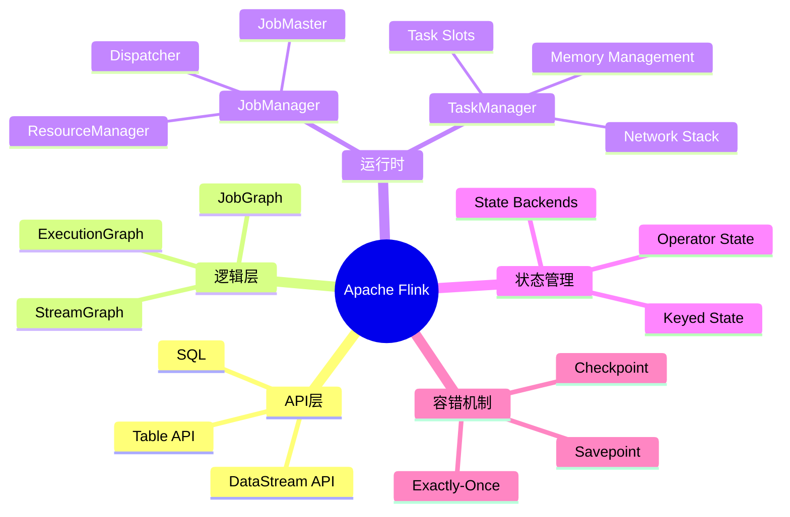
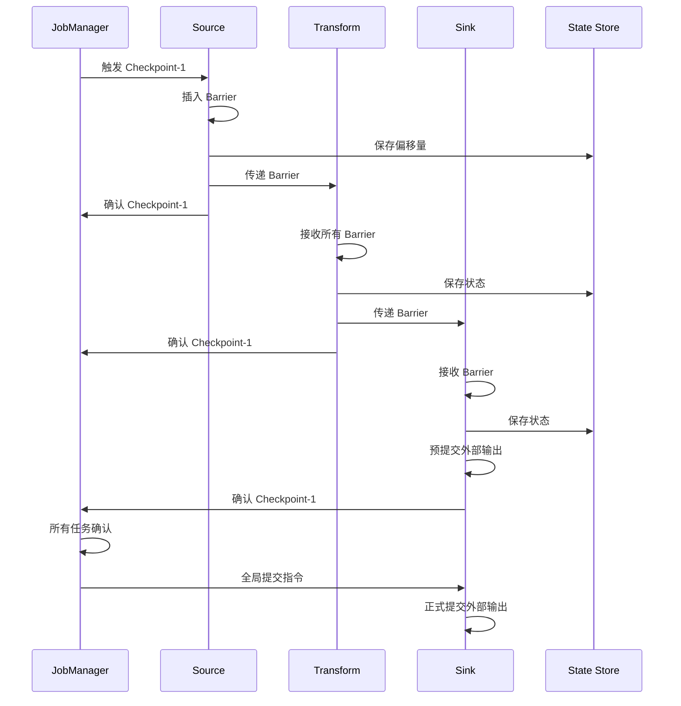
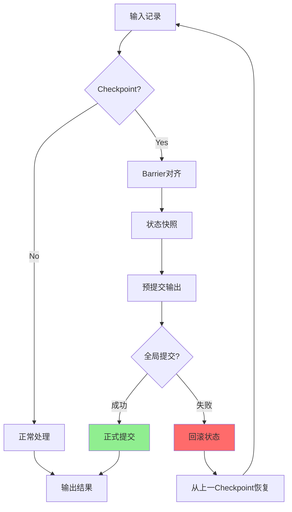

# Apache Flink形式化模型

> **所属单元**: formal-methods/04-application-layer/02-stream-processing | **前置依赖**: [01-stream-formalization](01-stream-formalization.md), [03-window-semantics](03-window-semantics.md) | **形式化等级**: L5-L6

## 1. 概念定义 (Definitions)

### Def-A-02-06: Flink计算模型

Apache Flink计算模型是一个八元组 $\mathcal{F} = (S, O, E, T, W, C, K, \Sigma)$：

- $S$: 数据流集合，无限序列 $S = \langle e_1, e_2, e_3, ... \rangle$
- $O$: 操作符集合，$o \in O$ 是函数 $o: S \rightarrow S'$
- $E$: 执行环境，包括JobManager和TaskManager拓扑
- $T$: 时间语义，$T = \{\text{Event Time}, \text{Processing Time}, \text{Ingestion Time}\}$
- $W$: 水印策略，$W: S \rightarrow \mathbb{T}_{watermark}$
- $C$: 检查点配置，$C = (interval, mode, timeout)$
- $K$: 状态后端类型，$K \in \{\text{Memory}, \text{FsState}, \text{RocksDB}\}$
- $\Sigma$: 状态空间，记录有状态操作符的中间结果

### Def-A-02-07: DataStream API语义

DataStream API操作符语义定义为：

**Map**:
$$\text{map}(f): \langle e_1, e_2, ... \rangle \mapsto \langle f(e_1), f(e_2), ... \rangle$$

**Filter**:
$$\text{filter}(p): \langle e_1, e_2, ... \rangle \mapsto \langle e_i \mid p(e_i) = \text{true} \rangle$$

**KeyBy**:
$$\text{keyBy}(k): S \rightarrow \{S_{k_1}, S_{k_2}, ..., S_{k_n}\}$$
将流按键 $k$ 分区为并行子流。

**Reduce**:
$$\text{reduce}(\oplus): \langle e_1, e_2, e_3, ... \rangle \mapsto \langle e_1, e_1 \oplus e_2, (e_1 \oplus e_2) \oplus e_3, ... \rangle$$

**Window**:
$$\text{window}(w, f): S \rightarrow \langle f(S_{w_1}), f(S_{w_2}), ... \rangle$$
其中 $S_{w_i}$ 是窗口 $w_i$ 内的元素集合。

### Def-A-02-08: Checkpoint机制形式化

检查点是一个分布式快照操作：

$$\text{Checkpoint}: (\Sigma_1, \Sigma_2, ..., \Sigma_n) \times (P_1, P_2, ..., P_m) \rightarrow \text{Snapshot}_k$$

其中：

- $\Sigma_i$: 第 $i$ 个操作符的状态
- $P_j$: 第 $j$ 个数据源的偏移量

**Barrier插入**:

对于源操作符，barrier $b_k$ (对应检查点 $k$) 在位置 $p$ 插入：

$$\text{insert}(b_k, p) \Rightarrow \forall e \in S_{before\_p}: e \in \text{Snapshot}_{k-1} \land \forall e \in S_{after\_p}: e \in \text{Snapshot}_k$$

**状态快照**:

操作符收到所有输入通道的 $b_k$ 后：

$$\text{snapshot}(o) = \{(k, \Sigma_o(k)) \mid b_k \text{ received on all inputs}\}$$

### Def-A-02-09: Watermark传播语义

Watermark是时间进展的标记：

$$w \in \mathbb{T} \cup \{+\infty\}$$

**Watermark生成** (在源操作符):

$$w_{out}(t) = \max_{e \in \text{buffer}} \tau(e) - \delta$$

其中 $\tau(e)$ 是事件时间戳，$\delta$ 是允许的最大延迟。

**Watermark传播**:

对于多输入操作符，输出watermark为各输入watermark的最小值：

$$w_{out} = \min_{i \in inputs} w_i$$

**Watermark单调性**:

$$\forall t_1 < t_2: w(t_1) \leq w(t_2)$$

### Def-A-02-10: 恰好一次语义

恰好一次处理语义要求：

$$\forall e \in Input: |\{o \in Output \mid \text{cause}(o) = e\}| = 1$$

形式化为两个子性质：

**结果持久性**:
$$\text{Output}(e) \text{ committed } \Rightarrow \text{ never lost }$$

**结果唯一性**:
$$\text{Output}(e) \text{ committed } \Rightarrow \text{ never re-emitted }$$

## 2. 属性推导 (Properties)

### Lemma-A-02-04: 检查点一致性

若所有操作符在收到所有输入的barrier后才进行状态快照，则全局快照是一致的：

$$\forall o: (\forall i \in In(o): b_k \in i) \Rightarrow \text{Snapshot}_o(k) \text{ is consistent}$$

**证明**: 满足Chandy-Lamport快照算法的条件。

### Lemma-A-02-05: Watermark完备性

对于Watermark $w$，所有事件时间 $\tau < w$ 的事件都已到达：

$$\forall e: \tau(e) < w \Rightarrow e \in \text{processed}$$

**证明**: 由源操作符watermark生成策略保证。

### Prop-A-02-02: Exactly-Once的充分条件

恰好一次语义满足当：

1. **幂等输出**: 输出操作是幂等的
2. **原子提交**: 状态快照与输出提交原子性完成
3. **可重放源**: 数据源支持偏移量重放

$$\text{Exactly-Once} \iff \text{IdempotentOutput} \land \text{AtomicCommit} \land \text{ReplayableSource}$$

### Lemma-A-02-06: Flink DAG确定性

对于给定的输入流和检查点配置，Flink程序产生确定性的输出流：

$$\forall S_1 = S_2: \mathcal{F}(S_1, C) = \mathcal{F}(S_2, C)$$

## 3. 关系建立 (Relations)

### 3.1 Flink与KPN的对应

```
┌─────────────────┬──────────────────┬──────────────────┐
│     概念        │     Flink         │     KPN          │
├─────────────────┼──────────────────┼──────────────────┤
│ 进程            │ Task/Operator     │ 进程 p_i         │
│ 通道            │ Network Buffer    │ 无界FIFO通道      │
│ 阻塞语义        │ 反压 (Backpressure)│ 读阻塞           │
│ 确定性          │ 配置决定          │ 固有确定性       │
│ 动态拓扑        │ 不支持            │ 不支持           │
│ 时间语义        │ 显式 (Watermark)  │ 无               │
│ 容错            │ Checkpoint        │ 无               │
└─────────────────┴──────────────────┴──────────────────┘
```

### 3.2 Flink与Dataflow模型对比

| 特性 | Flink | Google Dataflow | Beam模型 |
|-----|-------|-----------------|----------|
| 窗口触发 | 水印+允许延迟 | 水印+触发器 | 触发器API |
| 状态管理 | 内嵌状态后端 | 外部状态 | 抽象状态 |
| 一致性 | Checkpoint | 分布式快照 | 实现相关 |
| 时间语义 | 完整支持 | 完整支持 | 完整支持 |
| 乱序处理 | Watermark | Watermark | Watermark |
|  Exactly-Once | 两阶段提交 | 分布式快照 | 实现相关 |

### 3.3 Flink操作符代数定律

| 定律 | 表达式 | 条件 |
|-----|--------|------|
| Map融合 | map(f) ∘ map(g) = map(f ∘ g) | 无 |
| Filter交换 | filter(p) ∘ filter(q) = filter(q) ∘ filter(p) | p, q 纯函数 |
| KeyBy幂等 | keyBy(k) ∘ keyBy(k) = keyBy(k) | 无 |
| Window分配 | window(w₁) → window(w₂) = window(w₂) | w₂ ⊆ w₁ |
| Reduce结合 | reduce(⊕) 并行化 = reduce(⊕) 串行化 | ⊕ 可结合 |

## 4. 论证过程 (Argumentation)

### 4.1 Flink架构层次

```
Flink架构层次:
├── 应用层
│   └── DataStream API / Table API / SQL
├── 核心层
│   ├── StreamGraph (逻辑计划)
│   ├── JobGraph (优化后逻辑)
│   └── ExecutionGraph (物理执行)
├── 运行时层
│   ├── JobManager (协调)
│   └── TaskManager (执行)
├── 状态层
│   ├── MemoryStateBackend
│   ├── FsStateBackend
│   └── RocksDBStateBackend
└── 容错层
    ├── Checkpoint机制
    ├── Savepoint机制
    └── 两阶段提交
```

### 4.2 Checkpoint算法比较

| 算法 | 同步/异步 | 增量支持 | 延迟影响 | 恢复时间 |
|-----|----------|---------|---------|---------|
| Chandy-Lamport | 同步 | 否 | 高 | 短 |
| Flink Barrier | 异步 | 是 | 低 | 中 |
| RocksDB增量 | 异步 | 是 | 很低 | 中 |
| 无检查点 | - | - | 无 | 从0开始 |

### 4.3 时间语义选择

```
时间语义选择决策树:
                    ┌─────────────────┐
                    │  是否需要正确性？ │
                    └────────┬────────┘
                             │
            ┌────────────────┼────────────────┐
            ▼ 否                               ▼ 是
    ┌───────────────┐                  ┌───────────────┐
    │ Processing    │                  │  数据源有序？  │
    │ Time          │                  └───────┬───────┘
    └───────────────┘                          │
                                    ┌──────────┴──────────┐
                                    ▼ 是                  ▼ 否
                            ┌───────────────┐     ┌───────────────┐
                            │ Event Time    │     │ Event Time +  │
                            │ (无Watermark) │     │ Watermark     │
                            └───────────────┘     └───────────────┘
```

## 5. 形式证明 / 工程论证

### 5.1 恰好一次语义的形式化证明

**定理**: Flink的两阶段提交协议实现恰好一次语义。

**证明**:

**系统模型**:

- 源操作符集合 $S = \{s_1, ..., s_n\}$
- 变换操作符集合 $T = \{t_1, ..., t_m\}$
- 汇聚操作符集合 $K = \{k_1, ..., k_p\}$
- 外部汇系统 $X$

**两阶段提交协议**:

**阶段1 - 预提交**:

```
foreach checkpoint k:
  1. JM触发checkpoint k
  2. 源操作符插入barrier b_k, 快照偏移量
  3. 下游操作符收到b_k后快照状态, 转发b_k
  4. 汇聚操作符收到b_k后:
     - 快照状态
     - 预提交输出到外部系统
  5. 所有操作符确认快照完成
```

**阶段2 - 提交**:

```
if (所有操作符确认):
  JM发送全局提交指令
  汇聚操作符执行外部系统正式提交
else:
  回滚到上一checkpoint
```

**正确性论证**:

1. **原子性**: 全局提交指令确保所有操作符状态一致
2. **持久性**: 预提交数据在外部系统事务中，故障可回滚
3. **唯一性**: 检查点恢复确保不会重复处理

**形式化不变式**:

$$I: \forall k: \text{Checkpoint}_k \text{ committed} \Rightarrow \forall o: \text{State}_o(k) \text{ consistent with } X(k)$$

### 5.2 Watermark传播正确性证明

**定理**: Watermark传播确保事件时间处理的正确性。

**证明**:

**基础情形** (源操作符):

源观察到的最大事件时间为 $\tau_{max}$，允许延迟为 $\delta$：

$$w_{out} = \tau_{max} - \delta$$

满足：$\forall e: \tau(e) \leq w_{out} + \delta$，即所有事件要么已到达，要么被标记为延迟。

**归纳步骤**:

对于操作符 $o$ 有输入 $I_1, I_2, ..., I_n$，输出为：

$$w_{out}^{(o)} = \min_{i \in [1,n]} w_{in}^{(i)}$$

设 $e$ 是任意事件满足 $\tau(e) < w_{out}^{(o)}$：

$$\tau(e) < \min_i w_{in}^{(i)} \Rightarrow \forall i: \tau(e) < w_{in}^{(i)}$$

由归纳假设，$\forall i: e$ 已在输入 $i$ 上处理。

因此 $e$ 在输出watermark之前已被处理。

### 5.3 Checkpoint与Exactly-Once关系

```
┌─────────────────────────────────────────────────────────────┐
│                   Exactly-Once 实现                         │
├─────────────────────────────────────────────────────────────┤
│                                                             │
│  ┌──────────┐    ┌──────────┐    ┌──────────┐              │
│  │  Source  │───▶│ Transform│───▶│   Sink   │              │
│  └──────────┘    └──────────┘    └──────────┘              │
│       │               │               │                    │
│       ▼               ▼               ▼                    │
│  ┌──────────┐    ┌──────────┐    ┌──────────┐              │
│  │ 偏移量   │    │ 状态快照 │    │ 预提交   │              │
│  │ 持久化   │    │ 持久化   │    │ 事务     │              │
│  └──────────┘    └──────────┘    └──────────┘              │
│                                         │                  │
│                                         ▼                  │
│                              ┌──────────────────┐         │
│                              │  全局提交指令    │         │
│                              │  (JobManager)    │         │
│                              └──────────────────┘         │
│                                                             │
│  故障恢复: 从最近checkpoint加载状态 + 重放源偏移量            │
│                                                             │
└─────────────────────────────────────────────────────────────┘
```

## 6. 实例验证 (Examples)

### 6.1 DataStream API代码与语义

```java
// Flink程序
DataStream<Event> stream = env
    .addSource(new KafkaSource<>())           // Source
    .map(e -> transform(e))                  // Map
    .filter(e -> e.value > 0)                // Filter
    .keyBy(e -> e.key)                       // KeyBy
    .window(TumblingEventTimeWindows.of(Time.minutes(5)))  // Window
    .aggregate(new AverageAggregate())       // Aggregate
    .addSink(new KafkaSink<>());             // Sink
```

形式化表示：

```
Program = Sink ∘ Window(5min, avg) ∘ KeyBy(key) ∘ Filter(>0) ∘ Map(transform) ∘ Source
```

### 6.2 Checkpoint配置与行为

```java
// 检查点配置
env.enableCheckpointing(60000);  // 60秒间隔
env.getCheckpointConfig().setCheckpointingMode(
    CheckpointingMode.EXACTLY_ONCE);
env.getCheckpointConfig().setMinPauseBetweenCheckpoints(30000);
env.getCheckpointConfig().setCheckpointTimeout(600000);
env.getCheckpointConfig().setMaxConcurrentCheckpoints(1);
env.getCheckpointConfig().enableExternalizedCheckpoints(
    ExternalizedCheckpointCleanup.RETAIN_ON_CANCELLATION);

// 状态后端
env.setStateBackend(new RocksDBStateBackend("hdfs://checkpoints"));
```

语义约束：

```
CheckpointInterval = 60s
MaxConcurrent = 1  ⟹  全局顺序性
ExactlyOnceMode  ⟹  Barrier对齐
RocksDBBackend   ⟹  增量检查点 + 大状态支持
```

### 6.3 Watermark策略实现

```java
// 固定延迟Watermark
WatermarkStrategy.<Event>forBoundedOutOfOrderness(
    Duration.ofSeconds(5))
    .withTimestampAssigner((event, timestamp) -> event.eventTime);

// 形式化语义
// w(t) = max{τ(e) | e arrived by t} - 5s

// 空闲源处理
WatermarkStrategy.<Event>forBoundedOutOfOrderness(...)
    .withIdleness(Duration.ofMinutes(1));
```

### 6.4 Exactly-Once Sink实现

```java
// 两阶段提交Sink示例
public class TwoPhaseCommitSink extends TwoPhaseCommitSinkFunction<String> {

    @Override
    protected void invoke(Transaction transaction, String value, Context context) {
        transaction.write(value);  // 写入未提交缓冲区
    }

    @Override
    protected Transaction beginTransaction() {
        return new Transaction();  // 开启事务
    }

    @Override
    protected void preCommit(Transaction transaction) {
        transaction.flush();  // 预提交（持久化但未可见）
    }

    @Override
    protected void commit(Transaction transaction) {
        transaction.commit();  // 全局提交后正式提交
    }

    @Override
    protected void abort(Transaction transaction) {
        transaction.rollback();  // 失败回滚
    }
}
```

## 7. 可视化 (Visualizations)

### 7.1 Flink架构全景



### 7.2 Checkpoint流程



### 7.3 Watermark传播

```mermaid
graph LR
    subgraph "Source"
        S1[分区1<br/>w=10:00]
        S2[分区2<br/>w=10:05]
        S3[分区3<br/>w=09:55]
    end

    subgraph "Window Operator"
        WO[min(10:00, 10:05, 09:55)<br/>w=09:55]
    end

    subgraph "Aggregate"
        AG[w=09:55]
    end

    S1 --> WO
    S2 --> WO
    S3 --> WO
    WO --> AG

    style S3 fill:#ff9999
    style WO fill:#ff9999
    style AG fill:#ff9999
```

### 7.4 Exactly-Once保证机制



### 7.5 Flink执行图转换

```mermaid
graph TB
    subgraph StreamGraph逻辑
        A[Source] --> B[Map]
        B --> C[KeyBy]
        C --> D[Window]
        D --> E[Sink]
    end

    subgraph JobGraph优化
        F[Source] --> G[Map | KeyBy]
        G --> H[Window]
        H --> I[Sink]
    end

    subgraph ExecutionGraph物理
        J1[Source-1] --> K1[Map-1]
        J2[Source-2] --> K2[Map-2]
        K1 --> L1[Window-1]
        K2 --> L1
        L1 --> M1[Sink-1]
    end

    A -.-> F
    B -.-> G
    C -.-> G
    D -.-> H
    E -.-> I

    F -.-> J1
    F -.-> J2
    G -.-> K1
    G -.-> K2
    H -.-> L1
    I -.-> M1
```

## 8. 引用参考 (References)
