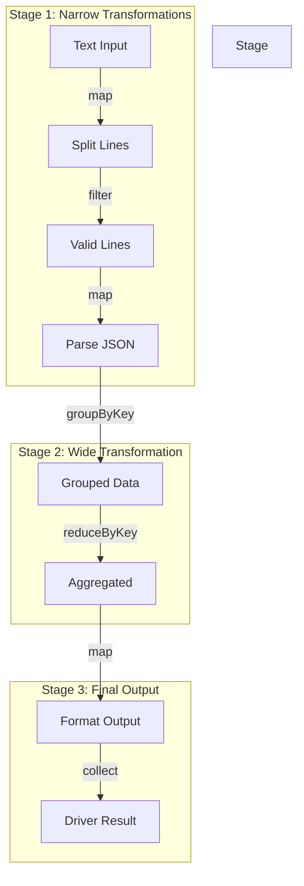
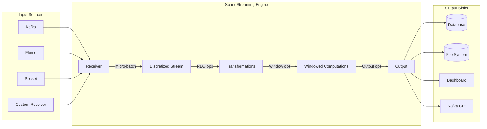
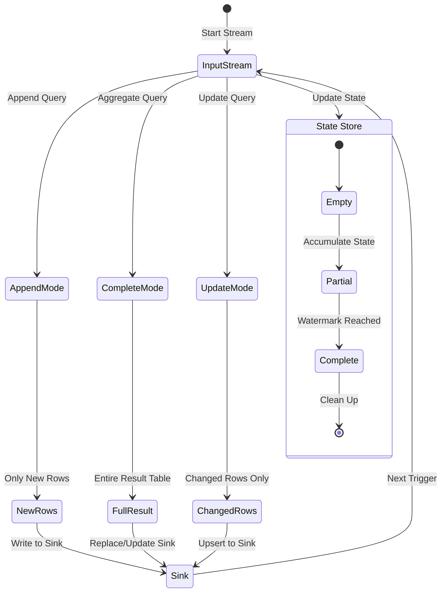
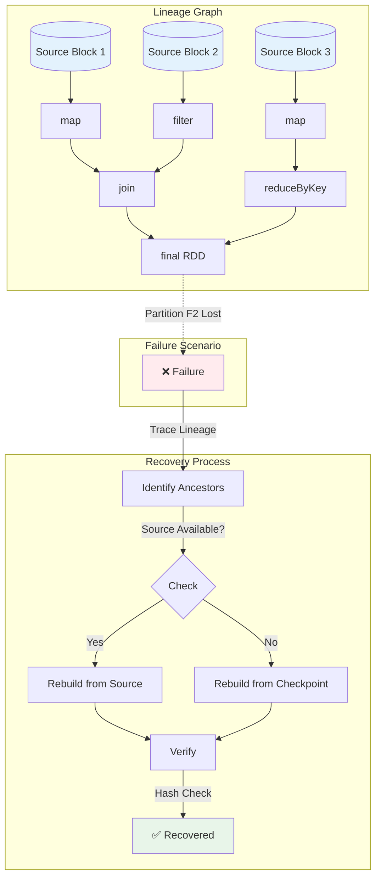

# Spark形式化验证与语义分析

> 所属阶段: Struct/ | 前置依赖: [01-stream-formalization.md](./01-stream-formalization.md), [04-flink-formalization.md](./04-flink-formalization.md) | 形式化等级: L5-L6

---

## 1. 概念定义 (Definitions)

本节建立Spark计算模型的严格形式化基础，涵盖RDD、DStream和Structured Streaming的核心语义。

### 1.1 Spark RDD形式化模型

**定义 Def-SP-05-01: 弹性分布式数据集 (RDD)**

一个RDD定义为五元组：

$$\mathcal{R} = \langle P, \Sigma, \mathcal{L}, T, \rho \rangle$$

其中：

- $P = \{p_1, p_2, \ldots, p_n\}$：分区集合，每个分区 $p_i$ 是数据记录的子集
- $\Sigma$：元素类型签名
- $\mathcal{L}: P \rightarrow 2^{Op}$：Lineage函数，将每个分区映射到其依赖的操作序列
- $T: P \rightarrow \mathcal{T}$：变换函数，定义从父分区计算子分区的规则
- $\rho: P \rightarrow [0,1]$：持久化级别函数

**定义 Def-SP-05-02: RDD变换 (Transformation)**

变换 $T$ 是从一个RDD到另一个RDD的偏函数：

$$T: \mathcal{R}_{in} \rightharpoonup \mathcal{R}_{out}$$

变换分为两类：

- **窄依赖 (Narrow Dependency)**: $\forall p_{out} \in P_{out}, |Dep(p_{out})| = 1$
- **宽依赖 (Wide Dependency)**: $\exists p_{out} \in P_{out}, |Dep(p_{out})| > 1$

其中 $Dep(p)$ 表示分区 $p$ 的父分区集合。

### 1.2 Spark Streaming (DStream) 语义

**定义 Def-SP-05-03: 离散流 (DStream)**

DStream是时间序列上的RDD序列：

$$\mathcal{D} = \{ R_t \}_{t \in \mathcal{T}_{batch}}$$

其中 $\mathcal{T}_{batch} = \{ k \cdot \Delta t \mid k \in \mathbb{N} \}$ 是批次时间戳集合，$\Delta t$ 为批次间隔。

**定义 Def-SP-05-04: DStream操作语义**

对于DStream变换 $F: \mathcal{D}_{in} \rightarrow \mathcal{D}_{out}$，其语义为：

$$\forall t \in \mathcal{T}_{batch}: R_{out}^t = F^t(\{ R_{in}^{t'} \}_{t' \leq t})$$

其中 $F^t$ 表示时刻 $t$ 的具体变换实例，可能依赖于历史批次。

**状态DStream (StateDStream)**：

$$S^t = \text{update}(S^{t-\Delta t}, R_{in}^t)$$

其中 $\text{update}: \Sigma \times 2^E \rightarrow \Sigma$ 是状态更新函数。

### 1.3 Structured Streaming形式化

**定义 Def-SP-05-05: 无界关系表 (Unbounded Table)**

Structured Streaming将流抽象为持续追加的无界表：

$$\mathcal{U} = \langle C, \tau, \prec \rangle$$

其中：

- $C$：表模式 (Schema)
- $\tau: \mathbb{N} \rightarrow 2^T$：时间戳到元组集合的映射
- $\prec$：事件时间上的全序关系

**定义 Def-SP-05-06: 增量执行模型**

查询 $Q$ 在流上的增量执行：

$$\Delta R^t = Q(R^{0:t}) - Q(R^{0:t-\Delta t})$$

其中 $R^{0:t} = \bigcup_{i=0}^{t} R^i$ 表示从起始到时刻 $t$ 的所有数据。

**输出模式 (Output Mode)**：

- **Append Mode**: 仅输出新增结果 $\{ r \in R_{out}^t \mid r \notin R_{out}^{t-\Delta t} \}$
- **Complete Mode**: 输出完整结果 $R_{out}^t$
- **Update Mode**: 输出变更结果 $\Delta R_{out}^t$

### 1.4 RDD Lineage数学模型

**定义 Def-SP-05-07: Lineage图**

RDD的Lineage是一个有向无环图 (DAG)：

$$\mathcal{G}_{lineage} = \langle V, E, \ell \rangle$$

其中：

- $V = \{ R_i \}$：RDD节点集合
- $E \subseteq V \times V$：依赖边集合
- $\ell: E \rightarrow Op$：边标记函数，表示变换类型

**定义 Def-SP-05-08: 计算闭包**

RDD $R$ 的计算闭包定义为：

$$\mathcal{C}(R) = \{ R' \mid (R', R) \in E^* \}$$

其中 $E^*$ 是依赖关系的传递闭包。计算闭包包含重构 $R$ 所需的所有祖先RDD。

---

## 2. 属性推导 (Properties)

### 2.1 RDD不可变性

**引理 Lemma-SP-05-01: RDD不可变性**

$$\forall R \in \mathcal{R}, \forall t_1, t_2: R_{t_1} = R_{t_2}$$

*证明*：由Def-SP-05-01，RDD的定义不包含可变状态。所有变换创建新的RDD实例，而非修改现有实例。∎

**推论 Cor-SP-05-01: 引用透明性**

$$\forall T \in \mathcal{T}, \forall R: T(R) \text{ 在相同输入下产生相同输出}$$

### 2.2 Lazy Evaluation性质

**引理 Lemma-SP-05-02: 惰性求值语义**

设 $E$ 为RDD表达式，$\llbracket E \rrbracket$ 为其语义解释：

$$\llbracket E \rrbracket_{lazy} = \begin{cases}
\text{unevaluated} & \text{if no action} \\
\llbracket E \rrbracket_{strict} & \text{on action invocation}
\end{cases}$$

**引理 Lemma-SP-05-03: 执行计划优化**

对于变换序列 $T_1 \circ T_2 \circ \ldots \circ T_n$，Spark优化器生成等价但更高效的执行计划 $P_{opt}$：

$$\forall R: P_{opt}(R) = (T_1 \circ \ldots \circ T_n)(R) \land \text{cost}(P_{opt}) \leq \text{cost}(T_1 \circ \ldots \circ T_n)$$

### 2.3 Fault Tolerance through Lineage

**引理 Lemma-SP-05-04: Lineage重建确定性**

给定Lineage图 $\mathcal{G}_{lineage}$，分区 $p$ 的重建是确定性的：

$$\text{reconstruct}(\mathcal{G}, p) = \text{apply}(\mathcal{L}(p), \text{source}(p))$$

**引理 Lemma-SP-05-05: 持久化边界**

设 $C_{persist} \subseteq V$ 为持久化RDD集合，则任意RDD $R$ 的重建复杂度：

$$\text{complexity}(R) \leq \min_{R_c \in C_{persist} \cap \mathcal{C}(R)} \text{dist}(R_c, R)$$

其中 $\text{dist}$ 是Lineage图中的最短路径距离。

---

## 3. 关系建立 (Relations)

### 3.1 RDD与BSP模型关系

**BSP模型回顾**：Bulk Synchronous Parallel (BSP) 模型由Valiant提出[^6]，包含：
- 局部计算阶段
- 全局通信阶段
- 屏障同步阶段

**命题 Prop-SP-05-01: RDD-BSP对应关系**

Spark Stage划分与BSP超步存在结构对应：

$$\text{Stage}_i \cong \text{Superstep}_i$$

| BSP组件 | Spark实现 |
|---------|-----------|
| 局部计算 | Narrow transformation within partition |
| 全局通信 | Shuffle (Wide transformation) |
| 屏障同步 | Stage boundary |

**形式化映射**：

$$\Phi_{BSP}: \text{BSP-Program} \rightarrow \text{RDD-Program}$$

$$\Phi_{BSP}(\langle C, M, S \rangle) = \langle \text{map}(C), \text{shuffle}(M), \text{barrier}(S) \rangle$$

### 3.2 Spark与MapReduce关系

**命题 Prop-SP-05-02: MapReduce表达力包含**

任何MapReduce作业可表示为Spark RDD程序：

$$\forall MR \in \text{MapReduce}: \exists RDD_{prog}: \llbracket MR \rrbracket = \llbracket RDD_{prog} \rrbracket$$

*构造证明*：
- Map阶段: `mapPartitions` + `flatMap`
- Reduce阶段: `reduceByKey` 或 `groupByKey` + `mapValues`
- Combiner: 自动通过 `reduceByKey` 的map-side reduce实现

**增强特性**：
| 特性 | MapReduce | Spark RDD |
|------|-----------|-----------|
| Iterative algorithms | 低效（重复I/O） | 缓存支持 |
| Interactive queries | 不支持 | 低延迟 |
| Stream processing | 不支持（需Storm） | DStream/Structured Streaming |
| DAG execution | 两阶段固定 | 多Stage优化 |

### 3.3 Structured Streaming与增量计算

**命题 Prop-SP-05-03: 增量查询等价性**

Structured Streaming查询 $Q$ 等价于批处理查询的增量版本：

$$\llbracket Q \rrbracket_{stream}(\mathcal{U}) = \lim_{t \to \infty} \{ \Delta Q(R^{0:t}) \}_{t \in \mathcal{T}}$$

**与增量视图维护 (IVM) 的关系**[^7]：

Structured Streaming实现了带时间语义的流式IVM：

$$\mathcal{M}_{stream} = \mathcal{M}_{IVM} + \langle \text{event-time}, \text{watermark}, \text{output-mode} \rangle$$

---

## 4. 论证过程 (Argumentation)

### 4.1 Lineage-based Recovery正确性

**恢复机制**：当分区 $p$ 丢失时，Spark通过以下步骤恢复：

1. **Lineage追溯**：从 $p$ 回溯至最近的持久化祖先或数据源
2. **重计算**：重新执行Lineage中的变换序列
3. **验证**：校验恢复分区的数据完整性

**正确性论证**：

设 $p_{lost}$ 为丢失分区，$\mathcal{L}(p_{lost}) = [op_1, op_2, \ldots, op_k]$ 为其Lineage。

**论证步骤**：

1. **确定性论证**：由于RDD不可变性（Lemma-SP-05-01），相同输入必然产生相同输出
2. **原子性论证**：每个变换 $op_i$ 是确定性的纯函数，无副作用
3. **组合性论证**：确定性函数的复合仍是确定性的

因此：

$$\text{reconstruct}(p_{lost}) = op_k \circ \ldots \circ op_1 (source) = p_{lost}^{original}$$

### 4.2 Wide/Narrow Dependency分析

**定义 Def-SP-05-09: 依赖分类形式化**

对于变换 $T: R_{in} \rightarrow R_{out}$：

$$\text{DepType}(T) = \begin{cases}
\text{Narrow} & \text{if } \forall p_{out} \in P_{out}, \exists! p_{in} \in P_{in}: p_{out} \text{ depends on } p_{in} \\
\text{Wide} & \text{otherwise}
\end{cases}$$

**窄依赖子类型**：
- **NarrowDependency-1:1**: map, filter, union
- **NarrowDependency-N:1**: coalesce (无shuffle)

**宽依赖类型**：
- **WideDependency-N:M**: groupByKey, reduceByKey, join, repartition

**执行影响分析**：

| 特性 | Narrow | Wide |
|------|--------|------|
| Pipeline | 可在同一Stage内 | Stage边界 |
| Recovery | 仅重算丢失分区 | 可能需要重算多个父分区 |
| Data movement | 无shuffle | 需要shuffle |
| Fault isolation | 良好 | 跨分区依赖 |

### 4.3 Shuffle操作语义

**定义 Def-SP-05-10: Shuffle操作**

Shuffle是从 $N$ 个输入分区到 $M$ 个输出分区的数据重分布：

$$\text{Shuffle}: (K \times V)^N \rightarrow (K \times 2^V)^M$$

**两阶段实现**：

1. **Map阶段 (Shuffle Write)**：
   $$\forall p_{in} \in P_{in}: \text{partition}(p_{in}) \rightarrow \{ (b_1, data_1), \ldots, (b_M, data_M) \}$$

   其中 $b_i$ 是目标bucket，$hash(K) \mod M$ 决定映射。

2. **Reduce阶段 (Shuffle Read)**：
   $$\forall p_{out} \in P_{out}: p_{out} = \bigcup_{p_{in}} \text{fetch}(b_{p_{out}}, p_{in})$$

**一致性保证**：
- **External Sorting**: 大数据量时磁盘排序保证内存限制
- **Spill机制**: 缓冲池满时溢出到磁盘
- **Checksum验证**: 数据传输完整性校验

---

## 5. 形式证明 / 工程论证 (Proof / Engineering Argument)

### 5.1 Thm-SP-05-01: RDD Lineage恢复定理

**定理陈述**：

给定RDD $R$ 及其Lineage图 $\mathcal{G}_{lineage}$，对于任意分区 $p \in P_R$，若其源数据可用且Lineage完整，则 $p$ 可被确定性重建。

$$\forall p \in P_R: (\text{source-available}(\mathcal{C}(p)) \land \text{lineage-complete}(p)) \Rightarrow \exists! p': p' = p$$

**证明**：

*结构归纳法*：

**基础情况**：$p$ 直接来源于数据源（如HDFS块）。
- 由source-available假设，$p$ 可从源重新读取
- 重建结果 $p' = p$（确定性读取）

**归纳步骤**：假设对于 $p$ 的所有父分区 $p_{parent} \in Dep(p)$，定理成立。

1. $p$ 的Lineage为 $\mathcal{L}(p) = [op_1, \ldots, op_k]$
2. 每个 $op_i$ 是确定性变换（由RDD不可变性）
3. 父分区可重建（归纳假设）
4. 因此：$p' = op_k \circ \ldots \circ op_1 (parents) = p$

**唯一性**：由变换的纯函数性质，相同输入产生唯一输出。∎

### 5.2 Thm-SP-05-02: Lazy Evaluation正确性

**定理陈述**：

惰性求值策略产生的执行结果与严格求值等价，但具有更优的资源利用特性。

$$\forall E \in \text{Expr}: \llbracket E \rrbracket_{lazy} = \llbracket E \rrbracket_{strict} \land \text{resources}(\llbracket E \rrbracket_{lazy}) \leq \text{resources}(\llbracket E \rrbracket_{strict})$$

**证明**：

*等价性*：

1. RDD变换是函数组合的语法糖
2. 惰性求值延迟了函数应用
3. Action触发时，函数组合被实际执行
4. 由函数复合的结合律，执行顺序不影响最终结果

*资源优化*：

设原始变换链为 $T_1 \rightarrow T_2 \rightarrow \ldots \rightarrow T_n \rightarrow A$（Action）。

**严格求值**：
- 每个中间RDD被物化：$\sum_{i=1}^{n} |R_i|$ 内存/磁盘

**惰性求值**：
- Catalyst优化器应用规则：合并、剪枝、谓词下推
- 生成优化计划 $P_{opt}$ 使得 $|\text{intermediate}(P_{opt})| \leq |\text{intermediate}(strict)|$
- 流水线执行减少中间物化

因此 $\text{resources}(lazy) \leq \text{resources}(strict)$。∎

### 5.3 Thm-SP-05-03: Structured Streaming一致性

**定理陈述**：

在Append输出模式下，Structured Streaming产生的结果与对历史数据的批处理查询结果一致。

$$\forall Q, \forall t: \text{Output}^t_{append} = Q(\bigcup_{i=0}^{t} \Delta R^i) - Q(\bigcup_{i=0}^{t-\Delta t} \Delta R^i)$$

且累积结果满足：

$$\bigcup_{i=0}^{t} \text{Output}^i_{append} = Q(\bigcup_{i=0}^{t} R^i)$$

**证明**：

*Append Mode语义*：

1. 设 $U^t = \bigcup_{i=0}^{t} R^i$ 为到时刻 $t$ 的所有输入
2. 批处理查询结果为 $Q(U^t)$
3. 流式增量计算产生 $\Delta Q^t = Q(U^t) - Q(U^{t-\Delta t})$
4. 输出的Append语义保证：仅输出新出现的元组

*一致性验证*：

$$\bigcup_{i=0}^{t} \Delta Q^i = \Delta Q^0 \cup \Delta Q^1 \cup \ldots \cup \Delta Q^t$$

$$= Q(R^0) \cup (Q(R^0 \cup R^1) - Q(R^0)) \cup \ldots \cup (Q(U^t) - Q(U^{t-\Delta t}))$$

$$= Q(U^t) \text{ （望远镜求和）}$$

**Complete Mode**：直接输出 $Q(U^t)$，与批处理等价显然。

**Update Mode**：输出变更流，累积结果同样收敛到批处理结果。∎

---

## 6. 实例验证 (Examples)

### 6.1 PageRank形式化规约

PageRank算法在Spark中的形式化实现：

```scala
// 初始图结构: G = (V, E)
val links: RDD[(String, Iterable[String])] = // URL -> 出链列表
val ranks: RDD[(String, Double)] = // URL -> 排名值
  links.mapValues(v => 1.0)

// 迭代收敛
for (iter <- 1 to maxIterations) {
  // 贡献值计算
  val contributions: RDD[(String, Double)] =
    links.join(ranks).flatMap {
      case (url, (outlinks, rank)) =>
        val contrib = rank / outlinks.size
        outlinks.map(dest => (dest, contrib))
    }

  // 排名更新 (阻尼因子 d = 0.85)
  ranks = contributions
    .reduceByKey(_ + _)  // Wide dependency - Shuffle
    .mapValues(sum => 0.15 + 0.85 * sum)
}
```

**形式化规约**：

$$\text{PR}^0(v) = \frac{1}{|V|}$$

$$\text{PR}^{k+1}(v) = \frac{1-d}{|V|} + d \sum_{u \in In(v)} \frac{\text{PR}^k(u)}{|Out(u)|}$$

**Lineage分析**：
- `join` 操作引入Wide Dependency
- `reduceByKey` 触发Shuffle
- 每次迭代形成新的Stage边界

### 6.2 Streaming WordCount

Structured Streaming实现的WordCount：

```scala
val lines = spark.readStream
  .format("kafka")
  .option("subscribe", "topic")
  .load()

val words = lines
  .selectExpr("CAST(value AS STRING)")
  .as[String]
  .flatMap(_.split(" "))

val wordCounts = words
  .groupBy("value")
  .count()

val query = wordCounts.writeStream
  .outputMode("complete")
  .format("console")
  .start()
```

**增量语义形式化**：

设输入流 $\mathcal{S} = \{ (w_1, t_1), (w_2, t_2), \ldots \}$，其中 $w_i$ 是单词，$t_i$ 是时间戳。

**状态维护**：

$$\text{Count}(w, t) = \sum_{(w_i, t_i) \in \mathcal{S}^{0:t}, w_i = w} 1$$

**增量更新**：

$$\Delta \text{Count}(w, t) = \sum_{(w_i, t_i) \in \Delta \mathcal{S}^t, w_i = w} 1$$

$$\text{Count}(w, t) = \text{Count}(w, t-\Delta t) + \Delta \text{Count}(w, t)$$

**Exactly-Once语义**：通过checkpoint和WAL保证状态一致性。

### 6.3 Join操作语义分析

**Shuffle Hash Join**：

```scala
val result = largeRDD.join(smallRDD, "shuffle_hash")
```

**执行语义**：
1. 对小表 $S$ 构建哈希表：$H_S: K \rightarrow 2^V$
2. Shuffle大表 $L$ 的分区
3. 探测阶段：$\forall (k, v) \in L: \text{output } \{(k, (v, v')) \mid v' \in H_S[k]\}$

**复杂度分析**：

$$\text{Cost}_{shuffle} = O(|L| + |S| + |L \bowtie S|)$$

$$\text{Memory}_{shuffle} = O(\max_{partition} |S_i|)$$

**Broadcast Hash Join**：

当 $|S| < \text{threshold}$ 时：

1. 将小表广播到所有Executor
2. 本地Join，无Shuffle开销

$$\text{Cost}_{broadcast} = O(|S| \cdot N_{executor} + |L| + |L \bowtie S|)$$

**Sort-Merge Join**：

当两个表都较大且有序时：

$$\text{Cost}_{sortmerge} = O(|L|\log|L| + |S|\log|S| + |L \bowtie S|)$$

---

## 7. 可视化 (Visualizations)

### 7.1 RDD Lineage与Stage划分

下图展示RDD Lineage图如何划分为执行Stage：



**说明**：Stage边界出现在Wide Dependency（如groupByKey、reduceByKey）处。窄依赖操作（map、filter）可在同一Stage内流水线执行。

### 7.2 Spark Streaming微批处理架构



**说明**：Spark Streaming将连续流切分为微批次（Micro-batches），每批作为RDD处理。Receiver负责数据收集，按批次间隔触发处理。

### 7.3 Structured Streaming增量执行模型



**说明**：Structured Streaming将流视为无界表，每次触发查询增量更新结果。状态存储维护聚合状态，支持事件时间和水印处理。

### 7.4 Fault Recovery with Lineage



**说明**：当分区丢失时，Spark通过追溯Lineage图识别所需祖先分区。若源数据可用，从源重计算；否则从最近的checkpoint恢复。

---

## 8. 引用参考 (References)

[^1]: Zaharia M, Chowdhury M, Franklin MJ, Shenker S, Stoica I. "Spark: Cluster Computing with Working Sets." In: Proceedings of the 2nd USENIX Conference on Hot Topics in Cloud Computing (HotCloud), 2010. https://www.usenix.org/event/hotcloud10/tech/full_papers/Zaharia.pdf

[^2]: Zaharia M, Das T, Li H, Hunter T, Shenker S, Stoica I. "Discretized Streams: Fault-Tolerant Streaming Computation at Scale." In: Proceedings of the 24th ACM Symposium on Operating Systems Principles (SOSP), 2013. https://doi.org/10.1145/2517349.2522737

[^3]: Armbrust M, Das T, Torres J, et al. "Structured Streaming: A Declarative API for Real-Time Applications in Apache Spark." In: Proceedings of the 2018 International Conference on Management of Data (SIGMOD), 2018. https://doi.org/10.1145/3183713.3190664

[^4]: Zaharia M, Chowdhury M, Das T, et al. "Resilient Distributed Datasets: A Fault-Tolerant Abstraction for In-Memory Cluster Computing." In: Proceedings of the 9th USENIX Conference on Networked Systems Design and Implementation (NSDI), 2012. https://www.usenix.org/conference/nsdi12/technical-sessions/presentation/zaharia

[^5]: Dean J, Ghemawat S. "MapReduce: Simplified Data Processing on Large Clusters." Communications of the ACM, 51(1):107-113, 2008. https://doi.org/10.1145/1327452.1327492

[^6]: Valiant LG. "A Bridging Model for Parallel Computation." Communications of the ACM, 33(8):103-111, 1990. https://doi.org/10.1145/79173.79181

[^7]: Chirkova R, Yang J. "Materialized Views." Foundations and Trends in Databases, 4(4):295-405, 2012. https://doi.org/10.1561/1900000020

[^8]: Akidau T, Bradshaw R, Chambers C, et al. "The Dataflow Model: A Practical Approach to Balancing Correctness, Latency, and Cost in Massive-Scale, Unbounded, Out-of-Order Data Processing." Proceedings of the VLDB Endowment, 8(12):1792-1803, 2015. https://doi.org/10.14778/2824032.2824076

[^9]: Page L, Brin S, Motwani R, Winograd T. "The PageRank Citation Ranking: Bringing Order to the Web." Technical Report, Stanford InfoLab, 1999. http://ilpubs.stanford.edu:8090/422/

[^10]: Karau H, Konwinski A, Wendell P, Zaharia M. "Learning Spark: Lightning-Fast Big Data Analysis." O'Reilly Media, 2015. ISBN: 978-1449358624

[^11]: Chambers B, Zaharia M. "Spark: The Definitive Guide: Big Data Processing Made Simple." O'Reilly Media, 2018. ISBN: 978-1491912218

[^12]: Armbrust M, Xin RS, Lian C, et al. "Spark SQL: Relational Data Processing in Spark." In: Proceedings of the 2015 ACM SIGMOD International Conference on Management of Data, 2015. https://doi.org/10.1145/2723372.2742797

---

## 附录A: 形式化符号总表

| 符号 | 含义 |
|------|------|
| $\mathcal{R}$ | RDD类型 |
| $P$ | 分区集合 |
| $\mathcal{L}$ | Lineage函数 |
| $\mathcal{G}_{lineage}$ | Lineage DAG |
| $\mathcal{D}$ | DStream |
| $\mathcal{U}$ | 无界关系表 |
| $\Delta$ | 增量/变更 |
| $\bowtie$ | Join操作 |
| $\mathcal{C}(R)$ | RDD $R$ 的计算闭包 |

## 附录B: Spark核心算子形式化

| 算子 | 类型 | 语义 |
|------|------|------|
| `map(f)` | Narrow | $\{ f(e) \mid e \in R \}$ |
| `filter(p)` | Narrow | $\{ e \in R \mid p(e) \}$ |
| `flatMap(f)` | Narrow | $\bigcup_{e \in R} f(e)$ |
| `reduceByKey(f)` | Wide | $\{ (k, f(vs)) \mid (k, vs) \in \text{group}(R) \}$ |
| `groupByKey()` | Wide | $\{ (k, \{ v \mid (k,v) \in R \}) \}$ |
| `join(other)` | Wide | $\{ (k, (v_1, v_2)) \mid (k,v_1) \in R, (k,v_2) \in \text{other} \}$ |
| `union(other)` | Narrow | $R \cup \text{other}$ |
| `repartition(n)` | Wide | $\text{hash}(R, n)$ |

## 9. 引用参考 (Extended)

[^13]: M. Zaharia et al., "Spark: Cluster Computing with Working Sets", in HotCloud 2010. https://www.usenix.org/event/hotcloud10/tech/full_papers/Zaharia.pdf

[^14]: M. Zaharia et al., "Resilient Distributed Datasets: A Fault-Tolerant Abstraction for In-Memory Cluster Computing", in NSDI 2012. https://www.usenix.org/conference/nsdi12/technical-sessions/presentation/zaharia

[^15]: M. Zaharia et al., "Discretized Streams: Fault-Tolerant Streaming Computation at Scale", in SOSP 2013. https://doi.org/10.1145/2517349.2522737

[^16]: M. Armbrust et al., "Structured Streaming: A Declarative API for Real-Time Applications in Apache Spark", in SIGMOD 2018. https://doi.org/10.1145/3183713.3190664

[^17]: L. G. Valiant, "A Bridging Model for Parallel Computation", Communications of the ACM, 33(8), pp. 103-111, 1990. https://doi.org/10.1145/79173.79181

[^18]: T. Akidau et al., "The Dataflow Model: A Practical Approach to Balancing Correctness, Latency, and Cost in Massive-Scale, Unbounded, Out-of-Order Data Processing", in VLDB 2015, 8(12), pp. 1792-1803.

[^19]: S. L. Graham, P. B. Kessler, M. K. McKusick, "gprof: A Call Graph Execution Profiler", in SIGPLAN 1982, pp. 120-126. https://doi.org/10.1145/872726.806987

[^20]: J. Dean, S. Ghemawat, "MapReduce: Simplified Data Processing on Large Clusters", Communications of the ACM, 51(1), pp. 107-113, 2008. https://doi.org/10.1145/1327452.1327492

---

*文档版本: v1.0 | 创建日期: 2026-04-10 | 形式化等级: L5-L6*
