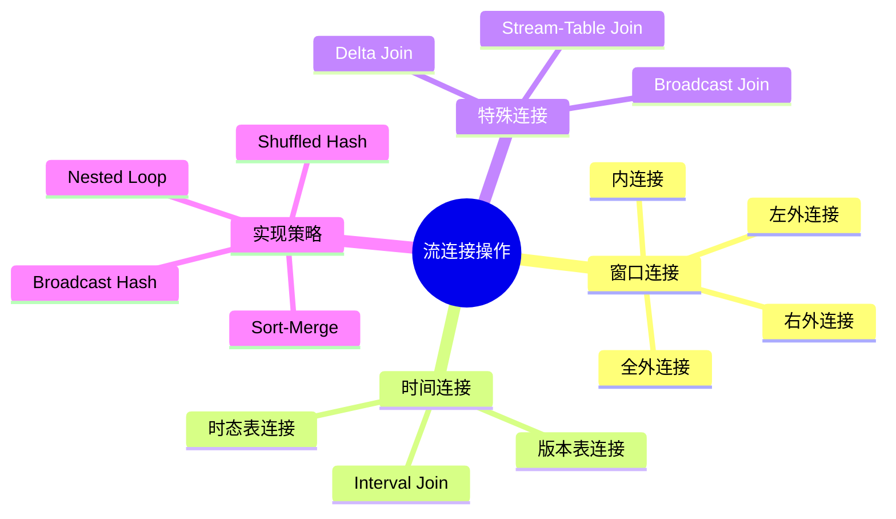
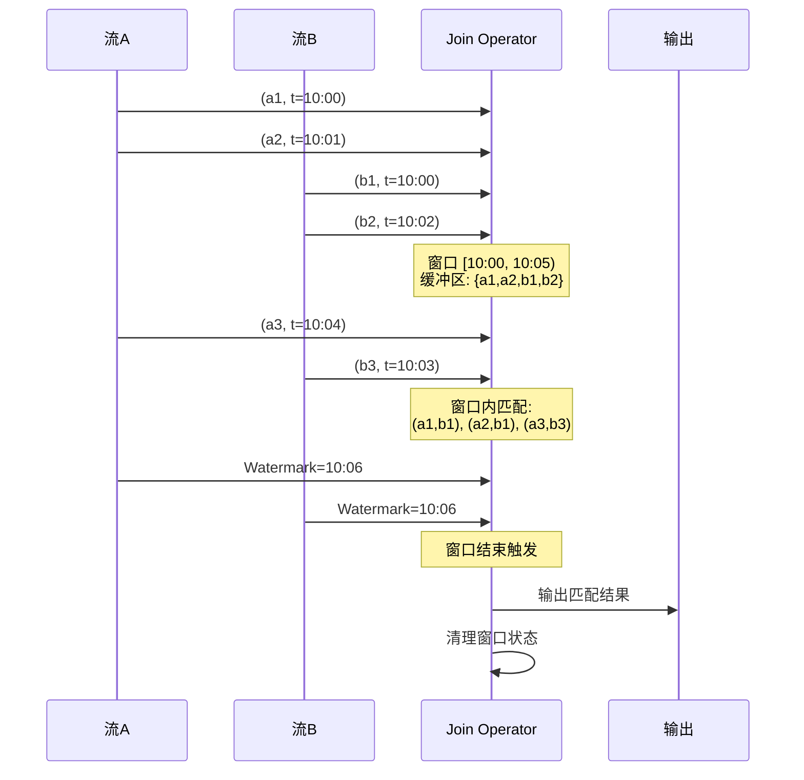
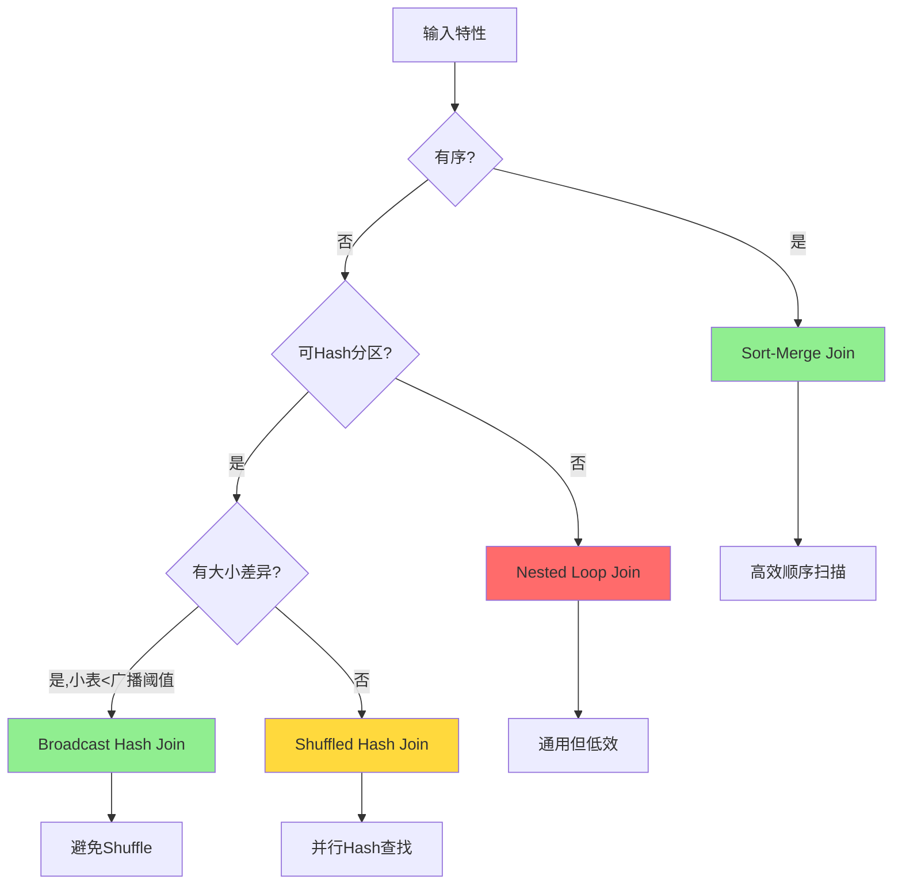

# 流连接操作形式化

> **所属单元**: formal-methods/04-application-layer/02-stream-processing | **前置依赖**: [04-flink-formalization](04-flink-formalization.md) | **形式化等级**: L5-L6

## 1. 概念定义 (Definitions)

### Def-A-03-11: 流连接操作

流连接是将两个或多个流基于关联条件组合的操作：

$$\bowtie: Stream(A) \times Stream(B) \times \theta \rightarrow Stream(A \times B)$$

其中 $\theta$ 是连接谓词。

**流的基本表示**:

流 $S$ 是带时间戳的元素序列：

$$S = \langle (e_1, \tau_1), (e_2, \tau_2), ... \rangle$$

其中 $\tau_i \in \mathbb{T}$ 是事件时间戳。

### Def-A-03-12: 窗口连接语义

窗口连接在有限时间窗口内匹配元素：

$$\bowtie_{W}: Stream(A) \times Stream(B) \rightarrow Stream(A \times B)$$

对于窗口 $w = [t_{start}, t_{end}]$：

$$S_A \bowtie_{w} S_B = \{(a, b) \mid a \in S_A(w) \land b \in S_B(w) \land \theta(a, b)\}$$

### Def-A-03-13: 连接类型形式化

**内连接** (Inner Join)：

$$S_A \bowtie_{inner} S_B = \{(a, b) \mid a \in S_A \land b \in S_B \land key(a) = key(b)\}$$

仅输出匹配的对。

**左外连接** (Left Outer Join)：

$$S_A \bowtie_{left} S_B = \{(a, b) \mid a \in S_A \land (b \in S_B \land key(a) = key(b) \lor b = \bot)\}$$

对于 $S_A$ 中每个元素，即使没有匹配也输出（用 $\bot$ 填充）。

**右外连接** (Right Outer Join)：

$$S_A \bowtie_{right} S_B = \{(a, b) \mid (a \in S_A \land key(a) = key(b) \lor a = \bot) \land b \in S_B\}$$

**全外连接** (Full Outer Join)：

$$S_A \bowtie_{full} S_B = (S_A \bowtie_{left} S_B) \cup (S_A \bowtie_{right} S_B)$$

**Interval Join**：

$$S_A \bowtie_{[l,r]} S_B = \{(a, b) \mid a \in S_A \land b \in S_B \land \tau(b) \in [\tau(a) + l, \tau(a) + r]\}$$

匹配时间间隔内的元素。

### Def-A-03-14: 流-表连接 (Stream-Table Join)

$$\bowtie_{ST}: Stream(A) \times Table(B) \rightarrow Stream(A \times B)$$

对于流元素 $(a, \tau_a)$：

$$a \bowtie_{ST} T = \{(a, b) \mid b \in T \land key(a) = key(b) \land \tau_{valid}(b) \ni \tau_a\}$$

其中 $\tau_{valid}(b)$ 是表行 $b$ 的有效时间区间。

### Def-A-03-15: 时态表连接 (Temporal Table Join)

$$S \bowtie_{temporal} T(t) = \{(s, T(key(s), \tau_s)) \mid s \in S\}$$

其中 $T(k, t)$ 返回表 $T$ 在时间 $t$ 键 $k$ 对应的版本。

## 2. 属性推导 (Properties)

### Lemma-A-03-07: 连接的对称性

内连接是对称的：

$$S_A \bowtie_{inner} S_B = S_B \bowtie_{inner} S_A$$

**证明**: 由集合交集的对称性直接可得。

外连接不满足对称性：

$$S_A \bowtie_{left} S_B \neq S_B \bowtie_{left} S_A$$

### Lemma-A-03-08: 窗口连接的有界状态

对于大小为 $W$ 的时间窗口连接，状态空间是有界的：

$$|State| \leq \lambda_A \cdot W + \lambda_B \cdot W$$

其中 $\lambda$ 是到达率。

**证明**: 窗口外的事件被清理，窗口内事件数有界。

### Prop-A-03-03: Interval Join的传递性

Interval Join在特定条件下具有传递性：

$$(S_A \bowtie_{[l_1,r_1]} S_B) \bowtie_{[l_2,r_2]} S_C = S_A \bowtie_{[l,r]} (S_B \bowtie_{[l',r']} S_C)$$

当区间满足特定重叠条件时成立。

### Lemma-A-03-09: 连接结果的完整性

对于完整的历史表 $T_{hist}$，时态表连接产生确定结果：

$$\forall s \in S: \exists! t \in T_{hist}: key(s) = key(t) \land \tau_s \in \tau_{valid}(t)$$

## 3. 关系建立 (Relations)

### 3.1 连接类型对比

```
┌─────────────────┬──────────────────┬──────────────────┬──────────────────┐
│     连接类型     │    结果集合       │     状态需求      │     延迟特性     │
├─────────────────┼──────────────────┼──────────────────┼──────────────────┤
│ Inner Join      │ 仅匹配            │ 双窗口缓冲        │ 窗口结束触发      │
│ Left Outer      │ 左流全输出        │ 双窗口+标记       │ 窗口结束触发      │
│ Right Outer     │ 右流全输出        │ 双窗口+标记       │ 窗口结束触发      │
│ Full Outer      │ 全部输出          │ 双窗口+标记       │ 窗口结束触发      │
│ Interval Join   │ 时间匹配          │ 双滑动窗口        │ 延迟驱动触发      │
│ Stream-Table    │ 查表匹配          │ 表缓存+流缓冲     │ 即时触发          │
│ Temporal Join   │ 时态版本匹配       │ 表历史版本        │ 即时触发          │
└─────────────────┴──────────────────┴──────────────────┴──────────────────┘
```

### 3.2 SQL与流连接对应

| SQL连接 | 流语义 | 实现复杂度 |
|--------|--------|-----------|
| `INNER JOIN` | 窗口内连接 | 低 |
| `LEFT JOIN` | 左外连接 | 中 |
| `RIGHT JOIN` | 右外连接 | 中 |
| `FULL OUTER JOIN` | 全外连接 | 高 |
| `JOIN ... ON ... AND timestamp diff` | Interval Join | 中 |
| `LATERAL TABLE` | Stream-Table Join | 中 |
| `FOR SYSTEM_TIME AS OF` | Temporal Join | 高 |

### 3.3 连接实现策略对比

```
实现策略选择:
┌─────────────────────────────────────────────────────────────┐
│                    输入特性                                 │
├─────────────────────────────────────────────────────────────┤
│ 有序? ──Yes──▶ Sort-Merge Join (高效顺序扫描)               │
│    │                                                        │
│    No                                                       │
│    │                                                        │
│ 可分区? ──Yes──▶ Shuffled Hash Join (分区并行)              │
│    │                                                        │
│    No                                                       │
│    │                                                        │
│ 小表? ──Yes──▶ Broadcast Hash Join (广播小表)               │
│    │                                                        │
│    No                                                       │
│    ▼                                                        │
│ Nested Loop Join (通用但慢)                                 │
└─────────────────────────────────────────────────────────────┘
```

## 4. 论证过程 (Argumentation)

### 4.1 流连接的挑战

```
流连接的核心挑战:
├── 无限输入
│   ├── 需要窗口/时间边界
│   └── 状态管理复杂
├── 无序到达
│   ├── Watermark协调
│   └── 延迟数据处理
├── 时间语义
│   ├── 事件时间 vs 处理时间
│   └── 版本控制
├── 状态规模
│   ├── 大键空间
│   └── 长窗口
└── 一致性保证
    ├── Exactly-Once
    └── 故障恢复
```

### 4.2 窗口连接与Interval Join对比

| 特性 | 窗口连接 (Window Join) | Interval Join |
|-----|----------------------|---------------|
| 时间基准 | 全局窗口 | 相对时间间隔 |
| 触发时机 | 窗口结束 | 延迟到期 |
| 状态清理 | 窗口结束清理 | 间隔到期清理 |
| 匹配灵活性 | 低（固定窗口） | 高（相对间隔） |
| 典型应用 | 聚合统计 | 事件关联 |
| 实现复杂度 | 低 | 中 |

### 4.3 状态后端对连接的影响

```
状态后端选择:
┌─────────────────────────────────────────────────────────────┐
│ MemoryStateBackend                                          │
│ ├── 适合: 小状态, 短窗口, 快速恢复                          │
│ └── 限制: JVM内存限制, 大状态OOM                           │
├─────────────────────────────────────────────────────────────┤
│ FsStateBackend                                              │
│ ├── 适合: 中等状态, 需要持久化                              │
│ └── 限制: 每次访问磁盘, 性能较低                           │
├─────────────────────────────────────────────────────────────┤
│ RocksDBStateBackend                                         │
│ ├── 适合: 大状态, 长窗口, 增量检查点                        │
│ └── 限制: 序列化开销, 调优复杂                              │
└─────────────────────────────────────────────────────────────┘
```

## 5. 形式证明 / 工程论证

### 5.1 窗口连接的形式化规范

**语法**:

$$Join_{window}(S_1, S_2, w, k) = \{(s_1, s_2) \mid s_1 \in S_1, s_2 \in S_2, window(s_1) = window(s_2) = w, key(s_1) = key(s_2)\}$$

**语义规则**:

```
[Window-Join-Init]
─────────────────────────────────────────
Join(S₁, S₂, w, k) → State(∅, ∅, w, k)

[Window-Join-Left]
s₁ ∈ S₁  key(s₁) = k  w(s₁) = w  State(L, R, w, k)
────────────────────────────────────────────────────
State(L, R, w, k) → State(L ∪ {s₁}, R, w, k)

[Window-Join-Right]
s₂ ∈ S₂  key(s₂) = k  w(s₂) = w  State(L, R, w, k)
────────────────────────────────────────────────────
State(L, R, w, k) → State(L, R ∪ {s₂}, w, k)

[Window-Join-Emit]
(s₁, s₂) ∈ L × R  key(s₁) = key(s₂)  watermark ≥ w.end
────────────────────────────────────────────────────────
State(L, R, w, k) → Output(s₁, s₂)  State(L', R', w', k)
```

### 5.2 Interval Join的形式化

**定义**: 对于间隔 $[l, r]$：

$$S_1 \bowtie_{[l,r]} S_2 = \{(s_1, s_2) \mid s_1 \in S_1, s_2 \in S_2, \tau_1 + l \leq \tau_2 \leq \tau_1 + r, key(s_1) = key(s_2)\}$$

**状态机语义**:

```
状态: (Buffer₁, Buffer₂, W)  -- 双缓冲 + 当前Watermark

转移:
 1. 输入s₁:
    Buffer₁' = Buffer₁ ∪ {s₁}
    Matches = {s₂ ∈ Buffer₂ | τ₁+l ≤ τ₂ ≤ τ₁+r ∧ key(s₁)=key(s₂)}
    输出所有(s₁, s₂) ∈ Matches

 2. 输入s₂:
    Buffer₂' = Buffer₂ ∪ {s₂}
    Matches = {s₁ ∈ Buffer₁ | τ₁+l ≤ τ₂ ≤ τ₁+r ∧ key(s₁)=key(s₂)}
    输出所有(s₁, s₂) ∈ Matches

 3. Watermark更新到W':
    清理Buffer₁中τ₁ < W'-r的元素
    清理Buffer₂中τ₂ < W'-l的元素
```

### 5.3 形式化语义表

#### 连接类型语义表

| 连接类型 | 数学定义 | 输出条件 | 空值处理 |
|---------|---------|---------|---------|
| Inner | $\{(a,b) \mid key(a)=key(b)\}$ | 仅匹配 | 无 |
| Left Outer | $\{(a,b) \mid a \in S_A \land (key(a)=key(b) \lor b=\bot)\}$ | 全左 | 右补$\bot$ |
| Right Outer | $\{(a,b) \mid (key(a)=key(b) \lor a=\bot) \land b \in S_B\}$ | 全右 | 左补$\bot$ |
| Full Outer | Left $\cup$ Right | 全输出 | 双补$\bot$ |

#### 触发条件语义表

| 连接类型 | 触发条件 | 清理条件 |
|---------|---------|---------|
| Window | $W \geq window.end$ | Watermark > window.end |
| Interval | $\tau_2 \in [\tau_1+l, \tau_1+r]$ | $\tau < W - max(|l|, |r|)$ |
| Stream-Table | 即时 | 表更新触发重查 |
| Temporal | 即时 | 历史版本保留策略 |

### 5.4 一致性证明

**定理**: 带检查点的窗口连接满足Exactly-Once语义。

**证明**:

1. **状态快照**: 连接操作符的状态包括两个窗口缓冲区的内容
2. **Barrier对齐**: 确保两个输入流的Barrier同步到达
3. **原子恢复**: 故障时从检查点恢复，重放未确认的记录
4. **幂等输出**: 窗口输出基于Watermark触发，Watermark单调递增确保输出一次

**形式化不变式**:

$$\forall w: Output(w) \text{ committed} \iff \forall s \in S_A(w) \cup S_B(w): s \text{ processed}$$

## 6. 实例验证 (Examples)

### 6.1 Flink窗口连接实现

```java
// 双流窗口连接
DataStream<Order> orders = ...
DataStream<Shipment> shipments = ...

orders.join(shipments)
    .where(order -> order.getUserId())
    .equalTo(shipment -> shipment.getUserId())
    .window(TumblingEventTimeWindows.of(Time.minutes(5)))
    .apply((order, shipment) -> new EnrichedOrder(order, shipment))
    .addSink(...);
```

形式化表示：

```
Join_{Tumbling(5min)}(Orders, Shipments, key = userId)
```

### 6.2 Interval Join实现

```java
// Interval Join: 匹配点击后30分钟内的购买
DataStream<Click> clicks = ...
DataStream<Purchase> purchases = ...

clicks.keyBy(Click::getUserId)
    .intervalJoin(purchases.keyBy(Purchase::getUserId))
    .between(Time.minutes(0), Time.minutes(30))
    .process(new ProcessJoinFunction<Click, Purchase, Conversion>() {
        @Override
        public void processElement(Click click, Purchase purchase, Context ctx, Collector<Conversion> out) {
            out.collect(new Conversion(click, purchase));
        }
    });
```

形式化表示：

```
Join_{[0min, 30min]}(Clicks, Purchases, key = userId)
```

### 6.3 时态表连接

```sql
-- 时态表连接: 获取订单处理时的汇率
SELECT
    o.order_id,
    o.amount,
    r.rate,
    o.amount * r.rate as amount_usd
FROM Orders AS o
JOIN Rates FOR SYSTEM_TIME AS OF o.order_time AS r
ON o.currency = r.currency;
```

形式化表示：

```
Join_{temporal}(Orders, Rates, key = currency, time = order_time)
```

### 6.4 流-表连接

```java
// 使用广播状态实现维表连接
MapStateDescriptor<String, UserInfo> descriptor =
    new MapStateDescriptor<>("users", String.class, UserInfo.class);

BroadcastStream<UserInfo> userBroadcastStream = userStream.broadcast(descriptor);

eventStream
    .keyBy(Event::getUserId)
    .connect(userBroadcastStream)
    .process(new KeyedBroadcastProcessFunction<String, Event, UserInfo, EnrichedEvent>() {
        @Override
        public void processElement(Event event, ReadOnlyContext ctx, Collector<EnrichedEvent> out) {
            UserInfo user = ctx.getBroadcastState(descriptor).get(event.getUserId());
            out.collect(new EnrichedEvent(event, user));
        }

        @Override
        public void processBroadcastElement(UserInfo user, Context ctx, Collector<EnrichedEvent> out) {
            ctx.getBroadcastState(descriptor).put(user.getId(), user);
        }
    });
```

## 7. 可视化 (Visualizations)

### 7.1 流连接类型全景



### 7.2 窗口连接执行流程



### 7.3 Interval Join时间匹配

```mermaid
gantt
    title Interval Join时间匹配示例 (±5分钟)
    dateFormat HH:mm
    axisFormat %H:%M

    section 流A (点击)
    Click-1    :10:00, 10:01
    Click-2    :10:05, 10:06
    Click-3    :10:12, 10:13

    section 流B (购买)
    Purchase-1 :10:03, 10:04
    Purchase-2 :10:07, 10:08
    Purchase-3 :10:15, 10:16

    section 匹配结果
    Match-1    :crit, 10:03, 10:04
    Match-2    :crit, 10:07, 10:08
```



### 7.4 连接状态管理

```mermaid
graph TB
    subgraph "左流缓冲区"
        L1[a1: k=A, t=10:00]
        L2[a2: k=B, t=10:01]
        L3[a3: k=A, t=10:02]
    end

    subgraph "Join Operator"
        J[Hash Map<br/>A: [a1,a3]<br/>B: [a2]]
    end

    subgraph "右流缓冲区"
        R1[b1: k=A, t=10:00]
        R2[b2: k=B, t=10:03]
        R3[b3: k=C, t=10:01]
    end

    L1 --> J
    L2 --> J
    L3 --> J
    R1 --> J
    R2 --> J
    R3 --> J

    J --> M1[(a1,b1)]
    J --> M2[(a2,b2)]
    J --> N[No match for b3]
```

### 7.5 实现策略选择决策树



## 8. 引用参考 (References)
