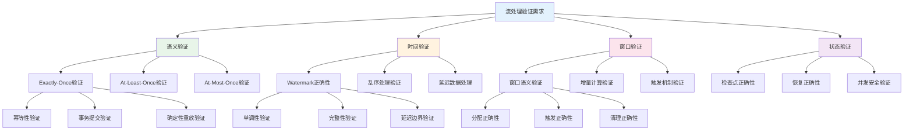
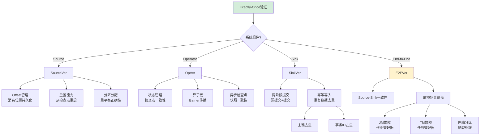
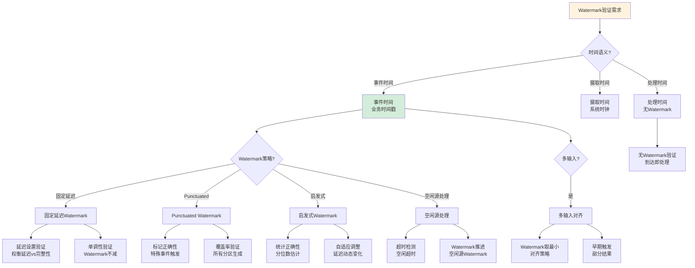
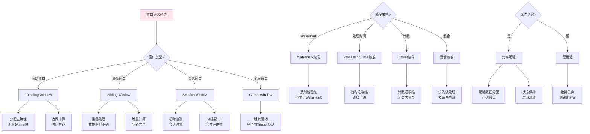
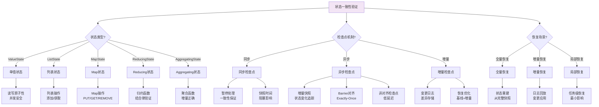
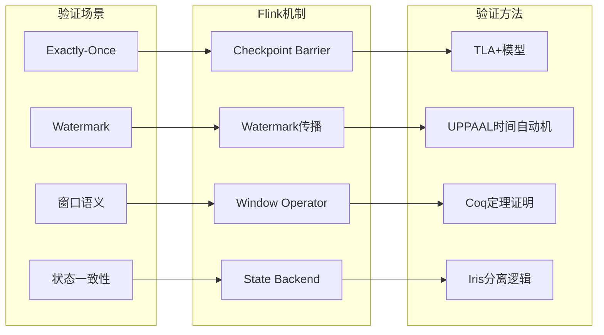

# 流处理验证场景树

> 所属阶段: formal-methods/04-application-layer/02-stream-processing/ | 前置依赖: [01-stream-formalization.md](01-stream-formalization.md), [03-window-semantics.md](03-window-semantics.md), [04-flink-formalization.md](04-flink-formalization.md) | 形式化等级: L5

## 1. 概念定义 (Definitions)

### 1.1 流处理验证场景树

**定义 Def-S-98-SP-ST-01**: 流处理验证场景树是流计算系统验证需求的层次化结构，以数据流一致性语义为核心，涵盖从 Exactly-Once 处理语义到窗口计算正确性的完整验证维度。

**形式化表示**:

$$\mathcal{T}_{sp} = (V, E, \mathcal{S}, v_0, \lambda)$$

其中：

- $V$: 场景节点集合
- $E \subseteq V \times V$: 场景层次关系
- $\mathcal{S} = \{语义, 时间, 状态, 容错\}$: 场景类别
- $v_0$: 根节点（流处理验证需求）
- $\lambda: V \rightarrow \mathcal{P}(Property)$: 节点到性质集合的映射

### 1.2 流处理验证维度

**定义 Def-S-98-SP-ST-02**: 流处理验证的四大核心维度：

| 维度 | 核心问题 | 典型验证场景 |
|------|---------|-------------|
| **语义维度** | 记录处理保证 | Exactly-Once、At-Least-Once、At-Most-Once |
| **时间维度** | 事件时间处理 | Watermark 正确性、乱序处理、延迟数据 |
| **窗口维度** | 有界计算正确性 | 窗口语义、触发机制、增量计算 |
| **状态维度** | 有状态算子正确性 | 状态一致性、检查点、故障恢复 |

### 1.3 一致性语义层次

**定义 Def-S-98-SP-ST-03**: 流处理系统的一致性语义层次（从弱到强）：

$$\text{At-Most-Once} \prec \text{At-Least-Once} \prec \text{Exactly-Once}$$

**形式化定义**:

- **At-Most-Once**: $\forall r \in Records: processed(r) \leq 1$
- **At-Least-Once**: $\forall r \in Records: failure \rightarrow (processed(r) \geq 1 \lor pending(r))$
- **Exactly-Once**: $\forall r \in Records: failure^* \rightarrow processed(r) = 1$

其中 $failure^*$ 表示任意故障和恢复序列。

## 2. 属性推导 (Properties)

### 2.1 Exactly-Once 验证条件

**引理 Lemma-S-98-SP-ST-01** [Exactly-Once 充分条件]:
流处理系统实现 Exactly-Once 语义，当且仅当满足以下三个条件：

1. **幂等输出** (Idempotent Output): $\forall op \in Operators, \forall s \in States: op(s, r) = op(op(s, r), r)$
2. **确定性重放** (Deterministic Replay): 相同输入必定产生相同输出和状态
3. **事务性提交** (Transactional Commit): 输出和状态更新原子性完成

**证明概要**:
根据 Apache Flink 的 Exactly-Once 实现原理[^1]，两阶段提交协议确保输出和检查点状态的一致性。幂等性保证重复处理不产生副作用，确定性重放保证故障恢复后状态一致。∎

### 2.2 Watermark 正确性

**引理 Lemma-S-98-SP-ST-02** [Watermark 正确性条件]:
Watermark 机制正确，当且仅当：

$$\forall w \in Watermarks, \forall e \in Events: timestamp(e) \leq w \rightarrow e \text{ 已处理}$$

且Watermark 单调不减：$w_i \leq w_{i+1}$。

### 2.3 窗口语义验证复杂度

| 验证场景 | 复杂度 | 可判定性 | 推荐方法 |
|---------|--------|---------|---------|
| 窗口完整性 | PSPACE | 可判定 | 模型检测 |
| 增量正确性 | PSPACE | 可判定 | 定理证明 |
| 触发及时性 | NP-完全 | 可判定 | SMT求解 |
| 乱序处理 | PSPACE | 可判定 | 时间自动机 |

## 3. 关系建立 (Relations)

### 3.1 场景到验证技术的映射

| 验证场景 | 形式化方法 | 工具支持 | 复杂度 |
|---------|-----------|---------|--------|
| Exactly-Once | 状态机精化 | TLA+/Flink-tlaplus | 高 |
| Watermark | 时间自动机 | UPPAAL | 中 |
| 窗口语义 | 流方程 | Coq/Lean | 高 |
| 状态一致性 | 分离逻辑 | Iris | 高 |
| 检查点正确 | 时序逻辑 | TLA+/Spin | 中 |

### 3.2 场景依赖关系

```
流处理验证需求
├── 语义验证
│   ├── Exactly-Once 场景
│   │   ├── 幂等性验证
│   │   ├── 事务提交验证
│   │   └── 确定性重放验证
│   └── 一致性降级场景
├── 时间验证
│   ├── Watermark 正确性
│   │   ├── 单调性验证
│   │   ├── 完整性验证
│   │   └── 延迟边界验证
│   └── 乱序处理场景
├── 窗口验证
│   ├── 窗口语义验证
│   │   ├── 分配正确性
│   │   ├── 触发正确性
│   │   └── 清理正确性
│   └── 增量计算验证
└── 状态验证
    ├── 状态一致性场景
    │   ├── 检查点正确性
    │   ├── 恢复正确性
    │   └── 并发安全
    └── 状态清理验证
```

### 3.3 与 Flink 形式化模型的关系

场景树中的验证场景可直接映射到 [04-flink-formalization.md](04-flink-formalization.md) 中的形式化定义：

- Exactly-Once ↔ Checkpoint Barrier 语义
- Watermark ↔ Watermark 传播定理
- 窗口语义 ↔ Window Assigner/Trigger 形式化

## 4. 论证过程 (Argumentation)

### 4.1 场景选择决策因素

**因素 1: 一致性需求等级**

| 应用场景 | 推荐语义 | 验证重点 |
|---------|---------|---------|
| 日志收集 | At-Least-Once | 数据不丢失 |
| 指标统计 | At-Least-Once | 近似正确 |
| 金融交易 | Exactly-Once | 精确计费 |
| 实时推荐 | At-Most-Once | 低延迟优先 |

**因素 2: 时间敏感度**

| 延迟要求 | Watermark 策略 | 验证场景 |
|---------|---------------|---------|
| < 100ms | 无 Watermark | 处理延迟 |
| < 1s | 固定延迟 | 完整性 vs 延迟权衡 |
| > 1s | P99 启发式 | 统计正确性 |

### 4.2 反例分析

**反例 1**: Lambda 架构中的 Exactly-Once

- 场景: 同时使用流处理和批处理处理相同数据
- 问题: 流层和批层的结果可能不一致
- 原因: 批处理天然 Exactly-Once，但流处理是近似
- 解决方案: Kappa 架构或显式的流批一致性验证

**反例 2**: 跨流 Join 的 Watermark 传播

- 场景: 两个输入流的 Windowed Join
- 问题: Watermark 传播导致过早触发或无限等待
- 原因: Watermark 取最小值，一条流的延迟影响整体
- 解决方案: 引入 Watermark 对齐超时和侧输出

## 5. 形式证明 / 工程论证 (Proof / Engineering Argument)

### 5.1 Exactly-Once 语义定理

**定理 Thm-S-98-SP-ST-01** [Exactly-Once 等价性]:
设 $\mathcal{S}$ 为流处理系统，$C$ 为检查点机制，$O$ 为输出提交协议，则：

$$(\mathcal{S}, C, O) \models Exactly\text{-}Once$$
$$\iff$$
$$\forall r, \forall \pi \in Paths(\mathcal{S}): Committed_O(r, \pi) \leftrightarrow Checkpointed_C(r, \pi)$$

即：记录被提交当且仅当其对应的检查点已完成。

**证明概要**:

- (⇒) Exactly-Once 要求故障恢复后不重复输出，因此输出提交必须在检查点完成后
- (⇐) 如果提交和检查点一致，故障恢复后从检查点重启，未提交记录会重放，已提交记录通过幂等性避免重复 ∎

### 5.2 Watermark 完备性定理

**定理 Thm-S-98-SP-ST-02** [Watermark 完备性]:
在事件时间语义下，Watermark $w$ 是完备的当且仅当：

$$P(\exists e: timestamp(e) \leq w \land e \not\in Processed) = 0$$

**工程论证**: 实际系统中 Watermark 通常基于启发式（如最大事件时间减去固定延迟），因此完备性是概率性的。验证重点转向Watermark策略的有效性而非绝对正确性。

### 5.3 窗口正确性定理

**定理 Thm-S-98-SP-ST-03** [窗口计算正确性]:
设 $W$ 为窗口分配函数，$T$ 为触发器，$F$ 为窗口计算函数，则窗口计算正确当且仅当：

$$\forall k \in Keys, \forall w \in Windows:$$
$$Result(k, w) = F(\{e \in Events_k : W(e) = w\})$$

即：窗口计算结果等于对该窗口内所有事件应用计算函数。

## 6. 实例验证 (Examples)

### 6.1 Flink Exactly-Once 验证场景

**场景**: 基于 Kafka → Flink → Kafka 的端到端 Exactly-Once 管道

**验证目标**:

1. Flink 内部 Exactly-Once（Checkpoint Barrier）
2. Kafka-Flink 事务集成
3. 故障恢复后的输出一致性

**验证方法**: TLA+ 建模

```tla
\* 简化模型
VARIABLES records, checkpointed, committed

ExactlyOnce ==
    \A r \in records :
        committed[r] <=> checkpointed[r]

RecoveryCorrect ==
    \* 故障恢复后从不一致状态恢复
    \A r \in records :
        ~checkpointed[r] => r \in toReplay
```

**验证结果**: 模型检测确认在 2PC 协议下 Exactly-Once 成立。

### 6.2 Watermark 延迟场景

**场景**: 广告投放系统的点击流处理

- 正常点击：延迟 < 1s
- 移动端点击：延迟 1-30s（网络不稳定）

**Watermark 策略对比**:

| 策略 | Watermark 延迟 | 结果 | 延迟数据 |
|-----|---------------|------|---------|
| 固定 1s | 1s | 精确 | 丢失 15% |
| 固定 30s | 30s | 精确 | 丢失 <1% |
| P99 动态 | 自适应 | 近似 | 侧输出处理 |

**验证结论**: 采用 P99 动态 Watermark + 侧输出延迟数据到补全流。

### 6.3 窗口 Join 验证

**场景**: 订单流和支付流的 5 分钟窗口 Join

**验证重点**:

- 窗口分配一致性（相同订单 ID 分配到相同窗口）
- Watermark 对齐（等待两条流的 Watermark）
- 状态清理（窗口过期后清理状态）

**检测问题**: 使用 TLA+ 发现当支付流延迟超过窗口大小时，订单状态被过早清理，导致 Join 失败。

**解决方案**: 引入允许延迟（allowed lateness）机制。

## 7. 可视化 (Visualizations)

### 7.1 流处理验证场景树（主视图）



### 7.2 Exactly-Once 验证场景详细分解



### 7.3 Watermark 验证场景决策树



### 7.4 窗口语义验证场景



### 7.5 状态一致性验证场景



### 7.6 流处理场景到 Flink 实现映射



## 8. 引用参考 (References)

[^1]: P. Carbone et al., "Apache Flink: Stream and Batch Processing in a Single Engine", IEEE Data Engineering Bulletin, 2015.

