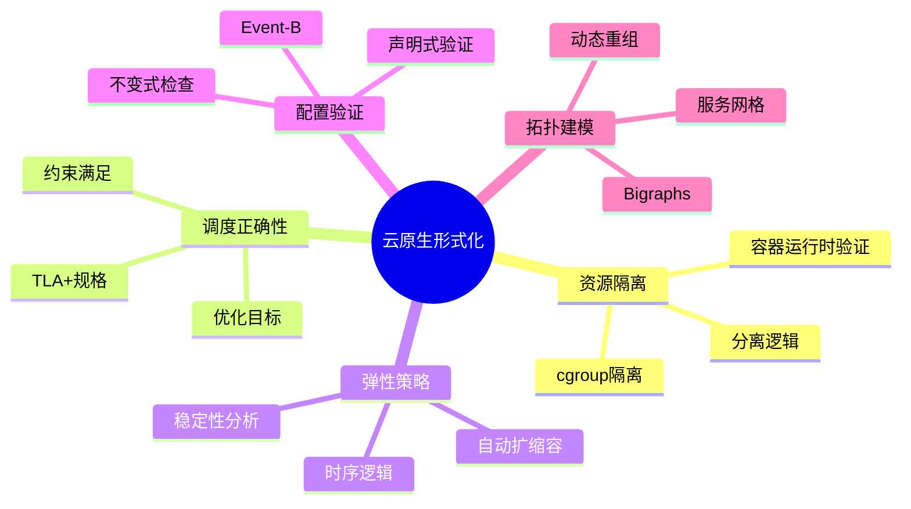
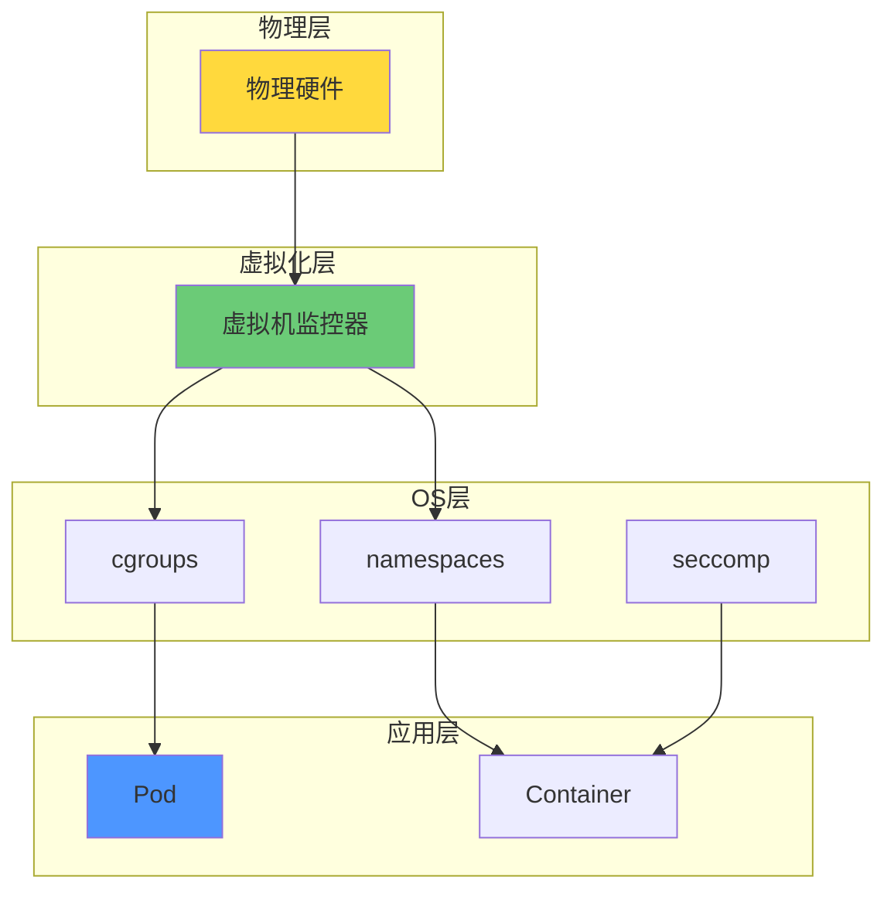
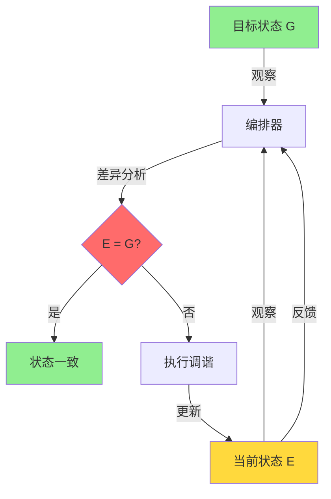
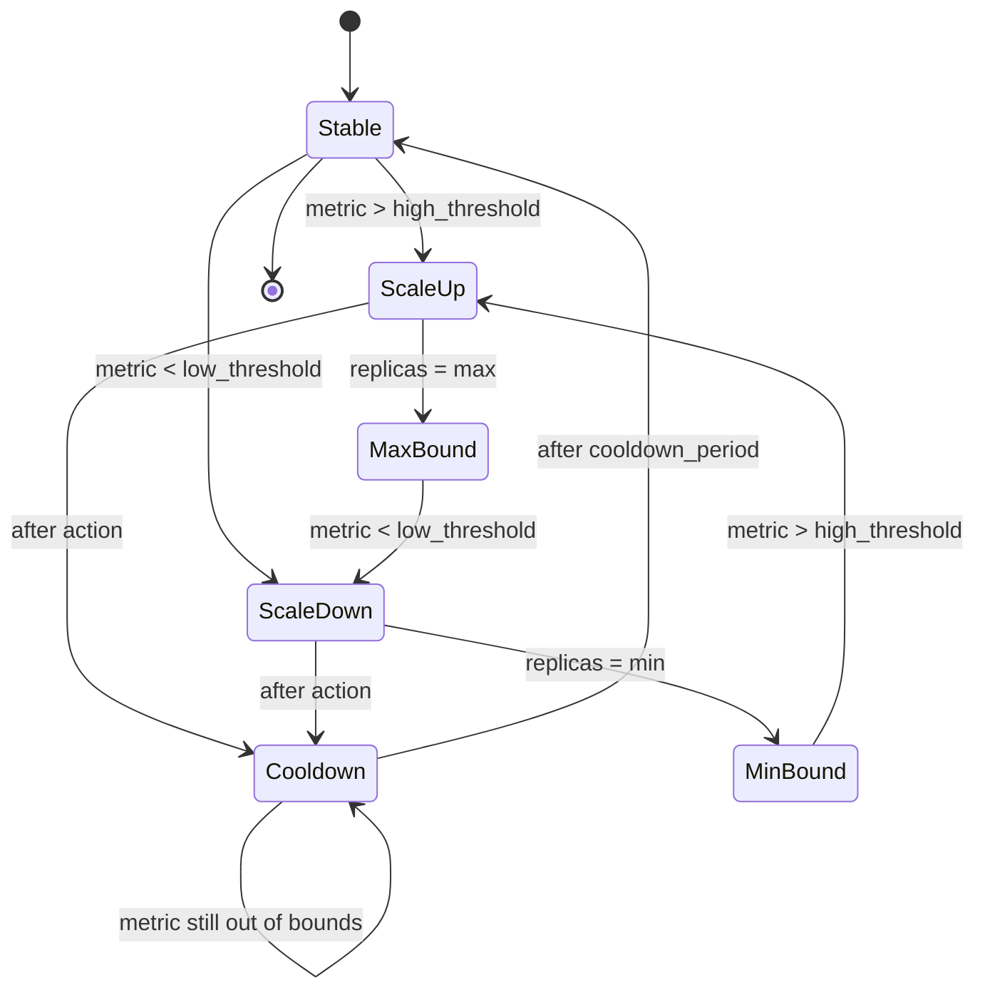

# 云原生形式化目标

> **所属单元**: formal-methods/04-application-layer/03-cloud-native | **前置依赖**: [formal-methods/03-distributed-systems/02-consensus-protocols](../../03-distributed-systems/02-consensus-protocols.md) | **形式化等级**: L4-L5

## 1. 概念定义 (Definitions)

### Def-A-06-01: 云原生系统 (Cloud-Native System)

云原生系统是一个七元组 $\mathcal{C} = (\mathcal{S}, \mathcal{R}, \mathcal{M}, \mathcal{P}, \mathcal{G}, \mathcal{E}, \mathcal{O})$，其中：

- $\mathcal{S}$: 服务集合，每个服务 $s \in \mathcal{S}$ 具有资源需求、依赖关系和生命周期
- $\mathcal{R}$: 资源类型集合，包括计算 (CPU)、内存 (MEM)、存储 (STO)、网络 (NET)
- $\mathcal{M}: \mathcal{S} \times \mathcal{R} \rightarrow \mathbb{R}^+$: 资源需求映射
- $\mathcal{P}$: 放置约束集合，包括亲和性、反亲和性、拓扑分布
- $\mathcal{G}$: 目标状态（声明式配置），描述期望的系统配置
- $\mathcal{E}$: 当前状态（实际运行状态）
- $\mathcal{O}$: 编排器，执行状态收敛 $E \rightarrow G$

### Def-A-06-02: 资源隔离 (Resource Isolation)

资源隔离是一个二元组 $\mathcal{I} = (Partition, Guarantee)$：

**分区 (Partition)**: 资源集合的划分 $Partition: \mathcal{R} \rightarrow 2^{\mathcal{R}}$，满足：
$$\forall r \in \mathcal{R}: r \in Partition(r) \land \bigcup_{s \in \mathcal{S}} Alloc(s, r) \leq Capacity(r)$$

**保证 (Guarantee)**: 服务质量承诺，包括：

- **硬隔离**: $\forall t: Usage(s, r, t) \leq Limit(s, r)$
- **软隔离**: $P[Usage(s, r) > Limit(s, r)] < \epsilon$

### Def-A-06-03: 调度正确性 (Scheduling Correctness)

调度决策 $\sigma: \mathcal{S} \rightarrow \mathcal{N}$（服务到节点的映射）是**正确的**，当且仅当满足：

**资源可行性**:
$$\forall n \in \mathcal{N}, r \in \mathcal{R}: \sum_{s: \sigma(s)=n} \mathcal{M}(s, r) \leq Capacity(n, r)$$

**约束满足**:
$$\forall p \in \mathcal{P}: \sigma \models p$$

**优化目标**:
$$\sigma^* = \arg\min_{\sigma} Cost(\sigma) \text{ 或 } \max Utilization(\sigma)$$

### Def-A-06-04: 弹性策略 (Elasticity Policy)

弹性策略是一个四元组 $\mathcal{E} = (Trigger, Action, Bounds, Cooldown)$：

- **Trigger**: 触发条件，$Trigger: Metric \times Threshold \rightarrow \{ScaleUp, ScaleDown, NoOp\}$
- **Action**: 扩缩容动作，$Action: \mathcal{S} \times \Delta \rightarrow \mathcal{S}'$
- **Bounds**: 边界约束，$[MinReplicas, MaxReplicas]$
- **Cooldown**: 冷却期，防止振荡

形式化：

$$\mathcal{E}(m, t) = \begin{cases} ScaleUp(\Delta) & \text{if } m > t_{high} \land \Delta t > cooldown \\ ScaleDown(\Delta) & \text{if } m < t_{low} \land \Delta t > cooldown \\ NoOp & \text{otherwise} \end{cases}$$

### Def-A-06-05: 分离逻辑 (Separation Logic)

分离逻辑是描述程序内存操作的扩展Hoare逻辑，断言形式：

$$P * Q \quad \text{(分离合取)}$$

表示 $P$ 和 $Q$ 描述的内存区域不相交。

关键规则：

- **框架规则**: $\{P\}C\{Q\} \Rightarrow \{P * R\}C\{Q * R\}$（$C$ 不修改 $R$ 描述的区域）
- **分配规则**: $\{emp\}x:=alloc()\{x \mapsto -\}$
- **释放规则**: $\{x \mapsto -\}free(x)\{emp\}$

## 2. 属性推导 (Properties)

### Lemma-A-06-01: 资源隔离的安全性

若调度满足硬隔离约束，则：

$$\forall s_1, s_2, r: Isolated(s_1, s_2, r) \Rightarrow Usage(s_1, r) + Usage(s_2, r) \leq Capacity(r)$$

**证明**: 由硬隔离定义，每个服务的资源使用不超过其限制，且分区确保总分配不超过容量。

### Lemma-A-06-02: 声明式配置的幂等性

编排器操作满足幂等性：

$$Apply(G, Apply(G, E)) = Apply(G, E)$$

**证明**: 声明式配置仅依赖于目标状态 $G$，多次应用相同 $G$ 产生相同结果。

### Prop-A-06-01: 弹性策略的稳定性条件

弹性策略稳定（无振荡）的充分条件：

$$t_{high} - t_{low} > Hysteresis \land cooldown > ReactionTime$$

**证明**: 滞后区间和冷却期确保触发条件不会在短时间内交替满足。

### Lemma-A-06-03: 调度问题的复杂度下界

带有亲和性/反亲和性约束的调度问题是NP-hard的。

**证明**: 从图着色问题归约。

- 节点 $\leftrightarrow$ 颜色（资源类型）
- 服务 $\leftrightarrow$ 顶点
- 反亲和性 $\leftrightarrow$ 边（相邻顶点不同色）

## 3. 关系建立 (Relations)

### 3.1 云原生形式化方法技术栈

| 目标 | 形式化方法 | 工具/语言 | 应用场景 |
|-----|-----------|----------|---------|
| 资源隔离 | 分离逻辑 | VeriFast, Iris | 容器运行时验证 |
| 调度正确性 | TLA+ | TLC Model Checker | 调度器设计验证 |
| 配置验证 | Event-B | Rodin | 基础设施配置 |
| 拓扑推理 | Bigraphs | BigraphER | 服务网格建模 |
| 弹性分析 | 时序逻辑 | UPPAAL | 自动扩缩容策略 |

### 3.2 分离逻辑与资源隔离的对应

```
分离逻辑概念          云原生资源概念
────────────────────────────────────────
内存区域 (heap)  →    资源池 (resource pool)
分离合取 (*)     →    资源分区 (partition)
 points-to (↦)   →    服务-节点绑定 (s ↦ n)
空断言 (emp)     →    空闲资源 (idle capacity)
框架规则         →    资源预留 (resource reservation)
```

### 3.3 TLA+ 与声明式配置

TLA+ 规格与Kubernetes声明式配置的对应：

| TLA+ 概念 | Kubernetes概念 |
|----------|---------------|
| State (状态) | etcd 存储 |
| Action (动作) | Controller 调谐循环 |
| Invariant (不变式) | Admission Webhook 验证 |
| Temporal Property | 健康检查、就绪探针 |
| Next (下一步) | 调谐周期 |

## 4. 论证过程 (Argumentation)

### 4.1 资源隔离的层次

```
物理机
    ├── 虚拟机 (VM) ── 硬件虚拟化
    │       └── 容器 (Container) ── OS级隔离
    │               └── Pod ── 调度单元
    │                       └── 应用进程
    └── 安全容器 (Kata, gVisor) ── 增强隔离
```

隔离强度与开销的权衡：

- **VM**: 强隔离，高开销
- **容器**: 中隔离，低开销
- **安全容器**: 强隔离，中高开销

### 4.2 调度算法的分类

| 算法类型 | 代表算法 | 时间复杂度 | 适用场景 |
|---------|---------|-----------|---------|
| 贪婪 | First-Fit, Best-Fit | $O(n)$ | 小规模，快速决策 |
| 启发式 | 模拟退火, 遗传算法 | $O(k \cdot n^2)$ | 复杂约束优化 |
| 精确 | 整数线性规划 (ILP) | 指数级 | 小规模，最优解 |
| 在线 | 竞争性分析算法 | $O(\log n)$ | 动态到达，不可预测 |

### 4.3 弹性策略的优化目标

多目标优化问题：

$$\min_{\vec{r}} (Cost(\vec{r}), Latency(\vec{r}), -Utilization(\vec{r}))$$

约束：
$$SLO(s) \geq Threshold, \quad \forall s \in \mathcal{S}$$

Pareto最优解集，根据业务权重选择。

## 5. 形式证明 / 工程论证

### 5.1 分离逻辑验证容器隔离

**目标**: 验证容器运行时确保内存隔离

**规格**:

$$\{Container(c) * Memory(m)\} Run(c)\{Container(c) * Memory'(m)\}$$

其中 $Memory'$ 表示容器 $c$ 仅访问其分配的内存区域 $m$。

**验证步骤**:

1. 指定容器边界断言 $Container(c)$
2. 使用分离逻辑的框架规则证明不影响其他容器
3. 验证cgroup/namespace实现满足规格

### 5.2 TLA+ 调度器规格示例

```tla
------------------------------ MODULE Scheduler ------------------------------
EXTENDS Naturals, Sequences, FiniteSets

CONSTANTS Services, Nodes, Resources

VARIABLES placement, available

TypeInvariant ==
    /\ placement \in [Services -> Nodes \cup {NULL}]
    /\ available \in [Nodes -> [Resources -> Nat]]

Init ==
    /\ placement = [s \in Services |-> NULL]
    /\ available = [n \in Nodes |-> [r \in Resources |-> Capacity(n, r)]]

Schedule(s, n) ==
    /\ placement[s] = NULL
    /\ \A r \in Resources: Demand(s, r) <= available[n][r]
    /\ placement' = [placement EXCEPT ![s] = n]
    /\ available' = [available EXCEPT ![n] =
                        [r \in Resources |-> @ [r] - Demand(s, r)]]

Unschedule(s) ==
    /\ placement[s] # NULL
    /\ LET n == placement[s]
       IN available' = [available EXCEPT ![n] =
                           [r \in Resources |-> @ [r] + Demand(s, r)]]
    /\ placement' = [placement EXCEPT ![s] = NULL]

Next ==
    \/ \E s \in Services, n \in Nodes: Schedule(s, n)
    \/ \E s \in Services: Unschedule(s)

ResourceSafety ==
    \A n \in Nodes, r \in Resources: available[n][r] >= 0

SchedulingCompleteness ==
    \A s \in Services: placement[s] # NULL ~> <> (placement[s] = NULL)
===============================================================================
```

### 5.3 Event-B 配置验证

**机器: DeploymentConfiguration**

```eventb
CONTEXT DeploymentCtx
SETS SERVICES; NODES; RESOURCES
CONSTANTS cpu mem disk
PROPERTIES
    RESOURCES = {cpu, mem, disk}
END

MACHINE DeploymentConfig
SEES DeploymentCtx
VARIABLES placement demands capacity
INVARIANTS
    inv1: placement ∈ SERVICES ⇸ NODES
    inv2: demands ∈ SERVICES × RESOURCES → ℕ
    inv3: capacity ∈ NODES × RESOURCES → ℕ
    inv4: ∀s,n,r · s ∈ dom(placement) ∧ placement(s) = n
              ⇒ demands(s,r) ≤ capacity(n,r)
EVENTS
    Schedule =
        ANY s, n WHERE
            s ∈ SERVICES \ dom(placement)
            n ∈ NODES
            ∀r · demands(s,r) ≤ capacity(n,r)
        THEN
            placement(s) := n
            capacity := λnn,rr · (nn = n | capacity(nn,rr) - demands(s,rr))
                                ▷ capacity(nn,rr)
        END
    ...
END
```

## 6. 实例验证 (Examples)

### 6.1 分离逻辑验证内存安全

```c
/*@ requires emp
  @ ensures \result != 0 ==> \result \mapsto _;
  @*/
int* alloc_int() {
    return malloc(sizeof(int));
}

/*@ requires p \mapsto _;
  @ ensures emp;
  @*/
void free_int(int* p) {
    free(p);
}

// 组合验证
void test() {
    int* x = alloc_int();  // {emp} -> {x \mapsto _}
    *x = 42;               // {x \mapsto _} -> {x \mapsto 42}
    free_int(x);           // {x \mapsto 42} -> {emp}
}
```

### 6.2 Bigraphs服务网格建模

```
// 服务拓扑表示为bigraph
Root(Cloud)
  ├── Region(US-East)
  │     ├── Node(Node-1)
  │     │     ├── Pod(Web-1)
  │     │     └── Pod(API-1)
  │     └── Node(Node-2)
  │           └── Pod(DB-1)
  └── Region(US-West)
        └── ...

// 链接表示服务依赖
Link(Web-1 → API-1)
Link(API-1 → DB-1)
```

### 6.3 弹性策略配置

```yaml
apiVersion: autoscaling/v2
kind: HorizontalPodAutoscaler
metadata:
  name: web-service-hpa
spec:
  scaleTargetRef:
    apiVersion: apps/v1
    kind: Deployment
    name: web-service
  minReplicas: 2
  maxReplicas: 50
  metrics:
  - type: Resource
    resource:
      name: cpu
      target:
        type: Utilization
        averageUtilization: 70
  behavior:
    scaleUp:
      stabilizationWindowSeconds: 60
      policies:
      - type: Percent
        value: 100
        periodSeconds: 15
    scaleDown:
      stabilizationWindowSeconds: 300
      policies:
      - type: Percent
        value: 10
        periodSeconds: 60
```

## 7. 可视化 (Visualizations)

### 7.1 云原生形式化技术栈



### 7.2 资源隔离层次



### 7.3 声明式配置收敛



### 7.4 弹性策略状态机



## 8. 引用参考 (References)
