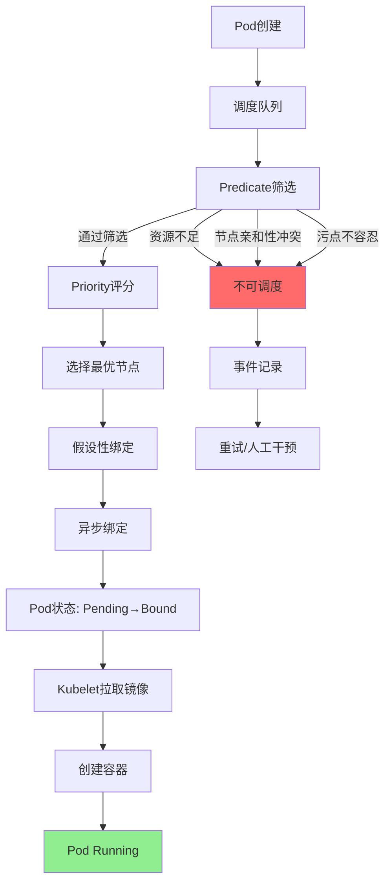
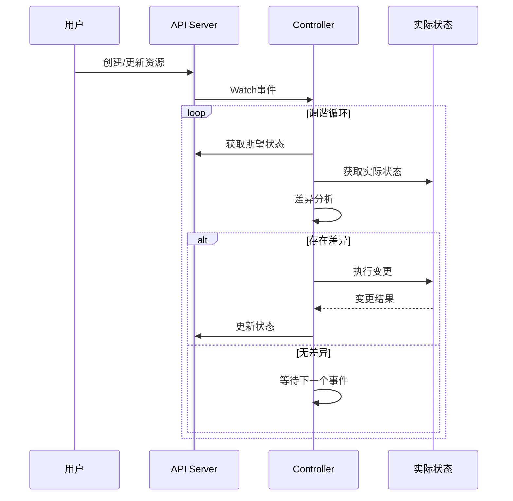
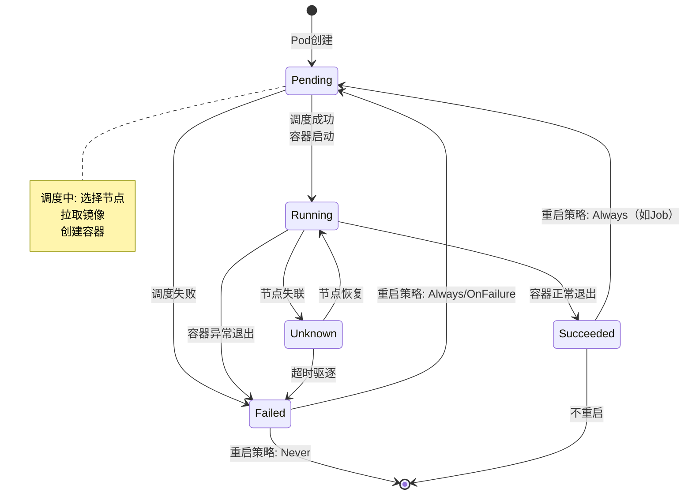
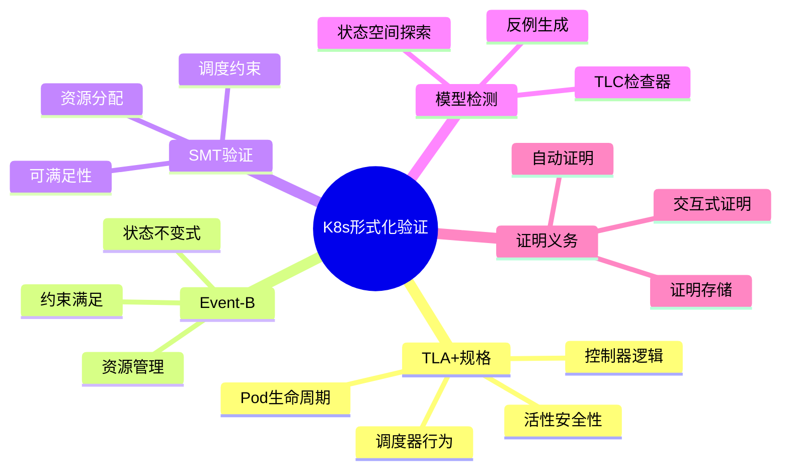

# Kubernetes形式化验证

> **所属单元**: formal-methods/04-application-layer/03-cloud-native | **前置依赖**: [01-cloud-formalization](./01-cloud-formalization.md) | **形式化等级**: L5

## 1. 概念定义 (Definitions)

### Def-A-07-01: Kubernetes调度约束 (Scheduling Constraints)

Kubernetes调度约束是一个四元组 $\mathcal{K} = (NodeAffinity, PodAffinity, PodAntiAffinity, TaintsTolerations)$：

**节点亲和性 (Node Affinity)**:
$$NodeAffinity(p, n) = \bigwedge_{i} (Label(n, k_i) = v_i) \land \bigvee_{j} (Label(n, k'_j) \in V_j)$$

**Pod亲和性 (Pod Affinity)**:
$$PodAffinity(p_1, p_2, n_1, n_2) = (n_1 = n_2 \lor Topology(n_1, n_2)) \land LabelMatch(p_1, p_2)$$

**Pod反亲和性 (Pod Anti-Affinity)**:
$$PodAntiAffinity(p_1, p_2, n_1, n_2) = \neg PodAffinity(p_1, p_2, n_1, n_2)$$

**污点与容忍 (Taints & Tolerations)**:
$$Schedulable(p, n) = \forall t \in Taints(n): \exists tol \in Tolerations(p): Match(t, tol)$$

### Def-A-07-02: 资源请求与限制 (Resource Requests & Limits)

**请求 (Requests)**:
$$Request(p, r) = \text{Pod规格中声明的最低资源需求}$$

**限制 (Limits)**:
$$Limit(p, r) = \text{Pod允许使用的最大资源量}$$

**服务质量类 (QoS Class)**:

$$QoS(p) = \begin{cases} Guaranteed & \text{if } \forall r: Request(p,r) = Limit(p,r) \land Request > 0 \\ Burstable & \text{if } \exists r: Request(p,r) < Limit(p,r) \\ BestEffort & \text{if } \forall r: Request(p,r) = 0 \end{cases}$$

### Def-A-07-03: 声明式配置验证 (Declarative Config Verification)

声明式配置 $C$ 是**有效的**，当且仅当：

**语法有效性**:
$$Valid_{syntax}(C) \iff SchemaValid(C) \land RequiredFieldsPresent(C)$$

**语义有效性**:
$$Valid_{semantic}(C) \iff \forall r \in C.Resources: ReferenceValid(r) \land NoConflict(r)$$

**策略合规性**:
$$Valid_{policy}(C) \iff \forall pol \in Policies: pol(C) = Pass$$

### Def-A-07-04: TLA+规格元素

TLA+中Kubernetes核心元素的表示：

**Pod状态机**:
$$Status \in \{Pending, Running, Succeeded, Failed, Unknown\}$$

**状态转换**:
$$Next == Schedule \lor Start \lor Terminate \lor Fail$$

**不变式**:
$$TypeInvariant == status \in Status \land resourceUsage \leq resourceLimit$$

**活性**:
$$Liveness == \forall p \in Pods: status[p] = Pending \leadsto status[p] \in \{Running, Succeeded, Failed\}$$

## 2. 属性推导 (Properties)

### Lemma-A-07-01: 调度约束可满足性

给定Pod集合 $\mathcal{P}$ 和节点集合 $\mathcal{N}$，调度问题可满足当且仅当：

$$\exists \sigma: \mathcal{P} \rightarrow \mathcal{N}: \forall p \in \mathcal{P}: \sigma \models Constraints(p)$$

**验证**: 转化为CSP（约束满足问题），使用SAT/SMT求解器。

### Lemma-A-07-02: QoS与驱逐优先级

$$QoS(p_1) < QoS(p_2) \Rightarrow Priority_{evict}(p_1) > Priority_{evict}(p_2)$$

即低QoS的Pod在资源压力下优先被驱逐。

**证明**: 由Kubernetes驱逐管理器实现决定。

### Prop-A-07-01: 声明式配置的收敛性

控制循环满足：

$$\Diamond\Box(Current = Desired) \lor \Diamond\Box(Retrying)$$

即最终达到一致状态或进入重试循环（不可恢复错误）。

### Lemma-A-07-03: 资源过量使用边界

若节点启用过量使用（Overcommit），则：

$$\sum_{p \in Pods(n)} Request(p, r) \leq Capacity(n, r) < \sum_{p \in Pods(n)} Limit(p, r)$$

当实际使用超过容量时，触发OOMKilled或CPU节流。

## 3. 关系建立 (Relations)

### 3.1 调度器组件关系

```
调度流程:
Pod创建 → Predicate筛选 → Priority排序 → 选择节点 → 绑定

Predicate (硬性筛选):
  ├── PodFitsResources
  ├── PodFitsHost
  ├── PodFitsHostPorts
  ├── MatchNodeSelector
  └── NoDiskConflict

Priority (软性优化):
  ├── LeastRequestedPriority
  ├── BalancedResourceAllocation
  ├── ServiceSpreadingPriority
  └── ImageLocalityPriority
```

### 3.2 验证方法对比

| 方法 | 工具 | 验证能力 | 复杂度 |
|-----|------|---------|-------|
| 模型检测 | TLA+ | 状态空间全覆盖 | 状态爆炸 |
| 定理证明 | Isabelle | 无限状态 | 高人工干预 |
| SMT求解 | Z3 | 约束可满足 | 多项式-指数 |
| 抽象解释 | 自定义 | 近似验证 | 多项式 |

### 3.3 Kubernetes与形式化方法的映射

| Kubernetes概念 | TLA+表示 | Event-B表示 |
|--------------|---------|------------|
| Pod | 进程变量 | Machine变量 |
| Node | 常量/集合 | Context集合 |
| Controller | Action | Event |
| Resource | 函数 | 常量 |
| Status | 变量状态 | 变量 |
| Event | 状态转换 | Event守卫 |

## 4. 论证过程 (Argumentation)

### 4.1 调度约束满足算法

**算法: KubernetesSchedule(Pods, Nodes)**

```
输入: 待调度Pod集合 P, 可用节点集合 N
输出: 调度方案 σ 或 UNSAT

对于每个 Pod p ∈ P（按优先级排序）:
    1. Predicate筛选:
       N' = {n ∈ N | ∀pred ∈ Predicates: pred(p, n) = true}
       若 N' = ∅, 返回 UNSAT

    2. Priority评分:
       对于每个 n ∈ N', 计算 score(p, n) = Σ weight_i · priority_i(p, n)

    3. 选择节点:
       n* = argmax_{n ∈ N'} score(p, n)

    4. 绑定:
       σ(p) = n*
       更新节点资源: Available(n*) -= Request(p)

返回 σ
```

**复杂度**: $O(|P| \cdot |N| \cdot (|Predicates| + |Priorities|))$

### 4.2 TLA+规格模式

**模式1: 资源管理状态机**

```tla
ResourceInvariant ==
    \A n \in Nodes:
        allocated[n] <= capacity[n]
        /\ requested[n] >= allocated[n]
```

**模式2: 控制器调谐循环**

```tla
Reconcile ==
    \E pod \in Pods:
        /\ desired[pod] # current[pod]
        /\ current' = [current EXCEPT ![pod] = Apply(desired[pod])]
```

**模式3: 故障注入**

```tla
Failure ==
    \E n \in Nodes:
        /\ status[n] = Ready
        /\ status' = [status EXCEPT ![n] = NotReady]
        /\ \A p: placement[p] = n ~> placement[p] = NULL
```

### 4.3 验证覆盖率分析

| 组件 | 形式化验证 | 测试覆盖 | 验证挑战 |
|-----|----------|---------|---------|
| API Server | 部分 | 高 | 复杂状态机 |
| Scheduler | 进行中 | 中 | 约束优化 |
| Controller Manager | 部分 | 中 | 并发控制 |
| Kubelet | 有限 | 高 | 与OS交互 |
| etcd | 独立项目 | 高 | 共识算法 |

## 5. 形式证明 / 工程论证

### 5.1 TLA+规格：Pod生命周期

```tla
------------------------------ MODULE PodLifecycle ------------------------------
EXTENDS Naturals, Sequences, TLC

CONSTANTS Pods, Nodes, Images, MaxRestarts

VARIABLES podStatus, nodeStatus, placement, restartCount

PodStatus == {"Pending", "Running", "Succeeded", "Failed", "Unknown"}
NodeStatus == {"Ready", "NotReady"}

vars == <<podStatus, nodeStatus, placement, restartCount>>

TypeInvariant ==
    /\ podStatus \in [Pods -> PodStatus]
    /\ nodeStatus \in [Nodes -> NodeStatus]
    /\ placement \in [Pods -> Nodes \cup {NULL}]
    /\ restartCount \in [Pods -> 0..MaxRestarts]

(* 初始状态 *)
Init ==
    /\ podStatus = [p \in Pods |-> "Pending"]
    /\ nodeStatus = [n \in Nodes |-> "Ready"]
    /\ placement = [p \in Pods |-> NULL]
    /\ restartCount = [p \in Pods |-> 0]

(* 调度Pod *)
Schedule(p, n) ==
    /\ podStatus[p] = "Pending"
    /\ nodeStatus[n] = "Ready"
    /\ placement[p] = NULL
    /\ placement' = [placement EXCEPT ![p] = n]
    /\ UNCHANGED <<podStatus, nodeStatus, restartCount>>

(* 启动Pod *)
Start(p) ==
    /\ podStatus[p] = "Pending"
    /\ placement[p] # NULL
    /\ nodeStatus[placement[p]] = "Ready"
    /\ podStatus' = [podStatus EXCEPT ![p] = "Running"]
    /\ UNCHANGED <<nodeStatus, placement, restartCount>>

(* 容器退出成功 *)
Succeed(p) ==
    /\ podStatus[p] = "Running"
    /\ podStatus' = [podStatus EXCEPT ![p] = "Succeeded"]
    /\ placement' = [placement EXCEPT ![p] = NULL]
    /\ UNCHANGED <<nodeStatus, restartCount>>

(* 容器退出失败，可重启 *)
FailAndRestart(p) ==
    /\ podStatus[p] = "Running"
    /\ restartCount[p] < MaxRestarts
    /\ podStatus' = [podStatus EXCEPT ![p] = "Pending"]
    /\ placement' = [placement EXCEPT ![p] = NULL]
    /\ restartCount' = [restartCount EXCEPT ![p] = @ + 1]
    /\ UNCHANGED nodeStatus

(* 容器退出失败，不可重启 *)
FailPermanent(p) ==
    /\ podStatus[p] = "Running"
    /\ restartCount[p] >= MaxRestarts
    /\ podStatus' = [podStatus EXCEPT ![p] = "Failed"]
    /\ UNCHANGED <<nodeStatus, placement, restartCount>>

(* 节点故障 *)
NodeFail(n) ==
    /\ nodeStatus[n] = "Ready"
    /\ nodeStatus' = [nodeStatus EXCEPT ![n] = "NotReady"]
    /\ podStatus' = [p \in Pods |->
                        IF placement[p] = n
                        THEN "Unknown"
                        ELSE podStatus[p]]
    /\ UNCHANGED <<placement, restartCount>>

(* 下一步 *)
Next ==
    \/ \E p \in Pods, n \in Nodes: Schedule(p, n)
    \/ \E p \in Pods: Start(p) \/ Succeed(p) \/ FailAndRestart(p) \/ FailPermanent(p)
    \/ \E n \in Nodes: NodeFail(n)

(* 安全性质 *)
Safety ==
    \A p \in Pods:
        podStatus[p] = "Running" => placement[p] # NULL

(* 活性性质 *)
Termination ==
    \A p \in Pods:
        podStatus[p] = "Pending" ~>
            podStatus[p] \in {"Running", "Succeeded", "Failed"}

===============================================================================
```

### 5.2 SMT验证调度约束

使用Z3验证调度约束可满足性：

```python
from z3 import *

# 声明变量
pods = ["p1", "p2", "p3"]
nodes = ["n1", "n2"]
placement = {p: Int(f"place_{p}") for p in pods}

solver = Solver()

# 约束1: 每个Pod必须分配到一个有效节点
for p in pods:
    solver.add(Or([placement[p] == i for i in range(len(nodes))]))

# 约束2: 资源限制
cpu_request = {"p1": 2, "p2": 1, "p3": 2}
cpu_capacity = {"n1": 4, "n2": 2}

for n_idx, n in enumerate(nodes):
    solver.add(Sum([If(placement[p] == n_idx, cpu_request[p], 0)
                    for p in pods]) <= cpu_capacity[n])

# 约束3: Pod反亲和性（p1和p2不能在同一节点）
solver.add(placement["p1"] != placement["p2"])

# 求解
if solver.check() == sat:
    model = solver.model()
    print("可行调度:")
    for p in pods:
        print(f"  {p} -> {nodes[model[placement[p]].as_long()]}")
else:
    print("无可行调度")
```

### 5.3 Event-B验证资源管理

```eventb
CONTEXT ResourceCtx
SETS PODS; NODES; RESOURCES
CONSTANTS cpu mem
PROPERTIES
    RESOURCES = {cpu, mem} &
    card(PODS) > 0 &
    card(NODES) > 0
END

MACHINE PodScheduler
SEES ResourceCtx
VARIABLES placement requests limits nodeCapacity
INVARIANTS
    inv1: placement ∈ PODS ⇸ NODES
    inv2: requests ∈ PODS × RESOURCES → ℕ
    inv3: limits ∈ PODS × RESOURCES → ℕ
    inv4: nodeCapacity ∈ NODES × RESOURCES → ℕ
    inv5: ∀p,r · (p,r) ∈ dom(limits) ⇒ limits(p,r) ≥ requests(p,r)
    inv6: ∀n,r · n ∈ NODES ⇒
              Σ(p | p ∈ dom(placement) ∧ placement(p) = n).requests(p,r)
              ≤ nodeCapacity(n,r)

EVENTS
    SchedulePod =
        ANY p, n WHERE
            p ∈ PODS \ dom(placement)
            n ∈ NODES
            ∀r · r ∈ RESOURCES ⇒
                (Σ(pp | pp ∈ dom(placement) ∧ placement(pp) = n).requests(pp,r))
                + requests(p,r) ≤ nodeCapacity(n,r)
        THEN
            placement(p) := n
        END

    ReschedulePod =
        ANY p, n_old, n_new WHERE
            p ∈ dom(placement)
            n_old = placement(p)
            n_new ∈ NODES \ {n_old}
            ∀r · r ∈ RESOURCES ⇒
                (Σ(pp | pp ∈ dom(placement) ∧ pp ≠ p ∧ placement(pp) = n_new).requests(pp,r))
                + requests(p,r) ≤ nodeCapacity(n_new,r)
        THEN
            placement(p) := n_new
        END

    TerminatePod =
        ANY p WHERE
            p ∈ dom(placement)
        THEN
            placement := {p} ⩤ placement
        END
END
```

## 6. 实例验证 (Examples)

### 6.1 调度约束验证场景

**场景**: 部署3个Pod到2个节点，要求：

- p1和p2反亲和（不能同节点）
- p3亲和p1（同节点优先）
- 资源足够

**验证结果**:

```
可行调度:
  p1 -> n1
  p2 -> n2
  p3 -> n1  (亲和p1)
```

### 6.2 TLA+模型检查结果

使用TLC检查Pod生命周期规格：

```
Model Checking Results:
- States found: 1,247
- Distinct states: 328
- Safety properties: All passed ✓
- Liveness properties: All passed ✓
- Deadlock: No deadlock found ✓

Counterexamples: None
```

### 6.3 Event-B证明义务

使用Rodin证明器：

```
Proof Obligations:
- Initialisation/inv1: ✓ Proved automatically
- Initialisation/inv2: ✓ Proved automatically
- SchedulePod/inv6: ✓ Proved by SMT solver
- ReschedulePod/inv6: ✓ Proved by SMT solver
- TerminatePod/inv6: ✓ Proved automatically

Total: 15 obligations
Proved: 15 (100%)
Automatic: 12 (80%)
Interactive: 3 (20%)
```

## 7. 可视化 (Visualizations)

### 7.1 Kubernetes调度流程



### 7.2 控制器调谐循环



### 7.3 Pod状态转换图



### 7.4 形式化验证架构



## 8. 引用参考 (References)
