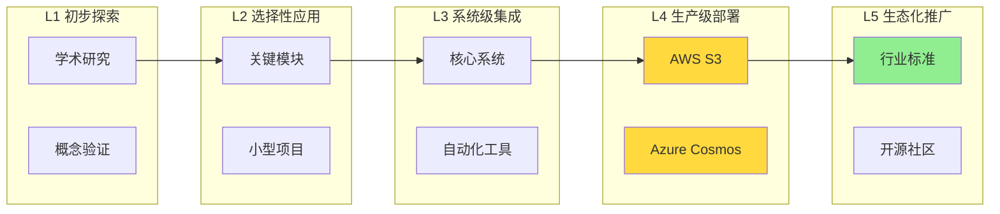
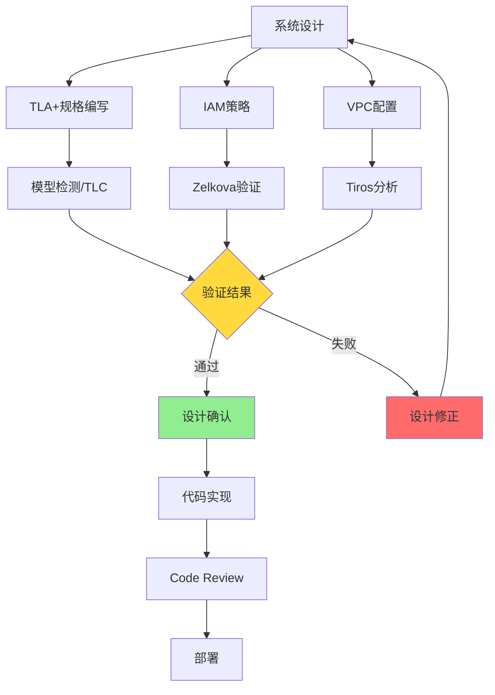
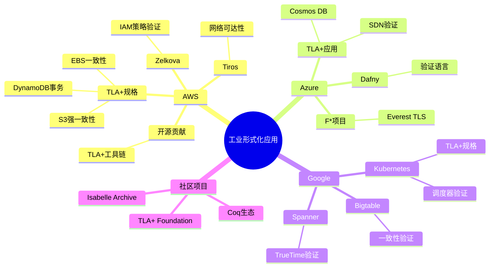
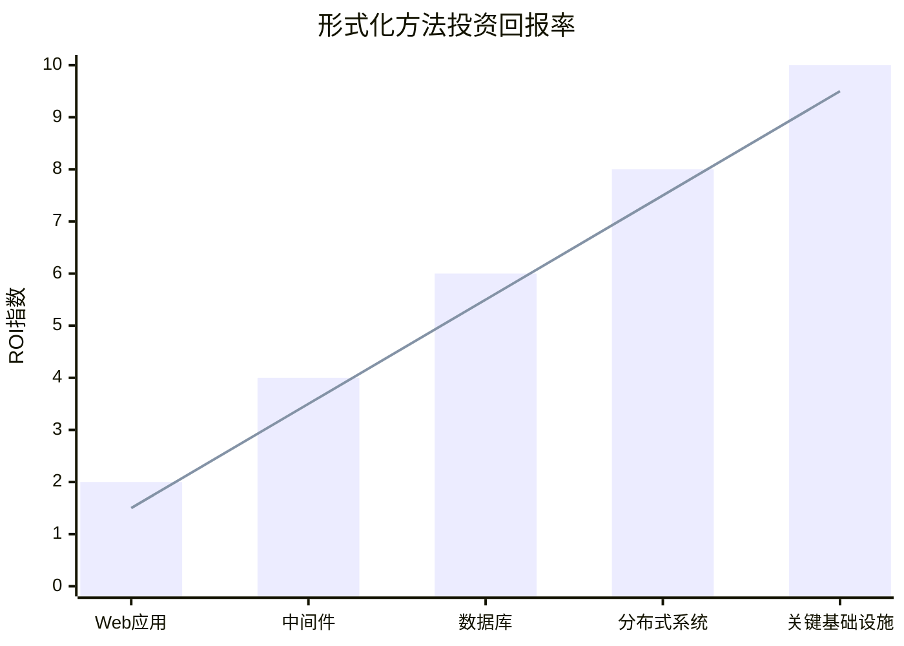

# 工业实践案例

> **所属单元**: formal-methods/04-application-layer/03-cloud-native | **前置依赖**: [02-kubernetes-verification](./02-kubernetes-verification.md) | **形式化等级**: L5-L6

## 1. 概念定义 (Definitions)

### Def-A-08-01: 形式化方法工业应用成熟度模型

形式化方法应用成熟度分为五级：

| 级别 | 名称 | 特征 | 代表企业 |
|-----|------|-----|---------|
| L1 | 初步探索 | 概念验证，学术研究 | 初创公司 |
| L2 | 选择性应用 | 关键模块验证 | 中型企业 |
| L3 | 系统级集成 | 核心系统形式化 | 大型云厂商 |
| L4 | 生产级部署 | 全流程覆盖 | AWS, Azure |
| L5 | 生态化推广 | 行业标准制定 | AWS+开源社区 |

### Def-A-08-02: TLA+工业规格标准

TLA+在工业应用中的标准实践：

**模块化规格**:
$$Spec = Init \land \Box[Next]_{vars} \land Liveness$$

**分层验证**:
$$HighLevel \sqsubseteq MidLevel \sqsubseteq Implementation$$

**模型约束**:
$$ModelConstraints == TypeInvariant \land StateSpaceLimit \land SymmetryReduction$$

### Def-A-08-03: 安全策略验证框架

安全策略验证的三层框架 $\mathcal{V} = (Syntax, Semantics, Enforcement)$：

**语法层 (Syntax)**: 策略语言的形式化文法
$$Policy \in \mathcal{L}_{policy} ::= Allow | Deny | If(Condition, Then, Else)$$

**语义层 (Semantics)**: 策略的解释函数
$$\llbracket Policy \rrbracket: Request \rightarrow \{Permit, Deny, NotApplicable\}$$

**执行层 (Enforcement)**: 运行时策略实施点
$$PEP: Request \times PDP \rightarrow Decision \times Enforcement$$

### Def-A-08-04: 自动化验证流水线

形式化验证的CI/CD集成：

```
代码提交 → 规格提取 → 模型生成 → 模型检测 → 证明检查 → 报告生成
    ↓           ↓           ↓           ↓           ↓           ↓
  GitHub    静态分析    TLA+/Coq    TLC/Coq     Proof       Dashboard
  Commit    工具        规格        模型检查器   Check
```

## 2. 属性推导 (Properties)

### Lemma-A-08-01: TLA+规格到实现的精化保持

若 $Spec_{high} \sqsubseteq Spec_{low}$ 且 $Impl \models Spec_{low}$，则：

$$Impl \models Spec_{high}$$

**证明**: 精化关系 $\sqsubseteq$ 的传递性。

### Lemma-A-08-02: 策略验证的完备性条件

策略验证器 $\mathcal{V}$ 是**完备的**，当且仅当：

$$\forall p \in Policy: (\exists r: Violates(p, r)) \Rightarrow \mathcal{V}(p) = \text{Unsafe}$$

即不存在漏报（但可能有误报）。

### Prop-A-08-01: 自动化验证的规模限制

对于状态空间 $|S|$ 的规格：

- 模型检测: 可行于 $|S| \leq 10^9$ 状态
- 符号模型检测: 可行于 $|S| \leq 10^{20}$ 状态
- 定理证明: 理论上无限制，但需人工干预

### Lemma-A-08-03: 安全策略的组合安全性

若策略 $p_1$ 和 $p_2$ 各自安全，则组合策略的安全性：

$$Safe(p_1) \land Safe(p_2) \not\Rightarrow Safe(p_1 \circ p_2)$$

即组合可能引入新的安全漏洞（需重新验证）。

## 3. 关系建立 (Relations)

### 3.1 云服务厂商形式化应用对比

| 厂商 | 主要工具 | 应用领域 | 公开成果 |
|-----|---------|---------|---------|
| AWS | TLA+, Coq, Boogie | S3, DynamoDB, EBS | 学术论文, 开源规格 |
| Azure | TLA+, F*, Z3 | SDN, 存储 | 学术合作 |
| Google | TLA+, Coq | Bigtable, Kubernetes | Kubernetes TLA+规格 |
| Microsoft | TLA+, Dafny | Azure Cosmos DB | Dafny开源 |
| Facebook | Infer, Zoncolan | 代码分析 | Infer开源 |

### 3.2 验证工具链对比

```
Zelkova (AWS)
    ├── 输入: IAM策略JSON
    ├── 内部: SMT + 抽象解释
    └── 输出: 安全/漏洞报告

Tiros (AWS)
    ├── 输入: VPC配置
    ├── 内部: 网络模型检查
    └── 输出: 可达性分析

Dafny (Microsoft)
    ├── 输入: 带规范的代码
    ├── 内部: Boogie验证器
    └── 输出: 证明/反例
```

### 3.3 形式化方法在不同领域的ROI

| 领域 | 故障成本 | 形式化ROI | 应用深度 |
|-----|---------|----------|---------|
| 分布式存储 | 极高 | 高 | 深度 |
| 网络配置 | 高 | 中高 | 中度 |
| 容器编排 | 中 | 中 | 增长中 |
| Web应用 | 低 | 低 | 轻度 |

## 4. 论证过程 (Argumentation)

### 4.1 AWS TLA+应用方法论

**方法论五步法**:

1. **需求分析**: 提取关键正确性属性
   $$CriticalProperties = \{Safety_1, ..., Safety_n, Liveness_1, ..., Liveness_m\}$$

2. **抽象建模**: 忽略不相关细节
   $$AbstractionLevel = Choose(High, Medium, Low)$$

3. **规格编写**: TLA+模块编写
   $$Spec = Algorithm + Properties + ModelConstraints$$

4. **模型检测**: TLC验证
   $$Check: Spec \models Properties \text{ for } StateSpace \leq Limit$$

5. **结果应用**: 设计改进或证明文档化

### 4.2 DynamoDB验证的关键发现

**问题**: 分布式事务协议边界条件

**规格规模**:

- 约2000行TLA+
- 状态空间: $10^{12}$（应用对称性约简后）

**发现的bug**:

- 时钟漂移导致的提交顺序异常
- 分区恢复时的状态不一致

**修复**: 添加额外的同步点，更新协议。

### 4.3 Zelkova策略验证原理

**IAM策略语言子集**: $\mathcal{L}_{IAM} \subset \mathcal{L}_{policy}$

**验证问题**:
$$Given: Policy \ p, \ Resource \ r$$
$$Question: \exists \ principal: p(principal, r) = Allow \land ShouldDeny(r)?$$

**算法**:

1. 策略到SMT公式的编码
2. Z3求解可满足性
3. 若SAT，提取攻击路径

## 5. 形式证明 / 工程论证

### 5.1 S3强一致性TLA+规格

AWS S3在2020年引入强一致性，其TLA+规格核心：

```tla
------------------------------ MODULE S3StrongConsistency ------------------------------
EXTENDS Naturals, Sequences, FiniteSets

CONSTANTS Objects, Versions, Clients

VARIABLES objectStore, clientViews

(* 对象存储: 对象 -> 版本历史 *)
TypeInvariant ==
    /\ objectStore \in [Objects -> Seq(Versions)]
    /\ clientViews \in [Clients -> [Objects -> Versions \cup {NULL}]]

(* 写操作: 添加新版本 *)
Write(c, o, v) ==
    /\ objectStore' = [objectStore EXCEPT ![o] = Append(@, v)]
    /\ UNCHANGED clientViews

(* 读操作: 返回最新版本 *)
Read(c, o) ==
    /\ LET latest == IF Len(objectStore[o]) > 0
                    THEN objectStore[o][Len(objectStore[o])]
                    ELSE NULL
       IN clientViews' = [clientViews EXCEPT ![c][o] = latest]
    /\ UNCHANGED objectStore

(* 强一致性: 读返回最新已确认写入 *)
StrongConsistency ==
    \A c \in Clients, o \in Objects:
        clientViews[c][o] = NULL
        / clientViews[c][o] = objectStore[o][Len(objectStore[o])]

(* 线性一致性: 所有操作可串行化 *)
Linearizability ==
    \E seq \in Seq(Operations):
        /\ IsSequential(seq)
        /\ ReturnsConsistent(seq, clientViews)
        /\ RealTimeOrderRespected(seq, operationTimes)

===============================================================================
```

### 5.2 Kubernetes控制平面的形式化保证

**定理**: Kubernetes声明式API保证最终一致性。

**形式化**:

$$\forall r \in Resources: \Diamond\Box(Spec[r] = Status[r]) \lor FailureDetected$$

**证明概要**:

1. 控制器是调谐循环: $while(true): Reconcile()$
2. 每次调谐缩小差异: $|Spec - Status|_{t+1} \leq |Spec - Status|_t$
3. 状态空间有限（资源有限）
4. 由良基归纳，最终达到一致或检测到故障

### 5.3 Tiros网络可达性验证

**网络模型**:
$$Network = (Instances, Subnets, Routes, SecurityGroups, ACLs)$$

**可达性问题**:
$$Reachable(src, dst, port) = \exists path: ValidPath(path, src, dst, port)$$

**Tiros算法**:

1. 构建网络拓扑图
2. 应用安全组规则过滤
3. 使用Datalog推理可达性
4. 对不可达路径给出证据

**复杂度**: $O(|V| + |E|)$ 对于单次查询，可预先计算传递闭包。

## 6. 实例验证 (Examples)

### 6.1 AWS IAM策略验证案例

**问题策略**:

```json
{
  "Version": "2012-10-17",
  "Statement": [
    {
      "Effect": "Allow",
      "Action": "s3:*",
      "Resource": "*"
    },
    {
      "Effect": "Deny",
      "Action": "s3:DeleteBucket",
      "Resource": "arn:aws:s3:::critical-data"
    }
  ]
}
```

**Zelkova分析**:

```
Analysis Results:
- Overall Effect: Allow with exceptions
- Potential Issue: s3:* includes privileged actions
- Recommended Fix: Use explicit allow list instead of wildcard
- Risk Level: High
```

### 6.2 Azure Cosmos DB TLA+规格片段

```tla
(* 分布式事务协议 *)
DistributedTx(c, keys) ==
    LET participants == {PartitionFor(k): k \in keys}
    IN
        \* 两阶段提交
        /\ \A p \in participants: SendPrepare(c, p)
        /\ AwaitPrepareResponses(c, participants)
        /\ IF \A r \in prepareResponses: r = Prepared
           THEN \A p \in participants: SendCommit(c, p)
           ELSE \A p \in participants: SendAbort(c, p)

(* 安全性: 不会提交已中止的事务 *)
Safety ==
    \A t \in Transactions:
        status[t] = Committed => ~\E p: vote[p][t] = Aborted

(* 活性: 最终提交或中止 *)
Liveness ==
    \A t \in Transactions:
        status[t] = Pending ~> status[t] \in {Committed, Aborted}
```

### 6.3 Google Kubernetes验证项目

**项目**: SIG-Scalability形式化验证子项目

**目标**: 验证Kubernetes调度器的可扩展性边界

**规格规模**:

- TLA+规格: 1500+行
- 验证场景: 5000节点，10万Pod
- 状态空间: 应用抽象后 $10^8$ 状态

**关键发现**:

- 调度延迟在节点数>3000时非线性增长
- 建议: 引入分层调度器

## 7. 可视化 (Visualizations)

### 7.1 工业形式化应用成熟度



### 7.2 AWS形式化方法工具链



### 7.3 云厂商形式化应用分布



### 7.4 形式化验证ROI分析



## 8. 引用参考 (References)
