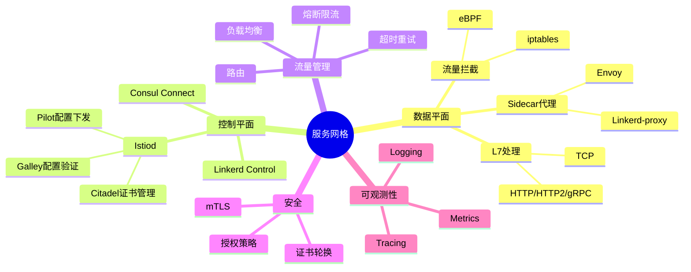
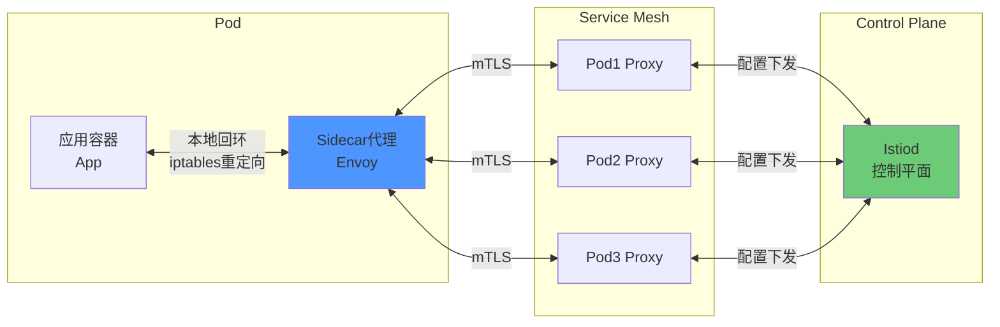
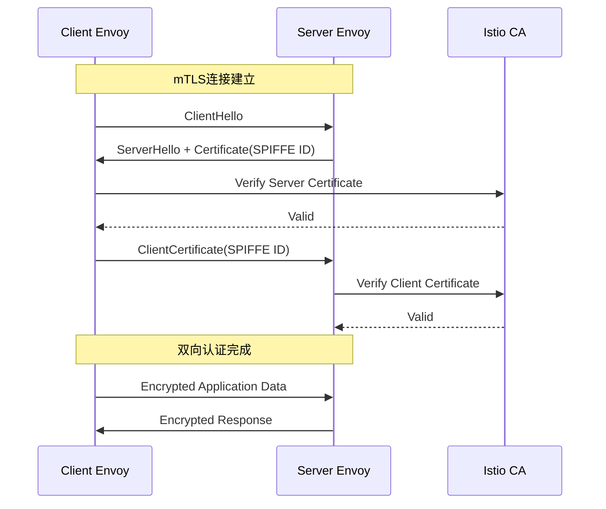
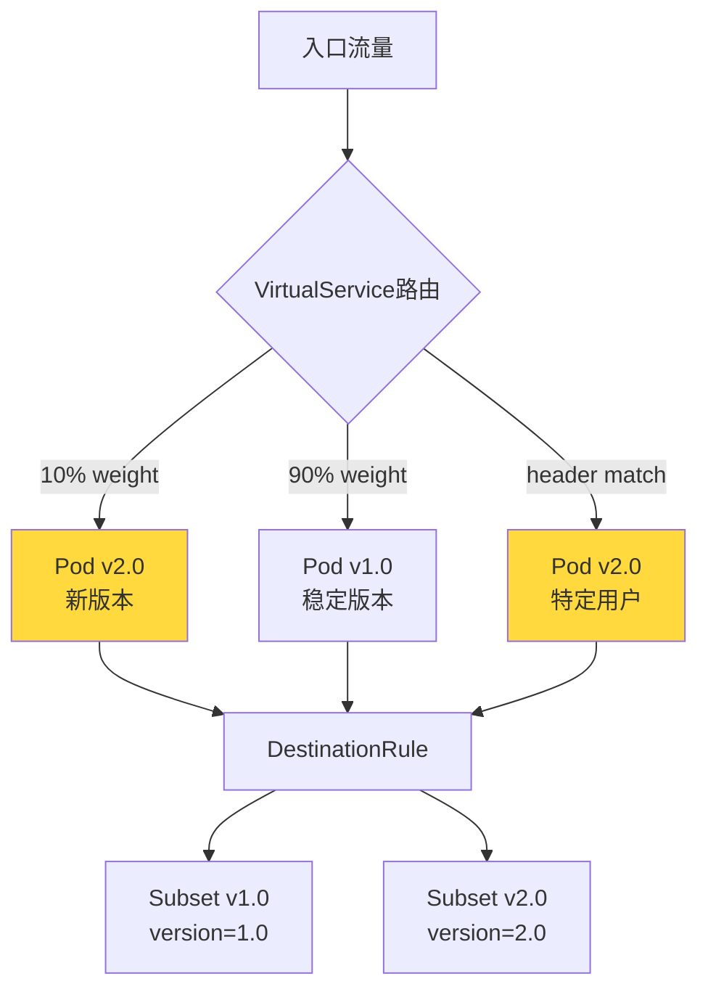
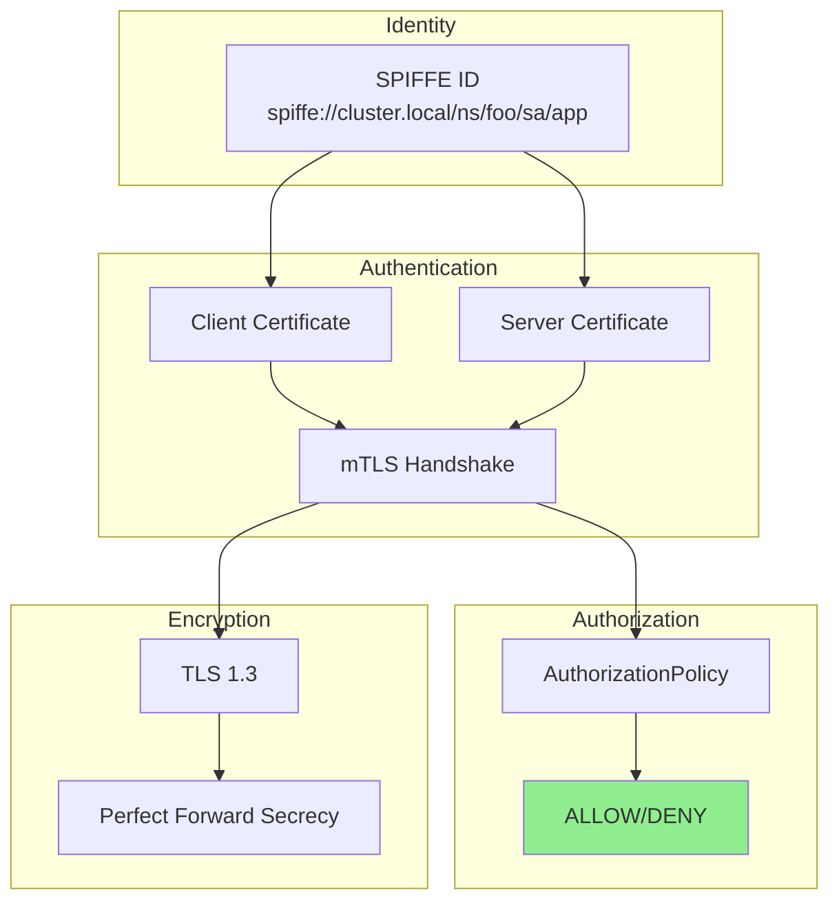

# 服务网格形式化

> **所属单元**: formal-methods/04-application-layer/03-cloud-native | **前置依赖**: [01-cloud-formalization](01-cloud-formalization.md), [02-kubernetes-verification](02-kubernetes-verification.md) | **形式化等级**: L5-L6

## 1. 概念定义 (Definitions)

### Def-A-06-06: 服务网格架构

服务网格是一个基础设施层，用于处理服务间通信：

$$\mathcal{M} = (D, P, C, R, S, T)$$

其中：

- $D$: 数据平面 (Data Plane)，由Sidecar代理组成
- $P$: 控制平面 (Control Plane)，配置和管理代理
- $C$: 服务集合 $\{s_1, s_2, ..., s_n\}$
- $R$: 路由规则集合
- $S$: 安全策略集合
- $T$: 遥测/观测数据

### Def-A-06-07: Sidecar代理通信

Sidecar代理模式形式化为代理函数：

$$\text{Proxy}: Request \rightarrow Response$$

对于服务 $s$ 的Sidecar代理 $p_s$：

$$p_s = (in_s, out_s, config_p)$$

- $in_s$: 入站流量拦截点
- $out_s$: 出站流量拦截点
- $config_p$: 代理配置

**流量拦截**: 使用iptables/ebpf将流量重定向到代理：

$$\forall pkt \in Traffic(s_i, s_j): intercept(pkt) \rightarrow forward(pkt, p_{s_i})$$

### Def-A-06-08: 流量管理形式化

**VirtualService路由**:

$$VS: (Service, Match) \rightarrow Route$$

其中 $Match$ 包含：

- URI匹配: $uri \in Pattern$
- Header匹配: $header[k] = v$
- 权重: $weight \in [0, 100]$

**路由决策**:

$$Route(req) = \begin{cases} s_1 & \text{if } match_1(req) \land rand() < w_1 \\ s_2 & \text{if } match_2(req) \land rand() < w_2 \\ ... \end{cases}$$

**DestinationRule负载均衡**:

$$LB: Subset \rightarrow Endpoint$$

负载均衡算法：

- Round Robin: $endpoint_i = (i \mod n)$
- Least Request: $endpoint = \arg\min_{e} active\_requests(e)$
- Random: $endpoint \sim Uniform(Endpoints)$
- Consistent Hash: $endpoint = hash(key) \mod n$

### Def-A-06-09: mTLS验证形式化

**双向TLS握手**:

$$mTLS: (Client, Server) \rightarrow (Cert_C, Cert_S, SharedSecret)$$

**证书验证链**:

$$Verify(Cert) = \begin{cases} \top & \text{if } ChainValid(Cert) \land NotExpired(Cert) \land CRLCheck(Cert) \\ \bot & \text{otherwise} \end{cases}$$

**身份认证**:

$$Authenticate(C, S) = Verify(Cert_C) \land Verify(Cert_S) \land TrustChain(CA_{mutual})$$

**授权策略**:

$$Authorize(req, src, dst) = \begin{cases} Allow & \text{if } \exists pol \in Policies: matches(pol, src, dst, req) \\ Deny & \text{otherwise} \end{cases}$$

### Def-A-06-10: Istio/Envoy模型

**Envoy代理配置模型**:

$$EnvoyConfig = (Listeners, Clusters, Routes, Endpoints)$$

- $Listeners$: 监听端口和协议配置
- $Clusters$: 上游服务集群定义
- $Routes$: 路由匹配和转发规则
- $Endpoints$: 后端实例列表

**Istio配置转换**:

$$IstioConfig \xrightarrow{\text{Pilot}} EnvoyConfig$$

Pilot将高级抽象（VirtualService、DestinationRule）转换为Envoy的低级配置。

## 2. 属性推导 (Properties)

### Lemma-A-06-04: Sidecar透明性

Sidecar代理对应用服务是透明的：

$$\forall s: behavior(s \text{ with sidecar}) \approx behavior(s \text{ without sidecar})$$

**证明概要**: 代理仅拦截网络流量，不修改应用逻辑。

### Lemma-A-06-05: mTLS安全性

mTLS确保通信机密性和完整性：

$$\forall m \in Messages: Encrypted(m) \land Authenticated(m)$$

**证明**: TLS 1.3协议保证。

### Prop-A-06-02: 路由一致性

在给定配置下，相同请求的转发的目标是一致的：

$$\forall req_1 = req_2: Route(req_1) = Route(req_2)$$

### Lemma-A-06-06: 故障注入的可控性

故障注入在配置范围内是确定性的：

$$FaultInject(req, config) = \begin{cases} error & \text{if } rand() < config.faultRate \\ pass & \text{otherwise} \end{cases}$$

## 3. 关系建立 (Relations)

### 3.1 服务网格vs传统架构

```
┌─────────────────┬──────────────────┬──────────────────┐
│     特性        │   传统微服务      │    服务网格       │
├─────────────────┼──────────────────┼──────────────────┤
│ 通信治理        │ SDK/客户端库      │ Sidecar代理       │
│ 语言绑定        │ 依赖语言SDK       │ 语言无关          │
│ 升级复杂度      │ 应用重启          │ 代理独立升级      │
│ 可观测性        │ 应用埋点          │ 自动收集          │
│ 安全实现        │ 应用实现          │ 基础设施层        │
│ 性能开销        │ 低               │ 中(延迟+CPU)      │
│ 运维复杂度      │ 中               │ 高               │
└─────────────────┴──────────────────┴──────────────────┘
```

### 3.2 主要服务网格对比

| 特性 | Istio | Linkerd | Consul Connect | AWS App Mesh |
|-----|-------|---------|---------------|--------------|
| 控制平面 | Pilot/Galley | 内置 | Consul Server | AWS托管 |
| 数据平面 | Envoy | Linkerd-proxy | Envoy | Envoy |
| mTLS | 自动 | 自动 | 可选 | 自动 |
| 性能 | 中 | 高 | 中 | 中 |
| 复杂度 | 高 | 低 | 中 | 低 |
| 多集群 | 支持 | 支持 | 支持 | 支持 |

### 3.3 服务网格与Kubernetes

```
Kubernetes + Service Mesh:
┌─────────────────────────────────────────┐
│           应用工作负载                   │
│  ┌─────┐ ┌─────┐ ┌─────┐              │
│  │ App │ │ App │ │ App │              │
│  └──┬──┘ └──┬──┘ └──┬──┘              │
│     │       │       │                  │
├─────┼───────┼───────┼─────────────────┤
│     ▼       ▼       ▼                  │
│  ┌─────┐ ┌─────┐ ┌─────┐  服务网格     │
│  │Envoy│ │Envoy│ │Envoy│  数据平面     │
│  └──┬──┘ └──┬──┘ └──┬──┘              │
│     │       │       │                  │
│     └───────┼───────┘                  │
│             ▼                          │
│  ┌─────────────────────┐               │
│  │    Istiod/Linkerd   │  控制平面     │
│  │    (控制配置下发)    │               │
│  └─────────────────────┘               │
└─────────────────────────────────────────┘
```

## 4. 论证过程 (Argumentation)

### 4.1 Sidecar模式vsProxyless模式

```
┌─────────────────────────────────────────────────────────────┐
│ Sidecar模式                        Proxyless模式            │
├─────────────────────────────────────────────────────────────┤
│                                                             │
│  ┌─────────┐                       ┌─────────┐             │
│  │   App   │                       │   App   │◄──SDK       │
│  │ (无SDK) │                       │(gRPC/XDS)│             │
│  └────┬────┘                       └────┬────┘             │
│       │                                 │                  │
│       │ iptables重定向                   │ 直连            │
│       ▼                                 ▼                  │
│  ┌─────────┐                       ┌─────────┐             │
│  │  Envoy  │                       │  Envoy  │(可选)       │
│  │ Sidecar │                       │ Gateway │             │
│  └────┬────┘                       └────┬────┘             │
│       │                                 │                  │
│       └──────────────┬──────────────────┘                  │
│                      ▼                                      │
│              ┌───────────────┐                             │
│              │   目标服务     │                             │
│              └───────────────┘                             │
│                                                             │
│ 优点:                             优点:                     │
│ - 语言无关                        - 更低延迟                │
│ - 应用零侵入                      - 更少资源占用            │
│ - 完整L7能力                      - 更高性能                │
│                              缺点:                          │
│ 缺点:                             - 语言绑定                │
│ - 延迟增加(~3-5ms)                - 需要SDK                 │
│ - 资源开销(x2 Pod)                - 应用需要改造            │
└─────────────────────────────────────────────────────────────┘
```

### 4.2 流量管理策略对比

| 策略 | 用途 | 实现复杂度 | 风险 |
|-----|------|-----------|------|
| 金丝雀发布 | 渐进式发布新版本 | 低 | 回滚速度 |
| A/B测试 | 多版本并行对比 | 中 | 样本偏差 |
| 蓝绿部署 | 零停机发布 | 中 | 资源翻倍 |
| 熔断 | 故障快速失败 | 低 | 误熔断 |
| 限流 | 保护后端服务 | 低 | 用户体验 |
| 重试 | 瞬时故障恢复 | 低 | 级联压力 |
| 超时 | 防止长时间阻塞 | 低 | 过早失败 |
| 故障注入 | 混沌工程 | 中 | 生产风险 |

### 4.3 安全模型层次

```
服务网格安全层次:
Layer 4 ────────────────────────────────
│  mTLS (传输层加密)
│  ├── 证书管理 (SDS)
│  ├── 自动轮换
│  └── 双向认证
Layer 7 ────────────────────────────────
│  授权策略
│  ├── 命名空间隔离
│  ├── 服务级别ACL
│  └── JWT验证
应用层 ────────────────────────────────
│  应用认证
│  ├── OAuth/OIDC
│  ├── API Key
│  └── 自定义认证
```

## 5. 形式证明 / 工程论证

### 5.1 Sidecar代理通信的形式化

**透明拦截模型**:

对于服务 $s$ 的入站流量：

```
原始: Client ──TCP──▶ Service:port
代理: Client ──TCP──▶ Sidecar:port ──LocalTCP──▶ Service:port

iptables规则:
  PREROUTING -t nat -p tcp --dport $PORT -j REDIRECT --to-port $PROXY_PORT
```

**形式化行为**:

$$\llbracket Proxy \rrbracket = \lambda req.\, config(req) \gg process(req) \gg route(req)$$

其中：

- $config(req)$: 应用路由/安全/流量策略
- $process(req)$: 协议解析、指标收集
- $route(req)$: 选择上游并转发

### 5.2 流量路由的形式化验证

**VirtualService到Envoy路由转换**:

$$\llbracket VS \rrbracket = \{ (match_i, route_i) \}_{i=1}^n$$

转换规则：

```
VirtualService:
  - match:
    - uri: /api/v1/*
    - headers:
        version: v2
    route:
    - destination: service-v2
      weight: 100

转换为Envoy Route:
  match:
    prefix: /api/v1/
    headers:
    - name: version
      exact_match: v2
  route:
    cluster: service-v2
```

**路由一致性验证**:

$$\forall req: VS(req) = \llbracket VS \rrbracket(req)$$

### 5.3 mTLS验证协议

**SPIFFE/SPIRE身份模型**:

$$Identity = spiffe://trust-domain/ns/namespace/sa/service-account$$

**证书签发流程**:

```
1. Workload启动 → 向SDS (Secret Discovery Service) 请求证书
2. SDS → CA (Istiod Citadel / SPIRE Server) 签发SVID
3. CA返回X.509证书，包含SPIFFE ID
4. Sidecar使用证书进行mTLS握手
```

**握手验证**:

$$\text{mTLS Handshake}(C, S) = \begin{cases} Success & \text{if } Cert_C.valid \land Cert_S.valid \land SPIFFE_{C}.trust = SPIFFE_{S}.trust \\ Fail & \text{otherwise} \end{cases}$$

### 5.4 完整形式化语义表

#### 流量管理语义表

| 配置 | Istio抽象 | Envoy配置 | 语义 |
|-----|----------|-----------|------|
| 路由 | VirtualService | Route | $match(req) \rightarrow upstream$ |
| 负载均衡 | DestinationRule | Cluster | $LB(subset) \rightarrow endpoint$ |
| 超时 | Timeout | Route.Timeout | $\forall req: time < T$ |
| 重试 | Retries | Route.Retry | $retry(req, n, conditions)$ |
| 熔断 | OutlierDetection | HealthCheck | $failure\_rate > threshold \Rightarrow eject$ |

#### 安全策略语义表

| 策略 | PeerAuthentication | AuthorizationPolicy | 效果 |
|-----|-------------------|---------------------|------|
| mTLS模式 | PERMISSIVE/STRICT | - | $STRICT \Rightarrow \forall conn: mTLS$ |
| 命名空间隔离 | - | from.source.namespace | $src.ns \in allowed \Rightarrow allow$ |
| 服务访问控制 | - | to.operation.method | $method \in allowed \Rightarrow allow$ |
| JWT验证 | RequestAuthentication | - | $JWT.valid \Rightarrow identity$ |

## 6. 实例验证 (Examples)

### 6.1 Istio VirtualService配置

```yaml
apiVersion: networking.istio.io/v1beta1
kind: VirtualService
metadata:
  name: reviews-route
spec:
  hosts:
  - reviews
  http:
  - match:
    - headers:
        end-user:
          exact: jason
    route:
    - destination:
        host: reviews
        subset: v2
  - route:
    - destination:
        host: reviews
        subset: v1
      weight: 75
    - destination:
        host: reviews
        subset: v3
      weight: 25
```

形式化表示：

```
Route(req) =
  if req.headers["end-user"] == "jason" then reviews-v2
  else if rand() < 0.75 then reviews-v1
  else reviews-v3
```

### 6.2 mTLS配置

```yaml
apiVersion: security.istio.io/v1beta1
kind: PeerAuthentication
metadata:
  name: default
  namespace: foo
spec:
  mtls:
    mode: STRICT
---
apiVersion: security.istio.io/v1beta1
kind: AuthorizationPolicy
metadata:
  name: service-a-policy
  namespace: foo
spec:
  selector:
    matchLabels:
      app: service-a
  action: ALLOW
  rules:
  - from:
    - source:
        principals: ["cluster.local/ns/foo/sa/service-b"]
    to:
    - operation:
        methods: ["GET"]
        paths: ["/api/*"]
```

形式化安全策略：

```
Authorize(req, src, dst) =
  dst.app == "service-a"
  ∧ src.principal == "cluster.local/ns/foo/sa/service-b"
  ∧ req.method == "GET"
  ∧ req.path matches "/api/*"
```

### 6.3 Envoy配置示例

```yaml
# Envoy代理配置片段
static_resources:
  listeners:
  - name: listener_0
    address:
      socket_address: { address: 0.0.0.0, port_value: 8080 }
    filter_chains:
    - filters:
      - name: envoy.filters.network.http_connection_manager
        typed_config:
          "@type": type.googleapis.com/envoy.extensions.filters.network.http_connection_manager.v3.HttpConnectionManager
          stat_prefix: ingress_http
          route_config:
            name: local_route
            virtual_hosts:
            - name: backend
              domains: ["*"]
              routes:
              - match: { prefix: "/" }
                route: { cluster: service_backend }
          http_filters:
          - name: envoy.filters.http.router

  clusters:
  - name: service_backend
    connect_timeout: 0.25s
    type: STRICT_DNS
    lb_policy: ROUND_ROBIN
    load_assignment:
      cluster_name: service_backend
      endpoints:
      - lb_endpoints:
        - endpoint:
            address:
              socket_address: { address: backend, port_value: 8080 }
```

### 6.4 故障注入测试

```yaml
apiVersion: networking.istio.io/v1beta1
kind: VirtualService
metadata:
  name: ratings-fault
spec:
  hosts:
  - ratings
  http:
  - fault:
      delay:
        percentage:
          value: 10.0
        fixedDelay: 5s
      abort:
        percentage:
          value: 5.0
        httpStatus: 503
    route:
    - destination:
        host: ratings
        subset: v1
```

形式化故障注入：

```
Process(req) =
  if rand() < 0.05 then abort(503)
  else if rand() < 0.10 then delay(5s) then forward(req)
  else forward(req)
```

## 7. 可视化 (Visualizations)

### 7.1 服务网格架构全景



### 7.2 Sidecar代理流量路径



### 7.3 mTLS握手流程



### 7.4 金丝雀发布流量分割



### 7.5 服务网格安全模型



## 8. 引用参考 (References)
