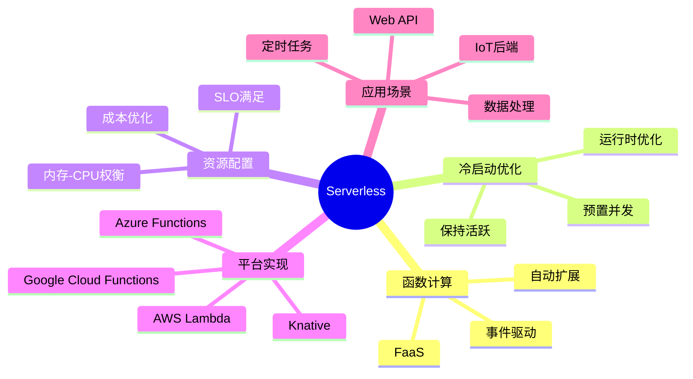
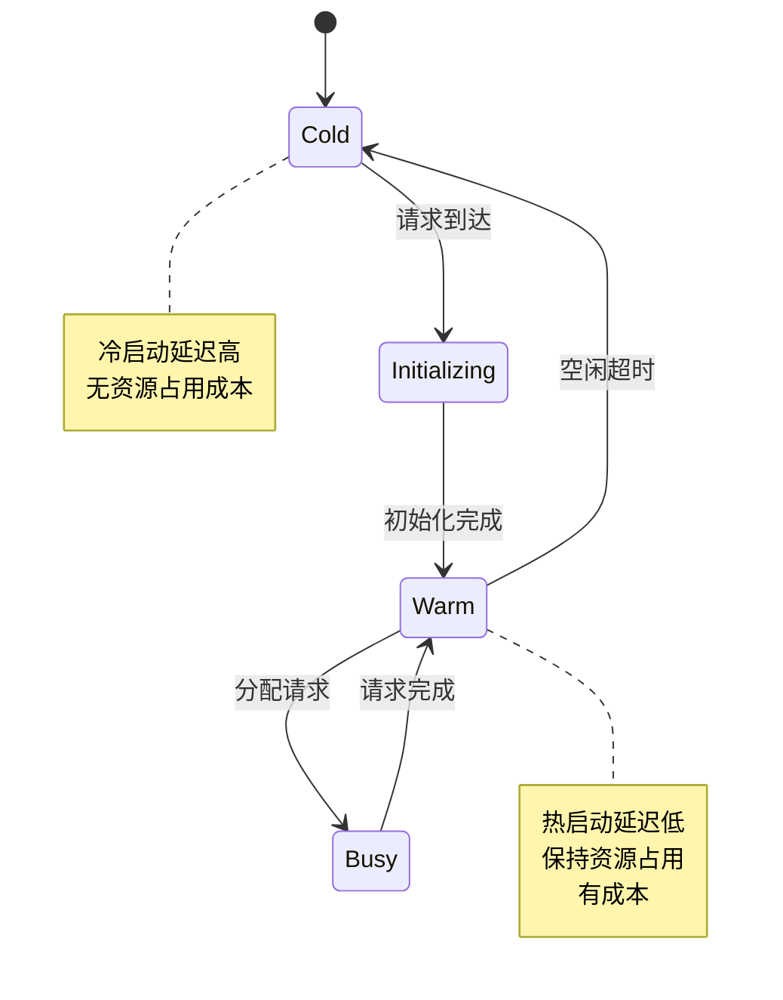
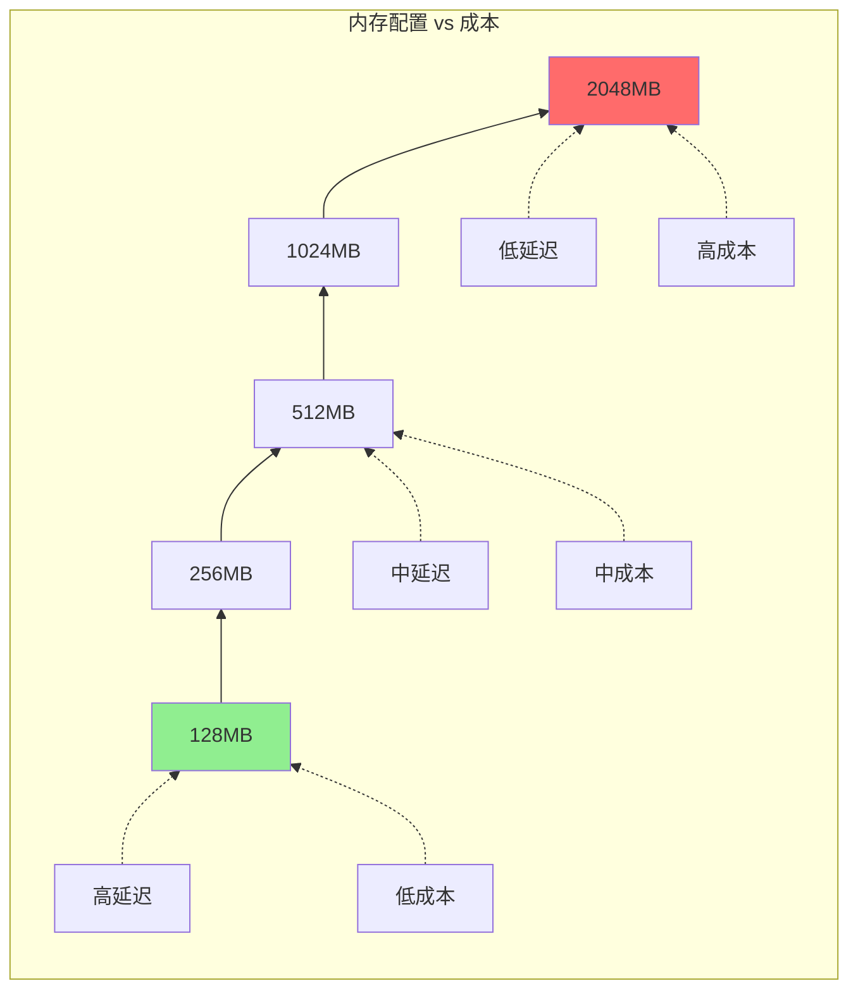
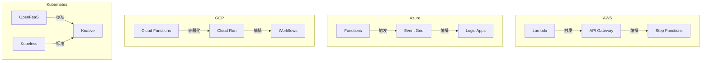

# Serverless形式化

> **所属单元**: formal-methods/04-application-layer/03-cloud-native | **前置依赖**: [04-service-mesh](04-service-mesh.md) | **形式化等级**: L5-L6

## 1. 概念定义 (Definitions)

### Def-A-06-11: 函数即服务模型

函数即服务 (FaaS) 是一个五元组 $\mathcal{F} = (F, E, T, R, S)$：

- $F$: 函数集合，每个函数 $f \in F$ 是事件处理器 $f: Event \rightarrow Result$
- $E$: 事件源集合，触发函数执行
- $T$: 触发器配置，$T: E \rightarrow F$
- $R$: 资源配置，包括内存、CPU、超时设置
- $S$: 平台服务，提供自动扩缩容和生命周期管理

**函数执行模型**:

$$\text{Execute}(f, e) = \begin{cases} (result, \Delta t) & \text{if } \Delta t < timeout \\ (error_{timeout}, \bot) & \text{otherwise} \end{cases}$$

其中 $\Delta t$ 是执行时间。

### Def-A-06-12: 冷启动问题

冷启动是函数从创建到可处理请求的时间：

$$T_{cold} = T_{provision} + T_{runtime\_init} + T_{function\_init}$$

**热启动时间**:

$$T_{warm} = T_{dispatch} \approx 1-10ms$$

**冷启动 vs 热启动比率**:

$$\rho = \frac{T_{cold}}{T_{warm}} \in [100, 10000]$$

**冷启动概率**:

$$P_{cold} = 1 - e^{-\lambda \cdot idle\_time}$$

其中 $\lambda$ 是请求到达率。

### Def-A-06-13: 资源分配优化

资源分配问题形式化为优化问题：

$$\min_{m, n} \quad Cost(m, n) = m \cdot price\_per\_memory \cdot n \cdot execution\_time$$

约束条件：

$$\text{s.t.} \quad throughput(m, n) \geq demand$$
$$\text{s.t.} \quad latency(m, n) \leq SLO$$
$$\text{s.t.} \quad m_{min} \leq m \leq m_{max}$$

其中：

- $m$: 分配给函数的内存
- $n$: 并发实例数

**内存-CPU关系**:

$$CPU(m) = \alpha \cdot m^{\beta}, \quad \beta \approx 0.5-1.0$$

### Def-A-06-14: 自动扩缩容策略

**基于并发数的扩缩容**:

$$n(t) = \lceil \frac{concurrency(t)}{target\_concurrency} \rceil$$

**基于队列深度的扩缩容**:

$$n(t) = n(t-1) + k_p \cdot e(t) + k_i \cdot \int e(t)dt$$

其中 $e(t) = queue\_depth - target\_depth$。

**预测性扩缩容**:

$$n(t+\Delta) = \hat{\lambda}(t+\Delta) \cdot target\_latency$$

使用负载预测 $\hat{\lambda}$ 提前扩容。

### Def-A-06-15: Serverless平台形式化

Serverless平台是一个资源管理器：

$$\text{Platform}: (Request, State) \rightarrow (Allocation, State')$$

**调度策略**:

$$\text{Schedule}(req) = \arg\min_{instance} (load(instance) + distance(instance, req))$$

**生命周期管理**:

$$State \in \{Cold, Initializing, Warm, Busy, Terminating\}$$

$$\delta: State \times Event \rightarrow State$$

## 2. 属性推导 (Properties)

### Lemma-A-06-07: 冷启动延迟上界

冷启动延迟受资源分配影响：

$$T_{cold}(m) \leq c_1 + \frac{c_2}{CPU(m)} + c_3 \cdot init\_size$$

**证明**: 容器创建和初始化时间与分配资源成反比。

### Lemma-A-06-08: 成本-延迟权衡

在Serverless中存在成本与延迟的基本权衡：

$$\forall f: \frac{\partial Cost}{\partial Latency} < 0$$

即降低延迟（增加资源）必然增加成本。

### Prop-A-06-03: 最优资源配置存在性

对于给定的函数 $f$ 和负载模式 $\lambda(t)$，存在最优资源配置：

$$\exists (m^*, n^*): Cost(m^*, n^*) = \min_{m,n} Cost(m,n) \text{ s.t. } SLO \text{ satisfied}$$

**证明**: 成本函数在紧约束下连续，由极值定理保证最优解存在。

### Lemma-A-06-09: 扩缩容稳定性条件

自动扩缩容系统稳定的充分条件：

$$scaling\_cooldown > max(T_{cold}, metric\_collection\_interval)$$

## 3. 关系建立 (Relations)

### 3.1 Serverless vs 传统架构

```
┌─────────────────┬──────────────────┬──────────────────┐
│     特性        │   传统容器/K8s    │    Serverless    │
├─────────────────┼──────────────────┼──────────────────┤
│ 资源管理        │ 预分配/预留       │ 按需自动          │
│ 计费模式        │ 按资源时长        │ 按执行时间        │
│ 冷启动          │ 无               │ 有(毫秒-秒级)     │
│ 扩展速度        │ 秒-分钟级        │ 毫秒-秒级         │
│ 状态管理        │ 内置             │ 外部服务          │
│ 执行时长限制    │ 无               │ 有(通常15分钟)    │
│ 运维负担        │ 中               │ 低               │
│ 成本(低负载)    │ 高(预留浪费)      │ 低(按需)          │
│ 成本(高负载)    │ 低               │ 可能更高          │
└─────────────────┴──────────────────┴──────────────────┘
```

### 3.2 主流Serverless平台对比

| 特性 | AWS Lambda | Azure Functions | Google Cloud Functions | Knative |
|-----|-----------|-----------------|----------------------|---------|
| 冷启动 | 100-1000ms | 200-2000ms | 100-500ms | 可配置 |
| 最大内存 | 10GB | 14GB | 32GB | 无限制 |
| 超时 | 15分钟 | 无限制(消费计划)/无限制(高级) | 60分钟 | 可配置 |
| 并发 | 1000/区域 | 无限制 | 无限制 | 可配置 |
| 自定义运行时 | 支持 | 支持 | 支持 | 支持 |
| 容器支持 | 支持 | 支持 | 支持 | 原生 |

### 3.3 Serverless与微服务

```
Serverless作为微服务实现:
┌─────────────────────────────────────────────────────────────┐
│                      API Gateway                            │
├─────────────────────────────────────────────────────────────┤
│  ┌─────────┐  ┌─────────┐  ┌─────────┐  ┌─────────┐        │
│  │  Auth   │  │  Order  │  │ Payment │  │  User   │        │
│  │ Function│  │ Function│  │ Function│  │ Function│        │
│  └────┬────┘  └────┬────┘  └────┬────┘  └────┬────┘        │
│       │            │            │            │              │
│       └────────────┼────────────┼────────────┘              │
│                    ▼            ▼                           │
│              ┌─────────┐  ┌─────────┐                      │
│              │DynamoDB │  │  SNS    │                      │
│              └─────────┘  └─────────┘                      │
│                                                             │
│  每个函数: 独立部署, 独立扩展, 按需计费                      │
└─────────────────────────────────────────────────────────────┘
```

## 4. 论证过程 (Argumentation)

### 4.1 冷启动优化策略

```
冷启动优化层次:
├── 平台层
│   ├── 预置并发 (Provisioned Concurrency)
│   ├── 保持实例 (Keep-alive pings)
│   └── 精简运行时 (Custom Runtime)
├── 应用层
│   ├── 延迟加载 (Lazy initialization)
│   ├── 连接池化 (Connection pooling)
│   └── 减少依赖 (Minimal dependencies)
└── 架构层
    ├── 函数链 (Function chaining)
    ├── 步函数 (Step functions)
    └── 边缘部署 (Edge deployment)
```

### 4.2 Serverless成本模型

```
成本 = 请求成本 + 计算成本

请求成本 = $0.20/百万请求

计算成本 = 内存(GB) × 执行时间(ms) × $0.0000166667/GB-s

示例:
- 128MB函数, 200ms执行, 1000万次/天
  = $0.20 × 10 + (0.125 × 0.2 × 10,000,000) × $0.0000166667
  = $2 + $4.17
  = $6.17/天
```

### 4.3 有状态vs无状态函数

| 特性 | 无状态函数 | 有状态函数 |
|-----|-----------|-----------|
| 数据存储 | 外部服务 | 部分内存状态 |
| 扩展性 | 无限 | 受状态限制 |
| 容错 | 简单重试 | 状态恢复 |
| 延迟 | 依赖外部调用 | 可能更低 |
| 实现复杂度 | 低 | 高 |
| 适用场景 | 通用计算 | 流处理, ML推理 |

## 5. 形式证明 / 工程论证

### 5.1 冷启动延迟的排队论模型

**M/M/c排队模型**:

将函数实例视为服务台，请求到达为泊松过程：

$$\lambda: \text{请求到达率}$$
$$\mu: \text{服务率} = \frac{1}{execution\_time}$$
$$c: \text{并发实例数}$$

**稳态概率**:

$$P_n = \begin{cases} \frac{(\lambda/\mu)^n}{n!} P_0 & n \leq c \\ \frac{(\lambda/\mu)^n}{c! c^{n-c}} P_0 & n > c \end{cases}$$

**冷启动概率**:

$$P_{cold} = P_{n > c} = \sum_{n=c+1}^{\infty} P_n$$

**优化目标**: 最小化 $P_{cold}$ 同时控制成本。

### 5.2 资源分配优化算法

**二分搜索最优内存**:

```
算法: FindOptimalMemory
输入: 函数f, SLO约束, 成本预算
输出: 最优内存m*

1. low = min_memory, high = max_memory
2. while low < high:
3.   mid = (low + high) / 2
4.   profile = benchmark(f, mid)
5.   if profile.latency <= SLO.latency:
6.     if profile.cost <= budget:
7.       return mid
8.     else:
9.       high = mid - 1
10.  else:
11.    low = mid + 1
12. return low
```

**收敛性**: 时间复杂度 O(log(max - min))，保证收敛到最优或次优解。

### 5.3 扩缩容控制的形式化

**PID控制器形式化**:

$$u(t) = K_p e(t) + K_i \int_0^t e(\tau)d\tau + K_d \frac{de(t)}{dt}$$

其中：

- e(t) = r(t) - y(t): 误差（目标-实际）
- u(t): 控制输出（目标实例数）
- K_p, K_i, K_d: PID参数

**稳定性条件**:

$$K_p > 0, K_i > 0, K_d > 0 \land K_i < \frac{K_p K_d}{T_{cold}}$$

### 5.4 完整形式化语义表

#### 生命周期状态表

| 状态 | 转移事件 | 下一状态 | 延迟 |
|-----|---------|---------|------|
| Cold | 请求到达 | Initializing | 0 |
| Initializing | 初始化完成 | Warm | T_cold |
| Warm | 请求分配 | Busy | 0 |
| Busy | 请求完成 | Warm | T_exec |
| Warm | 空闲超时 | Cold | T_idle |

#### 资源配置影响表

| 内存 | CPU | 冷启动 | 执行时间 | 成本/请求 |
|-----|-----|--------|---------|----------|
| 128MB | 0.2vCPU | 500ms | 1000ms | 低 |
| 512MB | 0.5vCPU | 400ms | 400ms | 中 |
| 1024MB | 1.0vCPU | 300ms | 200ms | 高 |
| 2048MB | 2.0vCPU | 250ms | 100ms | 更高 |

## 6. 实例验证 (Examples)

### 6.1 AWS Lambda函数配置

```yaml
# serverless.yml
service: order-service

provider:
  name: aws
  runtime: nodejs18.x
  memorySize: 512
  timeout: 30
  environment:
    DB_HOST: ${env:DB_HOST}

functions:
  createOrder:
    handler: src/handlers/createOrder.handler
    events:
      - http:
          path: /orders
          method: post
    reservedConcurrency: 100
    provisionedConcurrency: 10

  processPayment:
    handler: src/handlers/processPayment.handler
    events:
      - sqs: arn:aws:sqs:us-east-1:xxx:payment-queue
    memorySize: 1024
```

形式化约束：

```
createOrder:
  - memory = 512MB
  - timeout = 30s
  - concurrency_limit = 100
  - provisioned = 10  (减少冷启动)

processPayment:
  - memory = 1024MB
  - trigger = SQS queue
  - scale = queue_depth / batch_size
```

### 6.2 冷启动优化实现

```javascript
// Lambda优化冷启动示例
const AWS = require('aws-sdk');

// 在模块级别初始化连接（复用）
const dynamodb = new AWS.DynamoDB.DocumentClient();
let dbConnection = null;

const getConnection = async () => {
  if (!dbConnection) {
    dbConnection = await createConnection(); // 延迟初始化
  }
  return dbConnection;
};

exports.handler = async (event) => {
  // handler入口，最小化初始化
  const db = await getConnection();

  // 业务逻辑
  const result = await processRequest(event, db);

  return {
    statusCode: 200,
    body: JSON.stringify(result)
  };
};

// 保持函数存活（可选）
if (process.env.KEEP_WARM === 'true') {
  setInterval(() => {
    exports.handler({ keepWarm: true });
  }, 60000); // 每60秒ping一次
}
```

### 6.3 Knative扩缩容配置

```yaml
apiVersion: serving.knative.dev/v1
kind: Service
metadata:
  name: hello-world
spec:
  template:
    metadata:
      annotations:
        # 自动扩缩容配置
        autoscaling.knative.dev/minScale: "1"
        autoscaling.knative.dev/maxScale: "100"
        autoscaling.knative.dev/targetConcurrency: "10"
        autoscaling.knative.dev/targetBurstCapacity: "50"
        # 缩容至零
        autoscaling.knative.dev/scale-to-zero-pod-retention-period: "5m"
    spec:
      containers:
      - image: gcr.io/knative-samples/helloworld-go
        resources:
          requests:
            memory: "128Mi"
            cpu: "100m"
          limits:
            memory: "256Mi"
            cpu: "200m"
```

### 6.4 资源优化分析

```python
# 资源优化分析脚本
import numpy as np

def estimate_optimal_memory(function_name, latency_slo_ms):
    """基于性能分析估计最优内存配置"""

    # 不同内存配置的性能数据
    configs = [
        {"memory": 128, "execution_ms": 1000, "cost_per_1m": 0.20},
        {"memory": 256, "execution_ms": 600, "cost_per_1m": 0.25},
        {"memory": 512, "execution_ms": 350, "cost_per_1m": 0.30},
        {"memory": 1024, "execution_ms": 200, "cost_per_1m": 0.33},
        {"memory": 2048, "execution_ms": 120, "cost_per_1m": 0.40},
    ]

    # 过滤满足SLO的配置
    valid_configs = [c for c in configs if c["execution_ms"] <= latency_slo_ms]

    if not valid_configs:
        return None, "No configuration meets SLO"

    # 选择成本最低的
    optimal = min(valid_configs, key=lambda x: x["cost_per_1m"])

    return optimal, None

# 示例: 500ms延迟约束
optimal, error = estimate_optimal_memory("my-function", 500)
if optimal:
    print(f"Optimal: {optimal['memory']}MB, "
          f"Latency: {optimal['execution_ms']}ms, "
          f"Cost: ${optimal['cost_per_1m']}/M requests")
```

## 7. 可视化 (Visualizations)

### 7.1 Serverless架构全景



### 7.2 函数生命周期



### 7.3 自动扩缩容流程

```mermaid
flowchart TD
    A[请求到达] --> B{实例可用?}
    B -->|是| C[分配到现有实例]
    B -->|否| D[冷启动新实例]

    D --> E[创建容器]
    E --> F[初始化运行时]
    F --> G[加载函数代码]
    G --> H[执行初始化代码]
    H --> C

    C --> I[处理请求]
    I --> J{更多请求?}
    J -->|是| K{并发限制?}
    J -->|否,空闲| L[等待超时]

    K -->|未达限制| C
    K -->|已达限制| D

    L -->|超时|M[销毁实例]
    L -->|新请求到达|C
    M --> [*]
```

### 7.4 成本-延迟权衡



### 7.5 Serverless平台对比



## 8. 引用参考 (References)
