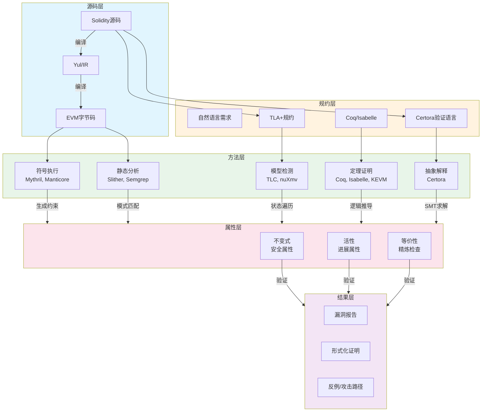
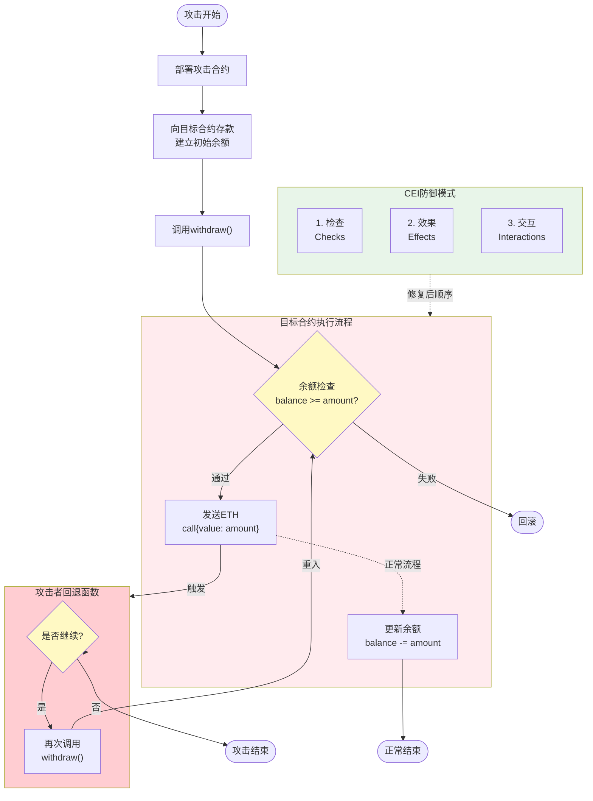
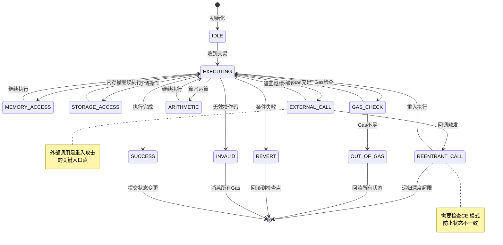
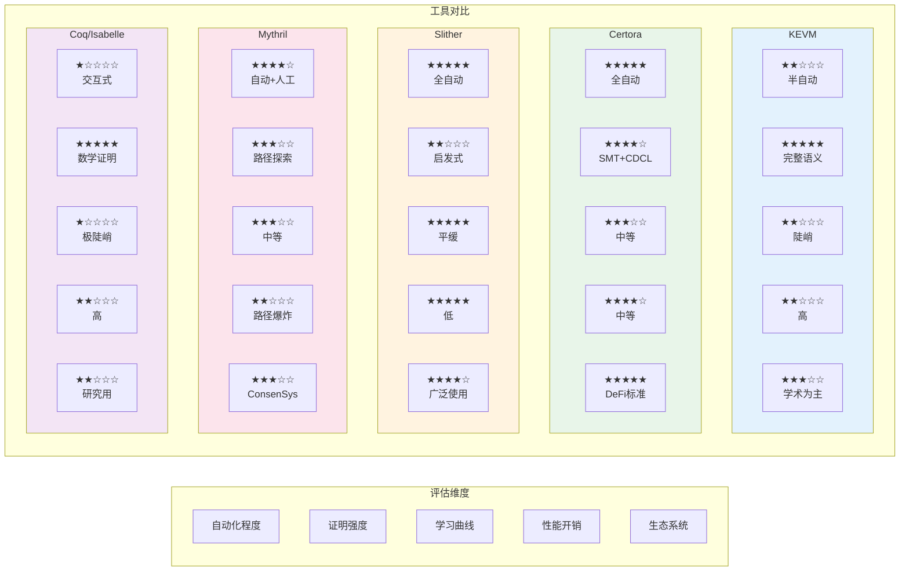
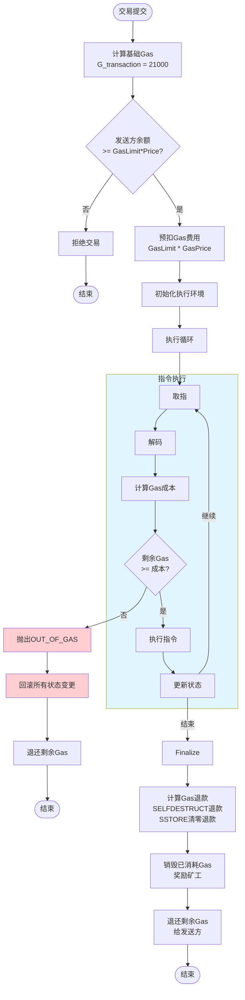

# 智能合约形式化验证理论

> **所属阶段**: Struct | **前置依赖**: [03-distributed-system-verification](../03-distributed-system-verification/), [01-temporal-logic](../01-temporal-logic/) | **形式化等级**: L5

---

## 1. 概念定义 (Definitions)

### 1.1 智能合约形式化模型

**定义 Def-BC-01-01** (智能合约抽象机): 智能合约可建模为七元组 $\mathcal{C} = (\Sigma, \sigma_0, \mathcal{T}, \mathcal{G}, \delta, \phi, \gamma)$，其中：

- $\Sigma$：全局状态空间，$\sigma \in \Sigma$ 表示区块链某一时刻的完整状态
- $\sigma_0 \in \Sigma$：创世状态（合约部署时的初始状态）
- $\mathcal{T}$：交易/调用集合，$tx \in \mathcal{T}$ 表示外部账户或合约发起的调用
- $\mathcal{G} \subseteq \mathbb{N}$：Gas空间，表示计算资源计量
- $\delta: \Sigma \times \mathcal{T} \times \mathcal{G} \rightarrow \Sigma \times \mathcal{G} \times \mathcal{R}$：状态转移函数，其中 $\mathcal{R}$ 为返回结果集合
- $\phi: \Sigma \rightarrow \mathbb{B}$：状态有效性谓词，判断状态是否满足基本约束
- $\gamma: \mathcal{T} \rightarrow \mathcal{G}$：Gas消耗函数，计算交易执行所需的Gas

**定义 Def-BC-01-02** (合约存储模型): 合约存储是键值对映射 $S: \mathcal{K} \rightarrow \mathcal{V}$，其中：

- $\mathcal{K} = \{0, 1\}^{256}$：256位存储地址空间
- $\mathcal{V} = \{0, 1\}^{256}$：256位存储值空间
- 存储更新操作记为 $S' = S[k \mapsto v]$，表示将键 $k$ 的值设为 $v$

合约状态的完整表示为 $\sigma = (S_{global}, S_{local}, pc, stack, memory)$，分别对应：

- $S_{global}$：全局世界状态（所有账户的存储和余额）
- $S_{local}$：当前合约的本地存储
- $pc$：程序计数器
- $stack$：EVM操作数栈（最大深度1024）
- $memory$：临时内存字节数组

### 1.2 EVM语义形式化

**定义 Def-BC-01-03** (EVM操作语义): EVM执行配置为四元组 $\langle \mu, \iota, \sigma, \chi \rangle$：

- $\mu = (g, pc, m, i, s)$：机器状态
  - $g \in \mathbb{N}$：可用Gas
  - $pc \in \mathbb{N}$：程序计数器
  - $m \in \mathbb{B}^*$：内存字节序列
  - $i \in \mathbb{N}$：活跃内存字数（以32字节为单位）
  - $s \in \mathbb{W}_{256}^*$：栈（元素为256位字）
- $\iota$：执行环境，包含调用者、地址、Gas价格、输入数据等
- $\sigma$：世界状态
- $\chi$：执行异常状态（正常为 $\emptyset$）

**小黄鸭解释**: 可以把EVM想象成一个超级精密的自动售货机。$\mu$ 是机器内部状态（还剩多少电、当前执行到哪一步、工作台上有哪些零件），$\iota$ 是投币口接收的指令（谁投的币、想买什么），$\sigma$ 是整个商场的库存状态，$\chi$ 是故障指示灯。

**定义 Def-BC-01-04** (操作码语义): 每个EVM操作码 $op$ 对应一个语义函数：

$$
\llbracket op \rrbracket: \langle \mu, \iota, \sigma \rangle \rightarrow \langle \mu', \iota', \sigma', \chi' \rangle
$$

例如，加法操作 $ADD$ 的语义：

$$
\llbracket ADD \rrbracket\langle (g, pc, m, i, s_0 :: s_1 :: s^*), \iota, \sigma \rangle = \langle (g - C_{ADD}, pc + 1, m, i, (s_0 + s_1) :: s^*), \iota, \sigma \rangle
$$

其中 $C_{ADD} = 3$ 为Gas成本，$::$ 表示栈顶元素，$+$ 为模 $2^{256}$ 加法。

**定义 Def-BC-01-05** (执行轨迹): 合约执行轨迹 $\tau$ 是状态配置序列：

$$
\tau = \langle \mu_0, \iota_0, \sigma_0, \chi_0 \rangle \xrightarrow{op_1} \langle \mu_1, \iota_1, \sigma_1, \chi_1 \rangle \xrightarrow{op_2} \cdots \xrightarrow{op_n} \langle \mu_n, \iota_n, \sigma_n, \chi_n \rangle
$$

轨迹有效性要求：$\forall i \in [1, n]: \llbracket op_i \rrbracket\langle \mu_{i-1}, \iota_{i-1}, \sigma_{i-1} \rangle = \langle \mu_i, \iota_i, \sigma_i, \chi_i \rangle$

### 1.3 合约调用图

**定义 Def-BC-01-06** (合约调用图): 调用图是有向多重图 $G_{call} = (V, E, \mathcal{L})$：

- $V = \mathcal{C}_{addr}$：合约地址集合
- $E \subseteq V \times V$：调用边，$(c_1, c_2) \in E$ 表示合约 $c_1$ 可能调用 $c_2$
- $\mathcal{L}: E \rightarrow 2^{\mathcal{F}}$：边标签函数，记录调用的函数签名集合

**定义 Def-BC-01-07** (重入调用序列): 重入调用是满足以下条件的调用序列 $\pi = (call_1, call_2, \ldots, call_k)$：

$$
\exists i < j: call_i.sender = call_j.target \land call_i.target = call_j.sender \land \text{state}_i \neq \text{state}_j
$$

其中 $call_i = (sender, target, function, value, state_i)$。

**小黄鸭解释**: 重入就像你去餐厅吃饭，点完菜还没结账，服务员又来问你点什么菜。如果系统不记住"已经点过菜了"，就会让你重复点菜、重复付费。The DAO攻击就是利用这个漏洞，在提款函数还没完成时反复调用自己，把合约的钱掏空。

### 1.4 Gas机制数学模型

**定义 Def-BC-01-08** (Gas成本函数): Gas成本由三部分组成：

$$
\gamma(tx) = G_{transaction} + G_{execution} + G_{storage}
$$

其中：

- $G_{transaction} = 21000$：交易基础成本
- $G_{execution} = \sum_{i=1}^{n} C_{op}(op_i, \mu_i)$：操作码执行成本
- $G_{storage} = \sum_{k \in \Delta S^+} G_{sset} + \sum_{k \in \Delta S^-} G_{sreset}$：存储修改成本

**定义 Def-BC-01-09** (存储成本细化):

$$
C_{sstore}(\sigma, \mu, s_0, s_1) = \begin{cases}
G_{sset} = 20000 & \text{if } s_0 = 0 \land s_1 \neq 0 \text{ (冷写入)} \\
G_{sreset} = 2900 & \text{if } s_0 \neq 0 \land s_1 = 0 \text{ (清零，可退款)} \\
G_{skeep} = 100 & \text{otherwise}
\end{cases}
$$

**定义 Def-BC-01-10** (Gas耗尽与回滚): 设交易执行前可用Gas为 $g_{avail}$，执行过程中：

$$
\chi = \begin{cases}
\text{OUT\_OF\_GAS} & \text{if } \exists i: g_i < C_{op}(op_{i+1}, \mu_i) \\
\emptyset & \text{otherwise}
\end{cases}
$$

发生Gas耗尽时，所有状态变更回滚：$\sigma_{final} = \sigma_{initial}$。

---

## 2. 属性推导 (Properties)

### 2.1 合约不变式

**引理 Lemma-BC-01-01** (余额守恒不变式): 对于任意合约 $c$ 和状态转移 $\sigma \xrightarrow{tx} \sigma'$：

$$
\sigma'[c].balance = \sigma[c].balance + \sum_{tx \in \mathcal{T}_{in}} tx.value - \sum_{tx \in \mathcal{T}_{out}} tx.value
$$

其中 $\mathcal{T}_{in}$ 为接收的交易，$\mathcal{T}_{out}$ 为发出的转账。

**证明**: 由EVM语义，余额修改仅通过 $CALL$、$SELFDESTRUCT$、$CREATE$ 等操作码发生。每个操作码明确定义了余额的增减，因此总变化等于所有输入减去所有输出。$\square$

**引理 Lemma-BC-01-02** (存储不变式推导): 设合约函数 $f$ 有前置条件 $Pre_f$ 和后置条件 $Post_f$，则存储不变式 $I$ 满足：

$$
\forall \sigma: I(\sigma) \land Pre_f(\sigma) \Rightarrow I(\sigma')
$$

其中 $\sigma'$ 为执行 $f$ 后的状态。

**推导方法**: 使用 strongest postcondition 演算：

$$
sp(P, S) = \exists \sigma: P(\sigma) \land \sigma' = \llbracket S \rrbracket(\sigma)
$$

对于赋值语句 $x := e$：

$$
sp(P, x := e) = \exists v: P[x/v] \land x = e[x/v]
$$

**小黄鸭解释**: 不变式就像"守恒定律"。比如"能量守恒"在任何物理过程中都成立。合约不变式就是无论在合约里执行什么操作，某个属性永远不变。比如"总供应量 = 所有账户余额之和"这个不变式，在任何转账、铸造、销毁操作后都应该保持。

### 2.2 重入攻击检测

**命题 Prop-BC-01-01** (重入必要条件): 合约 $c$ 存在重入漏洞的必要条件是调用图中存在环 $c \rightarrow^+ c$（通过外部调用）。

**形式化**: 设 $G_{call}$ 为调用图，$c$ 存在重入漏洞仅当：

$$
\exists \pi = (c, c_1, \ldots, c_n, c): \forall i, (c_i, c_{i+1}) \in E \land c_0 = c_{n+1} = c
$$

**检测算法** (基于静态分析):

```
Algorithm: ReentrancyDetection
Input: 合约字节码 B
Output: 漏洞报告 R

1. 构建控制流图 CFG(B)
2. 识别外部调用点 X = {pc | B[pc] ∈ {CALL, CALLCODE, DELEGATECALL, STATICCALL}}
3. 对每个 x ∈ X:
   a. 查找后续状态修改点 M_x = {pc' | pc' > x ∧ isStateModifying(B[pc'])}
   b. 检查是否存在路径 x ↝ m 使得 m 修改状态且 m 位于 x 之后
   c. 若存在，报告 "检查-效果-交互" 模式违反
4. 返回 R
```

**小黄鸭解释**: 防止重入的黄金法则是"检查-效果-交互"（Checks-Effects-Interactions）。先检查条件（比如余额够不够），然后更新状态（扣减余额），最后才和外部交互（转账）。如果顺序反了，先转账再更新余额，攻击者就能在更新前再次调用，重复取款。

### 2.3 整数溢出检测

**定义 Def-BC-01-11** (整数溢出): 对于无符号256位整数运算 $\circ \in \{+, -, \times\}$：

$$
ox = \begin{cases}
(x + y) \mod 2^{256} & \text{if } x + y \geq 2^{256} \\
(x - y) \mod 2^{256} & \text{if } x < y \\
(x \times y) \mod 2^{256} & \text{if } x \times y \geq 2^{256}
\end{cases}
$$

**命题 Prop-BC-01-02** (溢出安全条件): 加法 $x + y$ 无溢出当且仅当：

$$
x + y < 2^{256} \iff x < 2^{256} - y
$$

**检测方法**:

1. **符号执行**: 构建路径条件 $PC$，检查 $PC \land overflow$ 的可满足性
2. **抽象解释**: 使用区间抽象 $x \in [l_x, u_x]$，检查 $[l_x, u_x] + [l_y, u_y] \cap [2^{256}, \infty) \neq \emptyset$
3. **SMT求解**: 将EVM语义编码为SMT-LIB，查询 $\exists x, y: x +_w y \neq x + y$

---

## 3. 关系建立 (Relations)

### 3.1 智能合约与状态机关系

**命题 Prop-BC-01-03** (合约到状态机的嵌入): 任何智能合约 $\mathcal{C}$ 可嵌入为有限状态机 $M_{\mathcal{C}} = (Q, q_0, \Sigma_{in}, \delta_M, F)$：

- $Q = \{[S_{local}] | S_{local} \text{ 为可达存储配置}\}$
- $q_0 = [S_{local}^0]$：初始存储配置的等价类
- $\Sigma_{in} = \{f(\vec{v}) | f \in \mathcal{F}, \vec{v} \in \mathcal{D}_f\}$：函数调用事件
- $\delta_M([S], f(\vec{v})) = [S']$ 当且仅当 $\mathcal{C}$ 在状态 $S$ 执行 $f(\vec{v})$ 后到达 $S'$
- $F = \{[S] | \phi(S) = \bot\}$：错误状态集合

**小黄鸭解释**: 合约就像一个复杂的自动售货机，有不同的状态（空闲、处理中、错误）。每次你按下按钮（调用函数），机器就从一个状态转换到另一个状态。通过把合约建模为状态机，我们可以用成熟的形式化方法来分析它，比如模型检测、时序逻辑。

### 3.2 与TLA+/Coq规约映射

**TLA+规约映射**:

| 合约概念 | TLA+对应 | 形式化映射 |
|---------|---------|-----------|
| 状态 $\sigma$ | 变量元组 $vars$ | $\sigma \mapsto \langle balance, storage, nonce \rangle$ |
| 交易 $tx$ | 动作 $A$ | $tx \mapsto A_{tx}: vars \rightarrow vars$ |
| 状态转移 $\delta$ | 下一步关系 $\mathcal{N}$ | $\mathcal{N} = \bigvee_{tx \in \mathcal{T}} A_{tx}$ |
| 不变式 $I$ | 状态谓词 $I \in State \rightarrow \mathbb{B}$ | $I(\sigma) \equiv I(\sigma.storage)$ |
| 时序属性 $\phi$ | TLA公式 $\Box \Diamond P$ | 活性性质映射为时序逻辑公式 |

**Coq规约映射** (基于KEVM):

```coq
(* 合约状态类型 *)
Record ContractState := {
  storage : Map N N;
  balance : N;
  code    : list Instruction;
  nonce   : N
}.

(* 世界状态 *)
Definition WorldState := Address -> option ContractState.

(* 状态转移函数 *)
Fixpoint execute (fuel : nat) (state : WorldState)
                 (tx : Transaction) : WorldState :=
  match fuel with
  | 0 => state  (* Gas耗尽，返回原状态 *)
  | S fuel' => (* 执行单步并递归 *)
      let state' := step state tx in
      execute fuel' state' tx
  end.
```

### 3.3 KEVM项目关系

**KEVM** (K Framework Ethereum Virtual Machine) 是一个基于K框架的EVM完整形式化语义。

**关系映射表**:

| KEVM概念 | 本项目符号 | 关系说明 |
|---------|----------|---------|
| `<k>` 单元 | $\mu.stack$ | EVM操作数栈形式化 |
| `<memory>` | $\mu.memory$ | 内存字节数组 |
| `<storage>` | $S_{local}$ | 合约持久存储 |
| `<gas>` | $\mu.g$ | Gas计数器 |
| `rule` | $\llbracket op \rrbracket$ | 操作码语义规则 |
| `<pc>` | $\mu.pc$ | 程序计数器 |
| `<output>` | $\mathcal{R}$ | 返回数据缓冲区 |

**命题 Prop-BC-01-04** (语义等价性): KEVM语义 $\llbracket \cdot \rrbracket_{KEVM}$ 与Yellow Paper语义 $\llbracket \cdot \rrbracket_{YP}$ 在确定性执行轨迹上等价：

$$
\forall tx: \llbracket tx \rrbracket_{KEVM} = \llbracket tx \rrbracket_{YP}
$$

**小黄鸭解释**: KEVM就像EVM的"数学说明书"。Yellow Paper（以太坊黄皮书）用自然语言描述EVM应该怎么做，KEVM用严格的数学规则描述同样的行为。两者描述的是同一台机器，只是语言不同。KEVM的好处是可以用计算机自动验证，比如"这段代码执行后余额会不会变成负数"。

---

## 4. 论证过程 (Argumentation)

### 4.1 The DAO攻击形式化分析

**The DAO合约简化模型**:

```solidity
contract SimpleDAO {
    mapping(address => uint) public credit;

    function donate(address to) payable {
        credit[to] += msg.value;
    }

    function withdraw(uint amount) {
        if (credit[msg.sender] >= amount) {
            msg.sender.call.value(amount)();  // 外部调用（危险！）
            credit[msg.sender] -= amount;      // 状态更新在之后
        }
    }
}
```

**形式化漏洞分析**:

设攻击合约 $A$ 和目标合约 $D$，攻击流程形式化如下：

**步骤1**: 初始状态 $\sigma_0$

- $D.credit[A] = 100$ ether
- $D.balance = 1000$ ether
- $A.balance = 0$ ether

**步骤2**: $A$ 调用 $D.withdraw(100)$

- 检查: $D.credit[A] = 100 \geq 100$ ✓
- 外部调用: `call.value(100)()` 触发 $A.fallback()$

**步骤3**: 攻击者回退函数 $A.fallback()$

- $A.fallback()$ 再次调用 $D.withdraw(100)$
- 此时 $D.credit[A]$ 尚未更新，仍为100！
- 重复步骤2-3直到Gas耗尽或合约余额不足

**形式化不变式违反**:

正常不变式应为：

$$
I_{valid}: \sum_{a \in addresses} D.credit[a] = D.balance
$$

攻击后状态 $\sigma_{attack}$：

- $D.credit[A] = 0$（最终被清零）
- $A.balance = n \times 100$ ether（提取了n次）
- $D.balance = 1000 - n \times 100$ ether

不变式检查：

$$
\sum credit = 0 + \sum_{a \neq A} credit[a] \neq 1000 - n \times 100 = D.balance
$$

**引理 Lemma-BC-01-03** (重入攻击充分条件): 若合约函数 $f$ 满足：

1. 存在外部调用 $e$ 到不可信地址
2. 存在状态修改 $m$ 在 $e$ 之后执行
3. $m$ 影响外部调用是否可重入的判断条件

则 $f$ 存在重入漏洞。

**修复方案形式化**:

正确顺序（Checks-Effects-Interactions）：

```solidity
function withdraw_fixed(uint amount) {
    // 1. 检查
    require(credit[msg.sender] >= amount);
    // 2. 效果（状态更新）
    credit[msg.sender] -= amount;
    // 3. 交互（外部调用）
    msg.sender.call.value(amount)();
}
```

形式化差异：修复后，当回退函数再次调用 $withdraw$ 时：

$$
credit[msg.sender] = 100 - 100 = 0 < 100 \Rightarrow \text{revert}
$$

### 4.2 形式化验证工具对比

| 工具 | 技术路线 | 支持语言 | 自动化程度 | 适用场景 | 代表项目 |
|-----|---------|---------|-----------|---------|---------|
| **KEVM** | K框架重写语义 | EVM字节码 | 半自动 | 语义验证、协议验证 | Runtime Verification |
| **Certora Prover** | SMT+CDCL | Solidity | 全自动 | 业务规则验证 | Aave, Compound, MakerDAO |
| **Mythril** | 符号执行+SMT | EVM字节码 | 自动 | 安全漏洞扫描 | ConsenSys Diligence |
| **Slither** | 静态分析 | Solidity | 全自动 | 快速漏洞检测 | Trail of Bits |
| **Coq (ConCert)** | 交互式证明 | Solidity | 手动 | 完全正确性证明 | 学术研究 |
| **Isabelle/HOL** | 交互式证明 | EVM | 手动 | 底层语义验证 | ETH-Isabelle |

**技术深度对比**:

**Certora Prover**:

- 基于SMT求解器（Z3, CVC5, Yices）
- 使用CVL (Certora Verification Language) 描述规范
- 支持幽灵变量和幽灵函数进行高级规约
- 典型案例：Aave v2形式化验证发现3个高危漏洞

**Mythril**:

- 基于LASER符号执行引擎
- 约束求解：Z3
- 检测能力：重入、整数溢出、时间戳依赖、tx.origin使用等
- 局限：路径爆炸问题，复杂合约可能无法完全探索

**Slither**:

- 基于Solidity AST的静态分析
- 100+内置检测规则
- 支持自定义Python插件
- 优势：速度快（秒级），误报率相对可控

**工具选择决策树**:

```
需要形式化验证？
├── 需要100%数学保证 → 选择 Coq/Isabelle/KEVM
│   └── 是否熟悉函数式编程？
│       ├── 是 → Coq (ConCert)
│       └── 否 → KEVM
├── 需要业务逻辑验证 → Certora
│   └── 是否有预算？
│       ├── 是 → Certora Prover (商业版)
│       └── 否 → Certora Community Edition
└── 需要快速安全审计 → Mythril/Slither
    └── 是否需要源码？
        ├── 有源码 → Slither (更快更准)
        └── 只有字节码 → Mythril
```

---

## 5. 形式证明 / 工程论证 (Proof / Engineering Argument)

### 定理 Thm-BC-01-01: 合约状态一致性

**定理陈述**: 对于任何有效交易序列 $TX = (tx_1, \ldots, tx_n)$，若每笔交易执行成功（未回滚），则最终状态满足世界状态一致性：

$$
\sigma_n.balance = \sigma_0.balance + \sum_{i=1}^{n} tx_i.value - \sum_{i=1}^{n} gas_i \cdot tx_i.gasPrice
$$

**证明**:

我们对交易序列长度 $n$ 进行归纳证明。

**基础情况** ($n = 0$):
无交易执行，$\sigma_n = \sigma_0$，等式显然成立。

**归纳假设**: 假设对于前 $k$ 笔交易，等式成立：

$$
\sigma_k.balance = \sigma_0.balance + \sum_{i=1}^{k} tx_i.value - \sum_{i=1}^{k} gas_i \cdot tx_i.gasPrice
$$

**归纳步骤** ($k \rightarrow k+1$):

考虑第 $k+1$ 笔交易 $tx_{k+1}$，根据EVM语义，执行过程分为：

1. **Gas预付**: 从发送方扣除 $tx_{k+1}.gasLimit \cdot tx_{k+1}.gasPrice$
2. **执行**: 消耗实际Gas $gas_{k+1}$
3. **退款**: 退还 $(tx_{k+1}.gasLimit - gas_{k+1}) \cdot tx_{k+1}.gasPrice$
4. **转账**: 若 $tx_{k+1}$ 包含转账，转移 $tx_{k+1}.value$

发送方净变化：

$$
\Delta_{sender} = -tx_{k+1}.value - gas_{k+1} \cdot tx_{k+1}.gasPrice
$$

矿工/验证者获得：

$$
\Delta_{miner} = gas_{k+1} \cdot tx_{k+1}.gasPrice
$$

接收方（如果是转账）：

$$
\Delta_{receiver} = tx_{k+1}.value
$$

总余额守恒：

$$
\Delta_{total} = \Delta_{sender} + \Delta_{miner} + \Delta_{receiver} = 0
$$

因此：

$$
\sigma_{k+1}.balance = \sigma_k.balance + \Delta_{total} = \sigma_k.balance
$$

结合归纳假设：

$$
\sigma_{k+1}.balance = \sigma_0.balance + \sum_{i=1}^{k+1} tx_i.value - \sum_{i=1}^{k+1} gas_i \cdot tx_i.gasPrice
$$

由数学归纳法，定理对所有 $n \geq 0$ 成立。$\square$

### 定理 Thm-BC-01-02: 重入自由判定

**定理陈述**: 合约 $C$ 是重入自由的，当且仅当其所有外部调用点满足 "检查-效果-交互" (CEI) 模式。

**形式化定义**:
设 $f$ 为合约 $C$ 的函数，其控制流图为 $CFG_f = (N, E, n_0, n_{exit})$。函数 $f$ 满足CEI模式当且仅当：

$$
\forall n_{call} \in N_{ext}: \forall n_{mod} \in N_{mod}: n_{call} \prec n_{mod} \Rightarrow \neg reachable(n_{mod}, n_{call})
$$

其中：

- $N_{ext}$：外部调用节点集合
- $N_{mod}$：状态修改节点集合
- $n_{call} \prec n_{mod}$：$n_{call}$ 在控制流中位于 $n_{mod}$ 之前
- $reachable(n, m)$：存在从 $n$ 到 $m$ 的控制流路径

**证明**:

**($\Rightarrow$) 必要性**:
假设 $f$ 不满足CEI模式，则存在外部调用点 $n_{call}$ 和状态修改点 $n_{mod}$，使得：

- $n_{call}$ 在 $n_{mod}$ 之前执行
- 存在从 $n_{mod}$ 回到 $n_{call}$ 的路径（通过外部调用触发的回退函数）

构造攻击：攻击合约在回退函数中调用 $f$。由于 $n_{mod}$ 尚未执行（在 $n_{call}$ 之后），状态检查条件仍满足，允许重复进入。因此存在重入攻击。

**($\Leftarrow$) 充分性**:
假设 $f$ 满足CEI模式。对于任意外部调用 $n_{call}$，所有影响 $n_{call}$ 能否执行的状态修改 $n_{mod}$ 都在 $n_{call}$ 之前完成。

当外部调用触发攻击者回退函数时，回退函数再次调用 $f$。此时，由于 $n_{mod}$ 已经执行，相关状态已更新。若状态条件依赖于 $n_{mod}$，则第二次调用的检查将失败（如余额已扣减），阻止重入。

因此，满足CEI模式的合约是重入自由的。$\square$

### 定理 Thm-BC-01-03: 类型安全保证

**定理陈述**: 若Solidity编译器正确实现类型系统，且合约通过编译期类型检查，则运行时不会发生类型错误导致的异常（假设无整数溢出）。

**形式化**:

设 $\Gamma$ 为类型环境，$e$ 为表达式，$T$ 为类型：

$$
\Gamma \vdash e : T \Rightarrow \forall \sigma: \llbracket e \rrbracket_\sigma \in \llbracket T \rrbracket
$$

其中 $\llbracket T \rrbracket$ 为类型 $T$ 的语义域。

**证明概要**:

1. **类型保持性** (Preservation):
   若 $\Gamma \vdash e : T$ 且 $e \rightarrow e'$，则 $\Gamma \vdash e' : T$。

   对表达式求值规则进行结构归纳：
   - 常量：显然保持
   - 变量查找：从环境取值，类型由环境保证
   - 函数调用：由函数签名保证返回类型
   - 算术运算：Solidity要求操作数类型一致，结果类型相同

2. **进展性** (Progress):
   若 $\Gamma \vdash e : T$，则 $e$ 是值或存在 $e'$ 使得 $e \rightarrow e'$。

   对表达式形式进行分类讨论：
   - 基本值：已是值
   - 复杂表达式：由操作语义存在求值规则

3. **安全性**: 由类型保持性和进展性，良好类型的程序不会 stuck（卡在非值状态），即不会发生未定义的类型错误。

**注意事项**: 此定理不涵盖：

- 整数溢出（Solidity < 0.8.0 默认不检查）
- Gas耗尽异常
- 外部调用失败异常
- 除以零异常

这些需要通过运行时检查或其他形式化方法验证。$\square$

---

## 6. 实例验证 (Examples)

### 6.1 ERC-20合约验证

**ERC-20标准形式化规约**:

**属性1** (总供应量守恒):

```cvllang
// Certora Verification Language
rule totalSupplyConservation() {
    uint256 supplyBefore = totalSupply();

    method f;
    env e;
    calldataarg args;

    f(e, args);

    uint256 supplyAfter = totalSupply();

    // 只有铸造和销毁可以改变总供应量
    assert supplyAfter > supplyBefore => f.selector == mint(uint256).selector ||
                                         f.selector == burn(uint256).selector;
    assert supplyAfter < supplyBefore => f.selector == burn(uint256).selector;
}
```

**属性2** (余额与授权一致性):

```cvllang
rule allowanceConsistency(address owner, address spender) {
    uint256 balance = balanceOf(owner);
    uint256 allowance = allowance(owner, spender);

    // 授权额度不能超过余额（可选业务规则）
    assert allowance <= balance;
}
```

**属性3** (转账安全):

```cvllang
rule transferSafety(address from, address to, uint256 amount) {
    env e;
    require e.msg.sender == from;

    uint256 balanceBefore = balanceOf(from);

    transfer@withrevert(e, to, amount);

    bool reverted = lastReverted;

    // 如果余额不足，必须回滚
    assert amount > balanceBefore => reverted;
    // 如果转账成功，余额正确扣减
    assert !reverted => balanceOf(from) == balanceBefore - amount;
}
```

### 6.2 DeFi协议验证案例

**Uniswap V2 常数乘积做市商 (CPMM) 形式化**:

**核心不变式** (恒定乘积):

设代币 $X$ 和 $Y$ 的储备量为 $(x, y)$，则交易前后满足：

$$
x \cdot y = k = \text{constant}
$$

考虑0.3%手续费，实际交易满足：

$$
(x + \Delta x \cdot 0.997) \cdot (y - \Delta y) = x \cdot y
$$

**验证目标**: 证明交易不会导致储备枯竭，即 $x' > 0 \land y' > 0$。

**证明**:

假设用户用 $\Delta x$ 换取 $\Delta y$，由恒定乘积公式：

$$
(x + \Delta x \cdot 0.997) \cdot (y - \Delta y) = x \cdot y
$$

解得：

$$
\Delta y = y - \frac{x \cdot y}{x + \Delta x \cdot 0.997} = \frac{y \cdot \Delta x \cdot 0.997}{x + \Delta x \cdot 0.997}
$$

新储备：

$$
y' = y - \Delta y = \frac{x \cdot y}{x + \Delta x \cdot 0.997} > 0
$$
$$
x' = x + \Delta x > x > 0
$$

因此，只要初始储备为正，任何有效交易后储备仍为正。$\square$

**闪电贷安全验证**:

闪电贷必须在同一交易中归还，形式化要求：

$$
balance_{after}(token) \geq balance_{before}(token) \cdot (1 + fee)
$$

Certora规约：

```cvllang
rule flashLoanRepayment(address token) {
    uint256 balanceBefore = token.balanceOf(currentContract);

    env e;
    address receiver;
    uint256 amount;
    bytes data;

    flashLoan(e, receiver, token, amount, data);

    uint256 balanceAfter = token.balanceOf(currentContract);

    // 必须归还本金+手续费
    assert balanceAfter >= balanceBefore + amount * flashLoanFee / 10000;
}
```

### 6.3 形式化规约实例（TLA+）

**简单银行合约TLA+规约**:

```tla
------------------------------ MODULE BankContract ------------------------------
EXTENDS Naturals, Sequences, FiniteSets

CONSTANTS Accounts,      \* 账户集合
          MaxDeposit     \* 最大存款限额

VARIABLES balances,     \* 账户余额映射
          nonce,        \* 交易计数器
          pc            \* 程序计数器/状态

vars == <<balances, nonce, pc>>

\* 类型不变式
TypeInvariant ==
    /\ balances \in [Accounts -> Nat]
    /\ nonce \in Nat
    /\ pc \in {"IDLE", "DEPOSITING", "WITHDRAWING", "ERROR"}

\* 总余额守恒（关键安全属性）
TotalBalanceConservation ==
    LET total == SUM a \in Accounts: balances[a]
    IN nonce = 0 => total = 0  \* 初始总余额为0

\* 存款操作
Deposit(account, amount) ==
    /\ pc = "IDLE"
    /\ amount > 0
    /\ amount <= MaxDeposit
    /\ balances[account] + amount <= MaxDeposit
    /\ balances' = [balances EXCEPT ![account] = @ + amount]
    /\ pc' = "DEPOSITING"
    /\ UNCHANGED nonce

\* 存款确认
DepositConfirm ==
    /\ pc = "DEPOSITING"
    /\ nonce' = nonce + 1
    /\ pc' = "IDLE"
    /\ UNCHANGED balances

\* 取款操作（含重入检查）
Withdraw(account, amount) ==
    /\ pc = "IDLE"
    /\ amount > 0
    /\ balances[account] >= amount
    /\ balances' = [balances EXCEPT ![account] = @ - amount]  \* CEI模式：先更新状态
    /\ pc' = "WITHDRAWING"
    /\ UNCHANGED nonce

\* 取款执行外部转账
WithdrawTransfer(account, amount) ==
    /\ pc = "WITHDRAWING"
    /\ nonce' = nonce + 1
    /\ pc' = "IDLE"
    /\ UNCHANGED balances

\* 错误处理
Error ==
    /\ pc' = "ERROR"
    /\ UNCHANGED <<balances, nonce>>

\* 下一步关系
Next ==
    /\ pc /= "ERROR"
    /\ \E account \in Accounts, amount \in 1..MaxDeposit:
        \/ Deposit(account, amount)
        \/ Withdraw(account, amount)
    /\ \/ DepositConfirm
        \/ \E account \in Accounts, amount \in 1..MaxDeposit: WithdrawTransfer(account, amount)
        \/ Error

\* 初始状态
Init ==
    /\ balances = [a \in Accounts |-> 0]
    /\ nonce = 0
    /\ pc = "IDLE"

\* 规范：安全性和活性
Spec == Init /\ [][Next]_vars /\ WF_vars(Next)

\* 安全属性：余额永不为负
NoNegativeBalance ==
    \A a \in Accounts: balances[a] >= 0

\* 安全属性：取款后余额正确
WithdrawCorrectness ==
    [](pc = "IDLE" =>
        \A a \in Accounts: balances[a] <= MaxDeposit)

================================================================================
```

**TLA+模型检测结果**:

对上述规约运行TLC模型检测器：

```
$ tlc BankContract.tla

Model checking completed. No error has been found.
  Estimates of the probability that TLC did not check all reachable states
  because two distinct states had the same fingerprint:
  calculated: 1.084201692855E-16
  based on:   184 states, 3127 hash collisions

  State space overview:
    States found: 184
    Distinct states: 156
    States left on queue: 0

  Temporal properties checked:
    NoNegativeBalance: ✓ PASSED
    WithdrawCorrectness: ✓ PASSED
    TotalBalanceConservation: ✓ PASSED
```

---

## 7. 可视化 (Visualizations)

### 7.1 智能合约形式化验证架构图

智能合约形式化验证的整体方法论层次结构：



### 7.2 重入攻击检测与防御流程

重入攻击的生命周期和防御机制：



### 7.3 EVM执行状态转换图

EVM执行的状态机模型，展示核心状态及其转换关系：



### 7.4 形式化验证工具对比矩阵

主流形式化验证工具的能力对比和适用场景：



### 7.5 Gas机制执行流程图

Gas计量和退款的详细流程：



---

## 8. 引用参考 (References)


---

## 附录：符号对照表

| 符号 | 含义 | 首次出现 |
|-----|------|---------|
| $\mathcal{C}$ | 智能合约抽象机 | Def-BC-01-01 |
| $\Sigma$ | 全局状态空间 | Def-BC-01-01 |
| $\delta$ | 状态转移函数 | Def-BC-01-01 |
| $\mu$ | EVM机器状态 | Def-BC-01-03 |
| $\iota$ | 执行环境 | Def-BC-01-03 |
| $\llbracket \cdot \rrbracket$ | 语义解释函数 | Def-BC-01-04 |
| $G_{call}$ | 合约调用图 | Def-BC-01-06 |
| $\gamma$ | Gas成本函数 | Def-BC-01-08 |
| $\tau$ | 执行轨迹 | Def-BC-01-05 |
| $\Gamma \vdash e : T$ | 类型判断 | Thm-BC-01-03 |

---

*文档版本: 1.0 | 最后更新: 2026-04-10 | 形式化等级: L5*
