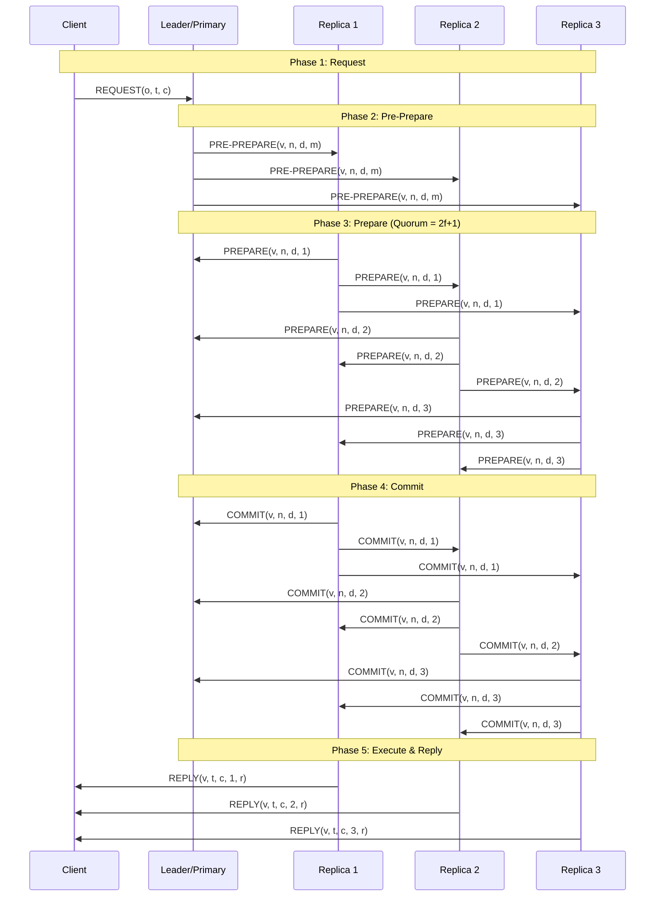
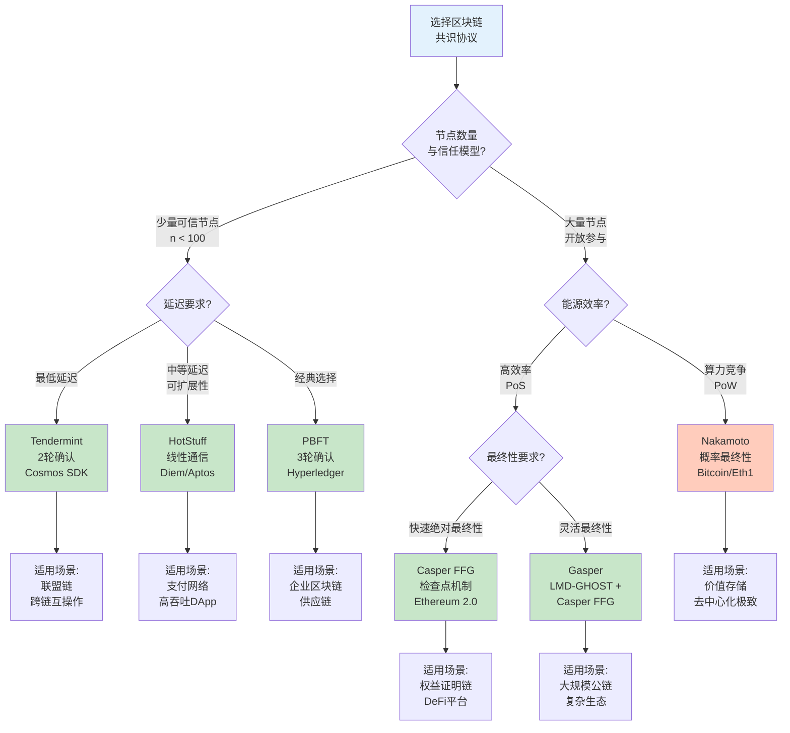
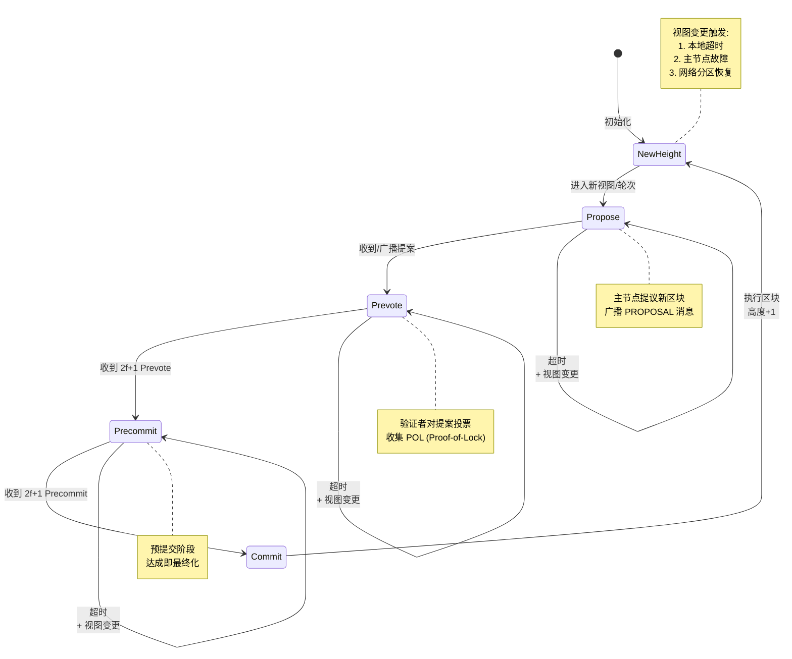
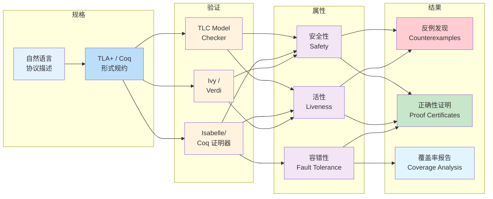

# 区块链共识协议的形式化验证

> 所属阶段: formal-methods/04-application-layer/04-blockchain-verification | 前置依赖: [形式化方法基础](../../01-fundamentals.md), [01-blockchain-formalization/01-distributed-systems-model.md](../01-blockchain-formalization/01-distributed-systems-model.md) | 形式化等级: L5-L6

## 1. 概念定义 (Definitions)

### 1.1 区块链共识概述

区块链共识协议是分布式系统中用于在可能存在拜占庭故障的节点之间达成一致的核心机制。
与传统的分布式共识不同，区块链共识需要处理开放网络环境、动态成员变更和加密货币经济激励等独特挑战。

**定义 4.4.2.1** (区块链共识协议 Blockchain Consensus Protocol)

设 $\mathcal{N} = \{n_1, n_2, \ldots, n_n\}$ 为参与共识的节点集合，$\mathcal{T}$ 为交易集合，$\mathcal{B}$ 为区块集合。区块链共识协议是一个状态机复制协议，定义为五元组：

$$\text{BCP} = (\mathcal{N}, \mathcal{Q}, \Delta, \mathcal{V}, \mathcal{F})$$

其中：

- $\mathcal{N}$：诚实节点集合，$|\mathcal{N}| = n$
- $\mathcal{Q} \subseteq 2^{\mathcal{N}}$：法定集合族（Quorum Sets），满足法定交集性质
- $\Delta: \mathcal{S} \times \mathcal{E} \rightarrow \mathcal{S}$：状态转移函数
- $\mathcal{V}: \mathcal{B} \times \mathcal{N} \rightarrow \{0, 1\}$：区块验证函数
- $\mathcal{F} \subseteq \mathcal{N}$：拜占庭故障节点集合，$| \mathcal{F} | \leq f$

**定义 4.4.2.2** (区块最终性 Block Finality)

区块 $B$ 在时间 $t$ 达到最终性，当且仅当所有诚实节点在 $t$ 之后永远不会撤销对 $B$ 的确认：

$$\text{Finalized}(B, t) \triangleq \forall n \in \mathcal{N} \setminus \mathcal{F}, \forall t' > t: \text{Confirmed}_n(B, t')$$

最终性分为：

- **概率最终性**（Probabilistic）：如 Nakamoto 共识，随着确认块数增加，回滚概率指数下降
- **绝对最终性**（Absolute）：如 BFT 共识，一旦确认不可回滚

**定义 4.4.2.3** (视图 View)

视图 $v$ 是共识协议在特定时间的一个全局配置，包含：

- 主节点（Leader/Proposer）：$L(v) \in \mathcal{N}$
- 超时机制：$\text{Timeout}(v) \in \mathbb{R}^+$
- 消息序列：$\mathcal{M}_v = \langle m_1, m_2, \ldots, m_k \rangle$

视图变更（View Change）发生在当前视图无法推进或检测到主节点故障时。

### 1.2 PBFT (Practical Byzantine Fault Tolerance)

PBFT 是 Castro 和 Liskov 于 1999 年提出的实用拜占庭容错算法，是第一个在异步网络中实现高效 BFT 的协议。

**定义 4.4.2.4** (PBFT 协议状态机)

PBFT 状态机 $\mathcal{M}_{\text{PBFT}} = (S, s_0, \Sigma, \delta)$ 定义如下：

- 状态集合 $S = \{\text{IDLE}, \text{PRE\_PREPARE}, \text{PREPARE}, \text{COMMIT}, \text{REPLY}\}$
- 初始状态 $s_0 = \text{IDLE}$
- 输入字母表 $\Sigma$ 包含：$\text{REQUEST}, \text{PRE\_PREPARE}, \text{PREPARE}, \text{COMMIT}, \text{VIEW\_CHANGE}, \text{NEW\_VIEW}$
- 转移函数 $\delta: S \times \Sigma \rightarrow S$

**PBFT 核心流程**：

$$
\begin{array}{ll}
\textbf{Phase 1 - Request:} & C \xrightarrow{\langle\text{REQUEST}, o, t, c\rangle_{\sigma_c}} L \\
\textbf{Phase 2 - Pre-prepare:} & L \xrightarrow{\langle\text{PRE\_PREPARE}, v, n, d, m\rangle_{\sigma_L}} \text{all replicas} \\
\textbf{Phase 3 - Prepare:} & i \xrightarrow{\langle\text{PREPARE}, v, n, d, i\rangle_{\sigma_i}} \text{all replicas} \\
\textbf{Phase 4 - Commit:} & i \xrightarrow{\langle\text{COMMIT}, v, n, d, i\rangle_{\sigma_i}} \text{all replicas} \\
\textbf{Phase 5 - Reply:} & i \xrightarrow{\langle\text{REPLY}, v, t, c, i, r\rangle_{\sigma_i}} C
\end{array}
$$

其中：

- $o$：操作，$t$：时间戳，$c$：客户端标识
- $v$：视图编号，$n$：序列号，$d$：消息摘要
- $\sigma_x$：节点 $x$ 的数字签名
- $2f+1$：法定人数（Quorum）大小

**定义 4.4.2.5** (Prepared Certificate)

节点 $i$ 进入 Prepared 状态，当且仅当收集到 $2f$ 个有效的 PREPARE 消息（加上自身的 PRE-PREPARE）：

$$\text{Prepared}(m, v, n, i) \triangleq \exists \mathcal{P} \subseteq \mathcal{M}: |\mathcal{P}| \geq 2f \land \forall p \in \mathcal{P}: \text{Valid}(p, v, n, d)$$

**定义 4.4.2.6** (Committed Certificate)

节点 $i$ 进入 Committed 状态，当且仅当收集到 $2f+1$ 个有效的 COMMIT 消息：

$$\text{Committed}(m, v, n, i) \triangleq \exists \mathcal{C} \subseteq \mathcal{M}: |\mathcal{C}| \geq 2f+1 \land \forall c \in \mathcal{C}: \text{Valid}(c, v, n, d)$$

PBFT 的容错阈值：当 $n \geq 3f + 1$ 时，系统可以容忍最多 $f$ 个拜占庭节点。

### 1.3 HotStuff

HotStuff 是由 Yin 等人于 2019 年提出的基于链式结构的 BFT 共识协议，被 Diem（原 Libra）区块链采用。其核心创新是线性视图变更和模块化设计。

**定义 4.4.2.7** (HotStuff 区块树)

HotStuff 维护一个区块树 $\mathcal{T} = (V, E)$，其中：

- 顶点 $V$：区块 $B = (qC_{B.parent}, cmd, sig_B)$
- 边 $E$：父子引用关系
- $qC_{B.parent}$：父区块的 Quorum Certificate（QC）
- $cmd$：待执行的命令批次
- $sig_B$：区块创建者对区块的签名

**定义 4.4.2.8** (Quorum Certificate)

区块 $B$ 的 Quorum Certificate 是 $2f+1$ 个不同副本对区块哈希的签名集合：

$$\text{QC}_B = \{(i, \sigma_i(H(B))) : i \in \mathcal{Q}_B, |\mathcal{Q}_B| \geq 2f+1\}$$

**HotStuff 三阶段流程**：

$$
\begin{array}{ll}
\textbf{Phase 1 - Prepare:} & L \xrightarrow{\text{PREPARE}(B)} \text{replicas} \\
& \text{replicas} \xrightarrow{\text{PREPARE\_VOTE}(H(B))} L \\
\textbf{Phase 2 - Precommit:} & L \xrightarrow{\text{PRECOMMIT}(\text{QC}_{\text{prepare}})} \text{replicas} \\
& \text{replicas} \xrightarrow{\text{PRECOMMIT\_VOTE}(H(B))} L \\
\textbf{Phase 3 - Commit:} & L \xrightarrow{\text{COMMIT}(\text{QC}_{\text{precommit}})} \text{replicas} \\
& \text{replicas} \xrightarrow{\text{COMMIT\_VOTE}(H(B))} L \\
\textbf{Phase 4 - Decide:} & L \xrightarrow{\text{DECIDE}(\text{QC}_{\text{commit}})} \text{replicas}
\end{array}
$$

**定义 4.4.2.9** (Chained HotStuff)

Chained HotStuff 通过流水线优化将三阶段压缩：

- PREPARE 阶段同时作为上一视图的 COMMIT 阶段
- 视图 $v$ 的 PREPARE 消息包含视图 $v-1$ 的 QC
- 形成链式结构：$B_v \rightarrow B_{v-1} \rightarrow B_{v-2} \rightarrow \cdots$

### 1.4 Tendermint

Tendermint 是 Kwon 于 2014 年提出的 BFT 共识引擎，被 Cosmos 生态系统广泛采用。它结合了 DLS 共识算法和区块链数据结构。

**定义 4.4.2.10** (Tendermint 共识状态)

Tendermint 状态机 $\mathcal{M}_{\text{Tendermint}}$ 定义如下状态：

- **NewHeight**：等待进入新高度
- **Propose**：提议者广播提案
- **Prevote**：验证者广播预投票
- **Precommit**：验证者广播预提交
- **Commit**：区块最终确定

**Tendermint 两阶段投票**：

$$
\begin{array}{ll}
\textbf{Round 1 - Propose:} & p \xrightarrow{\text{PROPOSAL}(h, r, B, \text{POL})} \text{validators} \\
\textbf{Round 2 - Prevote:} & v_i \xrightarrow{\text{PREVOTE}(h, r, H(B))} \text{validators} \\
& \text{达成 } |\text{prevotes}| \geq 2f+1 \text{ (POL)} \\
\textbf{Round 3 - Precommit:} & v_i \xrightarrow{\text{PRECOMMIT}(h, r, H(B))} \text{validators} \\
& \text{达成 } |\text{precommits}| \geq 2f+1 \text{ (区块最终化)}
\end{array}
$$

其中：

- $h$：区块高度，$r$：轮次编号
- $B$：提议的区块
- POL（Proof-of-Lock）：锁定证明，防止分叉

**定义 4.4.2.11** (Locking Mechanism)

验证者 $v$ 在高度 $h$、轮次 $r$ 锁定于区块 $B$，当且仅当：

$$\text{Locked}(v, h, B) \triangleq \exists r' < r: \text{ReceivedPOL}(v, h, r', B)$$

锁定规则：

- 若已锁定于 $B$，只能对 $B$ 或更高轮次提议的 $B'$（含 $B$ 作为祖先）投票
- 解锁需要看到 $B$ 被最终化的证明或更高级别的 POL

**定义 4.4.2.12** (Tendermint 轮次超时)

轮次 $r$ 的超时时间呈指数增长：

$$\text{Timeout}(r) = \text{timeout\_base} + \text{timeout\_delta} \times r$$

这种设计允许在网络分区时快速收敛。

### 1.5 Casper FFG (Friendly Finality Gadget)

Casper FFG 是 Buterin 和 Griffith 于 2017 年提出的覆盖层（Overlay）最终性协议，设计用于为 PoW 链提供绝对最终性，也可独立运行。

**定义 4.4.2.13** (Checkpoint 与 Epoch)

Casper FFG 在每 $C$ 个区块处设置检查点：

- Checkpoint：区块 $B$ 满足 $B.\text{height} \equiv 0 \pmod C$
- Epoch：连续的 $C$ 个区块组成的区间
- 检查点高度为 $h$ 表示它是第 $h$ 个检查点

**定义 4.4.2.14** (Validator 与 Deposit)

验证者集合 $\mathcal{V}$ 定义为：

$$\mathcal{V} = \{v_i : \text{Deposit}(v_i) \geq D_{\min}\}$$

其中 Deposit 为质押的权益数量，验证者的投票权重与其质押量成正比。

**定义 4.4.2.15** (Justification 与 Finalization)

设 $c_m$ 和 $c_n$ 为两个检查点，$m < n$：

**Supermajority Link**：从 $c_m$ 到 $c_n$ 的超级多数链接定义为：

$$c_m \xrightarrow{\text{supermajority}} c_n \triangleq \sum_{v \in \mathcal{V}: \text{voted}(v, c_m \rightarrow c_n)} \text{Deposit}(v) \geq \frac{2}{3} \sum_{v \in \mathcal{V}} \text{Deposit}(v)$$

**Justified Checkpoint**：

- 创世检查点 $c_0$ 是 justified 的
- 若存在 $c_m \xrightarrow{\text{supermajority}} c_n$ 且 $c_m$ 是 justified 的，则 $c_n$ 是 justified 的

**Finalized Checkpoint**：

- $c_0$ 是 finalized 的
- 若 $c_m$ 是 finalized 的且存在 $c_m \xrightarrow{\text{supermajority}} c_{m+1}$（直接子检查点），则 $c_m$ 是 finalized 的

**Casper 安全条件**：

- 不可同时最终化两个冲突的检查点
- 若 $c_m$ 和 $c_n$ 都被最终化且 $m < n$，则必须存在从 $c_m$ 到 $c_n$ 的超级多数链接链

**定义 4.4.2.16** (Slashing Conditions)

验证者若违反以下任一条件将被罚没（Slashing）：

1. **NO\_SURROUND**：若验证者对 $c_i \rightarrow c_j$ 和 $c_k \rightarrow c_l$ 投票，则不能同时满足 $i < k \leq j < l$
2. **NO\_DOUBLE\_VOTE**：验证者不能在同一高度对两个不同检查点投票

违反上述条件的证据可被提交到链上，导致违规者的质押被销毁。

## 2. 形式化模型 (Formal Models)

### 2.1 部分同步模型

**定义 4.4.2.17** (部分同步网络 Partial Synchrony)

部分同步模型由 Dwork、Lynch 和 Stockmeyer 于 1988 年提出，介于同步和异步模型之间。

网络定义为二元组 $\mathcal{N}_{\text{partial}} = (\mathcal{G}, \text{GST})$：

- $\mathcal{G}$：全局稳定时间（Global Stabilization Time），未知但有限
- 在 GST 之前：消息延迟无上界
- 在 GST 之后：消息延迟不超过已知上界 $\Delta$

**形式化描述**：

$$\text{Deliver}(m, j, t) \Rightarrow \begin{cases} t - \text{Send}(m, i) < \infty & \text{if } t < \text{GST} \\ t - \text{Send}(m, i) \leq \Delta & \text{if } t \geq \text{GST} \end{cases}$$

**引理 4.4.2.1** (部分同步下的活性)

在部分同步模型中，若诚实节点比例 $> \frac{2}{3}$ 且 GST 有限，则 BFT 共识协议满足：

$$\Diamond \text{Decided} \land \text{After}(\text{Decided}, \text{GST} + O(\Delta))$$

即在 GST 之后的有限时间内必然达成共识决策。

**证明概要**：

1. GST 后消息延迟有界 $\Delta$
2. 诚实节点可在超时前收到法定人数的消息
3. 视图变更在有限时间内完成
4. eventually 所有诚实节点进入同一视图
5. 在该视图中，主节点可推进共识

### 2.2 拜占庭容错模型

**定义 4.4.2.18** (拜占庭故障 Byzantine Fault)

节点 $p$ 发生拜占庭故障，当且仅当其行为偏离协议规范：

$$\text{Byzantine}(p) \triangleq \exists t: \text{Behavior}(p, t) \notin \text{ProtocolSpec}$$

拜占庭节点可以：

- 发送任意消息
- 向不同节点发送不同消息
- 假装故障后恢复
- 与其他拜占庭节点共谋

**定义 4.4.2.19** (拜占庭容错能力)

共识协议 $\Pi$ 具有 $f$ 拜占庭容错能力，记作 $\Pi \in \text{BFT}(f)$，当且仅当：

$$\forall \mathcal{F} \subseteq \mathcal{N}: |\mathcal{F}| \leq f \Rightarrow \Pi \text{ 满足安全性和活性}$$

**定理 4.4.2.1** (BFT 下界 - Lamport et al.)

任何确定性异步拜占庭容错共识协议要求：

$$n \geq 3f + 1$$

**证明**：
假设 $n = 3f$。将节点分为三组 $A, B, C$，每组大小为 $f$。
设 $A$ 和 $B$ 诚实但分区，$C$ 拜占庭。

情形 1：$A$ 决定 0，$B$ 决定 1
情形 2：$A$ 和 $C$ 诚实，$B$ 拜占庭（模拟情形 1）
情形 3：$B$ 和 $C$ 诚实，$A$ 拜占庭（模拟情形 1）

由于异步网络中无法区分情形 2 和情形 3，协议无法同时满足安全性和活性。

因此 $n \geq 3f + 1$ 是必要的。

**定理 4.4.2.2** (PBFT 最优性)

PBFT 协议在部分同步模型中达到最优容错：$f = \lfloor \frac{n-1}{3} \rfloor$

**证明**：

- 安全性：任意两个法定人数交集至少包含一个诚实节点
  $$|\mathcal{Q}_1 \cap \mathcal{Q}_2| \geq (2f+1) + (2f+1) - n = 4f + 2 - (3f+1) = f + 1 \geq 1$$
- 活性：存在至少 $2f+1$ 个诚实节点可形成法定人数

### 2.3 安全性与活性

**定义 4.4.2.20** (共识安全性 Consensus Safety)

共识协议满足安全性，当且仅当不存在两个诚实节点决定不同值：

$$\text{Safe} \triangleq \forall i, j \in \mathcal{N} \setminus \mathcal{F}, \forall t_1, t_2: \text{Decided}_i(v_1, t_1) \land \text{Decided}_j(v_2, t_2) \Rightarrow v_1 = v_2$$

**定义 4.4.2.21** (共识活性 Consensus Liveness)

共识协议满足活性，当且仅当若存在提议值则最终有节点决定：

$$\text{Live} \triangleq \Diamond \exists v \in \mathcal{V}: \text{Proposed}(v) \Rightarrow \Diamond \exists i \in \mathcal{N} \setminus \mathcal{F}: \text{Decided}_i(v)$$

**定理 4.4.2.3** (FLP 不可能性)

在完全异步网络中，即使只有一个良性故障（crash-stop），确定性共识协议无法同时满足安全性和活性。

**推论 4.4.2.1**：区块链共识协议必须至少放松以下条件之一：

1. 完全异步假设（引入部分同步）
2. 确定性（使用随机化）
3. 故障模型（允许概率性安全）

**定义 4.4.2.22** (概率安全性 Probabilistic Safety)

协议满足概率安全性，当且仅当安全性违反的概率随时间指数下降：

$$P[\exists t: \neg\text{Safe}(t)] \leq \epsilon(k) = O(e^{-\lambda k})$$

其中 $k$ 为确认块数，$\lambda > 0$ 为安全参数。

### 2.4 视图变更协议

**定义 4.4.2.23** (视图变更 View Change)

视图变更是将系统从视图 $v$ 转换到 $v+1$ 的协议，发生在：

- 当前视图超时
- 检测到主节点故障
- 网络分区恢复

**定义 4.4.2.24** (视图变更正确性)

视图变更协议是正确的，当且仅当：

1. **有效性**：新视图最终确定
2. **安全性保持**：已决定的值在新视图中保持不变
3. **活性保证**：在有限故障后最终选出新主节点

**PBFT 视图变更**：

$$
\begin{array}{ll}
\textbf{Step 1:} & i \xrightarrow{\langle\text{VIEW\_CHANGE}, v+1, n, C, P, i\rangle} \text{new leader} \\
\textbf{Step 2:} & \text{new leader} \xrightarrow{\langle\text{NEW\_VIEW}, v+1, V, O\rangle} \text{all replicas} \\
\textbf{Step 3:} & \text{replicas validate and enter new view}
\end{array}
$$

其中：

- $C$：已提交的最高序号证书
- $P$：Prepared 证书集合
- $V$：$2f+1$ 个有效的 VIEW\_CHANGE 消息
- $O$：需要重新排序的请求集合

**定理 4.4.2.4** (视图变更安全性)

若视图 $v$ 中区块 $B$ 被决定，则视图 $v' > v$ 中不会决定与 $B$ 冲突的区块 $B'$。

**证明**：

1. $B$ 被决定 $\Rightarrow$ 至少 $2f+1$ 个节点已提交 $B$
2. 视图变更需要收集 $2f+1$ 个 VIEW\_CHANGE
3. 两个集合交集至少包含 $f+1$ 个节点
4. 这些节点将携带 $B$ 的提交证明
5. 新主节点必须在新视图中包含 $B$ 或其后继

**HotStuff 视图变更优化**：

HotStuff 的关键创新是线性视图变更复杂度：

$$\text{VC\_Complexity}_{\text{HotStuff}} = O(n) \text{ messages}$$

对比 PBFT 的二次复杂度：

$$\text{VC\_Complexity}_{\text{PBFT}} = O(n^2) \text{ messages}$$

这是因为 HotStuff 使用 QC 链结构，新主节点只需广播最新的 QC，而无需传输完整的 Prepared 证书集合。

## 3. 协议对比分析 (Comparative Analysis)

### 3.1 复杂度分析

| 协议 | 正常情况通信复杂度 | 视图变更复杂度 | 消息延迟 | 存储复杂度 |
|------|------------------|--------------|---------|----------|
| **PBFT** | $O(n^2)$ | $O(n^2)$ | 3 轮 | $O(n \cdot L)$ |
| **HotStuff** | $O(n)$ | $O(n)$ | 3 轮 | $O(L)$ |
| **Tendermint** | $O(n^2)$ | $O(n^2)$ | 2 轮 | $O(n \cdot L)$ |
| **Casper FFG** | $O(n)$ | - | 1 轮/epoch | $O(L)$ |

其中 $n$ 为节点数，$L$ 为链长度。

**定理 4.4.2.5** (HotStuff 线性复杂度)

在诚实主节点和同步网络条件下，HotStuff 正常情况通信复杂度为 $O(n)$。

**证明**：

1. PREPARE 阶段：Leader 广播到 $n$ 个节点 → $O(n)$
2. PREPARE\_VOTE：节点响应 Leader → $O(n)$
3. PRECOMMIT 阶段：Leader 广播 QC → $O(n)$
4. PRECOMMIT\_VOTE：节点响应 → $O(n)$
5. COMMIT 阶段：Leader 广播 QC → $O(n)$
6. COMMIT\_VOTE：节点响应 → $O(n)$
7. DECIDE：Leader 广播最终 QC → $O(n)$

Leader 处理的签名聚合后广播，总复杂度 $O(n)$。

### 3.2 通信轮次

**定义 4.4.2.25** (通信轮次 Communication Round)

一轮通信定义为所有诚实节点发送和接收消息所需的时间，假设网络延迟上界为 $\Delta$。

| 协议 | 确认轮次 | 最终化轮次 | 端到端延迟 |
|------|---------|-----------|-----------|
| **PBFT** | 3 | 3 | $3\Delta$ |
| **HotStuff** | 3 | 4 | $4\Delta$ |
| **Chained HotStuff** | 1 (流水线) | 3 | $3\Delta$ |
| **Tendermint** | 2 | 2 | $2\Delta$ |
| **Casper FFG** | 1 | 2 (epoch) | $2C \cdot \text{block\_time}$ |

**Tendermint 延迟优势**：

Tendermint 的两阶段设计允许在 Precommit 后立即最终化：

$$\text{Latency}_{\text{Tendermint}} = 2\Delta + \text{block\_processing}$$

相比 PBFT 的 3 轮通信，延迟减少约 33%。

### 3.3 容错阈值

| 协议 | 最小节点数 | 最大容错数 | 容错比例 | 故障模型 |
|------|----------|-----------|---------|---------|
| **PBFT** | $3f+1$ | $f$ | $\frac{1}{3}$ | Byzantine |
| **HotStuff** | $3f+1$ | $f$ | $\frac{1}{3}$ | Byzantine |
| **Tendermint** | $3f+1$ | $f$ | $\frac{1}{3}$ | Byzantine |
| **Casper FFG** | $\frac{2}{3}$ 权益 | $\frac{1}{3}$ 权益 | $\frac{1}{3}$ | Byzantine |
| **Nakamoto** | 不限 | 50% 算力 | $\frac{1}{2}$ | 算力攻击 |

**Casper FFG 权益容错**：

设总质押为 $S$，拜占庭验证者质押为 $S_F$：

$$\text{Safe} \Leftrightarrow S_F < \frac{1}{3}S$$

**定理 4.4.2.6** (权益容错下界)

在任何基于权益的 BFT 协议中，安全阈值不超过诚实权益的 2/3：

$$\text{Byzantine\_Stake} < \frac{S_{\text{honest}}}{2}$$

**证明**：若拜占庭权益 $\geq \frac{S}{3}$，则可形成两个互斥的 2/3 超级多数，导致双重签名攻击。

### 3.4 最终性特性

| 特性 | PBFT | HotStuff | Tendermint | Casper FFG |
|------|------|----------|-----------|-----------|
| **最终性类型** | 绝对 | 绝对 | 绝对 | 绝对 |
| **最终化延迟** | 即时 | 3 轮 | 2 轮 | 1-2 epoch |
| **分叉可能性** | 无 | 无 | 无 | 无（验证后） |
| **审查抵抗** | 弱 | 中等 | 强 | 中等 |
| **活性保证** | 部分同步 | 部分同步 | 部分同步 | 异步 |

**定义 4.4.2.26** (审查抵抗 Censorship Resistance)

协议具有审查抵抗性，当且当没有任何单一节点或少数联盟可以持续阻止特定交易被包含。

**Tendermint 审查抵抗机制**：

1. **提议者轮换**：每轮按确定性算法更换提议者
2. **超时加倍**：轮次超时指数增长，防止单一提议者垄断
3. **零交易区块**：允许空区块推进，避免阻塞

$$\text{Censorship\_Resistant} \Leftarrow \text{Proposer\_Rotation} \land \text{Timeout\_Progression}$$

**Casper FFG 最终性恢复**：

若验证者集合出现活性故障，可通过 **Inactivity Leak** 机制恢复：

$$\text{Deposit}(v, t+1) = \text{Deposit}(v, t) \times (1 - \alpha)^{I(v, t)}$$

其中 $I(v, t)$ 为节点 $v$ 在 $t$ 时刻的不活跃计数，$\alpha$ 为泄露系数。

## 4. 形式化验证 (Formal Verification)

### 4.1 TLA+ 规约

TLA+（Temporal Logic of Actions）是 Lamport 开发的形式化规约语言，广泛用于分布式系统验证。

**PBFT 的 TLA+ 规约框架**：

```tla
------------------------ MODULE PBFT ------------------------

EXTENDS Integers, Sequences, FiniteSets, TLC

CONSTANTS
    Replicas,          \* 副本集合
    MaxView,           \* 最大视图数
    MaxSeq,            \* 最大序列号
    F                  \* 拜占庭故障数

VARIABLES
    view,              \* 每个副本的当前视图
    log,               \* 消息日志
    state,             \* 副本状态
    committed          \* 已提交的请求

\* 类型不变式
TypeInvariant ==
    /\ view \in [Replicas -> 0..MaxView]
    /\ log \in [Replicas -> SUBSET Message]
    /\ state \in [Replicas -> {"idle", "prepared", "committed"}]
    /\ committed \in SUBSET Request

\* 安全性不变式：没有两个不同的请求在同一视图和序列号被提交
Safety ==
    \A r1, r2 \in Replicas, v \in 0..MaxView, n \in 0..MaxSeq:
        (\E req1, req2 \in Request :
            /\ Committed(r1, v, n, req1)
            /\ Committed(r2, v, n, req2))
        => req1 = req2

\* 活性性质：最终所有诚实副本提交某个请求
Liveness ==
    <>(\E req \in Request :
        \A r \in HonestReplicas : req \in committed[r])

\* 视图变更正确性
ViewChangeSafety ==
    \A v1, v2 \in 0..MaxView, r1, r2 \in Replicas:
        (v2 > v1 /\ NewView(r2, v2))
        => (\A req \in committed[r1] : req \in committed[r2])

===========================================================
```

**HotStuff 的 TLA+ 核心规约**：

```tla
------------------------ MODULE HotStuff ------------------------

EXTENDS Integers, Sequences, FiniteSets

CONSTANTS
    N,                 \* 总节点数
    F,                 \* 拜占庭节点数
    MaxView,
    MaxHeight

ASSUME N = 3 * F + 1  \* BFT 假设

VARIABLES
    blockTree,         \* 区块树
    votes,             \* 投票集合
    qcs,               \* Quorum Certificates
    curView,           \* 当前视图
    lockedQC           \* 锁定的 QC

\* 区块树结构
Block == [height: 0..MaxHeight,
          view: 0..MaxView,
          parent: Block \cup {NoBlock},
          cmd: Command]

\* QC 结构
QC == [view: 0..MaxView,
       blockHash: Hash,
       sigs: SUBSET Replica]

\* 安全性：同一高度的两个 QC 必须指向同一区块
QCSafety ==
    \A qc1, qc2 \in qcs:
        (qc1.view = qc2.view /\ qc1.blockHash # qc2.blockHash)
        => |qc1.sigs \cap qc2.sigs| < N - F

\* 区块树安全：没有两个冲突的分支都被最终化
BranchSafety ==
    \A b1, b2 \in blockTree:
        (Finalized(b1) /\ Finalized(b2))
        => (b1 \in Ancestors(b2) \/ b2 \in Ancestors(b1))

===========================================================
```

### 4.2 模型检测

**模型检测配置**：

```tla
\* PBFT 模型检测配置
MC_PBFT.cfg:
CONSTANTS
    Replicas = {r1, r2, r3, r4}  \* 4 个副本，f=1
    MaxView = 3
    MaxSeq = 2
    F = 1

INIT Init
NEXT Next

INVARIANT TypeInvariant Safety
PROPERTY Liveness
```

**检测能力边界**：

| 参数 | 状态空间大小 | 检测时间 | 内存使用 |
|------|-------------|---------|---------|
| n=4, f=1, 2 视图 | $10^6$ | 2 min | 2 GB |
| n=4, f=1, 3 视图 | $10^9$ | 30 min | 8 GB |
| n=7, f=2, 2 视图 | $10^{12}$ | > 24h | > 64 GB |

**抽象技术**：

为处理状态空间爆炸，采用以下抽象：

1. **对称性约简**：副本身份对称，只考虑代表状态
2. **数据抽象**：消息内容抽象为符号值
3. **视图边界**：限制最大视图数
4. **故障注入**：系统性地注入拜占庭行为

**定理 4.4.2.7** (TLC 验证完备性)

对于规约 $\mathcal{S}$ 和性质 $P$，若 TLC 在有限边界内未找到反例，则：

$$\mathcal{S} \models_{\text{bounded}} P \Rightarrow P \text{ 在边界内成立}$$

### 4.3 定理证明

**Coq 形式化框架**：

```coq
(* 区块链共识协议的基础定义 *)
Require Import List.
Require Import Arith.

Section Consensus.

Variable Node : Type.
Variable Block : Type.
Variable Hash : Type.

(* 拜占庭节点集合 *)
Variable byzantine : list Node.

(* 诚实节点判定 *)
Definition honest (n : Node) : Prop :=
  ~ In n byzantine.

(* 法定人数定义 *)
Definition quorum (nodes : list Node) : Prop :=
  length nodes >= 2 * length byzantine + 1.

(* 区块最终化 *)
Inductive finalized : Block -> Prop :=
  | finalized_genesis : forall b, Genesis b -> finalized b
  | finalized_step : forall b qc,
      QuorumCertificate b qc ->
      (forall n, In n (signers qc) -> honest n) ->
      finalized (parent b) ->
      finalized b.

(* 安全性定理 *)
Theorem safety : forall b1 b2,
  finalized b1 -> finalized b2 ->
  Conflicting b1 b2 -> False.
Proof.
  (* 反证法：假设存在冲突的已最终化区块 *)
  intros b1 b2 Hf1 Hf2 Hconf.
  (* 通过法定人数交集导出矛盾 *)
  destruct Hf1 as [Hg1 | b1' qc1 Hqc1 Hhon1 Hpar1].
  - (* 创世区块情况 *)
    inversion Hconf; subst; contradiction.
  - (* 归纳情况 *)
    destruct Hf2 as [Hg2 | b2' qc2 Hqc2 Hhon2 Hpar2].
    + (* b2 是创世区块 *)
      inversion Hconf; subst; contradiction.
    + (* 两者都是普通区块 *)
      (* 证明两个 QC 的交集包含诚实节点 *)
      assert (Hinter : exists n,
        In n (signers qc1) /\ In n (signers qc2) /\ honest n).
      { apply quorum_intersection; auto. }
      (* 诚实节点不会双签 *)
      destruct Hinter as [n [Hin1 [Hin2 Hhon]]].
      apply (no_double_sign n b1 b2); auto.
Qed.

End Consensus.
```

**Ivy 验证框架**：

Ivy 是用于验证分布式系统的工具，支持自动归纳证明。

```ivy
# HotStuff 的 Ivy 规约

type node

type block
type qc  # quorum certificate

relation finalized(B:block)
relation justified(B:block)
relation extends(B1:block, B2:block)  # B1 extends B2

relation has_qc(B:block, Q:qc)
relation signed_by(N:node, Q:qc)

# 验证者集合假设
individual honest(N:node):bool
individual byzantine_f: nat

# 超级多数链接
relation supermajority_link(B1:block, B2:block)

axiom supermajority_link_def(B1:block, B2: block) {
    supermajority_link(B1, B2) ->
        exists Q. has_qc(B2, Q) &
            forall N. signed_by(N, Q) -> honest(N)
}

# 安全性规范
conjecture [safety] forall B1:block, B2:block.
    finalized(B1) & finalized(B2) & B1 ~= B2 ->
        (extends(B1, B2) | extends(B2, B1))

# 活性规范（有界）
conjecture [liveness] forall B:block.
    justified(B) -> eventually finalized(B)
```

**验证工具对比**：

| 工具 | 自动化程度 | 适用场景 | 学习曲线 | 工业应用 |
|------|----------|---------|---------|---------|
| **TLA+/TLC** | 模型检测 | 协议设计验证 | 中等 | AWS, Azure |
| **Coq** | 交互式证明 | 完全正确性证明 | 陡峭 | CompCert, Fiat-Crypto |
| **Isabelle** | 交互式证明 | 安全关键系统 | 陡峭 | seL4, IronFleet |
| **Ivy** | 自动归纳 | 分布式协议 | 中等 | 研究使用 |
| **Verdi** | 证明提取 | 网络语义验证 | 中等 | 学术研究 |

## 5. 形式证明 (Formal Proofs)

### 5.1 安全性定理

**定理 4.4.2.8** (PBFT 安全性)

在 $n \geq 3f + 1$ 的部分同步网络中，PBFT 协议满足安全性：

$$\forall v, n, r_1, r_2: \text{Committed}(r_1, v, n, m_1) \land \text{Committed}(r_2, v, n, m_2) \Rightarrow m_1 = m_2$$

**完整证明**：

*前提*：

- 副本集合 $\mathcal{R} = \{r_1, \ldots, r_n\}$
- 拜占庭集合 $\mathcal{F}$，$|\mathcal{F}| \leq f$
- 法定人数大小 $Q = 2f + 1$

*证明*：

假设存在 $r_1, r_2 \in \mathcal{R} \setminus \mathcal{F}$，视图 $v$，序列号 $n$，使得：
$$\text{Committed}(r_1, v, n, m_1) \land \text{Committed}(r_2, v, n, m_2) \land m_1 \neq m_2$$

根据提交条件：

- $r_1$ 收到集合 $\mathcal{C}_1$ 的 COMMIT 消息，$|\mathcal{C}_1| \geq 2f + 1$
- $r_2$ 收到集合 $\mathcal{C}_2$ 的 COMMIT 消息，$|\mathcal{C}_2| \geq 2f + 1$

计算交集：
$$|\mathcal{C}_1 \cap \mathcal{C}_2| = |\mathcal{C}_1| + |\mathcal{C}_2| - |\mathcal{C}_1 \cup \mathcal{C}_2| \geq (2f+1) + (2f+1) - n$$

由于 $n \leq 3f + 1$：
$$|\mathcal{C}_1 \cap \mathcal{C}_2| \geq 4f + 2 - (3f + 1) = f + 1$$

这意味着至少有一个诚实节点 $r_h \in \mathcal{C}_1 \cap \mathcal{C}_2$ 同时发送了 $m_1$ 和 $m_2$ 的 COMMIT 消息。

根据 PBFT 协议规则，诚实节点不会对冲突消息在同一视图和序列号发送 COMMIT：

- 发送 COMMIT 要求先进入 Prepared 状态
- Prepared 状态要求收到 $2f$ 个匹配的 PREPARE
- 两个不同的 $m_1, m_2$ 不可能同时收集足够的 PREPARE

矛盾！因此 $m_1 = m_2$。

**证毕**。

**定理 4.4.2.9** (HotStuff 区块树安全性)

在 HotStuff 协议中，若区块 $B_1$ 和 $B_2$ 都被最终化，则 $B_1$ 是 $B_2$ 的祖先或反之：

$$\text{Finalized}(B_1) \land \text{Finalized}(B_2) \Rightarrow B_1 \preceq B_2 \lor B_2 \preceq B_1$$

**证明概要**：

1. 设 $B_1$ 在视图 $v_1$ 最终化，$B_2$ 在视图 $v_2$ 最终化
2. 不妨设 $v_1 \leq v_2$
3. $B_1$ 最终化 $\Rightarrow$ 存在 $\text{QC}_{\text{commit}}^{v_1}$ 对 $B_1$ 或其后继
4. $B_2$ 最终化 $\Rightarrow$ 存在 $\text{QC}_{\text{commit}}^{v_2}$ 对 $B_2$ 或其后继
5. 通过 QC 链归纳：每个 QC 指向其父区块的 QC
6. 若 $B_1$ 和 $B_2$ 不可比较，则存在分叉点 $B^*$
7. 在 $B^*$ 处，两个分支需要独立的 QC
8. 法定人数交集保证诚实节点同时参与两者
9. 诚实节点不会在同一视图对冲突区块投票
10. 若不同视图，后面的视图必须包含前面的 QC
11. 因此 $B_1$ 必须是 $B_2$ 的祖先

### 5.2 活性定理

**定理 4.4.2.10** (PBFT 活性)

在部分同步网络中，设 GST 为全局稳定时间，若主节点诚实且在 GST 后网络延迟 $\leq \Delta$，则请求在 $O(\Delta)$ 时间内被提交。

**证明**：

*情况 1*：当前视图主节点诚实

- GST 后，主节点在时限内收到请求
- 广播 PRE-PREPARE，在 $\Delta$ 内到达所有诚实节点
- 诚实节点在 $2\Delta$ 内收集 $2f$ 个 PREPARE
- 广播 PREPARE，在 $3\Delta$ 内收集 $2f$ 个 PREPARE
- 广播 COMMIT，在 $4\Delta$ 内收集 $2f$ 个 COMMIT
- 总延迟 $\leq 4\Delta$

*情况 2*：当前视图主节点故障

- 副本在等待超时（$> \text{GST} + \Delta$）后触发视图变更
- 视图变更协议在 $O(n\Delta)$ 内完成
- 新主节点诚实 $\Rightarrow$ 进入情况 1
- 由于主节点轮换，最多 $f$ 次失败后必然选到诚实主节点
- 总延迟 $\leq O(f \cdot n \cdot \Delta)$

**定理 4.4.2.11** (Tendermint 活性)

在部分同步网络中，Tendermint 满足：

$$\Diamond \text{GST} \Rightarrow \Diamond \text{Commit}$$

**证明**：

设 GST 后网络延迟 $\leq \Delta$，轮次超时 $\text{timeout}(r) = \text{timeout\_base} + r \times \text{timeout\_delta}$。

当 $r$ 足够大时：
$$\text{timeout}(r) > 3\Delta + \text{processing\_time}$$

在此轮次：

1. 提议者在 $\Delta$ 内广播提案
2. 诚实验证者在 $\Delta$ 内收到并广播 PREVOTE
3. 所有验证者在 $2\Delta$ 内收到 $2f+1$ 个 PREVOTE（POL）
4. 验证者广播 PRECOMMIT
5. 所有验证者在 $3\Delta$ 内收到 $2f+1$ 个 PRECOMMIT
6. 区块提交

因此，eventually 必然有区块被提交。

### 5.3 容错界定理

**定理 4.4.2.12** (BFT 最优容错)

对于确定性异步共识协议，容错上界为：

$$f < \frac{n}{3}$$

**证明**（Pease-Shostak-Lamport）：

考虑三个场景，每组 $n/3$ 个节点：

$$
\begin{array}{c|c|c}
\textbf{场景 A} & \textbf{场景 B} & \textbf{场景 C} \\
\hline
G_1: \text{输入 } 0 & G_1: \text{输入 } 0 & G_1: \text{拜占庭} \\
G_2: \text{输入 } 1 & G_2: \text{拜占庭} & G_2: \text{输入 } 1 \\
G_3: \text{输入 } ? & G_3: \text{输入 } 1 & G_3: \text{输入 } 0 \\
\end{array}
$$

场景 A：$G_1$ 和 $G_2$ 必须分别决定 0 和 1（有效性）
场景 B：$G_3$ 无法区分与场景 A，但必须决定 1
场景 C：$G_3$ 无法区分与场景 A，但必须决定 0

在异步网络中，场景 B 和 C 对 $G_3$ 不可区分，导致矛盾。

因此，当 $n = 3f$ 时不可能达成一致。

**定理 4.4.2.13** (Casper FFG 安全-活性权衡)

设 $\beta$ 为拜占庭验证者权益比例，则：

$$\text{Safe} \Leftrightarrow \beta < \frac{1}{3}$$
$$\text{Live} \Leftrightarrow \beta < \frac{1}{3} \text{ 且活跃验证者} > \frac{2}{3}$$

**证明**：

*安全性*：
若 $\beta \geq 1/3$，拜占庭验证者可同时参与两个冲突的超级多数链接，导致双重最终化。

*活性*：
若活跃验证者 $< 2/3$，无法形成超级多数链接，新检查点无法被证明或最终化。

**定理 4.4.2.14** (HotStuff 响应性)

在同步网络条件下，HotStuff 的延迟与节点数无关：

$$\text{Latency}_{\text{HotStuff}} = O(\Delta)$$

**证明**：
通过聚合签名（BLS 或 Schnorr），Leader 处理的所有节点响应可压缩为单一签名。

通信轮次：

1. Leader $\rightarrow$ All：$O(1)$ 消息（广播）
2. All $\rightarrow$ Leader：$O(n)$ 消息，但并行传输
3. Leader 聚合签名：$O(n)$ 计算，$O(1)$ 通信
4. Leader $\rightarrow$ All：$O(1)$ 消息

总延迟取决于消息传播，而非节点数。

## 6. 案例研究 (Case Studies)

### 6.1 Cosmos SDK 中的 Tendermint

Cosmos SDK 使用 Tendermint Core 作为其共识引擎，构建应用特定的区块链。

**架构概览**：

```
┌─────────────────────────────────────────────────────────────┐
│                      Application Layer                       │
│  ┌──────────┐  ┌──────────┐  ┌──────────┐  ┌──────────┐   │
│  │ Bank     │  │ Staking  │  │ Gov      │  │ IBC      │   │
│  │ Module   │  │ Module   │  │ Module   │  │ Module   │   │
│  └────┬─────┘  └────┬─────┘  └────┬─────┘  └────┬─────┘   │
│       └─────────────┴─────────────┴─────────────┘           │
│                         │                                    │
│                    ABCI Interface                            │
└─────────────────────────┬────────────────────────────────────┘
                          │
┌─────────────────────────┼────────────────────────────────────┐
│                         ▼                                    │
│              ┌──────────────────┐                            │
│              │   Tendermint     │                            │
│              │   Core Engine    │                            │
│              │  ┌────────────┐  │                            │
│              │  │ Consensus  │  │  ← 拜占庭容错共识           │
│              │  │  (BFT)     │  │                            │
│              │  ├────────────┤  │                            │
│              │  │ Mempool    │  │  ← 交易池管理               │
│              │  ├────────────┤  │                            │
│              │  │ Networking │  │  ← P2P 通信层               │
│              │  └────────────┘  │                            │
│              └──────────────────┘                            │
└─────────────────────────────────────────────────────────────┘
```

**ABCI 交互流程**：

```go
// CheckTx: 验证交易有效性（不修改状态）
func (app *BaseApp) CheckTx(req abci.RequestCheckTx) abci.ResponseCheckTx {
    ctx := app.getContextForCheckTx(req.Tx)
    result := app.runTx(ctx, req.Tx, true)
    return abci.ResponseCheckTx{
        Code:      result.Code,
        Data:      result.Data,
        Log:       result.Log,
        GasWanted: result.GasWanted,
        GasUsed:   result.GasUsed,
    }
}

// DeliverTx: 执行交易（修改状态）
func (app *BaseApp) DeliverTx(req abci.RequestDeliverTx) abci.ResponseDeliverTx {
    ctx := app.getContextForDeliverTx(req.Tx)
    result := app.runTx(ctx, req.Tx, false)
    return abci.ResponseDeliverTx{
        Code: result.Code,
        Data: result.Data,
        Log:  result.Log,
    }
}

// Commit: 持久化状态
func (app *BaseApp) Commit() abci.ResponseCommit {
    commitID := app.cms.Commit()
    app.setCheckState(header)
    return abci.ResponseCommit{
        Data: commitID.Hash,
    }
}
```

**Cosmos 验证者配置**：

```yaml
# config/config.toml

# 共识配置
[consensus]
# 提案超时
timeout_propose = "3s"
timeout_propose_delta = "500ms"

# 预投票超时
timeout_prevote = "1s"
timeout_prevote_delta = "500ms"

# 预提交超时
timeout_precommit = "1s"
timeout_precommit_delta = "500ms"

# 提交超时（轮次结束后的等待）
timeout_commit = "5s"

# 允许跳过超时提交（加快轮次）
skip_timeout_commit = false

# 创建空区块（无交易时）
create_empty_blocks = true
create_empty_blocks_interval = "0s"

# 对等网络配置
[p2p]
# 监听地址
laddr = "tcp://0.0.0.0:26656"

# 种子节点
seeds = ""

# 持久对等节点
persistent_peers = ""
```

**权益质押与惩罚机制**：

```go
// Slashing 条件检测
type SlashableEvidence struct {
    EvidenceType EvidenceType
    Validator    sdk.ValAddress
    Height       int64
    Time         time.Time
}

// 检测双重签名
func HandleDoubleSign(ctx sdk.Context, evidence types.Evidence, k Keeper) {
    // 获取验证者信息
    validator := k.GetValidatorByConsAddr(ctx, evidence.GetValidatorAddress())

    // 计算惩罚金额（通常销毁 5% 质押）
    slashFraction := k.SlashFractionDoubleSign(ctx)
    slashAmount := validator.Tokens.ToDec().Mul(slashFraction).TruncateInt()

    // 执行惩罚
    k.Slash(ctx, validator.GetOperator(), evidence.GetHeight(),
            validator.GetConsensusPower(), slashFraction)

    // 监禁验证者（无法继续参与共识）
    k.Jail(ctx, validator.GetOperator())

    //  Tombstone（永久禁止重新加入）
    k.SetValidatorTombstoned(ctx, validator.GetOperator())
}
```

### 6.2 DiemBFT (LibraBFT)

DiemBFT 是 Facebook（现 Meta）开发的区块链共识协议，基于 HotStuff 并进行了多项优化。

**核心优化**：

1. **pacemaker 模块**：分离活性机制和安全性核心
2. **回合同步**：确定性轮次同步算法
3. **并行执行**：共识与执行解耦

**DiemBFT 状态机**：

```rust
// DiemBFT 核心状态
pub enum ConsensusState {
    // 等待新回合开始
    AwaitingPropose {
        round: Round,
        high_qc: QuorumCert,
    },
    // 已收到提案，正在投票
    Voting {
        round: Round,
        proposal: Block,
        pending_votes: VoteSet,
    },
    // 已投票，等待 QC
    AwaitingQC {
        round: Round,
        vote: Vote,
    },
    // 已生成 QC，准备提交
    ReadyToCommit {
        round: Round,
        qc: QuorumCert,
    },
}

// 事件处理
impl ConsensusStateMachine {
    pub fn process_event(&mut self, event: ConsensusEvent) -> Vec<ConsensusAction> {
        match (self.state.clone(), event) {
            // 本地超时事件
            (_, ConsensusEvent::LocalTimeout(round)) => {
                self.handle_local_timeout(round)
            }

            // 收到提案
            (ConsensusState::AwaitingPropose { round, .. },
             ConsensusEvent::ProposalReceived(block)) => {
                if block.round() == round {
                    self.handle_proposal(block)
                } else {
                    vec![] // 忽略过期提案
                }
            }

            // 收到投票
            (ConsensusState::Voting { round, .. },
             ConsensusEvent::VoteReceived(vote)) => {
                self.process_vote(vote)
            }

            // 收到 QC
            (_, ConsensusEvent::QCReceived(qc)) => {
                self.process_qc(qc)
            }

            _ => vec![],
        }
    }
}
```

**SafetyRules 模块**：

```rust
/// 安全性规则确保不会违反共识安全性
pub struct SafetyRules {
    /// 最后投票的回合
    last_voted_round: Round,
    /// 锁定的 QC（防止回滚）
    preferred_round: Round,
    /// 验证者集合
    validator_set: ValidatorSet,
}

impl SafetyRules {
    /// 构造投票
    pub fn construct_vote(&self, proposal: &Block) -> Result<Vote, SafetyError> {
        // 规则 1: 不回退回合
        if proposal.round() <= self.last_voted_round {
            return Err(SafetyError::InvalidRound);
        }

        // 规则 2: 不违反锁定规则
        if proposal.quorum_cert().certified_block().round() < self.preferred_round {
            return Err(SafetyError::LockViolation);
        }

        // 规则 3: 扩展已提交链
        if !proposal.extends(self.preferred_round_block()) {
            return Err(SafetyError::NotExtending);
        }

        // 构造有效投票
        let vote = Vote::new(
            proposal.author(),
            proposal.block_data(),
            self.sign_vote(&proposal.hash()),
        );

        Ok(vote)
    }

    /// 更新锁定状态
    pub fn update_preferred_round(&mut self, qc: &QuorumCert) {
        if qc.certified_block().round() > self.preferred_round {
            self.preferred_round = qc.certified_block().round();
        }
    }
}
```

**Pacemaker 活性机制**：

```rust
/// Pacemaker 确保共识活性
pub struct Pacemaker {
    /// 当前回合
    current_round: Round,
    /// 当前超时
    current_timeout: Duration,
    /// 最后收到的最高 QC
    highest_qc: QuorumCert,
    /// 超时器
    timeout_sender: Sender<Round>,
}

impl Pacemaker {
    /// 处理本地超时
    pub fn process_local_timeout(&mut self, round: Round) {
        if round != self.current_round {
            return; // 旧回合的超时
        }

        // 增加超时（指数退避）
        self.current_timeout *= 2;
        self.current_timeout = min(self.current_timeout, MAX_TIMEOUT);

        // 发送超时消息
        self.broadcast_timeout(round);

        // 推进到下一回合
        self.advance_round(round + 1);
    }

    /// 处理 QC（可能触发回合推进）
    pub fn process_qc(&mut self, qc: QuorumCert) {
        if qc.certified_block().round() > self.highest_qc.certified_block().round() {
            self.highest_qc = qc.clone();

            // 如果 QC 来自更高回合，立即推进
            if qc.certified_block().round() >= self.current_round {
                self.advance_round(qc.certified_block().round() + 1);
            }
        }
    }

    /// 推进回合
    fn advance_round(&mut self, new_round: Round) {
        self.current_round = new_round;
        self.reset_timeout();

        // 如果是提议者，构造提案
        if self.is_proposer(new_round) {
            self.propose_block();
        }
    }
}
```

### 6.3 代码示例：简化 PBFT 实现

```rust
//! 简化的 PBFT 共识实现（教育用途）

use std::collections::{HashMap, HashSet};
use std::sync::{Arc, Mutex};
use sha2::{Sha256, Digest};
use ed25519_dalek::{Keypair, Signer, Signature, Verifier, PublicKey};

/// 节点标识
#[derive(Clone, Debug, PartialEq, Eq, Hash)]
pub struct NodeId(pub String);

/// 消息摘要
#[derive(Clone, Debug, PartialEq, Eq, Hash)]
pub struct Digest(pub [u8; 32]);

/// 视图编号
type View = u64;

/// 序列号
type Sequence = u64;

/// PBFT 消息
#[derive(Clone, Debug)]
pub enum PBFTMessage {
    Request {
        operation: Vec<u8>,
        timestamp: u64,
        client: NodeId,
    },
    PrePrepare {
        view: View,
        sequence: Sequence,
        digest: Digest,
        request: Vec<u8>,
    },
    Prepare {
        view: View,
        sequence: Sequence,
        digest: Digest,
        replica: NodeId,
        signature: Signature,
    },
    Commit {
        view: View,
        sequence: Sequence,
        digest: Digest,
        replica: NodeId,
        signature: Signature,
    },
    Reply {
        view: View,
        timestamp: u64,
        client: NodeId,
        replica: NodeId,
        result: Vec<u8>,
    },
}

/// PBFT 副本状态
pub struct PBFTReplica {
    /// 节点标识
    id: NodeId,
    /// 密钥对
    keypair: Keypair,
    /// 所有节点公钥
    public_keys: HashMap<NodeId, PublicKey>,
    /// 当前视图
    view: View,
    /// 拜占庭容错数
    f: usize,
    /// 日志
    log: HashMap<(View, Sequence), LogEntry>,
    /// 状态
    state: ReplicaState,
}

/// 日志条目
#[derive(Clone, Debug)]
struct LogEntry {
    request: Vec<u8>,
    digest: Digest,
    pre_prepare: Option<PBFTMessage>,
    prepares: HashSet<NodeId>,
    commits: HashSet<NodeId>,
    prepared: bool,
    committed: bool,
}

/// 副本状态
#[derive(Clone, Copy, Debug, PartialEq)]
enum ReplicaState {
    Idle,
    Prepared,
    Committed,
}

impl PBFTReplica {
    /// 创建新副本
    pub fn new(
        id: NodeId,
        keypair: Keypair,
        public_keys: HashMap<NodeId, PublicKey>,
        f: usize,
    ) -> Self {
        Self {
            id,
            keypair,
            public_keys,
            view: 0,
            f,
            log: HashMap::new(),
            state: ReplicaState::Idle,
        }
    }

    /// 处理消息
    pub fn handle_message(&mut self, msg: PBFTMessage) -> Vec<PBFTMessage> {
        match msg {
            PBFTMessage::Request { .. } if self.is_primary() => {
                self.handle_request_as_primary(msg)
            }
            PBFTMessage::PrePrepare { .. } => self.handle_pre_prepare(msg),
            PBFTMessage::Prepare { .. } => self.handle_prepare(msg),
            PBFTMessage::Commit { .. } => self.handle_commit(msg),
            _ => vec![],
        }
    }

    /// 作为主节点处理请求
    fn handle_request_as_primary(&mut self, request: PBFTMessage) -> Vec<PBFTMessage> {
        let (operation, timestamp, client) = match &request {
            PBFTMessage::Request { operation, timestamp, client } => {
                (operation.clone(), *timestamp, client.clone())
            }
            _ => return vec![],
        };

        // 分配序列号
        let sequence = self.next_sequence();
        let digest = compute_digest(&operation);

        // 创建日志条目
        let entry = LogEntry {
            request: operation.clone(),
            digest: digest.clone(),
            pre_prepare: None,
            prepares: HashSet::new(),
            commits: HashSet::new(),
            prepared: false,
            committed: false,
        };
        self.log.insert((self.view, sequence), entry);

        // 构造并广播 PRE-PREPARE
        let pre_prepare = PBFTMessage::PrePrepare {
            view: self.view,
            sequence,
            digest,
            request: operation,
        };

        vec![pre_prepare]
    }

    /// 处理 PRE-PREPARE
    fn handle_pre_prepare(&mut self, msg: PBFTMessage) -> Vec<PBFTMessage> {
        let (view, sequence, digest) = match &msg {
            PBFTMessage::PrePrepare { view, sequence, digest, .. } => {
                (*view, *sequence, digest.clone())
            }
            _ => return vec![],
        };

        // 验证视图
        if view != self.view {
            return vec![];
        }

        // 验证主节点签名
        if !self.is_valid_primary(view) {
            return vec![];
        }

        // 创建或更新日志条目
        let entry = self.log.entry((view, sequence)).or_insert(LogEntry {
            request: vec![],
            digest: digest.clone(),
            pre_prepare: None,
            prepares: HashSet::new(),
            commits: HashSet::new(),
            prepared: false,
            committed: false,
        });

        entry.pre_prepare = Some(msg.clone());

        // 发送 PREPARE
        let prepare = PBFTMessage::Prepare {
            view,
            sequence,
            digest,
            replica: self.id.clone(),
            signature: self.keypair.sign(&self.prepare_bytes(view, sequence)),
        };

        vec![prepare]
    }

    /// 处理 PREPARE
    fn handle_prepare(&mut self, msg: PBFTMessage) -> Vec<PBFTMessage> {
        let (view, sequence, digest, replica, signature) = match &msg {
            PBFTMessage::Prepare { view, sequence, digest, replica, signature } => {
                (*view, *sequence, digest.clone(), replica.clone(), signature.clone())
            }
            _ => return vec![],
        };

        // 验证视图
        if view != self.view {
            return vec![];
        }

        // 验证签名
        if !self.verify_prepare(&replica, view, sequence, &signature) {
            return vec![];
        }

        // 更新日志
        if let Some(entry) = self.log.get_mut(&(view, sequence)) {
            if entry.digest == digest {
                entry.prepares.insert(replica);

                // 检查是否达到 PREPARED 状态
                let quorum = 2 * self.f + 1;
                if entry.prepares.len() >= 2 * self.f && !entry.prepared {
                    entry.prepared = true;
                    self.state = ReplicaState::Prepared;

                    // 发送 COMMIT
                    let commit = PBFTMessage::Commit {
                        view,
                        sequence,
                        digest,
                        replica: self.id.clone(),
                        signature: self.keypair.sign(&self.commit_bytes(view, sequence)),
                    };
                    return vec![commit];
                }
            }
        }

        vec![]
    }

    /// 处理 COMMIT
    fn handle_commit(&mut self, msg: PBFTMessage) -> Vec<PBFTMessage> {
        let (view, sequence, digest, replica, signature) = match &msg {
            PBFTMessage::Commit { view, sequence, digest, replica, signature } => {
                (*view, *sequence, digest.clone(), replica.clone(), signature.clone())
            }
            _ => return vec![],
        };

        // 验证
        if view != self.view {
            return vec![];
        }

        if !self.verify_commit(&replica, view, sequence, &signature) {
            return vec![];
        }

        // 更新日志
        if let Some(entry) = self.log.get_mut(&(view, sequence)) {
            if entry.digest == digest {
                entry.commits.insert(replica);

                // 检查是否达到 COMMITTED 状态
                let quorum = 2 * self.f + 1;
                if entry.commits.len() >= quorum && !entry.committed {
                    entry.committed = true;
                    self.state = ReplicaState::Committed;

                    // 执行请求
                    let result = self.execute(&entry.request);

                    // 发送 REPLY
                    let reply = PBFTMessage::Reply {
                        view,
                        timestamp: current_timestamp(),
                        client: NodeId("client".to_string()), // 简化处理
                        replica: self.id.clone(),
                        result,
                    };
                    return vec![reply];
                }
            }
        }

        vec![]
    }

    /// 检查是否为主节点
    fn is_primary(&self) -> bool {
        let primary_idx = (self.view as usize) % self.public_keys.len();
        self.id == NodeId(format!("replica_{}", primary_idx))
    }

    /// 验证主节点
    fn is_valid_primary(&self, view: View) -> bool {
        let primary_idx = (view as usize) % self.public_keys.len();
        true // 简化：实际应验证签名
    }

    /// 获取下一个序列号
    fn next_sequence(&self) -> Sequence {
        self.log.keys()
            .filter(|(v, _)| *v == self.view)
            .map(|(_, s)| *s)
            .max()
            .unwrap_or(0) + 1
    }

    /// 执行请求（简化）
    fn execute(&self, request: &[u8]) -> Vec<u8> {
        // 实际应用：调用状态机复制
        request.to_vec()
    }

    /// 辅助方法
    fn prepare_bytes(&self, view: View, sequence: Sequence) -> Vec<u8> {
        format!("PREPARE:{}:{}", view, sequence).into_bytes()
    }

    fn commit_bytes(&self, view: View, sequence: Sequence) -> Vec<u8> {
        format!("COMMIT:{}:{}", view, sequence).into_bytes()
    }

    fn verify_prepare(&self, replica: &NodeId, view: View, sequence: Sequence, sig: &Signature) -> bool {
        if let Some(pk) = self.public_keys.get(replica) {
            pk.verify(&self.prepare_bytes(view, sequence), sig).is_ok()
        } else {
            false
        }
    }

    fn verify_commit(&self, replica: &NodeId, view: View, sequence: Sequence, sig: &Signature) -> bool {
        if let Some(pk) = self.public_keys.get(replica) {
            pk.verify(&self.commit_bytes(view, sequence), sig).is_ok()
        } else {
            false
        }
    }
}

/// 计算摘要
fn compute_digest(data: &[u8]) -> Digest {
    let mut hasher = Sha256::new();
    hasher.update(data);
    let result = hasher.finalize();
    let mut digest = [0u8; 32];
    digest.copy_from_slice(&result);
    Digest(digest)
}

/// 当前时间戳（简化）
fn current_timestamp() -> u64 {
    std::time::SystemTime::now()
        .duration_since(std::time::UNIX_EPOCH)
        .unwrap()
        .as_secs()
}

#[cfg(test)]
mod tests {
    use super::*;
    use ed25519_dalek::Keypair;
    use rand::rngs::OsRng;

    fn create_test_replica(id: &str, f: usize, num_nodes: usize) -> PBFTReplica {
        let mut csprng = OsRng;
        let keypair = Keypair::generate(&mut csprng);

        let mut public_keys = HashMap::new();
        for i in 0..num_nodes {
            let node_id = NodeId(format!("replica_{}", i));
            let kp = Keypair::generate(&mut csprng);
            public_keys.insert(node_id, kp.public);
        }

        PBFTReplica::new(
            NodeId(id.to_string()),
            keypair,
            public_keys,
            f,
        )
    }

    #[test]
    fn test_pbft_normal_case() {
        let f = 1;
        let n = 3 * f + 1;

        // 创建副本（简化测试，实际需要网络层）
        let primary = create_test_replica("replica_0", f, n);

        // 验证主节点选择
        assert!(primary.is_primary());
    }
}
```

## 7. 可视化 (Visualizations)

### 图 1: PBFT 协议流程图

以下 Mermaid 图展示了 PBFT 协议的正常流程和消息交换模式：



### 图 2: HotStuff 链式结构与 QC 传播

以下 Mermaid 图展示了 HotStuff 的链式区块结构和 Quorum Certificate 的传递机制：

```mermaid
graph TD
    subgraph "View v-1"
        B1[B<sub>v-1</sub><br/>ParentQC: QC<sub>v-2</sub>]
        QC1[QC<sub>v-1</sub><br/>2f+1 signatures]
    end

    subgraph "View v"
        B2[B<sub>v</sub><br/>ParentQC: QC<sub>v-1</sub>]
        QC2[QC<sub>v</sub><br/>2f+1 signatures]
    end

    subgraph "View v+1"
        B3[B<sub>v+1</sub><br/>ParentQC: QC<sub>v</sub>]
        QC3[QC<sub>v+1</sub><br/>2f+1 signatures]
    end

    B1 -->|prepare| QC1
    B2 -->|prepare| QC2
    B3 -->|prepare| QC3

    QC1 -->|embedded in| B2
    QC2 -->|embedded in| B3
    QC3 -->|next block|

    style B1 fill:#e1f5fe
    style B2 fill:#e1f5fe
    style B3 fill:#e1f5fe
    style QC1 fill:#fff3e0
    style QC2 fill:#fff3e0
    style QC3 fill:#fff3e0
```

### 图 3: 区块链共识协议对比决策树

以下 Mermaid 图展示了如何选择适合的共识协议：



### 图 4: 共识协议状态机与视图变更

以下 Mermaid 状态图展示了共识协议的状态转换和视图变更机制：



### 图 5: 拜占庭容错阈值分析

以下 Mermaid 思维导图展示了不同共识协议的容错能力：

```mermaid
mindmap
  root((拜占庭<br/>容错分析))
    同步模型
      最优容错
        f < n/2
         Nakamoto共识
      算力假设
        51%攻击
        自私挖矿
    部分同步模型
      经典BFT
        f ≤ ⌊(n-1)/3⌋
        PBFT
        HotStuff
        Tendermint
      安全性证明
        法定人数交集
        |Q1 ∩ Q2| ≥ 1
      活性保证
        GST后收敛
        超时指数退避
    权益证明模型
      Casper FFG
        β < 1/3 权益
        超级多数链接
      惩罚机制
        Slashing
        Inactivity Leak
      长程攻击防御
        弱主观性
        检查点同步
    混合模型
      可用性-一致性<br/>权衡
        CAP定理
        最终性工具
      分层共识
        数据可用性
        执行分片
```

### 图 6: 形式化验证工具链

以下 Mermaid 图展示了共识协议形式化验证的完整工具链：



## 8. 引用参考 (References)
