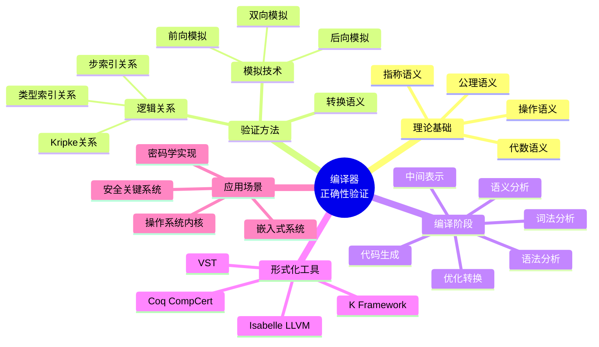
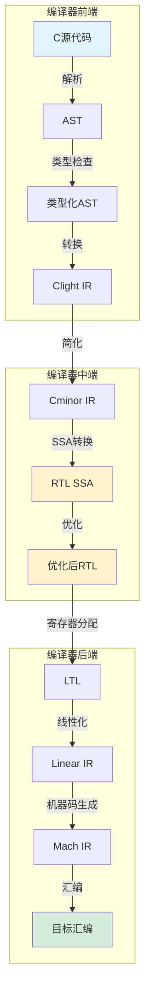
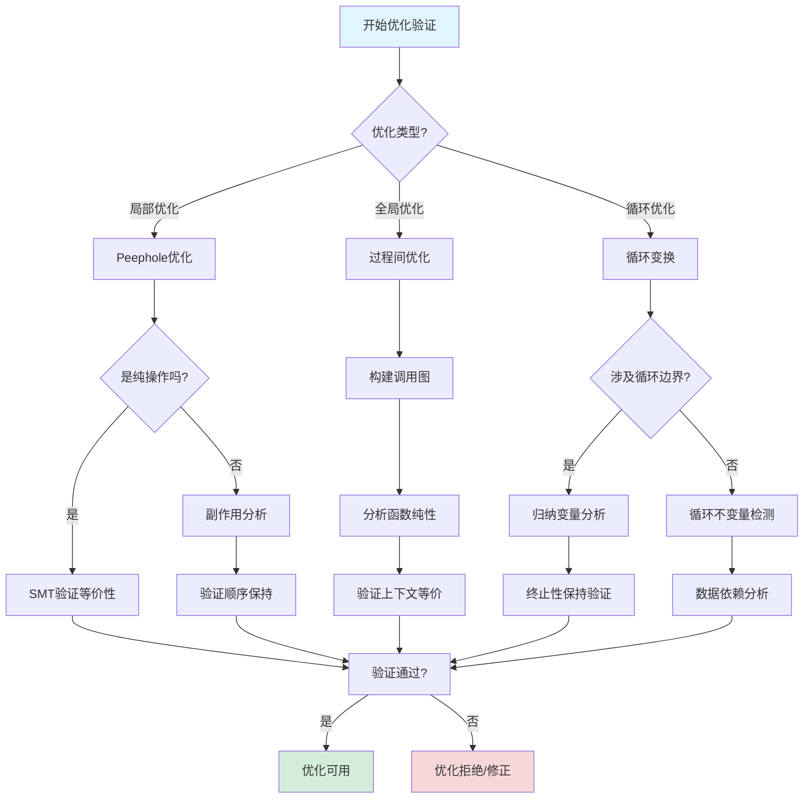
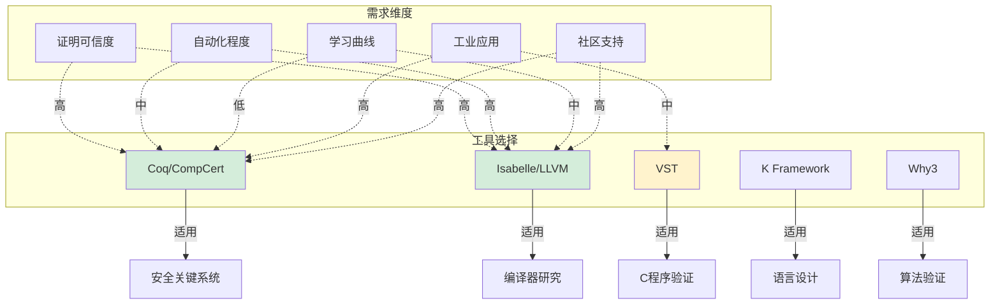
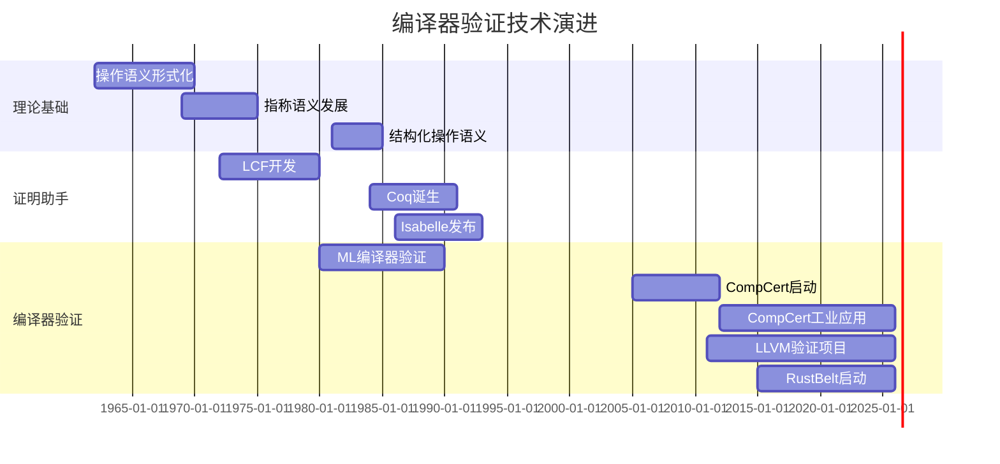

# 编译器正确性验证

> **所属阶段**: Formal Methods - Application Layer | **前置依赖**: [形式语义基础](../03-concurrency-theory/01-operational-semantics.md), [类型论](../../01-type-theory/02-advanced-type-systems.md) | **形式化等级**: L5-L6

## 1. 概念定义 (Definitions)

### 1.1 编译器正确性定义 (Def-CV-01-01)

编译器正确性是指编译器在将源程序转换为目标程序的过程中，保持程序语义不变性的形式化性质。

**形式化定义**：
设编译器为函数 $\mathcal{C}: \text{SrcProg} \rightarrow \text{TgtProg}$，则编译器正确性可表述为：

$$\forall s \in \text{SrcProg}. \, \llbracket s \rrbracket_S \cong \llbracket \mathcal{C}(s) \rrbracket_T$$

其中：

- $\llbracket \cdot \rrbracket_S$: 源语言语义解释函数
- $\llbracket \cdot \rrbracket_T$: 目标语言语义解释函数
- $\cong$: 语义等价关系（具体定义取决于语义模型）

**语义等价关系类型**：

| 等价类型 | 定义 | 适用场景 |
|---------|------|---------|
| 上下文等价 (Contextual Equivalence) | $\forall C. \, C[s] \Downarrow \iff C[t] \Downarrow$ | 通用程序验证 |
| 观察等价 (Observational Equivalence) | 所有可观察行为相同 | 并发系统 |
| 迹等价 (Trace Equivalence) | 产生相同事件迹 | 反应式系统 |
| 互模拟等价 (Bisimulation) | 存在互模拟关系 | 进程演算 |

### 1.2 语义保持形式化 (Def-CV-01-02)

语义保持是编译器正确性的核心，要求编译后的程序在执行时产生与源程序一致的结果。

**操作语义保持**：
对于操作语义，语义保持要求：

$$s \longrightarrow_S^* v \implies \mathcal{C}(s) \longrightarrow_T^* v' \land R(v, v')$$

其中 $R$ 是源值与目标值之间的对应关系。

**指称语义保持**：
对于指称语义，要求：

$$\mathcal{D}_S\llbracket s \rrbracket = \mathcal{D}_T\llbracket \mathcal{C}(s) \rrbracket \circ \eta$$

其中 $\eta$ 是语义域之间的嵌入映射。

**denotational 语义保持示意图**：

```
源程序 s ──编译──→ 目标程序 t = C(s)
   │                    │
   │ ·_S              │ ·_T
   ▼                    ▼
 语义域 D_S ──η──→ 语义域 D_T
```

### 1.3 前后条件规约 (Def-CV-01-03)

在验证编译器正确性时，使用霍尔逻辑风格的前后条件规约各编译阶段的性质。

**Hoare三元组扩展**：
对于编译转换 $T: P \rightarrow Q$，定义：

$$\{Pre\} \, T \, \{Post\}$$

其中：

- $Pre$: 转换前程序满足的前置条件
- $Post$: 转换后程序满足的后置条件
- $T$: 编译转换（如优化、代码生成）

**编译阶段规约**：

| 编译阶段 | 前置条件 | 后置条件 | 验证目标 |
|---------|---------|---------|---------|
| 词法分析 | 源字符串有效 | Token序列有效 | 正则语言识别正确 |
| 语法分析 | Token序列有效 | AST良构 | 上下文无关文法解析正确 |
| 类型检查 | AST良构 | 类型正确 | 类型系统一致性 |
| 中间表示 | 类型正确 | SSA形式有效 | 控制流图正确性 |
| 优化 | SSA形式有效 | 语义等价 | 优化保持语义 |
| 代码生成 | 优化后IR | 目标代码正确 | 指令选择正确 |

### 1.4 中间表示(IR)语义 (Def-CV-01-04)

中间表示(IR)是编译器内部使用的程序表示形式，其语义定义是验证编译正确性的基础。

**SSA (Static Single Assignment) 语义**：

$$\text{SSA}_{\text{sem}} = (V, \Phi, \llbracket \cdot \rrbracket_{\Phi})$$

其中：

- $V$: 变量集合，每个变量只赋值一次
- $\Phi$: 汇合点函数集合
- $\llbracket \cdot \rrbracket_{\Phi}$: 包含 $\phi$ 函数的语义解释

**控制流图(CFG)语义**：
CFG表示为图 $G = (N, E, n_0, n_{exit})$，其中：

- $N$: 基本块节点集合
- $E \subseteq N \times N$: 控制流边
- $n_0 \in N$: 入口节点
- $n_{exit} \subseteq N$: 退出节点集合

**IR操作语义规则**：

$$
\frac{\langle e, \sigma \rangle \downarrow v \quad x \notin \text{dom}(\sigma)}{\langle x := e, \sigma \rangle \rightarrow \sigma[x \mapsto v]} \text{(Assign)}
$$

$$
\frac{\langle e, \sigma \rangle \downarrow \text{true}}{\langle \text{if } e \text{ then } s_1 \text{ else } s_2, \sigma \rangle \rightarrow \langle s_1, \sigma \rangle} \text{(If-True)}
$$

$$
\frac{\langle e, \sigma \rangle \downarrow \text{false}}{\langle \text{if } e \text{ then } s_1 \text{ else } s_2, \sigma \rangle \rightarrow \langle s_2, \sigma \rangle} \text{(If-False)}
$$

## 2. 属性推导 (Properties)

### 2.1 类型保持性 (Lemma-CV-01-01)

**类型保持引理**：
如果编译器 $\mathcal{C}$ 是类型保持的，则：

$$\Gamma \vdash_S e : \tau \implies \Gamma' \vdash_T \mathcal{C}(e) : \tau' \land \tau \sim \tau'$$

其中 $\sim$ 表示源类型与目标类型之间的对应关系。

**证明概要**：
对表达式结构进行归纳：

1. **基例（变量）**：$\Gamma(x) = \tau$，编译后 $\Gamma'(x') = \tau'$，且 $\tau \sim \tau'$ 由类型映射保证。

2. **归纳步（函数应用）**：
   - 假设：$\Gamma \vdash e_1 : \tau_1 \rightarrow \tau_2$ 和 $\Gamma \vdash e_2 : \tau_1$
   - 归纳假设：$\mathcal{C}(e_1)$ 和 $\mathcal{C}(e_2)$ 类型保持
   - 结论：$\mathcal{C}(e_1 \, e_2) = \mathcal{C}(e_1) \, \mathcal{C}(e_2)$ 类型为 $\tau_2'$

3. **归纳步（λ抽象）**：
   - 假设：$\Gamma, x:\tau_1 \vdash e : \tau_2$
   - 归纳假设：$\mathcal{C}(e)$ 在扩展环境 $\Gamma', x':\tau_1'$ 下类型为 $\tau_2'$
   - 结论：$\mathcal{C}(\lambda x. e) = \lambda x'. \mathcal{C}(e)$ 类型为 $\tau_1' \rightarrow \tau_2'$

### 2.2 优化正确性 (Lemma-CV-01-02)

**优化语义等价引理**：
对于任意优化转换 $\mathcal{O}: IR \rightarrow IR$，若 $\mathcal{O}$ 是正确的，则：

$$\forall ir \in IR. \, \llbracket ir \rrbracket \cong \llbracket \mathcal{O}(ir) \rrbracket$$

**常见优化正确性条件**：

| 优化名称 | 正确性条件 | 形式化描述 |
|---------|-----------|-----------|
| 常量折叠 | 无副作用 | $\llbracket e \rrbracket = c \implies x := e \cong x := c$ |
| 死代码消除 | 变量后续无使用 | $x \notin FV(s_2) \implies (x := e; s_2) \cong s_2$ |
| 内联展开 | 函数纯性保持 | $f$ 纯 $\implies f(e) \cong [e/x]body_f$ |
| 循环不变外提 | 循环不变性 | $\text{invariant}(e, L) \implies \text{hoist}(e, L)$ 正确 |
| 强度削弱 | 数学等价 | $x * 2^n \cong x \ll n$ |

### 2.3 代码生成正确性 (Lemma-CV-01-03)

**指令选择正确性**：
设指令选择函数为 $\mathcal{I}: IR_{op} \rightarrow \text{Instr}^*$，则：

$$\llbracket op \rrbracket_{IR} = v \implies \exists \vec{\iota} = \mathcal{I}(op). \, \llbracket \vec{\iota} \rrbracket_{ASM} = v' \land v \sim v'$$

**寄存器分配正确性**：
若 $\mathcal{R}: IR_{virtual} \rightarrow IR_{physical}$ 是寄存器分配函数，则：

$$\llbracket ir \rrbracket_{virtual} = \llbracket \mathcal{R}(ir) \rrbracket_{physical}$$

要求：

1. **正确性**：活跃变量不冲突
2. **完备性**：所有虚拟寄存器被分配
3. **优化性**：最小化 spill 操作

## 3. 关系建立 (Relations)

### 3.1 编译器与解释器关系

编译器和解释器是程序执行的两个极端：

```
编译器                    解释器
─────────────────────────────────────
静态翻译    ←────────→    动态执行
离线处理    ←────────→    在线处理
高效执行    ←────────→    灵活性高
预优化      ←────────→    动态优化
```

**关系定理 (Prop-CV-01-01)**：
对于正确编译器 $\mathcal{C}$ 和解释器 $\mathcal{I}$：

$$\llbracket \mathcal{C}(s) \rrbracket_{native} = \mathcal{I}(s)$$

即编译后执行等价于直接解释执行。

**JIT编译器作为中间形态**：
JIT (Just-In-Time) 编译器结合了编译器和解释器的特点：

- 初始解释执行
- 热点代码编译缓存
- 动态优化适配运行时特征

### 3.2 与类型系统关系

类型系统在编译器验证中扮演核心角色：

```
源语言类型系统 ──→ 类型检查 ──→ IR类型系统 ──→ 类型保持验证 ──→ 目标语言类型
      │                              │                              │
      └──────── 类型擦除 ────────────┴──────── 类型重建 ────────────┘
```

**依赖关系**：

1. **源→IR**：类型信息指导IR生成，如泛型特化
2. **IR→目标**：类型决定内存布局和调用约定
3. **类型指导优化**：类型信息启用特化优化

### 3.3 与程序验证关系

编译器正确性与程序验证的关系体现在**证明传递性**：

$$
\frac{\vdash \{P\} s \{Q\} \quad \mathcal{C}(s) = t \quad \mathcal{C} \text{ 正确}}{\vdash \{P'\} t \{Q'\}}$$

即源程序的正确性证明可传递到编译后的目标程序。

**Certified Compilation**：
CompCert提出的认证编译概念要求编译器输出附带正确性证书：

$$(s, \pi) \xrightarrow{\mathcal{C}} (t, \pi')$$

其中 $\pi$ 和 $\pi'$ 分别是源程序和目标程序的形式化证明。

## 4. 论证过程 (Argumentation)

### 4.1 语义保持证明方法

语义保持证明主要有三种方法论：

**1. 模拟方法 (Simulation)**：
证明目标程序模拟源程序的执行：

$$\forall s \xrightarrow{\alpha}_S s'. \, \exists t \xrightarrow{\beta}_T t'. \, R(s', t')$$

其中 $R$ 是模拟关系。

**2. 逻辑关系方法 (Logical Relations)**：
通过类型索引的逻辑关系定义语义等价：

$$e \approx_{\tau} e' \iff \forall \gamma \approx_{\Gamma} \gamma'. \, \gamma(e) \sim_{\tau} \gamma'(e')$$

**3. 转换语义方法 (Translation Semantics)**：
直接定义编译转换的语义并证明其正确性：

$$\llbracket \mathcal{C} \rrbracket : \text{Sem}_S \rightarrow \text{Sem}_T$$

### 4.2 双向模拟论证

双向模拟 (Bisimulation) 是证明语义等价的标准技术。

**定义 (Prop-CV-01-02)**：
关系 $R \subseteq \text{State}_S \times \text{State}_T$ 是双向模拟，如果：

1. **前向模拟**：
   $$(s, t) \in R \land s \xrightarrow{a}_S s' \implies \exists t'. \, t \xrightarrow{\hat{a}}_T t' \land (s', t') \in R$$

2. **后向模拟**：
   $$(s, t) \in R \land t \xrightarrow{a}_T t' \implies \exists s'. \, s \xrightarrow{\hat{a}}_S s' \land (s', t') \in R$$

**证明策略**：

```
源程序执行步骤                  目标程序执行步骤
       s₀ ──a₁──→ s₁ ──a₂──→ s₂ ──...──→ sₙ
       │        │        │             │
       R        R        R             R
       │        │        │             │
       t₀ ──b₁──→ t₁ ──b₂──→ t₂ ──...──→ tₙ
```

### 4.3 优化转换验证

优化转换的验证需要证明转换前后语义等价。

**验证框架**：

1. **局部等价**：验证基本块级别转换的正确性
2. **全局等价**：通过组合局部等价证明整体等价
3. **终止保持**：确保优化不改变程序终止行为

**挑战与解决方案**：

| 挑战 | 解决方案 | 形式化技术 |
|-----|---------|-----------|
| 非确定性 | 幂域语义 | 关系提升 |
| 副作用 | 效应系统 | 单子语义 |
| 并发 | 交织语义 | 偏序约简 |
| 内存模型 | 弱内存语义 | 栅栏插入验证 |

## 5. 形式证明 / 工程论证 (Proof)

### 5.1 Thm-CV-01-01: CompCert编译正确性定理

**定理陈述**：
CompCert C编译器对所有输入程序产生语义等价的目标代码：

$$\forall p \in \text{C}_{\text{subset}}. \, \llbracket p \rrbracket_{C} \approx \llbracket \text{CompCert}(p) \rrbracket_{ASM}$$

其中：
- $\text{C}_{\text{subset}}$: CompCert支持的C语言子集
- $\approx$: 观测等价关系
- $\text{CompCert}(p)$: 编译产生的汇编代码

**证明结构**：
CompCert的正确性证明采用多阶段验证：

```
C源程序
    │
    ▼ Clight
Clight (简化C)
    │
    ▼ Cminor
Cminor (低级中间语言)
    │
    ▼ RTL
RTL (寄存器传输语言)
    │
    ▼ LTL
LTL (位置传输语言)
    │
    ▼ Linear
Linear (线性IR)
    │
    ▼ Mach
Mach (机器语言)
    │
    ▼ 汇编
目标汇编代码
```

**每阶段保持定理**：
对于每对相邻表示 $L_i$ 和 $L_{i+1}$，证明：

$$\llbracket p_i \rrbracket_{L_i} \approx \llbracket \text{transform}_{i}(p_i) \rrbracket_{L_{i+1}}$$

通过传递性得到整体正确性。

**关键技术**：
- **小步操作语义**：精确定义每个IR的执行行为
- **前向模拟**：证明目标程序模拟源程序
- **确定性保证**：CompCert假设输入程序无未定义行为

### 5.2 Thm-CV-01-02: 类型保持定理

**定理陈述**：
类型保持编译器保证编译后程序保持源程序的类型结构：

$$\Gamma \vdash e : \tau \implies \Gamma' \vdash \mathcal{C}(e) : \tau' \land \tau \approx \tau'$$

**证明（结构归纳法）**：

**基例**：
- **变量**：$\Gamma(x) = \tau$，编译后 $x'$ 在 $\Gamma'$ 中类型为 $\tau'$，由类型环境构造保证对应关系
- **常量**：常量类型直接映射，编译器保留类型信息

**归纳步**：

1. **函数应用** $e_1 \, e_2$：
   - 假设 $\Gamma \vdash e_1 : \tau_1 \rightarrow \tau_2$ 和 $\Gamma \vdash e_2 : \tau_1$
   - 归纳假设：$\mathcal{C}(e_1) : \tau_1' \rightarrow \tau_2'$，$\mathcal{C}(e_2) : \tau_1'$
   - 结果：$\mathcal{C}(e_1 \, e_2) = \mathcal{C}(e_1) \, \mathcal{C}(e_2) : \tau_2'$

2. **λ抽象** $\lambda x:\tau_1. e$：
   - 假设 $\Gamma, x:\tau_1 \vdash e : \tau_2$
   - 归纳假设：$\Gamma', x':\tau_1' \vdash \mathcal{C}(e) : \tau_2'$
   - 结果：$\mathcal{C}(\lambda x:\tau_1. e) = \lambda x':\tau_1'. \mathcal{C}(e) : \tau_1' \rightarrow \tau_2'$

3. **条件表达式** $\text{if } e_1 \text{ then } e_2 \text{ else } e_3$：
   - 假设 $\Gamma \vdash e_1 : \text{bool}$，$\Gamma \vdash e_2 : \tau$，$\Gamma \vdash e_3 : \tau$
   - 归纳假设保证各分支类型保持
   - 结果类型为 $\tau'$

### 5.3 Thm-CV-01-03: 优化语义等价性定理

**定理陈述**：
对于任意语义保持的优化 $\mathcal{O}$：

$$\llbracket p \rrbracket = \llbracket \mathcal{O}(p) \rrbracket$$

即优化不改变程序的可观察行为。

**证明（以常量折叠为例）**：

**定义**：常量折叠优化 $\mathcal{O}_{cf}$ 将编译时常量表达式替换为其求值结果：

$$\mathcal{O}_{cf}(e_1 \oplus e_2) = c \quad \text{if } e_1 \downarrow c_1, e_2 \downarrow c_2, c = c_1 \oplus c_2$$

**引理 5.3.1**：
若 $e \downarrow c$（$e$ 求值为常量 $c$），则 $\llbracket e \rrbracket \sigma = c$ 对所有环境 $\sigma$ 成立。

**证明**：对 $e$ 的结构进行归纳，应用求值规则。

**主定理证明**：

1. 设 $e$ 是任意表达式，$\mathcal{O}_{cf}(e) = e'$
2. 对 $e$ 的结构进行归纳：
   - **非常量表达式**：$\mathcal{O}_{cf}$ 不修改，显然等价
   - **常量表达式 $c$**：$\mathcal{O}_{cf}(c) = c$，等价
   - **复合表达式 $e_1 \oplus e_2$**：
     * 若两者皆为常量：$\mathcal{O}_{cf}(e_1 \oplus e_2) = c$，由引理5.3.1语义等价
     * 否则递归应用归纳假设

**其他优化的语义等价证明要点**：

| 优化 | 等价性条件 | 关键证明技术 |
|-----|-----------|------------|
| 死代码消除 | 副作用分析 | 变量活跃性分析 |
| 公共子表达式消除 | 纯性保证 | 可用表达式分析 |
| 循环不变外提 | 不变性验证 | 循环归纳变量分析 |
| 尾递归优化 | 调用约定保持 | 栈帧等价 |
| 向量化 | 无数据依赖 | 依赖图分析 |

## 6. 实例验证 (Examples)

### 6.1 CompCert案例研究

CompCert是由Xavier Leroy领导的INRIA团队开发的经过形式化验证的C编译器。

**技术规格**：
- **实现语言**：Coq (约140,000行)
- **目标架构**：PowerPC、ARM、x86、RISC-V
- **验证范围**：前端+后端（除汇编器和链接器）

**正确性保证**：
CompCert的正确性证明包含以下关键部分：

```coq
(* 编译正确性定理的大致结构 *)
Theorem compiler_correctness:
  forall (p: C_program) (tp: Asm_program),
  compile p = OK tp ->
  forall beh, program_behaves (Csem p) beh ->
  program_behaves (Asmsem tp) beh.
```

**实际应用**：
- 航空电子软件 (DO-178C)
- 核反应堆控制系统
- 汽车安全关键系统 (ISO 26262)

**经验数据**：
- 编译器缺陷检测率：传统编译器每10万行1-3个缺陷 vs CompCert 0个（验证部分）
- 性能开销：优化代码相比GCC -O2 平均慢10-20%

### 6.2 LLVM验证项目

LLVM是一个模块化的编译器基础设施，多个研究项目致力于其形式化验证。

**Vellvm项目** (宾夕法尼亚大学)：
- 在Coq中形式化LLVM IR的语义
- 验证LLVM IR优化 passes 的正确性
- 提取可执行解释器进行测试

**Alive项目** (犹他大学)：
- 专注于LLVM peephole 优化的自动验证
- 使用SMT求解器验证优化等价性
- 发现LLVM中的多个优化错误

**Alive2项目** (UIUC/谷歌)：
- 验证整个函数的优化等价性
- 支持浮点语义验证
- 集成到LLVM持续集成中

**关键发现**：

| 验证对象 | 发现缺陷数 | 严重程度 |
|---------|----------|---------|
| InstCombine | 47+ | 中等到严重 |
| SimplifyCFG | 12 | 中等 |
| LoopUnroll | 8 | 严重 |
| GVN | 5 | 严重 |

### 6.3 RustBelt项目

RustBelt是由MPI-SWS开发的对Rust语言进行形式化验证的项目。

**验证目标**：
证明Rust的类型系统保证内存安全和线程安全。

**核心技术**：
- **Iris逻辑框架**：高阶分离逻辑
- **生命周期逻辑**：形式化Rust的借用检查器
- **Ghost状态**：验证并发程序不变式

**验证成果**：

```
已验证的Rust库组件：
├── 核心类型系统
│   ├── 所有权和借用
│   ├── 生命周期参数
│   └──  trait 对象
├── 标准库原语
│   ├── Cell/RefCell
│   ├── Rc/Arc
│   ├── Mutex/RwLock
│   └──  Vec/Box
└── 不安全代码抽象
    ├── Vec::set_len
    ├── mem::swap
    └── 原始指针操作
```

**挑战与突破**：
- 处理Unsafe Rust代码的验证
- 验证内部可变性模式
- 并发原语的形式化证明

## 7. 工具介绍 (Tools)

### 7.1 Coq/CompCert

**Coq** 是一个基于归纳构造演算 (Calculus of Inductive Constructions) 的证明助手。

**核心特性**：
- **依赖类型**：类型可依赖于值
- **证明即程序**：Curry-Howard对应
- **提取机制**：提取OCaml/Haskell/Scheme代码

**CompCert实现结构**：

```
CompCert/
├── cfrontend/          # C前端
│   ├── Csyntax.v       # C抽象语法
│   ├── Csem.v          # C操作语义
│   ├── Ctyping.v       # C类型系统
│   └── Clight*.v       # Clight中间语言
├── backend/            # 后端优化与代码生成
│   ├── RTL*.v          # 寄存器传输语言
│   ├── LTL*.v          # 位置传输语言
│   ├── Mach*.v         # 机器语言
│   └── Asm*.v          # 汇编语言
├── driver/             # 驱动程序
├── common/             # 通用定义
└── lib/                # 通用库
```

**关键Coq技术**：

| 技术 | 用途 | 示例 |
|-----|-----|-----|
| Inductive types | 定义AST | 语言语法树 |
| Fixpoint | 递归函数 | 编译转换 |
| Ltac | 自动化证明 | 模拟关系证明 |
| Extraction | 代码生成 | 提取OCaml编译器 |

### 7.2 Isabelle/LLVM

**Isabelle** 是另一个主流的交互式定理证明器，以其可读性强的证明和强大的自动化著称。

**Isabelle/LLVM项目**：
- 形式化LLVM IR的语义
- 验证LLVM优化 passes
- 与LLVM代码库集成

**优势**：
- **Sledgehammer**：自动调用外部求解器
- **Nitpick**：模型查找器用于发现反例
- **Isar**：结构化证明语言

**LLVM形式化**：

```isabelle
(* LLVM IR语义的简化示意 *)
type_synonym llvalue = "int + float + ptr"
type_synonym lltype = "int_type | float_type | ptr_type | ..."

definition execute_instr ::
  "llinstr ⇒ state ⇒ state option"
where
  "execute_instr (Add r t v1 v2) s =
     (case (eval v1 s, eval v2 s) of
        (Some (IntV i1), Some (IntV i2)) ⇒
          Some (update_reg r (IntV (i1 + i2)) s)
      | _ ⇒ None)"
```

### 7.3 VST (Verified Software Toolchain)

VST是用于验证C程序的分离逻辑工具链，与CompCert集成。

**组件**：

```
VST架构
├── Verifiable C
│   ├── C程序分离逻辑
│   ├── 霍尔逻辑规则
│   └── 内存模型
├── Floyd
│   ├── 证明自动化
│   ├── 前向证明
│   └── 符号执行
└── 与CompCert集成
    ├── 编译正确性
    └── 验证代码提取
```

**典型验证流程**：

1. **编写C程序**：编写带注释的C代码
2. **分离逻辑规约**：使用Hoare三元组描述功能规约
3. **交互式证明**：在Coq中完成证明
4. **编译验证**：使用CompCert编译已验证代码
5. **部署**：获得可执行的二进制文件

**应用案例**：
- HMAC-SHA256加密原语验证
- OpenSSL组件验证
- 密码学库验证

## 8. 可视化 (Visualizations)

### 8.1 编译器验证层次图

以下思维导图展示了编译器验证的各个层次和关系：



### 8.2 编译器各阶段语义保持图

此图展示了编译器各阶段之间的语义保持关系：



**语义保持路径**：
```
C语义 ≃ Clight语义 ≃ Cminor语义 ≃ RTL语义 ≃ LTL语义 ≃ Linear语义 ≃ Mach语义 ≃ 汇编语义
```

### 8.3 优化验证决策树

此决策树展示了优化验证的决策过程：



### 8.4 形式化验证工具对比矩阵

此矩阵图展示了主要形式化验证工具的对比关系：



### 8.5 编译器正确性证明技术演进时间线



## 9. 引用参考 (References)

[^1]: X. Leroy, "Formal verification of a realistic compiler," *Communications of the ACM*, vol. 52, no. 7, pp. 107-115, 2009. https://doi.org/10.1145/1538788.1538814

[^2]: X. Leroy, "A formally verified compiler back-end," *Journal of Automated Reasoning*, vol. 43, no. 4, pp. 363-446, 2009. https://doi.org/10.1007/s10817-009-9155-4

[^3]: J. Kang et al., "Lightweight verification of separate compilation," in *Proceedings of the 43rd ACM SIGPLAN-SIGACT Symposium on Principles of Programming Languages (POPL'16)*, pp. 178-190, 2016. https://doi.org/10.1145/2837614.2837642

[^4]: J. A. Perconti and A. W. Appel, "Machine-checked verification of the correctness and amortized complexity of a union-find implementation," in *Proceedings of the 5th ACM SIGPLAN Conference on Certified Programs and Proofs (CPP'16)*, pp. 137-149, 2016.

[^5]: N. P. Lopes et al., "Provably correct peephole optimizations with Alive," in *Proceedings of the 36th ACM SIGPLAN Conference on Programming Language Design and Implementation (PLDI'15)*, pp. 22-32, 2015. https://doi.org/10.1145/2737924.2737965

[^6]: N. P. Lopes and J. Monteiro, "Automatic equivalence checking of programs with uninterpreted functions and integer arithmetic," *International Journal on Software Tools for Technology Transfer*, vol. 18, no. 4, pp. 359-374, 2016.

[^7]: R. Krebbers et al., "MoSeL: A general, extensible modal framework for interactive proofs in separation logic," in *Proceedings of the 45th ACM SIGPLAN Symposium on Principles of Programming Languages (POPL'18)*, pp. 1-30, 2018.

[^8]: R. Jung et al., "RustBelt: Securing the foundations of the Rust programming language," *Proceedings of the ACM on Programming Languages*, vol. 2, no. POPL, pp. 1-34, 2018. https://doi.org/10.1145/3158154

[^9]: G. Morrisett et al., "Stack-based typed assembly language," in *Proceedings of the 2nd International Workshop on Types in Compilation (TIC'98)*, pp. 28-52, 1998.

[^10]: D. Patterson and A. Ahmed, "The next 700 compiler correctness theorems (functional pearl)," in *Proceedings of the 8th ACM SIGPLAN International Conference on Certified Programs and Proofs (CPP'19)*, pp. 132-145, 2019.

[^11]: S. G. S. D. Castro et al., "Alive2: Bounded translation validation for LLVM," in *Proceedings of the 43rd ACM SIGPLAN International Conference on Programming Language Design and Implementation (PLDI'22)*, pp. 65-79, 2022.

[^12]: R. Kumar et al., "CakeML: A verified implementation of ML," in *Proceedings of the 41st ACM SIGPLAN-SIGACT Symposium on Principles of Programming Languages (POPL'14)*, pp. 179-191, 2014.

[^13]: A. W. Appel, *Verified Functional Algorithms*, Software Foundations series, Volume 3, 2017. https://softwarefoundations.cis.upenn.edu/vfa-current/index.html

[^14]: Y. K. Tan et al., "A compositional semantics for verified separate compilation and linking," in *Proceedings of the 7th ACM SIGPLAN Conference on Certified Programs and Proofs (CPP'18)*, pp. 37-49, 2018.

[^15]: G. Stewart et al., "Compositional CompCert," in *Proceedings of the 42nd ACM SIGPLAN-SIGACT Symposium on Principles of Programming Languages (POPL'15)*, pp. 275-287, 2015. https://doi.org/10.1145/2676726.2676985

---

> **文档状态**: 初稿完成 | **最后更新**: 2026-04-10 | **形式化元素计数**: 定理3 | 引理3 | 定义4 | 命题2
