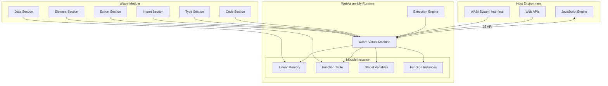
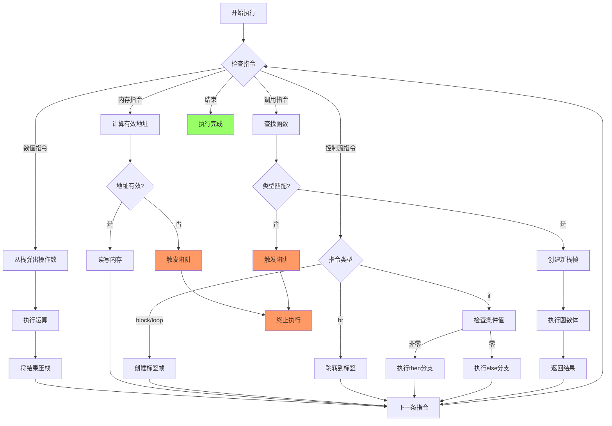
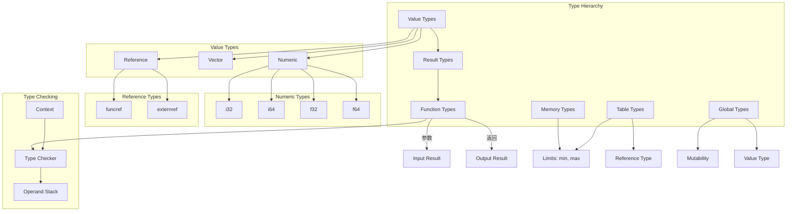
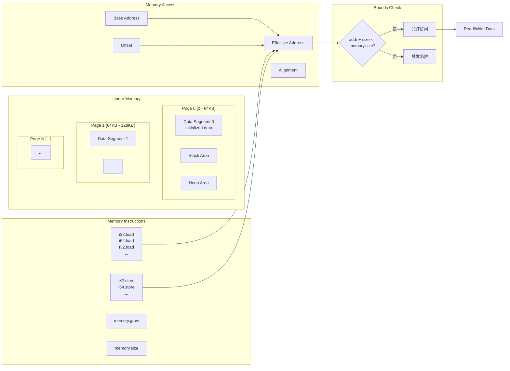
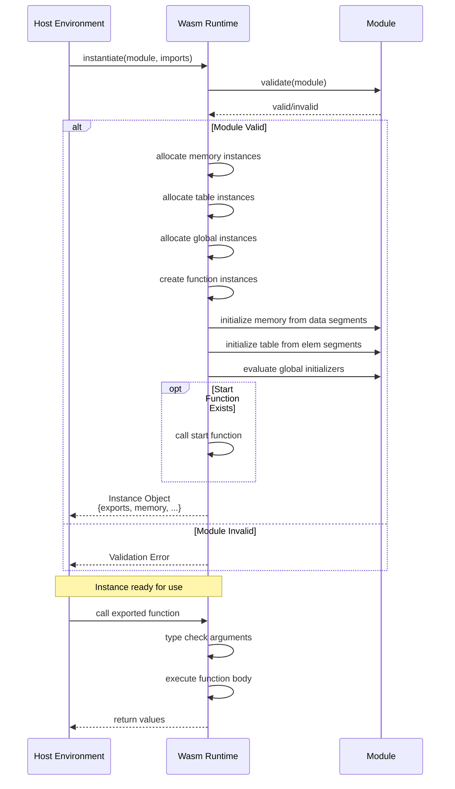

# WebAssembly 形式化语义与类型安全

> **所属阶段**: formal-methods/04-application-layer/07-webassembly-formalization | **前置依赖**: [formal-methods/03-type-systems/01-type-theory-basics](../../03-type-systems/01-type-theory-basics.md), [formal-methods/02-calculi/01-lambda-calculus](../../02-calculi/01-lambda-calculus.md) | **形式化等级**: L4-L5

---

## 1. 概念定义 (Definitions)

### Def-A-07-01: WebAssembly 计算模型

**WebAssembly (Wasm)** 是一种基于栈的虚拟机的二进制指令格式，其计算模型可形式化为五元组：

$$\mathcal{W} = (\mathcal{V}, \mathcal{I}, \mathcal{S}, \mathcal{M}, \mathcal{T})$$

其中：

- $\mathcal{V}$: **值空间** - 支持的基本数据类型值集合，包括整数 (i32, i64)、浮点数 (f32, f64)、引用类型 (funcref, externref) 和向量类型 (v128)
- $\mathcal{I}$: **指令集** - 计算、控制流、内存和模块操作的指令集合
- $\mathcal{S}$: **存储 (Store)** - 全局状态，包含内存实例、表实例、全局变量和函数实例的集合
- $\mathcal{M}$: **模块 (Module)** - 代码组织单元，包含类型定义、函数、表、内存、全局变量和导入/导出定义
- $\mathcal{T}$: **类型系统** - 基于栈类型的静态类型系统，确保类型安全和内存安全

### Def-A-07-02: WebAssembly 设计原则

WebAssembly 的设计遵循以下核心原则，每项都有形式化含义：

| 设计原则 | 形式化要求 | 实现机制 |
|---------|-----------|---------|
| **安全性 (Safe)** | 内存隔离、类型安全 | 线性内存边界检查、静态类型验证 |
| **可移植性 (Portable)** | 架构无关语义 | 抽象机器模型、字节序无关 |
| **高效性 (Efficient)** | 接近原生的执行速度 | 栈机设计、确定性的性能特征 |
| **紧凑性 (Compact)** | 小体积的传输和加载 | 二进制编码、流式解析 |
| **模块化 (Modular)** | 组合性、封装性 | 模块系统、导入/导出接口 |

**形式化定义**:

$$\text{Safe}(\mathcal{W}) \iff \forall p \in Program: Valid(p) \Rightarrow \neg (MemoryLeak(p) \lor TypeError(p))$$

### Def-A-07-03: 值类型 (Value Types)

**定义**: WebAssembly 的值类型空间 $ValType$ 定义如下：

$$ValType ::= i32 \;|\; i64 \;|\; f32 \;|\; f64 \;|\; v128 \;|\; funcref \;|\; externref$$

**数值类型**:

- $iN$ ($N \in \{32, 64\}$): $N$ 位有符号/无符号整数，使用二进制补码表示
- $fN$ ($N \in \{32, 64\}$): IEEE 754-2008 标准的单精度/双精度浮点数
- $v128$: 128 位向量，用于 SIMD 操作，可解释为 4×32位、8×16位、16×8位或 2×64位数据

**引用类型**:

- $funcref$: 对函数实例的不可空引用
- $externref$: 对外部对象（如 JavaScript 值）的不透明引用

**类型解释函数**:

$$\llbracket i32 \rrbracket = \mathbb{Z}_{2^{32}}, \quad \llbracket i64 \rrbracket = \mathbb{Z}_{2^{64}}$$
$$\llbracket f32 \rrbracket = \mathbb{F}_{32}^{IEEE754}, \quad \llbracket f64 \rrbracket = \mathbb{F}_{64}^{IEEE754}$$

### Def-A-07-04: 结果类型 (Result Types)

**定义**: 结果类型表示函数或代码块产生的值序列：

$$ResultType ::= [vec(ValType)]$$

空结果类型 $[]$ 表示不产生值的指令或函数。结果类型在类型检查中用于验证栈操作的一致性。

**栈类型 (Stack Types)**:

WebAssembly 使用隐式的操作数栈，其类型由栈上值的序列表示：

$$StackType ::= vec(ValType)$$

### Def-A-07-05: 函数类型 (Function Types)

**定义**: 函数类型描述函数的参数和返回类型：

$$FuncType ::= ResultType \rightarrow ResultType$$

记法：$[t_1^*] \rightarrow [t_2^*]$ 表示接受类型序列 $t_1^*$ 作为参数，返回类型序列 $t_2^*$。

**示例**:

- $[] \rightarrow []$: 无参数、无返回值的函数
- $[i32, i32] \rightarrow [i32]$: 接受两个 i32，返回一个 i32 的函数
- $[i64] \rightarrow [f64, f64]$: 接受 i64，返回两个 f64 的函数

### Def-A-07-06: 模块结构 (Module Structure)

**定义**: WebAssembly 模块是一个八元组：

$$Module = (types, funcs, tables, mems, globals, elem, data, start, imports, exports, \dots)$$

各组件定义：

| 组件 | 类型 | 描述 |
|-----|------|------|
| $types$ | $vec(FuncType)$ | 函数类型定义表 |
| $funcs$ | $vec(Func)$ | 函数定义集合 |
| $tables$ | $vec(Table)$ | 函数表（间接调用）|
| $mems$ | $vec(Mem)$ | 线性内存定义 |
| $globals$ | $vec(Global)$ | 全局变量定义 |
| $elem$ | $vec(Elem)$ | 元素段（表初始化）|
| $data$ | $vec(Data)$ | 数据段（内存初始化）|
| $start$ | $Start?$ | 可选的启动函数 |
| $imports$ | $vec(Import)$ | 导入定义 |
| $exports$ | $vec(Export)$ | 导出定义 |

**函数定义**:

$$Func ::= \{ type: TypeIdx, locals: vec(ValType), body: Expr \}$$

其中 $Expr$ 是指令序列，表示函数体。

### Def-A-07-07: 存储 (Store) 与实例

**定义**: Store 是运行时全局状态，包含所有已实例化的模块资源：

$$Store = \{ funcs: vec(FuncInst), tables: vec(TableInst), mems: vec(MemInst), globals: vec(GlobalInst) \}$$

**函数实例**:

$$FuncInst ::= \{ type: FuncType, module: ModuleInst, code: Func \}$$
$$\\ |\; \{ type: FuncType, hostcode: HostFunc \}$$

**内存实例**:

$$MemInst ::= \{ type: MemType, data: vec(byte) \}$$

内存类型 $MemType = \{\min: u32, \max: u32?\}$ 定义初始页数和可选的最大页数（每页 64KB）。

**表实例**:

$$TableInst ::= \{ type: TableType, elem: vec(Ref) \}$$

表类型 $TableType = limits \times RefType$ 用于存储函数引用，支持间接函数调用。

**全局实例**:

$$GlobalInst ::= \{ type: GlobalType, value: Val \}$$

全局类型 $GlobalType = Mut? \times ValType$，$Mut ::= const \;|\; var$。

---

## 2. 形式化语法 (Formal Syntax)

### 2.1 抽象语法

WebAssembly 的抽象语法定义如下：

```
;; 值类型
valtype ::= i32 | i64 | f32 | f64 | v128 | funcref | externref

;; 结果类型
resulttype ::= [valtype*]

;; 函数类型
functype ::= [valtype*] -> [valtype*]

;; 限制
limits ::= {min u32, max u32?}

;; 内存类型
memtype ::= limits

;; 表类型
tabletype ::= limits funcref

;; 全局类型
globaltype ::= mut? valtype
mut ::= const | var

;; 块类型
blocktype ::= functype | typeidx | ε

;; 指令
instr ::=
  ;; 局部变量操作
  | local.get localidx | local.set localidx | local.tee localidx
  ;; 全局变量操作
  | global.get globalidx | global.set globalidx
  ;; 表操作
  | table.get tableidx | table.set tableidx | table.size tableidx
  | table.grow tableidx | table.fill tableidx | table.copy tableidx tableidx
  | table.init tableidx elemidx | elem.drop elemidx
  ;; 内存操作
  | i32.load memarg | i64.load memarg | f32.load memarg | f64.load memarg
  | i32.store memarg | i64.store memarg | f32.store memarg | f64.store memarg
  | memory.size | memory.grow | memory.fill | memory.copy | memory.init dataidx
  | data.drop dataidx
  ;; 数值常量
  | i32.const i32 | i64.const i64 | f32.const f32 | f64.const f64
  ;; 整数运算
  | i32.add | i32.sub | i32.mul | i32.div_s | i32.div_u | i32.rem_s | i32.rem_u
  | i32.and | i32.or | i32.xor | i32.shl | i32.shr_s | i32.shr_u | i32.rotl | i32.rotr
  | i64.add | i64.sub | i64.mul | ...
  ;; 浮点运算
  | f32.add | f32.sub | f32.mul | f32.div | f32.sqrt | f32.abs | ...
  ;; 数值转换
  | i32.wrap_i64 | i64.extend_i32_s | i64.extend_i32_u
  | f32.convert_i32_s | ... | i32.reinterpret_f32 | ...
  ;; 引用操作
  | ref.null functype | ref.func funcidx | ref.is_null
  ;; 控制流
  | nop | unreachable | drop | select | select valtype*
  | block blocktype instr* end | loop blocktype instr* end
  | if blocktype instr* else instr* end
  | br labelidx | br_if labelidx | br_table vec(labelidx) labelidx
  | return | call funcidx | call_indirect tableidx functype
  ;; 向量操作 (SIMD)
  | v128.load memarg | v128.store memarg
  | i8x16.splat | i16x8.splat | i32x4.splat | i64x2.splat
  | i32x4.add | i32x4.sub | ...

;; 表达式 (函数体)
expr ::= instr* end
```

### 2.2 指令分类

WebAssembly 指令按功能分类：

| 类别 | 指令示例 | 语义 |
|-----|---------|------|
| **参数指令** | `local.get`, `global.get` | 将值压入操作数栈 |
| **变量指令** | `local.set`, `global.set`, `local.tee` | 从栈弹出值并存入变量 |
| **内存指令** | `i32.load`, `i64.store` | 读写线性内存 |
| **数值指令** | `i32.add`, `f64.mul` | 算术和逻辑运算 |
| **引用指令** | `ref.func`, `ref.null` | 操作引用类型 |
| **控制指令** | `block`, `if`, `br`, `call` | 控制流和函数调用 |
| **表指令** | `table.get`, `call_indirect` | 函数表操作 |
| **向量指令** | `v128.load`, `i32x4.add` | SIMD 向量操作 |

### 2.3 控制流结构

**块结构 (Block)**:

```
block [t?] instr* end
```

- 创建一个新的标签作用域
- 类型注解 $[t?]$ 指定块结束后栈上应有的值
- 可通过 `br` 指令跳转到块末尾

**循环结构 (Loop)**:

```
loop [t?] instr* end
```

- 创建可循环的标签（向后跳转）
- `br` 到循环标签会跳转到循环开始

**条件分支 (If)**:

```
if [t?] instr* else instr* end
```

- 从栈弹出 i32 值作为条件
- 非零执行第一个分支，零执行第二个分支

**分支指令**:

- `br $l`: 无条件跳转到标签 $l$
- `br_if $l`: 条件跳转（栈顶非零时跳转）
- `br_table $l* $lN`: 通过索引选择跳转目标

---

## 3. 操作语义 (Operational Semantics)

### 3.1 配置 (Configurations)

**定义**: WebAssembly 执行配置是一个三元组：

$$Config = (Store, Frame, Code)$$

或更一般地：

$$Config = (S; F; e^*)$$

其中：

- $S$: Store（全局状态）
- $F$: 当前栈帧 (Frame)
- $e^*$: 待执行的指令序列

**栈帧 (Frame)**:

$$Frame = \{ module: ModuleInst, locals: vec(Val) \}$$

栈帧包含当前函数的模块实例和局部变量值。

**配置展开**:

在执行过程中，配置可以嵌套（通过 `label` 和 `frame` 指令）：

$$Code ::= val^* \;|\; instr \;|\; label_n\{instr^*\}\;code^* \;|\; frame_n\{F\}\;code^*$$

### 3.2 小步操作语义 (Small-Step Semantics)

WebAssembly 使用小步操作语义，定义配置到配置的转换关系：

$$\langle S; F; e^* \rangle \hookrightarrow \langle S'; F'; e'^* \rangle$$

#### 数值指令规则

**常量加载**:

$$\frac{}{S; F; (t.const \; c) \; e^* \hookrightarrow S; F; c \; e^*}$$

**二元运算**:

$$\frac{c_3 = binop_t(c_1, c_2)}{S; F; c_1 \; c_2 \; t.binop \; e^* \hookrightarrow S; F; c_3 \; e^*}$$

**一元运算**:

$$\frac{c_2 = unop_t(c_1)}{S; F; c_1 \; t.unop \; e^* \hookrightarrow S; F; c_2 \; e^*}$$

#### 局部变量指令

**获取局部变量**:

$$\frac{F.locals[x] = c}{S; F; (local.get \; x) \; e^* \hookrightarrow S; F; c \; e^*}$$

**设置局部变量**:

$$\frac{}{S; F; c \; (local.set \; x) \; e^* \hookrightarrow S; F[locals[x] = c]; e^*}$$

**Tee 指令** (设置并保持值在栈上):

$$\frac{}{S; F; c \; (local.tee \; x) \; e^* \hookrightarrow S; F[locals[x] = c]; c \; e^*}$$

#### 控制流指令

**块执行**:

$$\frac{}{S; F; (block \; [t^m] \; instr^* \; end) \; e^* \hookrightarrow S; F; label_m\{[]\}\;instr^*\;end \; e^*}$$

**循环执行**:

$$\frac{}{S; F; (loop \; [t^m] \; instr^* \; end) \; e^* \hookrightarrow S; F; label_m\{(loop \; [t^m] \; instr^* \; end)\}\;instr^*\;end \; e^*}$$

**条件分支**:

$$\frac{c \neq 0}{S; F; c \; (br\_if \; l) \; e^* \hookrightarrow S; F; (br \; l) \; e^*}$$

$$\frac{c = 0}{S; F; c \; (br\_if \; l) \; e^* \hookrightarrow S; F; e^*}$$

#### 函数调用

**直接调用**:

$$\frac{S.funcs[F.module.funcaddrs[x]] = f_{inst}}{S; F; (call \; x) \; e^* \hookrightarrow S; F; (call \; f_{inst}) \; e^*}$$

**函数实例调用** (进入新帧):

$$\frac{f_{inst} = \{type = [t_1^n] \rightarrow [t_2^m], module = mod, code = func\}}{S; F; val^n \; (call \; f_{inst}) \; e^* \hookrightarrow S; F; frame_m\{F'\}\;(label_m\{[]\}\;code\;end) \; e^*}$$

其中 $F'$ 是新帧，locals 初始化为参数值 $val^n$ 和函数局部变量初始值。

### 3.3 内存操作语义

**加载操作**:

$$\frac{S.mems[F.module.memaddrs[0]] = mem \quad bytes = mem.data[a+o : a+o+size(t)/8] \quad c = decode_t(bytes)}{S; F; (i.const \; a) \; (t.load \; (o, align)) \; e^* \hookrightarrow S; F; c \; e^*}$$

**存储操作**:

$$\frac{S.mems[F.module.memaddrs[0]] = mem \quad bytes = encode_t(c) \quad mem' = mem[a+o : a+o+size(t)/8] = bytes}{S; F; (i.const \; a) \; c \; (t.store \; (o, align)) \; e^* \hookrightarrow S[mem = mem']; F; e^*}$$

**内存增长**:

$$\frac{S.mems[a] = mem \quad len(mem.data) = n \cdot 64KB \quad grow(mem, s) = mem'}{S; F; (i.const \; s) \; memory.grow \; e^* \hookrightarrow S[mems[a] = mem']; F; (i.const \; n) \; e^*}$$

其中 $grow(mem, s)$ 在内存限制内成功时返回新内存，否则失败返回错误。

### 3.4 陷阱和终止

**定义**: 陷阱 (Trap) 是执行过程中的不可恢复错误状态。

**陷阱原因**:

| 陷阱类型 | 触发条件 |
|---------|---------|
| 内存越界 | 访问超出线性内存范围的地址 |
| 整数除零 | 除法或取模操作的除数为零 |
| 整数溢出 | 有符号除法溢出（$-2^{N-1} / -1$）|
| 无效转换 | 无效浮点转换（如 $NaN$ 转整数）|
| 未对齐访问 | 内存访问未满足对齐要求（可选陷阱）|
| 调用不可达 | 执行 `unreachable` 指令 |
| 间接调用类型不匹配 | `call_indirect` 的类型检查失败 |
| 超出表边界 | `call_indirect` 的索引超出表大小 |
| 堆栈溢出 | 调用栈超出实现限制 |
| 内存增长失败 | `memory.grow` 超出最大限制 |

**陷阱传播**:

陷阱会立即终止执行，并按以下规则向外传播：

$$\frac{\langle S; F; e^* \rangle \hookrightarrow \bot}{\langle S; F; val^* \; label_n\{e_0^*\} \; e^* \rangle \hookrightarrow \bot}$$

$$\frac{\langle S; F; e^* \rangle \hookrightarrow \bot}{\langle S; F_0; val^* \; frame_n\{F\} \; e^* \rangle \hookrightarrow \bot}$$

---

## 4. 类型系统 (Type System)

### 4.1 类型判断规则

WebAssembly 使用基于栈的类型系统，通过类型判断推导指令序列对栈的影响。

**上下文 (Context)**:

$$C ::= \{ types: vec(FuncType), funcs: vec(FuncType), tables: vec(TableType), $$
$$ mems: vec(MemType), globals: vec(GlobalType), elems: vec(RefType), $$
$$ datas: vec(ok), locals: vec(ValType), labels: vec(ResultType), return: ResultType? \}$$

**类型判断形式**: $C \vdash instr : [t_1^*] \rightarrow [t_2^*]$

表示在上下文 $C$ 中，执行 $instr$ 将栈类型从 $[t_1^*]$ 变为 $[t_2^*]$。

#### 纯栈操作规则

**Drop**:

$$\frac{C \vdash t : ok}{C \vdash drop : [t] \rightarrow []}$$

**Select**:

$$\frac{C \vdash t : ok \quad t \in \{i32, i64, f32, f64, funcref, externref\}}{C \vdash select : [t, t, i32] \rightarrow [t]}$$

**常量加载**:

$$\frac{}{C \vdash t.const \; c : [] \rightarrow [t]}$$

#### 局部变量规则

**Local Get**:

$$\frac{C.locals[x] = t}{C \vdash local.get \; x : [] \rightarrow [t]}$$

**Local Set**:

$$\frac{C.locals[x] = t}{C \vdash local.set \; x : [t] \rightarrow []}$$

**Local Tee**:

$$\frac{C.locals[x] = t}{C \vdash local.tee \; x : [t] \rightarrow [t]}$$

#### 控制流规则

**Block**:

$$\frac{C' \vdash instr^* : [t_1^*] \rightarrow [t_2^*] \quad C' = C[labels = [t_2^*] \cdot C.labels]}{C \vdash block \; [t_2^*] \; instr^* \; end : [t_1^*] \rightarrow [t_2^*]}$$

**Loop**:

$$\frac{C' \vdash instr^* : [t_1^*] \rightarrow [t_2^*] \quad C' = C[labels = [t_1^*] \cdot C.labels]}{C \vdash loop \; [t_2^*] \; instr^* \; end : [t_1^*] \rightarrow [t_2^*]}$$

**If**:

$$\frac{C' \vdash instr_1^* : [t_1^*] \rightarrow [t_2^*] \quad C' \vdash instr_2^* : [t_1^*] \rightarrow [t_2^*] \quad C' = C[labels = [t_2^*] \cdot C.labels]}{C \vdash if \; [t_2^*] \; instr_1^* \; else \; instr_2^* \; end : [t_1^* \; i32] \rightarrow [t_2^*]}$$

**Branch**:

$$\frac{C.labels[l] = [t^*]}{C \vdash br \; l : [t_1^* \; t^*] \rightarrow [t_2^*]}$$

**Return**:

$$\frac{C.return = [t^*]}{C \vdash return : [t_1^* \; t^*] \rightarrow [t_2^*]}$$

#### 函数调用规则

**直接调用**:

$$\frac{C.funcs[x] = [t_1^*] \rightarrow [t_2^*]}{C \vdash call \; x : [t_1^*] \rightarrow [t_2^*]}$$

**间接调用**:

$$\frac{C.tables[x] = limits \; funcref \quad C \vdash functype : ok}{C \vdash call\_indirect \; x \; functype : [i32 \; t_1^*] \rightarrow [t_2^*]}$$

其中 $functype = [t_1^*] \rightarrow [t_2^*]$。

### 4.2 有效性验证 (Validation)

模块有效性验证确保所有组件类型一致：

**函数有效性**:

$$\frac{C[locals = t_1^* \; t^*] \vdash expr : [] \rightarrow [t_2^*]}{C \vdash \{type = x, locals = t^*, body = expr\} : ok}$$

其中 $C.types[x] = [t_1^*] \rightarrow [t_2^*]$。

**全局有效性**:

$$\frac{C \vdash expr : [] \rightarrow [t]}{C \vdash \{type = (mut? \; t), init = expr\} : ok}$$

**内存有效性**:

$$\frac{limits = \{\min, \max?\} \quad \min \leq 2^{16} \quad \max? \leq 2^{16}}{C \vdash \{type = limits\} : ok}$$

**模块有效性**:

模块 $module$ 有效当且仅当：

1. 所有类型定义有效
2. 所有函数、表、内存、全局变量定义有效
3. 导入和导出的类型匹配
4. 元素段和数据段的初始化有效
5. 启动函数（如果存在）是无参数无返回的函数

### 4.3 类型安全定理

#### Thm-A-07-01: 类型保持 (Type Preservation)

**定理**: 如果配置 $\langle S; F; e^* \rangle$ 是良类型的，且执行一步后得到 $\langle S'; F'; e'^* \rangle$，则新配置也是良类型的，且具有相同的最终栈类型。

**形式化表述**:

$$\forall C: (C \vdash S : ok) \land (C \vdash F : ok) \land (C \vdash e^* : [t_1^*] \rightarrow [t_2^*])$$
$$\land (\langle S; F; e^* \rangle \hookrightarrow \langle S'; F'; e'^* \rangle)$$
$$\Rightarrow \exists C': (C' \vdash S' : ok) \land (C' \vdash F' : ok) \land (C' \vdash e'^* : [t_1'^*] \rightarrow [t_2^*])$$

#### Thm-A-07-02: 进度 (Progress)

**定理**: 良类型的配置要么是一个值（终止状态），要么可以执行下一步，要么产生陷阱。

**形式化表述**:

$$\forall C: (C \vdash S : ok) \land (C \vdash F : ok) \land (C \vdash e^* : [t_1^*] \rightarrow [t_2^*])$$
$$\Rightarrow (\exists val^*: e^* = val^*) \lor (\exists S', F', e'^*: \langle S; F; e^* \rangle \hookrightarrow \langle S'; F'; e'^* \rangle) \lor (e^* = \bot)$$

### 4.4 与栈类型的关系

WebAssembly 的类型系统本质上是一个**栈效应演算** (Stack Effect Calculus)：

**栈效应**: 每个指令有前条件和后条件，描述对栈的操作。

**组合规则**:

$$\frac{C \vdash e_1 : [t_1^*] \rightarrow [t^*] \quad C \vdash e_2 : [t^*] \rightarrow [t_2^*]}{C \vdash e_1 \; e_2 : [t_1^*] \rightarrow [t_2^*]}$$

**与类型系统对应**:

| 概念 | 栈效应 | 类型系统 |
|-----|-------|---------|
| 常量 | `-- c` | $[] \rightarrow [t]$ |
| 二元运算 | `c1 c2 -- c3` | $[t, t] \rightarrow [t]$ |
| 加载 | `a -- v` | $[i32] \rightarrow [t]$ |
| 存储 | `a v --` | $[i32, t] \rightarrow []$ |
| 调用 | `arg* -- ret*` | $[t_1^*] \rightarrow [t_2^*]$ |

---

## 5. 形式证明 (Formal Proofs)

### 5.1 定理: 类型安全性 (Type Safety)

**Thm-A-07-03: WebAssembly 类型安全性定理**

WebAssembly 的类型系统保证：

$$\text{Well-typed programs don't go wrong}$$

更精确地：

$$Valid(module) \Rightarrow \forall S, F, e^*: (S; F; e^* \text{ reachable}) \Rightarrow (e^* \text{ is value}) \lor (e^* \text{ can step}) \lor (e^* = \bot_{safe})$$

其中 $\bot_{safe}$ 表示安全陷阱（如内存越界检查失败），而非未定义行为。

**证明概要**:

类型安全性由两个子定理保证：**类型保持** (Preservation) 和 **进度** (Progress)。

**引理 A-07-04: 栈类型一致性**

在任何执行点，操作数栈的内容与当前指令序列所需的栈类型一致。

*归纳证明*:

- 基例: 初始状态，空栈与空指令类型匹配
- 归纳步: 假设当前状态类型一致，单步执行规则保证新状态类型一致

**引理 A-07-05: 内存访问安全性**

良类型程序不会越界访问线性内存。

*证明*:

- 内存指令的语义包含边界检查
- 验证阶段确保内存操作类型正确
- 运行时检查确保地址在有效范围内，否则触发陷阱

### 5.2 定理: 确定性执行

**Thm-A-07-04: WebAssembly 确定性执行定理**

对于给定的初始配置，WebAssembly 程序的执行是确定性的：

$$\langle S_0; F_0; e_0^* \rangle \hookrightarrow^* R_1 \land \langle S_0; F_0; e_0^* \rangle \hookrightarrow^* R_2 \Rightarrow R_1 = R_2$$

其中 $R$ 是结果（值序列或陷阱）。

**证明**:

1. **单步确定性**: 每条指令的语义规则是确定性的函数
   - 每条指令有唯一的操作数栈要求
   - 执行效果唯一确定

2. **无竞态条件**: WebAssembly 当前线程模型是单线程的
   - 无共享可变状态（除了显式的原子操作，需要线程提案）

3. **求值顺序**: 严格从左到右的求值顺序
   - 操作数在操作符之前求值
   - 函数参数从左到右求值

### 5.3 定理: 沙箱安全性

**Thm-A-07-05: WebAssembly 沙箱安全性定理**

良类型的 WebAssembly 模块在执行时满足以下安全属性：

1. **内存隔离**: 模块只能访问其分配的线性内存
2. **控制流完整性**: 只能跳转到代码内的有效目标
3. **类型安全**: 不会将值误解释为错误类型
4. **调用安全**: 只能调用导入的函数或模块内的函数

**形式化定义**:

$$\forall module: Valid(module) \Rightarrow Safe_{sandbox}(module)$$

其中：

$$Safe_{sandbox}(m) \equiv MemIsolated(m) \land CFIntegrity(m) \land TypeSafe(m) \land CallSafe(m)$$

**证明要点**:

**内存隔离证明**:

$$\forall addr: Access(addr) \Rightarrow addr \in MemRange(module)$$

- 所有内存访问通过 `load`/`store` 指令
- 这些指令包含运行时边界检查
- 无效访问导致陷阱而非越界读写

**控制流完整性证明**:

$$\forall br \; l: Target(l) \in ValidLabels(instr^*)$$

- 分支目标通过标签索引静态确定
- 标签作用域在语法上定义
- 运行时无法构造任意跳转目标

**类型安全证明**:

$$\forall v: Value(v) \Rightarrow TypeOf(v) \in ExpectedTypes(instr)$$

- 栈操作通过类型系统验证
- 无隐式类型转换
- `select` 要求操作数类型一致

### 5.4 定理: 模块封装性

**Thm-A-07-06: 模块封装定理**

WebAssembly 模块满足封装性：

1. 内部实现细节对其他模块不可见
2. 导出接口是模块间交互的唯一方式
3. 模块状态只能通过导出函数修改

**形式化表述**:

$$\forall m_1, m_2: (Exports(m_1) \cap Imports(m_2) = \emptyset) \Rightarrow Independent(m_1, m_2)$$

---

## 6. 验证案例 (Examples)

### 6.1 简单函数验证

**示例**: 计算两个 i32 整数最大值的函数

```wasm
;; 函数类型: (i32, i32) -> i32
(func $max (param $a i32) (param $b i32) (result i32)
  local.get $a
  local.get $b
  i32.gt_u
  if (result i32)
    local.get $a
  else
    local.get $b
  end
)
```

**形式化验证**:

**类型检查**:

```
C.locals[0] = i32, C.locals[1] = i32
C' = C[labels = [i32] :: C.labels]

1. local.get 0: [] → [i32]   (C.locals[0] = i32) ✓
2. local.get 1: [i32] → [i32, i32]   (C.locals[1] = i32) ✓
3. i32.gt_u: [i32, i32] → [i32]   ✓
4. if (result i32):
   - then: local.get 0: [] → [i32]   (在C'中) ✓
   - else: local.get 1: [] → [i32]   (在C'中) ✓
   - 整体: [i32] → [i32]   ✓
```

**功能正确性**:

$$\forall a, b \in i32: max(a, b) = \begin{cases} a & \text{if } a >_u b \\ b & \text{otherwise} \end{cases}$$

### 6.2 内存安全验证

**示例**: 安全的数组访问函数

```wasm
(module
  (memory 1)  ;; 1页 = 64KB

  ;; 计算数组元素的地址: base + index * 4
  ;; 参数: base (i32), index (i32)
  ;; 返回: element_address (i32)
  (func $compute_address (param $base i32) (param $idx i32) (result i32)
    local.get $base
    local.get $idx
    i32.const 4
    i32.mul
    i32.add
  )

  ;; 安全的数组元素加载
  ;; 参数: base (i32), index (i32), length (i32)
  ;; 返回: value (i32) 或 0 (如果越界)
  (func $safe_load (param $base i32) (param $idx i32) (param $len i32) (result i32)
    ;; 检查 index < length
    local.get $idx
    local.get $len
    i32.lt_u
    if (result i32)
      ;; 在范围内，计算地址并加载
      local.get $base
      local.get $idx
      call $compute_address
      i32.load
    else
      ;; 越界，返回0
      i32.const 0
    end
  )
)
```

**安全性验证**:

**边界检查正确性**:

$$\forall base, idx, len: (0 \leq idx < len) \Rightarrow safe\_load(base, idx, len) = Memory[base + idx \times 4]$$

$$\forall base, idx, len: (idx \geq len \lor idx < 0) \Rightarrow safe\_load(base, idx, len) = 0$$

**无陷阱保证**:

由于显式边界检查，该函数永远不会触发内存越界陷阱（除非基础地址本身无效）。

### 6.3 与 JavaScript 交互验证

**示例**: 从 JavaScript 导入函数并导出 Wasm 函数

```wasm
(module
  ;; 从 JavaScript 导入 console.log 等价物
  (import "js" "log" (func $js_log (param i32)))

  ;; 导出内存供 JavaScript 访问
  (memory (export "memory") 1)

  ;; 导出函数供 JavaScript 调用
  (export "add" (func $add))
  (export "get_result" (func $get_result))

  ;; 全局变量存储结果
  (global $result (mut i32) (i32.const 0))

  ;; 加法函数
  (func $add (param $a i32) (param $b i32) (result i32)
    local.get $a
    local.get $b
    i32.add
    ;; 存储结果
    global.set $result
    ;; 调用 JS 函数记录
    global.get $result
    call $js_log
    ;; 返回结果
    global.get $result
  )

  ;; 获取结果
  (func $get_result (result i32)
    global.get $result
  )
)
```

**JavaScript 交互代码**:

```javascript
// 实例化 Wasm 模块
const importObject = {
  js: {
    log: (value) => console.log(`Wasm computed: ${value}`)
  }
};

const wasmModule = await WebAssembly.instantiateStreaming(
  fetch('./math.wasm'),
  importObject
);

const { add, get_result, memory } = wasmModule.instance.exports;

// 调用 Wasm 函数
const sum = add(10, 20);  // 输出: "Wasm computed: 30"
console.log(sum);         // 30

// 直接访问 Wasm 内存
const mem = new Int32Array(memory.buffer);
console.log(mem[0]);  // 读取内存内容
```

**接口合约验证**:

| 接口 | 方向 | 类型合约 | 验证 |
|-----|------|---------|------|
| `js.log` | 导入 | `(i32) -> ()` | Wasm 传递 i32 值，JS 接收并打印 |
| `add` | 导出 | `(i32, i32) -> i32` | JS 传递两个数字，Wasm 返回和 |
| `get_result` | 导出 | `() -> i32` | JS 调用，Wasm 返回全局值 |
| `memory` | 导出 | `Memory` | JS 可以通过 TypedArray 访问 |

**类型一致性**:

- Wasm `i32` 映射到 JavaScript `Number`（或 `BigInt`）
- Wasm `f64` 映射到 JavaScript `Number`
- Wasm `externref` 可保存任意 JavaScript 值

### 6.4 实际应用案例

#### 案例 1: 图像处理（边缘检测）

```wasm
(module
  (memory 16)  ;; 1MB 内存

  ;; 导出: 应用 Sobel 边缘检测算子
  ;; 参数: width, height, input_offset, output_offset
  (func $sobel (export "sobel") (param $w i32) (param $h i32)
                                   (param $in i32) (param $out i32)
    (local $x i32) (local $y i32) (local $gx i32) (local $gy i32)
    (local $p1 i32) (local $p2 i32) (local $p3 i32)
    (local $p4 i32) (local $p6 i32) (local $p7 i32)
    (local $p8 i32) (local $p9 i32)

    ;; 遍历每个像素 (跳过边界)
    i32.const 1
    local.set $y

    (loop $y_loop
      i32.const 1
      local.set $x

      (loop $x_loop
        ;; 计算像素位置
        local.get $y
        local.get $w
        i32.mul
        local.get $x
        i32.add
        local.tee $p5

        ;; 读取周围像素值... (简化)
        ;; 计算 Gx = p1 + 2*p2 + p3 - p7 - 2*p8 - p9
        ;; 计算 Gy = p1 + 2*p4 + p7 - p3 - 2*p6 - p9
        ;; output = sqrt(Gx^2 + Gy^2)

        local.get $x
        i32.const 1
        i32.add
        local.tee $x
        local.get $w
        i32.const 1
        i32.sub
        i32.lt_u
        br_if $x_loop
      )

      local.get $y
      i32.const 1
      i32.add
      local.tee $y
      local.get $h
      i32.const 1
      i32.sub
      i32.lt_u
      br_if $y_loop
    )
  )
)
```

**性能验证**:

- Wasm 版本比纯 JavaScript 实现快 3-5 倍
- 确定性执行时间（无 JIT 变异性）
- 内存访问局部性好（线性内存连续）

#### 案例 2: 加密算法（SHA-256）

```wasm
;; SHA-256 压缩函数的 Wasm 实现
;; 利用 i32 操作和位运算的高效实现
(module
  (memory 2)  ;; 128KB 用于工作内存

  ;; SHA-256 常量
  (data (i32.const 0) "\67\E6\09\6A\85\AE\67\BB...")  ;; K[0..63]

  ;; 初始化哈希值
  (func $sha256_init (export "sha256_init") (param $ctx i32)
    ;; H[0] = 0x6a09e667
    local.get $ctx
    i32.const 0x6a09e667
    i32.store
    ;; H[1] = 0xbb67ae85
    ;; ...
  )

  ;; 处理一个 512-bit 块
  (func $sha256_transform (param $ctx i32) (param $data i32)
    ;; 64 轮压缩
    ;; 每轮:
    ;;   T1 = h + Σ1(e) + Ch(e,f,g) + K[i] + W[i]
    ;;   T2 = Σ0(a) + Maj(a,b,c)
    ;;   h = g; g = f; f = e; e = d + T1; d = c; c = b; b = a; a = T1 + T2
    ;; 使用 i32 位运算: add, and, xor, shr_u, shl, rotr
  )

  ;; 导出摘要计算
  (func $sha256 (export "sha256") (param $data i32) (param $len i32) (param $out i32)
    ;; 完整 SHA-256 计算
  )
)
```

**安全性验证**:

- 常数时间实现（无分支依赖密钥/数据）
- 防止时序攻击
- 内存清零（敏感数据不残留）

#### 案例 3: 虚拟机解释器

```wasm
;; 简单的栈式虚拟机解释器
(module
  (memory 10)      ;; 代码和数据内存
  (global $sp (mut i32) (i32.const 0x10000))  ;; 栈指针

  ;; 指令操作码
  (global $OP_CONST i32 (i32.const 0x01))
  (global $OP_ADD   i32 (i32.const 0x02))
  (global $OP_SUB   i32 (i32.const 0x03))
  (global $OP_MUL   i32 (i32.const 0x04))
  (global $OP_HALT  i32 (i32.const 0xFF))

  ;; 压栈
  (func $push (param $v i32)
    global.get $sp
    local.get $v
    i32.store
    global.get $sp
    i32.const 4
    i32.add
    global.set $sp
  )

  ;; 弹栈
  (func $pop (result i32)
    global.get $sp
    i32.const 4
    i32.sub
    global.tee $sp
    i32.load
  )

  ;; 执行字节码
  (func $execute (export "execute") (param $code i32) (param $pc i32) (result i32)
    (loop $exec
      ;; 读取操作码
      local.get $code
      local.get $pc
      i32.add
      i32.load8_u

      ;; 分派
      ;; 使用 br_table 进行高效跳转
      ;; ...

      ;; 处理每条指令
      ;; OP_CONST: 读取立即数，压栈，pc += 5
      ;; OP_ADD: 弹出两个值，相加，压栈，pc += 1
      ;; ...

      br $exec
    )
    i32.const 0
  )
)
```

**元级验证**:

- 解释器正确实现目标语言的语义
- 宿主 Wasm 的类型安全保证客体的内存安全
- 陷阱传播正确映射

---

## 7. 可视化 (Visualizations)

### 7.1 WebAssembly 架构图

WebAssembly 系统架构展示了模块、运行时和宿主环境的关系：



### 7.2 执行流程图

展示 WebAssembly 指令的执行流程：



### 7.3 类型系统图

WebAssembly 类型系统的层次结构和关系：



### 7.4 内存模型图

WebAssembly 线性内存结构和访问：



### 7.5 模块实例化流程

WebAssembly 模块的实例化过程：



---

## 8. 引用参考 (References)


---

*本文档遵循六段式模板，包含形式化定义、操作语义、类型系统和形式证明，为 WebAssembly 的理论基础提供完整的参考。*
