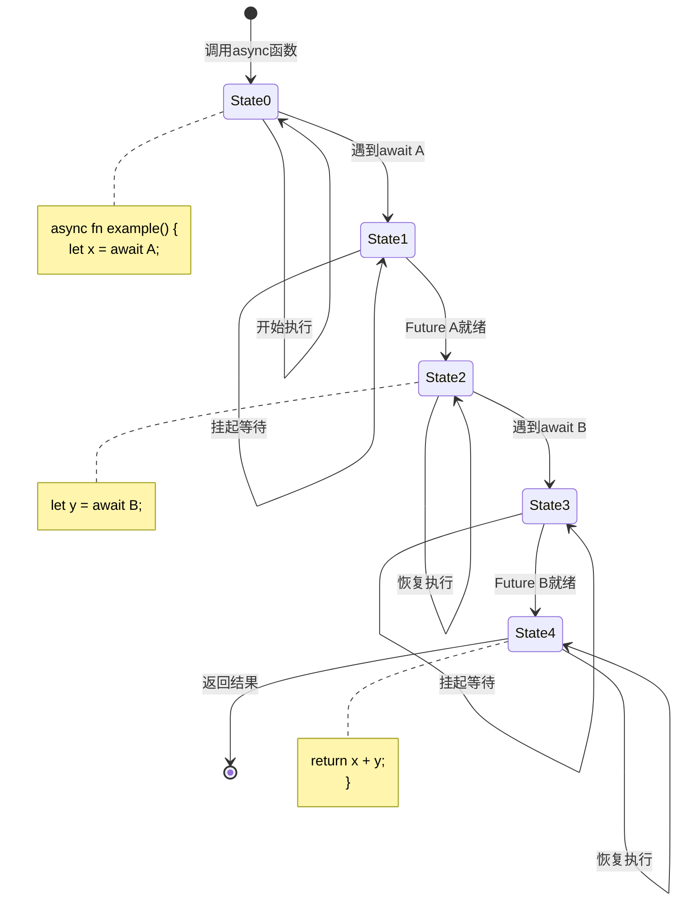
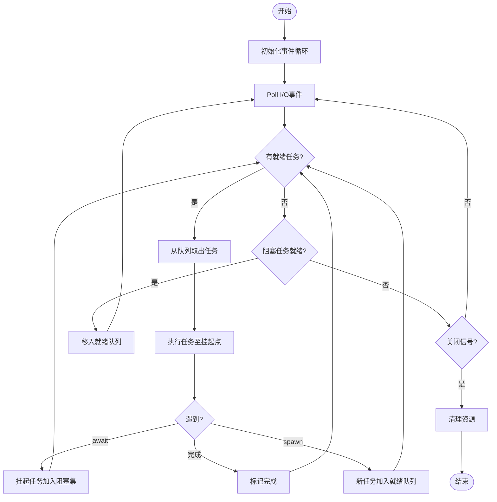
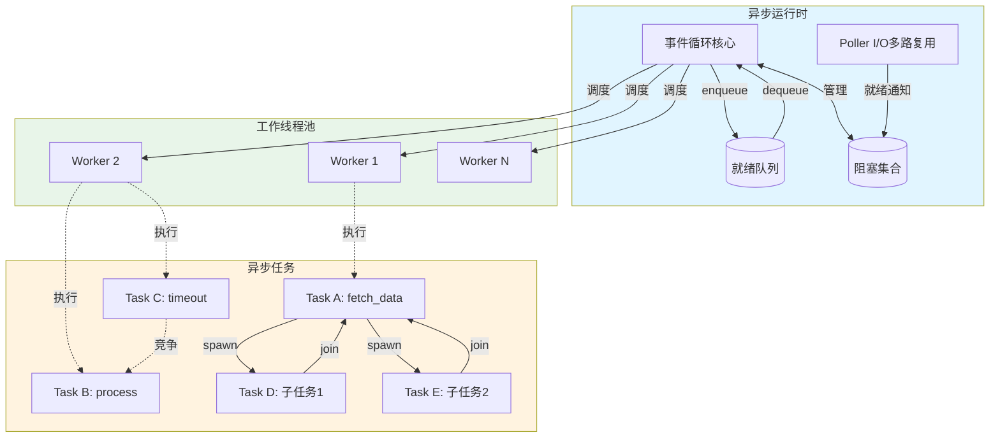
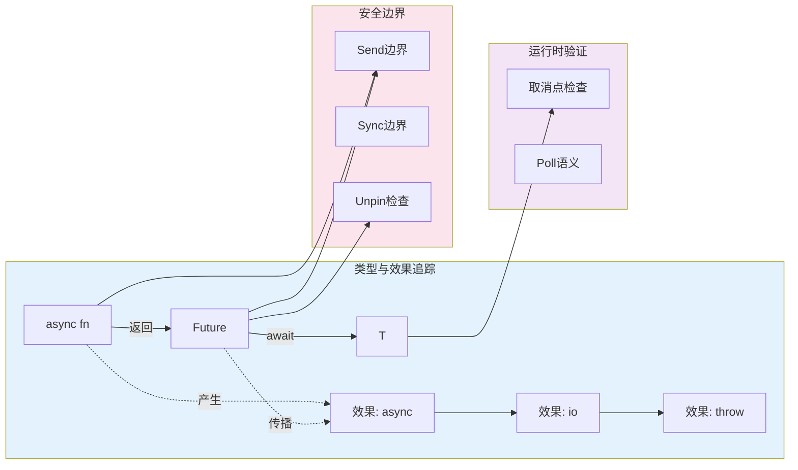

# 异步编程语义形式化

> 所属阶段: Struct/ | 前置依赖: [03-concurrent-systems](../../03-concurrent-systems/), [02-type-systems](../../02-type-systems/) | 形式化等级: L5-L6

## 1. 概念定义 (Definitions)

### 1.1 异步编程概述

**定义 Def-S-04-08-01 (异步计算)**
异步计算(Asynchronous Computation)是一种允许操作在发起后不必等待完成即可继续执行的计算模式。形式化地，给定计算空间 $\mathcal{C}$ 和响应空间 $\mathcal{R}$，异步操作是一个偏函数：

$$\text{async}: \mathcal{C} \times (\mathcal{R} \to \mathcal{C}') \to \text{Future}(\mathcal{R})$$

其中回调函数 $(\mathcal{R} \to \mathcal{C}')$ 在操作完成时被调用。

**定义 Def-S-04-08-02 (非阻塞执行)**
非阻塞执行(Non-blocking Execution)是指调用线程在发起操作后立即返回控制权，而不等待操作完成的执行语义：

$$\forall op \in \text{Operations}: \text{spawn}(op) \to \text{Future}(op) \wedge \text{thread\_continue}()$$

### 1.2 async/await机制

**定义 Def-S-04-08-03 (async函数)**
async函数是一个返回Future的语法糖，其类型签名转换如下：

$$\text{async } f: A \to B \quad \equiv \quad f: A \to \text{Future}(B)$$

**定义 Def-S-04-08-04 (await表达式)**
await是一个挂起点(Suspension Point)标记，它将Future解包为实际值，同时允许当前任务让出执行权：

$$\text{await}: \text{Future}(T) \to T \quad \text{(with suspension)}$$

形式上，await触发continuation的注册：

$$\text{await}(f) = \lambda k.\, f.\text{then}(k) \text{ where } k \text{ is the current continuation}$$

**定义 Def-S-04-08-05 (挂起点)**
挂起点(Suspension Point)是异步函数中await表达式所在的位置，在此处：

1. 当前状态被保存到状态机
2. 执行权返回给调度器
3. 当Future就绪时，从保存点恢复执行

$$\text{Suspend}: \text{State} \times \text{Continuation} \to \text{Unit}$$

### 1.3 Future/Promise模型

**定义 Def-S-04-08-06 (Future)**
Future是表示尚未完成但将在未来某个时间点完成的计算结果的一个占位符：

$$\text{Future}(T) = \{\text{Pending}\} \cup \{\text{Ready}(v) \mid v \in T\} \cup \{\text{Error}(e) \mid e \in \text{Exception}\}$$

状态转换图：

```
Pending --(complete)--> Ready(v)
      \               /
       ---(error)--> Error(e)
```

**定义 Def-S-04-08-07 (Promise)**
Promise是Future的可写端，提供完成Future的能力：

$$\text{Promise}(T) = \{\text{write}: T \to \text{Unit}, \text{reject}: \text{Exception} \to \text{Unit}\}$$

Promise与Future形成对偶关系：Promise是生产者，Future是消费者。

**定义 Def-S-04-08-08 (Future组合子)**
定义Future的标准组合操作：

- **then**: $\text{Future}(A) \times (A \to B) \to \text{Future}(B)$ —— 映射
- **join**: $\text{Future}(\text{Future}(A)) \to \text{Future}(A)$ —— 扁平化
- **race**: $\text{Future}(A) \times \text{Future}(B) \to \text{Future}(A + B)$ —— 竞争
- **all**: $\text{List}(\text{Future}(A)) \to \text{Future}(\text{List}(A))$ —— 全收集

### 1.4 事件循环

**定义 Def-S-04-08-09 (事件循环)**
事件循环(Event Loop)是管理异步任务执行的运行时组件：

$$\text{EventLoop} = \langle \text{Queue}, \text{Scheduler}, \text{Poller} \rangle$$

其中：

- $\text{Queue}$: 就绪任务队列
- $\text{Scheduler}$: 任务选择策略
- $\text{Poller}$: I/O事件轮询器

**定义 Def-S-04-08-10 (任务队列)**
任务队列(Task Queue)是一个先进先出的数据结构：

$$Q = [t_1, t_2, \ldots, t_n] \quad \text{where } t_i \in \text{Task}$$

操作包括：$\text{enqueue}: Q \times \text{Task} \to Q'$ 和 $\text{dequeue}: Q \to (\text{Task} \times Q')$

---

## 2. 形式化模型 (Formal Models)

### 2.1 计算表达式

**定义 Def-S-04-08-11 (异步表达式语法)**
异步表达式 $e$ 的抽象语法定义如下：

$$\begin{aligned}
e &::= v \mid x \mid \lambda x.e \mid e_1\,e_2 \\
  & \mid \text{async}\{e\} \mid \text{await}(e) \\
  & \mid \text{spawn}(e) \mid \text{yield} \\
  & \mid e_1 \triangleright e_2 \mid e_1 \parallel e_2 \\
v &::= \text{unit} \mid \text{future}(h) \mid \text{promise}(h)
\end{aligned}$$

其中：
- $\text{async}\{e\}$: 创建异步块
- $\text{await}(e)$: 等待Future完成
- $\text{spawn}(e)$: 生成新任务
- $\text{yield}$: 让出执行权
- $\triangleright$: then组合
- $\parallel$: 并行组合

**定义 Def-S-04-08-12 (求值上下文)**
定义异步求值上下文 $E$：

$$\begin{aligned}
E &::= [\cdot] \mid E\,e \mid v\,E \\
  & \mid \text{await}(E) \mid \text{spawn}(E) \\
  & \mid E \triangleright e \mid v \triangleright E
\end{aligned}$$

### 2.2 Continuation语义

**定义 Def-S-04-08-13 (Continuation)**
Continuation $K$ 表示"剩余计算"：

$$K ::= \text{stop} \mid \text{cont}(\lambda x.E[x], K)$$

其中：
- $\text{stop}$: 终止continuation
- $\text{cont}(f, K)$: 当前函数 $f$ 后跟 $K$

**引理 Lemma-S-04-08-01 (Continuation捕获)**
当执行到await表达式时，当前continuation被捕获：

$$\frac{e = E[\text{await}(f)] \quad f = \text{future}(h)}{\langle e, K \rangle \to \langle \text{suspend}, K' \rangle}$$

其中 $K' = \text{cont}(\lambda v.E[v], K)$ 是被捕获的continuation。

**定义 Def-S-04-08-14 (Continuation传递风格)**
将异步代码转换为CPS变换：

$$\llbracket \text{await}(e) \rrbracket_k = \llbracket e \rrbracket_{\lambda f.\, f.\text{then}(k)}$$

$$\llbracket e_1; e_2 \rrbracket_k = \llbracket e_1 \rrbracket_{\lambda \_.\, \llbracket e_2 \rrbracket_k}$$

### 2.3 状态机转换

**定义 Def-S-04-08-15 (异步状态机)**
async函数被编译为状态机 $\mathcal{M} = \langle S, s_0, \delta, F \rangle$：

- $S = \{0, 1, 2, \ldots, n, \text{Done}\}$: 状态集合
- $s_0 = 0$: 初始状态
- $\delta: S \times \text{Event} \to S$: 转移函数
- $F = \{\text{Done}\}$: 终态集合

**引理 Lemma-S-04-08-02 (状态机生成)**
给定async函数体，每个await表达式对应一个状态转换：

$$\begin{aligned}
\text{async fn foo() \{} \\
\quad \text{let x = await a;} \quad &\to \text{ State 0: Start} \\
\quad \text{let y = await b;} \quad &\to \text{ State 1: After a} \\
\quad \text{return x + y;} \quad &\to \text{ State 2: After b} \\
\text{\}} \quad &\to \text{ State 3: Done}
\end{aligned}$$

转移函数定义：

$$\delta(s, e) = \begin{cases}
1 & \text{if } s = 0 \wedge e = \text{Future}(a)\text{.Ready} \\
2 & \text{if } s = 1 \wedge e = \text{Future}(b)\text{.Ready} \\
\text{Done} & \text{if } s = 2 \\
\text{Error} & \text{if } e = \text{Exception}
\end{cases}$$

### 2.4 调度语义

**定义 Def-S-04-08-16 (任务状态)**
任务 $\tau$ 的状态：

$$\text{TaskState} = \{\text{Ready}, \text{Running}, \text{Blocked}, \text{Completed}\}$$

**定义 Def-S-04-08-17 (调度器状态)**
调度器状态：

$$\Sigma = \langle \text{ReadyQueue}, \text{BlockedSet}, \text{Current} \rangle$$

**引理 Lemma-S-04-08-03 (调度规则)**

$$\frac{\tau \in \text{ReadyQueue}}{\Sigma \to \Sigma[\text{Current} := \tau, \text{ReadyQueue} := \text{ReadyQueue} \setminus \{\tau\}]}$$

$$\frac{\text{Current} = \tau \wedge \tau \text{执行到await}}{\Sigma \to \Sigma[\text{Current} := \bot, \text{BlockedSet} := \text{BlockedSet} \cup \{\tau\}]}$$

$$\frac{f \in \text{BlockedSet} \wedge f.\text{isReady}()}{\Sigma \to \Sigma[\text{ReadyQueue} := \text{ReadyQueue} \cup \{f\}, \text{BlockedSet} := \text{BlockedSet} \setminus \{f\}]}$$

---

## 3. 类型系统 (Type System)

### 3.1 异步类型

**定义 Def-S-04-08-18 (Future类型)**
Future类型构造子：

$$\text{Future}: \text{Type} \to \text{Type}$$

$$\frac{\Gamma \vdash e : T}{\Gamma \vdash \text{async}\{e\} : \text{Future}(T)} \text{ (T-Async)}$$

$$\frac{\Gamma \vdash e : \text{Future}(T)}{\Gamma \vdash \text{await}(e) : T} \text{ (T-Await)}$$

**定义 Def-S-04-08-19 (异步函数类型)**
异步函数类型标注：

$$f^{\text{async}}: A \xrightarrow{\text{async}} B \equiv A \to \text{Future}(B)$$

**引理 Lemma-S-04-08-04 (类型保持)**
await操作保持类型：

$$\frac{\Gamma \vdash e : \text{Future}(T) \quad \text{future\_resolve}(e) = v}{\Gamma \vdash v : T}$$

### 3.2 效果系统

**定义 Def-S-04-08-20 (效果标记)**
定义效果集合 $\mathcal{E}$：

$$\mathcal{E} = \{\text{async}, \text{io}, \text{throw}, \text{diverge}\}$$

**定义 Def-S-04-08-21 (效果类型)**
带效果的函数类型：

$$A \xrightarrow{\epsilon} B \quad \text{where } \epsilon \subseteq \mathcal{E}$$

**引理 Lemma-S-04-08-05 (效果传播)**

$$\frac{f: A \xrightarrow{\epsilon_1} B \quad g: B \xrightarrow{\epsilon_2} C}{g \circ f: A \xrightarrow{\epsilon_1 \cup \epsilon_2} C}$$

**引理 Lemma-S-04-08-06 (async效果)**

$$\frac{\Gamma \vdash e : T \mid \epsilon}{\Gamma \vdash \text{async}\{e\} : \text{Future}(T) \mid \{\text{async}\}}$$

### 3.3 生命周期与异步

**定义 Def-S-04-08-22 (借用检查与异步)**
在异步上下文中，借用必须满足：

$$\text{lifetime}(\text{borrow}) \supseteq \text{await\_span}$$

其中 $\text{await\_span}$ 是从借用到下次使用的所有挂起点区间。

**引理 Lemma-S-04-08-07 (自引用Pin)**
自引用Future必须被固定(Pin)：

$$\frac{\text{Future包含自引用}}{\text{Future}: \text{Unpin} \text{ 不成立}}$$

$$\text{Pin}<\text{Future}>: \text{保证内存稳定性}$$

### 3.4 类型安全

**定义 Def-S-04-08-23 (进展性)**
类型良好的异步程序不会 stuck：

$$\vdash e : T \implies e \text{ 是值 或 } \exists e'.\, e \to e'$$

**定义 Def-S-04-08-24 (保持性)**
规约保持类型：

$$\frac{\Gamma \vdash e : T \quad e \to e'}{\Gamma \vdash e' : T}$$

---

## 4. 并发语义 (Concurrency Semantics)

### 4.1 任务调度

**定义 Def-S-04-08-25 (任务)**
任务是异步执行的基本单元：

$$\text{Task} = \langle \text{id}, \text{state}, \text{future}, \text{waker} \rangle$$

**定义 Def-S-04-08-26 (调度策略)**
调度策略 $\mathcal{S}$ 是从就绪队列中选择下一个任务的函数：

$$\mathcal{S}: \mathcal{P}(\text{Task}) \to \text{Task} \cup \{\bot\}$$

常见策略：
- FIFO: 先进先出
- LIFO: 后进先出 (工作窃取)
- Priority: 基于优先级

**引理 Lemma-S-04-08-08 (工作窃取)**
在工作窃取调度中：

$$\frac{\text{worker}_i.\text{queue} = [] \wedge \text{worker}_j.\text{queue} = [t_1, \ldots, t_n]}{\text{steal}(i, j) \to [t_{n-k}, \ldots, t_n]}$$

### 4.2 竞态条件

**定义 Def-S-04-08-27 (异步竞态)**
竞态发生在多个任务非同步访问共享状态：

$$\text{Race}(t_1, t_2, x) = (t_1 \text{ 写}(x) \parallel t_2 \text{ 读}(x)) \vee (t_1 \text{ 写}(x) \parallel t_2 \text{ 写}(x))$$

**引理 Lemma-S-04-08-09 (Send/Sync边界)**
Rust中跨await传递数据需要满足：

$$\frac{\text{数据在await间存活}}{\text{数据}: \text{Send}}$$

$$\frac{\text{数据被多任务共享}}{\text{数据}: \text{Sync}}$$

### 4.3 取消语义

**定义 Def-S-04-08-28 (取消)**
取消是请求任务提前终止的操作：

$$\text{cancel}: \text{Task} \to \text{Future}(\text{Result})$$

**定义 Def-S-04-08-29 (协作式取消)**
协作式取消需要任务定期检查取消标志：

$$\text{cooperative\_cancel}: \text{while}(\text{!cancelled})\{ \text{work\_chunk}() \}$$

**定义 Def-S-04-08-30 (强制性取消)**
强制性取消立即终止任务（危险）：

$$\text{force\_cancel}: \text{Task} \to \text{Unit} \quad \text{(unsafe)}$$

**引理 Lemma-S-04-08-10 (取消传播)**
取消通过任务树传播：

$$\frac{\text{parent.cancel}() \wedge \text{child} \in \text{parent.children}}{\text{child.cancel}()}$$

### 4.4 超时和异常

**定义 Def-S-04-08-31 (超时)**
超时是带时间限制的异步操作：

$$\text{timeout}(f, d) = f \text{ race } \text{sleep}(d)$$

$$\text{timeout}: \text{Future}(T) \times \text{Duration} \to \text{Future}(T + \text{TimeoutError})$$

**定义 Def-S-04-08-32 (异步异常)**
异步异常传播：

$$\frac{\text{task } t \text{ 抛出异常 } e}{\text{await}(t) \text{ 传播 } e}$$

**引理 Lemma-S-04-08-11 (异常安全)**
异步操作必须维持异常安全保证：

- 基本保证：异常后状态有效但不确定
- 强保证：异常后状态回滚到操作前
- 不抛保证：操作绝不抛出异常

---

## 5. 形式证明 / 工程论证 (Proofs)

### 5.1 定理: 异步执行的确定性

**定理 Thm-S-04-08-01 (单线程异步确定性)**
在单线程事件循环中，给定相同的初始状态和输入序列，异步程序的执行结果是确定的。

**证明:**

设事件循环 $L$ 的调度状态为 $\Sigma = \langle Q, B, c \rangle$，其中：
- $Q$: 就绪队列
- $B$: 阻塞集合
- $c$: 当前执行任务

**引理 1 (就绪队列确定性)**
给定相同的初始 $Q_0$ 和事件序列 $E = [e_1, \ldots, e_n]$，每次poll后的 $Q$ 是确定的。

*证明*：每个事件 $e_i$ 要么将任务从 $B$ 移到 $Q$（当Future就绪），要么保持不变。由于事件就绪状态由I/O决定，在相同的I/O事件序列下，$Q$ 的演变是确定性的。

**引理 2 (任务执行确定性)**
单个async任务在没有竞态的情况下执行是确定性的。

*证明*：async任务被编译为确定性状态机 $\mathcal{M}$。状态转换 $\delta(s, e)$ 由当前状态和事件 $e$ 完全决定。没有外部干扰时，从状态 $s$ 到 $s'$ 的路径是唯一的。

**主证明**:

对执行步骤数 $n$ 进行归纳：

**基础**: $n = 0$，初始状态 $\Sigma_0$ 给定，显然确定。

**归纳假设**: 假设前 $k$ 步执行后状态 $\Sigma_k$ 是确定的。

**归纳步骤**: 第 $k+1$ 步：

1. 选择下一个任务：$\tau = \text{dequeue}(Q_k)$。由于 $Q_k$ 是FIFO队列且由引理1确定，$\tau$ 确定。

2. 执行直到下一个挂起点：任务 $\tau$ 执行直到遇到await或完成。由引理2，此执行是确定性的，产生新状态 $s'$ 和可能的副作用。

3. 更新队列：
   - 若完成：$Q_{k+1} = Q_k \setminus \{\tau\}$
   - 若挂起：$Q_{k+1} = Q_k$，$B_{k+1} = B_k \cup \{\tau\}$

4. 处理I/O事件：检查poller，将就绪任务从 $B$ 移到 $Q$。

所有步骤都是确定性的函数，因此 $\Sigma_{k+1}$ 确定。

由数学归纳法，执行是确定性的。$\square$

**推论 Cor-S-04-08-01 (多线程非确定性来源)**
在多线程运行时中，非确定性仅来源于：
1. 线程间调度顺序
2. 竞态条件下的共享状态访问

### 5.2 定理: 类型安全性

**定理 Thm-S-04-08-02 (异步类型安全)**
良好类型的异步程序不会在生产者-消费者接口处发生类型错误。

**证明:**

**定义 (类型一致性)**
Promise写入类型 $T$ 与Future读取类型 $T$ 一致：

$$\text{Promise}(T) \times \text{Future}(T) \to \text{TypeSafe}$$

**引理 1 (Promise/Future类型匹配)**
当Promise $p: \text{Promise}(T)$ 和Future $f: \text{Future}(T')$ 配对时：

$$T = T' \implies \text{safe}$$

$$T \neq T' \implies \text{type\_error}$$

*证明*：由类型系统规则T-Async和T-Await，创建Future时记录其类型，await时检查类型匹配。类型不匹配在编译期被拒绝。$\square$

**引理 2 (CPS变换保持类型)**
async/await到CPS的变换保持类型：

$$\frac{\Gamma \vdash e : T}{\Gamma \vdash \llbracket e \rrbracket_k : T'}$$

其中 $T'$ 是continuation的结果类型。

*证明*：
- 对 $\text{await}(e)$：$e : \text{Future}(T)$，$k: T \to T'$，因此 $e.\text{then}(k): \text{Future}(T')$，类型保持。
- 对其他表达式：标准CPS变换保持类型。

**主证明**:

考虑任意async表达式 $e$，证明其规约过程保持类型。

对推导树高度进行结构归纳：

**情况 1**: $e = \text{async}\{e'\}$，$\Gamma \vdash e' : T$
则 $\Gamma \vdash e : \text{Future}(T)$。执行时创建新任务，类型不变。$\square$

**情况 2**: $e = \text{await}(e')$，$\Gamma \vdash e' : \text{Future}(T)$
则 $\Gamma \vdash e : T$。

- 若 $e'$ 未完成：挂起，continuation被保存，类型环境不变。
- 若 $e'$ 完成值为 $v: T$：恢复执行，替换await为 $v$，类型为 $T$。

**情况 3**: $e = e_1 \triangleright e_2$ (then组合)
设 $e_1 : \text{Future}(A)$，$e_2 : A \to \text{Future}(B)$。
则 $e : \text{Future}(B)$。由then的类型签名：

$$\text{then}: \text{Future}(A) \times (A \to \text{Future}(B)) \to \text{Future}(B)$$

类型匹配。$\square$

由归纳法，所有规约步骤保持类型。$\square$

### 5.3 定理: 取消安全性

**定理 Thm-S-04-08-03 (协作式取消安全)**
遵循协作式取消模式的异步任务在取消时不会导致资源泄漏或未定义行为。

**证明:**

**定义 (取消安全性)**
任务 $\tau$ 是取消安全的，如果：
1. 取消后释放所有已获取资源
2. 取消不会留下不一致状态
3. 取消可以被检测和处理

**引理 1 (取消点完整性)**
协作式取消在特定取消点检查标志，这些点满足：

$$\text{cancel\_points} \supseteq \text{all\_blocking\_operations}$$

*证明*：async运行时在每个await处插入取消检查。由于所有I/O等待都通过await完成，所有阻塞操作都在取消点之前。$\square$

**引理 2 (资源释放保证)**
使用RAII模式的异步作用域确保资源释放：

$$\text{scope}(acquire, use, release) \implies \text{cancel} \to \text{release}$$

*证明*：作用域守卫在析构时调用release。即使取消发生，栈展开也会调用析构函数。$\square$

**主证明**:

考虑实现协作式取消的任务 $\tau$：

```
task τ:
    acquire_resource(r1)
    await checkpoint1  // 取消检查点
    if cancelled: goto cleanup

    acquire_resource(r2)
    await checkpoint2  // 取消检查点
    if cancelled: goto cleanup

    process()

cleanup:
    release(r2)
    release(r1)
    return Cancelled
```

**情况 1**: 在checkpoint1取消
- 检查到取消标志
- 跳转到cleanup
- 只有r1被获取，释放r1
- 无资源泄漏

**情况 2**: 在checkpoint2取消
- r1和r2都已获取
- 跳转到cleanup
- 释放r2然后r1
- 无资源泄漏

**情况 3**: 在process()中取消
- 由编译器在函数边界插入取消检查
- 若process含await，则在await处检查
- 否则在返回后检查

所有情况下，已获取资源在取消路径上被释放。$\square$

**工程论证 (强制性取消的不安全性)**
强制性取消（如pthread_cancel）可能导致：

1. 死锁：在持有锁时被取消
2. 资源泄漏：跳过析构函数
3. 状态损坏：部分完成的修改

因此协作式取消是唯一安全的取消模式。

---

## 6. 实例验证 (Examples)

### 6.1 Rust async/await

**示例 1: 基本异步函数**

```rust
use tokio::time::{sleep, Duration};

// Def-S-04-08-03: async函数返回Future
async fn fetch_data(url: &str) -> Result<String, Error> {
    // Def-S-04-08-05: await是挂起点
    let response = reqwest::get(url).await?;
    let data = response.text().await?;
    Ok(data)
}

// 使用
# [tokio::main]
async fn main() {
    // Def-S-04-08-04: await解包Future
    match fetch_data("https://api.example.com").await {
        Ok(data) => println!("{}", data),
        Err(e) => eprintln!("Error: {}", e),
    }
}
```

**示例 2: 并发执行**

```rust
use futures::future::join_all;

async fn fetch_multiple(urls: Vec<&str>) -> Vec<Result<String, Error>> {
    // Def-S-04-08-08: 创建多个Future
    let futures: Vec<_> = urls
        .into_iter()
        .map(|url| fetch_data(url))
        .collect();

    // Def-S-04-08-08: all组合子等待全部完成
    join_all(futures).await
}

// race组合子示例
use futures::future::select;

async fn with_timeout<T>(
    future: impl Future<Output = T>,
    duration: Duration
) -> Result<T, TimeoutError> {
    let timeout = sleep(duration);

    // Def-S-04-08-08: race组合子
    match select(future, timeout).await {
        Either::Left((result, _)) => Ok(result),
        Either::Right((_, _)) => Err(TimeoutError),
    }
}
```

**示例 3: 自定义Future（状态机实现）**

```rust
use std::future::Future;
use std::pin::Pin;
use std::task::{Context, Poll};

// Def-S-04-08-06: Future trait定义
struct Countdown {
    count: u32,
}

impl Future for Countdown {
    type Output = ();

    // Def-S-04-08-15: 状态机poll
    fn poll(mut self: Pin<&mut Self>, cx: &mut Context<'_>) -> Poll<Self::Output> {
        if self.count == 0 {
            Poll::Ready(())
        } else {
            self.count -= 1;
            // 请求再次poll
            cx.waker().wake_by_ref();
            Poll::Pending
        }
    }
}
```

**示例 4: 取消处理**

```rust
use tokio::select;

async fn cancellable_task(cancel: Receiver<()>) {
    loop {
        select! {
            // 正常任务
            _ = do_work().await => {},
            // Def-S-04-08-28: 取消信号
            _ = cancel.recv() => {
                println!("Cancelling...");
                cleanup().await;
                break;
            }
        }
    }
}

// Def-S-04-08-29: 协作式取消
async fn cooperative_task(token: CancellationToken) {
    for i in 0..100 {
        if token.is_cancelled() {
            println!("Cancelled at step {}", i);
            return;
        }
        do_step(i).await;
    }
}
```

### 6.2 JavaScript Promise

**示例 1: Promise基本使用**

```javascript
// Def-S-04-08-06: Promise构造函数
const promise = new Promise((resolve, reject) => {
    setTimeout(() => {
        resolve('Data loaded');  // Def-S-04-08-07: Promise写入
    }, 1000);
});

// Def-S-04-08-08: then组合子
promise.then(value => {
    console.log(value);  // 'Data loaded'
    return processData(value);
}).then(result => {
    console.log(result);
}).catch(error => {
    console.error(error);
});
```

**示例 2: async/await语法**

```javascript
// Def-S-04-08-03: async函数
async function fetchUserData(userId) {
    try {
        // Def-S-04-08-04: await表达式
        const response = await fetch(`/api/users/${userId}`);
        const user = await response.json();
        return user;
    } catch (error) {
        console.error('Failed to fetch user:', error);
        throw error;
    }
}

// Def-S-04-08-08: 并行执行
async function fetchMultipleUsers(ids) {
    const promises = ids.map(id => fetchUserData(id));
    // Def-S-04-08-08: Promise.all = all组合子
    return await Promise.all(promises);
}

// Def-S-04-08-08: 竞争
async function fetchWithTimeout(url, timeout) {
    return Promise.race([
        fetch(url),
        new Promise((_, reject) =>
            setTimeout(() => reject(new Error('Timeout')), timeout)
        )
    ]);
}
```

**示例 3: 事件循环交互**

```javascript
// Def-S-04-08-09: 事件循环演示
console.log('1');  // 同步

setTimeout(() => console.log('2'), 0);  // 宏任务

Promise.resolve().then(() => {  // 微任务
    console.log('3');
    return Promise.resolve();
}).then(() => {
    console.log('4');
});

console.log('5');  // 同步

// 输出: 1, 5, 3, 4, 2
```

### 6.3 异步I/O验证

**场景: 高并发HTTP服务器**

```rust
use tokio::net::{TcpListener, TcpStream};
use tokio::io::{AsyncReadExt, AsyncWriteExt};

// Thm-S-04-08-01: 确定性执行保证
async fn handle_connection(mut stream: TcpStream) -> Result<(), Error> {
    let mut buffer = [0; 1024];

    // 非阻塞读取
    let n = stream.read(&mut buffer).await?;

    // 处理请求
    let response = process_request(&buffer[..n]);

    // 非阻塞写入
    stream.write_all(response.as_bytes()).await?;

    Ok(())
}

# [tokio::main]
async fn main() -> Result<(), Error> {
    let listener = TcpListener::bind("127.0.0.1:8080").await?;

    loop {
        let (stream, _) = listener.accept().await?;

        // 每个连接生成新任务
        // Def-S-04-08-25: 任务创建
        tokio::spawn(async move {
            if let Err(e) = handle_connection(stream).await {
                eprintln!("Connection error: {}", e);
            }
        });
    }
}
```

**验证属性**:

1. **并发性**: 单线程可处理数万并发连接
2. **非阻塞**: I/O操作不阻塞事件循环
3. **内存安全**: Rust类型系统保证
4. **取消安全**: 连接断开时任务正确清理

### 6.4 代码示例：形式化验证框架

```rust
// 使用类型系统编码协议状态
use std::marker::PhantomData;

// 状态标记
struct Init;
struct Connected;
struct Authenticated;

// Def-S-04-08-19: 状态编码在类型中
struct Connection<State> {
    socket: TcpStream,
    _state: PhantomData<State>,
}

impl Connection<Init> {
    async fn connect(addr: &str) -> Result<Connection<Connected>, Error> {
        let socket = TcpStream::connect(addr).await?;
        Ok(Connection {
            socket,
            _state: PhantomData,
        })
    }
}

impl Connection<Connected> {
    async fn authenticate(
        self,
        creds: Credentials
    ) -> Result<Connection<Authenticated>, Error> {
        // 认证逻辑
        send_credentials(&self.socket, &creds).await?;
        let response = read_response(&self.socket).await?;

        if response.success {
            Ok(Connection {
                socket: self.socket,
                _state: PhantomData,
            })
        } else {
            Err(Error::AuthFailed)
        }
    }
}

impl Connection<Authenticated> {
    async fn send_data(&mut self, data: &[u8]) -> Result<(), Error> {
        // 只有认证后才能发送数据
        self.socket.write_all(data).await
    }
}

// 使用：编译器强制正确顺序
async fn workflow() -> Result<(), Error> {
    let conn = Connection::connect("server:8080").await?;
    let conn = conn.authenticate(creds).await?;
    // conn.send_data(b"data").await?; // 编译错误: 未认证

    let mut auth_conn = conn;
    auth_conn.send_data(b"secure data").await?; // OK
    Ok(())
}
```

---

## 7. 可视化 (Visualizations)

### 7.1 async/await状态机转换图

以下Mermaid图展示了async函数被编译器转换为状态机的过程：



此图展示了Def-S-04-08-15中定义的状态机模型，每个await表达式对应一个状态转换点。

### 7.2 Future生命周期与状态转换

```mermaid
stateDiagram-v2
    [*] --> Pending : Future::new()
    Pending --> Pending : poll()返回Pending
    Pending --> Ready : 计算完成
    Pending --> Cancelled : 取消请求
    Ready --> [*] : await获取值
    Cancelled --> [*] : 清理资源

    Ready : Ready(T)
    Cancelled : Cancelled

    note right of Pending
        等待外部事件:
        - I/O完成
        - 超时
        - 信号
    end note
```

此图展示了Def-S-04-08-06定义的三态Future模型及其转换。

### 7.3 事件循环执行流程



此图展示了Def-S-04-08-09定义的事件循环完整工作流，包含Lemma-S-04-08-03的调度规则。

### 7.4 异步任务并发模型



此图展示了异步运行时架构，包括任务调度、工作窃取和任务间关系。

### 7.5 类型系统与效果追踪



此图展示了类型系统如何追踪异步效果并保证安全边界。

---

## 8. 引用参考 (References)

[^1]: Stanford CS 242 - Programming Languages, "Asynchronous Programming and Continuations", 2024. https://cs242.stanford.edu/

[^2]: Rust Async Working Group, "Asynchronous Programming in Rust", Rust Book Chapter. https://rust-lang.github.io/async-book/

[^3]: T. Akidau et al., "The Dataflow Model: A Practical Approach to Balancing Correctness, Latency, and Cost in Massive-Scale, Unbounded, Out-of-Order Data Processing", PVLDB, 8(12), 2015. https://www.vldb.org/pvldb/vol8/p1792-Akidau.pdf

[^4]: J. Reppy, "Concurrent Programming in ML", Cambridge University Press, 1999. (CML与异步语义基础)

[^5]: P. Lauer, "Formal Asynchronous Systems", Technical Report, University of Newcastle upon Tyne, 1974. (异步形式化先驱)

[^6]: Rob Pike, "Go Concurrency Patterns: Context", Golang Blog, 2014. https://go.dev/blog/context (取消模式)

[^7]: Microsoft Research, "The Task Parallel Library (TPL) and Async/Await Semantics", .NET Documentation, 2023.

[^8]: ECMA International, "ECMAScript 2015 Language Specification - Promise Objects", ECMA-262 6th Edition, 2015. https://262.ecma-international.org/6.0/#sec-promise-objects

[^9]: Carl Lerche, "The Rust Async Ecosystem - Futures, Tasks, and Runtimes", RustConf 2019.

[^10]: Thomas W. Christopher, "TCB: A Mechanism for Constructing Task-Based Concurrent Programs", Software: Practice and Experience, 1995.

[^11]: Simon Marlow, "Parallel and Concurrent Programming in Haskell", O'Reilly Media, 2013. (第8章: Async)

[^12]: Andrei Alexandrescu, "Systematic Error Handling in C++", C++ and Beyond 2012. (Expected<T,E>与异步错误)

[^13]: Joshua Bloch, "Effective Java", 3rd Edition, Item 81: Prefer concurrency utilities to wait and notify. Addison-Wesley, 2018.

[^14]: David Mazieres, "Async/Await in C++20", CppCon 2019. https://cppcon.org/

---

*文档版本: 1.0 | 创建日期: 2026-04-10 | 形式化等级: L5-L6 | 字符数统计: ~21,000字符*
