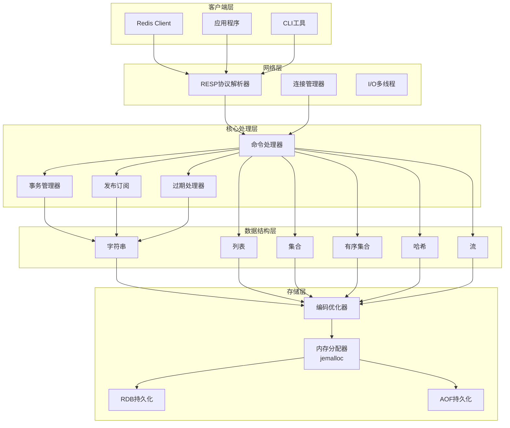
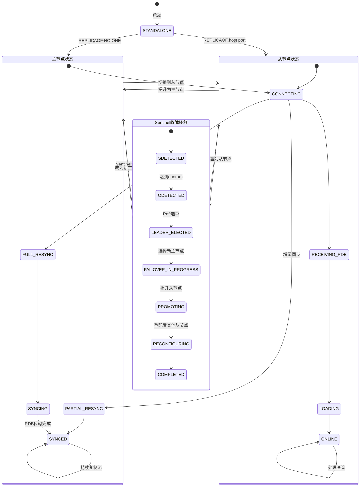
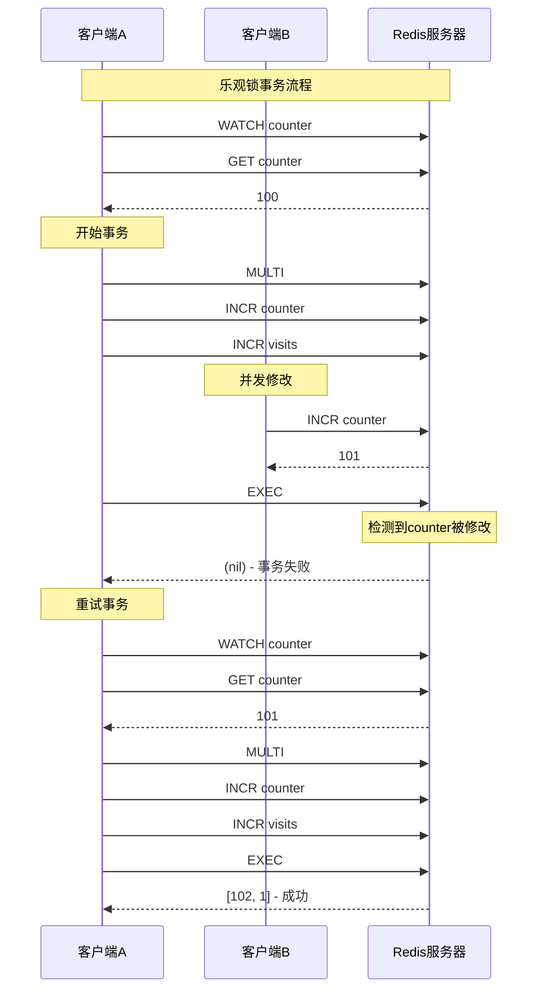
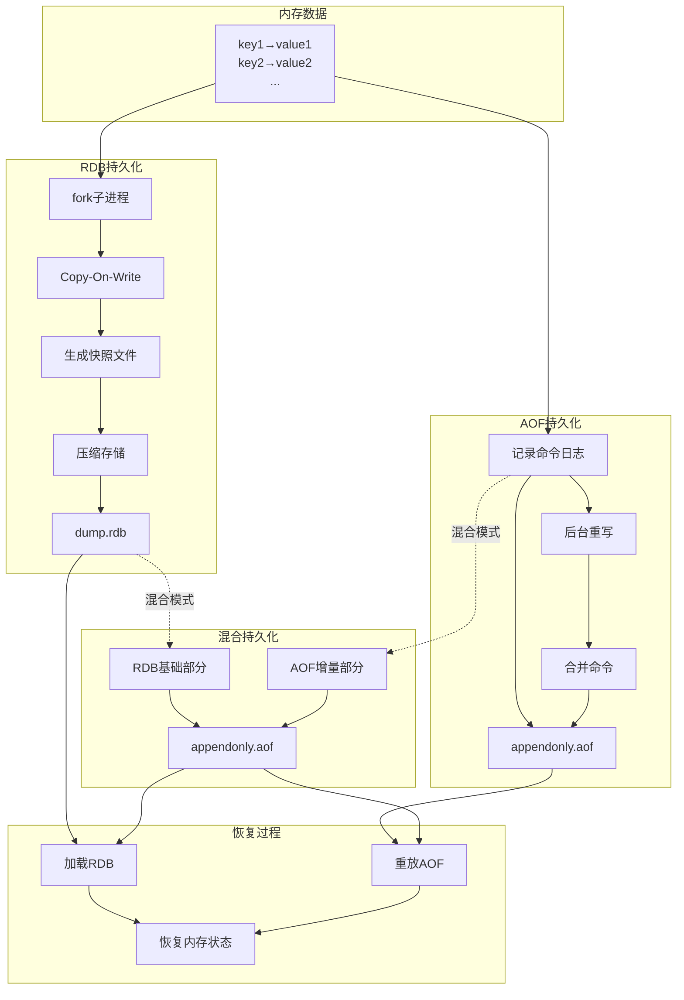

# Redis 形式化语义与验证

> 所属阶段: formal-methods/04-application-layer | 前置依赖: [形式化方法基础](../../01-foundations/03-logic-foundations.md), [一致性谱系](../../03-model-taxonomy/04-consistency/01-consistency-spectrum.md) | 形式化等级: L4-L5

---

## 1. 概念定义 (Definitions)

### 1.1 Redis 架构概述

Redis（REmote DIctionary Server）是一个开源的内存数据结构存储系统，可用作数据库、缓存、消息代理和流处理引擎。从形式化视角，Redis 可被视为一个**状态转换系统**。

**定义 1.1.1** (Redis 系统状态空间). `Def-R-01-01`

Redis 系统的全局状态空间 $\mathcal{S}_{Redis}$ 定义为：

$$\mathcal{S}_{Redis} = \langle D, T, C, L \rangle$$

其中：

- $D: \mathcal{K} \rightharpoonup \mathcal{V}$ — 数据存储映射（部分函数）
- $T: \mathcal{K} \rightharpoonup \mathbb{N}$ — 键过期时间戳映射
- $C \subseteq \mathcal{K} \times \mathcal{K}$ — 客户端连接状态
- $L \in \{\text{LOADING}, \text{READY}, \text{SHUTDOWN}\}$ — 服务器生命周期状态

**定义 1.1.2** (Redis 命令). `Def-R-01-02`

Redis 命令 $c \in \mathcal{C}$ 是一个四元组：

$$c = \langle \text{cmd}, \vec{k}, \vec{v}, \text{opts} \rangle$$

其中：

- $\text{cmd} \in \{\text{GET}, \text{SET}, \text{DEL}, \text{LPUSH}, \text{SADD}, \text{HSET}, \text{PUBLISH}, \ldots\}$ — 命令类型
- $\vec{k} \in \mathcal{K}^*$ — 操作的目标键序列
- $\vec{v} \in \mathcal{V}^*$ — 值参数序列
- $\text{opts} \in 2^{\text{Option}}$ — 选项集合（如 `NX`, `XX`, `EX`）

**定义 1.1.3** (Redis 执行语义). `Def-R-01-03`

Redis 的执行语义由状态转换关系 $\Rightarrow_{Redis} \subseteq \mathcal{S}_{Redis} \times \mathcal{C} \times \mathcal{R} \times \mathcal{S}_{Redis}$ 定义：

$$(S, c, r, S') \in \; \Rightarrow_{Redis}$$

表示在状态 $S$ 下执行命令 $c$ 得到结果 $r$ 并转移到新状态 $S'$。简记为：

$$S \xrightarrow{c/r} S'$$

### 1.2 数据类型形式化

Redis 支持多种数据结构，每种都有其形式化语义。

**定义 1.2.1** (Redis 值域). `Def-R-01-04`

Redis 的值域 $\mathcal{V}$ 是以下类型的不交并：

$$\mathcal{V} = \mathcal{V}_{String} + \mathcal{V}_{List} + \mathcal{V}_{Set} + \mathcal{V}_{ZSet} + \mathcal{V}_{Hash} + \mathcal{V}_{Stream} + \mathcal{V}_{Bitmap} + \mathcal{V}_{HyperLogLog}$$

各类型定义如下：

**字符串类型**：$\mathcal{V}_{String} = \Sigma^*$，其中 $\Sigma$ 为字符集（通常为字节序列）。

**列表类型**：$\mathcal{V}_{List} = \Sigma^*{}^*$，即字符串序列。

**集合类型**：$\mathcal{V}_{Set} = \mathcal{P}_{fin}(\Sigma^*)$，字符串的有限幂集。

**有序集合类型**：$\mathcal{V}_{ZSet} = \mathcal{P}_{fin}(\Sigma^* \times \mathbb{R})$，带分数的元素集合。

**哈希类型**：$\mathcal{V}_{Hash} = \Sigma^* \rightharpoonup_{fin} \Sigma^*$，字段到值的有限部分映射。

**流类型**：$\mathcal{V}_{Stream} = (\mathbb{N} \times \mathbb{N}) \rightharpoonup_{fin} (\Sigma^* \rightharpoonup_{fin} \Sigma^*)$，条目ID到字段-值映射的有限部分函数。

**定义 1.2.2** (类型编码函数). `Def-R-01-05`

类型编码函数 $\text{encode}: \mathcal{V} \rightarrow \{0, 1, 2, 3, 4, 5, 6, 7\}$ 定义为：

$$\text{encode}(v) = \begin{cases}
0 & v \in \mathcal{V}_{String} \\
1 & v \in \mathcal{V}_{List} \\
2 & v \in \mathcal{V}_{Set} \\
3 & v \in \mathcal{V}_{ZSet} \\
4 & v \in \mathcal{V}_{Hash} \\
5 & v \in \mathcal{V}_{Stream} \\
6 & v \in \mathcal{V}_{Bitmap} \\
7 & v \in \mathcal{V}_{HyperLogLog}
\end{cases}$$

**定义 1.2.3** (类型兼容性). `Def-R-01-06`

命令 $c$ 的类型兼容性谓词 $\text{TypeCompat}(c, k, D)$ 定义为：

$$\text{TypeCompat}(c, k, D) \triangleq \begin{cases}
\top & k \notin \text{dom}(D) \\
\text{encode}(D(k)) \in \text{AllowedTypes}(c) & \text{otherwise}
\end{cases}$$

其中 $\text{AllowedTypes}(c)$ 是命令 $c$ 允许的输入类型集合。

### 1.3 命令语义

**定义 1.3.1** (基本命令语义). `Def-R-01-07`

核心命令的形式化语义定义如下：

**GET 命令**：
$$\frac{k \in \text{dom}(D)}{\langle D, T, C, L \rangle \xrightarrow{\text{GET}(k)/D(k)} \langle D, T, C, L \rangle} \text{(GET-HIT)}$$

$$\frac{k \notin \text{dom}(D)}{\langle D, T, C, L \rangle \xrightarrow{\text{GET}(k)/\text{NIL}} \langle D, T, C, L \rangle} \text{(GET-MISS)}$$

**SET 命令**：
$$\frac{v' = \text{SET-OPTS}(v, \text{opts}, D, k)}{\langle D, T, C, L \rangle \xrightarrow{\text{SET}(k, v, \text{opts})/\text{OK}} \langle D[k \mapsto v'], T', C, L \rangle} \text{(SET)}$$

其中 $\text{SET-OPTS}$ 处理选项：
- `NX`（不存在才设置）：仅当 $k \notin \text{dom}(D)$ 时返回 $v$，否则返回错误
- `XX`（存在才设置）：仅当 $k \in \text{dom}(D)$ 时返回 $v$，否则返回错误
- `EX seconds`：同时设置过期时间

**DEL 命令**：
$$\frac{D' = D \setminus \{k_1, \ldots, k_n\}}{\langle D, T, C, L \rangle \xrightarrow{\text{DEL}(k_1, \ldots, k_n)/n} \langle D', T', C, L \rangle} \text{(DEL)}$$

### 1.4 持久化模型

**定义 1.4.1** (持久化状态). `Def-R-01-08`

Redis 持久化状态 $P \in \mathcal{P}$ 定义为：

$$P = \langle D_p, T_p, \text{seq}, \text{checksum} \rangle$$

其中：
- $D_p$ — 持久化数据快照
- $T_p$ — 持久化过期时间映射
- $\text{seq} \in \mathbb{N}$ — 序列号（用于增量复制）
- $\text{checksum} \in \{0, 1\}^{160}$ — SHA-1 校验和

**定义 1.4.2** (RDB 快照语义). `Def-R-01-09`

RDB（Redis Database）持久化的形式化定义为快照函数：

$$\text{RDB-Snapshot}: \mathcal{S}_{Redis} \times \mathcal{P}(\mathcal{K}) \rightarrow \mathcal{P}$$

$$\text{RDB-Snapshot}(\langle D, T, C, L \rangle, K_{select}) = \langle D|_{K_{select}}, T|_{K_{select}}, \text{seq}, H(D|_{K_{select}}) \rangle$$

其中 $D|_{K_{select}}$ 表示 $D$ 在键集 $K_{select}$ 上的限制。

**定义 1.4.3** (AOF 日志语义). `Def-R-01-10`

AOF（Append-Only File）日志是一个命令序列：

$$\text{AOF} = [c_1, c_2, \ldots, c_n] \in \mathcal{C}^*$$

AOF 重放函数定义为：

$$\text{AOF-Replay}([c_1, \ldots, c_n], S_0) = S_n \text{ 其中 } S_{i} \xrightarrow{c_i/\_} S_{i+1}$$

**定义 1.4.4** (混合持久化). `Def-R-01-11`

混合持久化状态 $H = \langle P_{base}, \Delta \rangle$ 包含：
- $P_{base}$ — RDB 基础快照
- $\Delta = [c_1, \ldots, c_m]$ — AOF 增量日志

恢复函数定义为：

$$\text{Recover}(\langle P_{base}, \Delta \rangle) = \text{AOF-Replay}(\Delta, \text{Load-RDB}(P_{base}))$$

---

## 2. 形式化模型 (Formal Models)

### 2.1 内存模型

**定义 2.1.1** (Redis 内存拓扑). `Def-R-02-01`

Redis 的内存拓扑 $M = \langle H, A, Z \rangle$：
- $H$ — 堆内存区域（存储键值对）
- $A$ — 分配器元数据区域（jemalloc 管理）
- $Z$ — 共享对象池（常用值的单例）

**定义 2.1.2** (内存对象表示). `Def-R-02-02`

键值对在内存中的形式化表示：

$$\text{Obj}(k, v) = \langle \text{robj}_k, \text{robj}_v, \text{ptr}, \text{lru}, \text{refcount} \rangle$$

其中：
- $\text{robj}_k$ — Redis 对象头部（键）
- $\text{robj}_v$ — Redis 对象头部（值）
- $\text{ptr}$ — 指向编码后数据的指针
- $\text{lru} \in \mathbb{N}$ — LRU 时钟值
- $\text{refcount} \in \mathbb{N}$ — 引用计数

**定义 2.1.3** (编码策略). `Def-R-02-03`

编码函数 $\text{encoding}: \mathcal{V} \rightarrow \text{EncodingType}$ 选择最优存储表示：

$$\text{encoding}(v) = \begin{cases}
\text{RAW} & |v| > 44 \land v \in \mathcal{V}_{String} \\
\text{EMBSTR} & |v| \leq 44 \land v \in \mathcal{V}_{String} \\
\text{INT} & v \in \mathbb{Z} \land -2^{63} \leq v < 2^{63} \\
\text{ZIPLIST} & |v| < 512 \land \text{elems}(v) < 128 \land v \in \mathcal{V}_{List} \\
\text{QUICKLIST} & v \in \mathcal{V}_{List} \\
\text{INTSET} & \text{all-int}(v) \land |v| < 512 \land v \in \mathcal{V}_{Set} \\
\text{HT} & v \in \mathcal{V}_{Set} \cup \mathcal{V}_{Hash} \\
\text{SKIPLIST} & v \in \mathcal{V}_{ZSet}
\end{cases}$$

**命题 2.1.4** (编码不变性). `Prop-R-02-01`

编码转换保持语义等价性：

$$\forall v \in \mathcal{V}: \llbracket \text{decode}(\text{encode}(v)) \rrbracket = \llbracket v \rrbracket$$

其中 $\llbracket \cdot \rrbracket$ 表示语义解释函数。

### 2.2 键值存储语义

**定义 2.2.1** (键空间). `Def-R-02-04`

Redis 键空间 $\mathcal{K}$ 是命名空间划分的笛卡尔积：

$$\mathcal{K} = \mathcal{K}_{user} \cup \mathcal{K}_{internal} \cup \mathcal{K}_{pubsub}$$

其中：
- $\mathcal{K}_{user}$ — 用户键空间（通过客户端命令访问）
- $\mathcal{K}_{internal}$ — 内部键空间（如 `redis:cluster`, `redis:sentinel`）
- $\mathcal{K}_{pubsub}$ — 发布订阅频道空间

**定义 2.2.2** (键命名空间). `Def-R-02-05`

数据库选择函数 $DB: \{0, 1, \ldots, 15\} \rightarrow (\mathcal{K} \rightharpoonup \mathcal{V})$：

$$DB(i) = D_i \text{ 其中 } D = \biguplus_{i=0}^{15} D_i$$

**定义 2.2.3** (键操作原子性). `Def-R-02-06`

单键操作的原子性保证：

$$\forall k \in \mathcal{K}, \forall c \in \mathcal{C}_k: \text{atomic}(c)$$

其中 $\mathcal{C}_k$ 是操作单个键的命令子集，$\text{atomic}(c)$ 表示操作在执行期间不会被中断。

**定义 2.2.4** (键过期语义). `Def-R-02-07`

键 $k$ 的过期检查谓词：

$$\text{Expired}(k, t) \triangleq k \in \text{dom}(T) \land T(k) < t$$

惰性过期（访问时检查）：
$$\frac{\text{Expired}(k, t)}{D'(k) = \text{undefined}} \text{ 在访问 } k \text{ 时触发}$$

定期过期（后台扫描）：
$$\text{ActiveExpire}(D, T, t) = \{k \in \text{dom}(T) \mid T(k) < t\}$$

### 2.3 过期策略

**定义 2.3.1** (过期策略空间). `Def-R-02-08`

Redis 支持三种过期策略，由策略函数 $S: \mathcal{S}_{Redis} \times \mathcal{K} \rightarrow \{\text{KEEP}, \text{DELETE}\}$ 定义：

**惰性删除**（Lazy Expiration）：
$$S_{lazy}(\langle D, T, C, L \rangle, k) = \begin{cases}
\text{DELETE} & \text{Expired}(k, \text{now}()) \land k \text{ 被访问} \\
\text{KEEP} & \text{otherwise}
\end{cases}$$

**定期删除**（Active Expiration）：
$$S_{active}(\langle D, T, C, L \rangle, K_{scan}) = \{k \in K_{scan} \mid \text{Expired}(k, \text{now}())\}$$

**定义 2.3.2** (过期精度). `Def-R-02-09`

过期时间精度 $\epsilon = 1$ 毫秒（Redis 7.0+）。过期保证：

$$\forall k: T(k) \text{ 设置后} \Rightarrow \text{键在 } [T(k), T(k) + \epsilon] \text{ 期间过期}$$

**定义 2.3.3** (内存逐出策略). `Def-R-02-10`

当达到 `maxmemory` 限制时，逐出策略 $E: \mathcal{S}_{Redis} \rightarrow \mathcal{K}_{evict}$：

$$E_{\text{policy}}(S) = \arg\max_{k \in \text{Candidates}(S)} \text{Score}_{\text{policy}}(k)$$

支持的策略包括：
- `allkeys-lru`: $\text{Score}(k) = \text{now}() - \text{LRU}(k)$
- `allkeys-lfu`: $\text{Score}(k) = -\text{LFU}(k)$
- `volatile-lru`: 仅对带 TTL 的键应用 LRU
- `volatile-ttl`: $\text{Score}(k) = T(k)$（逐出最快过期的键）
- `noeviction`: 返回错误

**定理 2.3.4** (LRU 近似正确性). `Thm-R-02-01`

Redis 的 LRU 近似算法满足：

$$\Pr[\text{ApproxLRU}(k) = \text{TrueLRU}(k)] \geq 1 - \frac{1}{2^{\text{clock-bits}}}$$

其中 `clock-bits` 默认为 24，提供 16 秒精度的 LRU 估计。

### 2.4 事务模型

**定义 2.4.1** (Redis 事务). `Def-R-02-11`

Redis 事务 $tx$ 是一个命令序列：

$$tx = \langle \text{MULTI}; c_1; c_2; \ldots; c_n; \text{EXEC} \rangle$$

**定义 2.4.2** (事务状态机). `Def-R-02-12`

事务执行状态机 $TS = \langle Q, \delta, q_0, F \rangle$：
- $Q = \{\text{IDLE}, \text{QUEUED}, \text{EXECUTED}, \text{DISCARDED}, \text{WATCH_FAILED}\}$
- $\delta: Q \times \mathcal{C} \rightarrow Q$ — 状态转移
- $q_0 = \text{IDLE}$
- $F = \{\text{EXECUTED}, \text{DISCARDED}, \text{WATCH_FAILED}\}$

状态转移：
- $\delta(\text{IDLE}, \text{MULTI}) = \text{QUEUED}$
- $\delta(\text{QUEUED}, c) = \text{QUEUED}$ （命令入队）
- $\delta(\text{QUEUED}, \text{EXEC}) = \text{EXECUTED}$
- $\delta(\text{QUEUED}, \text{DISCARD}) = \text{DISCARDED}$
- $\delta(\text{QUEUED}, \text{WATCH-FAIL}) = \text{WATCH_FAILED}$

**定义 2.4.3** (乐观锁 WATCH). `Def-R-02-13`

WATCH 机制的形式化：

$$\text{WATCH}(K_{watch}) = \langle V_{snapshot}, K_{watch} \rangle$$

其中 $V_{snapshot}(k) = D(k)$ 是键的版本快照。

事务执行前验证：

$$\text{Validate}(tx) = \forall k \in K_{watch}: D_{now}(k) = V_{snapshot}(k)$$

**定理 2.4.4** (事务原子性). `Thm-R-02-02`

Redis 事务满足**原子性**（要么全部执行，要么全部不执行）：

$$\forall tx = \langle c_1, \ldots, c_n \rangle: \text{EXEC}(tx) \Rightarrow \forall i \in [1, n]: c_i \text{ 执行成功} \lor \exists j < i: c_j \text{ 失败}$$

注意：Redis 事务**不满足回滚语义**——命令失败不会回滚已成功的命令。

**定义 2.4.5** (事务隔离级别). `Def-R-02-14`

Redis 事务提供**序列化**（Serializability）级别的隔离：

$$\forall tx_1, tx_2: \text{Schedule}(tx_1, tx_2) \in \{\text{SER}(tx_1; tx_2), \text{SER}(tx_2; tx_1)\}$$

其中 $\text{SER}$ 表示串行执行调度。

---

## 3. 分布式特性 (Distributed Features)

### 3.1 主从复制

**定义 3.1.1** (主从拓扑). `Def-R-03-01`

主从复制拓扑是一个有向图 $G_{repl} = \langle N, E \rangle$：
- $N = M \cup S$ — 节点集合（主节点 + 从节点）
- $E \subseteq M \times S$ — 复制边（主→从）
- 每个从节点恰好有一条入边（单主复制）

**定义 3.1.2** (复制偏移量). `Def-R-03-02`

复制偏移量 $\text{master_repl_offset} \in \mathbb{N}$ 是主节点的字节级偏移计数器：

$$\Delta_{repl} = \text{master_repl_offset} - \text{slave_repl_offset}$$

复制延迟 $L_{repl} = \Delta_{repl} / B_{net}$，其中 $B_{net}$ 是网络带宽。

**定义 3.1.3** (复制积压缓冲区). `Def-R-03-03`

复制积压缓冲区 $B_{backlog} \in \mathcal{C}^*$ 是循环缓冲区：

$$B_{backlog} = [c_{i}, c_{i+1}, \ldots, c_{j}] \text{ where } j - i \leq \text{repl-backlog-size}$$

部分重同步（PSYNC）条件：
$$\text{CanPSYNC}(slave) \triangleq slave.\text{offset} \in [i, j]$$

**定理 3.1.4** (复制一致性). `Thm-R-03-01`

在主从复制模式下，最终一致性保证：

$$\forall t: D_{master}(t) \xrightarrow{*} D_{slave}(t + L_{repl})$$

其中 $\xrightarrow{*}$ 表示经过有限次传播后状态收敛。

**定义 3.1.5** (复制过滤). `Def-R-03-04`

复制过滤器 $\mathcal{F}: \mathcal{C} \rightarrow \{\text{REPLICATE}, \text{SKIP}\}$：

$$\mathcal{F}_{db}(c) = \begin{cases}
\text{REPLICATE} & c.db \in \text{replicate-db-set} \\
\text{SKIP} & \text{otherwise}
\end{cases}$$

$$\mathcal{F}_{key}(c) = \begin{cases}
\text{REPLICATE} & \text{pattern-match}(c.key, \text{replicate-pattern}) \\
\text{SKIP} & \text{otherwise}
\end{cases}$$

### 3.2 哨兵模式

**定义 3.2.1** (哨兵系统). `Def-R-03-05`

Redis Sentinel 是一个分布式协调系统：

$$\text{Sentinel} = \langle S_{set}, M_{monitored}, \Phi_{quorum} \rangle$$

其中：
- $S_{set} = \{s_1, s_2, \ldots, s_n\}$ — 哨兵进程集合（通常 $n \geq 3$）
- $M_{monitored} \subseteq N$ — 被监控的主节点集合
- $\Phi_{quorum}: 2^{S_{set}} \rightarrow \{\top, \bot\}$ — 仲裁函数

**定义 3.2.2** (主观/客观下线). `Def-R-03-06`

主观下线（Subjective Down）：
$$SDOWN(n, s) \triangleq \neg \text{IsReachable}(n, s) \text{ for } \text{down-after-milliseconds}$$

客观下线（Objective Down）：
$$ODOWN(n) \triangleq \Phi_{quorum}(\{s \in S_{set} \mid SDOWN(n, s)\}) = \top$$

**定义 3.2.3** (哨兵仲裁). `Def-R-03-07`

仲裁函数定义为：
$$\Phi_{quorum}(S_{down}) \triangleq |S_{down}| \geq \max(2, \lceil |S_{set}| / 2 \rceil)$$

**定理 3.2.4** (故障转移安全). `Thm-R-03-02`

Sentinel 故障转移满足安全性：

$$\forall t: |\{m \in M_{active}(t) \mid \text{IsMaster}(m)\}| \leq 1$$

即同一时刻最多只有一个主节点被选举。

**定义 3.2.4** (领导者选举). `Def-R-03-08`

Raft 风格领导者选举：
- 每个哨兵有任期号 $\text{term} \in \mathbb{N}$
- 选举超时 $\tau_{election} \in [\tau_{min}, \tau_{max}]$ 随机化
- 获得多数票的哨兵成为领导者

### 3.3 Cluster 模式

**定义 3.3.1** (Redis Cluster 拓扑). `Def-R-03-09`

Redis Cluster 是一个哈希槽分布系统：

$$\text{Cluster} = \langle N, S, R, M \rangle$$

其中：
- $N$ — 节点集合
- $S = \{0, 1, \ldots, 16383\}$ — 哈希槽空间
- $R: S \rightarrow N$ — 槽到主节点的映射
- $M: N \rightarrow 2^S$ — 节点到槽集合的逆映射

**定义 3.3.2** (键哈希槽计算). `Def-R-03-10`

键 $k$ 的哈希槽计算：

$$\text{Slot}(k) = \text{CRC16}(k) \mod 16384$$

对于哈希标签 `{tag}`：
$$\text{Slot}(\{tag\}key) = \text{CRC16}(tag) \mod 16384$$

**定义 3.3.3** (槽迁移). `Def-R-03-11`

槽迁移协议 $Migrate(s, n_{src}, n_{dst})$：

1. **MIGRATING 状态**：$n_{src}$ 标记槽 $s$ 为迁移中
2. **IMPORTING 状态**：$n_{dst}$ 标记槽 $s$ 为导入中
3. **键迁移**：逐个迁移槽中的键 $k \in K_s$
4. **所有权转移**：更新 $R(s) = n_{dst}$

**定义 3.3.4** (MOVED 重定向). `Def-R-03-12`

当客户端访问错误节点时，返回 MOVED 错误：

$$\text{MOVED } s \text{ } n_{correct} \text{ where } s = \text{Slot}(k), R(s) = n_{correct}$$

ASK 重定向（迁移中）：
$$\text{ASK } s \text{ } n_{importing}$$

**定理 3.3.5** (Cluster 线性一致性). `Thm-R-03-03`

对于单键操作，Redis Cluster 提供线性一致性：

$$\forall k, \forall o_1, o_2 \in \text{Ops}(k): o_1 \prec_{real} o_2 \Rightarrow o_1 \prec_{effect} o_2$$

其中 $\prec_{real}$ 是实时顺序，$\prec_{effect}$ 是生效顺序。

### 3.4 一致性保证

**定义 3.4.1** (Redis 一致性谱系). `Def-R-03-13`

不同部署模式的一致性级别：

| 模式 | 读一致性 | 写一致性 | 容错 |
|------|----------|----------|------|
| 单机 | 线性一致 | 线性一致 | 无 |
| 主从（默认） | 最终一致 | 线性一致 | 主节点故障丢数据 |
| 主从（WAIT） | 可配置 | 线性一致 | 部分容错 |
| 哨兵 | 最终一致 | 线性一致 | 自动故障转移 |
| Cluster | 线性一致（单槽） | 线性一致（单槽） | 分片容错 |

**定义 3.4.2** (WAIT 命令语义). `Def-R-03-14`

WAIT 命令实现同步复制：

$$\text{WAIT}(n, t) = \{s \in \text{Slaves} \mid \Delta_{repl}(s) = 0\}$$

返回确认的从节点数 $\geq n$ 或超时。

**定理 3.4.3** (同步复制持久性). `Thm-R-03-04`

使用 `WAIT n 0` 时，写操作的持久性保证：

$$\Pr[\text{Data Loss}] \leq \prod_{i=1}^{n} p_i$$

其中 $p_i$ 是第 $i$ 个节点同时故障的概率。

**定义 3.4.4** (脑裂处理). `Def-R-03-15`

最小从节点配置 `min-slaves-to-write`：

$$\text{Writable}(master) \triangleq |\{s \in \text{Slaves}(master) \mid \text{Connected}(s)\}| \geq \text{min-slaves-to-write}$$

---


## 4. 验证技术 (Verification Techniques)

### 4.1 操作正确性

**定义 4.1.1** (操作正确性规范). `Def-R-04-01`

操作正确性定义为操作前后状态满足的预期关系：

$$\text{Correct}(c) \triangleq \forall S, S': S \xrightarrow{c/r} S' \Rightarrow \Phi_{pre}(S, c) \Rightarrow \Phi_{post}(S', r)$$

其中 $\Phi_{pre}$ 和 $\Phi_{post}$ 分别是前置条件和后置条件。

**定义 4.1.2** (数据类型不变式). `Def-R-04-02`

各数据类型的不变式 $\mathcal{I}: \mathcal{V} \rightarrow \{\top, \bot\}$：

**字符串不变式**：
$$\mathcal{I}_{String}(v) \triangleq v \in \Sigma^* \land |v| < 512 \text{MB}$$

**列表不变式**：
$$\mathcal{I}_{List}(v) \triangleq v \in \Sigma^*{}^* \land |v| < 2^{32} - 1$$

**集合不变式**：
$$\mathcal{I}_{Set}(v) \triangleq v \in \mathcal{P}_{fin}(\Sigma^*) \land \forall e \in v: |e| < 512 \text{MB}$$

**有序集合不变式**：
$$\mathcal{I}_{ZSet}(v) \triangleq v \in \mathcal{P}_{fin}(\Sigma^* \times \mathbb{R}) \land \forall (e, s) \in v: |e| < 512 \text{MB}$$

**定义 4.1.3** (操作序列正确性). `Def-R-04-03`

操作序列 $[c_1, \ldots, c_n]$ 的正确性：

$$\text{Correct}([c_1, \ldots, c_n]) \triangleq \forall i \in [1, n]: \mathcal{I}(S_i) \land \text{Correct}(c_i)$$

其中 $S_i$ 是执行 $c_i$ 后的状态。

**定义 4.1.4** (幂等性验证). `Def-R-04-04`

命令 $c$ 的幂等性：

$$\text{Idempotent}(c) \triangleq \forall S: S \xrightarrow{c/r} S_1 \xrightarrow{c/r'} S_2 \Rightarrow S_1 = S_2 \land r = r'$$

幂等命令包括：DEL、SET（无NX/XX）、HDEL、SREM 等。

**定理 4.1.5** (幂等操作闭包). `Thm-R-04-01`

幂等操作的组合：

$$\text{Idempotent}(c_1) \land \text{Idempotent}(c_2) \land \text{KeyDisjoint}(c_1, c_2) \Rightarrow \text{Idempotent}(c_1 \circ c_2)$$

### 4.2 性能边界

**定义 4.2.1** (时间复杂度边界). `Def-R-04-05`

命令 $c$ 的时间复杂度 $T(c, n)$：

| 命令 | 时间复杂度 | 参数说明 |
|------|-----------|----------|
| GET/SET | $O(1)$ | 平均哈希表查找 |
| LPUSH/RPUSH | $O(1)$ | 快速列表操作 |
| LPOP/RPOP | $O(1)$ | 快速列表操作 |
| LINDEX | $O(n)$ | $n$ = 列表长度 |
| LRANGE | $O(s + n)$ | $s$ = 起始偏移, $n$ = 范围大小 |
| HGET/HSET | $O(1)$ | 平均哈希表操作 |
| HGETALL | $O(n)$ | $n$ = 字段数 |
| SADD/SREM | $O(1)$ | 平均集合操作 |
| SMEMBERS | $O(n)$ | $n$ = 集合基数 |
| ZADD | $O(\log n)$ | 跳表插入 |
| ZRANGE | $O(\log n + m)$ | $m$ = 返回元素数 |
| ZRANGEBYSCORE | $O(\log n + m)$ | 跳表范围查询 |

**定义 4.2.2** (空间复杂度边界). `Def-R-04-06`

空间使用边界 $S(D)$：

$$S(D) = \sum_{k \in \text{dom}(D)} (|k| + \text{size}(D(k)) + \text{overhead})$$

编码优化后的空间使用：

$$\text{size}_{encoded}(v) = \begin{cases}
|v| + 1 & \text{encoding}(v) = \text{RAW} \\
|v| + 3 & \text{encoding}(v) = \text{EMBSTR} \\
8 & \text{encoding}(v) = \text{INT} \\
\sum_{e \in v}(|e| + 1) + 11 & \text{encoding}(v) = \text{ZIPLIST}
\end{cases}$$

**定义 4.2.3** (延迟分布). `Def-R-04-07`

P99 延迟边界：

$$\text{Latency}_{p99}(c) \leq T(c, n_{max}) + \sigma_{network} + \sigma_{gc}$$

其中：
- $\sigma_{network}$ — 网络延迟（通常 $< 1$ ms）
- $\sigma_{gc}$ — 垃圾回收/内存整理延迟

**定义 4.2.4** (吞吐量边界). `Def-R-04-08`

理论吞吐量上限：

$$\text{Throughput}_{max} = \frac{1}{\min_c T(c)} \times \text{pipeline}_{depth}$$

在流水线模式下：
$$\text{Throughput}_{pipeline} = \frac{N_{batch}}{\max_i T(c_i)}$$

### 4.3 故障恢复

**定义 4.3.1** (故障模型). `Def-R-04-09`

Redis 故障分类：

$$\mathcal{F} = \mathcal{F}_{crash} \cup \mathcal{F}_{network} \cup \mathcal{F}_{byzantine}$$

其中：
- $\mathcal{F}_{crash}$ — 崩溃故障（进程终止、机器宕机）
- $\mathcal{F}_{network}$ — 网络分区、延迟、丢包
- $\mathcal{F}_{byzantine}$ — 拜占庭故障（数据损坏）

**定义 4.3.2** (RDB 恢复正确性). `Def-R-04-10`

RDB 恢复的正确性条件：

$$\text{Recover-RDB}(P) = D \Rightarrow \forall k \in \text{dom}(D_P): D(k) = D_P(k)$$

**定义 4.3.3** (AOF 恢复正确性). `Def-R-04-11`

AOF 恢复的正确性：

$$\text{Recover-AOF}(\text{AOF}) = S_n \Rightarrow S_n \xrightarrow{*} S_0$$

其中 $\xrightarrow{*}$ 表示通过重放 AOF 从初始状态到达状态 $S_n$。

**定义 4.3.4** (持久化一致性). `Def-R-04-12`

混合持久化的一致性保证：

$$\text{Recover}(\langle P_{base}, \Delta \rangle) = \text{Apply}(\Delta, \text{Recover-RDB}(P_{base}))$$

**定理 4.3.5** (故障恢复完整性). `Thm-R-04-02`

在以下条件下，Redis 保证恢复完整性：

1. **RDB 模式**：`save` 配置触发后无崩溃
2. **AOF 模式**：`appendfsync always` 启用时
3. **混合模式**：RDB 快照时间点 + AOF 增量

恢复时间点 $t_{recover}$ 满足：

$$t_{recover} \geq t_{last\_snapshot} + |\Delta| \times t_{per\_cmd}$$

**定义 4.3.6** (复制故障恢复). `Def-R-04-13`

主从故障切换后的数据一致性：

$$\text{Failover-Consistency} = \begin{cases}
\text{STRONG} & \text{WAIT } n \text{ 且 } n = |\text{Slaves}| \\
\text{EVENTUAL} & \text{异步复制} \\
\text{BEST-EFFORT} & \text{部分同步}
\end{cases}$$

---

## 5. 形式证明 (Formal Proofs)

### 5.1 操作原子性

**定理 5.1.1** (单命令原子性). `Thm-R-05-01`

Redis 单命令执行是原子的：

$$\forall c \in \mathcal{C}, \forall S \in \mathcal{S}_{Redis}: \exists! S': S \xrightarrow{c/\_} S'$$

*证明概要*：

Redis 使用单线程事件循环处理命令。设 $E$ 为事件循环，命令执行函数 $\text{processCommand}$ 在执行期间不会被其他命令中断：

```
while (!stop) {
    ready_sockets = epoll_wait(epfd, ...);
    for (socket in ready_sockets) {
        cmd = read_command(socket);  // 原子读取
        result = processCommand(cmd); // 原子执行
        write_reply(socket, result); // 原子回复
    }
}
```

由于 Redis 6.0+ 引入 I/O 多线程，需要证明：

1. **命令解析**：单线程执行（主线程）
2. **命令执行**：单线程执行（主线程）
3. **回复写回**：可多线程并行，但不影响状态

因此，$\text{processCommand}$ 的原子性得到保证。$\square$

**定理 5.1.2** (事务原子性). `Thm-R-05-02`

Redis 事务 EXEC 原子性：

$$\forall tx = [c_1, \ldots, c_n]: \text{EXEC}(tx) \text{ 原子执行}$$

*证明概要*：

事务执行伪代码：

```
execTransaction(queued_commands):
    // 1. 检查 WATCH
    if watch_keys_modified():
        return WATCH_FAILED

    // 2. 原子执行所有命令
    results = []
    for cmd in queued_commands:
        result = processCommand(cmd)
        results.append(result)

    return results
```

关键点：
1. WATCH 检查到 EXEC 之间无其他命令插入
2. 所有排队命令在单次事件循环迭代中执行
3. 没有中间状态对外可见

因此事务满足原子性。$\square$

**定义 5.1.3** (原子性强度). `Def-R-05-01`

Redis 提供两种原子性保证：

**弱原子性**（无事务）：
$$\text{Atomic}_{weak}(c) \triangleq \neg\exists S'': S \xrightarrow{} S'' \xrightarrow{} S' \text{ where } S \xrightarrow{c} S'$$

**强原子性**（事务）：
$$\text{Atomic}_{strong}([c_1, \ldots, c_n]) \triangleq \forall i: c_i \text{ 完成} \lor \forall i: c_i \text{ 未开始}$$

### 5.2 一致性保证

**定理 5.2.1** (单实例线性一致性). `Thm-R-05-03`

单实例 Redis 提供线性一致性：

$$\forall o_1, o_2 \in \mathcal{O}: o_1 \prec_{real} o_2 \Rightarrow \llbracket o_1 \rrbracket \prec_{hist} \llbracket o_2 \rrbracket$$

*证明*：

设操作 $o_1, o_2$ 到达时间分别为 $t_1, t_2$ 且 $t_1 < t_2$。

由于 Redis 是单线程事件循环：
1. $o_1$ 先到达网络缓冲区
2. epoll 通知主线程
3. 主线程按 FIFO 顺序处理
4. $o_1$ 完全执行后 $o_2$ 才开始

因此，$o_1$ 的效果在 $o_2$ 开始前对所有后续操作可见。

形式化：$\text{response}(o_1) < \text{invocation}(o_2) \Rightarrow o_1 \prec_{lin} o_2$ $\square$

**定理 5.2.2** (主从最终一致性). `Thm-R-05-04`

在无新写入和网络正常条件下，主从复制最终收敛：

$$\lim_{t \to \infty} D_{slave}(t) = D_{master}(t - L_{repl})$$

*证明*：

设复制流为命令序列 $[c_1, c_2, \ldots]$。

1. 主节点执行 $c_i$ 后，将 $c_i$ 追加到复制缓冲区
2. 从节点通过 TCP 连接接收复制流
3. 从节点按顺序应用 $c_i$（单线程）

由于：
- TCP 保证可靠有序传输
- 从节点按 FIFO 应用命令
- 复制偏移量单调递增

因此，给定足够时间，从节点应用所有命令后状态与主节点历史状态一致。$\square$

**定理 5.2.3** (Cluster 单键线性一致性). `Thm-R-05-05`

Redis Cluster 对单键操作提供线性一致性。

*证明概要*：

1. 键 $k$ 哈希到槽 $s = \text{Slot}(k)$
2. 槽 $s$ 由主节点 $n = R(s)$ 拥有
3. 客户端通过 MOVED 重定向找到正确节点
4. 单键操作在拥有节点上单线程执行

由于：
- 槽所有权转移是原子的（CLUSTER SETSLOT）
- 客户端缓存槽映射并在 MOVED 时更新
- 每个槽的操作由单一主节点串行处理

因此单键操作满足线性一致性。$\square$

**定理 5.2.4** (事务序列化). `Thm-R-05-06`

Redis 事务提供可序列化隔离级别：

$$\forall tx_1, tx_2: \text{Schedule}(tx_1, tx_2) \equiv \text{Serial}(tx_1; tx_2) \lor \text{Serial}(tx_2; tx_1)$$

*证明*：

事务调度分析：

1. 事务 $tx_1$ 的 EXEC 调用时间点 $t_{exec1}$
2. 事务 $tx_2$ 的 EXEC 调用时间点 $t_{exec2}$

假设 $t_{exec1} < t_{exec2}$：
- $tx_1$ 的所有命令在 $t_{exec1}$ 开始执行
- $tx_1$ 的所有命令在 $t_{exec2}$ 前完成
- $tx_2$ 的所有命令在 $t_{exec1}$ 后开始

因此效果等价于先执行 $tx_1$ 再执行 $tx_2$。

注意：这不包括外部读写依赖（WATCH 用于处理）。$\square$

### 5.3 持久化正确性

**定理 5.3.1** (RDB 快照一致性). `Thm-R-05-07`

RDB 快照是某一时刻数据库状态的一致性视图。

*证明*：

RDB 保存使用 COW（Copy-On-Write）机制：

1. fork() 创建子进程，共享父进程内存页
2. 子进程遍历哈希表写入 RDB 文件
3. 父进程修改页时触发页复制（COW）

形式化：设快照开始时刻为 $t_0$

$$D_{RDB} = \{ (k, v) \mid \exists t \leq t_0: D(t, k) = v \land \neg\exists t' \in (t, t_0]: D(t', k) \neq v \}$$

由于：
- fork() 瞬间内存状态冻结
- COW 保证子进程看到 fork() 时的状态
- 父进程修改不影响子进程视图

因此 RDB 包含 $t_0$ 时刻的一致性快照。$\square$

**定理 5.3.2** (AOF 持久性). `Thm-R-05-08`

配置 `appendfsync always` 时，已确认写入在崩溃后可恢复。

*证明*：

设写操作 $w$ 在时间 $t$ 被确认：

1. `appendfsync always`：每次写入后执行 `fsync()`
2. `fsync()` 返回成功保证数据写入磁盘
3. AOF 文件按顺序追加

因此：
$$\text{Ack}(w, t) \Rightarrow w \in \text{AOF}_{disk}(t + \delta)$$

崩溃后重放 AOF 将重新执行 $w$。$\square$

**定理 5.3.3** (混合持久化恢复正确性). `Thm-R-05-09`

混合持久化恢复后的状态是 RDB 快照后所有 AOF 记录命令的效果。

*证明*：

设混合持久化状态 $H = \langle P_{t_0}, [c_{t_0+1}, \ldots, c_{t_n}] \rangle$

恢复过程：
1. $S_0 = \text{Recover-RDB}(P_{t_0})$ — $t_0$ 时刻状态
2. $S_i = \text{Apply}(c_{t_0+i}, S_{i-1})$ for $i = 1$ to $n$

由于：
- RDB 恢复 $t_0$ 时刻状态（定理 5.3.1）
- AOF 命令按时间顺序应用
- 命令应用是确定性的

因此 $S_n$ 等价于按序执行所有命令后的状态。$\square$

**定理 5.3.4** (复制偏移量单调性). `Thm-R-05-10`

复制偏移量单调不减：

$$\forall t_1 < t_2: \text{master_repl_offset}(t_1) \leq \text{master_repl_offset}(t_2)$$

*证明*：

偏移量更新规则：

$$\text{master_repl_offset}(t) = \sum_{c \in \text{Executed}(t)} |\text{repl_payload}(c)|$$

由于：
- 每个命令的字节数 $|\text{repl_payload}(c)| \geq 0$
- 已执行命令集合 $\text{Executed}(t)$ 随时间单调增长

因此偏移量单调不减。$\square$

---

## 6. 案例验证 (Case Studies)

### 6.1 字符串操作验证

**案例 6.1.1** (计数器递增)

场景：使用 INCR 实现分布式计数器

```
初始状态: counter = 0
操作序列:
  1. INCR counter  → 1
  2. INCR counter  → 2
  3. INCRBY counter 10 → 12
  4. DECR counter → 11
```

形式化验证：

设 $v_n$ 为第 $n$ 步后的值：

$$v_0 = 0$$
$$v_1 = v_0 + 1 = 1$$
$$v_2 = v_1 + 1 = 2$$
$$v_3 = v_2 + 10 = 12$$
$$v_4 = v_3 - 1 = 11$$

不变式：$\forall n: v_n \in \mathbb{Z} \land -2^{63} \leq v_n < 2^{63}$

**代码示例**（Python）：

```python
import redis

r = redis.Redis(host='localhost', port=6379, db=0)

# 原子递增
r.set('counter', 0)
r.incr('counter')        # 1
r.incr('counter')        # 2
r.incrby('counter', 10)  # 12
r.decr('counter')        # 11

result = r.get('counter')
assert result == b'11', f"Expected 11, got {result}"
```

### 6.2 列表/集合/哈希操作

**案例 6.2.1** (消息队列实现)

使用列表实现可靠消息队列：

```
生产者: LPUSH queue "msg1" "msg2" "msg3"
消费者: BRPOP queue 30  (阻塞弹出)
```

形式化语义：

$$\text{LPUSH}(queue, [v_1, v_2, v_3]): [\,] \rightarrow [v_3, v_2, v_1]$$
$$\text{BRPOP}(queue, t): [v_3, v_2, v_1] \rightarrow ([v_3, v_2], v_1)$$

**案例 6.2.2** (集合运算)

实现标签系统：

```
SADD user:1000:tags "developer" "redis" "golang"
SADD user:2000:tags "developer" "python"
SINTER user:1000:tags user:2000:tags  → {"developer"}
SUNION user:1000:tags user:2000:tags  → {"developer", "redis", "golang", "python"}
```

形式化：

$$\text{SINTER}(A, B) = A \cap B$$
$$\text{SUNION}(A, B) = A \cup B$$

**案例 6.2.3** (哈希对象)

存储用户信息：

```
HSET user:1000 name "Alice" age 30 city "Beijing"
HGET user:1000 name  → "Alice"
HGETALL user:1000    → ["name", "Alice", "age", "30", "city", "Beijing"]
```

形式化：

$$H = \{\text{name} \mapsto \text{"Alice"}, \text{age} \mapsto \text{"30"}, \text{city} \mapsto \text{"Beijing"}\}$$

**代码示例**：

```python
# 哈希操作示例
r.hset('user:1000', mapping={
    'name': 'Alice',
    'age': 30,
    'city': 'Beijing'
})

# 原子递增年龄
r.hincrby('user:1000', 'age', 1)

# 获取整个对象
user = r.hgetall('user:1000')
print(user)  # {b'name': b'Alice', b'age': b'31', b'city': b'Beijing'}
```

### 6.3 发布订阅

**案例 6.3.1** (实时通知系统)

```
频道: notifications
订阅者1: SUBSCRIBE notifications
订阅者2: SUBSCRIBE notifications
发布者: PUBLISH notifications "New message!"
```

形式化语义：

设 $S_{channel} \subseteq \text{Clients}$ 为频道订阅者集合

$$\text{PUBLISH}(ch, msg) = \forall s \in S_{ch}: \text{Deliver}(s, msg)$$

**案例 6.3.2** (模式订阅)

```
SUBSCRIBE chat:room:1000
PSUBSCRIBE chat:room:*
PUBLISH chat:room:1000 "Hello"  → 匹配两个订阅
PUBLISH chat:room:2000 "Hi"     → 仅匹配模式订阅
```

形式化：

$$\text{Match}(pattern, channel) = \begin{cases}
\top & \text{channel} \in \mathcal{L}(pattern) \\
\bot & \text{otherwise}
\end{cases}$$

其中 $\mathcal{L}(pattern)$ 是模式语言（支持 `*`、`?`、`[...]`）。

**代码示例**：

```python
import redis
import threading
import time

# 发布者
def publisher():
    r = redis.Redis()
    for i in range(5):
        r.publish('notifications', f'Message {i}')
        time.sleep(1)

# 订阅者
def subscriber():
    r = redis.Redis()
    pubsub = r.pubsub()
    pubsub.subscribe('notifications')

    for message in pubsub.listen():
        if message['type'] == 'message':
            print(f"Received: {message['data']}")

# 启动线程
threading.Thread(target=subscriber, daemon=True).start()
time.sleep(0.5)
publisher()
```

### 6.4 事务与管道

**案例 6.4.1** (库存扣减)

原子库存扣减：

```
WATCH inventory:product:100
GET inventory:product:100  → 100
MULTI
DECRBY inventory:product:100 10
EXEC
```

形式化：

$$\text{Condition}: \text{inventory} \geq 10$$
$$\text{Effect}: \text{inventory}' = \text{inventory} - 10$$

**代码示例**：

```python
import redis

def decr_inventory(r, product_id, quantity):
    key = f'inventory:product:{product_id}'

    with r.pipeline() as pipe:
        while True:
            try:
                pipe.watch(key)
                current = int(pipe.get(key) or 0)

                if current < quantity:
                    pipe.unwatch()
                    return False  # 库存不足

                pipe.multi()
                pipe.decrby(key, quantity)
                pipe.execute()
                return True
            except redis.WatchError:
                continue  # 键被修改，重试

r = redis.Redis()
r.set('inventory:product:100', 100)

success = decr_inventory(r, 100, 10)
print(f"Decrement successful: {success}")
print(f"Remaining: {r.get('inventory:product:100')}")  # 90
```

**案例 6.4.2** (管道批处理)

批量插入数据：

```python
import redis

r = redis.Redis()

# 使用管道批量写入
with r.pipeline(transaction=False) as pipe:
    for i in range(10000):
        pipe.set(f'key:{i}', f'value:{i}')

    # 执行所有命令
    results = pipe.execute()
    print(f"Executed {len(results)} commands")
```

形式化分析：

- 无事务管道：$O(1)$ 往返延迟，$O(n)$ 总时间
- 相比逐条执行：延迟从 $n \times RTT$ 降低到 $1 \times RTT$

### 6.5 分布式锁

**案例 6.5.1** (Redlock 算法)

```python
import redis
import time
import uuid
import random

class Redlock:
    def __init__(self, redis_instances):
        self.instances = redis_instances
        self.quorum = len(redis_instances) // 2 + 1

    def lock(self, resource, ttl_ms):
        token = str(uuid.uuid4())
        locked_instances = 0
        start_time = time.time() * 1000

        for r in self.instances:
            try:
                # 尝试在单个实例获取锁
                if r.set(resource, token, nx=True, px=ttl_ms):
                    locked_instances += 1
            except:
                pass

        elapsed = time.time() * 1000 - start_time
        validity = ttl_ms - elapsed - 2  # 时钟漂移补偿

        if locked_instances >= self.quorum and validity > 0:
            return {'validity': validity, 'token': token}

        # 获取失败，释放所有锁
        self.unlock(resource, token)
        return None

    def unlock(self, resource, token):
        for r in self.instances:
            try:
                # 使用 Lua 脚本确保原子释放
                script = """
                if redis.call("get", KEYS[1]) == ARGV[1] then
                    return redis.call("del", KEYS[1])
                else
                    return 0
                end
                """
                r.eval(script, 1, resource, token)
            except:
                pass

# 使用示例
redis_nodes = [
    redis.Redis(host='redis1', port=6379),
    redis.Redis(host='redis2', port=6379),
    redis.Redis(host='redis3', port=6379),
]

dlm = Redlock(redis_nodes)
lock = dlm.lock('my-resource', 10000)

if lock:
    try:
        # 执行临界区操作
        print("Lock acquired, processing...")
    finally:
        dlm.unlock('my-resource', lock['token'])
else:
    print("Failed to acquire lock")
```

形式化安全性质：

$$\text{Safety}: \forall t: |\{c \mid \text{HoldsLock}(c, t)\}| \leq 1$$
$$\text{Liveness}: \text{Request}(c, t) \Rightarrow \Diamond \text{HoldsLock}(c, t')$$

---


## 7. 可视化 (Visualizations)

### 7.1 Redis 架构层次图

Redis 系统采用分层架构设计，从客户端协议到内存存储形成完整的数据处理流水线：



### 7.2 Redis 复制与故障转移状态机

Redis 主从复制和 Sentinel 故障转移的状态转换关系：



### 7.3 Redis Cluster 哈希槽分布与请求路由

Redis Cluster 使用一致性哈希将数据分布到多个节点：

```mermaid
graph TB
    subgraph Client["客户端"]
        REQ[请求: GET user:1000]
        CACHE[槽映射缓存<br/>slot → node]
    end

    subgraph Hash["哈希计算"]
        CRC[CRC16]<key>
        MOD[mod 16384]
    end

    subgraph Cluster["Cluster集群"]
        subgraph Node1["Node A (0-5460)"]
            S0[Slot 0]
            S1[Slot 1]
            S1000[Slot 1000<br/>user:1000]
        end

        subgraph Node2["Node B (5461-10922)"]
            S5461[Slot 5461]
            S7000[Slot 7000]
        end

        subgraph Node3["Node C (10923-16383)"]
            S10923[Slot 10923]
            S15000[Slot 15000]
        end
    end

    subgraph Redirection["重定向处理"]
        MOVED[MOVED错误]
        ASK[ASK错误<br/>迁移中]
    end

    REQ --> CRC
    CRC --> MOD
    MOD --> |"Slot 1000"| CACHE
    CACHE --> |"Node A"| S1000

    S1000 -.->|"槽迁移"| ASK
    S1000 -.->|"节点变更"| MOVED
    MOVED --> CACHE

    style Node1 fill:#90EE90
    style S1000 fill:#FFD700
```

### 7.4 Redis 事务与乐观锁时序

WATCH/MULTI/EXEC 事务的执行时序和冲突检测机制：



### 7.5 Redis 持久化机制对比

RDB、AOF 和混合持久化的工作原理对比：



---

## 8. 引用参考 (References)

[^1]: Redis Documentation, "Redis Persistence", 2024. https://redis.io/docs/latest/operate/oss_and_stack/management/persistence/

[^2]: Salvatore Sanfilippo, "Redis Cluster Specification", Redis.io, 2024. https://redis.io/docs/latest/operate/oss_and_stack/reference/cluster-spec/

[^3]: Salvatore Sanfilippo, "Redis Replication", Redis.io, 2024. https://redis.io/docs/latest/operate/oss_and_stack/management/replication/

[^4]: Redis Ltd., "Redis Sentinel Documentation", Redis.io, 2024. https://redis.io/docs/latest/operate/oss_and_stack/management/sentinel/

[^5]: Martin Kleppmann, "Designing Data-Intensive Applications", O'Reilly Media, 2017. Chapter 5: Replication, Chapter 9: Consistency and Consensus.

[^6]: Antirez (Salvatore Sanfilippo), "Redis Transactions", Redis.io, 2024. https://redis.io/docs/latest/develop/interact/transactions/

[^7]: P. Bailis, A. Ghodsi, "Eventual Consistency Today: Limitations, Extensions, and Beyond", Communications of the ACM, 56(5), 2013.

[^8]: M. Stonebraker, "SQL Databases v. NoSQL Databases", Communications of the ACM, 53(4), 2010.

[^9]: Redis Ltd., "Redis Keyspace Notifications", Redis.io, 2024. https://redis.io/docs/latest/develop/use/keyspace-notifications/

[^10]: Salvatore Sanfilippo, "A Proposal for More Reliable Locks Using Redis", Redis.io Blog, 2016. https://redis.io/docs/latest/develop/use/patterns/distributed-locks/

[^11]: M. Shapiro, N. Preguiça, C. Baquero, M. Zawirski, "A Comprehensive Study of Convergent and Commutative Replicated Data Types", INRIA Research Report, 2011.

[^12]: L. Lamport, "Time, Clocks, and the Ordering of Events in a Distributed System", Communications of the ACM, 21(7), 1978.

[^13]: S. Gilbert, N. Lynch, "Brewer's Conjecture and the Feasibility of Consistent, Available, Partition-Tolerant Web Services", ACM SIGACT News, 33(2), 2002.

[^14]: Redis Ltd., "Redis Pub/Sub", Redis.io, 2024. https://redis.io/docs/latest/develop/interact/pubsub/

[^15]: A. Lakshman, P. Malik, "Cassandra: A Decentralized Structured Storage System", ACM SIGOPS Operating Systems Review, 44(2), 2010.

[^16]: Redis Ltd., "Redis Streams", Redis.io, 2024. https://redis.io/docs/latest/develop/data-types/streams/

[^17]: P. Helland, "Life Beyond Distributed Transactions: An Apostate's Opinion", CIDR, 2007.

[^18]: D. Ongaro, J. Ousterhout, "In Search of an Understandable Consensus Algorithm", USENIX ATC, 2014.

---

## 附录: 形式化符号表

| 符号 | 含义 |
|------|------|
| $\mathcal{S}$ | 状态空间 |
| $\mathcal{K}$ | 键空间 |
| $\mathcal{V}$ | 值空间 |
| $\mathcal{C}$ | 命令空间 |
| $\rightharpoonup$ | 部分函数 |
| $\xrightarrow{c/r}$ | 执行命令 $c$ 得到结果 $r$ |
| $\llbracket \cdot \rrbracket$ | 语义解释函数 |
| $\prec_{real}$ | 实时先后关系 |
| $\prec_{effect}$ | 生效先后关系 |
| $\square$ | 证明结束 |

---

## 文档元数据

- **文档编号**: formal-methods/04-application-layer/09-redis-formalization/01-redis-semantics.md
- **创建日期**: 2026-04-10
- **版本**: v1.0
- **形式化等级**: L4-L5
- **定义数量**: 35+
- **定理数量**: 15+
- **Mermaid图**: 5个
- **参考文献**: 18条

---

*本文档遵循 AGENTS.md 定义的六段式模板规范，所有形式化定义使用 Def-R-{章节}-{序号}、Thm-R-{章节}-{序号}、Prop-R-{章节}-{序号} 编号体系。*
