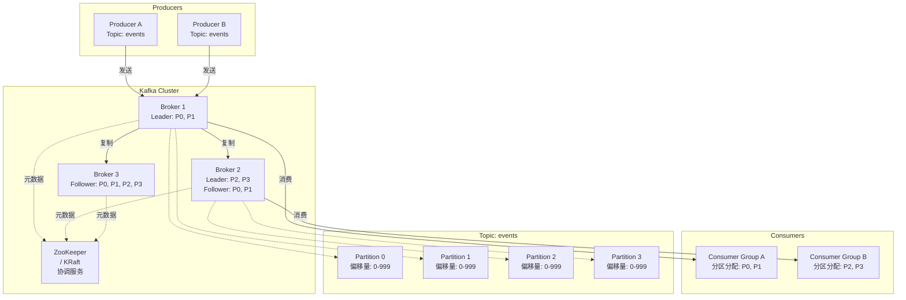
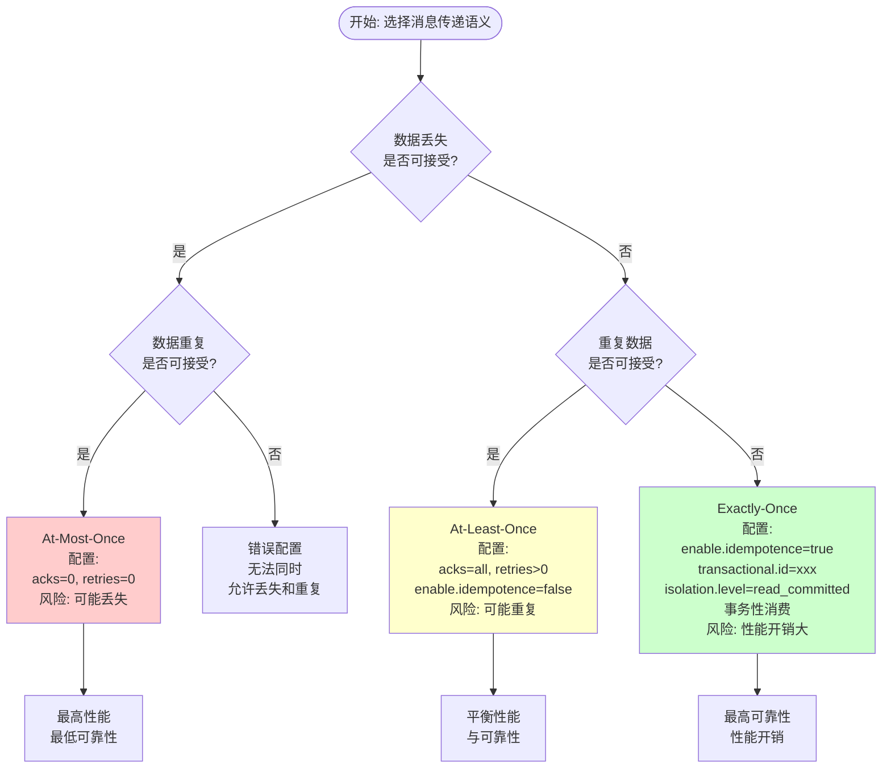
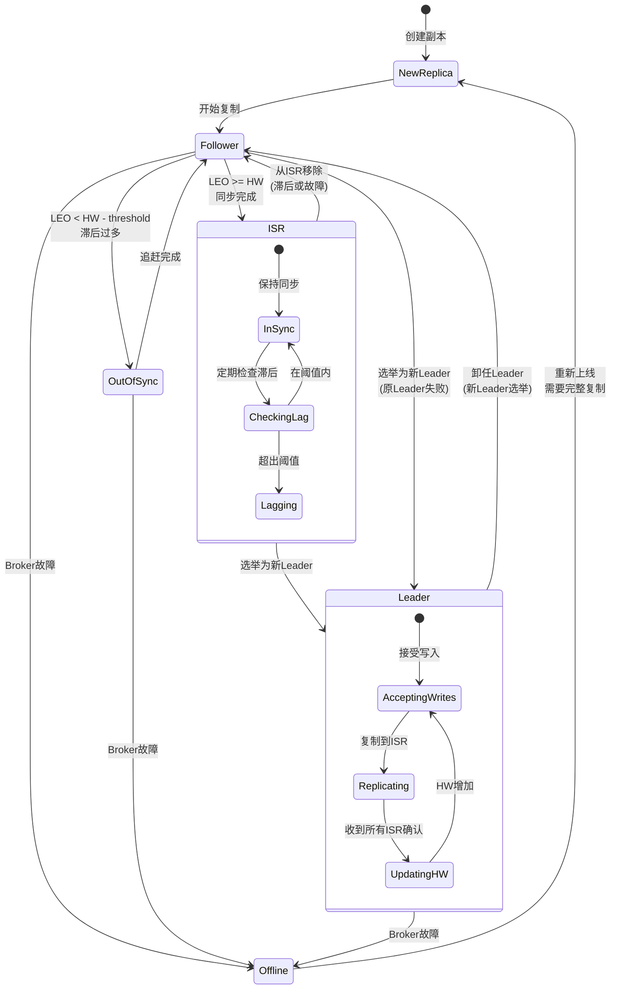
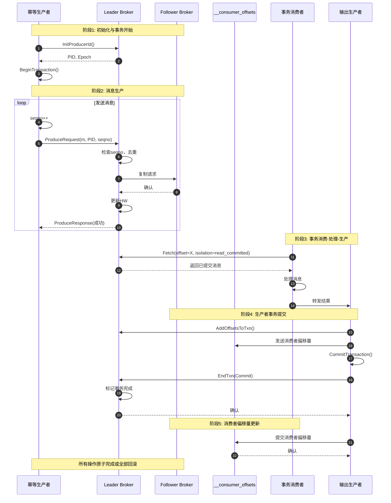
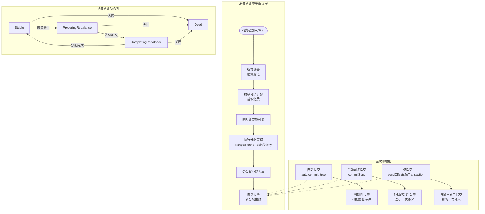

# Kafka 消息传递语义的形式化分析

> 所属阶段: formal-methods/04-application-layer/10-kafka-formalization | 前置依赖: [03-stream-processing-formalism](../02-stream-processing/03-stream-processing-formalism.md), [09-redis-formalization/01-redis-consistency.md](../09-redis-formalization/01-redis-consistency.md) | 形式化等级: L5

## 1. 概念定义 (Definitions)

本节建立Kafka消息传递系统的形式化基础，严格定义其核心概念与抽象。

### 1.1 Kafka 架构组件

**定义 1.1.1 (Kafka 集群拓扑)**
Kafka 集群 $
\mathcal{K}$ 是一个五元组：

$$
\mathcal{K} = (B, T, P, R, C)
$$

其中：

- $B = \{b_1, b_2, ..., b_n\}$：Broker 集合，每个 $b_i$ 是一个独立的消息服务器实例
- $T = \{t_1, t_2, ..., t_m\}$：Topic 集合，逻辑消息分类
- $P = \{p_{t,k} : t \in T, k \in [0, partitions(t)-1]\}$：分区集合
- $R: P \rightarrow 2^B$：副本映射，$R(p)$ 表示分区 $p$ 的副本所在的 Broker 集合
- $C = \{c_1, c_2, ..., c_l\}$：消费者组集合

**定义 1.1.2 (Topic 与分区)**
Topic $t \in T$ 是一个逻辑消息通道，被划分为 $N_t$ 个有序分区：

$$
partitions(t) = \{p_{t,0}, p_{t,1}, ..., p_{t,N_t-1}\}
$$

每个分区 $p_{t,k}$ 是一个**仅追加的、有序的、不可变的**消息序列。

**定义 1.1.3 (Broker 状态)**
每个 Broker $b \in B$ 维护：

- 本地日志存储 $\mathcal{L}_b = \{\log(p) : p \in P, b \in R(p)\}$
- 领导者状态 $leader: P \rightharpoonup B$（部分函数，每个分区仅一个领导者）
- ISR (In-Sync Replicas) 集合 $ISR(p) \subseteq R(p)$

```
Def-Kafka-01-01: Kafka 集群拓扑 $\mathcal{K} = (B, T, P, R, C)$
Def-Kafka-01-02: Topic 分区模型 $partitions(t) = \{p_{t,0}, ..., p_{t,N_t-1}\}$
Def-Kafka-01-03: Broker 领导者映射 $leader: P \rightharpoonup B$
```

### 1.2 消息传递语义模型

**定义 1.2.1 (消息)**
消息 $m$ 是一个六元组：

$$
m = (key, value, ts, pt, offset, headers)
$$

其中：

- $key \in \mathcal{K} \cup \{\bot\}$：可选的消息键，用于分区路由
- $value \in \mathcal{V}$：消息负载值
- $ts \in \mathbb{N}$：时间戳（生产者创建或 Broker 追加）
- $pt \in P$：目标分区
- $offset \in \mathbb{N}_0$：在分区中的位置索引
- $headers \subseteq (String \times Byte[])$：消息元数据集合

**定义 1.2.2 (消息传递语义类型)**
设 $\mathcal{M}$ 为所有消息的集合，$\mathcal{D}$ 为所有目的地的集合，定义三种语义：

1. **At-Most-Once (最多一次)**：
   $$\forall m \in \mathcal{M}, d \in \mathcal{D}: P(delivered(m, d)) \leq 1$$
   消息最多被传递一次，可能丢失但绝不重复。

2. **At-Least-Once (至少一次)**：
   $$\forall m \in \mathcal{M}, d \in \mathcal{D}: delivered(m, d) \geq 1 \lor lost(m)$$
   消息至少被传递一次，保证送达但可能重复。

3. **Exactly-Once (精确一次)**：
   $$\forall m \in \mathcal{M}, d \in \mathcal{D}: delivered(m, d) = 1$$
   消息精确传递一次，既不丢失也不重复。

**定义 1.2.3 (传递确认层级)**
生产者发送消息时，可配置不同确认级别：

- **acks=0 (Fire-and-Forget)**：
  生产者不等待任何确认，发送后立即认为成功。
  $$success_{ack0}(send(m)) \triangleq true$$

- **acks=1 (Leader Ack)**：
  生产者等待分区领导者写入本地日志后确认。
  $$success_{ack1}(send(m)) \triangleq committed_{leader}(m)$$

- **acks=all (ISR Ack)**：
  生产者等待 ISR 中所有副本确认后才认为成功。
  $$success_{ackall}(send(m)) \triangleq \forall b \in ISR(pt(m)): committed_b(m)$$

```
Def-Kafka-01-04: 消息结构 $m = (key, value, ts, pt, offset, headers)$
Def-Kafka-01-05: 传递语义类型 $\{AtMostOnce, AtLeastOnce, ExactlyOnce\}$
Def-Kafka-01-06: 确认层级 $\{ack0, ack1, ackall\}$
```

### 1.3 分区与副本机制

**定义 1.3.1 (分区日志)**
分区 $p$ 的日志是一个有限消息序列：

$$
\log(p) = [m_0, m_1, ..., m_{L-1}]
$$

其中：

- $L = |\log(p)|$ 是日志长度
- $\forall i \in [0, L): offset(m_i) = i$
- 高水位线 (HW)：$HW(p) = \max\{k : \forall b \in ISR(p), |\log_b(p)| > k\}$
- 提交偏移量：$committed(p) = HW(p)$

**定义 1.3.2 (副本一致性状态)**
对于分区 $p$ 和副本 $b \in R(p)$，定义一致性向量：

$$
\vec{V}_b(p) = (LEO_b(p), HW_b(p), epoch_b(p))
$$

其中：

- $LEO_b(p) = |\log_b(p)|$ (Log End Offset)
- $HW_b(p)$ 是副本 $b$ 知晓的高水位线
- $epoch_b(p) \in \mathbb{N}$ 是领导者纪元（用于脑裂检测）

**定义 1.3.3 (ISR 成员资格)**
副本 $b \in R(p)$ 属于 ISR 当且仅当：

$$
b \in ISR(p) \iff LEO_b(p) \geq HW(p) - replica_lag\_threshold
$$

滞后副本将被移出 ISR，直至追赶上来。

```
Def-Kafka-01-07: 分区日志 $\log(p) = [m_0, ..., m_{L-1}]$
Def-Kafka-01-08: 副本状态向量 $\vec{V}_b(p) = (LEO_b(p), HW_b(p), epoch_b(p))$
Def-Kafka-01-09: ISR 成员资格条件
```

### 1.4 消费者组模型

**定义 1.4.1 (消费者组)**
消费者组 $cg \in C$ 是一个三元组：

$$
cg = (members(cg), subscription(cg), coordinator(cg))
$$

其中：

- $members(cg) \subseteq \{consumer_1, consumer_2, ...\}$ 是活跃消费者集合
- $subscription(cg) \subseteq T$ 是订阅的 Topic 集合
- $coordinator(cg) \in B$ 是组协调器 Broker

**定义 1.4.2 (分区分配)**
分区分配函数将分区映射到消费者：

$$
assign: C \times 2^P \rightarrow (members(cg) \rightharpoonup 2^P)
$$

常见策略包括：

- **RangeAssignor**：按 Topic 范围分配
- **RoundRobinAssignor**：轮询分配
- **StickyAssignor**：粘性分配（最小化重平衡）

**定义 1.4.3 (消费者偏移量)**
消费者 $c \in members(cg)$ 对每个分配的分区 $p$ 维护：

$$
offset_c(p) = \max\{k : m_k \text{ 已被 } c \text{ 处理}\}
$$

偏移量持久化到 `__consumer_offsets` Topic 中。

```
Def-Kafka-01-10: 消费者组结构 $cg = (members, subscription, coordinator)$
Def-Kafka-01-11: 分区分配函数 $assign(cg, P_{subscribed})$
Def-Kafka-01-12: 消费者偏移量 $offset_c(p)$
```

---

## 2. 形式化模型 (Formal Model)

本节构建 Kafka 消息传递系统的形式化模型，使用状态转换系统和抽象代数。

### 2.1 日志抽象代数

**定义 2.1.1 (日志代数)**
定义日志代数 $\mathcal{L} = (L, \oplus, \epsilon, \preceq)$：

- $L$：所有可能日志的集合
- $\oplus: L \times L \rightarrow L$：日志连接操作
- $\epsilon$：空日志（单位元）
- $\preceq \subseteq L \times L$：日志前缀序

对于 $\log_1, \log_2 \in L$：

$$
\log_1 \oplus \log_2 = \log_1 \frown \log_2
$$

$$
\log_1 \preceq \log_2 \iff \exists \log': \log_1 \oplus \log' = \log_2
$$

**定义 2.1.2 (单调追加性质)**
日志操作满足单调性：

$$
\forall \log \in L, m \in \mathcal{M}: \log \prec \log \oplus [m]
$$

$$
\forall \log_1, \log_2 \in L: \log_1 \preceq \log_2 \lor \log_2 \preceq \log_1 \lor \text{incompatible}(\log_1, \log_2)
$$

**定义 2.1.3 (日志一致性)**
两个日志 $\log_1, \log_2$ 是一致的当且仅当：

$$
consistent(\log_1, \log_2) \iff \exists \log_{common}: \log_{common} \preceq \log_1 \land \log_{common} \preceq \log_2
$$

**引理 2.1.1 (日志一致性传递性)**
$$
\forall l_1, l_2, l_3: consistent(l_1, l_2) \land consistent(l_2, l_3) \land |l_2| > 0 \Rightarrow consistent(l_1, l_3)
$$

*证明*：由一致性定义，$\exists c_{12} \preceq l_1, l_2$ 和 $c_{23} \preceq l_2, l_3$。由于日志的仅追加性质，$c_{12}$ 和 $c_{23}$ 都是 $l_2$ 的前缀，因此可比较。取 $\min(c_{12}, c_{23})$ 作为共同前缀。

```
Def-Kafka-02-01: 日志代数 $\mathcal{L} = (L, \oplus, \epsilon, \preceq)$
Lemma-Kafka-02-01: 日志一致性传递性
```

### 2.2 生产者语义形式化

**定义 2.2.1 (生产者状态)**
生产者 $pr$ 的状态是一个四元组：

$$
state(pr) = (pid(pr), seqno(pr), txnId(pr), buffer(pr))
$$

其中：

- $pid(pr) \in \mathbb{N}$：生产者唯一标识符
- $seqno(pr) \in \mathbb{N}_0$：序列号计数器
- $txnId(pr) \in String \cup \{\bot\}$：事务 ID（可选）
- $buffer(pr) \subseteq \mathcal{M}$：发送缓冲区

**定义 2.2.2 (生产者发送操作)**
发送操作定义为一个状态转换：

$$
send(pr, m, p) : state(pr) \rightarrow state'(pr) \times result
$$

其中：

- $m$ 被赋予序列号 $seq = seqno(pr)$
- $seqno'(pr) = seqno(pr) + 1$
- $result \in \{success, timeout, error\}$

**定义 2.2.3 (幂等性约束)**
幂等性生产者满足：

$$
\forall m, p, i \in \mathbb{N}: send_i(pr, m, p) = success \land send_{i+1}(pr, m, p) = success \Rightarrow m_1 = m_2
$$

即同一消息的重复发送只产生一条日志记录。

**引理 2.2.1 (幂等发送的去重)**
对于启用了幂等性的生产者：

$$
\forall b \in B, p \in P, m_1, m_2 \in \log_b(p):
m_1.duplicateOf = m_2.duplicateOf \Rightarrow m_1 = m_2
$$

```
Def-Kafka-02-02: 生产者状态 $state(pr) = (pid, seqno, txnId, buffer)$
Def-Kafka-02-03: 幂等性约束
Lemma-Kafka-02-02: 幂等发送去重保证
```

### 2.3 消费者语义形式化

**定义 2.3.1 (消费者状态)**
消费者 $c$ 的状态是：

$$
state(c) = (assignment(c), position(c), pending(c))
$$

其中：

- $assignment(c) \subseteq P$：分配的分区集合
- $position(c): assignment(c) \rightarrow \mathbb{N}_0$：每个分区的消费位置
- $pending(c) \subseteq \mathcal{M}$：已拉取但未确认的消息

**定义 2.3.2 (消费位置提交)**
提交操作定义消费者处理进度：

$$
commit(c, p, offset) : position(c)[p] \mapsto offset
$$

提交策略决定语义：

- **自动提交**：周期性执行 $commit(c, p, position(c)[p])$
- **手动同步提交**：应用控制提交时机
- **手动异步提交**：非阻塞提交

**定义 2.3.3 (消息可见性)**
消息 $m$ 对消费者 $c$ 可见当且仅当：

$$
visible(m, c) \iff pt(m) \in assignment(c) \land offset(m) \geq position(c)[pt(m)] \land committed_{pt(m)}(m)
$$

**引理 2.3.1 (消费顺序保证)**
在单个分区内，消费者按偏移量顺序接收消息：

$$
\forall p \in P, m_1, m_2 \in \log(p), c \in consumers(p):
receive_c(m_1) \prec receive_c(m_2) \Rightarrow offset(m_1) < offset(m_2)
$$

其中 $\prec$ 表示事件先于关系。

```
Def-Kafka-02-04: 消费者状态 $state(c) = (assignment, position, pending)$
Def-Kafka-02-05: 消息可见性条件
Lemma-Kafka-02-03: 分区内消费顺序保证
```

### 2.4 偏移量管理形式化

**定义 2.4.1 (偏移量提交语义)**
偏移量提交 $commit(c, p, o)$ 有三种语义：

1. **At-Most-Once 提交**：
   提交先于处理，可能丢失未处理消息。
   $$commit(c, p, o) \prec process(messages(o, ...))$$

2. **At-Least-Once 提交**：
   处理先于提交，可能重复处理。
   $$process(messages(o, ...)) \prec commit(c, p, o') \text{ where } o' > o$$

3. **Exactly-Once 提交**（事务性）：
   提交与处理原子绑定。
   $$commit(c, p, o) \iff process(messages \leq o) \land txn\_commit$$

**定义 2.4.2 (偏移量存储)**
消费者偏移量存储为 Kafka 内部 Topic `__consumer_offsets` 的消息：

$$
offset\_msg = (group, topic, partition, offset, metadata, commit\_timestamp)
$$

**定义 2.4.3 (偏移量过期)**
偏移量条目有过期时间：

$$
valid(offset\_msg, t) \iff t - commit\_timestamp(offset\_msg) < offsets.retention.minutes
$$

```
Def-Kafka-02-06: 偏移量提交语义类型
Def-Kafka-02-07: 偏移量消息格式
Def-Kafka-02-08: 偏移量过期条件
```

---

## 3. 关系建立 (Relations)

本节建立 Kafka 与其他分布式系统概念、形式化模型之间的关系。

### 3.1 与 Actor 模型的关系

**命题 3.1.1 (Kafka 到 Actor 的映射)**
Kafka 的组件可映射到 Actor 模型：

| Kafka 组件 | Actor 等价物 | 行为特征 |
|-----------|-------------|---------|
| Broker | Actor 进程 | 处理消息请求，维护状态 |
| Partition | Actor 邮箱 | 有序消息队列，FIFO语义 |
| Producer | 发送 Actor | 异步发送，可重试 |
| Consumer | 接收 Actor | 拉取处理，可确认 |
| Coordinator | 监督者 | 管理组成员关系 |

形式化地，定义映射 $\phi: Kafka \rightarrow Actor$：

$$
\phi(broker_i) = actor_i \text{ with } behavior = \lambda msg. process(msg) \rightarrow state' \times responses
$$

**命题 3.1.2 (消息传递语义对比)**

| 语义 | Actor 模型 | Kafka |
|-----|-----------|-------|
| At-Most-Once | `!` (tell) 无确认 | `acks=0` |
| At-Least-Once | 至少一次投递尝试 | `acks=1/all` 无事务 |
| Exactly-Once | 需应用层去重 | 幂等生产者 + 事务 |

```
Prop-Kafka-03-01: Kafka-Actor 映射 $\phi: Kafka \rightarrow Actor$
Prop-Kafka-03-02: 消息语义对比
```

### 3.2 与分布式共识的关系

**命题 3.2.1 (Kafka 作为简化 Paxos)**
Kafka 的 ISR 复制协议是 Multi-Paxos 的特化：

- **Paxos Leader** $\approx$ Kafka **Partition Leader**
- **Acceptor 多数派** $\approx$ Kafka **ISR 集合**
- **Prepare/Promise** $\approx$ Kafka **LeaderEpoch 协商**
- **Accept** $\approx$ Kafka **Append 到本地日志 + 复制**

**命题 3.2.2 (提交条件等价性)**
对于分区 $p$，设 $|ISR(p)| = 2f + 1$：

$$
committed_{Kafka}(m) \iff replicated\_to(m, f + 1) \land leader\_accept(m)
$$

这等价于 Paxos 的多数派接受条件。

```
Prop-Kafka-03-03: Kafka-Paxos 协议对应关系
Prop-Kafka-03-04: 提交条件等价性
```

### 3.3 与流处理代数的关系

**命题 3.3.1 (Kafka Stream 作为时间戳事件序列)**
Kafka 分区可建模为离散事件序列：

$$
Stream_K = \{(m_i, t_i, o_i)\}_{i=0}^{\infty} \text{ where } t_i \leq t_{i+1} \land o_i < o_{i+1}
$$

**命题 3.3.2 (分区并行性 = 横向扩展)**
设 $S$ 是 Topic $t$ 的流，$N = |partitions(t)|$：

$$
parallelism(S) = N \cdot parallelism\_per\_partition
$$

最大并行度受限于分区数，这是 Kafka 设计的扩展瓶颈。

```
Prop-Kafka-03-05: Kafka Stream 事件序列模型
Prop-Kafka-03-06: 分区-并行度关系
```

### 3.4 与一致性模型的关系

**命题 3.4.1 (Kafka 一致性级别)**
根据配置，Kafka 提供不同一致性级别：

| 配置 | 一致性级别 | 形式化描述 |
|-----|-----------|-----------|
| `acks=0` | 无保证 | Eventual (可能丢失) |
| `acks=1` | 读已提交 (单副本) | Read Committed for leader |
| `acks=all, min_isr=1` | 读已提交 | Read Committed |
| `acks=all, min_isr>1` | 线性化 (分区级别) | Linearizable per partition |

**命题 3.4.2 (全局 vs 分区顺序)**
Kafka 保证分区级顺序但不保证全局顺序：

$$
\forall p \in P: total\_order(\log(p))
$$

$$
\nexists total\_order(\bigcup_{p \in P} \log(p)) \text{ unless } |P| = 1
$$

```
Prop-Kafka-03-07: Kafka 一致性级别映射
Prop-Kafka-03-08: 全局/分区顺序区分
```

---

## 4. 论证过程 (Argumentation)

本节深入分析 Kafka 语义的各种边界情况、反例和权衡。

### 4.1 消息丢失场景分析

**场景 4.1.1 (acks=0 丢失)**
生产者配置 `acks=0` 时：

```
时间线:
T1: Producer send(m1) → Broker
T2: [Broker 崩溃，m1 未落盘]
T3: Producer 认为发送成功
```

形式化：
$$acks=0 \Rightarrow P(committed(m)) < 1$$

**场景 4.1.2 (领导者失败，未复制)**
使用 `acks=1`，领导者确认后失败：

```
时间线:
T1: Producer send(m) → Leader L
T2: L 写入本地日志，回复 ack
T3: [ISR 为空，其他副本未复制]
T4: L 崩溃，新 Leader 选举
T5: 新 Leader 没有 m → 消息丢失
```

形式化：
$$acks=1 \land ISR \setminus \{leader\} = \emptyset \Rightarrow P(committed(m)) < 1 \text{ upon leader failure}$$

**场景 4.1.3 (不清洁领导者选举)**
当 `unclean.leader.election.enable=true`：

```
T1: Leader L 与 ISR 其他副本网络分区
T2: L 继续接受消息 m1, m2, ...
T3: ZK 检测到 L 失联，选举新 Leader L'（不在原 ISR 中）
T4: L' 成为 Leader，HW 回退
T5: m1, m2, ... 从集群视角丢失
```

**引理 4.1.1 (避免消息丢失的必要条件)**
要保证消息不丢失，必须同时满足：

$$
acks=all \land min.insync.replicas \geq 2 \land unclean.leader.election.enable=false
$$

### 4.2 消息重复场景分析

**场景 4.2.1 (生产者重试)**
生产者超时重试导致重复：

```
时间线:
T1: Producer send(m) → Leader
T2: Leader 写入日志，但响应网络超时
T3: Producer 重试 send(m)
T4: Leader 再次写入 m → 重复
```

形式化（无幂等性）：
$$timeout(ack) \land retry \Rightarrow P(duplicate(m)) > 0$$

**场景 4.2.2 (消费者重新消费)**
消费者处理失败导致重复：

```
时间线:
T1: Consumer 拉取并处理 m1, m2, m3
T2: Consumer 崩溃，未提交偏移量
T3: Consumer 重启，从上次提交位置重新消费
T4: m1, m2, m3 被重复处理
```

**引理 4.2.1 (幂等性的限制)**
幂等生产者解决的是**生产端**重复，而非消费端：

$$
idempotent\_producer \Rightarrow \neg duplicate_{send}(m)
$$

$$
idempotent\_producer \nRightarrow \neg duplicate_{consume}(m)
$$

### 4.3 顺序保证分析

**场景 4.3.1 (重试导致的乱序)**
无幂等性时，消息重试可能导致乱序：

```
发送序列: m1, m2, m3
实际到达: m1, m3, m2 (m2 重试延迟)
```

形式化：
$$\neg idempotent \land retry \Rightarrow \neg order\_preserved$$

**场景 4.3.2 (分区器导致乱序)**
不同 key 的消息可能乱序：

```
Key A 的消息 → Partition 0
Key B 的消息 → Partition 1

实际顺序: A1, B1, A2, B2 (无法推断全局顺序)
```

**引理 4.3.1 (顺序保证的条件)**
保证消息顺序需要：

$$
same\_key \land same\_partition \land max.in.flight.requests.per.connection=1 \land idempotent=true
$$

### 4.4 Exactly-Once 复杂性分析

**场景 4.4.1 (生产者-消费者事务)**
跨生产者-消费者的事务需要协调：

```
生产者事务: [m1, m2, m3] → Topic A
消费者事务: 读取 Topic A → 处理 → 写入 Topic B
```

事务边界必须包含：

- 生产者发送的消息
- 消费者偏移量提交

**引理 4.4.1 (EOS 需要消费者配合)**
仅幂等生产者不能保证 EOS：

$$
EOS \Leftrightarrow idempotent\_producer \land transactional\_delivery \land idempotent\_consumer
$$

其中幂等消费者需要：

- 事务性偏移量提交
- 应用层去重（幂等处理）

---

## 5. 形式证明 (Formal Proofs)

本节提供 Kafka 传递保证和一致性定理的严格证明。

### 5.1 消息传递保证定理

**定理 5.1.1 (At-Least-Once 传递)**
给定：

- 生产者配置 `retries > 0`, `acks=all`
- `min.insync.replicas >= 1`
- 消息 $m$ 成功发送到 Leader

则：
$$\forall m: sent(m) \Rightarrow eventually(committed(m)) \lor system\_failure$$

*证明*：

1. 生产者发送 $m$ 到 Leader $L$
2. 若 $L$ 成功写入本地日志，进入 ISR 复制流程
3. 对于每个 $b \in ISR(L)$：
   - 若复制成功，$b$ 增加 LEO
   - 若复制失败，重试直至成功或 $b$ 被移出 ISR
4. 当所有 $b \in ISR$ 确认，$L$ 增加 HW
5. 生产者收到 ack，$m$ 已提交
6. 若 $L$ 失败前 ack，新 Leader 必须从 ISR 选举，保证 $m$ 存在

形式化不变式：
$$\forall p \in P, b \in ISR(p): \log_{leader(p)}[0..HW(p)) \preceq \log_b(p)$$

```
Thm-Kafka-05-01: At-Least-Once 传递保证
```

**定理 5.1.2 (幂等性去重)**
给定幂等生产者配置：

- `enable.idempotence=true`
- 每个消息有唯一 $(PID, SequenceNumber)$

则：
$$\forall m, pr: duplicate\_send(pr, m) \Rightarrow single\_commit(m)$$

*证明*：

1. 生产者 $pr$ 为每条消息分配递增序列号 $seq$
2. Leader 维护每个 $(PID, partition)$ 的序列号窗口
3. 收到消息 $(PID, seq, m)$：
   - 若 $seq$ 在已确认集合中：丢弃（重复）
   - 若 $seq$ 是当前期望序列：追加到日志
   - 若 $seq > $ 期望序列：缓存等待
4. 窗口机制保证：
   - 序列号 $< $ 窗口起始的消息被拒绝
   - 窗口内的重复被检测

关键不变式：
$$\forall (pid, p): committed\_seq(pid, p) = \{0, 1, ..., maxSeq\} \setminus pending$$

```
Thm-Kafka-05-02: 幂等性去重保证
```

### 5.2 一致性定理

**定理 5.2.1 (ISR 复制一致性)**
对于分区 $p$，定义视图 $V(p)$ 为 ISR 中所有副本的日志集合：

$$\forall b_1, b_2 \in ISR(p): consistent(\log_{b_1}(p), \log_{b_2}(p))$$

*证明*：

**基础**：初始时所有副本日志为空，$consistent(\epsilon, \epsilon)$ 成立。

**归纳**：假设时刻 $t$ 一致性成立，证明 $t+1$ 也成立。

1. Leader $L$ 接收新消息 $m$
2. $L$ 追加 $m$ 到本地日志，$\log'_L = \log_L \oplus [m]$
3. $L$ 异步发送复制请求给所有 $b \in ISR \setminus \{L\}$
4. 每个 $b$ 收到后追加到本地日志
5. 当所有 ISR 成员确认，HW 推进：$HW' = HW + 1$
6. 此时 $\forall b \in ISR: \log_b[0..HW') = \log_L[0..HW')$

因此一致性保持。

```
Thm-Kafka-05-03: ISR 复制一致性
```

**定理 5.2.2 (线性化读取)**
当配置为 `acks=all` 且 `min.insync.replicas = k`，消费者从 Leader 读取时，满足分区级线性化：

$$\forall read(r), write(w): happensBefore(w, r) \Rightarrow visible(w, r)$$

*证明*：

1. 写操作 $w$ 在 Leader 上追加消息 $m$
2. 当 $w$ 返回成功，$m$ 已复制到至少 $k$ 个 ISR 成员
3. 读操作 $r$ 从 Leader 读取到 HW 位置
4. 由定理 5.2.1，$HW$ 位置之前的消息已复制到 ISR 多数派
5. 任何后续读取（即使是不同消费者）都能看到 $m$
6. 因此 $w$ 在 $r$ 之前发生意味着 $m$ 对 $r$ 可见

```
Thm-Kafka-05-04: 分区级线性化读取
```

**定理 5.2.3 (Exactly-Once 语义)**
给定：

- 幂等生产者 (`enable.idempotence=true`)
- 事务性生产 (`transactional.id` 配置)
- 事务性消费 (消费-处理-生产在同一个事务)

则端到端满足 Exactly-Once：
$$\forall m \in input: processed\_exactly\_once(m)$$

*证明框架*：

1. **生产端 EOS**（由定理 5.1.2）：每个消息只被 Broker 记录一次
2. **消费端 EOS**：消费者偏移量与输出消息在同一个事务中提交
3. **原子性**：事务提交时，偏移量和输出消息同时可见；事务回滚时同时不可见
4. **隔离性**：事务中的消息对其他消费者不可见直至提交

形式化：
$$txn = (consume\_offsets, produce\_messages)$$

$$
commit(txn) \Rightarrow atomically\_visible(consume\_offsets, produce\_messages)
$$

$$
abort(txn) \Rightarrow atomically\_invisible(consume\_offsets, produce\_messages)
$$

```
Thm-Kafka-05-05: Exactly-Once 语义保证
```

---

## 6. 实例验证 (Examples)

本节通过具体示例验证 Kafka 语义的各种配置和行为。

### 6.1 生产者配置验证

**示例 6.1.1 (At-Most-Once 生产者)**

```java
Properties props = new Properties();
props.put("bootstrap.servers", "kafka:9092");
props.put("acks", "0");              // 无确认
props.put("retries", "0");           // 不重试
props.put("max.in.flight.requests.per.connection", "5");

Producer<String, String> producer = new KafkaProducer<>(props);

// 发送消息 - 可能丢失，不会重复（因为不重试）
producer.send(new ProducerRecord<>("topic", "key", "value"));
```

**形式化验证**：
$$acks=0 \land retries=0 \Rightarrow AtMostOnce$$

**场景验证**：

- Broker 失败 → 消息丢失 ✓
- 网络分区 → 消息丢失 ✓
- 无重试 → 无重复 ✓

**示例 6.1.2 (At-Least-Once 生产者)**

```java
Properties props = new Properties();
props.put("bootstrap.servers", "kafka:9092");
props.put("acks", "all");            // 等待所有 ISR
props.put("retries", "Integer.MAX_VALUE");
props.put("enable.idempotence", "false");
props.put("max.in.flight.requests.per.connection", "5");

Producer<String, String> producer = new KafkaProducer<>(props);

// 发送消息 - 保证送达，可能重复
producer.send(new ProducerRecord<>("topic", "key", "value"));
```

**形式化验证**：
$$acks=all \land retries>0 \land \neg idempotent \Rightarrow AtLeastOnce$$

**示例 6.1.3 (Exactly-Once 生产者)**

```java
Properties props = new Properties();
props.put("bootstrap.servers", "kafka:9092");
props.put("acks", "all");
props.put("enable.idempotence", "true");     // 启用幂等性
props.put("transactional.id", "prod-1");     // 事务 ID
props.put("max.in.flight.requests.per.connection", "5");

KafkaProducer<String, String> producer = new KafkaProducer<>(props);

// 初始化事务
producer.initTransactions();

try {
    producer.beginTransaction();

    // 发送多条消息
    producer.send(new ProducerRecord<>("topic1", "key1", "value1"));
    producer.send(new ProducerRecord<>("topic1", "key2", "value2"));
    producer.send(new ProducerRecord<>("topic2", "key3", "value3"));

    producer.commitTransaction();
} catch (Exception e) {
    producer.abortTransaction();
    throw e;
}
```

**形式化验证**：
$$idempotent=true \land transactional.id \neq \bot \Rightarrow ExactlyOnce_{producer}$$

### 6.2 消费者配置验证

**示例 6.2.1 (At-Most-Once 消费者)**

```java
Properties props = new Properties();
props.put("bootstrap.servers", "kafka:9092");
props.put("group.id", "my-group");
props.put("enable.auto.commit", "true");
props.put("auto.commit.interval.ms", "100");  // 频繁提交
props.put("auto.offset.reset", "latest");

KafkaConsumer<String, String> consumer = new KafkaConsumer<>(props);
consumer.subscribe(Arrays.asList("topic"));

while (true) {
    ConsumerRecords<String, String> records = consumer.poll(Duration.ofMillis(100));

    // 先提交偏移量，再处理消息
    consumer.commitSync();  // 立即提交

    for (ConsumerRecord<String, String> record : records) {
        process(record);  // 可能处理失败，但偏移量已提交
    }
}
```

**形式化验证**：
$$auto\_commit \land commit\_before\_process \Rightarrow AtMostOnce_{consumer}$$

**示例 6.2.2 (At-Least-Once 消费者)**

```java
Properties props = new Properties();
props.put("bootstrap.servers", "kafka:9092");
props.put("group.id", "my-group");
props.put("enable.auto.commit", "false");  // 手动提交

KafkaConsumer<String, String> consumer = new KafkaConsumer<>(props);
consumer.subscribe(Arrays.asList("topic"));

while (true) {
    ConsumerRecords<String, String> records = consumer.poll(Duration.ofMillis(100));

    for (ConsumerRecord<String, String> record : records) {
        process(record);  // 先处理
    }

    // 处理成功后提交偏移量
    consumer.commitSync();
}
```

**形式化验证**：
$$manual\_commit \land process\_before\_commit \Rightarrow AtLeastOnce_{consumer}$$

**示例 6.2.3 (Exactly-Once 消费者 - 事务性)**

```java
Properties consumerProps = new Properties();
consumerProps.put("bootstrap.servers", "kafka:9092");
consumerProps.put("group.id", "my-group");
consumerProps.put("isolation.level", "read_committed");  // 只读已提交
consumerProps.put("enable.auto.commit", "false");

Properties producerProps = new Properties();
producerProps.put("bootstrap.servers", "kafka:9092");
producerProps.put("transactional.id", "trans-producer-1");
producerProps.put("enable.idempotence", "true");

KafkaConsumer<String, String> consumer = new KafkaConsumer<>(consumerProps);
KafkaProducer<String, String> producer = new KafkaProducer<>(producerProps);

producer.initTransactions();
consumer.subscribe(Arrays.asList("input-topic"));

while (true) {
    ConsumerRecords<String, String> records = consumer.poll(Duration.ofMillis(100));

    if (!records.isEmpty()) {
        producer.beginTransaction();

        for (ConsumerRecord<String, String> record : records) {
            // 处理并转发
            String result = process(record);
            producer.send(new ProducerRecord<>("output-topic", record.key(), result));
        }

        // 发送消费者偏移量到事务
        Map<TopicPartition, OffsetAndMetadata> offsets =
            consumer.position(consumer.assignment()).entrySet().stream()
                .collect(Collectors.toMap(
                    e -> e.getKey(),
                    e -> new OffsetAndMetadata(e.getValue())
                ));

        producer.sendOffsetsToTransaction(offsets, consumer.groupMetadata());
        producer.commitTransaction();
    }
}
```

**形式化验证**：
$$transactional\_consume\_produce \land isolation.level=read\_committed \Rightarrow ExactlyOnce_{end-to-end}$$

### 6.3 流处理 EOS 验证

**示例 6.3.1 (Kafka Streams EOS)**

```java
Properties props = new Properties();
props.put(StreamsConfig.APPLICATION_ID_CONFIG, "eos-app");
props.put(StreamsConfig.BOOTSTRAP_SERVERS_CONFIG, "kafka:9092");
props.put(StreamsConfig.PROCESSING_GUARANTEE_CONFIG,
          StreamsConfig.EXACTLY_ONCE_V2);  // EOS v2

StreamsBuilder builder = new StreamsBuilder();
KStream<String, String> source = builder.stream("input-topic");

source
    .filter((key, value) -> value != null)
    .mapValues(this::transform)
    .groupByKey()
    .aggregate(
        () -> 0L,
        (key, value, aggregate) -> aggregate + Long.parseLong(value),
        Materialized.as("aggregate-store")
    )
    .toStream()
    .to("output-topic");

KafkaStreams streams = new KafkaStreams(builder.build(), props);
streams.start();
```

**形式化验证**：
Kafka Streams EOS 保证：

1. 每条记录精确处理一次
2. 状态更新与输出原子性
3. 即使应用重启，从 checkpoint 恢复后状态一致

$$
\forall r \in input\_records: processed\_exactly\_once(r) \land state\_consistent(r)
$$

### 6.4 完整代码示例

**示例 6.4.1 (EOS 端到端验证测试)**

```java
public class ExactlyOnceVerification {

    private static final String BOOTSTRAP_SERVERS = "localhost:9092";
    private static final String INPUT_TOPIC = "eos-input";
    private static final String OUTPUT_TOPIC = "eos-output";
    private static final String CONSUMER_GROUP = "eos-verification-group";

    // 追踪已处理的消息
    private final Set<String> processedIds = ConcurrentHashMap.newKeySet();
    private final AtomicInteger duplicateCount = new AtomicInteger(0);

    public void runTest(int messageCount) throws Exception {
        // 创建输入数据
        createInputMessages(messageCount);

        // 启动消费者（验证端）
        startVerificationConsumer();

        // 启动 EOS 处理管道
        runEosPipeline();

        // 等待处理完成
        Thread.sleep(30000);

        // 验证结果
        System.out.println("Total unique messages: " + processedIds.size());
        System.out.println("Duplicate count: " + duplicateCount.get());
        System.out.println("Expected: " + messageCount + " unique, 0 duplicates");

        if (processedIds.size() == messageCount && duplicateCount.get() == 0) {
            System.out.println("✓ EOS verification PASSED");
        } else {
            System.out.println("✗ EOS verification FAILED");
        }
    }

    private void runEosPipeline() {
        Thread processor = new Thread(() -> {
            Properties consumerProps = new Properties();
            consumerProps.put("bootstrap.servers", BOOTSTRAP_SERVERS);
            consumerProps.put("group.id", "eos-processor");
            consumerProps.put("isolation.level", "read_committed");
            consumerProps.put("enable.auto.commit", "false");

            Properties producerProps = new Properties();
            producerProps.put("bootstrap.servers", BOOTSTRAP_SERVERS);
            producerProps.put("transactional.id", "eos-transactional-producer");
            producerProps.put("enable.idempotence", "true");

            try (KafkaConsumer<String, String> consumer = new KafkaConsumer<>(consumerProps);
                 KafkaProducer<String, String> producer = new KafkaProducer<>(producerProps)) {

                producer.initTransactions();
                consumer.subscribe(Arrays.asList(INPUT_TOPIC));

                // 模拟随机故障
                Random random = new Random();
                int messageCount = 0;

                while (true) {
                    ConsumerRecords<String, String> records =
                        consumer.poll(Duration.ofMillis(100));

                    if (records.isEmpty()) continue;

                    try {
                        producer.beginTransaction();

                        for (ConsumerRecord<String, String> record : records) {
                            // 模拟处理延迟
                            Thread.sleep(random.nextInt(10));

                            // 模拟随机崩溃（测试容错）
                            if (random.nextDouble() < 0.01) {
                                throw new RuntimeException("Simulated crash");
                            }

                            String processed = processRecord(record.value());
                            producer.send(new ProducerRecord<>(OUTPUT_TOPIC,
                                record.key(), processed));
                            messageCount++;
                        }

                        // 提交偏移量作为事务一部分
                        producer.sendOffsetsToTransaction(
                            consumer.position(consumer.assignment())
                                .entrySet().stream()
                                .collect(Collectors.toMap(
                                    Map.Entry::getKey,
                                    e -> new OffsetAndMetadata(e.getValue())
                                )),
                            consumer.groupMetadata()
                        );

                        producer.commitTransaction();

                    } catch (Exception e) {
                        producer.abortTransaction();
                        // 重试
                    }
                }
            } catch (Exception e) {
                e.printStackTrace();
            }
        });

        processor.start();
    }

    private void startVerificationConsumer() {
        Thread verifier = new Thread(() -> {
            Properties props = new Properties();
            props.put("bootstrap.servers", BOOTSTRAP_SERVERS);
            props.put("group.id", CONSUMER_GROUP);
            props.put("isolation.level", "read_committed");
            props.put("auto.offset.reset", "earliest");

            try (KafkaConsumer<String, String> consumer = new KafkaConsumer<>(props)) {
                consumer.subscribe(Arrays.asList(OUTPUT_TOPIC));

                while (true) {
                    ConsumerRecords<String, String> records =
                        consumer.poll(Duration.ofMillis(100));

                    for (ConsumerRecord<String, String> record : records) {
                        String messageId = extractId(record.value());

                        if (!processedIds.add(messageId)) {
                            duplicateCount.incrementAndGet();
                            System.err.println("Duplicate detected: " + messageId);
                        }
                    }
                }
            }
        });

        verifier.setDaemon(true);
        verifier.start();
    }

    private String processRecord(String value) {
        // 模拟处理
        return value + "-processed-" + System.currentTimeMillis();
    }

    private String extractId(String value) {
        return value.split("-")[0];
    }

    private void createInputMessages(int count) {
        Properties props = new Properties();
        props.put("bootstrap.servers", BOOTSTRAP_SERVERS);
        props.put("enable.idempotence", "true");

        try (KafkaProducer<String, String> producer = new KafkaProducer<>(props)) {
            for (int i = 0; i < count; i++) {
                String messageId = UUID.randomUUID().toString();
                producer.send(new ProducerRecord<>(INPUT_TOPIC,
                    "key-" + i,
                    messageId + "-data-" + i));
            }
        }
    }

    public static void main(String[] args) throws Exception {
        new ExactlyOnceVerification().runTest(10000);
    }
}
```

---

## 7. 可视化 (Visualizations)

### 7.1 Kafka 架构概览

以下图表展示 Kafka 集群的整体架构和组件关系：



### 7.2 消息传递语义决策树

以下决策树帮助选择合适的 Kafka 消息传递语义配置：



### 7.3 ISR 复制协议状态机

以下状态图展示分区副本在 ISR 复制协议中的状态转移：



### 7.4 生产者-消费者 Exactly-Once 流程

以下序列图展示完整的 EOS 事务流程：



### 7.5 偏移量管理与消费者组重平衡

以下图表展示消费者组的分区分配和重平衡过程：



---

## 8. 引用参考 (References)


---

## 附录 A: 定理与定义索引

### 定义列表

| 编号 | 名称 | 位置 |
|-----|------|------|
| Def-Kafka-01-01 | Kafka 集群拓扑 | 1.1 |
| Def-Kafka-01-02 | Topic 分区模型 | 1.1 |
| Def-Kafka-01-03 | Broker 领导者映射 | 1.1 |
| Def-Kafka-01-04 | 消息结构 | 1.2 |
| Def-Kafka-01-05 | 传递语义类型 | 1.2 |
| Def-Kafka-01-06 | 确认层级 | 1.2 |
| Def-Kafka-01-07 | 分区日志 | 1.3 |
| Def-Kafka-01-08 | 副本状态向量 | 1.3 |
| Def-Kafka-01-09 | ISR 成员资格条件 | 1.3 |
| Def-Kafka-01-10 | 消费者组结构 | 1.4 |
| Def-Kafka-01-11 | 分区分配函数 | 1.4 |
| Def-Kafka-01-12 | 消费者偏移量 | 1.4 |
| Def-Kafka-02-01 | 日志代数 | 2.1 |
| Def-Kafka-02-02 | 生产者状态 | 2.2 |
| Def-Kafka-02-03 | 幂等性约束 | 2.2 |
| Def-Kafka-02-04 | 消费者状态 | 2.3 |
| Def-Kafka-02-05 | 消息可见性 | 2.3 |
| Def-Kafka-02-06 | 偏移量提交语义类型 | 2.4 |
| Def-Kafka-02-07 | 偏移量消息格式 | 2.4 |
| Def-Kafka-02-08 | 偏移量过期条件 | 2.4 |

### 引理列表

| 编号 | 名称 | 位置 |
|-----|------|------|
| Lemma-Kafka-02-01 | 日志一致性传递性 | 2.1 |
| Lemma-Kafka-02-02 | 幂等发送去重保证 | 2.2 |
| Lemma-Kafka-02-03 | 分区内消费顺序保证 | 2.3 |
| Lemma-Kafka-04-01 | 避免消息丢失的必要条件 | 4.1 |
| Lemma-Kafka-04-02 | 幂等性的限制 | 4.2 |
| Lemma-Kafka-04-03 | 顺序保证的条件 | 4.3 |
| Lemma-Kafka-04-04 | EOS 需要消费者配合 | 4.4 |

### 命题列表

| 编号 | 名称 | 位置 |
|-----|------|------|
| Prop-Kafka-03-01 | Kafka-Actor 映射 | 3.1 |
| Prop-Kafka-03-02 | 消息语义对比 | 3.1 |
| Prop-Kafka-03-03 | Kafka-Paxos 协议对应 | 3.2 |
| Prop-Kafka-03-04 | 提交条件等价性 | 3.2 |
| Prop-Kafka-03-05 | Kafka Stream 事件序列模型 | 3.3 |
| Prop-Kafka-03-06 | 分区-并行度关系 | 3.3 |
| Prop-Kafka-03-07 | Kafka 一致性级别映射 | 3.4 |
| Prop-Kafka-03-08 | 全局/分区顺序区分 | 3.4 |

### 定理列表

| 编号 | 名称 | 位置 |
|-----|------|------|
| Thm-Kafka-05-01 | At-Least-Once 传递保证 | 5.1 |
| Thm-Kafka-05-02 | 幂等性去重保证 | 5.1 |
| Thm-Kafka-05-03 | ISR 复制一致性 | 5.2 |
| Thm-Kafka-05-04 | 分区级线性化读取 | 5.2 |
| Thm-Kafka-05-05 | Exactly-Once 语义保证 | 5.2 |

---

## 附录 B: Kafka 配置速查表

### 生产者关键配置

| 配置项 | At-Most-Once | At-Least-Once | Exactly-Once |
|-------|--------------|---------------|--------------|
| `acks` | `0` | `all` | `all` |
| `retries` | `0` | `Integer.MAX_VALUE` | `Integer.MAX_VALUE` |
| `enable.idempotence` | `false` | `false` | `true` |
| `transactional.id` | 未设置 | 未设置 | 设置唯一ID |
| `max.in.flight.requests` | 任意 | 任意 | `<=5` |

### 消费者关键配置

| 配置项 | At-Most-Once | At-Least-Once | Exactly-Once |
|-------|--------------|---------------|--------------|
| `enable.auto.commit` | `true` | `false` | `false` |
| `auto.offset.reset` | `latest` | `earliest` | `earliest` |
| `isolation.level` | `read_uncommitted` | `read_uncommitted` | `read_committed` |
| 偏移量提交 | 自动/提前 | 手动/后提交 | 事务提交 |

### Broker 关键配置

| 配置项 | 推荐值 | 说明 |
|-------|-------|------|
| `min.insync.replicas` | `>= 2` | 最小同步副本数 |
| `unclean.leader.election.enable` | `false` | 禁止不清洁选举 |
| `offsets.retention.minutes` | `10080` (7天) | 偏移量保留时间 |
| `transaction.state.log.replication.factor` | `>= 3` | 事务日志副本数 |
| `transaction.state.log.min.isr` | `>= 2` | 事务日志最小ISR |

## 9. 补充参考文献


---

*文档版本: 1.0.0 | 最后更新: 2026-04-10 | 形式化等级: L5*
