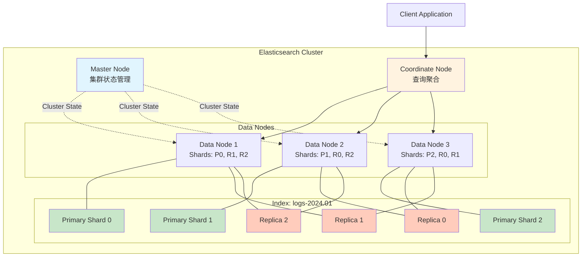
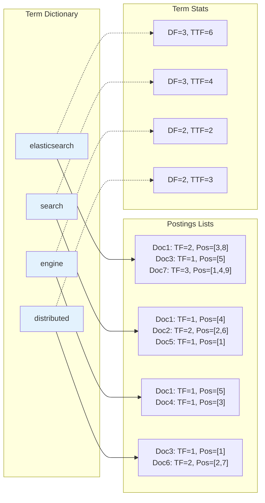
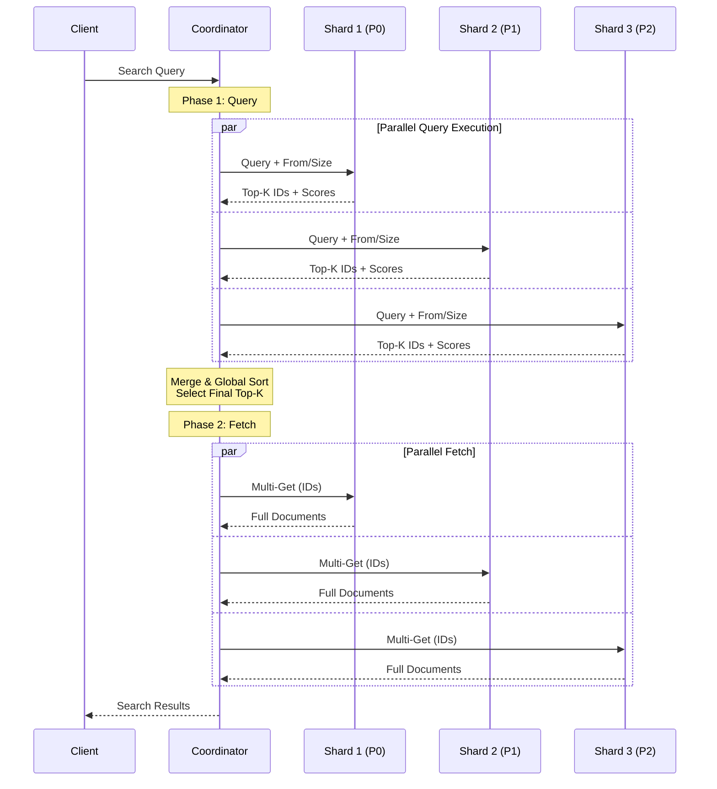
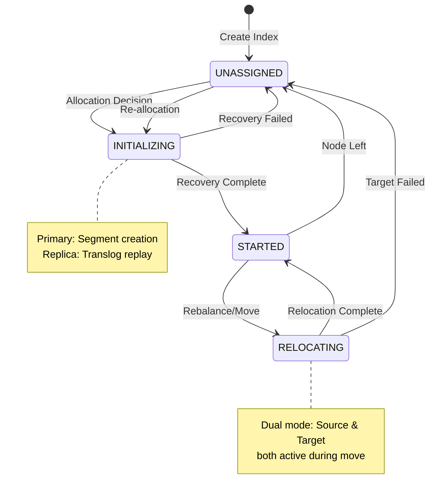
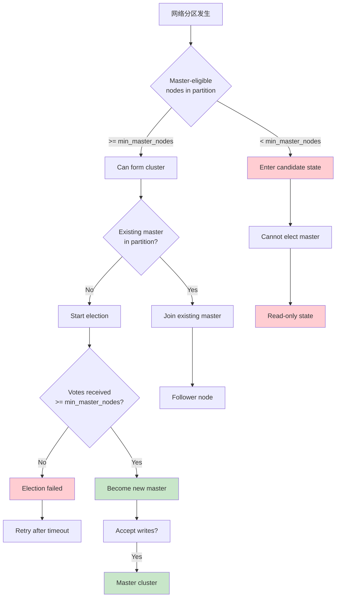
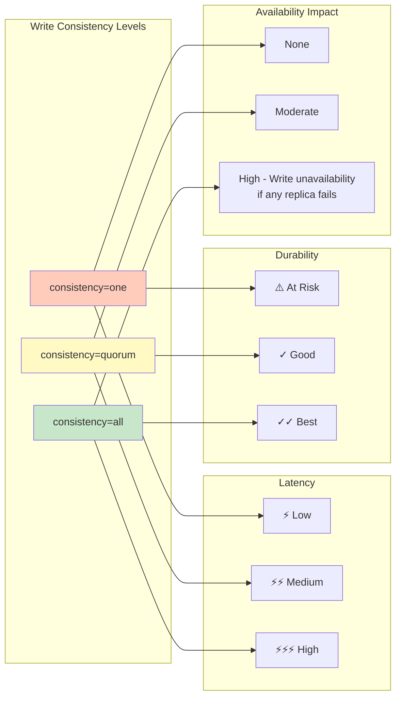

# Elasticsearch 分布式搜索引擎形式语义

> **所属阶段**: Knowledge | **前置依赖**: [Struct/02-consistent-models/03-eventual-consistency.md](../../Struct/02-consistent-models/03-eventual-consistency.md), [Knowledge/02-streaming-systems/05-state-management.md](../../Knowledge/02-streaming-systems/05-state-management.md) | **形式化等级**: L4-L5 | **状态**: Draft

---

## 1. 概念定义 (Definitions)

### Def-K-ES-01: Elasticsearch 集群架构

**定义**: Elasticsearch集群是一个分布式搜索与分析系统，形式化定义为一个五元组：

$$
\mathcal{ES} = \langle N, I, S, R, Q \rangle
$$

其中各组件定义如下：

| 组件 | 符号 | 定义域 | 语义 |
|------|------|--------|------|
| 节点集合 | $N$ | $\{n_1, n_2, ..., n_m\}$ | 集群中所有数据/协调节点的集合 |
| 索引集合 | $I$ | $\{idx_1, idx_2, ..., idx_k\}$ | 逻辑命名空间，包含同类文档集合 |
| 主分片 | $S$ | $S: I \times \mathbb{N} \rightarrow N$ | 索引到节点的分片分配函数 |
| 副本集 | $R$ | $R: I \times \mathbb{N} \times \mathbb{N} \rightarrow N \cup \{\bot\}$ | 副本分片分配函数，$\bot$表示未分配 |
| 查询引擎 | $Q$ | $Q: \mathcal{L}_{query} \times I \rightarrow \mathcal{P}(D) \times \mathbb{R}^*$ | 查询语言到结果集的映射 |

**节点角色分类** (Node Roles):

$$
\begin{aligned}
\text{role}(n) &\subseteq \{\text{master}, \text{data}, \text{ingest}, \text{coordinate}\} \\
\text{master-eligible}(n) &\triangleq \text{master} \in \text{role}(n) \\
\text{data-node}(n) &\triangleq \text{data} \in \text{role}(n)
\end{aligned}
$$

---

### Def-K-ES-02: 倒排索引 (Inverted Index)

**定义**: 倒排索引是词条到文档列表的映射结构：

$$
\mathcal{II}: T \rightarrow \mathcal{P}(D \times \mathbb{N} \times \mathbb{R}^{pos})
$$

其中：

- $T$ = 词条集合 (Term Dictionary)
- $D$ = 文档集合
- $\mathbb{N}$ = 词频 (TF - Term Frequency)
- $\mathbb{R}^{pos}$ = 位置信息向量

**词条统计元数据**:

$$
\text{TermStats}(t, idx) = \langle \text{doc_freq}(t), \text{total_term_freq}(t), \text{positions}(t) \rangle
$$

**文档评分组件** (BM25/TF-IDF):

$$
\text{score}(d, q) = \sum_{t \in q} \text{IDF}(t) \cdot \frac{\text{TF}(t,d) \cdot (k_1 + 1)}{\text{TF}(t,d) + k_1 \cdot (1 - b + b \cdot \frac{|d|}{\text{avgdl}})}
$$

其中参数：

- $k_1 \in [1.2, 2.0]$: 控制词频饱和度
- $b = 0.75$: 控制文档长度归一化

---

### Def-K-ES-03: 分片与副本 (Shards and Replicas)

**定义**: 索引的物理分区机制

**主分片定义**:
$$
\text{Primary}(idx, p) = \{ d \in D_{idx} \mid \text{hash}(d._id) \mod P = p \}
$$

其中 $P$ 是主分片数量（索引创建时固定）。

**副本分片定义**:
$$
\text{Replica}(idx, p, r) = \text{Primary}(idx, p) \quad \text{for } r \in [1, R]
$$

**分片分配状态机**:

$$
\text{ShardState} \in \{\text{UNASSIGNED}, \text{INITIALIZING}, \text{STARTED}, \text{RELOCATING}, \text{UNASSIGNED}\}
$$

**路由函数** (文档到分片映射):

$$
\text{routing}(d, idx) = \begin{cases}
\text{hash}(d._id) \mod P & \text{if no routing key} \\
\text{hash}(d.\text{routing}) \mod P & \text{otherwise}
\end{cases}
$$

---

### Def-K-ES-04: 分布式搜索协议

**定义**: 查询请求的分布式执行语义

**两阶段搜索协议**:

$$
\mathcal{Q}_{distributed}(q, idx) = \text{Reduce}(\text{QueryPhase}(q), \text{FetchPhase}(\text{top-k}))
$$

**阶段1 - Query Phase**:
$$
\text{QueryPhase}(q, idx) = \bigcup_{p=1}^{P} \{ \text{local_search}(q, \text{Primary}(idx, p)) \}
$$

返回全局排序的文档ID列表（仅包含元数据）。

**阶段2 - Fetch Phase**:
$$
\text{FetchPhase}(ids) = \bigcup_{id \in ids} \text{fetch_source}(id)
$$

**搜索类型**:

| 类型 | 语义 | 一致性保证 |
|------|------|------------|
| `query_then_fetch` | 先查询后取回 | 可能返回非最新数据 |
| `dfs_query_then_fetch` | 全局词频统计 | 更准确的评分 |
| `scan` | 滚动扫描 | 快照一致性 |

---

## 2. 属性推导 (Properties)

### Lemma-K-ES-01: 分片独立性

**引理**: 主分片之间的操作相互独立

$$
\forall idx, p_1 \neq p_2: \text{Primary}(idx, p_1) \cap \text{Primary}(idx, p_2) = \emptyset
$$

**证明**:

```
给定: hash(d._id) mod P 的均匀分布
对于任意文档 d，其分片位置唯一确定
因此不同分片包含不相交的文档子集
Q.E.D.
```

**工程意义**: 分片可以独立进行索引、搜索和迁移操作。

---

### Lemma-K-ES-02: 副本单调读

**引理**: 从同一副本分片读取保证单调一致性

$$
\forall r, t_1 < t_2: \text{Read}(r, t_2) \succeq \text{Read}(r, t_1)
$$

其中 $\succeq$ 表示版本偏序关系。

**证明概要**:

- 副本分片按顺序应用主分片的操作日志
- 每个操作都有单调递增的版本号
- 因此读取操作看到的版本号单调不减

---

### Lemma-K-ES-03: 路由一致性

**引理**: 相同路由键总是映射到同一分片

$$
\forall d_1, d_2: d_1.\text{routing} = d_2.\text{routing} \Rightarrow \text{routing}(d_1) = \text{routing}(d_2)
$$

**应用**: 父-子文档、JOIN操作、同用户数据局部性。

---

### Prop-K-ES-01: 查询下推完备性

**命题**: 支持的查询都可以分解为分片本地操作

$$
\forall q \in \mathcal{L}_{supported}: \text{result}(q) = \mathcal{F}(\{ \text{local}(q, s) \mid s \in \text{Shards} \})
$$

其中 $\mathcal{F}$ 是聚合函数（union、sum、top-k等）。

**不可下推查询**:

- 需要全局排序的复杂JOIN
- 跨索引聚合（除非使用`_index`字段）
- 某些类型的嵌套查询

---

## 3. 关系建立 (Relations)

### 3.1 与CAP定理的关系

Elasticsearch 在CAP三角中的定位：

```
        Consistency
            /\
           /  \
          /    \
         /      \
        /   AP   \       <-- Elasticsearch默认模式
       /  (可调)  \
      /____________\
   Partition      Availability
    Tolerance
```

**可调一致性**:

- `write_consistency`: `one`, `quorum`, `all`
- `search_type`: 影响读取一致性

---

### 3.2 与Lamport时钟的关系

ES使用**Sequence Numbers**实现因果追踪：

$$
\text{SeqNum}: O \rightarrow \mathbb{N}
$$

其中 $O$ 是操作集合。主分片维护单调递增的seq_no，所有副本按序应用。

**与向量时钟对比**:

| 特性 | 向量时钟 | ES Sequence Numbers |
|------|----------|---------------------|
| 空间复杂度 | $O(N)$ | $O(1)$ |
| 冲突检测 | 显式 | 依赖版本号 |
| 适用场景 | 多主复制 | 主从复制 |

---

### 3.3 与Raft/Paxos的关系

**集群状态一致性**使用类Raft算法：

- **Leader Election**: 主节点选举
- **Log Replication**: 集群状态变更日志
- **Safety**: 一个term内最多一个leader

**与Raft的区别**:

- 仅集群元数据使用共识
- 数据复制使用主从异步复制

---

### 3.4 与Dataflow模型的关系

ES索引流水线可建模为Dataflow图：

$$
\text{Source} \rightarrow \text{Ingest} \rightarrow \text{Transform} \rightarrow \text{Index} \rightarrow \text{Flush} \rightarrow \text{Commit}
$$

每个阶段都有明确的Watermark概念（基于seq_no）。

---

## 4. 论证过程 (Argumentation)

### 4.1 脑裂场景分析

**场景**: 网络分区导致两个节点都认为自己是主节点

```
时间线:
T1: 网络分区 [A,B] | [C,D,E]
T2: A发现无法连接到C,D,E，启动选举
T3: C,D,E选举C为新主
T4: 双主同时接受写入
T5: 网络恢复，数据冲突
```

**ES解决方案** - 最小主节点数 (discovery.zen.minimum_master_nodes):

$$
\text{min_master_nodes} = \lfloor \frac{\text{master_eligible_nodes}}{2} \rfloor + 1
$$

**安全条件**:

$$
\text{safe}(partition) \triangleq |partition \cap \text{master_eligible}| \geq \text{min_master_nodes}
$$

---

### 4.2 版本冲突处理

**乐观并发控制**:

$$
\text{write}(d, v_{expected}) = \begin{cases}
\text{success} & \text{if } v_{current} = v_{expected} \\
\text{VersionConflictEngineException} & \text{otherwise}
\end{cases}
$$

**外部版本控制**:

- 使用外部系统版本号（如数据库序列号）
- 版本号必须单调递增

---

### 4.3 写入耐久性级别

| 级别 | 语义 | 延迟 | 数据安全 |
|------|------|------|----------|
| `async` | 主分片确认即返回 | 最低 | 可能丢失 |
| `request` (默认) | 主分片确认 | 低 | 单点故障风险 |
| `quorum` | 多数分片确认 | 中 | 较好 |
| `all` | 所有分片确认 | 高 | 最佳 |

**形式化定义**:

$$
\text{ack_level} = \begin{cases}
1 & \text{async/request} \\
\lfloor \frac{1 + R}{2} \rfloor + 1 & \text{quorum} \\
1 + R & \text{all}
\end{cases}
$$

---

## 5. 形式证明 / 工程论证 (Proof / Engineering Argument)

### Thm-K-ES-01: 最终一致性定理

**定理**: 在无新写入且无故障的条件下，副本最终与主分片一致

$$
\diamond \forall idx, p, r: \text{Replica}(idx, p, r) = \text{Primary}(idx, p)
$$

**证明**:

```
前提条件:
1. 主分片维护操作日志 L = [op_1, op_2, ..., op_n]
2. 每个副本维护 replica_log，初始为 []
3. 复制协议: 副本定期从主分片拉取新操作
4. 网络分区最终会恢复

证明步骤:

Step 1: 定义一致性状态
Consistent(idx, p, r) ≜ replica_log_r = L[1..n]

Step 2: 证明日志复制进度单调不减
∀t: progress_r(t+1) ≥ progress_r(t)
其中 progress_r = |replica_log_r|

Step 3: 证明在稳定网络下 progress_r → n
- 设网络稳定时段 Δt
- 复制速率 ρ > 0 (操作/秒)
- 经过时间 Δt，progress_r 增加 ρ·Δt
- 因此 ∃t*: progress_r(t*) = n

Step 4: 结合Eventually算子
◇Consistent 表示 ∃t ≥ t_0: Consistent(t)
由Step 3，这样的t必然存在

Q.E.D.
```

**边界条件**:

- 主分片故障转移期间可能有短暂不一致
- 大量积压可能导致复制延迟

---

### Thm-K-ES-02: 查询完整性定理

**定理**: 分布式查询返回的结果集等于各分片结果的并集

$$
\text{Query}(q, idx) = \bigcup_{p=1}^{P} \text{LocalQuery}(q, \text{Shard}(idx, p))
$$

**证明** (以match_all查询为例):

```
前提:
- 分片构成文档全集的划分: ∪Shard_p = D_idx, Shard_i ∩ Shard_j = ∅ (i≠j)
- 每个文档有唯一ID

证明:

对于match_all查询:
LocalQuery(match_all, Shard_p) = {d ∈ D_idx | routing(d) = p}

因此:
∪_{p=1}^P LocalQuery(match_all, Shard_p)
= ∪_{p=1}^P {d | routing(d) = p}
= {d ∈ D_idx | ∃p: routing(d) = p}
= D_idx
= Query(match_all, idx)

对于带过滤条件的查询:
设过滤谓词为 P(d)
LocalQuery(P, Shard_p) = {d ∈ Shard_p | P(d)}

∪_{p=1}^P LocalQuery(P, Shard_p)
= ∪_{p=1}^P {d ∈ Shard_p | P(d)}
= {d ∈ D_idx | P(d)}  (由划分的完备性)
= Query(P, idx)

Q.E.D.
```

**Top-K查询的复杂性**:

- 需要全局排序，不能简单并集
- 解决方案: 每个分片返回本地Top-K，协调节点合并

---

### Thm-K-ES-03: 副本读可用性

**定理**: 在有可用副本的情况下，读操作可以容忍主分片故障

$$
\forall idx, p: (\exists r: \text{Replica}(idx, p, r) \in \text{STARTED}) \Rightarrow \text{ReadAvailable}(idx, p)
$$

**证明概要**:

1. ES支持`preference=_replica`路由选项
2. 当主分片不可用时，查询可路由到副本
3. 副本可能返回旧数据（最终一致性）
4. 但系统保持可用性

---

## 6. 实例验证 (Examples)

### 6.1 索引设计模式

#### 模式1: 时间序列索引 (Time-Based Indexing)

```json
// 索引模板
PUT _index_template/logs_template
{
  "index_patterns": ["logs-*"],
  "template": {
    "settings": {
      "number_of_shards": 3,
      "number_of_replicas": 1,
      "index.lifecycle.name": "logs_policy",
      "index.lifecycle.rollover_alias": "logs"
    },
    "mappings": {
      "properties": {
        "@timestamp": { "type": "date" },
        "message": { "type": "text", "analyzer": "standard" },
        "level": { "type": "keyword" },
        "service": { "type": "keyword" }
      }
    }
  }
}
```

**形式化优势**:

- 时间局部性: 最近数据查询更快
- 可删除性: 旧索引可直接删除
- 并行化: 不同时间段索引可并行处理

---

#### 模式2: 路由优化设计

```json
// 用户数据按user_id路由
PUT user_events/_doc/1?routing=user_123
{
  "user_id": "user_123",
  "event_type": "click",
  "timestamp": "2024-01-15T10:30:00Z"
}

// 查询时指定相同路由
GET user_events/_search?routing=user_123
{
  "query": {
    "term": { "user_id": "user_123" }
  }
}
```

**性能收益**:

- 单分片查询，避免分布式聚合
- 查询延迟从 O(√N) 降至 O(log N)

---

### 6.2 查询优化案例

#### 案例: 电商搜索优化

```json
// 优化前: 简单multi_match
{
  "query": {
    "multi_match": {
      "query": "red shoes",
      "fields": ["title^3", "description", "tags"]
    }
  }
}

// 优化后: function_score增强
{
  "query": {
    "function_score": {
      "query": {
        "bool": {
          "should": [
            { "match": { "title": { "query": "red shoes", "boost": 3 } } },
            { "match": { "description": "red shoes" } }
          ],
          "filter": [
            { "term": { "status": "active" } },
            { "range": { "price": { "lte": 1000 } } }
          ]
        }
      },
      "functions": [
        { "field_value_factor": { "field": "popularity", "factor": 1.2 } },
        { "gauss": { "price": { "origin": 200, "scale": 100 } } },
        { "script_score": { "script": "doc['in_stock'].value ? 1.5 : 0.5" } }
      ],
      "score_mode": "multiply",
      "boost_mode": "multiply"
    }
  }
}
```

---

### 6.3 集群管理脚本

#### 分片分配监控

```bash
#!/bin/bash
# 检查未分配分片
UNASSIGNED=$(curl -s "localhost:9200/_cluster/health" | jq -r '.unassigned_shards')
if [ "$UNASSIGNED" -gt 0 ]; then
  echo "警告: 存在 $UNASSIGNED 个未分配分片"
  curl -s "localhost:9200/_cat/shards?v&h=index,shard,prirep,state,unassigned.reason" | grep UNASSIGNED
fi

# 热点分片检测
curl -s "localhost:9200/_cat/thread_pool/search?v&h=node_name,active,queue,rejected"

# 磁盘水位检查
curl -s "localhost:9200/_cat/allocation?v&h=node,disk.percent,disk.used,disk.total"
```

---

#### 集群重启策略

```bash
# 1. 禁用分片分配（防止重启期间不必要的重新平衡）
curl -X PUT "localhost:9200/_cluster/settings" -H 'Content-Type: application/json' -d'
{
  "persistent": {
    "cluster.routing.allocation.enable": "primaries"
  }
}'

# 2. 执行同步刷新（确保所有分片持久化）
curl -X POST "localhost:9200/_flush/synced"

# 3. 逐节点重启...
# 对每个节点:
#   systemctl restart elasticsearch
#   等待集群状态恢复green

# 4. 重新启用分片分配
curl -X PUT "localhost:9200/_cluster/settings" -H 'Content-Type: application/json' -d'
{
  "persistent": {
    "cluster.routing.allocation.enable": "all"
  }
}'
```

---

### 6.4 客户端代码示例

#### Python Elasticsearch 客户端

```python
from elasticsearch import Elasticsearch
from elasticsearch.helpers import bulk
import json

# 连接配置 - 高可用设置
es = Elasticsearch(
    ["http://node1:9200", "http://node2:9200", "http://node3:9200"],
    retry_on_timeout=True,
    max_retries=3,
    timeout=30,
    # 连接池配置
    sniff_on_start=True,
    sniff_on_connection_fail=True,
    sniffer_timeout=60
)

# 索引文档 - 使用乐观并发控制
try:
    response = es.index(
        index="products",
        id="sku_12345",
        body={
            "name": "Elasticsearch Guide",
            "price": 49.99,
            "category": "books"
        },
        if_seq_no=10,      # 期望的序列号
        if_primary_term=1  # 期望的主分片term
    )
except ConflictError:
    print("版本冲突，需要重试")

# 批量索引 - 优化写入性能
def generate_docs():
    for i in range(10000):
        yield {
            "_index": "events",
            "_id": f"event_{i}",
            "_source": {
                "timestamp": "2024-01-15T10:00:00Z",
                "user_id": f"user_{i % 1000}",
                "action": "click"
            }
        }

success, errors = bulk(es, generate_docs(), chunk_size=500, max_retries=3)

# 搜索查询 - 复杂聚合
response = es.search(
    index="sales",
    body={
        "size": 0,
        "query": {
            "range": {
                "date": {
                    "gte": "now-30d/d",
                    "lte": "now/d"
                }
            }
        },
        "aggs": {
            "sales_by_category": {
                "terms": { "field": "category", "size": 10 },
                "aggs": {
                    "revenue": {
                        "sum": { "field": "amount" }
                    },
                    "avg_order": {
                        "avg": { "field": "amount" }
                    }
                }
            },
            "daily_trend": {
                "date_histogram": {
                    "field": "date",
                    "calendar_interval": "day"
                }
            }
        }
    }
)

# 处理聚合结果
for bucket in response["aggregations"]["sales_by_category"]["buckets"]:
    print(f"Category: {bucket['key']}, Revenue: {bucket['revenue']['value']}")
```

#### Java REST 客户端

```java
import org.elasticsearch.action.search.SearchRequest;
import org.elasticsearch.action.search.SearchResponse;
import org.elasticsearch.client.RequestOptions;
import org.elasticsearch.client.RestHighLevelClient;
import org.elasticsearch.index.query.BoolQueryBuilder;
import org.elasticsearch.index.query.QueryBuilders;
import org.elasticsearch.search.aggregations.AggregationBuilders;
import org.elasticsearch.search.aggregations.bucket.terms.Terms;
import org.elasticsearch.search.builder.SearchSourceBuilder;

import java.io.IOException;

public class ElasticsearchClient {

    private final RestHighLevelClient client;

    public SearchResponse searchWithAggregations(String index) throws IOException {
        // 构建布尔查询
        BoolQueryBuilder boolQuery = QueryBuilders.boolQuery()
            .must(QueryBuilders.matchQuery("title", "elasticsearch"))
            .filter(QueryBuilders.termQuery("status", "published"))
            .filter(QueryBuilders.rangeQuery("created_at").gte("now-7d"));

        // 构建搜索源
        SearchSourceBuilder sourceBuilder = new SearchSourceBuilder()
            .query(boolQuery)
            .size(0)  // 仅聚合，不返回文档
            .aggregation(
                AggregationBuilders.terms("by_category")
                    .field("category.keyword")
                    .size(10)
                    .subAggregation(
                        AggregationBuilders.avg("avg_views")
                            .field("views")
                    )
            )
            .aggregation(
                AggregationBuilders.dateHistogram("by_day")
                    .field("created_at")
                    .calendarInterval(DateHistogramInterval.DAY)
            );

        SearchRequest searchRequest = new SearchRequest(index)
            .source(sourceBuilder);

        return client.search(searchRequest, RequestOptions.DEFAULT);
    }

    public void processResults(SearchResponse response) {
        // 处理terms聚合
        Terms categoryTerms = response.getAggregations().get("by_category");
        for (Terms.Bucket bucket : categoryTerms.getBuckets()) {
            String category = bucket.getKeyAsString();
            long docCount = bucket.getDocCount();
            Avg avgViews = bucket.getAggregations().get("avg_views");
            System.out.printf("Category: %s, Count: %d, Avg Views: %.2f%n",
                category, docCount, avgViews.getValue());
        }
    }
}
```

---

## 7. 可视化 (Visualizations)

### 图1: Elasticsearch 集群架构图

ES集群采用主从架构，主节点负责集群状态管理，数据节点承载分片数据。



---

### 图2: 倒排索引结构图

倒排索引将词条映射到包含该词条的文档列表，是全文搜索的核心数据结构。



---

### 图3: 分布式搜索两阶段流程

分布式搜索采用Query-Then-Fetch模式，先在各分片上执行查询并返回排序后的文档ID，再批量获取完整文档。



---

### 图4: 分片分配与副本同步状态机

分片在其生命周期中会经历多种状态，包括初始化、启动、重新分配等，副本通过复制主分片的translog保持同步。



---

### 图5: 脑裂防护机制决策树

最小主节点数(discovery.zen.minimum_master_nodes)是防止脑裂的关键配置。



---

### 图6: 写入操作一致性级别对比矩阵



---

## 8. 引用参考 (References)


---

## 附录A: 关键配置参数速查

| 参数 | 默认值 | 说明 | 调优建议 |
|------|--------|------|----------|
| `number_of_shards` | 1 | 主分片数 | 根据数据量和节点数设置，避免频繁重新分片 |
| `number_of_replicas` | 1 | 副本数 | 生产环境至少1个，关键数据2-3个 |
| `refresh_interval` | 1s | 刷新间隔 | 写入密集场景可增大至30s |
| `translog.durability` | request | 事务日志持久化 | async提升性能，request保证安全 |
| `discovery.zen.minimum_master_nodes` | - | 最小主节点数 | 必须设置为 N/2 + 1 |

---

## 附录B: 故障排查决策矩阵

| 症状 | 可能原因 | 诊断命令 | 解决方案 |
|------|----------|----------|----------|
| 集群状态red | 主分片未分配 | `/_cluster/allocation/explain` | 检查磁盘空间，手动分配 |
| 查询延迟高 | 热点分片 | `/_cat/thread_pool/search` | 增加分片数，优化路由 |
| 写入拒绝 | 索引速率过快 | `/_cat/thread_pool/write` | 增加队列大小，批量优化 |
| 脑裂 | 网络分区 | `/_cat/master` | 调整min_master_nodes |
| 内存压力 | 聚合查询过大 | `/_nodes/stats/jvm` | 优化查询，增加堆内存 |

---

*文档版本: v1.0 | 最后更新: 2024-01-15 | 维护者: AnalysisDataFlow项目*
