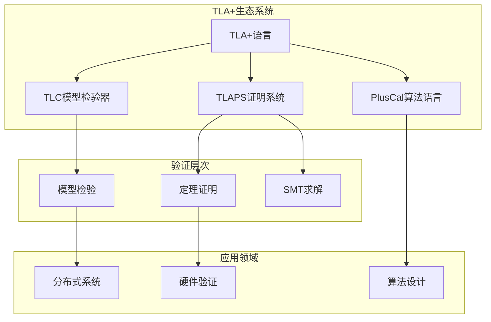
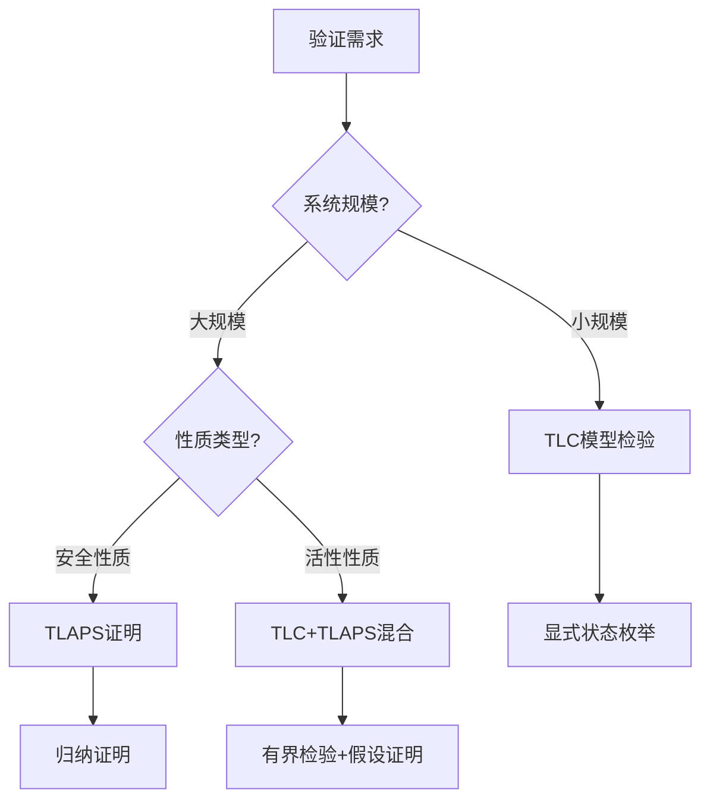
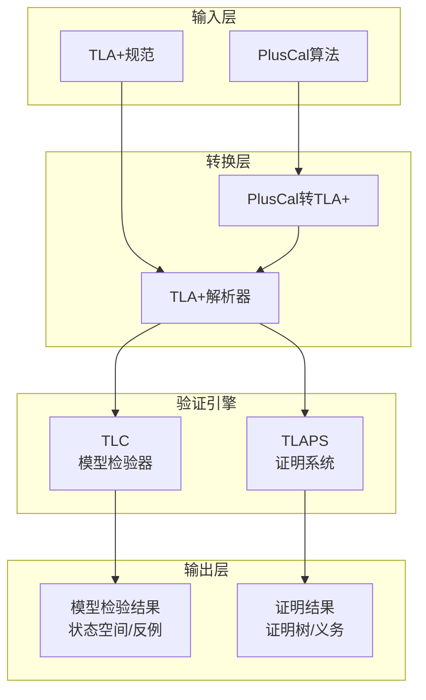
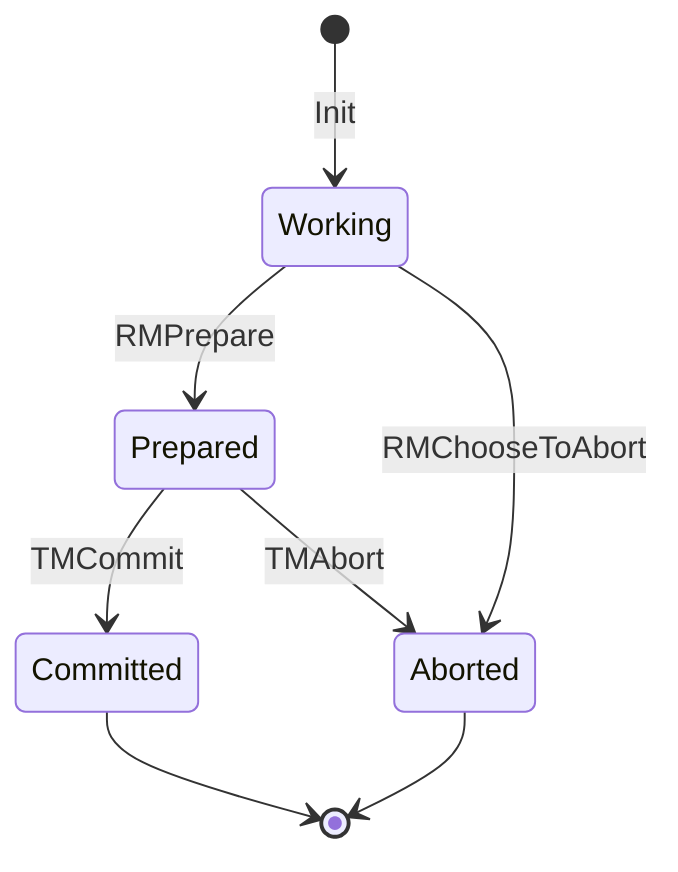

# TLA+ 时序逻辑

> **所属单元**: Verification/Logic | **前置依赖**: [形式逻辑基础](../../01-foundations/03-logic-foundations.md) | **形式化等级**: L5

## 1. 概念定义 (Definitions)

### 1.1 TLA+ 基础概念

**Def-V-01-01** (TLA+ 规范结构)。一个TLA+规范Spec是一个时序逻辑公式，其标准结构为：

$$\text{Spec} \triangleq \text{Init} \land \square[\text{Next}]_{\text{vars}} \land \text{Fairness}$$

其中：

- **Init**: 初始状态谓词，描述系统的初始配置
- **Next**: 动作公式，描述状态转换关系
- **$\square[\text{Next}]_{\text{vars}}$**: 时序运算符，表示Next动作或状态不变的无穷序列
- **Fairness**: 公平性约束，确保某些动作最终会被执行

**Def-V-01-02** (动作逻辑)。一个动作A是一个布尔公式，包含状态变量和非Primed变量（表示当前状态）以及Primed变量（表示下一状态）：

$$A \equiv P \land Q'$$

其中$P$是当前状态谓词，$Q'$是下一状态谓词（变量使用撇号标记）。

**Def-V-01-03** (状态与行为)。设$V$为状态变量集合：

- **状态**$s$: 从变量到值的映射 $s: V \to \text{Val}$
- **行为**$\sigma$: 状态的无穷序列 $\sigma = s_0, s_1, s_2, \ldots$
- **步**$(s, t)$: 从状态$s$到状态$t$的转换

### 1.2 时序运算符

**Def-V-01-04** (TLA+ 时序运算符)。给定行为$\sigma = s_0, s_1, s_2, \ldots$：

| 运算符 | 定义 | 含义 |
|--------|------|------|
| $\square F$ | $\forall i \geq 0: \sigma^{+i} \models F$ | 总是(always) |
| $\Diamond F$ | $\exists i \geq 0: \sigma^{+i} \models F$ | 最终(eventually) |
| $F \sim G$ | $\square(F \Rightarrow \Diamond G)$ | 前导(leadsto) |
| $\forall x: F$ | 对所有$x$，$F$成立 | 全称量词 |
| $\exists x: F$ | 存在$x$使得$F$成立 | 存在量词 |

### 1.3 TLC 模型检验器

**Def-V-01-05** (TLC模型检验)。TLC是一个显式状态模型检验器：

$$\text{TLC}(\text{Spec}, \text{Properties}) \to \{\text{Success}, \text{Counterexample}\}$$

TLC枚举所有可达状态，验证：

- **不变式** (Invariants): $\square I$
- **时序性质** (Temporal Properties): LTL公式
- **状态约束** (State Constraints): 限制搜索空间

### 1.4 TLAPS 证明系统

**Def-V-01-06** (TLAPS结构)。TLA+证明系统(TLAPS)是一个机械辅助的证明环境：

$$\text{TLAPS} = (\text{Proof Manager}, \text{Backend Provers}, \text{SMT Solvers})$$

支持：

- **分步证明**: 层次化证明结构
- **证明义务**: 自动提取待证命题
- **后端集成**: Isabelle, Zenon, SMT求解器

## 2. 属性推导 (Properties)

### 2.1 规范组合性质

**Lemma-V-01-01** (规范分解)。设$\text{Spec}_1$和$\text{Spec}_2$为两个TLA+规范：

$$(\text{Spec}_1 \land \text{Spec}_2) \Rightarrow \text{Properties}_{\text{combined}}$$

如果$\text{Spec}_1 \models P_1$且$\text{Spec}_2 \models P_2$，则组合规范满足$P_1 \land P_2$（在适当条件下）。

**Lemma-V-01-02** (不变式保持)。如果$I$是$\text{Spec} = \text{Init} \land \square[\text{Next}]_{\text{vars}}$的不变式，则：

$$\text{Init} \Rightarrow I \quad \land \quad I \land [\text{Next}]_{\text{vars}} \Rightarrow I'$$

### 2.2 公平性分类

**Def-V-01-07** (公平性类型)。给定动作$A$：

- **弱公平性** (WF): $\text{WF}_{\text{vars}}(A) \triangleq \square\Diamond\neg\text{ENABLED}\langle A \rangle_{\text{vars}} \lor \square\Diamond\langle A \rangle_{\text{vars}}$
- **强公平性** (SF): $\text{SF}_{\text{vars}}(A) \triangleq \Diamond\square\neg\text{ENABLED}\langle A \rangle_{\text{vars}} \lor \square\Diamond\langle A \rangle_{\text{vars}}$

**Lemma-V-01-03** (公平性蕴含)。强公平性蕴含弱公平性：

$$\text{SF}_{\text{vars}}(A) \Rightarrow \text{WF}_{\text{vars}}(A)$$

## 3. 关系建立 (Relations)

### 3.1 与其他形式化方法的关系



### 3.2 实现关系

TLA+与其他形式化方法的映射：

| TLA+概念 | 对应概念 | 应用领域 |
|----------|----------|----------|
| Action | 状态转换 | 自动机理论 |
| $\square F$ | LTL的Globally | 时序逻辑 |
| $\Diamond F$ | LTL的Finally | 时序逻辑 |
| Fairness | 调度约束 | 并发理论 |
| Module | 接口规范 | 代数规范 |

## 4. 论证过程 (Argumentation)

### 4.1 TLA+设计哲学

TLA+的设计基于以下核心原则：

1. **状态机视角**: 所有分布式系统都可建模为状态机
2. **数学表达**: 使用标准数学符号，降低学习成本
3. **工具支持**: 模型检验与定理证明并重
4. **工业可用**: 成功应用于大规模系统验证

### 4.2 与其他方法的对比



## 5. 形式证明 / 工程论证 (Proof / Engineering Argument)

### 5.1 TLC模型检验的正确性

**Thm-V-01-01** (TLC完备性)。对于有限状态规范，如果$\text{Spec} \models P$在所有有限行为上成立，则TLC将验证成功：

$$\text{FiniteStates}(\text{Spec}) \land (\forall \sigma_{\text{finite}}: \sigma_{\text{finite}} \models \text{Spec} \Rightarrow \sigma_{\text{finite}} \models P) \Rightarrow \text{TLC}(\text{Spec}, P) = \text{Success}$$

**证明概要**：

1. TLC系统性地枚举所有可达状态
2. 对于有限状态空间，枚举必然终止
3. 对每个访问状态验证性质$P$
4. 若所有状态满足$P$，则检验通过

### 5.2 TLAPS可靠性

**Thm-V-01-02** (TLAPS可靠性)。TLAPS中成功的证明意味着定理在TLA+语义下有效：

$$\text{TLAPS} \vdash T \Rightarrow \models T$$

**证明结构**：

1. TLAPS将TLA+公式转换为Isabelle/HOL目标
2. Isabelle内核保证可靠性
3. 每个证明步骤经严格类型检查
4. 最终结论语义等价于原TLA+定理

## 6. 实例验证 (Examples)

### 6.1 二阶段提交规范

```tla
------------------------------ MODULE TwoPhaseCommit ------------------------------
CONSTANTS RM       \* 资源管理器集合
VARIABLES rmState, tmState, msgs

\* 资源管理器状态
RMStates == {"working", "prepared", "committed", "aborted"}
\* 事务管理器状态
TMStates == {"init", "commit", "abort"}

\* 初始状态
Init ==
  /\ rmState = [r \in RM |-> "working"]
  /\ tmState = "init"
  /\ msgs = {}

\* 资源管理器准备
RMPrepare(r) ==
  /\ rmState[r] = "working"
  /\ rmState' = [rmState EXCEPT ![r] = "prepared"]
  /\ msgs' = msgs \union {[type |-> "Prepared", rm |-> r]}
  /\ UNCHANGED tmState

\* 事务管理器提交决策
TMCommit ==
  /\ tmState = "init"
  /\ \A r \in RM : [type |-> "Prepared", rm |-> r] \in msgs
  /\ tmState' = "commit"
  /\ msgs' = msgs \union {[type |-> "Commit"]}
  /\ UNCHANGED rmState

\* 下一状态关系
Next ==
  \/ \E r \in RM : RMPrepare(r) \/ RMChooseToAbort(r)
  \/ TMCommit \/ TMAbort
  \/ \E r \in RM : RMCommit(r) \/ RMAbort(r)

\* 不变式：没有资源管理器同时处于提交和中止状态
Consistent ==
  ~\E r \in RM : rmState[r] = "committed" /\ rmState[r] = "aborted"
===================================================================================
```

### 6.2 PlusCal算法描述

```tla
--algorithm Clock
variable clock = 0;
process Tick = "Tick"
begin
L1: while TRUE do
      clock := clock + 1;
    end while;
end process;
end algorithm;
```

TLC可以验证此算法的时序性质，如$\square(\text{clock} \geq 0)$。

## 7. 可视化 (Visualizations)

### 7.1 TLA+验证工具链架构



### 7.2 二阶段提交状态机



## 8. 引用参考 (References)
