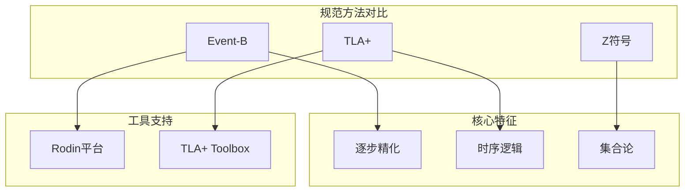
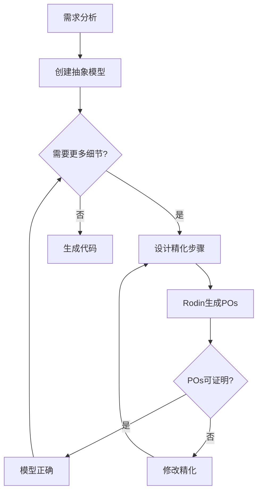
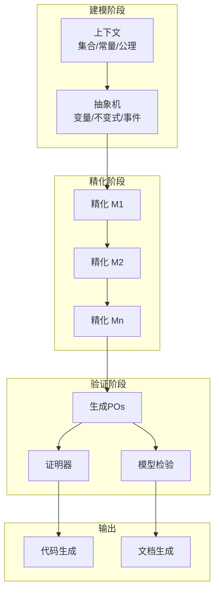
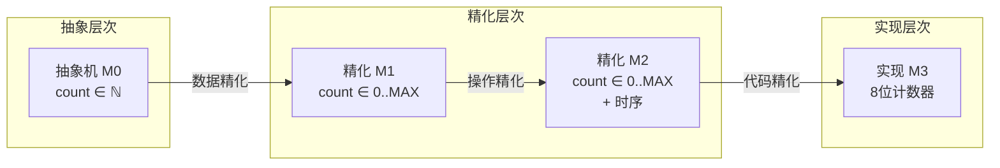

# Event-B 精化方法

> **所属单元**: Verification/Logic | **前置依赖**: [TLA+ 时序逻辑](./01-tla-plus.md) | **形式化等级**: L5

## 1. 概念定义 (Definitions)

### 1.1 Event-B 机器结构

**Def-V-02-01** (Event-B 抽象机)。一个Event-B抽象机$M$是一个五元组：

$$M \triangleq (\Sigma, \text{Vars}, \text{Inv}, \text{Init}, \text{Events})$$

其中：

- **$\Sigma$**: 签名(上下文)，定义集合、常量、公理
- **$\text{Vars}$**: 状态变量集合
- **$\text{Inv}$**: 不变式集合，$\text{Inv} \subseteq \text{Pred}(\text{Vars})$
- **$\text{Init}$**: 初始状态谓词
- **$\text{Events}$**: 事件集合

**Def-V-02-02** (Event-B 事件)。一个事件$e$是一个三元组：

$$e \triangleq (\text{name}, \text{params}, \text{guard}, \text{action})$$

其中：

- **name**: 事件标识符
- **params**: 参数集合（局部变量）
- **guard**: 守卫谓词 $G(\text{params}, \text{Vars})$
- **action**: 状态转换动作 $S(\text{params}, \text{Vars}, \text{Vars}')$

事件语法表示为：

```
event name
  any params where guard then action end
```

### 1.2 精化关系

**Def-V-02-03** (机器精化)。设$M$是抽象机，$N$是具体机，$J$是连接不变式(glue invariant)：

$$N \sqsubseteq_J M \quad \text{iff} \quad \text{POs are discharged}$$

精化需要证明以下证明义务(POs)：

- **初始化精化**: $N.\text{Init} \Rightarrow \exists \text{Vars}_M: M.\text{Init} \land J$
- **不变式保持**: $J \land N.\text{Inv} \land G_N \land S_N \Rightarrow \exists \text{Vars}_M': S_M \land J'$
- **守卫加强**: $J \land N.\text{Inv} \land G_N \Rightarrow G_M$
- **收敛**: (对于收敛事件) 良基关系$R$的存在性

### 1.3 证明义务

**Def-V-02-04** (Event-B 证明义务)。Rodin平台自动生成并检查以下PO类型：

| PO类型 | 符号 | 描述 |
|--------|------|------|
| 初始化可行性 | FIS/INIT | $\text{Init} \Rightarrow \exists \text{Vars}': S$ |
| 不变式保持 | INV | $\text{Inv} \land G \land S \Rightarrow \text{Inv}'$ |
| 守卫可行性 | FIS/EVENT | $G \Rightarrow \exists \text{Vars}': S$ |
| 精化正确性 | GRD/SIM | 精化关系保持 |
| 自然数变异 | NAT | 收敛性证明 |

## 2. 属性推导 (Properties)

### 2.1 精化保持性质

**Lemma-V-02-01** (不变式传播)。如果$M \sqsubseteq N$且$I_M$是$M$的不变式，则在精化$J$下存在对应不变式$I_N$：

$$\forall s_N: N.\text{Inv}(s_N) \land J(s_N) \Rightarrow \exists s_M: M.\text{Inv}(s_M) \land J(s_M)$$

**Lemma-V-02-02** (精化传递性)。精化关系具有传递性：

$$M_1 \sqsubseteq M_2 \land M_2 \sqsubseteq M_3 \Rightarrow M_1 \sqsubseteq M_3$$

### 2.2 事件细分类

**Def-V-02-05** (事件类型)。在精化层次中，事件被分类为：

- **普通事件** (ordinary): 直接精化抽象事件
- **收敛事件** (convergent): 最终必须停止的新事件
- **预期事件** (anticipated): 下一轮精化中变为收敛的事件

**Lemma-V-02-03** (收敛性)。系统$M$对新事件集合$E_{\text{new}}$收敛，如果：

$$\exists V: \text{Vars} \to \mathbb{N}, \forall e \in E_{\text{new}}: G_e \land S_e \Rightarrow V' < V$$

## 3. 关系建立 (Relations)

### 3.1 与TLA+的关系



### 3.2 设计方法映射

| 特征 | Event-B | TLA+ | B方法 |
|------|---------|------|-------|
| 基础逻辑 | 一阶逻辑+集合论 | TLA时序逻辑 | 谓词演算 |
| 状态机 | 显式 | 隐式 | 显式 |
| 精化 | 核心概念 | 模块组合 | 核心概念 |
| 证明 | 交互式 | 自动+交互 | 半自动 |
| 工具 | Rodin | TLC/TLAPS | Atelier B |

## 4. 论证过程 (Argumentation)

### 4.1 精化设计方法论

Event-B精化采用**自顶向下**的设计策略：

1. **抽象模型**: 关注核心功能和关键性质
2. **逐步精化**: 逐步引入实现细节
3. **性质保持**: 每步精化保持抽象性质
4. **工具验证**: Rodin自动检查和证明

### 4.2 精化策略



## 5. 形式证明 / 工程论证 (Proof / Engineering Argument)

### 5.1 精化正确性定理

**Thm-V-02-01** (精化正确性)。设$M_{\text{abstract}}$和$M_{\text{concrete}}$是两个Event-B机器，$J$是精化连接不变式。如果所有证明义务被履行，则具体机是抽象机的正确精化：

$$\text{POsDischarged}(M_{\text{abstract}}, M_{\text{concrete}}, J) \Rightarrow M_{\text{concrete}} \sqsubseteq_J M_{\text{abstract}}$$

**证明概要**：

1. **初始化精化**: 确保具体初始化可达抽象初始化状态
2. **守卫加强**: 确保具体守卫蕴含抽象守卫
3. **模拟关系**: 确保具体动作模拟抽象动作
4. **不变式保持**: 确保精化不变式在转换中保持

### 5.2 逐步精化的完备性

**Thm-V-02-02** (精化完备性)。对于任何可实现系统，存在有限步精化链从抽象规约到达实现级模型：

$$\forall S_{\text{impl}}: \exists M_0, M_1, \ldots, M_n: M_0 \sqsubseteq M_1 \sqsubseteq \cdots \sqsubseteq M_n \approx S_{\text{impl}}$$

**证明思路**：

1. 数据精化: 替换抽象数据为具体表示
2. 操作精化: 分解原子操作为步骤序列
3. 控制精化: 引入调度与并发控制
4. 每步精化保持关键性质

## 6. 实例验证 (Examples)

### 6.1 简单计数器精化

**抽象模型**:

```
machine Counter0
  variables count
  invariants @inv1 count ∈ ℕ
  events
    event INITIALISATION begin @act1 count ≔ 0 end
    event Increment begin @act1 count ≔ count + 1 end
    event Reset begin @act1 count ≔ 0 end
  end
end
```

**精化模型** (引入模运算):

```
machine Counter1 refines Counter0
  variables count
  invariants @inv1 count ∈ 0‥MAX_COUNT
  events
    event INITIALISATION refines INITIALISATION
      begin @act1 count ≔ 0 end
    event Increment refines Increment
      when @grd1 count < MAX_COUNT
      then @act1 count ≔ count + 1 end
    event Reset refines Reset
      then @act1 count ≔ 0 end
    event Overflow converges
      when @grd1 count = MAX_COUNT
      then @act1 count ≔ 0 end
  end
  variant count
end
```

### 6.2 交通灯控制器精化链

| 精化级别 | 新增细节 | 验证性质 |
|----------|----------|----------|
| M0 | 单路口，抽象状态 | 互斥: $\lnot(\text{green}_1 \land \text{green}_2)$ |
| M1 | 传感器输入 | 传感器一致性 |
| M2 | 时序约束 | 最小绿灯时间 |
| M3 | 故障处理 | 安全故障模式 |

## 7. 可视化 (Visualizations)

### 7.1 Event-B开发流程



### 7.2 精化关系示意图



## 8. 引用参考 (References)
