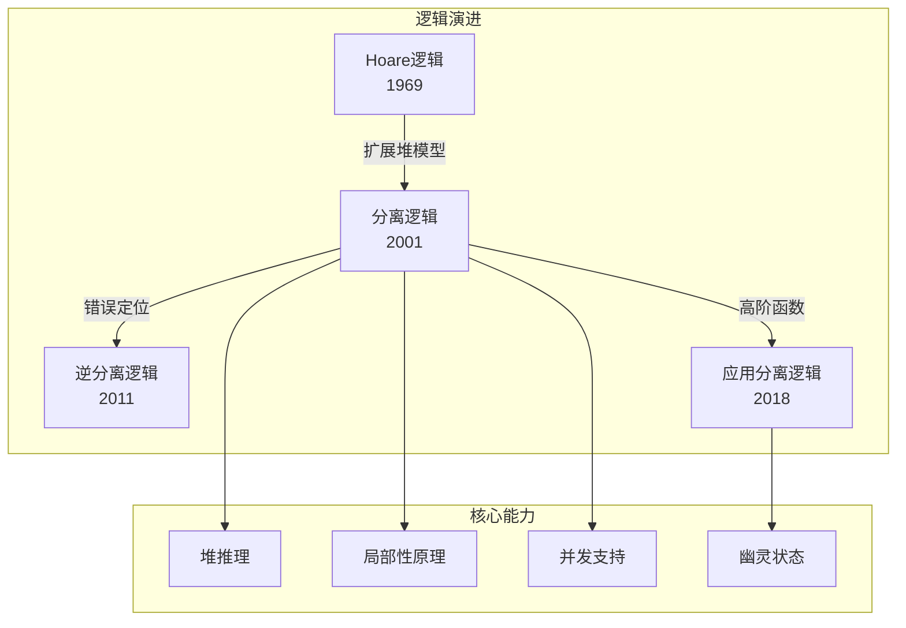
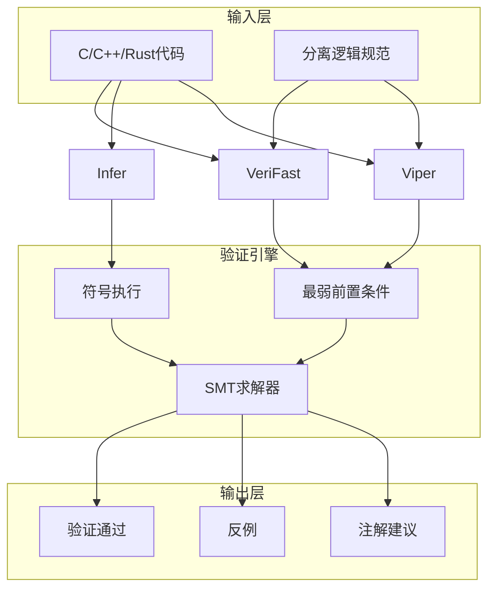
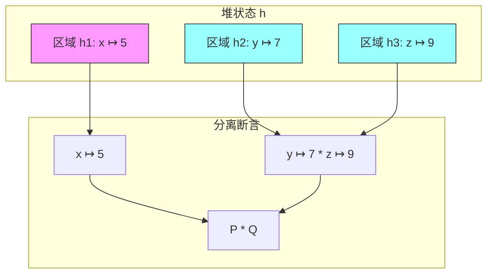
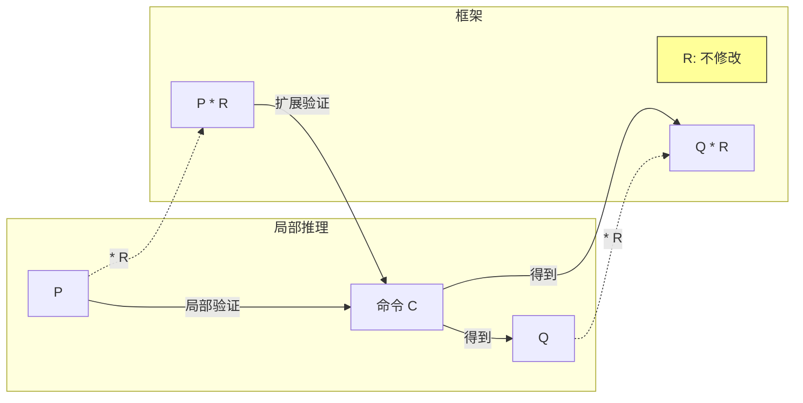
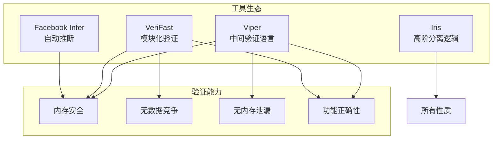

# 分离逻辑 (Separation Logic)

> **所属阶段**: Struct | 前置依赖: [03-logic-foundations.md](../../01-foundations/03-logic-foundations.md) | 形式化等级: L5

本文档全面阐述分离逻辑的理论基础、推理规则与工程应用，包括 Hoare 三元组、Frame 规则和并发分离逻辑(CSL)的完整形式化。

## 1. 概念定义 (Definitions)

### 1.1 分离逻辑断言语法

**Def-V-03-01** (分离逻辑断言)。分离逻辑断言$P, Q$的语法定义为：

$$P, Q ::= \text{emp} \mid x \mapsto y \mid P \ast Q \mid P \text{--\hspace{-0.5em}*} Q \mid P \land Q \mid P \lor Q \mid \neg P \mid \exists x.P \mid \forall x.P$$

其中核心断言：

| 断言 | 含义 | 直观解释 |
|------|------|----------|
| $\text{emp}$ | 空堆 | 堆域为空，不拥有任何内存 |
| $x \mapsto y$ | 单点堆 | 地址$x$存储值$y$，且仅此一处 |
| $P \ast Q$ | 分离合取 | $P$和$Q$作用在不相交的堆上 |
| $P \text{--\hspace{-0.5em}*} Q$ | 分离蕴含 | 若将满足$P$的堆加到当前堆上，则满足$Q$ |

**Def-V-03-02** (堆模型)。设$\text{Loc}$为地址集合，$\text{Val}$为值集合：

$$\text{Heap} \triangleq \text{Loc} \rightharpoonup_{\text{fin}} \text{Val}$$

一个堆$h$是有限偏函数。断言的语义由满足关系 $s, h \models P$ 定义：

| 断言 | 语义 | 条件 |
|------|------|------|
| $s, h \models \text{emp}$ | $\text{dom}(h) = \emptyset$ | 堆为空 |
| $s, h \models x \mapsto y$ | $h = \{s(x) \mapsto s(y)\}$ | 单点堆 |
| $s, h \models P \ast Q$ | $\exists h_1, h_2: h = h_1 \uplus h_2 \land s, h_1 \models P \land s, h_2 \models Q$ | 堆可分离 |
| $s, h \models P \text{--\hspace{-0.5em}*} Q$ | $\forall h': h \perp h' \land s, h' \models P \Rightarrow s, h \cdot h' \models Q$ | 分离蕴含 |

**Def-V-03-03** (分离合取)。$P \ast Q$成立当且仅当堆可划分为两个不相交部分：

$$s, h \models P \ast Q \Leftrightarrow \exists h_1, h_2: h_1 \perp h_2 \land h = h_1 \cdot h_2 \land s, h_1 \models P \land s, h_2 \models Q$$

其中 $h_1 \perp h_2$ 表示 $\text{dom}(h_1) \cap \text{dom}(h_2) = \emptyset$。

### 1.2 分离蕴含 (Magic Wand)

**Def-V-03-04** (分离蕴含)。$P \text{--\hspace{-0.5em}*} Q$表示：若将满足$P$的堆与当前堆合并，则结果满足$Q$：

$$s, h \models P \text{--\hspace{-0.5em}*} Q \Leftrightarrow \forall h': h \perp h' \land s, h' \models P \Rightarrow s, h \cdot h' \models Q$$

**性质**：分离蕴含与分离合取形成伴随对(Galois connection)：

$$(P \ast Q) \Rightarrow R \quad \Leftrightarrow \quad P \Rightarrow (Q \text{--\hspace{-0.5em}*} R)$$

### 1.3 数据结构断言

**Def-V-03-05** (链表段断言)。单链表段定义为递归断言：

$$\text{ls}(x, y) \triangleq (x = y \land \text{emp}) \lor (x \neq y \land \exists z: x \mapsto z \ast \text{ls}(z, y))$$

**Def-V-03-06** (树断言)。二叉树定义为：

$$\text{tree}(x) \triangleq (x = \text{nil} \land \text{emp}) \lor (x \neq \text{nil} \land \exists l, r: x \mapsto (l, r) \ast \text{tree}(l) \ast \text{tree}(r))$$

**Def-V-03-07** (数组段断言)。连续数组段：

$$\text{array}(a, n) \triangleq \bigast_{i=0}^{n-1} (a + i) \mapsto v_i$$

### 1.4 Hoare 三元组

**Def-V-03-08** (分离逻辑 Hoare 三元组)。命令 $C$ 关于前置条件 $P$ 和后置条件 $Q$ 的正确性：

$$\{P\} C \{Q\}$$

语义：从满足 $P$ 的状态执行 $C$，若 $C$ 终止，则结果状态满足 $Q$。

**Def-V-03-09** (完全正确性)。$[P] C [Q]$ 表示 $C$ 在 $P$ 下必定终止且满足 $Q$。

**Def-V-03-10** (局部正确性)。$\{P\} C \{Q\}$ 不保证终止，仅保证若终止则满足 $Q$。

## 2. 属性推导 (Properties)

### 2.1 分离逻辑代数性质

**Lemma-V-03-01** (分离合取性质)。$\ast$满足以下代数性质：

| 性质 | 公式 |
|------|------|
| **交换律** | $P \ast Q \equiv Q \ast P$ |
| **结合律** | $(P \ast Q) \ast R \equiv P \ast (Q \ast R)$ |
| **单位元** | $P \ast \text{emp} \equiv P$ |
| **单调性** | $P \Rightarrow Q \Rightarrow (P \ast R) \Rightarrow (Q \ast R)$ |
| **零元** | $P \ast \bot \equiv \bot$ |

**Lemma-V-03-02** (分离蕴含性质)。$\text{--\hspace{-0.5em}*}$满足伴随关系：

$$(P \ast Q) \Rightarrow R \quad \Leftrightarrow \quad P \Rightarrow (Q \text{--\hspace{-0.5em}*} R)$$

**证明**：

- $(\Rightarrow)$ 方向：设 $P \ast Q \Rightarrow R$，需证 $P \Rightarrow (Q \text{--\hspace{-0.5em}*} R)$
  - 任取 $s, h \models P$，需证 $s, h \models Q \text{--\hspace{-0.5em}*} R$
  - 任取 $h' \perp h$ 且 $s, h' \models Q$
  - 则 $s, h \cdot h' \models P \ast Q \Rightarrow R$，得证

- $(\Leftarrow)$ 方向类似

### 2.2 纯断言与准确断言

**Def-V-03-11** (纯断言)。不包含堆约束的断言：

$$\text{pure}(P) \triangleq \forall s, h: s, h \models P \Rightarrow \forall h': s, h' \models P$$

纯断言与堆无关，例：$x = y$，$x > 0$。

**性质**：纯断言可进出分离合取：
$$\text{pure}(P) \Rightarrow (P \land (Q \ast R)) \equiv ((P \land Q) \ast R)$$

**Def-V-03-12** (准确断言)。精确描述一个堆：

$$\text{precise}(P) \triangleq \forall s, h_1, h_2:
  (s, h_1 \models P \land s, h_2 \models P \land h_1 \subseteq h_2) \Rightarrow h_1 = h_2$$

**Lemma-V-03-03**：$x \mapsto y$ 是准确的，$\text{ls}(x, y)$ 是准确的（当 $x \neq y$ 时）。

## 3. 关系建立 (Relations)

### 3.1 与 Hoare 逻辑的关系

分离逻辑是霍尔逻辑（Hoare Logic）的扩展，专门用于处理堆内存和指针操作。霍尔逻辑提供了程序验证的基础框架，而分离逻辑在此基础上增加了对动态内存管理的支持。

- 详见：[霍尔逻辑](../../98-appendices/wikipedia-concepts/06-hoare-logic.md)

**演进关系**:
- Hoare 逻辑：处理无指针命令式程序
- 分离逻辑：扩展堆模型，支持指针和内存操作
- 逆分离逻辑：支持错误定位和双向推理
- 应用分离逻辑：支持高阶函数和幽灵状态



**演进关系**：
- Hoare 逻辑：处理无指针命令式程序
- 分离逻辑：扩展堆模型，支持指针和内存操作
- 逆分离逻辑：支持错误定位和双向推理
- 应用分离逻辑：支持高阶函数和幽灵状态

### 3.2 并发分离逻辑 (CSL)

**Def-V-03-13** (并发分离逻辑 / CSL)。扩展分离逻辑支持并发程序验证：

- **资源不变式** $I$：描述共享资源的状态约束
- **原子块** $\langle C \rangle$：表示对共享资源的互斥访问
- **分离环境**：线程的私有状态通过 $\ast$ 组合

**CSL 推理规则**：

**并行组合规则**：
$$\frac{\{P_1\} C_1 \{Q_1\} \quad \{P_2\} C_2 \{Q_2\}}{\{P_1 \ast P_2\} C_1 \parallel C_2 \{Q_1 \ast Q_2\}}$$

**资源声明规则**：
$$\frac{\{P \ast R\} C \{Q \ast R\}}{\{P\} \text{resource } r \text{ in } C \{Q\}}$$

**原子访问规则**：
$$\frac{\{P \ast I\} C \{Q \ast I\}}{\{P\} \text{with } r \text{ when } B \text{ do } C \{Q\}}$$

### 3.3 与类型系统的关系

```
分离逻辑断言  <=>  类型
P * Q         <=>  乘积类型
P --* Q       <=>  函数类型
emp           <=>  单位类型
精确断言       <=>  线性类型
```

## 4. 论证过程 (Argumentation)

### 4.1 局部性原理

分离逻辑的核心设计原则是**局部性** (locality)：

1. **堆局部性**：命令仅影响其前置条件中描述的堆部分
2. **规范局部性**：可以在局部证明后通过帧规则扩展
3. **组合性**：小模块的验证结果可组合为大系统验证

**局部性定理**：
$$\text{local}(C) \triangleq \forall P, Q: \{P\} C \{Q\} \Rightarrow \forall R: \{P \ast R\} C \{Q \ast R\}$$

### 4.2 推理规则体系

**基本命令规则**：

| 命令 | 规则 |
|------|------|
| 分配 | $\{\text{emp}\} x := \text{alloc()} \{x \mapsto \_\}$ |
| 释放 | $\{x \mapsto \_\} \text{free}(x) \{\text{emp}\}$ |
| 读 | $\{x \mapsto y\} z := [x] \{x \mapsto y \land z = y\}$ |
| 写 | $\{x \mapsto \_\} [x] := y \{x \mapsto y\}$ |

**结构规则**：

| 规则 | 公式 |
|------|------|
| 弱化 | $\frac{\{P\} C \{Q\}}{\{P'\} C \{Q\}}$ 若 $P' \Rightarrow P$ |
| 强化 | $\frac{\{P\} C \{Q\}}{\{P\} C \{Q'\}}$ 若 $Q \Rightarrow Q'$ |
| 序列 | $\frac{\{P\} C_1 \{R\} \quad \{R\} C_2 \{Q\}}{\{P\} C_1; C_2 \{Q\}}$ |
| 条件 | $\frac{\{P \land B\} C_1 \{Q\} \quad \{P \land \neg B\} C_2 \{Q\}}{\{P\} \text{if } B \text{ then } C_1 \text{ else } C_2 \{Q\}}$ |
| 循环 | $\frac{\{P \land B\} C \{P\}}{\{P\} \text{while } B \text{ do } C \{P \land \neg B\}}$ |

## 5. 形式证明 / 工程论证

### 5.1 帧规则 (Frame Rule)

**Thm-V-03-01** (帧规则)。这是分离逻辑最核心的推理规则：

$$\frac{\{P\} C \{Q\}}{\{P \ast R\} C \{Q \ast R\}} \quad \text{若 } \text{mod}(C) \cap \text{fv}(R) = \emptyset$$

**可靠性证明**：

**证明概要**：
1. 设初始状态满足 $s, h \models P \ast R$
2. 则存在 $h_P, h_R$ 使得 $h = h_P \uplus h_R$
   - $s, h_P \models P$
   - $s, h_R \models R$
3. 执行 $C$ 仅影响 $h_P$ 部分（局部性）
4. 由 $\{P\} C \{Q\}$，得结果状态满足 $s', h'_P \models Q$
5. $h_R$ 不变（$C$ 不修改 $R$ 的变量）
6. 故结果堆 $h' = h'_P \uplus h_R$ 满足 $s', h' \models Q \ast R$

**Thm-V-03-02** (帧规则的完备性)。在标准分离逻辑中，帧规则与局部性等价。

### 5.2 并发分离逻辑可靠性

**Thm-V-03-03** (CSL可靠性)。若 $\{P\} C \{Q\}$ 在CSL中可证明，则在交错语义下程序满足规范：

$$\vdash_{\text{CSL}} \{P\} C \{Q\} \Rightarrow \models \{P\} C \{Q\}$$

**证明要点**：
1. 资源不变式 $I$ 保证共享状态的一致性
2. 原子块确保对共享状态的互斥访问
3. 分离合取保证线程私有状态不冲突
4. 通过轨迹模拟证明交错执行的性质保持

**Thm-V-03-04** (无数据竞争保证)。若程序在CSL中可验证，则程序无数据竞争。

### 5.3 工具实现



## 6. 实例验证 (Examples)

### 6.1 链表操作验证

**链表节点结构**：
```c
struct Node {
    int data;
    struct Node* next;
};
```

**查找操作验证**：
```
{list(x, xs) * y ↦ _}
y := x.next
{list(x, xs) * y ↦ head(tail(xs))}
```

**插入操作验证**：
```c
// 前置条件: {list(x, xs) * y ↦ z}
void insert(Node* x, Node* y) {
    y->next = x;
}
// 后置条件: {list(y, cons(z, xs))}
```

**删除操作验证**：
```c
// 前置条件: {list(x, v::xs)}
Node* delete_head(Node* x) {
    Node* y = x->next;
    free(x);
    return y;
}
// 后置条件: {list(y, xs)}
```

### 6.2 锁与并发验证

**锁资源不变式**：
```
Lock(l, P) ≜ (l ↦ 0 * P) ∨ (l ↦ 1)
```

**锁操作规范**：
```
{emp}
  l := newlock()
{Lock(l, emp)}

{Lock(l, P)}
  acquire(l)
{P * locked(l, P)}

{P * locked(l, P)}
  release(l)
{Lock(l, P)}
```

**生产者-消费者验证**：
```c
// 资源不变式: I ≜ (empty * buf ↦ _) ∨ (full * buf ↦ v)

void producer() {
    while (true) {
        v = produce();
        with buf when !full do {
            buf->data = v;
            full = true;
        }
    }
}

void consumer() {
    while (true) {
        with buf when full do {
            v = buf->data;
            full = false;
        }
        consume(v);
    }
}
```

### 6.3 内存管理验证

**内存分配器规范**：
```
// 分配器状态: {allocator(A)}

{allocator(A)}
  p := malloc(n)
{allocator(A') * allocated(p, n)}

{allocator(A) * allocated(p, n)}
  free(p)
{allocator(A')}
```

**无内存泄漏证明**：
```
{emp}
main()
{emp}  // 所有分配都被释放
```

## 7. 可视化 (Visualizations)

### 7.1 分离逻辑堆模型



### 7.2 帧规则示意图



### 7.3 CSL 并行组合

```mermaid
graph TB
    subgraph 线程1
        T1P[P1]
        T1C[C1]
        T1Q[Q1]
    end

    subgraph 线程2
        T2P[P2]
        T2C[C2]
        T2Q[Q2]
    end

    subgraph 并行组合
        PP[P1 * P2]
        PC[C1 || C2]
        PQ[Q1 * Q2]
    end

    T1P --> T1C --> T1Q
    T2P --> T2C --> T2Q

    PP --> PC --> PQ

    T1P -.-> PP
    T2P -.-> PP
    T1Q -.-> PQ
    T2Q -.-> PQ
```

### 7.4 分离逻辑工具链



## 8. 引用参考 (References)

[^1]: John C. Reynolds, "Separation Logic: A Logic for Shared Mutable Data Structures", LICS, 2002.
[^2]: Peter W. O'Hearn, "Resources, Concurrency, and Local Reasoning", TCS, 2007.
[^3]: Stephen Brookes, "A Semantics for Concurrent Separation Logic", TCS, 2007.
[^4]: Cristiano Calcagno et al., "Local Action and Abstract Separation Logic", LICS, 2007.
[^5]: Ralf Jung et al., "Iris from the Ground Up: A Modular Foundation for Higher-Order Concurrent Separation Logic", JFP, 2018.
[^6]: Peter W. O'Hearn, "Incorrectness Logic", POPL, 2020.

---

## 附录：常用断言模式

| 模式 | 含义 | 示例 |
|------|------|------|
| $l \mapsto v$ | 位置 $l$ 存储值 $v$ | $x \mapsto 42$ |
| $l \mapsto -$ | 位置 $l$ 存储任意值 | $x \mapsto -$ |
| $\exists v. l \mapsto v \ast P(v)$ | 位置 $l$ 存储满足 $P$ 的值 | $\exists n. x \mapsto n \ast n > 0$ |
| $\text{array}(a, n)$ | 从 $a$ 开始的 $n$ 个连续位置 | $\text{array}(arr, 10)$ |
| $\text{ls}(x, y)$ | 从 $x$ 到 $y$ 的链表段 | $\text{ls}(head, nil)$ |
| $\text{tree}(t)$ | 以 $t$ 为根的树 | $\text{tree}(root)$ |
