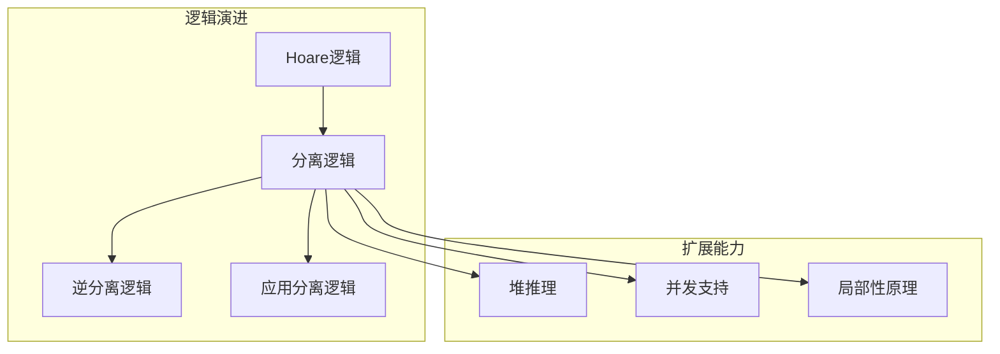
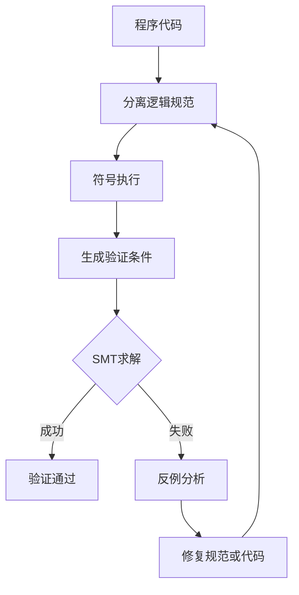
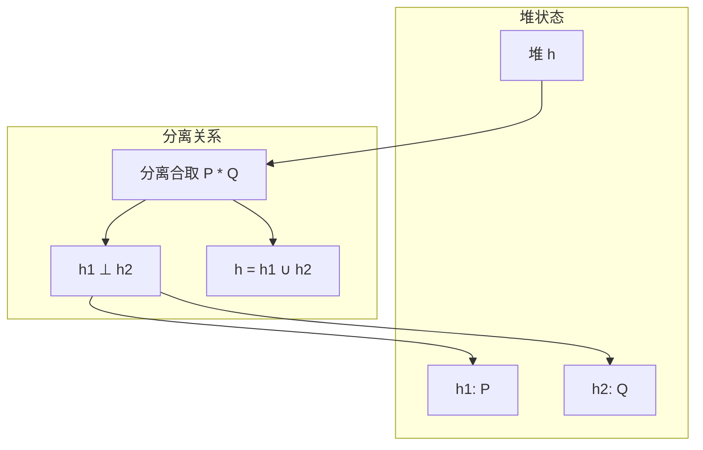
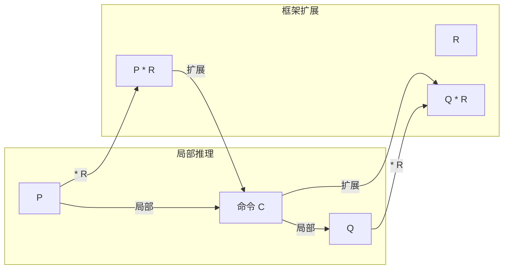
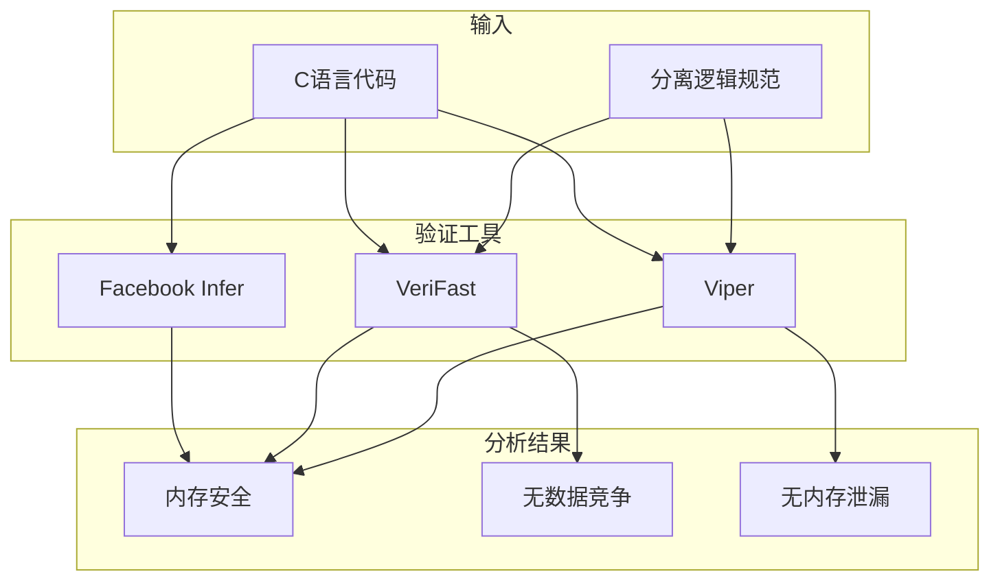

# 分离逻辑

> **所属单元**: Verification/Logic | **前置依赖**: [Hoare逻辑基础](../../01-foundations/03-logic-foundations.md) | **形式化等级**: L5

## 1. 概念定义 (Definitions)

### 1.1 分离逻辑断言

**Def-V-03-01** (分离逻辑断言语法)。分离逻辑断言$P, Q$的语法定义为：

$$P, Q ::= \text{emp} \mid x \mapsto y \mid P \ast Q \mid P \text{--\hspace{-0.5em}*} Q \mid P \land Q \mid P \lor Q \mid \exists x.P \mid \forall x.P$$

其中核心断言：

- **emp**: 空堆，堆域为空
- **$x \mapsto y$**: 单点堆，地址$x$存储值$y$
- **$P \ast Q$**: 分离合取，$P$和$Q$作用在不相交的堆上
- **$P \text{--\hspace{-0.5em}*} Q$**: 分离蕴含，若将满足$P$的堆加到当前堆上，则满足$Q$

**Def-V-03-02** (堆模型)。设$\text{Loc}$为地址集合，$\text{Val}$为值集合：

$$\text{Heap} \triangleq \text{Loc} \rightharpoonup_{\text{fin}} \text{Val}$$

一个堆$h$是有限偏函数。断言的语义：

| 断言 | 语义 | 条件 |
|------|------|------|
| $s, h \models \text{emp}$ | $\text{dom}(h) = \emptyset$ | 堆为空 |
| $s, h \models x \mapsto y$ | $h = \{s(x) \mapsto s(y)\}$ | 单点堆 |
| $s, h \models P \ast Q$ | $\exists h_1, h_2: h = h_1 \uplus h_2 \land s, h_1 \models P \land s, h_2 \models Q$ | 堆可分离 |

**Def-V-03-03** (分离合取)。$P \ast Q$成立当且仅当堆可划分为两个不相交部分，分别满足$P$和$Q$：

$$s, h \models P \ast Q \Leftrightarrow \exists h_1, h_2: h_1 \perp h_2 \land h = h_1 \cdot h_2 \land s, h_1 \models P \land s, h_2 \models Q$$

### 1.2 分离蕴含

**Def-V-03-04** (分离蕴含 / Magic Wand)。$P \text{--\hspace{-0.5em}*} Q$表示：若将满足$P$的堆与当前堆合并，则结果满足$Q$：

$$s, h \models P \text{--\hspace{-0.5em}*} Q \Leftrightarrow \forall h': h \perp h' \land s, h' \models P \Rightarrow s, h \cdot h' \models Q$$

### 1.3 列表与数据结构

**Def-V-03-05** (链表断言)。单链表段定义为：

$$\text{ls}(x, y) \triangleq (x = y \land \text{emp}) \lor (x \neq y \land \exists z: x \mapsto z \ast \text{ls}(z, y))$$

**Def-V-03-06** (树断言)。二叉树定义为：

$$\text{tree}(x) \triangleq (x = \text{nil} \land \text{emp}) \lor (x \neq \text{nil} \land \exists l, r: x \mapsto (l, r) \ast \text{tree}(l) \ast \text{tree}(r))$$

## 2. 属性推导 (Properties)

### 2.1 分离逻辑代数性质

**Lemma-V-03-01** (分离合取性质)。$\ast$满足以下性质：

- **交换律**: $P \ast Q \equiv Q \ast P$
- **结合律**: $(P \ast Q) \ast R \equiv P \ast (Q \ast R)$
- **单位元**: $P \ast \text{emp} \equiv P$
- **单调性**: $P \Rightarrow Q \Rightarrow (P \ast R) \Rightarrow (Q \ast R)$

**Lemma-V-03-02** (分离蕴含性质)。$\text{--\hspace{-0.5em}*}$满足伴随关系：

$$(P \ast Q) \Rightarrow R \quad \Leftrightarrow \quad P \Rightarrow (Q \text{--\hspace{-0.5em}*} R)$$

### 2.2 帧规则

**Def-V-03-07** (帧规则 / Frame Rule)。这是分离逻辑的核心推理规则：

$$\frac{\{P\} C \{Q\}}{\{P \ast R\} C \{Q \ast R\}} \quad \text{if } \text{mod}(C) \cap \text{fv}(R) = \emptyset$$

**Lemma-V-03-03** (帧规则有效性)。帧规则保证局部推理的正确扩展：

若$C$在框架$R$下不修改$R$涉及的变量（即$C$的修改集合与$R$的自由变量不交），则在$P \ast R$前提下执行$C$得到$Q \ast R$。

## 3. 关系建立 (Relations)

### 3.1 与Hoare逻辑的关系



### 3.2 并发分离逻辑

**Def-V-03-08** (并发分离逻辑 / CSL)。扩展分离逻辑支持并发程序验证：

- **并行组合规则**:
$$\frac{\{P_1\} C_1 \{Q_1\} \quad \{P_2\} C_2 \{Q_2\}}{\{P_1 \ast P_2\} C_1 \parallel C_2 \{Q_1 \ast Q_2\}}$$

- **资源不变式**: 共享状态通过资源不变式$I$保护
- **原子块**: 对共享资源的访问必须在原子块内

## 4. 论证过程 (Argumentation)

### 4.1 局部性原理

分离逻辑的核心设计原则是**局部性** (locality)：

1. **堆局部性**: 命令仅影响其前置条件中描述的堆部分
2. **规范局部性**: 可以在局部证明后通过帧规则扩展
3. **组合性**: 小模块的验证结果可组合为大系统验证

### 4.2 验证策略



## 5. 形式证明 / 工程论证 (Proof / Engineering Argument)

### 5.1 帧规则可靠性

**Thm-V-03-01** (帧规则可靠性)。帧规则在标准分离逻辑语义下是可靠的：

$$\vdash \{P\} C \{Q\} \land \text{mod}(C) \cap \text{fv}(R) = \emptyset \Rightarrow \vdash \{P \ast R\} C \{Q \ast R\}$$

**证明概要**：

1. 设初始状态满足$s, h \models P \ast R$
2. 则$h = h_P \uplus h_R$，其中$s, h_P \models P$且$s, h_R \models R$
3. 由于$C$不修改$R$的变量，执行$C$仅影响$h_P$部分
4. 由$\{P\} C \{Q\}$，得结果堆$h' = h'_P \uplus h_R$
5. 其中$s', h'_P \models Q$，且$s', h_R \models R$（不变）
6. 故$s', h' \models Q \ast R$

### 5.2 并发分离逻辑可靠性

**Thm-V-03-02** (CSL可靠性)。若$\{P\} C \{Q\}$在CSL中可证明，则在交错语义下程序满足规范：

$$\vdash_{\text{CSL}} \{P\} C \{Q\} \Rightarrow \models \{P\} C \{Q\}$$

**证明要点**：

1. 资源不变式$I$保证共享状态的一致性
2. 原子块确保对共享状态的互斥访问
3. 分离合取保证线程私有状态不冲突
4. 通过轨迹模拟证明交错执行的性质保持

## 6. 实例验证 (Examples)

### 6.1 链表操作验证

**查找操作规范**:

```
{list(x, xs) * y ↦ _}
y := x.next
{list(x, xs) * y ↦ head(tail(xs))}
```

**插入操作**:

```
{list(x, xs) * y ↦ z}
y.next := x
{list(y, cons(z, xs))}
```

### 6.2 容器隔离验证

```c
// 规范: {container(c1, S1) * container(c2, S2)}
void transfer(container* c1, container* c2, value v) {
    // 分离逻辑保证 c1 和 c2 指向不相交的内存区域
    remove(c1, v);    // {container(c1, S1\{v\}) * container(c2, S2)}
    add(c2, v);       // {container(c1, S1\{v\}) * container(c2, S2∪{v})}
}
// 后条件满足
```

**验证要点**：

- 前置条件确保$c1 \neq c2$（通过分离合取）
- 每个操作仅影响其容器对应的堆片段
- 帧规则自动保持另一容器不变

## 7. 可视化 (Visualizations)

### 7.1 分离逻辑堆模型



### 7.2 帧规则示意图



### 7.3 分离逻辑工具链



## 8. 引用参考 (References)
