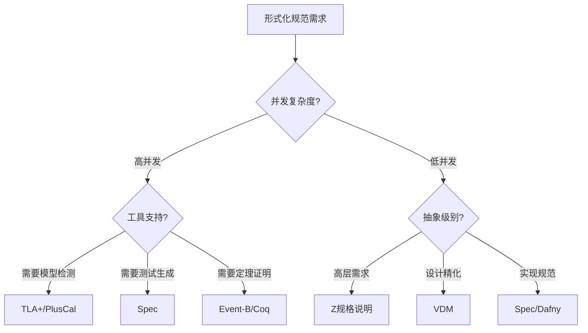
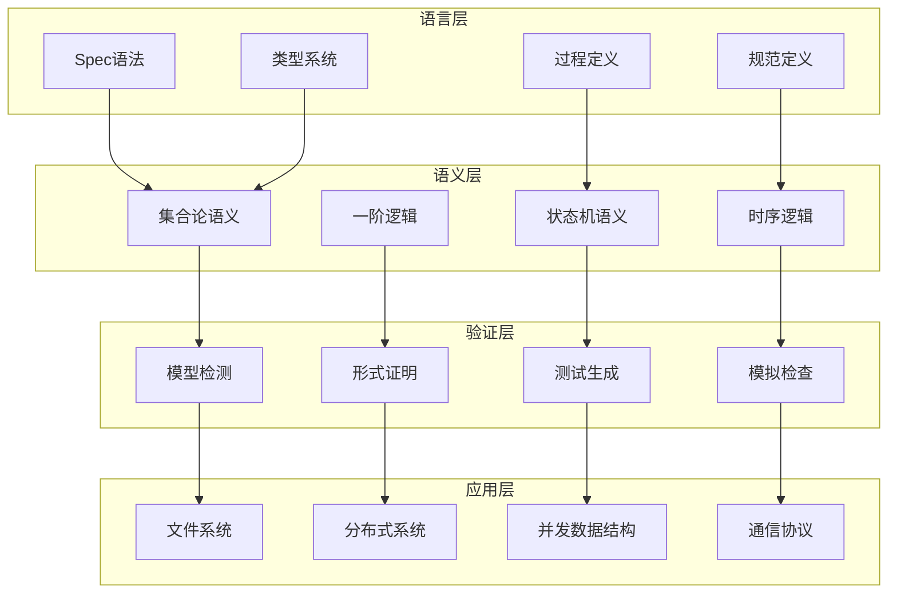
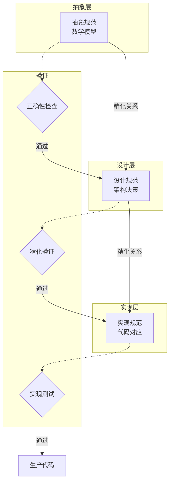
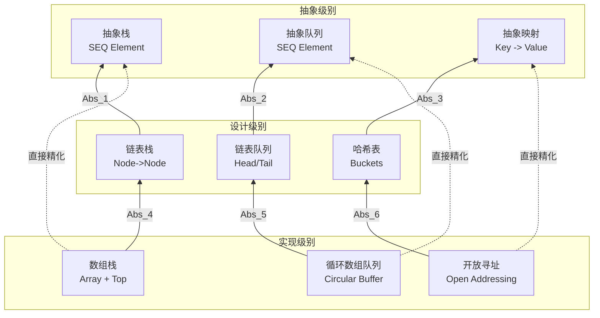
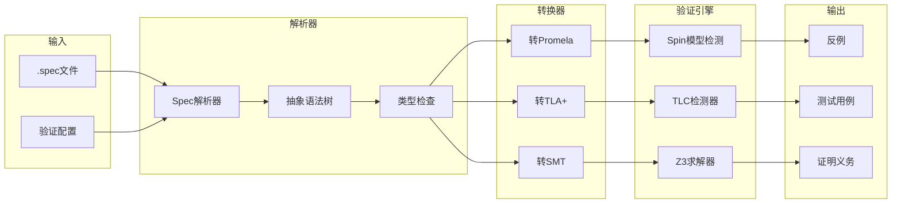
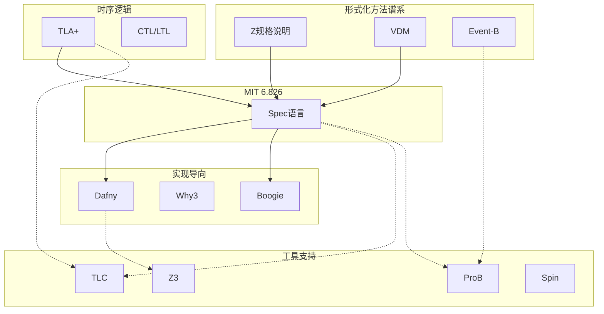

# MIT Spec 规范语言

> **所属单元**: Verification/Logic | **前置依赖**: [TLA+时序逻辑](01-tla-plus.md), [形式逻辑基础](../../01-foundations/03-logic-foundations.md) | **形式化等级**: L5

## 1. 概念定义 (Definitions)

### 1.1 Spec语言概述

**Def-V-05-01** (Spec语言)。Spec是由MIT计算机科学实验室开发的形式化规范语言，主要用于Butler Lampson教授的6.826课程《计算机系统工程原理》。Spec是一种基于集合论和逻辑的高层次规范语言，专门设计用于描述和验证复杂计算机系统的行为。

$$\text{Spec} = (\text{Types}, \text{Vars}, \text{Procs}, \text{Invs}, \text{Specs})$$

其中：

- **Types**: 类型定义集合
- **Vars**: 状态变量集合
- **Procs**: 过程/操作定义
- **Invs**: 不变式约束
- **Specs**: 完整规范定义

**Def-V-05-02** (Spec模块结构)。一个Spec模块由以下组件构成：

```spec
MODULE ModuleName
IMPORT OtherModule
TYPE type definitions
VAR variable declarations
PROC procedure definitions
SPEC specification definitions
```

**Def-V-05-03** (Spec状态空间)。Spec规范的状态空间定义为所有状态变量类型的笛卡尔积：

$$\Sigma_{Spec} = T_1 \times T_2 \times \cdots \times T_n$$

其中每个 $T_i$ 是第 $i$ 个状态变量 $v_i$ 的类型。

### 1.2 设计理念与特点

**Def-V-05-04** (Spec设计原则)。Spec语言基于以下核心设计理念：

1. **简洁性 (Simplicity)**: 语言构造简单，基于集合论和一阶逻辑
2. **表现力 (Expressiveness)**: 能够描述从高层抽象到实现细节的各级规范
3. **可验证性 (Verifiability)**: 支持自动化验证技术，包括模型检测和测试生成
4. **模块化 (Modularity)**: 支持接口抽象和模块组合
5. **状态机基础**: 所有规范本质上都表示状态转换系统

**Def-V-05-05** (Spec抽象级别)。Spec支持三级抽象规范：

| 抽象级别 | 描述 | 用途 |
|---------|------|------|
| **抽象规范** | 最简化的行为描述 | 理解系统本质 |
| **中间规范** | 增加实现细节的精化 | 设计决策验证 |
| **具体规范** | 包含完整实现细节 | 代码实现对应 |

### 1.3 与TLA+的关系

**Def-V-05-06** (Spec与TLA+比较)。Spec和TLA+都是基于时序逻辑的规范语言，但存在重要差异：

| 特性 | Spec | TLA+ |
|------|------|------|
| **开发机构** | MIT LCS | Microsoft Research |
| **主要设计者** | Butler Lampson | Leslie Lamport |
| **教学导向** | 强（6.826课程） | 中等 |
| **模型检测** | 内置，强调测试生成 | TLC，强调状态枚举 |
| **类型系统** | 显式类型声明 | 无类型（基于集合） |
| **过程抽象** | 显式PROC定义 | 基于Action |
| **实现验证** | 内置模拟检查 | 需外部工具 |

**Lemma-V-05-01** (规范可转换性)。任何Spec规范都可以转换为等价的TLA+规范：

$$\forall S_{Spec} : \exists S_{TLA+} : \llbracket S_{Spec} \rrbracket = \llbracket S_{TLA+} \rrbracket$$

*证明概要*: Spec和TLA+都基于相同的数学基础（集合论、时序逻辑），通过将Spec的状态变量映射为TLA+变量，将Spec过程映射为TLA+动作，可构造语义等价的转换。

### 1.4 抽象与实现级别规范

**Def-V-05-07** (抽象函数)。给定实现状态 $C$ 和抽象状态 $A$，抽象函数 $Abs$ 将具体状态映射到抽象状态：

$$Abs : C \to A \cup \{\bot\}$$

其中 $\bot$ 表示无效映射（具体状态不对应任何抽象状态）。

**Def-V-05-08** (表示不变式)。表示不变式 $RI$ 是一个谓词，定义了有效具体状态的集合：

$$RI(c) \triangleq Abs(c) \neq \bot$$

**Def-V-05-09** (精化关系)。规范 $Spec_{impl}$ 精化规范 $Spec_{abs}$，当且仅当存在抽象函数 $Abs$ 使得：

$$\forall \sigma_{impl} : \sigma_{impl} \models Spec_{impl} \Rightarrow Abs(\sigma_{impl}) \models Spec_{abs}$$

## 2. 语法详解 (Syntax)

### 2.1 模块和接口定义

**Def-V-05-10** (模块语法)。Spec模块是基本的组织单元：

```spec
MODULE ModuleName
IMPORT M1, M2  % 导入其他模块
EXPORT I1, I2  % 导出接口

% 模块体
```

**Def-V-05-11** (接口定义)。接口定义模块对外提供的服务契约：

```spec
INTERFACE InterfaceName
  TYPE InputType, OutputType
  PROC Operation(in: InputType) -> OutputType
  REQUIRES precondition
  ENSURES postcondition
END INTERFACE
```

**Def-V-05-12** (模块组合)。模块可以通过IMPORT组合，支持三种组合方式：

1. **使用组合**: `IMPORT M` - 使用M中导出的定义
2. **重命名组合**: `IMPORT M AS N` - 使用别名避免命名冲突
3. **选择性导入**: `IMPORT M {def1, def2}` - 仅导入指定定义

### 2.2 类型系统

**Def-V-05-13** (Spec基本类型)。Spec提供以下基本类型：

| 类型 | 描述 | 示例 |
|------|------|------|
| `Int` | 整数 | `0`, `-5`, `42` |
| `Nat` | 自然数 | `0`, `1`, `2` |
| `Bool` | 布尔值 | `true`, `false` |
| `Char` | 字符 | `'a'`, `'Z'` |
| `Text` | 字符串 | `"hello"` |

**Def-V-05-14** (复合类型构造器)。Spec支持以下类型构造：

```spec
% 集合类型
SET OF ElementType

% 序列类型
SEQ OF ElementType

% 映射/函数类型
KEY -> VALUE

% 记录类型
[name: Type1, age: Type2]

% 元组类型
(Type1, Type2, Type3)

% 变体/联合类型
Type1 | Type2
```

**Def-V-05-15** (类型不变式)。可以为类型定义约束：

```spec
TYPE BoundedInt = {i: Int | 0 <= i AND i <= 100}
TYPE NonEmptySeq[T] = {s: SEQ OF T | s /= []}
TYPE SortedSeq = {s: SEQ OF Int | ALL i, j | i <= j => s[i] <= s[j]}
```

**Def-V-05-16** (类型等价)。两种类型 $T_1$ 和 $T_2$ 等价当且仅当它们具有相同的值集合：

$$T_1 \equiv T_2 \iff \llbracket T_1 \rrbracket = \llbracket T_2 \rrbracket$$

### 2.3 过程和方法

**Def-V-05-17** (过程声明)。过程是状态转换的基本单元：

```spec
PROC procedureName(arg1: Type1, arg2: Type2) -> ReturnType
  REQUIRES pre(arg1, arg2)      % 前置条件
  MODIFIES var1, var2           % 修改列表
  ENSURES post(arg1, arg2, RET) % 后置条件
  % 过程体（可选，用于可执行规范）
END PROC
```

**Def-V-05-18** (过程语义)。过程的语义定义为状态转换关系：

$$\llbracket P \rrbracket \subseteq (State \times Input) \times (State \times Output)$$

**Def-V-05-19** (原子过程与非原子过程)。

- **原子过程** (`ATOMIC PROC`): 状态转换不可中断，满足：
  $$\forall s, i, s', o : (s, i, s', o) \in \llbracket P \rrbracket \Rightarrow \text{atomic}(s \to s')$$

- **非原子过程** (`PROC`): 允许中间状态被其他过程交错。

**Def-V-05-20** (并发过程)。并发过程使用 `CONCURRENT` 修饰：

```spec
CONCURRENT PROC concurrentOperation(arg: InputType) -> OutputType
  % 并发执行的过程
END PROC
```

### 2.4 前置/后置条件

**Def-V-05-21** (前置条件)。前置条件 $Pre_P$ 定义过程 $P$ 可合法调用的状态：

$$Pre_P : State \times Input \to Bool$$

违反前置条件的调用是未定义行为。

**Def-V-05-22** (后置条件)。后置条件 $Post_P$ 定义过程执行后的状态约束：

$$Post_P : State \times Input \times State' \times Output \to Bool$$

其中 $State'$ 表示执行后的状态，$Output$ 表示返回值。

**Def-V-05-23** (完全正确性)。过程 $P$ 完全正确定义为：

$$\{Pre_P\} P \{Post_P\} \land \text{Termination}(P)$$

即：若前置条件满足，则过程终止且后置条件满足。

**Def-V-05-24** (Hoare三元组在Spec中的表达)。Spec规范可以表示为Hoare逻辑：

```spec
PROC P(x: T1) -> T2
  REQUIRES H(x)
  ENSURES Q(x, RET)
```

对应Hoare三元组：$\{H(x)\} P \{Q(x, \text{result})\}$

### 2.5 并发原语

**Def-V-05-25** (原子操作)。原子操作是不可分割的最小执行单元：

```spec
ATOMIC OPERATION compareAndSwap(loc: REF Int, expected: Int, newVal: Int) -> Bool
  ENSURES RET = (loc^ = expected) AND
          (RET => loc' = newVal) AND
          (NOT RET => loc' = loc^)
END OPERATION
```

**Def-V-05-26** (锁原语)。Spec支持互斥锁规范：

```spec
TYPE Lock

PROC acquire(l: Lock)
  REQUIRES NOT held(l)
  ENSURES held(l)
END PROC

PROC release(l: Lock)
  REQUIRES held(l)
  ENSURES NOT held(l)
END PROC
```

**Def-V-05-27** (条件变量)。条件变量支持同步：

```spec
PROC wait(cv: Condition, l: Lock)
  REQUIRES held(l)
  MODIFIES held(l)
  ENSURES NOT held(l)  % 原子释放锁并等待

PROC signal(cv: Condition)
  % 唤醒等待线程
END PROC
```

**Def-V-05-28** (原子性粒度)。原子性可以通过 `ATOMIC` 块显式指定：

```spec
PROC transfer(from: Account, to: Account, amount: Int)
  ATOMIC
    REQUIRES from.balance >= amount
    MODIFIES from.balance, to.balance
    ENSURES from.balance' = from.balance - amount AND
            to.balance' = to.balance + amount
  END ATOMIC
END PROC
```

## 3. 规范编写 (Specification Writing)

### 3.1 顺序规范的编写

**Def-V-05-29** (顺序规范)。顺序规范描述单线程环境下的系统行为，不考虑并发交错。

顺序规范的基本模板：

```spec
MODULE SequentialStack

TYPE Element
TYPE Stack = SEQ OF Element

VAR s: Stack  % 栈状态

% 初始状态
INIT s = []

PROC push(e: Element)
  MODIFIES s
  ENSURES s' = [e] ++ s  % 前置拼接
END PROC

PROC pop() -> Element
  REQUIRES s /= []  % 栈非空
  MODIFIES s
  ENSURES s = [RET] ++ s'  % RET是栈顶元素
END PROC

PROC peek() -> Element
  REQUIRES s /= []
  ENSURES RET = s[0]  % 返回栈顶但不修改
END PROC

SPEC StackSpec = INIT AND [][push OR pop OR peek]_s
```

**Def-V-05-30** (函数式规范风格)。Spec支持纯函数式风格，强调无副作用：

```spec
FUNC factorial(n: Nat) -> Nat
  REQUIRES n >= 0
  ENSURES (n = 0 => RET = 1) AND
          (n > 0 => RET = n * factorial(n-1))
END FUNC
```

**Def-V-05-31** (状态机规范)。顺序系统可以建模为状态机：

```spec
TYPE State = enum {Idle, Processing, Done}

VAR state: State
declare VAR input: Input
declare VAR output: Output

PROC process(in: Input)
  REQUIRES state = Idle
  MODIFIES state, output
  ENSURES state' = Processing AND
          (state' = Processing UNTIL computationDone()) AND
          (computationDone() => state'' = Done)
END PROC
```

### 3.2 并发规范的编写

**Def-V-05-32** (并发规范)。并发规范描述多线程/进程环境下的系统行为，必须考虑执行交错。

```spec
MODULE ConcurrentCounter

VAR count: Int
VAR lock: Lock

INIT count = 0

PROC increment()
  ATOMIC
    MODIFIES count
    ENSURES count' = count + 1
  END ATOMIC
END PROC

% 或使用显式锁
PROC incrementLocked()
  acquire(lock)
  TRY
    MODIFIES count
    ENSURES count' = count + 1
  FINALLY
    release(lock)
  END TRY
END PROC
```

**Def-V-05-33** (交错语义)。并发过程的语义定义为所有可能的交错执行：

$$\llbracket P_1 \parallel P_2 \rrbracket = \bigcup_{\sigma \in \text{Interleavings}} \text{Apply}(\sigma, [P_1, P_2])$$

**Def-V-05-34** (线性化点)。并发操作的线性化点是使其看起来瞬间完成的点：

```spec
PROC enqueue(q: Queue, e: Element)
  % 线性化点在更新尾指针的时刻
  ATOMIC
    REQUIRES ...
    MODIFIES q.tail, q.tail.next
    ENSURES ...  % 队列正确性
  END ATOMIC
END PROC
```

### 3.3 抽象函数的表示

**Def-V-05-35** (抽象函数定义)。抽象函数将具体表示映射到抽象值：

```spec
FUNC Abs(rep: ConcreteRep) -> AbstractType
  REQUIRES RI(rep)  % 表示不变式成立
  ENSURES ...
END FUNC

% 示例：用数组和计数器实现栈
TYPE ArrayStack = [arr: ARRAY Int OF Element, top: Int]

FUNC Abs(stack: ArrayStack) -> SEQ OF Element
  REQUIRES 0 <= stack.top AND stack.top < LENGTH(stack.arr)
  ENSURES RET = stack.arr[0..stack.top-1]
END FUNC
```

**Def-V-05-36** (构造抽象函数)。对于复杂数据结构，抽象函数可能涉及复杂计算：

```spec
% 用链表实现队列
TYPE Node = [value: Element, next: REF Node]
TYPE LinkedQueue = [head: REF Node, tail: REF Node]

FUNC Abs(q: LinkedQueue) -> SEQ OF Element
  REQUIRES q.head /= NULL  % 非空队列
  ENSURES RET = collectNodes(q.head, q.tail)
END FUNC

FUNC collectNodes(h: REF Node, t: REF Node) -> SEQ OF Element
  REQUIRES reachable(h, t)
  ENSURES IF h = t THEN RET = []
          ELSE RET = [h.value] ++ collectNodes(h.next, t)
END FUNC
```

### 3.4 不变式表达

**Def-V-05-37** (不变式)。不变式 $I$ 是在所有可达状态上都成立的谓词：

$$I : State \to Bool \quad \text{且} \quad \forall s \in \text{Reachable} : I(s)$$

```spec
INVARIANT StackInvariant
  0 <= top AND top <= LENGTH(arr) AND
  (top = 0 => isEmpty)
```

**Def-V-05-38** (归纳不变式)。归纳不变式需要满足：

1. **初始化**: $Init \Rightarrow I$
2. **保持**: $I \land Next \Rightarrow I'$

```spec
INVARIANT BalanceInvariant
  ALL a: Account | a.balance >= 0
  % 检查：
  % 1. 初始时所有账户余额为0或正数
  % 2. 每次转账操作保持此性质
```

**Def-V-05-39** (类型特定不变式)。类型可以关联不变式：

```spec
TYPE PositiveBalance = {
  a: Account | a.balance > 0
}

TYPE SortedList = {
  l: LIST Int | ALL i, j | i <= j => l[i] <= l[j]
}
```

### 3.5 模拟关系

**Def-V-05-40** (前向模拟)。前向模拟关系 $R \subseteq C \times A$ 满足：

$$\forall c, a, c' : R(c, a) \land C(c, c') \Rightarrow \exists a' : A(a, a') \land R(c', a')$$

```spec
RELATION ForwardSimulation(c: Concrete, a: Abstract)
  = Abs(c) = a

% 需要证明：
% 1. Init_C(c) => exists a: Init_A(a) AND R(c, a)
% 2. R(c, a) AND Step_C(c, c') => exists a': Step_A(a, a') AND R(c', a')
```

**Def-V-05-41** (后向模拟)。后向模拟与前向模拟方向相反：

$$\forall a, c', a' : R(c', a') \land A(a, a') \Rightarrow \exists c : C(c, c') \land R(c, a)$$

**Def-V-05-42** (双模拟)。双模拟结合前向和后向模拟：

$$c \sim a \iff \text{ForwardSim}(c, a) \land \text{BackwardSim}(c, a)$$

## 4. 论证过程 (Argumentation)

### 4.1 Spec设计决策分析

Spec语言的设计反映了以下工程权衡：

**权衡1：显式类型 vs 隐式类型**

- Spec选择显式类型声明，便于静态检查
- TLA+选择隐式类型（集合论基础），更灵活但需运行时检查

**权衡2：过程抽象 vs 纯Action**

- Spec使用显式PROC定义，更接近编程语言
- TLA+基于Action，更接近数学描述

**权衡3：内置工具 vs 外部工具**

- Spec内置测试生成器，强调可测试性
- TLA+依赖外部工具链，更模块化

### 4.2 与其他规范语言对比



### 4.3 规范可验证性分析

Spec语言的设计强调**可验证性**作为一等公民：

1. **可判定性**: 限制规范构造以确保关键性质可判定
2. **有限状态**: 通过类型约束确保状态空间可探索
3. **模块化验证**: 接口契约支持组合推理
4. **测试生成**: 从规范自动生成测试用例

## 5. 形式证明 / 工程论证 (Proof / Engineering Argument)

### 5.1 规范精化关系

**Thm-V-05-01** (精化传递性)。精化关系是传递的：

$$Spec_3 \sqsubseteq Spec_2 \land Spec_2 \sqsubseteq Spec_1 \Rightarrow Spec_3 \sqsubseteq Spec_1$$

**证明**:

给定抽象函数 $Abs_{32}: C_3 \to C_2$ 和 $Abs_{21}: C_2 \to C_1$，构造复合抽象函数：

$$Abs_{31}(c_3) = Abs_{21}(Abs_{32}(c_3))$$

1. 设 $\sigma_3$ 是 $Spec_3$ 的任意执行
2. 由 $Spec_3 \sqsubseteq Spec_2$，$Abs_{32}(\sigma_3)$ 是 $Spec_2$ 的有效执行
3. 由 $Spec_2 \sqsubseteq Spec_1$，$Abs_{21}(Abs_{32}(\sigma_3))$ 是 $Spec_1$ 的有效执行
4. 因此 $Abs_{31}(\sigma_3)$ 是 $Spec_1$ 的有效执行
5. 即 $Spec_3 \sqsubseteq Spec_1$ ∎

**Thm-V-05-02** (精化与实现正确性)。若 $Impl \sqsubseteq Spec$ 且 $Spec$ 满足性质 $P$，则 $Impl$ 满足抽象性质 $P_{abs}$：

$$Impl \sqsubseteq Spec \land Spec \models P \Rightarrow Impl \models P \circ Abs$$

### 5.2 模拟正确性

**Thm-V-05-03** (前向模拟蕴含精化)。若存在前向模拟关系 $R$ 连接 $C$ 和 $A$，则 $C$ 精化 $A$：

$$\exists R : \text{ForwardSim}_R(C, A) \Rightarrow C \sqsubseteq A$$

**证明**:

构造证明按归纳法：

1. **基础**: $Init_C(c_0) \Rightarrow \exists a_0 : Init_A(a_0) \land R(c_0, a_0)$
   - 由前向模拟定义的第一个条件

2. **归纳**: 假设 $R(c_n, a_n)$ 且 $C(c_n, c_{n+1})$
   - 由前向模拟的第二个条件，$\exists a_{n+1} : A(a_n, a_{n+1}) \land R(c_{n+1}, a_{n+1})$

3. **结论**: 构造的 $a_0, a_1, \ldots$ 是 $A$ 的有效执行，且与 $c$ 序列保持 $R$ 关系 ∎

**Thm-V-05-04** (模拟关系的完备性)。对于确定性抽象规范，前向模拟是完备的证明技术：

$$C \sqsubseteq A \land \text{Deterministic}(A) \Rightarrow \exists R : \text{ForwardSim}_R(C, A)$$

### 5.3 组合推理

**Thm-V-05-05** (模块化验证)。设系统由模块 $M_1, M_2, \ldots, M_n$ 组成，每个模块满足其规范：

$$(\forall i : M_i \models Spec_i) \land \text{Compatible}(Spec_1, \ldots, Spec_n) \Rightarrow System \models \text{Compose}(Spec_1, \ldots, Spec_n)$$

**证明概要**:

1. 独立性: 各模块内部状态不相交
2. 接口一致性: 模块间通信遵循共同协议
3. 性质组合: 组合规范的性质由各模块性质推导
4. 干涉自由: 并发模块间无有害干扰

**Thm-V-05-06** (不变式组合)。若 $I_1$ 和 $I_2$ 分别是模块 $M_1$ 和 $M_2$ 的不变式，且模块满足无干扰条件，则 $I_1 \land I_2$ 是组合系统的不变式：

$$\text{NonInterference}(M_1, M_2) \Rightarrow (M_1 \models \square I_1 \land M_2 \models \square I_2) \Rightarrow (M_1 \parallel M_2) \models \square(I_1 \land I_2)$$

## 6. 案例研究 (Examples)

### 6.1 文件系统规范

文件系统是操作系统中最复杂的子系统之一，Spec可以对其进行清晰规范：

```spec
MODULE FileSystem

IMPORT BlockDevice

TYPE FileID = Int
TYPE BlockID = Int
TYPE Offset = Int
TYPE FileMode = enum {Read, Write, ReadWrite}

TYPE INode = [
  size: Int,
  mode: FileMode,
  blocks: SET OF BlockID,
  created: Time,
  modified: Time
]

TYPE DirectoryEntry = [name: Text, inode: FileID]

% 状态变量
VAR inodes: FileID -> INode
VAR directories: FileID -> SET OF DirectoryEntry
VAR freeInodes: SET OF FileID
VAR freeBlocks: SET OF BlockID
VAR blockDevice: BlockDevice.State

% 表示不变式
INVARIANT FileSystemInvariant
  % 所有活跃inode都有有效块
  (ALL fid | fid IN DOMAIN inodes => inodes[fid].blocks SUBSET freeBlocks^c) AND
  % 目录只包含存在的文件
  (ALL fid, entry | entry IN directories[fid] => entry.inode IN DOMAIN inodes) AND
  % 无循环目录结构
  (ALL fid | NOT Reachable(fid, fid, directories))

PROC create(parent: FileID, name: Text, mode: FileMode) -> FileID
  REQUIRES parent IN DOMAIN directories AND
           NOT (EXISTS e | e IN directories[parent] AND e.name = name)
  MODIFIES inodes, directories, freeInodes
  ENSURES
    % 新文件被创建
    RET IN DOMAIN inodes' AND
    inodes'[RET].mode = mode AND
    inodes'[RET].size = 0 AND
    % 目录更新
    directories'[parent] = directories[parent] UNION {[name: name, inode: RET]} AND
    % 其他不变
    ALL fid | fid /= parent => directories'[fid] = directories[fid] AND
    ALL fid | fid /= RET => inodes'[fid] = inodes[fid]
END PROC

PROC write(fid: FileID, offset: Int, data: SEQ OF Byte)
  REQUIRES fid IN DOMAIN inodes AND
           inodes[fid].mode IN {Write, ReadWrite} AND
           offset >= 0
  MODIFIES inodes, blockDevice, freeBlocks
  ENSURES
    % 文件大小更新
    inodes'[fid].size = MAX(inodes[fid].size, offset + LENGTH(data)) AND
    % 数据写入块设备
    BlockDeviceWritten(blockDevice, blockDevice', inodes[fid].blocks, offset, data) AND
    % 修改时间更新
    inodes'[fid].modified = now() AND
    % 其他不变
    ALL f | f /= fid => inodes'[f] = inodes[f]
END PROC

PROC read(fid: FileID, offset: Int, length: Int) -> SEQ OF Byte
  REQUIRES fid IN DOMAIN inodes AND
           offset >= 0 AND length >= 0 AND
           inodes[fid].mode IN {Read, ReadWrite}
  ENSURES
    RET = BlockDeviceRead(blockDevice, inodes[fid].blocks, offset, length) AND
    inodes' = inodes AND directories' = directories
END PROC

SPEC FileSystemSpec = INIT AND
  [][create OR write OR read OR delete OR mkdir]_
    (inodes, directories, freeInodes, freeBlocks, blockDevice)
```

### 6.2 分布式系统规范

使用Spec描述分布式共识协议（简化版Raft）：

```spec
MODULE RaftConsensus

TYPE ServerID = Int
TYPE Term = Int
TYPE LogEntry = [term: Term, command: Command]

TYPE ServerState = enum {Follower, Candidate, Leader}

VAR currentTerm: ServerID -> Term
VAR votedFor: ServerID -> (ServerID | Null)
var log: ServerID -> SEQ OF LogEntry
VAR commitIndex: ServerID -> Int
VAR state: ServerID -> ServerState

% 消息类型
TYPE Message =
  RequestVote {term: Term, candidateId: ServerID, lastLogIndex: Int, lastLogTerm: Term} |
  RequestVoteResponse {term: Term, voteGranted: Bool} |
  AppendEntries {term: Term, leaderId: ServerID, prevLogIndex: Int,
                 prevLogTerm: Term, entries: SEQ OF LogEntry, leaderCommit: Int} |
  AppendEntriesResponse {term: Term, success: Bool, matchIndex: Int}

VAR messages: SET OF Message

% 不变式：每个任期内最多一个Leader
INVARIANT LeaderUniqueness
  ALL s1, s2 |
    state[s1] = Leader AND state[s2] = Leader AND currentTerm[s1] = currentTerm[s2]
    => s1 = s2

% 不变式：日志匹配属性
INVARIANT LogMatching
  ALL s1, s2, i |
    i <= commitIndex[s1] AND i <= commitIndex[s2] => log[s1][i] = log[s2][i]

PROC startElection(s: ServerID)
  REQUIRES state[s] = Follower
  MODIFIES currentTerm, votedFor, state, messages
  ENSURES
    currentTerm'[s] = currentTerm[s] + 1 AND
    votedFor'[s] = s AND
    state'[s] = Candidate AND
    % 发送RequestVote给所有服务器
    messages' = messages UNION
      {RequestVote {term: currentTerm'[s], candidateId: s, ...} | FORALL peer}
END PROC

PROC handleRequestVote(s: ServerID, msg: RequestVote)
  ATOMIC
    REQUIRES msg IN messages
    MODIFIES currentTerm, votedFor, messages
    ENSURES
      IF msg.term > currentTerm[s] THEN
        currentTerm'[s] = msg.term AND
        votedFor'[s] = NULL AND
        grant = LogUpToDate(s, msg)
      ELSE IF msg.term = currentTerm[s] AND
              (votedFor[s] = NULL OR votedFor[s] = msg.candidateId) AND
              LogUpToDate(s, msg) THEN
        grant = true AND votedFor'[s] = msg.candidateId
      ELSE
        grant = false
      END IF AND
      messages' = messages UNION {RequestVoteResponse {term: currentTerm'[s], voteGranted: grant}}
  END ATOMIC
END PROC

PROC becomeLeader(s: ServerID)
  REQUIRES state[s] = Candidate AND
           MajorityVotes(s, currentTerm[s])
  MODIFIES state
  ENSURES state'[s] = Leader
END PROC

SPEC RaftSpec = INIT AND [][startElection OR handleRequestVote OR
                            becomeLeader OR handleAppendEntries OR ...]_allVars
```

### 6.3 并发数据结构规范

无锁队列（Michael-Scott Queue）的Spec规范：

```spec
MODULE LockFreeQueue

TYPE Node = [value: Element, next: REF Node]
TYPE Queue = [head: REF Node, tail: REF Node]

VAR Q: Queue
VAR heap: REF Node -> Node  % 模拟堆内存

% 辅助函数：计算队列的抽象值
FUNC AbsQueue(q: Queue) -> SEQ OF Element
  REQUIRES q.head /= NULL
  ENSURE
    IF q.head = q.tail THEN RET = []
    ELSE RET = CollectValues(q.head.next, q.tail)
END FUNC

FUNC CollectValues(n: REF Node, end: REF Node) -> SEQ OF Element
  REQUIRES reachable(n, end)
  ENSURES
    IF n = end THEN RET = []
    ELSE RET = [heap[n].value] ++ CollectValues(heap[n].next, end)
END FUNC

% 不变式：队列结构有效
INVARIANT QueueStructure
  Q.head /= NULL AND Q.tail /= NULL AND
  reachable(Q.head, Q.tail) AND
  Q.tail.next = NULL

PROC enqueue(e: Element)
  LOCAL newNode: REF Node

  % 分配新节点
  newNode = ALLOC([value: e, next: NULL])

  LOOP
    VAR tail: REF Node = Q.tail
    VAR next: REF Node = heap[tail].next

    IF tail = Q.tail THEN  % 检查tail是否变化
      IF next = NULL THEN
        % 尝试链接新节点
        IF CAS(heap[tail].next, next, newNode) THEN
          % 尝试推进tail
          CAS(Q.tail, tail, newNode)
          RETURN
        END IF
      ELSE
        % 帮助推进tail
        CAS(Q.tail, tail, next)
      END IF
    END IF
  END LOOP

  ENSURES AbsQueue(Q') = AbsQueue(Q) ++ [e]
END PROC

PROC dequeue() -> (Element | Empty)
  LOOP
    VAR head: REF Node = Q.head
    VAR tail: REF Node = Q.tail
    VAR next: REF Node = heap[head].next

    IF head = Q.head THEN
      IF head = tail THEN
        IF next = NULL THEN
          RETURN Empty  % 队列为空
        END IF
        % 帮助推进tail
        CAS(Q.tail, tail, next)
      ELSE
        VAR value: Element = heap[next].value
        IF CAS(Q.head, head, next) THEN
          RETURN value
        END IF
      END IF
    END IF
  END LOOP

  ENSURES
    (RET = Empty AND AbsQueue(Q) = []) OR
    (RET = head(AbsQueue(Q)) AND AbsQueue(Q') = tail(AbsQueue(Q)))
END PROC
```

### 6.4 完整Spec代码示例

下面是一个完整的银行交易系统规范，展示Spec的各种特性：

```spec
================================================================================
MODULE BankTransactionSystem
================================================================================
% 完整银行交易系统规范
% 展示Spec语言的完整特性
================================================================================

IMPORT Time, Currency

================================================================================
% 类型定义
================================================================================

TYPE AccountID = Nat
TYPE TransactionID = Nat
TYPE Amount = {a: Int | a >= 0}
TYPE Timestamp = Time.Timestamp

TYPE Account = [
  id: AccountID,
  balance: Amount,
  owner: Text,
  created: Timestamp,
  status: AccountStatus
]

TYPE AccountStatus = enum {Active, Frozen, Closed}

TYPE Transaction = [
  id: TransactionID,
  from: AccountID,
  to: AccountID,
  amount: Amount,
  timestamp: Timestamp,
  status: TransactionStatus
]

TYPE TransactionStatus =
  enum {Pending, Completed, Failed, Reversed}

TYPE TransferResult =
  Success {txId: TransactionID} |
  InsufficientFunds {available: Amount, required: Amount} |
  InvalidAccount {accountId: AccountID} |
  AccountFrozen {accountId: AccountID} |
  SystemError {code: Int}

================================================================================
% 状态变量
================================================================================

VAR accounts: AccountID -> Account
VAR transactions: TransactionID -> Transaction
VAR nextAccountId: AccountID
VAR nextTransactionId: TransactionID
VAR systemTime: Timestamp
VAR auditLog: SEQ OF AuditEntry

TYPE AuditEntry = [
  timestamp: Timestamp,
  action: Text,
  details: Text
]

================================================================================
% 表示不变式
================================================================================

INVARIANT SystemInvariant
  % 账户ID唯一性
  (ALL a1, a2 | a1 /= a2 => accounts[a1].id /= accounts[a2].id) AND

  % 交易ID唯一性
  (ALL t1, t2 | t1 /= t2 => transactions[t1].id /= transactions[t2].id) AND

  % 交易金额有效性
  (ALL t | transactions[t].amount > 0) AND

  % 账户余额非负
  (ALL a | accounts[a].balance >= 0) AND

  % 已完成交易的有效性
  (ALL t | transactions[t].status = Completed =>
           transactions[t].from IN DOMAIN accounts AND
           transactions[t].to IN DOMAIN accounts AND
           transactions[t].from /= transactions[t].to) AND

  % 单调递增ID
  (ALL a | accounts[a].id < nextAccountId) AND
  (ALL t | transactions[t].id < nextTransactionId) AND

  % 审计日志完整性
  (LENGTH(auditLog) >= COUNT(t | transactions[t].status = Completed))

================================================================================
% 辅助函数
================================================================================

FUNC isValidAccount(id: AccountID) -> Bool
  = id IN DOMAIN accounts AND accounts[id].status /= Closed
END FUNC

FUNC isActiveAccount(id: AccountID) -> Bool
  = isValidAccount(id) AND accounts[id].status = Active
END FUNC

FUNC hasSufficientFunds(id: AccountID, amount: Amount) -> Bool
  = isValidAccount(id) AND accounts[id].balance >= amount
END FUNC

FUNC totalSystemBalance() -> Amount
  = SUM(a | accounts[a].balance)
END FUNC

================================================================================
% 过程定义
================================================================================

PROC createAccount(owner: Text, initialDeposit: Amount) -> AccountID
  REQUIRES initialDeposit >= 0
  MODIFIES accounts, nextAccountId, auditLog
  ATOMIC
    VAR newId: AccountID = nextAccountId

    accounts' = accounts WITH [newId -> [
      id: newId,
      balance: initialDeposit,
      owner: owner,
      created: systemTime,
      status: Active
    ]]

    nextAccountId' = newId + 1

    auditLog' = auditLog ++ [[
      timestamp: systemTime,
      action: "CREATE_ACCOUNT",
      details: FORMAT("id={} owner={} deposit={}", newId, owner, initialDeposit)
    ]]

    RET = newId
  END ATOMIC

  ENSURES
    RET >= 0 AND
    accounts'[RET].owner = owner AND
    accounts'[RET].balance = initialDeposit AND
    accounts'[RET].status = Active
END PROC

PROC transfer(from: AccountID, to: AccountID, amount: Amount) -> TransferResult
  REQUIRES amount > 0
  MODIFIES accounts, transactions, nextTransactionId, auditLog
  ATOMIC
    % 验证前提条件
    IF NOT isValidAccount(from) THEN
      RET = InvalidAccount {accountId: from}
    ELSE IF NOT isValidAccount(to) THEN
      RET = InvalidAccount {accountId: to}
    ELSE IF accounts[from].status = Frozen THEN
      RET = AccountFrozen {accountId: from}
    ELSE IF accounts[to].status = Frozen THEN
      RET = AccountFrozen {accountId: to}
    ELSE IF accounts[from].balance < amount THEN
      RET = InsufficientFunds {
        available: accounts[from].balance,
        required: amount
      }
    ELSE
      % 执行转账
      VAR txId: TransactionID = nextTransactionId

      accounts' = accounts WITH [
        from -> accounts[from] WITH [balance: accounts[from].balance - amount],
        to -> accounts[to] WITH [balance: accounts[to].balance + amount]
      ]

      transactions' = transactions WITH [txId -> [
        id: txId,
        from: from,
        to: to,
        amount: amount,
        timestamp: systemTime,
        status: Completed
      ]]

      nextTransactionId' = txId + 1

      auditLog' = auditLog ++ [[
        timestamp: systemTime,
        action: "TRANSFER",
        details: FORMAT("tx={} from={} to={} amount={}",
                       txId, from, to, amount)
      ]]

      RET = Success {txId: txId}
    END IF
  END ATOMIC

  ENSURES
    CASE RET OF
      Success s =>
        accounts'[from].balance = accounts[from].balance - amount AND
        accounts'[to].balance = accounts[to].balance + amount AND
        transactions'[s.txId].status = Completed,
      InsufficientFunds _ => accounts' = accounts,
      InvalidAccount _ => accounts' = accounts,
      AccountFrozen _ => accounts' = accounts
    END CASE
END PROC

PROC freezeAccount(accountId: AccountID) -> Bool
  REQUIRES isValidAccount(accountId)
  MODIFIES accounts, auditLog
  ATOMIC
    accounts' = accounts WITH [
      accountId -> accounts[accountId] WITH [status: Frozen]
    ]

    auditLog' = auditLog ++ [[
      timestamp: systemTime,
      action: "FREEZE_ACCOUNT",
      details: FORMAT("account={}", accountId)
    ]]

    RET = true
  END ATOMIC

  ENSURES accounts'[accountId].status = Frozen
END PROC

PROC unfreezeAccount(accountId: AccountID, authCode: Text) -> Bool
  REQUIRES isValidAccount(accountId) AND accounts[accountId].status = Frozen
  REQUIRES verifyAuth(authCode)
  MODIFIES accounts, auditLog
  ATOMIC
    accounts' = accounts WITH [
      accountId -> accounts[accountId] WITH [status: Active]
    ]

    auditLog' = auditLog ++ [[
      timestamp: systemTime,
      action: "UNFREEZE_ACCOUNT",
      details: FORMAT("account={}", accountId)
    ]]

    RET = true
  END ATOMIC

  ENSURES accounts'[accountId].status = Active
END PROC

PROC getBalance(accountId: AccountID) -> Amount
  REQUIRES isValidAccount(accountId)
  ENSURES
    RET = accounts[accountId].balance AND
    accounts' = accounts AND transactions' = transactions
END PROC

PROC getTransactionHistory(accountId: AccountID) -> SEQ OF Transaction
  REQUIRES isValidAccount(accountId)
  ENSURES
    RET = FILTER(transactions, t =>
           t.from = accountId OR t.to = accountId) AND
    accounts' = accounts AND transactions' = transactions
END PROC

================================================================================
% 全局不变式验证
================================================================================

% 资金守恒：系统总余额保持不变（除创建账户时）
INVARIANT MoneyConservation
  ALL s, s' |
    (transfer(_, _, _) OR freezeAccount(_) OR unfreezeAccount(_))
    => totalSystemBalance() = totalSystemBalance()'

% 审计追踪完整性
INVARIANT AuditTrailCompleteness
  ALL t | transactions[t].status = Completed =>
    EXISTS e | e IN auditLog AND
              e.action = "TRANSFER" AND
              CONTAINS(e.details, FORMAT("tx={}", t))

================================================================================
% 系统规范
================================================================================

SPEC BankSystem =
  INIT
    accounts = {} AND
    transactions = {} AND
    nextAccountId = 0 AND
    nextTransactionId = 0 AND
    systemTime = 0 AND
    auditLog = []

  AND

  [][createAccount OR transfer OR freezeAccount OR
     unfreezeAccount OR getBalance OR getTransactionHistory
     OR tickTime]_
    (accounts, transactions, nextAccountId, nextTransactionId,
     systemTime, auditLog)

================================================================================
END MODULE BankTransactionSystem
================================================================================
```

## 7. 可视化 (Visualizations)

### 7.1 Spec语言架构



### 7.2 规范层次图



### 7.3 精化关系图



### 7.4 验证工具链



### 7.5 Spec与相关系统关系



## 8. 引用参考 (References)


---

*文档版本: 1.0 | 最后更新: 2026-04-10 | 所属阶段: formal-methods/05-verification/01-logic*
