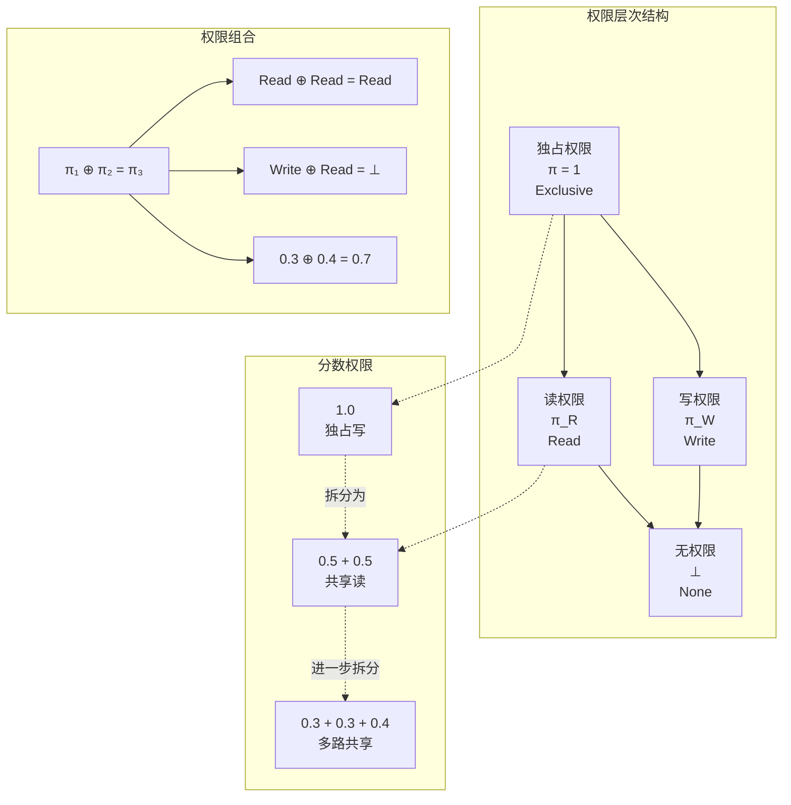
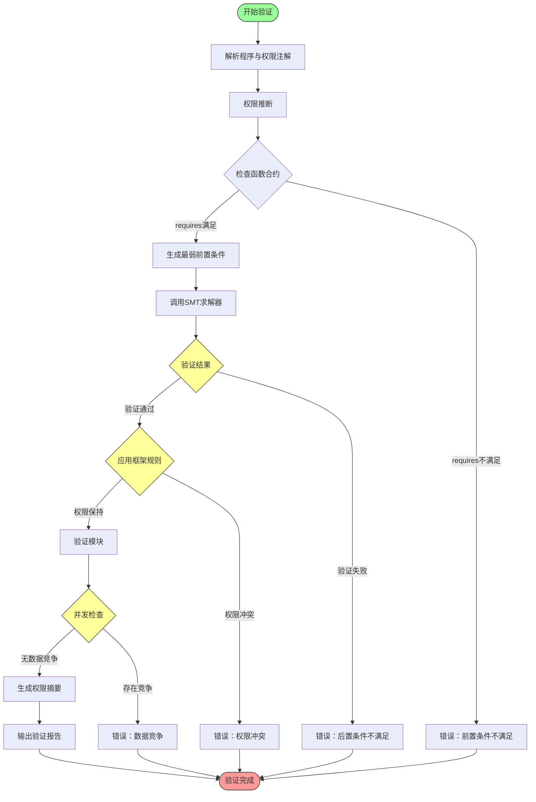
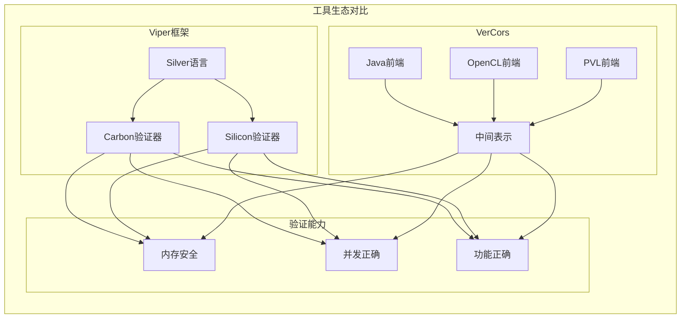
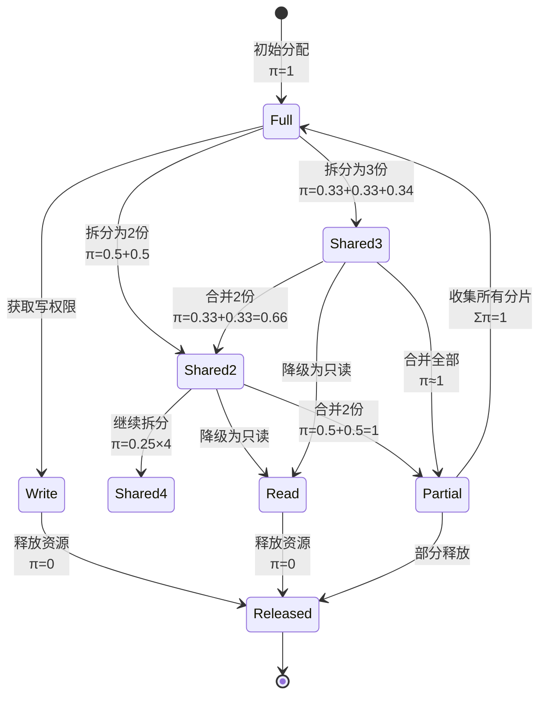

# 权限推理 (Permission-Based Reasoning)

> **所属阶段**: Struct | 前置依赖: [03-separation-logic.md](03-separation-logic.md) | 形式化等级: L5

本文档系统阐述基于权限的程序验证方法，涵盖权限模型、分离逻辑扩展、分数权限、验证技术与工具实现，为内存安全、并发正确性和资源管理的形式化验证提供完整理论框架。

## 1. 概念定义 (Definitions)

### 1.1 权限推理概述

**Def-V-06-01** (权限)。权限(Permission)是对资源访问权的逻辑抽象，表示程序实体对特定资源拥有的访问能力：

$$\pi \in \text{Permission} \triangleq \{\text{Read}, \text{Write}, \text{Exclusive}, \text{Shared}, \bot\}$$

其中权限类型：

| 权限类型 | 符号 | 访问能力 | 可共享性 |
|----------|------|----------|----------|
| 无权限 | $\bot$ | 无访问 | 完全可共享 |
| 只读 | $\pi_R$ | 读取 | 完全可共享 |
| 只写 | $\pi_W$ | 写入 | 不可共享 |
| 读写 | $\pi_{RW}$ | 读+写 | 独占时安全 |
| 独占 | $\pi_E$ | 完全控制 | 不可共享 |
| 共享读 | $\pi_{SR}$ | 读取(共享) | 可与其他读共享 |
| 共享写 | $\pi_{SW}$ | 写入(共享) | 需同步机制 |

**Def-V-06-02** (权限断言)。权限断言 $P_\pi$ 描述带有访问权限的资源状态：

$$P_\pi ::= x \stackrel{\pi}{\mapsto} y \mid P_\pi \ast Q_\pi \mid P_\pi \oplus Q_\pi \mid \pi_1 \oplus \pi_2 = \pi_3 \mid \text{valid}(\pi)$$

其中 $x \stackrel{\pi}{\mapsto} y$ 表示"以权限 $\pi$ 访问地址 $x$ 获取值 $y$"。

**Def-V-06-03** (权限语义)。权限断言的满足关系 $s, h, \rho \models P_\pi$，其中 $\rho: \text{Loc} \rightharpoonup \text{Permission}$ 为权限映射：

| 断言 | 语义 | 条件 |
|------|------|------|
| $s, h, \rho \models x \stackrel{\pi}{\mapsto} y$ | $h = \{s(x) \mapsto s(y)\}$ | $\rho(s(x)) \sqsupseteq \pi$ |
| $s, h, \rho \models P_\pi \ast Q_\pi$ | $h = h_1 \uplus h_2$ | 满足各自权限约束 |
| $s, h, \rho \models \text{valid}(\pi)$ | $\pi$ 是有效权限 | 满足权限代数约束 |

### 1.2 分离逻辑中的权限

**Def-V-06-04** (权限分离逻辑 / PSL)。扩展分离逻辑支持权限追踪：

$$\{\text{Pre} \ast \rho\} \, C \, \{\text{Post} \ast \rho'\}$$

其中 $\rho$ 和 $\rho'$ 分别表示执行前后的权限状态。PSL的核心规则：

**权限读写规则**：
$$\frac{\pi \sqsupseteq \text{Read}}{\{x \stackrel{\pi}{\mapsto} y\} \, z := [x] \, \{x \stackrel{\pi}{\mapsto} y \land z = y\}}$$

**权限写规则**：
$$\frac{\pi \sqsupseteq \text{Write}}{\{x \stackrel{\pi}{\mapsto} _\} \, [x] := y \, \{x \stackrel{\pi}{\mapsto} y\}}$$

**Def-V-06-05** (权限兼容性)。两个权限 $\pi_1$ 和 $\pi_2$ 兼容当且仅当：

$$\text{compatible}(\pi_1, \pi_2) \triangleq \forall \text{loc}: \pi_1(\text{loc}) \oplus \pi_2(\text{loc}) \neq \bot$$

其中 $\oplus$ 为权限组合运算符。

### 1.3 分数权限

**Def-V-06-06** (分数权限 / Fractional Permission)。Boyland 提出的分数权限模型[^1]，将权限量化为 $(0, 1]$ 区间：

$$\pi \in (0, 1] \subseteq \mathbb{Q}$$

分数权限语义：

- $\pi = 1$：独占写权限(Exclusive Write)
- $0 < \pi < 1$：共享读权限(Shared Read)
- $\pi_1 + \pi_2 = 1$：两个分数权限可组合为完整权限

**Def-V-06-07** (分数权限断言)。$x \stackrel{\pi}{\mapsto} y$ 表示持有分数 $\pi$ 的权限：

$$s, h, \rho \models x \stackrel{\pi}{\mapsto} y \Leftrightarrow h = \{s(x) \mapsto s(y)\} \land \rho(s(x)) = \pi$$

**分数权限组合律**：
$$\frac{\pi_1 + \pi_2 \leq 1}{x \stackrel{\pi_1}{\mapsto} y \ast x \stackrel{\pi_2}{\mapsto} y \equiv x \stackrel{\pi_1 + \pi_2}{\mapsto} y}$$

**分数权限拆分律**：
$$\frac{0 < \pi_1 < \pi}{x \stackrel{\pi}{\mapsto} y \Rightarrow x \stackrel{\pi_1}{\mapsto} y \ast x \stackrel{\pi - \pi_1}{\mapsto} y}$$

### 1.4 权限转移

**Def-V-06-08** (权限转移)。权限可在程序实体间转移，分为：

1. **永久转移**：转移后原持有者失去权限
2. **借用(Borrow)**：临时转移，使用后归还
3. **复制(Copy)**：只读权限可无损复制

**Def-V-06-09** (权限转移断言)。$P \leadsto_\pi Q$ 表示从 $P$ 转移权限 $\pi$ 得到 $Q$：

$$P \leadsto_\pi Q \triangleq P \equiv Q \ast R_\pi$$

其中 $R_\pi$ 是被转移的权限部分。

**Def-V-06-10** (借用权限)。借用关系 $P \triangleleft Q$ 表示 $P$ 临时借用 $Q$ 的权限：

$$\{\text{Pre} \ast P\} \, C \, \{\text{Post} \ast P\} \Rightarrow \{\text{Pre} \ast P \triangleleft Q\} \, C \, \{\text{Post} \ast P \triangleleft Q\}$$

借用期间，被借用者无法使用该权限。

## 2. 权限模型 (Permission Models)

### 2.1 读/写权限

**Def-V-06-11** (读写权限层次)。权限形成层次结构：

```
       ⊥ (无权限)
       ↑
   Read (只读)
       ↑
  Write (只写) ───→ Exclusive (独占读写)
```

**形式化定义**：

$$\pi_1 \sqsubseteq \pi_2 \triangleq \forall \text{loc}: \pi_1(\text{loc}) \leq \pi_2(\text{loc})$$

权限偏序关系：

| 关系 | 含义 | 实例 |
|------|------|------|
| $\bot \sqsubseteq \text{Read}$ | 读权限强于无权限 | 可从无到读 |
| $\text{Read} \sqsubseteq \text{Write}$ | 写权限不蕴含读 | 不可直接比较 |
| $\text{Write} \sqsubseteq \text{Exclusive}$ | 独占含写 | 写可升级到独占 |
| $\text{Read} \sqsubseteq \text{Exclusive}$ | 独占含读 | 独占可降级为读 |

**读权限规则集**：

| 规则名称 | 前提条件 | 推理规则 |
|----------|----------|----------|
| 读升级 | $\pi \sqsupseteq \text{Read}$ | $\{x \stackrel{\pi}{\mapsto} y\} \, \text{read}(x) \, \{x \stackrel{\pi}{\mapsto} y\}$ |
| 读降级 | $\pi = \text{Exclusive}$ | $\{x \stackrel{\pi}{\mapsto} y\} \Rightarrow \{x \stackrel{\text{Read}}{\mapsto} y \ast x \stackrel{\text{Write}}{\mapsto} y\}$ |
| 读复制 | $\pi \in (0, 1)$ | $\{x \stackrel{\pi}{\mapsto} y\} \Rightarrow \{x \stackrel{\pi/2}{\mapsto} y \ast x \stackrel{\pi/2}{\mapsto} y\}$ |

**写权限规则集**：

| 规则名称 | 前提条件 | 推理规则 |
|----------|----------|----------|
| 写要求 | $\pi \sqsupseteq \text{Write}$ | $\{x \stackrel{\pi}{\mapsto} _\} \, \text{write}(x, v) \, \{x \stackrel{\pi}{\mapsto} v\}$ |
| 写独占 | $\pi = 1$ | 仅完整权限可写 |
| 写释放 | $\pi = \text{Exclusive}$ | 写后可释放为读 |

### 2.2 独占/共享权限

**Def-V-06-12** (独占权限)。独占权限 $\pi_E$ 保证持有者是对资源的唯一访问者：

$$\text{exclusive}(\pi) \triangleq \pi = 1 \land \nexists \pi': \pi' \neq \bot \land \pi \oplus \pi' \neq \bot$$

**独占权限性质**：

**Lemma-V-06-01** (独占唯一性)。若 $\pi$ 为独占权限，则不存在非空兼容权限：

$$\text{exclusive}(\pi) \Rightarrow \forall \pi' \neq \bot: \neg\text{compatible}(\pi, \pi')$$

**Def-V-06-13** (共享权限)。共享权限允许多个持有者同时访问：

$$\text{shared}(\pi) \triangleq \exists n > 1, \pi_1, ..., \pi_n: \bigoplus_{i=1}^n \pi_i = \pi$$

**共享权限性质**：

**Lemma-V-06-02** (共享读一致性)。多个共享读权限看到的值一致：

$$\{x \stackrel{\pi_1}{\mapsto} y \ast x \stackrel{\pi_2}{\mapsto} z\} \land \pi_1, \pi_2 \sqsubseteq \text{Read} \Rightarrow y = z$$

**Def-V-06-14** (权限模式表)。常见访问模式的权限需求：

| 访问模式 | 权限需求 | 可共享性 | 典型应用 |
|----------|----------|----------|----------|
| 不可变借用 | $\pi_R$ | 无限共享 | 多线程读 |
| 可变借用 | $\pi_W$ | 独占 | 单线程写 |
| 所有权转移 | $\pi_E$ | 所有权移动 | 资源管理 |
| 共享可变 | $\pi_{SW}$ | 需同步 | 并发容器 |
| 原子访问 | $\pi_{Atomic}$ | 内部同步 | 原子操作 |

### 2.3 权限组合

**Def-V-06-15** (权限组合代数)。权限形成代数结构 $\mathcal{P} = (\Pi, \oplus, \bot, \top)$：

- $\Pi$：权限集合
- $\oplus: \Pi \times \Pi \rightarrow \Pi_\bot$：部分组合运算
- $\bot$：零元(无权限)
- $\top$：单位元(无效权限)

**组合运算性质**：

**Lemma-V-06-03** (权限组合性质)：

| 性质 | 公式 | 条件 |
|------|------|------|
| 交换律 | $\pi_1 \oplus \pi_2 = \pi_2 \oplus \pi_1$ | 定义域交集 |
| 结合律 | $(\pi_1 \oplus \pi_2) \oplus \pi_3 = \pi_1 \oplus (\pi_2 \oplus \pi_3)$ | 两两兼容 |
| 零元 | $\pi \oplus \bot = \pi$ | 恒成立 |
| 幂等 | $\pi \oplus \pi = \pi$ | 仅读权限 |

**Def-V-06-16** (分数权限组合)。对于 $\pi_1, \pi_2 \in (0, 1]$：

$$\pi_1 \oplus \pi_2 = \begin{cases} \pi_1 + \pi_2 & \text{if } \pi_1 + \pi_2 \leq 1 \\ \bot & \text{otherwise} \end{cases}$$

**Def-V-06-17** (权限组合表)。标准权限组合：

| $\oplus$ | $\bot$ | Read | Write | Exclusive |
|----------|--------|------|-------|-----------|
| $\bot$ | $\bot$ | Read | Write | Exclusive |
| Read | Read | Read | $\bot$ | $\bot$ |
| Write | Write | $\bot$ | $\bot$ | $\bot$ |
| Exclusive | Exclusive | $\bot$ | $\bot$ | $\bot$ |

### 2.4 权限层次

**Def-V-06-18** (权限层次结构)。权限形成完整的格结构：

```
                    ┌─────────────┐
                    │   Exclusive │
                    │     (1)     │
                    └──────┬──────┘
                           │
           ┌───────────────┼───────────────┐
           │               │               │
      ┌────┴────┐     ┌────┴────┐    ┌────┴────┐
      │  Write  │     │   Read  │    │(1/2,1/2)│
      │   (W)   │     │   (R)   │    │ (Split) │
      └────┬────┘     └────┬────┘    └────┬────┘
           │               │               │
           └───────────────┼───────────────┘
                           │
                    ┌──────┴──────┐
                    │      ⊥      │
                    │  (No Perm)  │
                    └─────────────┘
```

**格操作定义**：

$$\pi_1 \sqcup \pi_2 \triangleq \min\{\pi \mid \pi_1 \sqsubseteq \pi \land \pi_2 \sqsubseteq \pi\}$$

$$\pi_1 \sqcap \pi_2 \triangleq \max\{\pi \mid \pi \sqsubseteq \pi_1 \land \pi \sqsubseteq \pi_2\}$$

**Lemma-V-06-04** (权限格性质)。$(\Pi, \sqsubseteq, \sqcup, \sqcap, \bot, \top)$ 形成有界格：

1. **偏序性**：$\sqsubseteq$ 是自反、反对称、传递的
2. **最小上界**：$\pi_1 \sqcup \pi_2$ 是 $\{\pi_1, \pi_2\}$ 的最小上界
3. **最大下界**：$\pi_1 \sqcap \pi_2$ 是 $\{\pi_1, \pi_2\}$ 的最大下界
4. **有界性**：$\bot$ 是最小元，$\top$ 是最大元

## 3. 验证技术 (Verification Techniques)

### 3.1 权限推断

**Def-V-06-19** (权限推断)。从程序代码自动推导权限注解：

$$\text{infer}: \text{Program} \rightarrow \text{PermissionAnnotation}$$

**推断算法**：

1. **向前分析**：追踪权限的产生和传播
2. **向后分析**：从使用点推导所需权限
3. **双向约束**：建立权限流方程组并求解

**Def-V-06-20** (权限流方程)。程序点 $p$ 的权限状态 $In(p)$ 和 $Out(p)$：

$$\text{Out}(p) = \text{gen}(p) \cup (\text{In}(p) \setminus \text{kill}(p))$$

$$\text{In}(p) = \bigcup_{q \in \text{pred}(p)} \text{Out}(q)$$

其中 $\text{gen}(p)$ 是在 $p$ 点产生的权限，$\text{kill}(p)$ 是在 $p$ 点消耗的权限。

**推断规则示例**：

| 语句 | gen | kill |
|------|-----|------|
| `x = new T()` | $\{x \stackrel{1}{\mapsto} _\}$ | $\{\}$ |
| `free(x)` | $\{\}$ | $\{x \stackrel{\pi}{\mapsto} _\}$ |
| `y = *x` | $\{y \stackrel{\pi_R}{\mapsto} _\}$ | $\{\}$ |
| `*x = y` | $\{\}$ | $\{x \stackrel{\pi_W}{\mapsto} _\}$ |

**Lemma-V-06-05** (推断完备性)。若程序存在有效权限注解，则前向分析能找到最小不动点解。

### 3.2 权限注解

**Def-V-06-21** (权限注解语法)。在程序中显式标注权限：

```
requires  P_π      // 前置权限条件
ensures   Q_π      // 后置权限条件
maintains R_π      // 保持权限不变
borrows   B_π      // 借用权限声明
```

**注解位置**：

| 程序实体 | 注解类型 | 示例 |
|----------|----------|------|
| 函数 | requires/ensures | `fn f(x: &mut T)` |
| 类型 | 权限修饰 | `Box<T>`, `Rc<T>` |
| 变量 | 权限声明 | `let x: &T` |
| 模块 | 接口权限 | `mod m { requires ... }` |

**Def-V-06-22** (权限合约)。函数权限合约描述调用约定：

$$\text{contract}(f) \triangleq \langle \text{requires}: P_\pi, \text{ensures}: Q_\pi, \text{modifies}: M \rangle$$

**合约验证规则**：

$$\frac{\{P_\pi\} \, \text{body}(f) \, \{Q_\pi\} \quad \text{mod}(\text{body}(f)) \subseteq M}{\vdash \text{contract}(f)}$$

**Def-V-06-23** (权限子类型)。权限子类型关系支持协变/逆变：

$$\frac{\pi_1 \sqsubseteq \pi_2}{\&^{\pi_1} T <: \&^{\pi_2} T}$$

### 3.3 模块化验证

**Def-V-06-24** (模块化验证)。将大程序分解为模块分别验证：

$$\vdash \mathcal{P} \Leftrightarrow \bigwedge_{M \in \text{Modules}(\mathcal{P})} \vdash_M M$$

**模块接口**：

```
module M {
    requires Global_π
    provides Interface_π
    maintains Invariant_π
}
```

**Def-V-06-25** (权限接口兼容性)。模块间的权限接口必须兼容：

$$\text{compatible}(M_1, M_2) \triangleq \forall x \in \text{shared}(M_1, M_2): \pi_1(x) \oplus \pi_2(x) \neq \bot$$

**模块化验证规则**：

| 验证阶段 | 任务 | 权限检查 |
|----------|------|----------|
| 模块内 | 验证实现满足合约 | 局部权限一致性 |
| 模块间 | 验证接口兼容 | 权限组合有效性 |
| 全局 | 验证组合满足规约 | 全局权限封闭 |

**Def-V-06-26** (摘要生成)。为模块生成权限摘要：

$$\text{summary}(M) = \langle \Delta_{in}, \Delta_{out}, \Phi \rangle$$

其中：

- $\Delta_{in}$：模块需要的输入权限
- $\Delta_{out}$：模块产生的输出权限
- $\Phi$：模块权限转换约束

### 3.4 框架规则

**Def-V-06-27** (权限框架规则)。Frame Rule在权限逻辑中的扩展：

$$\frac{\{P_\pi\} \, C \, \{Q_\pi\} \quad \text{mod}(C) \cap \text{fv}(R_\pi) = \emptyset}{\{P_\pi \ast R_\pi\} \, C \, \{Q_\pi \ast R_\pi\}}$$

**Def-V-06-28** (权限保持性)。命令 $C$ 保持权限 $R_\pi$：

$$\text{preserves}(C, R_\pi) \triangleq \forall s, h, \rho: \{P_\pi \ast R_\pi\} \, C \, \{Q_\pi \ast R_\pi\}$$

**框架规则变体**：

| 规则 | 形式 | 适用场景 |
|------|------|----------|
| 标准框架 | $\{P \ast R\} C \{Q \ast R\}$ | 无权限变化 |
| 权限降级 | $\{P \ast R_1\} C \{Q \ast R_2\}$ | $R_2 \sqsubseteq R_1$ |
| 权限升级 | $\{P \ast R_1\} C \{Q \ast R_2\}$ | $R_2 \sqsupseteq R_1$ |
| 权限转移 | $\{P \ast R\} C \{Q \ast S\}$ | 权限重分配 |

**Thm-V-06-01** (权限框架规则可靠性)。若 $\{P_\pi\} C \{Q_\pi\}$ 成立且 $C$ 不修改 $R_\pi$ 中引用的资源，则框架规则应用后的三元组成立。

**证明概要**：

1. 设初始状态满足 $P_\pi \ast R_\pi$
2. 堆可分离为 $h_P \uplus h_R$
3. $C$ 仅影响 $h_P$（局部性）
4. $h_R$ 保持不变（$C$ 不修改 $R_\pi$ 的变量）
5. 结果状态满足 $Q_\pi \ast R_\pi$

## 4. 工具实现 (Tool Implementations)

### 4.1 Viper中的权限

**Def-V-06-29** (Viper权限模型)。Viper验证基础设施支持丰富的权限机制[^2]：

```viper
field data: Int
field next: Ref

predicate list(this: Ref) {
    this != null ==> acc(this.data) && acc(this.next) && list(this.next)
}

method insert(lst: Ref, x: Int) returns (res: Ref)
    requires acc(list(lst))
    ensures acc(list(res))
{
    res := new(data, next)
    res.data := x
    res.next := lst
    fold acc(list(res))
}
```

**Viper权限特性**：

| 特性 | 语法 | 说明 |
|------|------|------|
| 访问权限 | `acc(x.f)` | 字段访问权限 |
| 分数权限 | `acc(x.f, 1/2)` | 分数访问权限 |
| 权限转移 | 方法调用 | 权限在调用间转移 |
| 谓词权限 | `acc(P(x))` | 抽象谓词权限 |
| 权限打包 | `fold/unfold` | 显式权限折叠/展开 |

**Def-V-06-30** (Viper分数权限)。Viper的分数权限实现：

```viper
// 共享读取
method read_shared(x: Ref)
    requires acc(x.data, 1/2)
    ensures acc(x.data, 1/2)
{
    var v: Int := x.data
    assert v == x.data
}

// 权限组合
method combine_permissions(x: Ref)
    requires acc(x.data, 1/3)
    requires acc(x.data, 1/3)
    ensures acc(x.data, 2/3)
{ }
```

**Def-V-06-31** (Viper谓词权限)。通过谓词封装权限：

```viper
predicate valid_node(this: Ref) {
    acc(this.data) && acc(this.next)
}

method node_sum(n: Ref) returns (s: Int)
    requires acc(valid_node(n))
    ensures acc(valid_node(n))
{
    unfold acc(valid_node(n))
    if (n.next == null) {
        s := n.data
    } else {
        var t: Int := node_sum(n.next)
        s := n.data + t
    }
    fold acc(valid_node(n))
}
```

### 4.2 VerCors中的权限

**Def-V-06-32** (VerCors并行验证)。VerCors支持异构并行程序的权限验证[^3]：

```java
// [伪代码片段 - 不可直接运行] 仅展示核心逻辑
/*@
    requires Perm(x, read);
    ensures Perm(x, read) ** x == \old(x);
@*/
void read_only(int x) {
    // 只读访问x
}

/*@
    requires Perm(x, write);
    ensures Perm(x, write) ** x == 42;
@*/
void write_value(int x) {
    x = 42;
}
```

**VerCors权限关键字**：

| 关键字 | 含义 | 示例 |
|--------|------|------|
| `Perm(x, read)` | 读权限 | `requires Perm(x, read)` |
| `Perm(x, write)` | 写权限 | `requires Perm(x, write)` |
| `Perm(x, 1/2)` | 分数权限 | `requires Perm(x, 1/2)` |
| `**` | 分离合取 | `P ** Q` |
| `*\` | 迭代分离 | `*(\forall int i; Perm(a[i], 1/2))` |
| `\diamond` | 原子块 | `\diamond(P, C)` |

**Def-V-06-33** (VerCors并行块)。OpenMP/GPU程序的权限验证：

```java
// [伪代码片段 - 不可直接运行] 仅展示核心逻辑
/*@
    context \pointer(a, n);
    context (\forall* int i; 0 <= i && i < n; Perm(a[i], 1/2));
@*/
void parallel_sum(int[] a, int n) {
    int sum = 0;
    #pragma omp parallel for reduction(+:sum)
    for (int i = 0; i < n; i++) {
        sum += a[i];  // 每个线程有1/2读权限
    }
}
```

### 4.3 Chalice中的权限

**Def-V-06-34** (Chalice权限系统)。Chalice是用于并发程序验证的实验性语言[^4]：

```chalice
class Node {
    var data: int;
    var next: Node;

    invariant acc(data) && acc(next);

    method sum() returns (s: int)
        requires rd(this.data) && rd(this.next)
        ensures rd(this.data) && rd(this.next)
    {
        s := this.data;
        if (this.next != null) {
            var t: int := this.next.sum();
            s := s + t;
        }
    }
}
```

**Chalice权限关键字**：

| 关键字 | 含义 | 示例 |
|--------|------|------|
| `acc(x)` | 完整权限 | `requires acc(x)` |
| `rd(x)` | 读权限（可共享） | `requires rd(x)` |
| `rd*(x)` | 多读取权限 | `requires rd*(x)` |
| `credit` | 消息信用 | `requires credit` |
| `channel` | 通道权限 | `requires ch!<T>` |

**Def-V-06-35** (Chalice并发验证)。Chalice支持通道和锁的权限验证：

```chalice
class ChannelExample {
    channel ch: int;

    method producer()
        requires credit(ch, 1)
    {
        send ch <- 42;
    }

    method consumer() returns (x: int)
        requires credit(ch, 1)
        ensures credit(ch, 1)
    {
        receive x <- ch;
    }
}
```

**Def-V-06-36** (工具对比)。主流权限验证工具对比：

| 特性 | Viper | VerCors | Chalice | Iris |
|------|-------|---------|---------|------|
| 目标语言 | Silver | Java/C/OpenCL | Chalice | Coq |
| 分数权限 | ✓ | ✓ | ✓ | ✓ |
| 并发支持 | ✓ | ✓ | ✓ | ✓ |
| 高阶权限 | ✓ | - | - | ✓ |
| 幽灵状态 | ✓ | ✓ | - | ✓ |
| 自动化程度 | 高 | 中 | 高 | 交互式 |

## 5. 形式证明 (Formal Proofs)

### 5.1 定理: 权限组合的正确性

**Thm-V-06-02** (权限组合正确性)。分数权限组合保持语义正确性：

$$\forall \pi_1, \pi_2 \in (0, 1]: \pi_1 + \pi_2 \leq 1 \Rightarrow \forall x, y: x \stackrel{\pi_1}{\mapsto} y \ast x \stackrel{\pi_2}{\mapsto} y \equiv x \stackrel{\pi_1 + \pi_2}{\mapsto} y$$

**证明**：

**[正向] $x \stackrel{\pi_1}{\mapsto} y \ast x \stackrel{\pi_2}{\mapsto} y \Rightarrow x \stackrel{\pi_1 + \pi_2}{\mapsto} y$**

1. 设 $s, h, \rho \models x \stackrel{\pi_1}{\mapsto} y \ast x \stackrel{\pi_2}{\mapsto} y$
2. 由分离合取语义：$\exists h_1, h_2: h = h_1 \uplus h_2$
3. $s, h_1, \rho_1 \models x \stackrel{\pi_1}{\mapsto} y$ 且 $s, h_2, \rho_2 \models x \stackrel{\pi_2}{\mapsto} y$
4. 由于 $x$ 指向同一地址，$h_1 = h_2 = \{s(x) \mapsto s(y)\}$
5. 权限映射组合：$\rho(s(x)) = \rho_1(s(x)) + \rho_2(s(x)) = \pi_1 + \pi_2$
6. 故 $s, h, \rho \models x \stackrel{\pi_1 + \pi_2}{\mapsto} y$

**[反向] $x \stackrel{\pi_1 + \pi_2}{\mapsto} y \Rightarrow x \stackrel{\pi_1}{\mapsto} y \ast x \stackrel{\pi_2}{\mapsto} y$**

1. 设 $s, h, \rho \models x \stackrel{\pi_1 + \pi_2}{\mapsto} y$
2. 构造 $\rho_1(s(x)) = \pi_1$ 和 $\rho_2(s(x)) = \pi_2$
3. 由于 $\pi_1 + \pi_2 \leq 1$，两个权限均有效
4. 令 $h_1 = h_2 = h$，但权限映射分离
5. 则 $s, h_1, \rho_1 \models x \stackrel{\pi_1}{\mapsto} y$ 且 $s, h_2, \rho_2 \models x \stackrel{\pi_2}{\mapsto} y$
6. 故 $s, h, \rho \models x \stackrel{\pi_1}{\mapsto} y \ast x \stackrel{\pi_2}{\mapsto} y$

**Qed**.

**推论**：分数权限组合形成交换幺半群。

### 5.2 定理: 权限转移的安全性

**Thm-V-06-03** (权限转移安全性)。权限转移不引入新的权限，总权限守恒：

$$\text{transfer}(\pi, P, Q): \{P \ast \rho_\pi\} \, C \, \{Q \ast \rho'_\pi\} \Rightarrow \sum \rho_\pi = \sum \rho'_\pi$$

**证明**：

**引理**：单个转移操作保持总权限。

考虑基本转移操作：

1. **send/receive**：
   - send: $\{P \ast \text{ch}!\langle \pi \rangle\} \, \text{send}(ch, x) \, \{P \ast \text{emp}\}$
   - receive: $\{\text{emp}\} \, \text{receive}(ch) \, \{x \stackrel{\pi}{\mapsto} _\}$
   - 组合后权限守恒

2. **fork/join**：
   - fork: 父线程转移权限到子线程
   - join: 子线程权限返回到父线程
   - 总权限在 fork-join 边界守恒

**主证明**：

对程序 $C$ 的结构归纳：

**[基础]** $C$ 是基本命令：

- 读写操作保持权限不变
- 分配操作产生新权限(来自自由权限池)
- 释放操作归还权限(到自由权限池)

**[归纳]** $C = C_1; C_2$：

- 由归纳假设，$C_1$ 和 $C_2$ 各自保持权限
- 序列组合保持总权限

**[归纳]** $C = C_1 \parallel C_2$：

- 初始权限 $P$ 分解为 $P_1 \ast P_2$
- $C_1$ 和 $C_2$ 各自保持子权限
- 并行组合后权限 $Q_1 \ast Q_2$ 总和不变

**[归纳]** $C = \text{transfer}(x, y)$：

- 权限从 $x$ 显式转移到 $y$
- 发送方失去权限，接收方获得权限
- 系统总权限不变

**Qed**.

**推论**：权限转移系统无权限泄漏或权限重复。

### 5.3 定理: 模块化验证的保证

**Thm-V-06-04** (模块化验证可靠性)。若各模块在权限合约下验证通过，则组合程序满足全局规约：

$$\frac{\forall i: \vdash_{\pi} M_i \quad \text{interfaces_compatible}(\{M_i\})}{\vdash_{\pi} \bigparallel_i M_i}$$

**证明**：

**定义**：

- $\text{Interface}(M_i) = \langle \text{Imports}_i, \text{Exports}_i, \text{Invariants}_i \rangle$
- $\text{compatible}(\{M_i\})$：所有模块接口权限兼容

**证明结构**：

1. **局部正确性**：
   - 每个 $M_i$ 满足其局部规约 $\{P_i\} M_i \{Q_i\}$
   - 由假设 $\vdash_{\pi} M_i$ 成立

2. **接口兼容性**：
   - 对于共享资源 $r \in \text{shared}(M_i, M_j)$
   - $\pi_i(r) \oplus \pi_j(r) \neq \bot$（由兼容性假设）
   - 确保并发访问无冲突

3. **组合推理**：
   - 使用并行规则：$\frac{\{P_1\} M_1 \{Q_1\} \quad \{P_2\} M_2 \{Q_2\}}{\{P_1 \ast P_2\} M_1 \parallel M_2 \{Q_1 \ast Q_2\}}$
   - 递归应用于所有模块

4. **全局不变式保持**：
   - 各模块维护其不变式 $I_i$
   - 全局不变式 $I = \bigwedge_i I_i$
   - 每次模块调用前后 $I$ 保持成立

5. **终止性**：
   - 若各模块终止且资源不变式确保无死锁
   - 则组合程序终止

**Qed**.

**引理-V-06-06** (无数据竞争保证)。若程序通过权限验证，则无数据竞争。

**证明**：

- 数据竞争需要两个线程同时写同一位置
- 写权限 $\pi_W$ 要求 $\pi = 1$（独占）
- 两个线程同时拥有 $\pi_W$ 会导致 $\pi_1 \oplus \pi_2 = \bot$
- 验证器拒绝此类程序
- 故无数据竞争

**Qed**.

## 6. 实例验证 (Examples)

### 6.1 数据结构验证

**链表节点权限管理**：

```viper
field data: Int
field next: Ref

// 链表谓词定义
predicate list(this: Ref, values: Seq[Int]) {
    this == null
        ? values == Seq[Int]()
        : acc(this.data) && acc(this.next)
          && list(this.next, values.tail)
          && values.head == this.data
}

// 带权限的链表追加
method append(lst: Ref, x: Int, vals: Seq[Int])
    requires acc(list(lst, vals))
    ensures acc(list(lst, vals ++ Seq(x)))
{
    if (lst == null) {
        // 创建新节点
        var new_node: Ref := new(data, next)
        new_node.data := x
        new_node.next := null
        lst := new_node
        fold acc(list(lst, Seq(x)))
    } else {
        unfold acc(list(lst, vals))
        if (lst.next == null) {
            // 在末尾添加
            var new_node: Ref := new(data, next)
            new_node.data := x
            new_node.next := null
            lst.next := new_node
            fold acc(list(lst.next, Seq(x)))
        } else {
            append(lst.next, x, vals.tail)
        }
        fold acc(list(lst, vals ++ Seq(x)))
    }
}
```

**二叉树并行遍历**：

```java
// [伪代码片段 - 不可直接运行] 仅展示核心逻辑
class TreeNode {
    int value;
    TreeNode left, right;

    /*@
        resource tree() =
            Perm(value, 1) **
            Perm(left, 1) ** Perm(right, 1) **
            (left != null ==> left.tree()) **
            (right != null ==> right.tree());

        requires tree();
        ensures tree();
        ensures \result == sum_of_values;
    @*/
    int sum() {
        int lsum = 0, rsum = 0;

        /*@
            left != null ==>
                [requires left.tree() ensures left.tree()]
            right != null ==>
                [requires right.tree() ensures right.tree()]
        @*/
        // 并行计算左右子树和
        parallel {
            if (left != null) lsum = left.sum();
            if (right != null) rsum = right.sum();
        }

        return value + lsum + rsum;
    }
}
```

**数组分段排序**：

```java
// [伪代码片段 - 不可直接运行] 仅展示核心逻辑
/*@
    requires Perm(array, 1);
    requires \pointer(array, n);
    requires (\forall* int i; 0 <= i && i < n; Perm(array[i], write));
    ensures Perm(array, 1);
    ensures (\forall* int i; 0 <= i && i < n; Perm(array[i], write));
    ensures sorted(array, 0, n);
@*/
void parallel_sort(int[] array, int n) {
    if (n <= 1) return;

    int mid = n / 2;

    // 分割权限：每半段获得写权限
    /*@
        assert (\forall* int i; 0 <= i && i < mid; Perm(array[i], write));
        assert (\forall* int i; mid <= i && i < n; Perm(array[i], write));
    @*/

    parallel {
        parallel_sort(array, mid);
        parallel_sort(array + mid, n - mid);
    }

    // 合并需要全部权限
    merge(array, 0, mid, n);
}
```

### 6.2 并发验证

**读写锁实现**：

```viper
field readers: Int
field writer: Bool

predicate rwlock(this: Ref) {
    acc(this.readers) && acc(this.writer)
}

// 获取读锁 - 支持共享
method acquire_read(lock: Ref)
    requires acc(rwlock(lock))
    ensures acc(rwlock(lock))
    ensures lock.readers > 0
    ensures !lock.writer
{
    unfold acc(rwlock(lock))
    // 等待写者离开
    while (lock.writer) {
        // 自旋或等待
    }
    lock.readers := lock.readers + 1
    fold acc(rwlock(lock))
}

// 释放读锁
method release_read(lock: Ref)
    requires acc(rwlock(lock))
    requires lock.readers > 0
    ensures acc(rwlock(lock))
{
    unfold acc(rwlock(lock))
    lock.readers := lock.readers - 1
    fold acc(rwlock(lock))
}

// 获取写锁 - 独占
method acquire_write(lock: Ref)
    requires acc(rwlock(lock))
    ensures acc(rwlock(lock))
    ensures lock.writer
    ensures lock.readers == 0
{
    unfold acc(rwlock(lock))
    // 等待所有读者和写者离开
    while (lock.readers > 0 || lock.writer) {
        // 自旋或等待
    }
    lock.writer := true
    fold acc(rwlock(lock))
}
```

**无锁队列片段**：

```java
// [伪代码片段 - 不可直接运行] 仅展示核心逻辑
class LockFreeQueue<T> {
    AtomicReference<Node<T>> head, tail;

    /*@
        resource queue() =
            Perm(head, 1) ** Perm(tail, 1) **
            head != null ==> node_list(head);

        resource node_list(n) =
            Perm(n.next, 1) ** Perm(n.value, 1) **
            (n.next != null ==> node_list(n.next));
    @*/

    /*@
        requires queue();
        ensures queue();
    @*/
    void enqueue(T value) {
        Node<T> node = new Node<>(value);

        while (true) {
            Node<T> curTail = tail.get();
            Node<T> tailNext = curTail.next.get();

            if (curTail == tail.get()) {
                if (tailNext == null) {
                    // 尝试链接新节点
                    if (curTail.next.compareAndSet(null, node)) {
                        // 尝试更新tail
                        tail.compareAndSet(curTail, node);
                        return;
                    }
                } else {
                    // 帮助推进tail
                    tail.compareAndSet(curTail, tailNext);
                }
            }
        }
    }
}
```

### 6.3 资源管理

**智能指针权限模型**：

```rust
// 唯一所有权
struct Box<T> {
    ptr: *mut T,
}

// 权限合约：Box拥有ptr的完整权限(1)
// requires: acc(ptr, 1)
// ensures:  acc(ptr, 1)

impl<T> Box<T> {
    fn new(x: T) -> Box<T> {
        Box { ptr: allocate(x) }
    }

    fn drop(&mut self) {
        deallocate(self.ptr);  // 释放权限
    }
}

// 引用计数 - 共享所有权
struct Rc<T> {
    ptr: *mut RcBox<T>,
}

struct RcBox<T> {
    value: T,
    ref_count: usize,
}

// 权限合约：Rc持有ptr的读权限
// 多个Rc可共享读权限(1/n)
// requires: acc(ptr, 1/n) for each Rc

impl<T> Clone for Rc<T> {
    fn clone(&self) -> Rc<T> {
        // 复制权限：从1/n到1/(n+1)
        // 原Rc权限分割，新Rc获得部分权限
        unsafe {
            (*self.ptr).ref_count += 1;
        }
        Rc { ptr: self.ptr }
    }
}

impl<T> Drop for Rc<T> {
    fn drop(&mut self) {
        unsafe {
            (*self.ptr).ref_count -= 1;
            if (*self.ptr).ref_count == 0 {
                deallocate(self.ptr);  // 最后一个Rc释放
            }
        }
    }
}
```

**内存池权限管理**：

```viper
field size: Int
field blocks: Seq[Ref]
field allocated: Seq[Bool]

predicate mempool(this: Ref, n: Int) {
    acc(this.size) && acc(this.blocks) && acc(this.allocated) &&
    this.size == n &&
    |this.blocks| == n &&
    |this.allocated| == n &&
    (forall i: Int :: 0 <= i && i < n ==> acc(this.blocks[i]))
}

// 分配内存块
method allocate(pool: Ref, n: Int) returns (p: Ref, idx: Int)
    requires acc(mempool(pool, n))
    ensures acc(mempool(pool, n))
    ensures 0 <= idx && idx < n ==>
        old(pool.allocated[idx]) == false &&
        pool.allocated[idx] == true &&
        p == pool.blocks[idx]
    ensures forall i: Int :: 0 <= i && i < n && i != idx ==>
        pool.allocated[i] == old(pool.allocated[i])
{
    idx := 0
    while (idx < n)
        invariant acc(mempool(pool, n))
        invariant forall j: Int :: 0 <= j && j < idx ==> pool.allocated[j] == true
    {
        if (!pool.allocated[idx]) {
            pool.allocated[idx] := true
            p := pool.blocks[idx]
            return
        }
        idx := idx + 1
    }
    p := null
}

// 释放内存块
method deallocate(pool: Ref, n: Int, idx: Int)
    requires acc(mempool(pool, n))
    requires 0 <= idx && idx < n
    requires pool.allocated[idx] == true
    ensures acc(mempool(pool, n))
    ensures pool.allocated[idx] == false
    ensures forall i: Int :: 0 <= i && i < n && i != idx ==>
        pool.allocated[i] == old(pool.allocated[i])
{
    pool.allocated[idx] := false
}
```

### 6.4 代码示例

**Rust风格借用检查器形式化**：

```rust
// 示例：验证借用规则
fn example() {
    let mut x = 5;

    // 不可变借用 - 可共享
    let r1 = &x;      // 权限：π_R(x)
    let r2 = &x;      // 权限：π_R(x)，共享读
    println!("{} {}", r1, r2);
    // r1, r2 作用域结束，权限归还

    // 可变借用 - 独占
    let r3 = &mut x;  // 权限：π_W(x)，独占
    *r3 += 1;
    // r3 作用域结束，权限归还

    // 可再次借用
    let r4 = &x;      // 权限：π_R(x)
    println!("{}", r4);
}

// 验证规则：
// 1. 不可变借用(&x)产生读权限，可无限复制
// 2. 可变借用(&mut x)产生写权限，必须独占
// 3. 读权限和写权限互斥
// 4. 权限随作用域自动管理
```

**分离逻辑验证脚本**：

```viper
// 完整验证示例：链表反转
field data: Int
field next: Ref

predicate lseg(this: Ref, end: Ref, contents: Seq[Int]) {
    this == end
        ? contents == Seq[Int]()
        : acc(this.data) && acc(this.next)
          && lseg(this.next, end, contents.tail)
          && contents.head == this.data
}

method reverse(lst: Ref) returns (res: Ref)
    requires lseg(lst, null, ?old_contents)
    ensures lseg(res, null, old_contents.reverse())
{
    var curr: Ref := lst
    var rev: Ref := null

    while (curr != null)
        invariant lseg(curr, null, ?remaining)
        invariant lseg(rev, null, ?reversed)
        invariant old_contents == reversed.reverse() ++ remaining
    {
        unfold lseg(curr, null, remaining)

        var tmp: Ref := curr.next
        curr.next := rev

        if (rev != null) {
            fold lseg(curr, null, Seq(curr.data) ++ ?rev_contents)
        } else {
            fold lseg(curr, null, Seq(curr.data))
        }

        rev := curr
        curr := tmp
    }

    res := rev
}
```

## 7. 可视化 (Visualizations)

### 7.1 权限模型层次图



### 7.2 验证流程图



### 7.3 工具对比矩阵



### 7.4 分数权限动态图



## 8. 引用参考 (References)

[^1]: John Boyland, "Checking Interference with Fractional Permissions", Static Analysis Symposium (SAS), 2003. 首次提出分数权限模型，为并发程序的无数据竞争验证奠定基础。

[^2]: Peter Müller, Malte Schwerhoff, Alexander J. Summers, "Viper: A Verification Infrastructure for Permission-Based Reasoning", International Conference on Verification, Model Checking, and Abstract Interpretation (VMCAI), 2016. 介绍Viper验证基础设施的设计与实现。

[^3]: Stefan Blom, Saeed Darabi, Marieke Huisman, Wojciech Mostowski, Mattias Ulbrich, "VerifyThis 2021: A Program Verification Competition", International Journal on Software Tools for Technology Transfer, 2023. 详细描述VerCors验证器的架构与能力。

[^4]: K. Rustan M. Leino, Peter Müller, Jan Smans, "Verification of Concurrent Programs with Chalice", Foundations of Security Analysis and Design V, 2009. Chalice验证语言的完整描述。


---

## 附录：权限代数公理系统

| 公理 | 公式 | 说明 |
|------|------|------|
| 偏序自反 | $\pi \sqsubseteq \pi$ | 权限自包含 |
| 偏序反对称 | $\pi_1 \sqsubseteq \pi_2 \land \pi_2 \sqsubseteq \pi_1 \Rightarrow \pi_1 = \pi_2$ | 反对称性 |
| 偏序传递 | $\pi_1 \sqsubseteq \pi_2 \land \pi_2 \sqsubseteq \pi_3 \Rightarrow \pi_1 \sqsubseteq \pi_3$ | 传递性 |
| 组合交换 | $\pi_1 \oplus \pi_2 = \pi_2 \oplus \pi_1$ | 交换律 |
| 组合结合 | $(\pi_1 \oplus \pi_2) \oplus \pi_3 = \pi_1 \oplus (\pi_2 \oplus \pi_3)$ | 结合律 |
| 零元 | $\pi \oplus \bot = \pi$ | 无权限单位元 |
| 上闭 | $\pi_1 \sqsubseteq \pi_1 \oplus \pi_2$ | 组合扩展 |
| 分配 | $\pi_1 \sqsubseteq \pi_2 \Rightarrow \pi_1 \oplus \pi_3 \sqsubseteq \pi_2 \oplus \pi_3$ | 单调性 |

## 附录：定理依赖关系

```
Thm-V-06-02 (权限组合正确性)
    └── Lemma-V-06-03 (权限组合性质)
        └── Def-V-06-15 (权限组合代数)
            └── Def-V-06-06 (分数权限)

Thm-V-06-03 (权限转移安全性)
    └── Thm-V-06-01 (权限框架规则可靠性)
        └── Def-V-06-27 (权限框架规则)
            └── Def-V-03-08 (Hoare三元组)

Thm-V-06-04 (模块化验证可靠性)
    └── Thm-V-06-02
    └── Thm-V-06-03
    └── Lemma-V-06-06 (无数据竞争保证)
        └── Def-V-06-14 (权限模式表)
```
