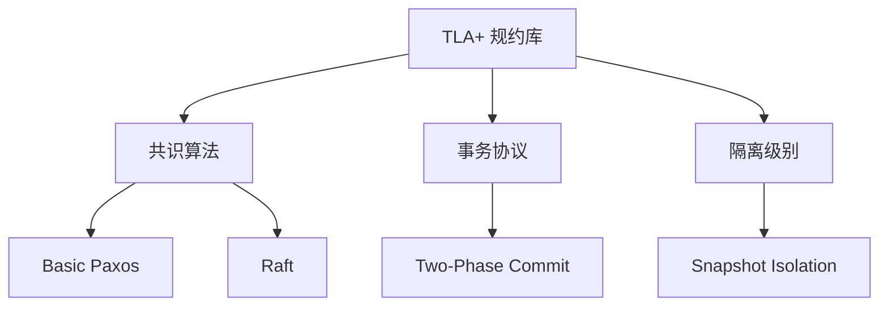
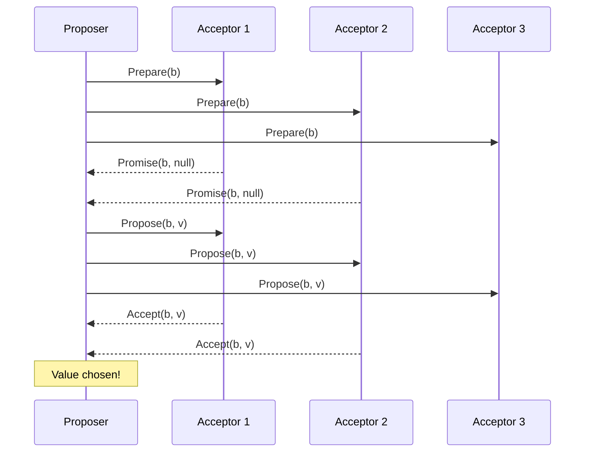
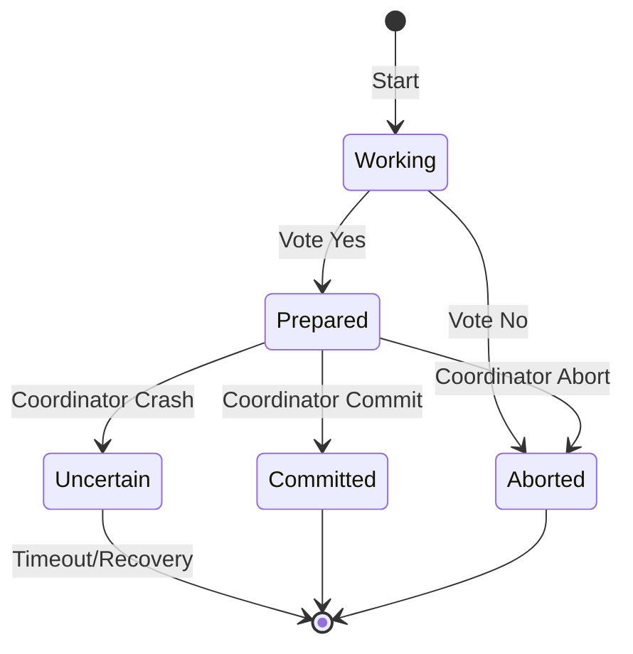

# TLA+ 规约库

> 所属阶段: Struct | 前置依赖: [01-tla-plus.md](../01-tla-plus.md) | 形式化等级: L5

本目录包含分布式系统和并发算法的关键 TLA+ 形式化规约，用于验证安全性和活性属性。

## 1. 概念定义 (Definitions)

### 1.1 TLA+ 规约结构

每个规约包含以下组件：

| 组件 | 说明 | 示例文件 |
|------|------|----------|
| `MODULE` | 模块声明 | `paxos.tla` |
| `CONSTANTS` | 可配置参数 | `Value`, `Acceptor`, `Quorum` |
| `VARIABLES` | 状态变量 | `msgs`, `maxBal`, `chosen` |
| `Init` | 初始状态谓词 | 所有变量初始值 |
| `Next` | 下一步关系 | 所有可能的状态转移 |
| `Spec` | 完整规约 | `Init /\ [][Next]_vars` |
| `Invariant` | 不变式 | 安全性属性 |
| `Property` | 活性 | `<>(chosen # {})` |

### 1.2 规约分类



## 2. 属性推导 (Properties)

### 2.1 共识算法属性

**Thm-Consensus-01: Agreement (一致性)**

```tla
Agreement ==
    \A v1, v2 \in chosen : v1 = v2
```

**Thm-Consensus-02: Validity (有效性)**

```tla
Validity ==
    \A v \in chosen : \E p \in Proposer : proposed[p] = v
```

**Thm-Consensus-03: Termination (终止性)**

```tla
Termination ==
    <>(chosen # {})
```

### 2.2 事务协议属性

**Thm-Transaction-01: Atomicity (原子性)**

```tla
Atomicity ==
    ~\E p1, p2 \in Participant :
        p_state[p1] = "committed" /\ p_state[p2] = "aborted"
```

**Thm-Transaction-02: Consistency (一致性)**

```tla
Consistency ==
    \A p \in Participant :
        p_decision[p] # "none"
        => \A p2 \in Participant : p_decision[p] = p_decision[p2]
```

## 3. 关系建立 (Relations)

### 3.1 共识算法等价性

| 特性 | Paxos | Raft | 等价性 |
|------|-------|------|--------|
| 领导者 | 临时 Proposer | 稳定 Leader | 功能等价 |
| 日志 | 多 Instance | 连续 Log | Raft 更易实现 |
| 选举 | 隐式 | 显式心跳 | Raft 更清晰 |
| 复制 | Phase 2 | AppendEntries | 语义相同 |

### 3.2 与形式理论的映射

```
TLA+ 规约
    ↓ 精化 (Refinement)
行为语义 (Action Semantics)
    ↓ 编码
迁移系统 (Transition System)
    ↓ 模型检查
状态空间遍历
```

## 4. 论证过程 (Argumentation)

### 4.1 Paxos 安全性证明概要

**引理 1**: 如果 Acceptor 接受了 ballot b 的值 v，则任何更大 ballot 的提议必须提议相同的值 v。

证明：

1. Acceptor 接受 ballot b 前，必须先承诺不再接受更小的 ballot
2. 新 Proposer 要获得多数派 Promise，必须与至少一个接受 v 的 Acceptor 通信
3. 根据 Promise 的 maxVBal/maxVal，新 Proposer 必须使用已接受的值

**引理 2**: 不可能有两个不同的值被选定。

证明：

1. 假设 v1 和 v2 都被选定，分别对应 ballot b1 和 b2
2. 设 b1 < b2，则 v2 的提议者必须知道 v1 已被接受
3. 根据引理 1，v2 必须等于 v1，矛盾

### 4.2 Raft 与 Paxos 的等价性

```tla
(* Raft Term 对应 Paxos Ballot *)\nBallotEquivalence ==
    \A s \in Server, b \in Ballot :
        currentTerm[s] = b <=> maxBallot = b

(* Raft Leader 对应 Paxos Proposer *)\nLeaderEquivalence ==
    state[s] = "Leader" <=> activeProposer = s
```

## 5. 形式证明 / 工程论证

### 5.1 TLC 模型检查配置

**Paxos 配置**:

```tla
CONSTANTS
    Value = {v1, v2}
    Acceptor = {a1, a2, a3}
    Quorum = {{a1, a2}, {a1, a3}, {a2, a3}}
    Proposer = {p1, p2}
    Ballot = 0..2

INVARIANTS
    TypeOK
    Safety
    Validity
    ProposalUniqueness

PROPERTIES
    Liveness
```

### 5.2 模型检查复杂度

| 规约 | 状态数 | 检查时间 | 内存 |
|------|--------|----------|------|
| Paxos (3 acceptors) | ~10^4 | < 1 min | < 1 GB |
| Raft (3 servers) | ~10^5 | ~5 min | ~2 GB |
| 2PC (3 participants) | ~10^3 | < 1 min | < 1 GB |
| SI (2 keys, 2 txns) | ~10^4 | ~2 min | ~1 GB |

## 6. 实例验证 (Examples)

### 6.1 运行 TLC 模型检查器

```bash
# 安装 TLA+ Toolbox 或命令行工具
cd formal-methods/05-verification/01-logic/tla-specs

# 使用 TLC 检查 Paxos
tlc paxos.tla -config paxos.cfg

# 生成状态空间图
tlc paxos.tla -dump dot,actionlabels paxos.dot
```

### 6.2 死锁检测示例

```tla
(* 2PC 中的阻塞场景 *)\nBlockingScenario ==
    \E p \in Participant :
        <>[](p_state[p] = "prepared" /\ ~c_alive)
```

## 7. 可视化 (Visualizations)

### 7.1 Paxos 消息流程图



### 7.2 2PC 状态转换图



## 8. 引用参考 (References)


---

## 附录：文件清单

| 文件 | 描述 | 验证属性 |
|------|------|----------|
| `paxos.tla` | Basic Paxos 协议 | Safety, Liveness |
| `raft.tla` | Raft 共识算法 | Election Safety, Log Matching |
| `two-phase-commit.tla` | 2PC 事务协议 | Atomicity, Blocking Analysis |
| `snapshot-isolation.tla` | 快照隔离级别 | SI Properties, Write Skew |
