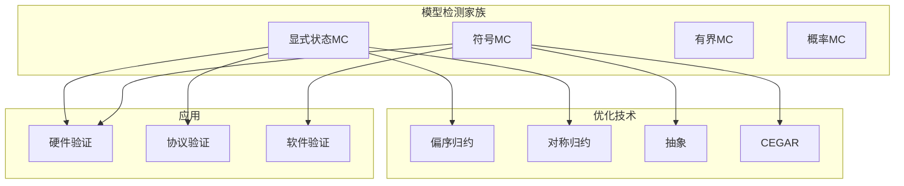
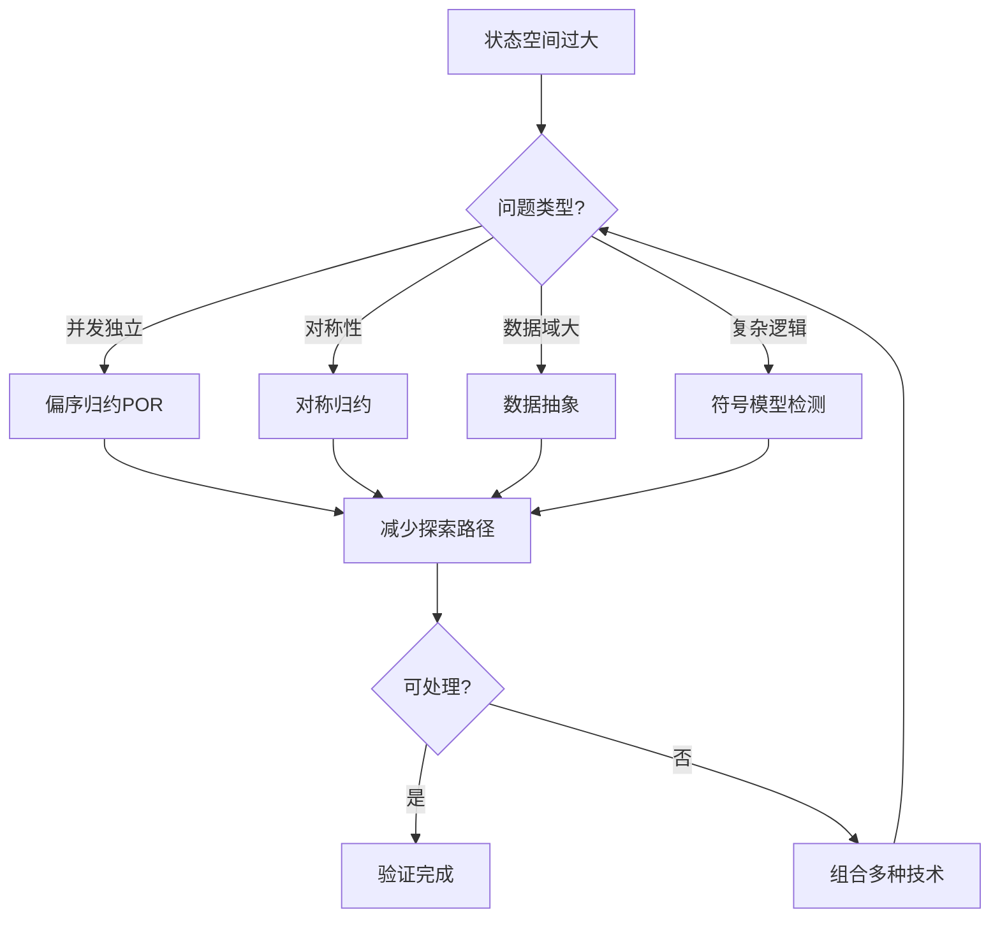
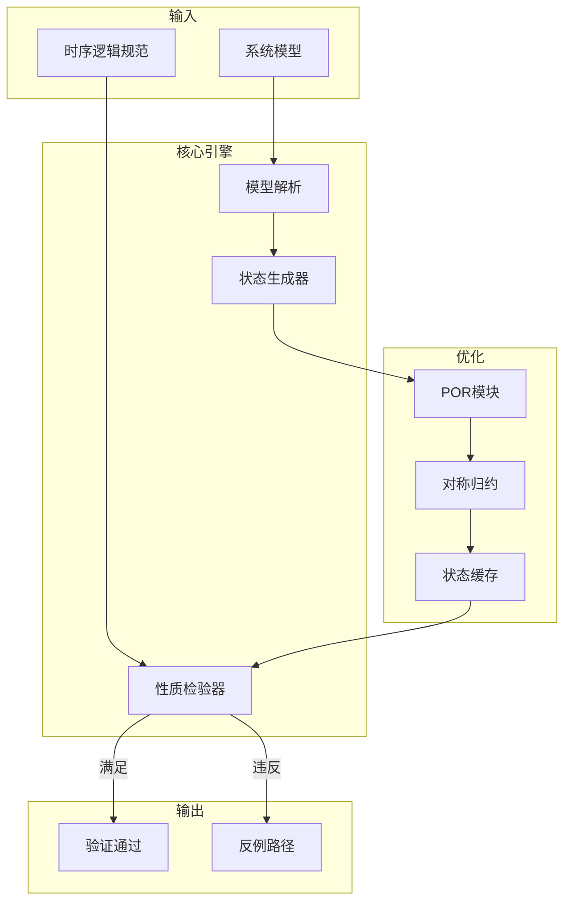
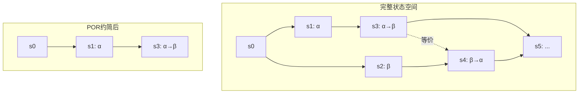
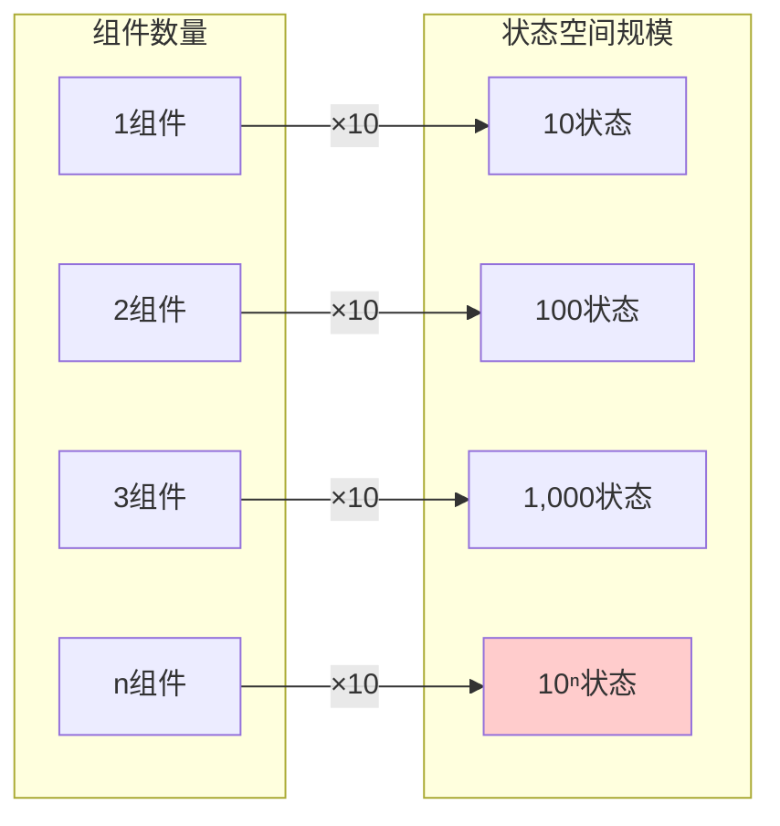

# 显式状态模型检测

> **所属单元**: Verification/Model-Checking | **前置依赖**: [Event-B 精化方法](../01-logic/02-event-b.md) | **形式化等级**: L4

## 1. 概念定义 (Definitions)

### 1.1 模型检测基础

**Def-V-04-01** (模型检测问题)。给定迁移系统$M$和时序逻辑公式$\varphi$，模型检测确定$M$是否满足$\varphi$：

$$M \models \varphi \quad \text{?}$$

**Def-V-04-02** (显式状态模型检测)。显式状态模型检测通过显式枚举和存储系统的所有可达状态来验证性质：

$$\text{ExplicitMC}(M, \varphi) = \begin{cases} \text{True} & \text{if } \forall s \in \text{Reach}(M): s \models \varphi \\ \text{False} + \text{counterexample} & \text{otherwise} \end{cases}$$

其中$\text{Reach}(M)$表示$M$的所有可达状态集合。

### 1.2 状态空间枚举

**Def-V-04-03** (状态空间)。迁移系统$M = (S, S_0, T, L)$的状态空间定义：

- **$S$**: 状态集合
- **$S_0 \subseteq S$**: 初始状态集合
- **$T \subseteq S \times S$**: 迁移关系
- **$L: S \to 2^{AP}$**: 标记函数，将状态映射到原子命题集合

**Def-V-04-04** (可达状态)。从初始状态$S_0$出发，通过迁移关系$T$可达的状态：

$$\text{Reach}(M) = \mu Z. S_0 \cup \text{Post}(Z)$$

其中$\text{Post}(Z) = \{s' \mid \exists s \in Z: (s, s') \in T\}$。

### 1.3 状态空间搜索算法

**Def-V-04-05** (广度优先搜索 / BFS)。状态空间探索使用BFS算法：

```
算法: BFS-Explore(M = (S, S₀, T, L))
输入: 迁移系统 M
输出: 可达状态集 Reach

1:  Reach ← S₀
2:  Frontier ← S₀
3:  while Frontier ≠ ∅ do
4:      Next ← ∅
5:      for each s ∈ Frontier do
6:          for each (s, s') ∈ T do
7:              if s' ∉ Reach then
8:                  Reach ← Reach ∪ {s'}
9:                  Next ← Next ∪ {s'}
10:     Frontier ← Next
11: return Reach
```

## 2. 属性推导 (Properties)

### 2.1 状态空间复杂度

**Lemma-V-04-01** (状态空间爆炸)。对于有$n$个布尔变量的系统，状态空间大小为：

$$|S| = 2^n$$

对于$n$个$k$值变量：$|S| = k^n$。

**Lemma-V-04-02** (可达状态上界)。对于有限状态系统，可达状态数不超过总状态数：

$$|\text{Reach}(M)| \leq |S|$$

当状态空间很大但实际可达状态很少时，显式枚举仍可处理。

### 2.2 偏序归约(POR)

**Def-V-04-06** (独立动作)。两个动作$\alpha$和$\beta$是独立的，如果：

1. **交换性**: 对所有状态$s$，若$\alpha$和$\beta$在$s$都使能，则执行顺序不影响结果
2. **不干扰**: $\alpha$的执行不使能/禁用$\beta$，反之亦然

形式化：
$$\text{Independent}(\alpha, \beta) \Leftrightarrow \forall s: \text{enabled}(\alpha, s) \land \text{enabled}(\beta, s) \Rightarrow \alpha(\beta(s)) = \beta(\alpha(s))$$

**Def-V-04-07** (偏序归约)。POR仅探索每个偏序等价类的代表：

$$\text{ample}(s) \subseteq \text{enabled}(s)$$

选择 ample 集合的条件：

- **C0**: $\text{ample}(s) = \emptyset \Leftrightarrow \text{enabled}(s) = \emptyset$
- **C1**: 不在 ample 中的动作与 ample 中的动作独立
- **C2**: 若 ample(s) 包含非完全不可见动作，则 ample(s) = enabled(s)
- **C3**: 不存在从 ample(s) 中动作开始的无限不可见路径

**Lemma-V-04-03** (POR保持性)。POR保持：

- 死锁状态
- LTL$_{\setminus X}$性质（不含next算子的LTL）
- 状态可见性标记的状态子集可达性

## 3. 关系建立 (Relations)

### 3.1 与其他验证方法的关系



### 3.2 显式vs符号方法

| 特征 | 显式状态 | 符号(BDD/SAT) |
|------|----------|---------------|
| 状态表示 | 显式列表 | 公式编码 |
| 状态转移 | 逐个枚举 | 批量处理 |
| 最佳适用 | 可达状态少 | 结构化系统 |
| 存储需求 | 与可达状态成正比 | 与BDD大小成正比 |
| 工具示例 | SPIN, TLC | NuSMV, CBMC |

## 4. 论证过程 (Argumentation)

### 4.1 状态爆炸问题分析

状态爆炸的主要来源：

1. **并发组合**: $n$个并行组件产生状态空间的笛卡尔积
2. **数据结构**: 无界或大数据域产生大量状态
3. **复杂控制流**: 嵌套循环、递归等
4. **环境非确定性**: 外部输入的组合爆炸

### 4.2 减缓策略选择



## 5. 形式证明 / 工程论证 (Proof / Engineering Argument)

### 5.1 BFS正确性

**Thm-V-04-01** (BFS完备性)。BFS-Explore算法返回所有且仅有从$S_0$可达的状态：

$$\text{BFS-Explore}(M) = \text{Reach}(M)$$

**证明概要**：

1. **正确性**: 通过归纳法证明所有加入Reach的状态都是可达的
   - 基础: $S_0$中的状态显然可达
   - 归纳: 若$s$可达且$(s, s') \in T$，则$s'$可达
2. **完备性**: 证明所有可达状态最终都会被加入Reach
   - 设$s$是可达状态，存在最短路径$s_0 \to s_1 \to \cdots \to s_n = s$
   - 对路径长度归纳: $s_i$在第$i$轮迭代被加入

### 5.2 POR正确性

**Thm-V-04-02** (POR保持LTL)。设$M'$为POR约简后的系统，则：

$$M' \models \varphi \Leftrightarrow M \models \varphi \quad \text{for } \varphi \in \text{LTL}_{\setminus X}$$

**证明要点**：

1. ample 集合的选择保证每个被省略的全序有代表被探索
2. 独立性保证被省略的全序与代表产生相同的状态效果
3. 对于LTL$_{\setminus X}$，全序的等价类产生相同的公式可满足性
4. 通过轨迹等价建立保持性

## 6. 实例验证 (Examples)

### 6.1 哲学家就餐问题

**状态空间分析**:
$n$个哲学家，每人3种状态（思考、饥饿、就餐）：

- 无POR: $3^n$个状态
- 有POR: 通过独立性分析，将指数级降至多项式级

**POR应用**:
当两个哲学家不相邻时，他们的动作独立：

- 哲学家$i$和$j$（$|i-j| > 1$）的动作独立
- POR仅探索一个交错顺序，而非所有排列

### 6.2 缓存一致性协议

**MESI协议状态**:

```
处理器状态: {Modified, Exclusive, Shared, Invalid}
缓存行状态: {M, E, S, I}
```

**状态空间**:

- 4个处理器 × 2个缓存行: $4^4 \times 4^4 = 65,536$ 状态
- 实际可达状态（协议约束）: 约 5,000 状态

**验证性质**:

- 安全性: $\square \neg (M_i \land M_j)$（不会两个Modified同时存在）
- 活性: $\text{Request}_i \sim \text{Grant}_i$

## 7. 可视化 (Visualizations)

### 7.1 模型检测流程



### 7.2 偏序归约示意图



### 7.3 状态爆炸问题示意



## 8. 引用参考 (References)

### 相关概念

- [模型检测概述](../../98-appendices/wikipedia-concepts/02-model-checking.md) - 模型检测基础理论与概念
