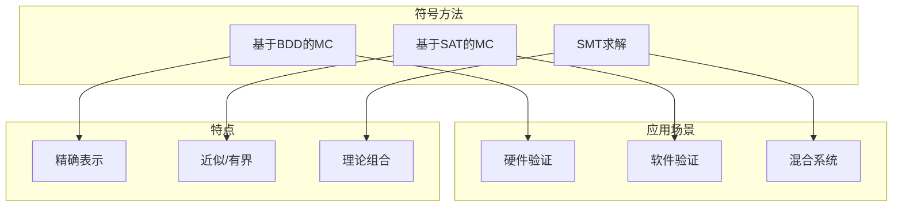
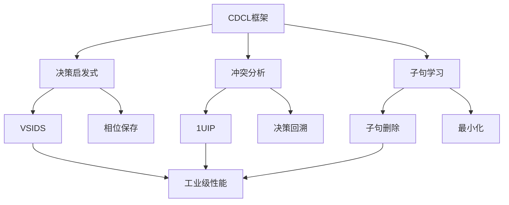
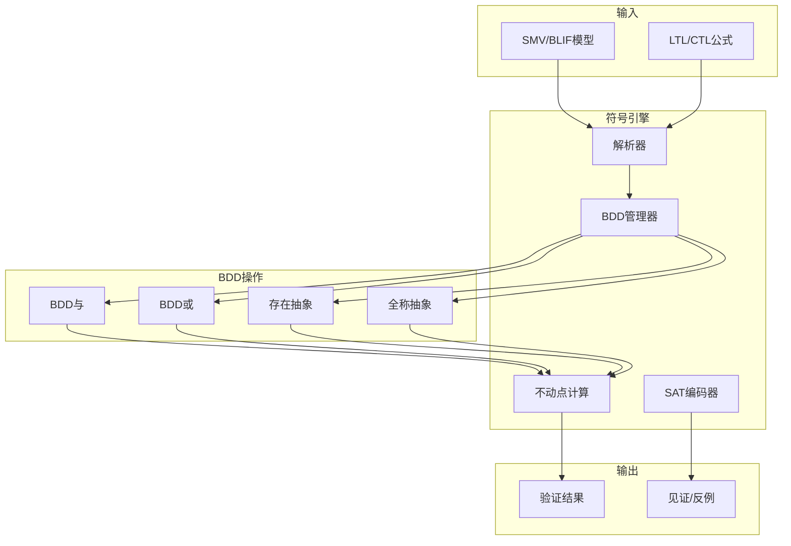
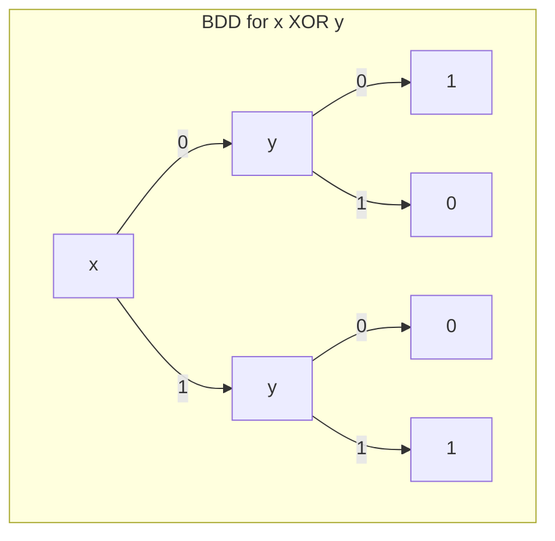

# 符号模型检测

> **所属单元**: Verification/Model-Checking | **前置依赖**: [显式状态模型检测](./01-explicit-state.md) | **形式化等级**: L5

## 1. 概念定义 (Definitions)

### 1.1 符号状态表示

**Def-V-05-01** (符号表示)。在符号模型检测中，状态集合使用布尔公式编码而非显式枚举：

$$S_{\text{set}} \triangleq \{s \in \{0,1\}^n \mid f_S(s) = \text{true}\}$$

其中$f_S: \{0,1\}^n \to \{0,1\}$是特征函数。

**Def-V-05-02** (符号迁移关系)。迁移关系$T$表示为布尔公式：

$$T(V, V')$$

其中$V = \{v_1, \ldots, v_n\}$是当前状态变量，$V' = \{v_1', \ldots, v_n'\}$是下一状态变量。

**Def-V-05-03** (像计算)。前向像(Forward Image)计算从当前状态集合可达的下一状态：

$$\text{Img}(S) = \exists V: S(V) \land T(V, V')$$

后向像(Backward Image)：

$$\text{PreImg}(S') = \exists V': S'(V') \land T(V, V')$$

### 1.2 二进制决策图 (BDD)

**Def-V-05-04** (BDD定义)。二进制决策图是表示布尔函数的有向无环图：

$$\text{BDD} = (N, T, E, \text{var}, \text{val}, \text{root})$$

其中：

- **$N$**: 内部节点集合
- **$T = \{0, 1\}$**: 终节点（叶节点）
- **$E \subseteq N \times \{0, 1\} \times (N \cup T)$**: 标记边（0-边和1-边）
- **$\text{var}: N \to \text{Vars}$**: 节点变量标记
- **$\text{val}: T \to \{0, 1\}$**: 终节点值

**Def-V-05-05** (ROBDD)。约简有序二进制决策图具有以下性质：

1. **有序性**: 变量沿路径按固定顺序出现
2. **唯一性**: 无重复子图（通过哈希表实现）
3. **非冗余性**: 无冗余节点（两子边指向同一节点则删除）

### 1.3 SAT求解器

**Def-V-05-06** (SAT问题)。布尔可满足性问题：

$$\text{SAT}(\varphi) = \begin{cases} \text{satisfiable} & \text{if } \exists \alpha: \alpha \models \varphi \\ \text{unsatisfiable} & \text{otherwise} \end{cases}$$

**Def-V-05-07** (CDCL算法)。现代SAT求解器使用冲突驱动的子句学习：

1. **决策**: 选择未赋值变量并赋值
2. **传播**: 单位传播推导强制赋值
3. **分析**: 发现冲突时学习新子句
4. **回退**: 非时序回退到决策级别

## 2. 属性推导 (Properties)

### 2.1 BDD操作复杂度

**Lemma-V-05-01** (BDD操作复杂度)。对于表示布尔函数$f$和$g$的BDD：

| 操作 | 复杂度 | 描述 |
|------|--------|------|
| $f \land g$ | $O(|f| \cdot |g|)$ | Apply操作 |
| $f \lor g$ | $O(|f| \cdot |g|)$ | Apply操作 |
| $\exists x: f$ | $O(|f|^2)$ | 存在抽象 |
| $\forall x: f$ | $O(|f|^2)$ | 全称抽象 |

**Lemma-V-05-02** (变量排序影响)。BDD大小对变量排序敏感：

$$|BDD_{\pi_1}(f)| \text{ vs } |BDD_{\pi_2}(f)| \text{ 可指数差异}$$

最优变量排序问题是NP难的。

### 2.2 BMC完备性边界

**Def-V-05-08** (有界模型检测)。BMC检验是否存在长度为$k$的反例：

$$\text{BMC}(M, \varphi, k) = \text{SAT}\left(I(V_0) \land \bigwedge_{i=0}^{k-1} T(V_i, V_{i+1}) \land \neg \varphi(V_0, \ldots, V_k)\right)$$

**Lemma-V-05-03** (完备性边界)。若系统在边界$d$内无新状态，则BMC完备：

$$\text{Reach}_d(M) = \text{Reach}(M) \Rightarrow (\text{BMC}(M, \varphi, d) = \text{UNSAT} \Leftrightarrow M \models \varphi)$$

## 3. 关系建立 (Relations)

### 3.1 BDD与SAT的关系



### 3.2 符号vs显式方法对比

| 维度 | 显式状态 | BDD | SAT |
|------|----------|-----|-----|
| 状态表示 | 集合 | 决策图 | 公式 |
| 状态探索 | BFS/DFS | 不动点 | 增量 |
| 空间效率 | 可达状态数 | 依赖结构 | 子句数 |
| 时间效率 | 枚举速度 | BDD操作 | CDCL效率 |
| 最佳应用 | 小状态空间 | 结构化系统 | 大约束集 |

## 4. 论证过程 (Argumentation)

### 4.1 BDD优势与局限

**优势**：

1. **规范表示**: 唯一ROBDD保证等价检验为常数时间
2. **高效操作**: 布尔运算在图上直接执行
3. **隐式枚举**: 可能紧凑表示大状态集

**局限**：

1. **变量排序**: 性能高度依赖变量排序
2. **内存消耗**: 某些函数需要指数大小BDD
3. **动态增长**: 中间结果可能远超最终BDD大小

### 4.2 SAT求解器进展

现代SAT求解器的关键优化：



## 5. 形式证明 / 工程论证 (Proof / Engineering Argument)

### 5.1 符号不动点算法

**Thm-V-05-01** (符号不动点收敛)。符号不动点算法在有限状态系统上终止：

$$\mu Z. S_0 \lor \text{Img}(Z) \text{ 在 } \leq 2^{|V|} \text{ 步内收敛}$$

**证明概要**：

1. 状态空间大小有限：$|\{0,1\}^{|V|}| = 2^{|V|}$
2. 每次迭代至少添加一个新状态，或已收敛
3. 由鸽巢原理，最多$2^{|V|}$次迭代后必收敛
4. 实际应用中通常远小于此上界

### 5.2 BMC正确性

**Thm-V-05-02** (BMC正确性)。BMC在边界$k$内正确检测反例：

$$\text{BMC}(M, \varphi, k) = \text{SAT} \Leftrightarrow \exists \pi: |\pi| \leq k \land \pi \models \neg \varphi$$

**证明**：

1. ($\Rightarrow$) 若SAT，赋值给出状态序列$s_0, \ldots, s_k$
2. 由约束$I(V_0) \land \bigwedge T(V_i, V_{i+1})$，序列是有效轨迹
3. 由$\neg \varphi(V_0, \ldots, V_k)$，轨迹违反性质
4. ($\Leftarrow$) 若有长度$\leq k$的反例，编码为SAT实例必有解

## 6. 实例验证 (Examples)

### 6.1 BDD表示示例

**函数**: $f(a, b, c) = (a \land b) \lor (b \land c) \lor (a \land c)$（多数函数）

**变量顺序**: $a < b < c$

```
       a
      / \
     0   1
    /     \
   b       b
  / \     / \
 0   1   0   1
 |  / \  |   |
 0 c   1 1   1
  / \
 0   1
```

### 6.2 NuSMV验证实例

**互斥协议验证**:

```smv
MODULE main
VAR
  pr1: process proc();
  pr2: process proc();
  turn: {1, 2};

SPEC
  AG !(pr1.state = critical & pr2.state = critical)

SPEC
  AG (pr1.state = waiting -> AF pr1.state = critical)
```

**BDD分析**:

- 状态变量: 8位
- BDD节点数: 约150
- 验证时间: <0.1秒

## 7. 可视化 (Visualizations)

### 7.1 符号模型检测架构



### 7.2 BDD结构示例



### 7.3 BMC展开示意图

```mermaid
graph LR
    subgraph 时间帧
        T0[V₀]
        T1[V₁]
        T2[V₂]
        TK[Vₖ]
    end

    subgraph 约束
        I[初始状态 I]
        T01[T(V₀,V₁)]
        T12[T(V₁,V₂)]
        TKK[T(Vₖ₋₁,Vₖ)]
        NotPhi[¬φ(V₀,...,Vₖ)]
    end

    I --> T0
    T0 --> T01
    T01 --> T1
    T1 --> T12
    T12 --> T2
    T2 -.-> TKK
    TKK --> TK
    TK --> NotPhi
```

## 8. 引用参考 (References)
