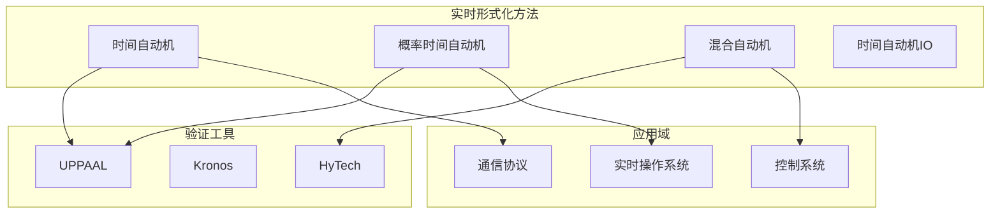
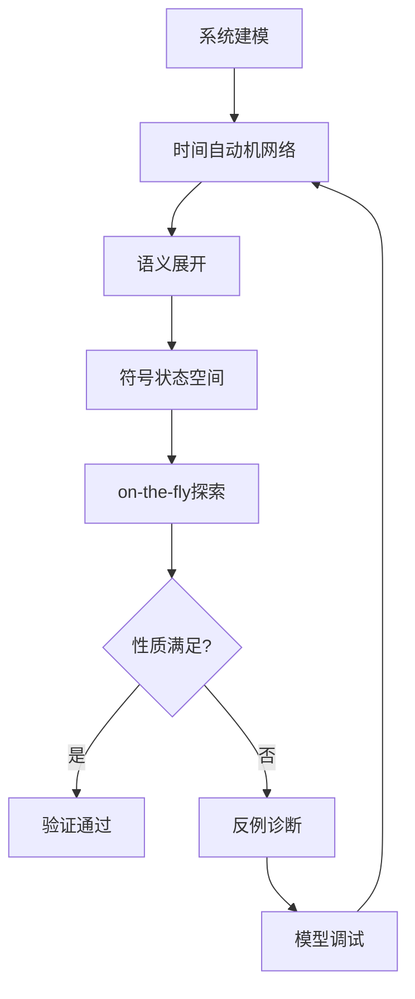
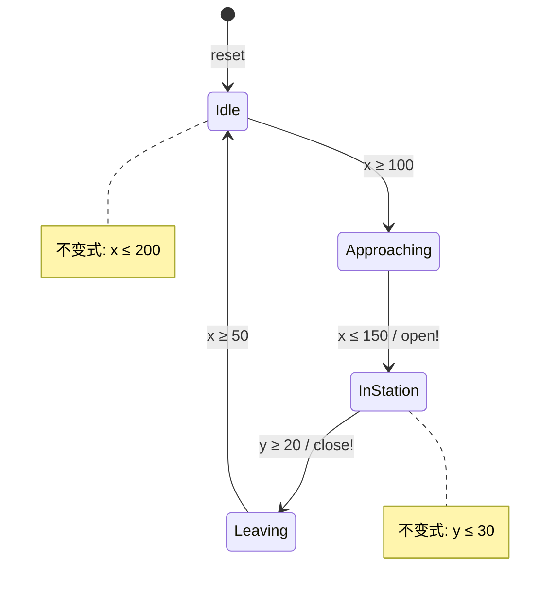
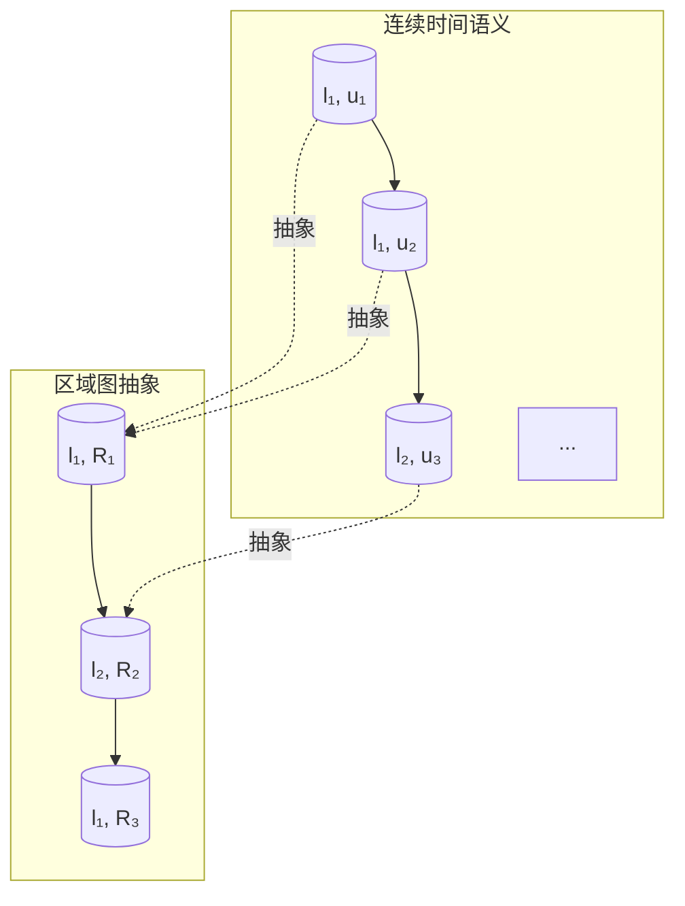
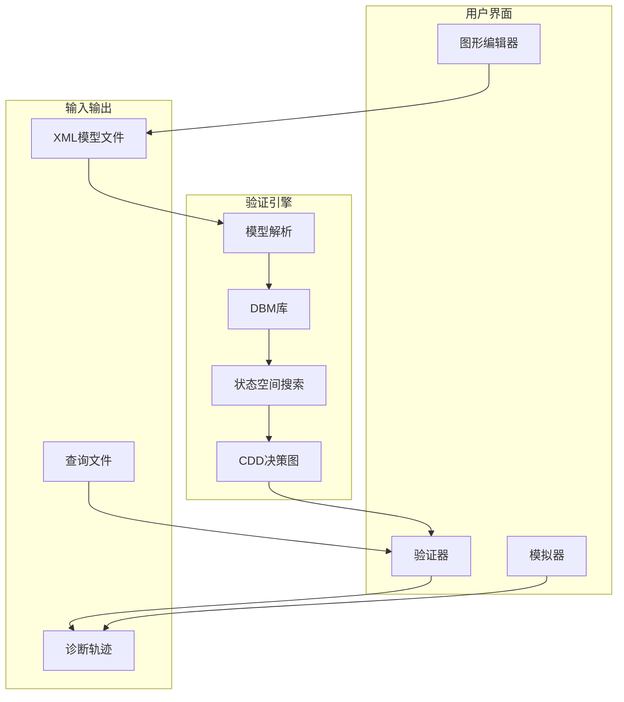

# 实时模型检验

> **所属单元**: Verification/Model-Checking | **前置依赖**: [符号模型检验](./02-symbolic-mc.md) | **形式化等级**: L5

## 1. 概念定义 (Definitions)

### 1.1 时间自动机

**Def-V-06-01** (时间自动机 / Timed Automaton)。一个时间自动机$\mathcal{A}$是六元组：

$$\mathcal{A} = (L, l_0, C, A, E, I)$$

其中：

- **$L$**: 有限位置集合
- **$l_0 \in L$**: 初始位置
- **$C$**: 时钟变量有限集合
- **$A$**: 动作（字母表）集合
- **$E \subseteq L \times A \times \mathcal{G}(C) \times 2^C \times L$**: 边集合，带守卫$\mathcal{G}$和时钟重置
- **$I: L \to \mathcal{G}(C)$**: 位置不变式

**Def-V-06-02** (时钟约束)。时钟约束$g \in \mathcal{G}(C)$的语法：

$$g ::= x \bowtie n \mid x - y \bowtie n \mid g \land g \mid \text{true} \quad \text{where } \bowtie \in \{<, \leq, =, \geq, >\}, n \in \mathbb{N}$$

### 1.2 语义定义

**Def-V-06-03** (时间自动机语义)。时间自动机的语义由转移系统$(S, s_0, \rightarrow)$给出：

- **状态**: $s = (l, u)$，其中$l \in L$，$u: C \to \mathbb{R}_{\geq 0}$是时钟赋值
- **初始状态**: $s_0 = (l_0, u_0)$，$u_0(c) = 0$对所有$c \in C$
- **延迟转移**: $(l, u) \xrightarrow{d} (l, u + d)$ 若$u + d \models I(l)$，$d \in \mathbb{R}_{\geq 0}$
- **离散转移**: $(l, u) \xrightarrow{a} (l', u')$ 若$\exists (l, a, g, r, l') \in E: u \models g \land u' = u[r \mapsto 0] \land u' \models I(l')$

### 1.3 区域图

**Def-V-06-04** (时钟区域)。时钟区域是时钟赋值的等价类：

$$u \cong v \Leftrightarrow \forall c \in C: \lfloor u(c) \rfloor = \lfloor v(c) \rfloor \land (\text{fr}(u(c)) = 0 \Leftrightarrow \text{fr}(v(c)) = 0) \land (\text{fr}(u(c)) \leq \text{fr}(u(c')) \Leftrightarrow \text{fr}(v(c)) \leq \text{fr}(v(c')))$$

其中$\lfloor \cdot \rfloor$是整数部分，$\text{fr}(\cdot)$是小数部分。

**Def-V-06-05** (区域图)。区域图$\mathcal{R}(\mathcal{A})$是有限抽象：

$$\mathcal{R}(\mathcal{A}) = (L \times \text{Regions}(C), (l_0, [u_0]), \rightarrow_{\mathcal{R}})$$

区域数目上界（$k$为最大常量，$n$为时钟数）：

$$|\text{Regions}(C)| \leq n! \cdot 2^n \cdot (2k + 2)^n$$

## 2. 属性推导 (Properties)

### 2.1 区域图性质

**Lemma-V-06-01** (区域图双模拟)。区域图与原时间自动机时间抽象双模拟：

$$(l, u) \sim (l, [u]) \text{ 在时间抽象语义下}$$

**Lemma-V-06-02** (模型检验可判定性)。时间自动机的TCTL模型检验是可判定的：

$$\mathcal{A} \models \varphi \text{ 可在多项式空间内判定}$$

### 2.2 时钟域

**Def-V-06-06** (时钟域 / Zone)。时钟域是时钟约束的合取，表示为：

$$Z = \bigwedge_{i,j} (x_i - x_j \bowtie_{ij} c_{ij})$$

用差分约束矩阵(DBM)紧凑表示。

**Lemma-V-06-03** (域操作)。域支持以下操作：

- **$Z^\uparrow$**: 时间延迟（上闭包）
- **$Z[r \mapsto 0]$**: 时钟重置
- **$Z \cap g$**: 与守卫交集
- **$\text{Approx}_k(Z)$**: $k$-近似（保证终止）

## 3. 关系建立 (Relations)

### 3.1 实时验证方法关系



### 3.2 时间逻辑

| 逻辑 | 时序运算符 | 适用系统 |
|------|-----------|----------|
| TCTL | $E\varphi U_{\sim c} \psi$, $A\square_{\sim c} \varphi$ | 时间自动机 |
| MTL | $\square_I \varphi$, $\Diamond_I \varphi$ | 连续时间 |
| MITL | 无嵌套模态的MTL | 可判定子集 |

## 4. 论证过程 (Argumentation)

### 4.1 实时系统验证挑战

1. **连续时间**: 需要处理稠密时间域
2. **并发组合**: 并行组合导致状态空间乘积
3. **Zeno行为**: 无限多动作在有限时间内执行
4. **非确定性**: 时间和离散选择的组合

### 4.2 UPPAAL方法



## 5. 形式证明 / 工程论证 (Proof / Engineering Argument)

### 5.1 区域图正确性

**Thm-V-06-01** (区域图保持性)。区域图保持TCTL性质：

$$\mathcal{A} \models_{TCTL} \varphi \Leftrightarrow \mathcal{R}(\mathcal{A}) \models_{CTL} \varphi_{\text{abstract}}$$

**证明概要**：

1. 区域划分保持时钟约束的可满足性
2. 同一区域内所有时钟赋值行为等价
3. 延迟和离散转移在区域级别正确抽象
4. 时间逻辑性质仅依赖区域级别的相对顺序

### 5.2 UPPAAL验证算法

**Thm-V-06-02** (符号可达性)。UPPAAL的符号可达性分析正确且完备：

$$\text{Pass}(Z) = \text{true} \Leftrightarrow \exists \text{运行到达接受状态}$$

**算法核心**：

1. 用DBM表示时钟域（符号状态）
2. 计算后继域：$Z' = (Z^\uparrow \cap I(l'))[r \mapsto 0] \cap g$
3. 包含检查：新域是否被已探索域包含
4. 终止性：通过$k$-近似保证

## 6. 实例验证 (Examples)

### 6.1 列车门控制器

**UPPAAL模型**:

```
// Train进程
process Train() {
    state Idle, Approaching, InStation, Leaving;
    init Idle;
    trans
        Idle -> Approaching { guard x >= 100; },
        Approaching -> InStation { guard x <= 150; assign door!open; },
        InStation -> Leaving { guard y >= 20; assign door!close; },
        Leaving -> Idle { guard x >= 50; };
}

// Door进程
process Door() {
    state Closed, Opening, Open, Closing;
    init Closed;
    trans
        Closed -> Opening { sync door?open; },
        Opening -> Open { guard z <= 5; },
        Open -> Closing { sync door?close; },
        Closing -> Closed { guard z <= 5; };
}
```

**验证性质**:

- 安全: `A[] not (Train.InStation and Door.Closed)`
- 活性: `Train.Approaching --> Train.InStation`

### 6.2 Fischer协议

**协议参数**:
$\Delta$为延迟上界，$\delta$为延迟下界

**时间约束**:  $\delta > \Delta$ 保证互斥

**UPPAAL验证**:

- 3进程时状态数: 约 1,000 个符号状态
- 验证时间: < 1秒
- 发现: 参数不满足时存在反例

## 7. 可视化 (Visualizations)

### 7.1 时间自动机示例



### 7.2 区域图抽象



### 7.3 UPPAAL架构



## 8. 引用参考 (References)
