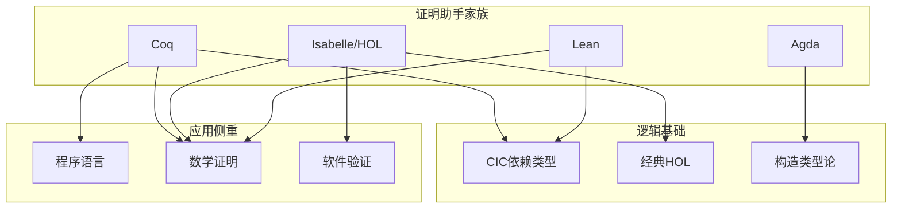
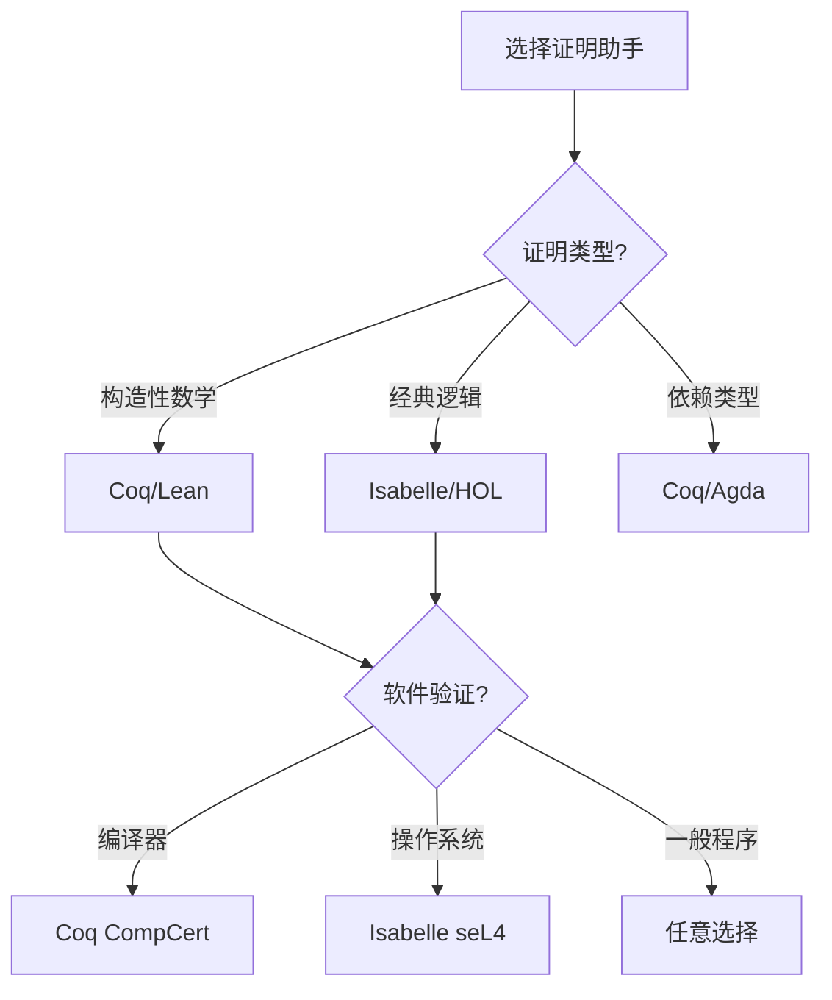
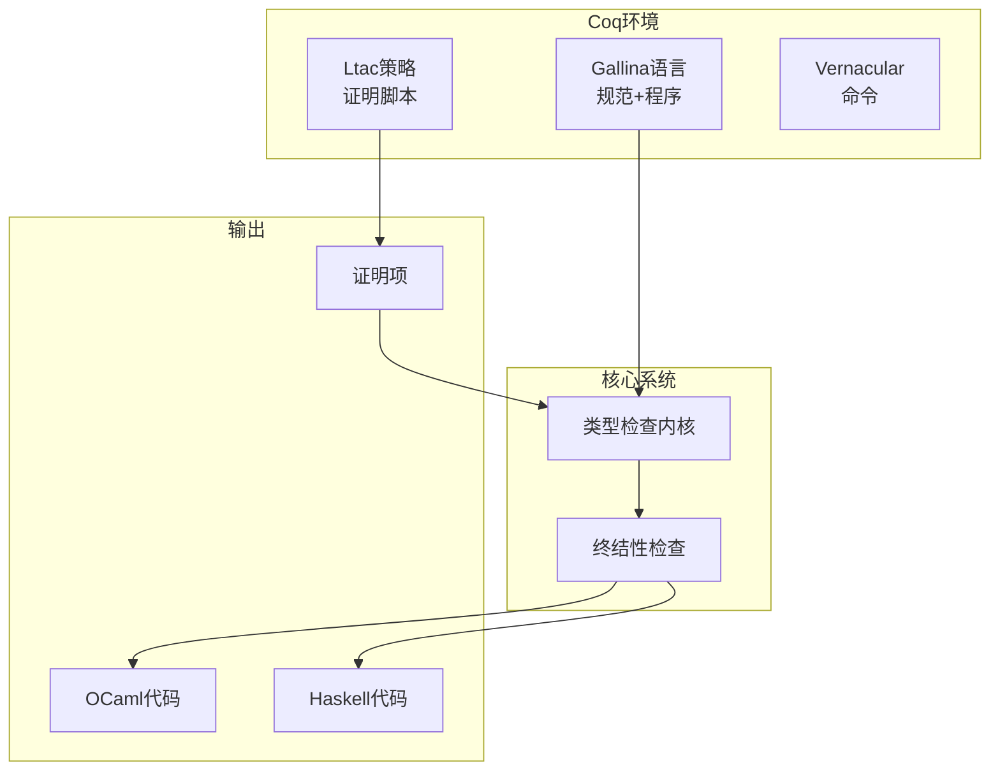
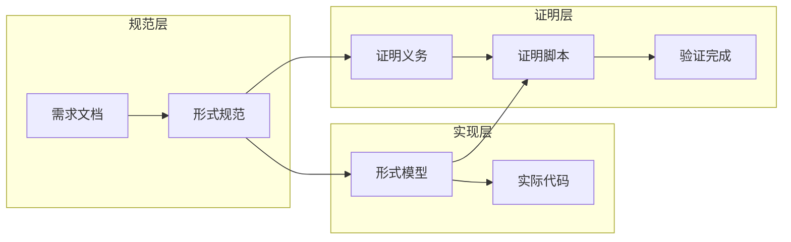
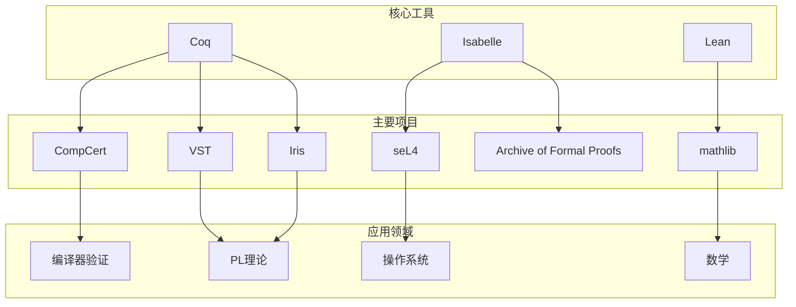

# Coq/Isabelle定理证明

> **所属单元**: Verification/Theorem-Proving | **前置依赖**: [分离逻辑](../01-logic/03-separation-logic.md) | **形式化等级**: L6

## 1. 概念定义 (Definitions)

### 1.1 高阶逻辑(HOL)

**Def-V-07-01** (高阶逻辑语法)。高阶逻辑扩展一阶逻辑，允许量词和变量覆盖：

- **个体**: 基础类型（$\mathbb{N}, \mathbb{B}, \ldots$）的元素
- **函数**: 从类型到类型的映射 $\tau_1 \to \tau_2$
- **谓词**: 到布尔值的函数 $\tau \to \mathbb{B}$
- **高阶函数**: 函数可以是其他函数的参数或返回值

类型构造：
$$\tau ::= \iota \mid \mathbb{B} \mid \tau_1 \to \tau_2 \mid \tau_1 \times \tau_2$$

**Def-V-07-02** (HOL证明系统)。HOL证明基于以下核心规则：

$$\frac{\Gamma \vdash t: \mathbb{B}}{\Gamma \vdash t} \text{ (命题作为类型)}$$

- **$\alpha$-转换**: 绑定变量重命名
- **$\beta$-规约**: $(\lambda x. t) u \to t[u/x]$
- **$\eta$-扩展**: $(\lambda x. f x) = f$ （若$x \notin \text{FV}(f)$）

### 1.2 Coq证明助手

**Def-V-07-03** (Calculus of Inductive Constructions / CIC)。Coq基于CIC：

$$\mathcal{CIC} = \lambda\text{-演算} + \text{依赖类型} + \text{归纳类型} + \text{宇宙层次}$$

**依赖类型**: 类型可依赖项
$$\Pi x: A. B(x) \quad \text{(若B依赖x)}$$

**归纳类型**（以自然数为例）：

```
Inductive nat : Type :=
  | O : nat
  | S : nat -> nat.
```

**Def-V-07-04** (Coq证明策略)。证明通过策略(tactics)构建：

| 策略 | 作用 |
|------|------|
| `intros` | 引入假设到上下文 |
| `apply` | 应用定理或假设 |
| `rewrite` | 等式重写 |
| `induction` | 归纳证明 |
| `reflexivity` | 证明自反等式 |
| `auto`/`tauto` | 自动搜索证明 |

### 1.3 Isabelle/HOL

**Def-V-07-05** (Isabelle元逻辑)。Isabelle基于直觉高阶逻辑作为元逻辑：

$$\text{Isabelle} = \text{Pure} + \text{HOL} + \text{自动化证明器}$$

**核心概念**：

- **项**: 高阶逻辑的表达式
- **定理**: 在证明上下文中的判断 $\Gamma \vdash \varphi$
- **理论**: 定义、定理和证明的集合

**Def-V-07-06** (Isar证明语言)。结构化证明语言：

```isar
theorem "P \<longrightarrow> P"
proof
  assume "P"
  then show "P" by assumption
qed
```

## 2. 属性推导 (Properties)

### 2.1 类型系统性质

**Lemma-V-07-01** (Coq强规范化)。CIC中良类型项都是强规范化的：

$$\Gamma \vdash t: T \Rightarrow \exists t_{\text{nf}}: t \to^* t_{\text{nf}} \land t_{\text{nf}} \text{ 不可再规约}$$

**Lemma-V-07-02** (类型保持)。规约保持类型：

$$\Gamma \vdash t: T \land t \to t' \Rightarrow \Gamma \vdash t': T$$

### 2.2 证明一致性

**Lemma-V-07-03** (逻辑一致性)。Coq和Isabelle/HOL都是逻辑一致的（假设无矛盾公理）：

$$\not\vdash \text{False}$$

## 3. 关系建立 (Relations)

### 3.1 Coq vs Isabelle对比



### 3.2 与软件验证的关系

| 工具 | 验证方法 | 代码提取 | 主要项目 |
|------|----------|----------|----------|
| Coq | 函数式编程 + 证明 | OCaml/Haskell | CompCert, VST |
| Isabelle | 规范 + 细化 | Haskell/Scala | seL4, AutoCorres |

## 4. 论证过程 (Argumentation)

### 4.1 证明助手选择



### 4.2 形式化验证流程

1. **形式化规范**: 将需求和设计转换为形式化定义
2. **实现建模**: 在证明助手中建立可执行模型
3. **性质陈述**: 使用逻辑公式表达正确性性质
4. **证明开发**: 交互式或半自动构建证明
5. **代码生成/验证**: 提取代码或验证现有实现

## 5. 形式证明 / 工程论证 (Proof / Engineering Argument)

### 5.1 Curry-Howard对应

**Thm-V-07-01** (Curry-Howard同构)。命题与类型、证明与程序之间存在对应：

$$\frac{\text{命题 } P}{\text{类型 } P} = \frac{\text{证明 } p: P}{\text{程序 } p: P}$$

| 逻辑 | 类型论 |
|------|--------|
| $P \Rightarrow Q$ | 函数类型 $P \to Q$ |
| $P \land Q$ | 积类型 $P \times Q$ |
| $P \lor Q$ | 和类型 $P + Q$ |
| $\forall x: P(x)$ | 依赖积 $\Pi x: A. P(x)$ |
| $\exists x: P(x)$ | 依赖和 $\Sigma x: A. P(x)$ |
| 证明 | 程序（项） |

### 5.2 归纳原理

**Thm-V-07-02** (结构归纳)。对于归纳类型$T$和性质$P: T \to \text{Prop}$：

$$(\forall c: \text{constructor}, \forall a: \text{args}(c), P(a) \Rightarrow P(c(a))) \Rightarrow \forall x: T, P(x)$$

**Coq示例**（自然数归纳）：

```coq
Theorem nat_ind : forall P : nat -> Prop,
  P 0 ->
  (forall n : nat, P n -> P (S n)) ->
  forall n : nat, P n.
```

## 6. 实例验证 (Examples)

### 6.1 CompCert编译器验证

**项目规模**:

- 代码: ~100,000行Coq
- 验证: ~150,000行证明
- 编译器: C → 汇编 (PowerPC, ARM, x86, RISC-V)

**正确性定理**:

```coq
Theorem compiler_correct:
  forall p tp,
  compile p = OK tp ->
  forward_simulation (Csem p) (Asm tp).
```

**验证层次**:

```
Clight (C子集)
    ↓ 规约
Cminor
    ↓ 规约
RTL (寄存器传递)
    ↓ 优化
LTL (位置传递)
    ↓ 规约
Linear
    ↓ 规约
Asm (汇编)
```

### 6.2 seL4操作系统验证

**验证内容**:

- 功能正确性: C实现与抽象规范等价
- 安全性质: 信息流安全
- 假设最小化: 仅依赖编译器、硬件

**Isabelle定理**:

```isar
theorem "kernel_call rv s = (Inr rv', s') \<longrightarrow>
  invariant s' \<and> related s' a'"
```

**验证统计**:

- 证明脚本: ~200,000行
- 验证时间: ~10小时
- 缺陷发现: 160+ bug在实现前发现

## 7. 可视化 (Visualizations)

### 7.1 Coq证明结构



### 7.2 定理证明工具链



### 7.3 证明助手生态系统



## 8. 引用参考 (References)
