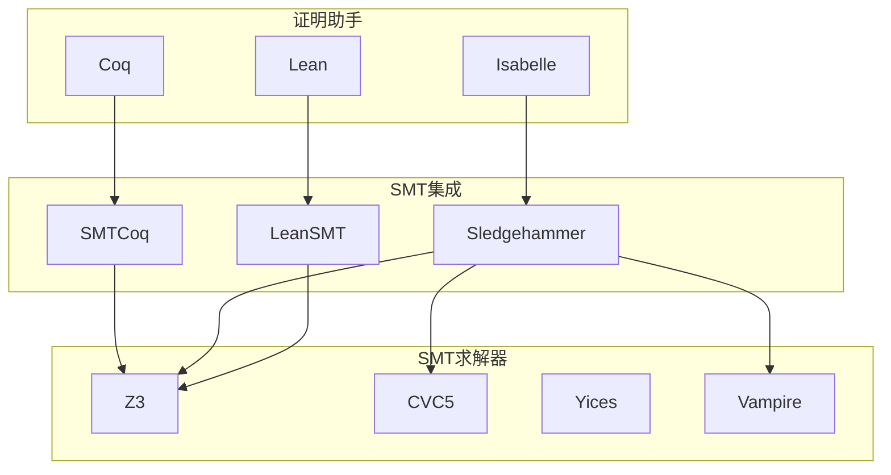
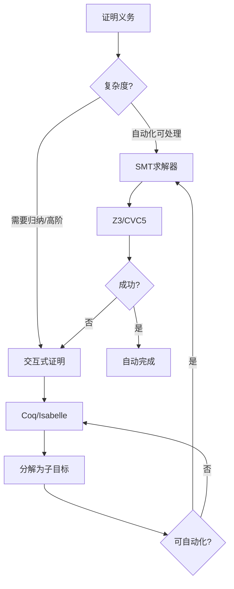
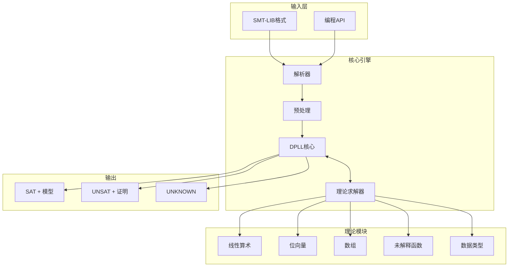
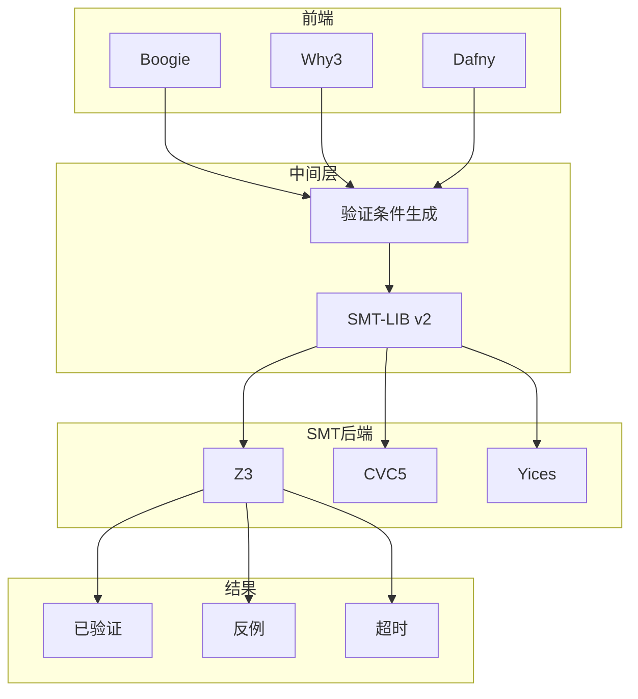

# SMT求解器

> **所属单元**: Verification/Theorem-Proving | **前置依赖**: [Coq/Isabelle定理证明](./01-coq-isabelle.md) | **形式化等级**: L5

## 1. 概念定义 (Definitions)

### 1.1 SMT问题定义

**Def-V-08-01** (可满足性模理论 / SMT)。SMT是判定一阶逻辑公式在组合理论下的可满足性：

$$\text{SMT}(\mathcal{T}_1, \ldots, \mathcal{T}_n) = \text{SAT}(\text{Bool} + \mathcal{T}_1 + \cdots + \mathcal{T}_n)$$

**Def-V-08-02** (SMT-LIB标准)。SMT-LIB定义理论签名和逻辑：

| 逻辑 | 理论组合 | 应用 |
|------|----------|------|
| QF_LIA | 无量词线性整数算术 | 程序验证 |
| QF_LRA | 无量词线性实数算术 | 混合系统 |
| QF_BV | 无量词位向量 | 硬件/底层代码 |
| QF_AUFBV | 数组+未解释函数+位向量 | 内存模型 |
| QF_DT | 数据类型 | 代数数据类型 |

### 1.2 理论组合

**Def-V-08-03** (Nelson-Oppen组合)。组合可判定理论的通用方法：

给定两个签名不交的理论$T_1$和$T_2$，公式$\varphi$在$T_1 \cup T_2$下可满足，当且仅当存在等价关系$\sim$使：

$$\varphi_1 \cup \text{Arr}(\sim) \text{ 在 } T_1 \text{ 可满足} \land \varphi_2 \cup \text{Arr}(\sim) \text{ 在 } T_2 \text{ 可满足}$$

**条件**：理论必须是**稳定无穷**且签名不交。

**Def-V-08-04** (SMT求解架构)。Lazy SMT求解器架构：

$$\text{SMT Solver} = \text{SAT Solver} + \text{Theory Solvers} + \text{Theory Combination}$$

### 1.3 主要求解器

**Def-V-08-05** (Z3求解器)。Z3是微软研究院开发的SMT求解器：

$$\text{Z3} = \text{DPLL(T)} + \text{量词实例化} + \text{优化} + \text{策略}$$

**核心特性**：

- 增量求解
- 多目标优化
- 用户理论插件
- 证明生成

**Def-V-08-06** (CVC5)。CVC5是开源SMT求解器：

- 支持高阶逻辑
- 健全的证明输出
- 有限模型查找

## 2. 属性推导 (Properties)

### 2.1 DPLL(T)算法

**Lemma-V-08-01** (DPLL(T)完备性)。对于无量词公式，DPLL(T)是完备且可靠的：

$$\text{DPLL(T)}(\varphi) = \text{SAT} \Leftrightarrow \varphi \text{ 在理论 } T \text{ 下可满足}$$

**Lemma-V-08-02** (理论传播)。理论传播通过传播蕴含减少搜索空间：

$$\text{Trail} \models_T l \Rightarrow \text{UnitPropagate}(l)$$

### 2.2 量词处理

**Def-V-08-07** (量词消去策略)。SMT求解器使用量词实例化：

- **启发式实例化**: 基于触发器的模式匹配
- **基于模型**: 生成反例并实例化
- **完全性保证**: E-matching, MBQI

## 3. 关系建立 (Relations)

### 3.1 SMT与证明助手集成



### 3.2 TLA+证明助手集成

**Def-V-08-08** (TLAPS后端)。TLAPS使用SMT作为证明后端：

$$\text{TLAPS} \xrightarrow{\text{翻译}} \text{SMT-LIB} \xrightarrow{\text{Z3/CVC5}} \text{结果}$$

**流程**：

1. TLA+证明义务转换为证明目标
2. 目标编码为SMT-LIB格式
3. SMT求解器尝试证明
4. 成功则证明步完成，失败需交互式证明

## 4. 论证过程 (Argumentation)

### 4.1 SMT vs 交互式证明



### 4.2 验证工具链选择

| 场景 | 推荐工具 | 理由 |
|------|----------|------|
| 快速原型验证 | Z3 | 易用，高性能 |
| 程序验证 | Boogie + Z3 | 中间验证语言 |
| 安全关键系统 | Why3 + 多后端 | 可移植性 |
| 复杂数据类型 | CVC5 | 高阶支持 |
| 证明助手自动化 | Sledgehammer | 集成度好 |

## 5. 形式证明 / 工程论证 (Proof / Engineering Argument)

### 5.1 DPLL(T)正确性

**Thm-V-08-01** (DPLL(T)正确性)。DPLL(T)算法正确判定SMT公式：

$$\text{DPLL(T)}(\varphi) = \begin{cases} \text{SAT} & \Rightarrow \exists \mathcal{M}: \mathcal{M} \models_T \varphi \\ \text{UNSAT} & \Rightarrow \forall \mathcal{M}: \mathcal{M} \not\models_T \varphi \end{cases}$$

**证明概要**：

1. **可靠性(SAT)**：返回SAT时，SAT求解器返回布尔赋值，理论求解器验证理论一致性
2. **可靠性(UNSAT)**：返回UNSAT时，存在不可满足的子句-理论冲突
3. **完备性**：算法系统性地探索搜索空间，理论传播不遗漏有效推导

### 5.2 Nelson-Oppen组合正确性

**Thm-V-08-02** (Nelson-Oppen组合)。对于稳定无穷、签名不交的理论，Nelson-Oppen组合保持可判定性：

$$\text{Decidable}(T_1) \land \text{Decidable}(T_2) \land \text{StablyInfinite}(T_1, T_2) \Rightarrow \text{Decidable}(T_1 \cup T_2)$$

**证明要点**：

1. 等式在理论间传递（共享变量）
2. 凸理论保证等式的完备传播
3. 非凸理论需要分情况讨论
4. 终止性由有限共享变量集保证

## 6. 实例验证 (Examples)

### 6.1 Z3验证实例

**程序验证**:

```python
from z3 import *

x, y = Ints('x y')

# 验证: x > 0 && y > 0 => x + y > 0
prove(Implies(And(x > 0, y > 0), x + y > 0))
# 结果: proved

# 验证数组性质
arr = Array('arr', IntSort(), IntSort())
i, j = Ints('i j')
prove(Implies(i == j, arr[i] == arr[j]))
# 结果: proved
```

**位向量运算**:

```python
x, y = BitVecs('x y', 32)

# 验证位运算性质
prove(((x & y) | (~x & y)) == y)
# 结果: proved
```

### 6.2 TLAPS SMT集成

**TLA+证明片段**:

```tla
THEOREM \A x, y \in Nat : x > 0 /\ y > 0 => x + y > 0
<1>1. TAKE x, y \in Nat
<1>2. HAVE x > 0 /\ y > 0
<1>3. QED BY <1>1, <1>2, SMT
```

**SMT翻译**:
TLAPS自动将目标翻译为SMT-LIB：

```smtlib
(declare-fun x () Int)
(declare-fun y () Int)
(assert (> x 0))
(assert (> y 0))
(assert (not (> (+ x y) 0)))
(check-sat)
```

## 7. 可视化 (Visualizations)

### 7.1 SMT求解器架构



### 7.2 DPLL(T)执行流程

```mermaid
flowchart TD
    A[输入CNF + 理论约束] --> B[布尔赋值]
    B --> C[理论一致性检查]
    C -->{一致?}
    C -->|是| D[完整赋值?]
    D -->|是| E[SAT]
    D -->|否| F[决策/传播]
    F --> B
    C -->|否| G[理论冲突分析]
    G --> H[学习理论引理]
    H --> I[冲突分析]
    I --> J{可回退?}
    J -->|是| K[回退层级]
    K --> B
    J -->|否| L[UNSAT]
```

### 7.3 验证工具生态



## 8. 引用参考 (References)
