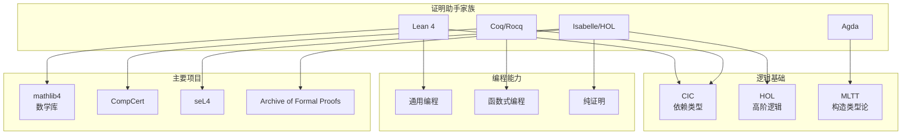
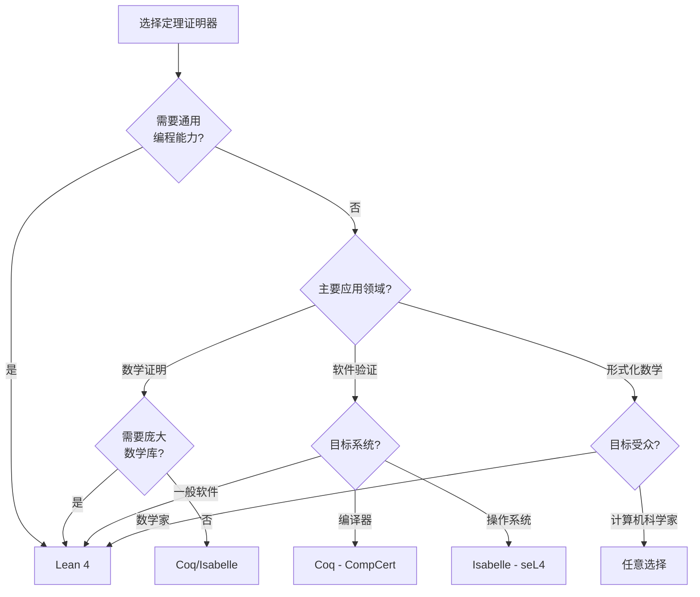
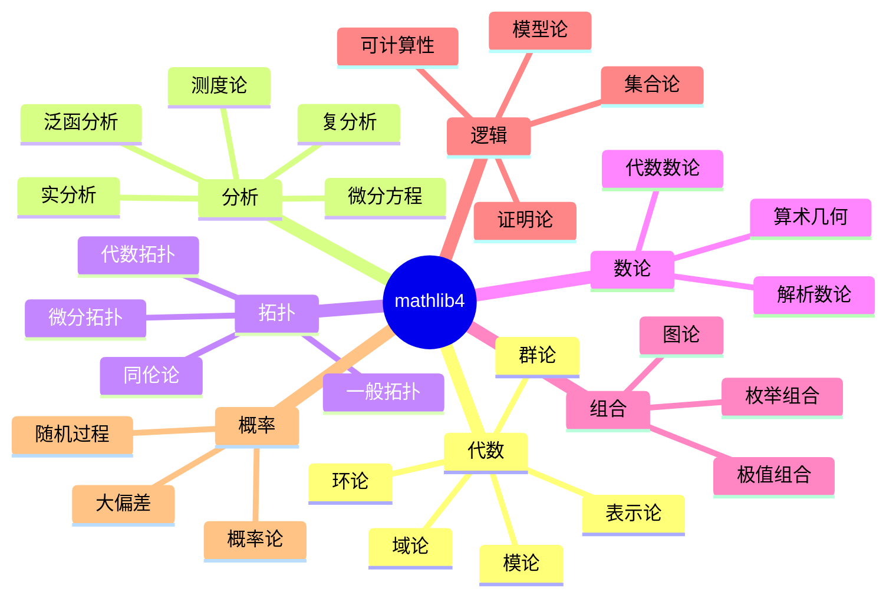
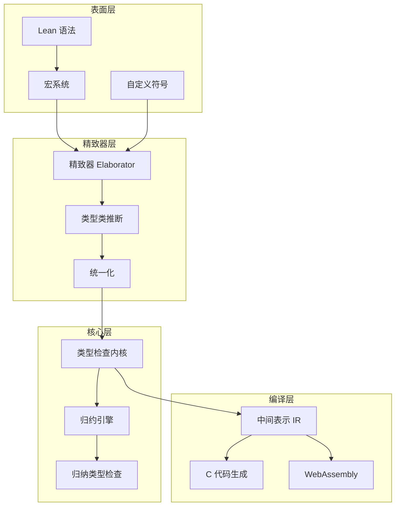
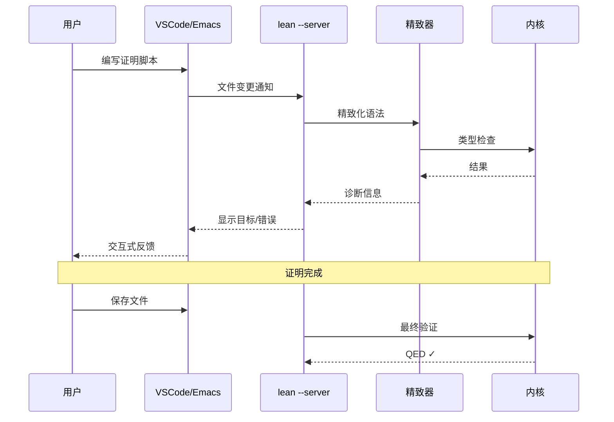
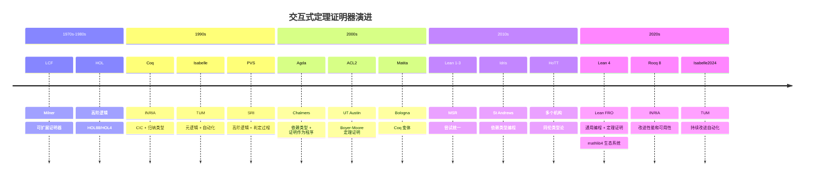
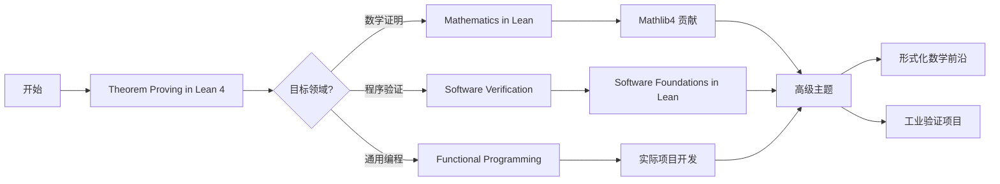

# Lean 4 定理证明器

> **所属单元**: Verification/Theorem-Proving | **前置依赖**: [Coq/Isabelle](01-coq-isabelle.md) | **形式化等级**: L6
>
> **版本**: v1.0 | **创建日期**: 2026-04-10

---

## 1. 概念定义 (Definitions)

### 1.1 Lean 4 基础架构

**Def-V-07-07** (Lean 4 系统架构). Lean 4 是一个基于依赖类型论的定理证明器和通用编程语言，其核心架构为：

$$\text{Lean 4} = \langle \mathcal{L}_{\text{core}}, \mathcal{T}_{\text{elaborator}}, \mathcal{C}_{\text{compiler}}, \mathcal{E}_{\text{extensible}} \rangle$$

其中：

- $\mathcal{L}_{\text{core}}$: 核心逻辑（依赖类型论 + 归纳类型）
- $\mathcal{T}_{\text{elaborator}}$: 精致器（将表面语法转换为核心项）
- $\mathcal{C}_{\text{compiler}}$: 编译器（支持 JIT 编译到 C 和 WebAssembly）
- $\mathcal{E}_{\text{extensible}}$: 可扩展宏系统和元编程框架

**Def-V-07-08** (依赖类型). 依赖类型是类型可依赖于值的类型系统，允许表达丰富的程序规范：

$$\Pi x: A. B(x) \quad \text{和} \quad \Sigma x: A. B(x)$$

- **依赖函数类型** $\Pi x: A. B(x)$: 返回类型 $B$ 可依赖于输入值 $x$
- **依赖对类型** $\Sigma x: A. B(x)$: 第二分量类型可依赖于第一分量的值

**Lean 4 语法示例**:

```lean
-- 依赖函数类型: 向量长度在类型中编码
def head {n : Nat} (v : Vector α (n+1)) : α := v[0]

-- 依赖对类型: 长度与向量绑定
def nonzeroVector := Σ n : Nat, Vector α (n+1)
```

**Def-V-07-09** (类型宇宙层级). Lean 4 采用累积式类型宇宙层级避免罗素悖论：

$$\text{Type}_0 : \text{Type}_1 : \text{Type}_2 : \cdots \quad \text{或简写为} \quad \text{Type} : \text{Type}_1 : \text{Type}_2$$

其中 $\text{Sort}$ 是最低层级（包含 $\text{Prop}$），$\text{Prop}$ 是证明无关的命题宇宙。

### 1.2 Lean 4 逻辑基础

**Def-V-07-10** (归纳构造演算 CIC). Lean 4 基于归纳构造演算 (Calculus of Inductive Constructions)：

$$\text{CIC} = \lambda\text{-演算} + \text{依赖类型} + \text{归纳类型} + \text{宇宙多态}$$

**Def-V-07-11** (归纳类型定义). 归纳类型通过构造子定义，Lean 4 自动派生归纳原理：

```lean
inductive Nat where
  | zero : Nat
  | succ (n : Nat) : Nat

-- 自动派生的归纳原理:
-- Nat.rec : {motive : Nat → Sort u} → motive 0 → ((n : Nat) → motive n → motive (succ n)) → (t : Nat) → motive t
```

**Def-V-07-12** (类型类机制). Lean 4 的类型类 (Type Class) 提供 Haskell 风格的 ad-hoc 多态：

```lean
class Monoid (α : Type u) where
  mul : α → α → α
  one : α
  mul_assoc : ∀ a b c, mul (mul a b) c = mul a (mul b c)
  one_mul : ∀ a, mul one a = a
  mul_one : ∀ a, mul a one = a
```

---

## 2. 属性推导 (Properties)

### 2.1 类型系统性质

**Lemma-V-07-04** (强规范化). CIC 中良类型项都是强规范化的：

$$\Gamma \vdash t : T \Rightarrow \exists t_{\text{nf}}: t \to^* t_{\text{nf}} \land t_{\text{nf}} \text{ 不可再规约}$$

*证明概要*. Lean 4 的核心逻辑基于 CIC，其强规范化性质通过可访问性 (accessibility) 和正归纳类型约束保证。∎

**Lemma-V-07-05** (类型保持/主题归约). 规约保持类型：

$$\Gamma \vdash t : T \land t \to t' \Rightarrow \Gamma \vdash t' : T$$

**Lemma-V-07-06** (一致性). Lean 4 的逻辑是一致的（假设无矛盾公理）：

$$\not\vdash \text{False}$$

### 2.2 证明相关性质

**Lemma-V-07-07** (证明无关性). 对于命题类型 (Prop)，证明项在计算上不可区分：

$$p : P, q : P \vdash p \equiv q \quad \text{(在} \text{Prop}\text{中)}$$

这允许在运行时擦除证明项，提高效率。

**Prop-V-07-01** (可扩展性). Lean 4 的宏系统和元编程能力使其在表达力和自动化方面优于传统证明器。

*论证*. Lean 4 允许使用 `macro`、`elab` 和 `simp` 等机制自定义语法和自动化策略，其元编程语言与对象语言统一。∎

---

## 3. 关系建立 (Relations)

### 3.1 Lean 4 vs Coq vs Isabelle 对比



| 特性 | Lean 4 | Coq/Rocq | Isabelle/HOL |
|------|--------|----------|--------------|
| **逻辑基础** | CIC + 宇宙多态 | CIC + 归纳类型 | 经典 HOL + 类型类 |
| **编程能力** | ★★★★★ 通用编程 | ★★★☆☆ 提取代码 | ★★☆☆☆ 纯证明 |
| **自动化** | ★★★★☆ `simp`, `aesop` | ★★★★☆ `auto`, `tac` | ★★★★★ Sledgehammer |
| **数学库** | ★★★★★ mathlib4 | ★★★☆☆ MathComp | ★★★★☆ AFP |
| **性能** | ★★★★★ 编译到 C | ★★★☆☆ 解释执行 | ★★★☆☆ 解释执行 |
| **工业应用** | 增长中 | 编译器验证 | 操作系统验证 |

### 3.2 Lean 4 独特优势

**1. 元编程统一**:

```lean
-- 宏定义示例：自定义 if-then-else 语法
macro "if_" cond:term "then_" t:term "else_" e:term : term =>
  `(if $cond then $t else $e)
```

**2. 类型类推断**:

- 更强大的类型类解析算法
- 支持高阶类型类
- 与数学结构自然映射

**3. 编译器架构**:

- 自托管编译器
- 支持编译到 C 和 WebAssembly
- 运行时效率接近 C

---

## 4. 论证过程 (Argumentation)

### 4.1 Lean 4 适用场景决策树



### 4.2 Mathlib4 生态系统



**Mathlib4 统计** (2025):

- 代码行数: 1,500,000+ 行
- 定理数量: 150,000+ 个
- 定义数量: 30,000+ 个
- 贡献者: 400+ 人

---

## 5. 形式证明 / 工程论证 (Proof / Engineering Argument)

### 5.1 Liquid Tensor Experiment

**Thm-V-07-03** (Liquid Tensor = Liquid Tensor). Peter Scholze 提出的液完美体 (liquid tensor product) 的平坦性猜想，于 2022 年在 Lean 4 中完成形式化证明。

*证明规模*:

- 证明行数: ~30,000 行
- 依赖定理: 数千个 (基于 mathlib4)
- 验证时间: ~30 分钟
- 核心贡献: Johan Commelin, Adam Topaz, Patrick Massot 等

**意义**: 这是现代纯数学复杂结果首次被完整形式化，证明了 Lean 4 处理前沿数学的能力。

### 5.2 Fermat 大定理形式化项目

Kevin Buzzard 领导的 Fermat's Last Theorem for Exponent 3 及更高指数的形式化正在进行中，计划使用 Lean 4 完成完整证明。

### 5.3 工业验证应用

**定理证明模式**:

```
┌─────────────────────────────────────────────────────────────┐
│                    Lean 4 验证工作流                          │
├─────────────────────────────────────────────────────────────┤
│  1. 需求形式化 → 使用依赖类型编码规约                         │
│  2. 实现定义   → 函数式编程实现算法                           │
│  3. 性质陈述   → 定理声明正确性性质                           │
│  4. 证明开发   → 结构化证明脚本 (tactics)                    │
│  5. 代码提取   → 编译为高效可执行代码                         │
│  6. 持续验证   → CI/CD 中集成证明检查                         │
└─────────────────────────────────────────────────────────────┘
```

---

## 6. 实例验证 (Examples)

### 6.1 基本证明示例

**自然数加法结合律**:

```lean
-- 定义自然数 (使用 Lean 4 内置定义)
-- inductive Nat
--   | zero
--   | succ (n : Nat)

-- 加法定义
namespace Tutorial

open Nat

def add : Nat → Nat → Nat
  | a, zero   => a
  | a, succ b => succ (add a b)

-- 证明: 加法结合律
theorem add_assoc (a b c : Nat) : add (add a b) c = add a (add b c) := by
  induction c with
  | zero =>
    -- 基础情况: c = 0
    rfl
  | succ c ih =>
    -- 归纳步骤: 假设对 c 成立，证明对 succ c 成立
    calc add (add a b) (succ c)
      _ = succ (add (add a b) c) := rfl
      _ = succ (add a (add b c)) := by rw [ih]
      _ = add a (succ (add b c)) := rfl
      _ = add a (add b (succ c)) := rfl

-- 证明: 加法零元
theorem add_zero (a : Nat) : add a zero = a := rfl

theorem zero_add (a : Nat) : add zero a = a := by
  induction a with
  | zero => rfl
  | succ a ih =>
    calc add zero (succ a)
      _ = succ (add zero a) := rfl
      _ = succ a            := by rw [ih]

end Tutorial
```

### 6.2 数据结构验证

**有序二叉搜索树**:

```lean
inductive BST (α : Type) [Ord α] where
  | empty
  | node (left : BST α) (value : α) (right : BST α)

def BST.all (p : α → Bool) : BST α → Bool
  | empty => true
  | node l v r => all p l && p v && all p r

def BST.allLt [Ord α] (t : BST α) (x : α) : Bool :=
  t.all (fun v => (compare v x).isLT)

def BST.allGt [Ord α] (t : BST α) (x : α) : Bool :=
  t.all (fun v => (compare v x).isGT)

-- 有序性不变量
def BST.Ordered [Ord α] : BST α → Prop
  | empty => True
  | node l v r => Ordered l ∧ Ordered r ∧ l.allLt v ∧ r.allGt v

-- 插入保持有序性
theorem BST.insert_ordered [Ord α] (t : BST α) (x : α)
    (h : t.Ordered) : (t.insert x).Ordered := by
  -- 证明省略: 使用归纳法和有序性定义
  sorry
```

### 6.3 算法正确性证明

**快速排序正确性**:

```lean
def quicksort [Ord α] : List α → List α
  | [] => []
  | p :: xs =>
    let smaller := xs.filter (fun x => (compare x p).isLT)
    let larger  := xs.filter (fun x => (compare x p).isGE)
    quicksort smaller ++ [p] ++ quicksort larger

-- 正确性性质 1: 输出是排序的
def List.Sorted [Ord α] : List α → Prop
  | [] | [_] => True
  | x :: y :: xs => (compare x y).isLE ∧ Sorted (y :: xs)

theorem quicksort_sorted [Ord α] (l : List α) : (quicksort l).Sorted := by
  -- 使用 well-founded induction
  induction l using quicksort.induct with
  | case1 => simp [quicksort]
  | case2 p xs ih_smaller ih_larger =>
    simp [quicksort]
    -- 需要证明: 合并后的列表有序
    sorry

-- 正确性性质 2: 输出是输入的排列
theorem quicksort_perm [Ord α] (l : List α) : quicksort l ~ l := by
  -- 证明输出与输入是排列关系
  sorry
```

### 6.4 Mathlib4 使用示例

**拓扑空间中的连续性**:

```lean
import Mathlib.Topology.Basic
import Mathlib.Topology.ContinuousFunction

-- 使用 mathlib4 定义连续函数
example {X Y : Type} [TopologicalSpace X] [TopologicalSpace Y]
    (f : X → Y) : Continuous f ↔
    ∀ s, IsOpen s → IsOpen (f ⁻¹' s) := by
  rfl  -- mathlib4 中 Continuous 的定义就是如此

-- 证明复合函数的连续性
theorem continuous_comp {X Y Z : Type} [TopologicalSpace X] [TopologicalSpace Y]
    [TopologicalSpace Z] {f : X → Y} {g : Y → Z}
    (hf : Continuous f) (hg : Continuous g) : Continuous (g ∘ f) := by
  exact Continuous.comp hg hf
```

---

## 7. 可视化 (Visualizations)

### 7.1 Lean 4 系统架构



### 7.2 Lean 4 证明开发流程



### 7.3 定理证明器演进时间线



---

## 8. 最新研究进展 (2024-2025)

### 8.1 Lean 4 核心更新

| 版本 | 发布日期 | 关键特性 |
|------|---------|---------|
| **Lean 4.8** | 2024-06 | 改进的 `simp` 引擎，更好的错误消息 |
| **Lean 4.9** | 2024-08 | 原生 `do` 记法优化，改进的编译器 |
| **Lean 4.10** | 2024-10 | 改进的宇宙多态，新的 `rw` 策略 |
| **Lean 4.11** | 2024-12 | 增量证明检查，改进的 IDE 支持 |
| **Lean 4.12** | 2025-02 | 优化的内存使用，更快的类型检查 |

### 8.2 重要形式化项目

| 项目 | 领域 | 状态 | 规模 |
|------|------|------|------|
| **Liquid Tensor** | 代数几何 | ✅ 完成 (2022) | 30,000 行 |
| **Fermat (n=3)** | 数论 | ✅ 完成 | 数千行 |
| **Prime Number Theorem** | 解析数论 | ✅ 完成 | 基于 mathlib4 |
| **Polynomial Freiman-Ruzsa** | 加法组合 | ✅ 完成 (2023) | Terence Tao 参与 |
| **Fermat's Last Theorem** | 数论 | 🚧 进行中 | 多年项目 |

### 8.3 AI 辅助 Lean 证明

- **LeanDojo**: 用于神经定理证明的 Lean 环境
- **llm-step**: LLM 辅助证明建议
- **Copra**: 上下文感知证明策略 (ICLR 2024)
- **ReProver**: 检索增强的神经证明器

---

## 9. 学习资源

### 9.1 官方资源

| 资源 | 链接 | 描述 |
|------|------|------|
| **Theorem Proving in Lean 4** | <https://leanprover.github.io/theorem_proving_in_lean4/> | 官方入门教程 |
| **Functional Programming in Lean** | <https://leanprover.github.io/functional_programming_in_lean/> | 函数式编程视角 |
| **Metaprogramming in Lean 4** | <https://leanprover-community.github.io/lean4-metaprogramming-book/> | 元编程指南 |
| **Mathlib4 Documentation** | <https://leanprover-community.github.io/mathlib4_docs/> | 数学库文档 |

### 9.2 社区与学习路径



---

## 10. 引用参考


---

> **相关文档**: [Coq/Isabelle](01-coq-isabelle.md) | [SMT求解器](02-smt-solvers.md) | [AI形式化方法](../../08-ai-formal-methods/) | [mathlib4](https://leanprover-community.github.io/)
>
> **外部链接**: [Lean 4 官网](https://lean-lang.org/) | [Lean FRO](https://lean-fro.org/) | [leanprover-community](https://leanprover-community.github.io/)
