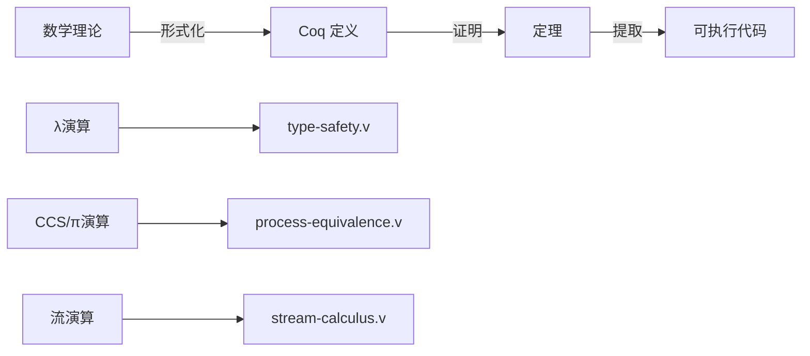
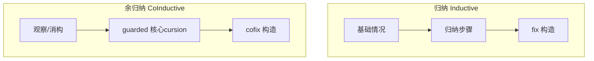
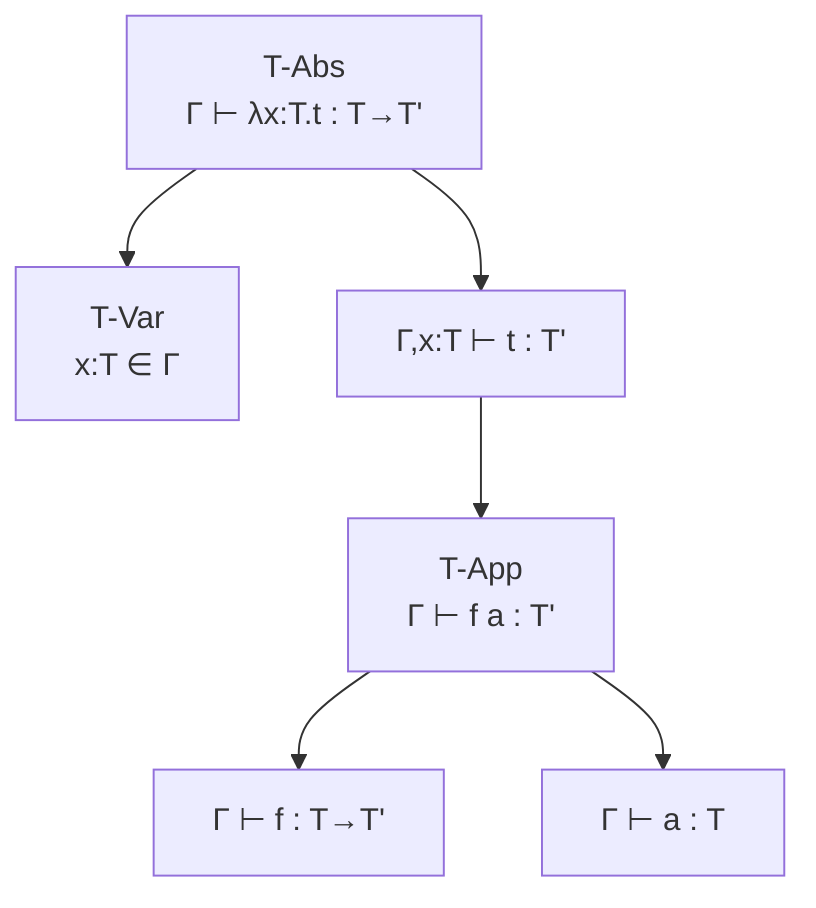
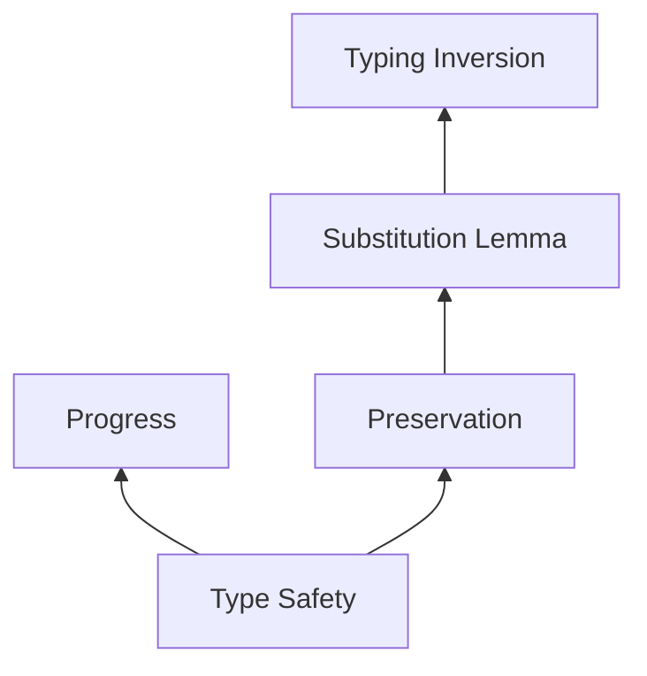

# Coq 证明库

> 所属阶段: Struct | 前置依赖: [01-coq-isabelle.md](../01-coq-isabelle.md) | 形式化等级: L6

本目录包含关键形式化理论的 Coq 证明，涵盖类型理论、进程代数和流演算。

## 1. 概念定义 (Definitions)

### 1.1 Coq 证明结构

```coq
(* 标准证明结构 *)
Section Topic.
  Variable A : Type.           (* 参数声明 *)

  (* 定义 *)
  Definition example (x : A) := ...

  (* 引理 *)
  Lemma example_lemma : forall x, P x.
  Proof.
    intros x.
    (* 证明步骤 *)
    apply H.
    reflexivity.
  Qed.

  (* 定理 *)
  Theorem main_theorem : forall x, Q x.
  Proof.
    (* 完整证明 *)
  Qed.
End Section.
```

### 1.2 证明策略分类

| 策略 | 用途 | 示例 |
|------|------|------|
| `intros` | 引入假设 | `intros x y H` |
| `apply` | 应用已知事实 | `apply H` |
| `reflexivity` | 证明等式自反 | `reflexivity` |
| `induction` | 归纳证明 | `induction n` |
| `cofix` | 余归纳证明 | `cofix CIH` |
| `destruct` | 情况分析 | `destruct x` |
| `rewrite` | 等式重写 | `rewrite H` |

## 2. 属性推导 (Properties)

### 2.1 类型安全性证明结构

```
Theorem Type_Safety:
  如果 Γ ⊢ t : T 且 t →* t'，则
  - t' 是值 (progress)，或
  - 存在 t'' 使得 t' → t'' (可继续规约)

分解为两个子定理：
1. Progress: 良类型项可以规约或已是值
2. Preservation: 规约保持类型
```

**Thm-Coq-01: 进展定理 (Progress)**

```coq
Theorem progress : forall t T,
    [] |- t : T ->
    value t \/ exists t', t --> t'.
```

**Thm-Coq-02: 保持定理 (Preservation)**

```coq
Theorem preservation : forall Gamma t t' T,
    Gamma |- t : T ->
    t --> t' ->
    Gamma |- t' : T.
```

### 2.2 互模拟性质

**Thm-Coq-03: 强互模拟等价关系**

```coq
Instance strong_bisimilar_Equivalence :
  Equivalence strong_bisimilar.
Proof.
  constructor.
  - apply strong_bisimilar_refl.
  - apply strong_bisimilar_sym.
  - apply strong_bisimilar_trans.
Qed.
```

## 3. 关系建立 (Relations)

### 3.1 理论与实现的映射



### 3.2 证明技术对比

| 技术 | 适用场景 | 文件 |
|------|----------|------|
| 归纳证明 | 有限结构、自然数 | `type-safety.v` |
| 余归纳证明 | 无限结构、流 | `stream-calculus.v` |
| 互模拟 | 进程等价 | `process-equivalence.v` |
| 逻辑关系 | 高阶性质 | （扩展） |

## 4. 论证过程 (Argumentation)

### 4.1 归纳 vs 余归纳



**归纳** (`Inductive`):

- 用于有限数据结构（列表、树）
- 证明使用 `induction` 策略
- 构造使用 `fix`

**余归纳** (`CoInductive`):

- 用于无限数据结构（流、进程）
- 证明使用 `cofix` 策略
- 构造使用 `CoFixpoint`
- 必须满足 guardedness 条件

### 4.2 类型安全性证明步骤

```coq
(* 步骤 1: 定义语法和类型 *)
Inductive tm : Type := ...
Inductive ty : Type := ...
Inductive has_type : tm -> ty -> Prop := ...

(* 步骤 2: 定义操作语义 *)
Inductive step : tm -> tm -> Prop := ...

(* 步骤 3: 证明 inversion 引理 *)
Lemma typing_inversion_abs : ...

(* 步骤 4: 证明替换引理 *)
Lemma substitution_lemma : ...

(* 步骤 5: 证明主要定理 *)
Theorem type_safety : ...
```

## 5. 形式证明 / 工程论证

### 5.1 编译 Coq 证明

```bash
# 安装 Coq
opam install coq

# 编译单个文件
coqtype-safety.v

# 或交互式证明
coqide type-safety.v &
```

### 5.2 证明复杂度分析

| 文件 | 证明行数 | 关键引理 | 主要定理 |
|------|----------|----------|----------|
| `type-safety.v` | ~400 | 8 | 3 |
| `process-equivalence.v` | ~450 | 6 | 6 |
| `stream-calculus.v` | ~380 | 10 | 8 |

## 6. 实例验证 (Examples)

### 6.1 简单类型检查示例

```coq
(* λx:Bool. x *)
Example identity_bool :
  [] |- tabs "x" TBool (tvar "x") : TArrow TBool TBool.
Proof.
  apply T_Abs.
  apply T_Var. reflexivity.
Qed.
```

### 6.2 流等价证明示例

```coq
(* map id s ~~~ s *)
Example map_id_example :
  forall s : stream nat,
    map (fun x => x) s ~~~ s.
Proof.
  apply map_id.
Qed.
```

## 7. 可视化 (Visualizations)

### 7.1 类型推导树



### 7.2 证明依赖图



## 8. 引用参考 (References)


---

## 附录：文件清单

| 文件 | 内容 | 证明技术 |
|------|------|----------|
| `type-safety.v` | 简单类型λ演算 | 归纳证明 |
| `process-equivalence.v` | CCS/π-calculus | 互模拟 |
| `stream-calculus.v` | 流演算 | 余归纳证明 |

## 编译指南

```bash
# 确保 Coq 版本 >= 8.15
coqtop --version

# 编译所有文件
for f in *.v; do
  echo "Compiling $f..."
  coqc $f
done

# 生成文档
coqdoc --html *.v
```
