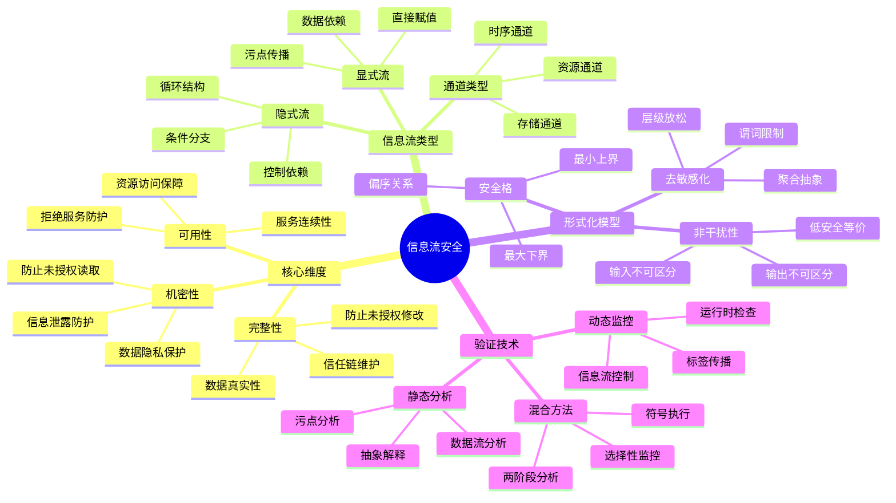
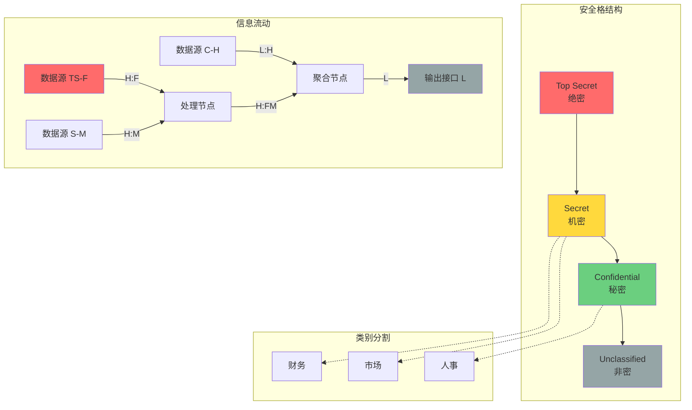

# 信息流安全 (Information Flow Security)

> **所属阶段**: Struct/ Verification/ Security
> **前置依赖**: [形式语义基础](../01-foundations/01-formal-semantics.md), [类型系统理论](../../03-type-systems/01-type-foundations.md)
> **形式化等级**: L5 - 严格形式化，包含完整定理与证明
> **最后更新**: 2026-04-10

---

## 1. 概念定义 (Definitions)

### 1.1 信息流安全概述

**信息流安全 (Information Flow Security)** 是研究信息在系统中如何流动的安全性学科，确保敏感信息不会非法泄露给非授权主体。

> **Def-S-05-01-01** [信息流安全]: 设系统状态为 $\Sigma$，信息标签为 $\mathcal{L}$，安全策略为 $P \subseteq \mathcal{L} \times \mathcal{L}$。系统满足信息流安全当且仅当对所有状态转换 $\sigma \xrightarrow{a} \sigma'$，信息的流动 $(\ell_1, \ell_2)$ 满足 $(\ell_1, \ell_2) \in P$。

信息流安全的核心问题是：**谁可以知道什么？** (Who can know what?)

**三个基本维度**:

| 维度 | 核心问题 | 攻击目标 |
|------|----------|----------|
| **机密性 (Confidentiality)** | 防止未授权读取 | 信息泄露 |
| **完整性 (Integrity)** | 防止未授权修改 | 数据篡改 |
| **可用性 (Availability)** | 确保授权访问 | 拒绝服务 |

### 1.2 机密性、完整性、可用性

#### 1.2.1 机密性 (Confidentiality)

> **Def-S-05-01-02** [机密性]: 系统 $S$ 满足机密性策略 $C$，当且仅当对任意输入序列 $I$ 和 $I'$，若 $I$ 和 $I'$ 在低安全级别观察下不可区分，则系统输出 $S(I)$ 和 $S(I')$ 在低安全级别观察下也不可区分：
> $$I \sim_L I' \implies S(I) \sim_L S(I')$$

**机密性层次**:

- **完全机密性**: 高安全信息绝不流向低安全级别
- **受限机密性**: 允许经过审计的、去敏感化的信息流动
- **差分机密性**: 量化信息泄露程度

#### 1.2.2 完整性 (Integrity)

> **Def-S-05-01-03** [完整性]: 系统 $S$ 满足完整性策略 $\mathcal{I}$，当且仅当对任意输入 $I$，输出 $S(I)$ 的完整性标签不低于根据策略计算的预期值：
> $$\forall o \in S(I): \mathcal{L}_{int}(o) \sqsupseteq \bigsqcup_{i \in I} \mathcal{L}_{int}(i) \otimes \mathcal{I}$$

其中 $\otimes$ 表示策略组合算子，$\sqsupseteq$ 是完整性格上的偏序。

#### 1.2.3 可用性 (Availability)

> **Def-S-05-01-04** [可用性]: 系统 $S$ 满足可用性策略 $\mathcal{A}$，当且仅当对授权主体 $s$ 和资源 $r$，访问请求在时限 $t$ 内得到响应的概率不低于阈值 $\theta$：
> $$\Pr[\text{response}(s, r) \leq t \mid \text{authorized}(s, r)] \geq \theta$$

### 1.3 显式流与隐式流

信息流可分为两大类：

#### 1.3.1 显式流 (Explicit Flow)

> **Def-S-05-01-05** [显式流]: 信息通过直接的赋值操作从高安全级别变量流向低安全级别变量的流动方式。形式上，赋值语句 $x_L := e_H$ 产生从 $e_H$ 的标签到 $x_L$ 的显式流。

**特征**:

- 直接的数据依赖
- 可通过简单的污点分析检测
- 示例: `public = secret + 1`

#### 1.3.2 隐式流 (Implicit Flow)

> **Def-S-05-01-06** [隐式流]: 信息通过控制流结构（条件分支、循环）从高安全级别流向低安全级别的间接流动方式。

**特征**:

- 通过程序控制结构传递信息
- 需要更复杂的程序分析
- 示例:

```python
if secret > 0:      # secret 是高安全级别
    public = 1      # public 的值泄露了 secret 的符号
else:
    public = 0
```

### 1.4 通道类型

> **Def-S-05-01-07** [信息流通道]: 信息从高安全级别向低安全级别传输的媒介或路径。

**通道分类**:

| 通道类型 | 定义 | 示例 |
|----------|------|------|
| **存储通道 (Storage Channel)** | 通过共享存储位置传递信息 | 全局变量、文件系统 |
| **隐式通道 (Covert Channel)** | 违反安全策略的间接通信路径 | 时序通道、资源消耗通道 |
| **侧通道 (Side Channel)** | 非预期的信息泄露路径 | 缓存时序、功耗分析 |
| **下通道 (Downgrade Channel)** | 有意降低安全级别的通道 | 去敏感化、解密操作 |

**时序通道 (Timing Channel)**:

> **Def-S-05-01-08** [时序通道]: 通过程序执行时间差异泄露信息的通道。若程序 $P$ 的执行时间 $T(P, H)$ 依赖于高安全输入 $H$，则形成时序通道。

**容量计算**: 时序通道的容量为：
$$C = \max_{p(x)} I(X; T)$$
其中 $I(X; T)$ 是输入 $X$ 和观测时间 $T$ 之间的互信息。

---

## 2. 形式化模型 (Formal Models)

### 2.1 信息流策略

> **Def-S-05-02-01** [信息流策略]: 安全标签集合 $(\mathcal{L}, \sqsubseteq)$ 上定义的二元关系 $P \subseteq \mathcal{L} \times \mathcal{L}$，满足自反性和传递性。

**策略类型**:

1. **多级安全 (MLS - Multi-Level Security)**:
   $$\mathcal{L}_{MLS} = \{C, S, T, U\} \times \{1, 2, ..., n\}$$
   - 分类 (Compartment): C (绝密), S (机密), T (秘密), U (非密)
   - 类别 (Category): 集合表示的need-to-know信息

2. **自主访问控制 (DAC - Discretionary Access Control)**:
   - 基于主体/客体的访问矩阵
   - 所有者决定访问权限

3. **强制访问控制 (MAC - Mandatory Access Control)**:
   - 系统强制执行的统一策略
   - 主体和客体都有固定安全标签

### 2.2 安全格模型

> **Def-S-05-02-02** [安全格]: 安全标签集合 $(\mathcal{L}, \sqsubseteq, \sqcup, \sqcap, \top, \bot)$ 构成完全格，其中：
>
> - $\sqsubseteq$: 安全级别偏序（"可以流向"）
> - $\sqcup$: 最小上界（标签组合）
> - $\sqcap$: 最大下界
> - $\top$: 最高安全级别
> - $\bot$: 最低安全级别

**格公理**:

| 公理 | 性质 |
|------|------|
| 自反性 | $\forall \ell: \ell \sqsubseteq \ell$ |
| 反对称 | $\ell_1 \sqsubseteq \ell_2 \land \ell_2 \sqsubseteq \ell_1 \implies \ell_1 = \ell_2$ |
| 传递性 | $\ell_1 \sqsubseteq \ell_2 \land \ell_2 \sqsubseteq \ell_3 \implies \ell_1 \sqsubseteq \ell_3$ |
| 最小上界 | $\ell_1 \sqsubseteq \ell_1 \sqcup \ell_2 \land \ell_2 \sqsubseteq \ell_1 \sqcup \ell_2$ |
| 最大下界 | $\ell_1 \sqcap \ell_2 \sqsubseteq \ell_1 \land \ell_1 \sqcap \ell_2 \sqsubseteq \ell_2$ |

**常见安全格示例**:

```
绝密(TS)
   │
机密(S) ─── 财务(F) ─── 人事(H)
   │           │           │
秘密(C)       └───────────┘
   │
公开(U)
```

### 2.3 非干扰性 (Non-interference)

> **Def-S-05-02-03** [非干扰性]: Goguen和Meseguer定义的安全属性，要求高安全输入 $H$ 对低安全输出 $L$ 没有影响。

> **Def-S-05-02-04** [严格非干扰性]: 系统 $S$ 满足严格非干扰性，当且仅当：
> $$\forall I_1, I_2 \in \mathcal{I}: I_1|_L = I_2|_L \implies S(I_1)|_L = S(I_2)|_L$$

其中 $I|_L$ 表示输入 $I$ 的低安全部分，$S(I)|_L$ 表示输出的低安全部分。

**非干扰性的变体**:

| 变体 | 定义 | 适用场景 |
|------|------|----------|
| **完美非干扰性** | 完全阻止任何信息流 | 最高安全级别 |
| **近似非干扰性** | 允许量化的小量泄露 | 实用系统 |
| **渐进非干扰性** | 有限步内保持非干扰 | 终止性分析 |
| **概率非干扰性** | 概率意义上不可区分 | 随机化系统 |

**引理-S-05-02-01** [非干扰性的组合性]: 若组件 $C_1$ 和 $C_2$ 都满足非干扰性，则它们的顺序组合 $C_1; C_2$ 和并行组合 $C_1 \parallel C_2$ 也满足非干扰性。

*证明概要*: 设 $C_1$ 和 $C_2$ 满足非干扰性。对任意输入 $I, I'$ 满足 $I|_L = I'|_L$:

1. 顺序组合: $C_1(I)|_L = C_1(I')|_L$ (由 $C_1$ 的非干扰性)。设 $O_1 = C_1(I)$，则 $C_2(O_1)|_L = C_2(O_1')|_L$ (由 $C_2$ 的非干扰性，因为 $O_1|_L = O_1'|_L$)。

2. 并行组合: $(C_1 \parallel C_2)(I)|_L = (C_1(I)|_L, C_2(I)|_L) = (C_1(I')|_L, C_2(I')|_L) = (C_1 \parallel C_2)(I')|_L$。

∎

### 2.4 去敏感化 (Declassification)

> **Def-S-05-02-05** [去敏感化]: 有意地将信息从高安全级别流向低安全级别的操作，通常用于释放经过处理或聚合后的信息。

**去敏感化策略**:

| 策略 | 描述 | 形式化 |
|------|------|--------|
| **层级放松** | 降低信息的安全标签 | $\mathsf{declassify}(x_H) = x_L$ |
| **谓词限制** | 仅当满足条件时释放 | $\mathsf{declassify}_\phi(x) = x_L \text{ if } \phi(x)$ |
| **维度降级** | 降低特定维度的敏感度 | $\mathsf{dim\_down}(x, d) = x[\ell_d \mapsto \ell'_d]$ |
| **聚合抽象** | 仅释放汇总信息 | $\mathsf{aggregate}(S) = f(S)$ |

> **Def-S-05-02-06** [语义一致性]: 去敏感化操作是语义一致的，当且仅当低安全级别的观察者无法区分原始程序与去敏感化后的程序。

**引理-S-05-02-02** [去敏感化的边界]: 若去敏感化操作 $\delta$ 满足 $|\delta(H) - \delta(H')| \leq \epsilon$ 对所有 $H, H'$ 成立，则泄露的信息量有界：
$$I(H; \delta(H)) \leq \log_2 \frac{|\mathcal{H}|}{\epsilon}$$

---

## 3. 类型系统 (Type Systems)

### 3.1 信息流类型

> **Def-S-05-03-01** [安全类型]: 变量或表达式的类型包含两部分：数据类型 $T$ 和安全标签 $\ell$，记为 $\tau = T_\ell$。

**类型语法**:
$$\tau ::= \text{int}_\ell \mid \text{bool}_\ell \mid \text{ref}_\ell(\tau) \mid \tau_1 \xrightarrow{\ell} \tau_2$$

**安全标签操作**:

| 操作 | 符号 | 含义 |
|------|------|------|
| 标签读取 | $\mathcal{L}(\tau)$ | 提取类型的安全标签 |
| 标签提升 | $\tau^{\uparrow \ell}$ | 将标签提升至 $\ell$ |
| 标签组合 | $\ell_1 \sqcup \ell_2$ | 最小上界 |
| 标签检查 | $\ell_1 \sqsubseteq \ell_2$ | 标签序关系 |

### 3.2 类型判断规则

核心语言语法:

```
e ::= n | x | e1 op e2 | !x | new e
c ::= skip | x := e | c1; c2 | if e then c1 else c2 | while e do c
```

**类型环境**:

> **Def-S-05-03-02** [类型环境]: 将变量映射到安全类型的函数 $\Gamma: \text{Var} \to \text{Type}$。

**表达式类型规则**:

$$
\frac{}{\Gamma \vdash n : \text{int}_\bot} \text{[T-Const]}
$$

$$
\frac{\Gamma(x) = \tau}{\Gamma \vdash x : \tau} \text{[T-Var]}
$$

$$
\frac{\Gamma \vdash e_1 : \text{int}_{\ell_1} \quad \Gamma \vdash e_2 : \text{int}_{\ell_2}}{\Gamma \vdash e_1 \text{ op } e_2 : \text{int}_{\ell_1 \sqcup \ell_2}} \text{[T-Op]}
$$

$$
\frac{\Gamma \vdash e : \tau_\ell}{\Gamma \vdash \text{new } e : \text{ref}_\ell(\tau_\ell)} \text{[T-New]}
$$

**命令类型规则**:

$$
\frac{}{\Gamma \vdash \text{skip} : \text{cmd}_\bot} \text{[T-Skip]}
$$

$$
\frac{\Gamma(x) = \tau_{\ell_x} \quad \Gamma \vdash e : \tau_{\ell_e} \quad \ell_e \sqsubseteq \ell_x}{\Gamma \vdash x := e : \text{cmd}_{\ell_e}} \text{[T-Assign]}
$$

$$
\frac{\Gamma \vdash c_1 : \text{cmd}_{\ell_1} \quad \Gamma \vdash c_2 : \text{cmd}_{\ell_2}}{\Gamma \vdash c_1; c_2 : \text{cmd}_{\ell_1 \sqcup \ell_2}} \text{[T-Seq]}
$$

$$
\frac{\Gamma \vdash e : \text{bool}_{\ell_e} \quad \Gamma \vdash c_1 : \text{cmd}_{\ell_1} \quad \Gamma \vdash c_2 : \text{cmd}_{\ell_2}}{\Gamma \vdash \text{if } e \text{ then } c_1 \text{ else } c_2 : \text{cmd}_{\ell_e \sqcup \ell_1 \sqcup \ell_2}} \text{[T-If]}
$$

$$
\frac{\Gamma \vdash e : \text{bool}_{\ell_e} \quad \Gamma \vdash c : \text{cmd}_{\ell_c}}{\Gamma \vdash \text{while } e \text{ do } c : \text{cmd}_{\ell_e \sqcup \ell_c}} \text{[T-While]}
$$

**PC标记规则** (处理隐式流):

$$
\frac{\Gamma, pc \sqcup \ell_e \vdash c_1 : \text{cmd}_{\ell_1} \quad \Gamma, pc \sqcup \ell_e \vdash c_2 : \text{cmd}_{\ell_2} \quad \Gamma \vdash e : \text{bool}_{\ell_e}}{\Gamma, pc \vdash \text{if } e \text{ then } c_1 \text{ else } c_2 : \text{cmd}_{pc \sqcup \ell_e \sqcup \ell_1 \sqcup \ell_2}} \text{[T-If-PC]}
$$

其中 $pc$ (program counter) 记录当前控制流的上下文安全级别。

### 3.3 类型安全定理

> **Thm-S-05-03-01** [信息流类型安全性]: 若 $\Gamma, pc \vdash c : \text{cmd}_\ell$ 且初始存储 $\sigma$ 满足 $\sigma \models \Gamma$，则执行 $c$ 不会导致非法信息流。

**引理-S-05-03-01** [类型保持性 / Subject Reduction]: 若 $\Gamma, pc \vdash c : \text{cmd}_\ell$，$\sigma \models \Gamma$，且 $\langle c, \sigma \rangle \to \langle c', \sigma' \rangle$，则存在 $\Gamma'$ 使得 $\Gamma', pc \vdash c' : \text{cmd}_{\ell'}$ 且 $\sigma' \models \Gamma'$，其中 $\ell' \sqsubseteq \ell$。

**引理-S-05-03-02** [进展性 / Progress]: 若 $\Gamma, pc \vdash c : \text{cmd}_\ell$ 且 $\sigma \models \Gamma$，则要么 $c = \text{skip}$，要么存在 $c', \sigma'$ 使得 $\langle c, \sigma \rangle \to \langle c', \sigma' \rangle$。

---

## 4. 验证技术 (Verification Techniques)

### 4.1 静态分析

静态分析在不执行程序的情况下检测信息流违规。

#### 4.1.1 污点分析 (Taint Analysis)

> **Def-S-05-04-01** [污点分析]: 跟踪从源点 (source) 到汇点 (sink) 的数据流，标记可能被污染的数据。

**分析步骤**:

1. **源点识别**: 标记所有敏感输入
   $$\text{Sources} = \{ \text{password\_input}, \text{secret\_key}, \text{private\_data} \}$$

2. **传播规则**: 定义污染的传播方式
   $$\text{tainted}(e_1 \text{ op } e_2) = \text{tainted}(e_1) \lor \text{tainted}(e_2)$$

3. **汇点检查**: 验证污染数据是否流向不安全位置
   $$\text{check}(x := e) = \neg(\text{tainted}(e) \land \text{sink}(x))$$

#### 4.1.2 数据流分析

> **Def-S-05-04-02** [信息流分析]: 计算程序点上变量的安全标签，检测标签违反。

**分析框架**:

| 组件 | 定义 |
|------|------|
| 域 | 安全标签格 $(\mathcal{L}, \sqsubseteq)$ |
| 方向 | 前向 (forward) 或后向 (backward) |
| 转移函数 | 根据语句类型更新标签 |
| 合并操作 | $\sqcup$ 或 $\sqcap$ |
| 边界条件 | 入口/出口标签初始化 |

**转移函数示例**:

```
F[x := e](in) = in[x ↦ ⊔{ℓ(v) | v ∈ fv(e)}]
F[if e then c1 else c2](in) = F[c2](F[c1](in ⊔ ℓ(e)))
```

#### 4.1.3 抽象解释

> **Def-S-05-04-03** [信息流抽象解释]: 将具体执行抽象到安全标签域，通过抽象执行验证安全属性。

**抽象域**:
$$\alpha: \mathcal{P}(\text{Values}) \to \mathcal{L}$$

**soundness条件**:
$$\forall S: S \subseteq \gamma(\alpha(S))$$

### 4.2 动态监控

动态监控在执行时跟踪信息流。

#### 4.2.1 标签传播系统

> **Def-S-05-04-04** [动态标签传播]: 运行时维护每个值的动态标签，在执行操作时传播标签。

**操作语义** (扩展):

$$
\frac{v_1 \text{ has label } \ell_1 \quad v_2 \text{ has label } \ell_2}{v_1 \oplus v_2 \text{ has label } \ell_1 \sqcup \ell_2}
$$

$$
\frac{c \text{ has label } \ell_c \quad \sigma \vdash e \Downarrow v_\ell}{\langle x := e, \sigma \rangle \to \langle \text{skip}, \sigma[x \mapsto v_{\ell_c \sqcup \ell}] \rangle}
$$

#### 4.2.2 信息流控制 (IFC - Information Flow Control)

> **Def-S-05-04-05** [运行时IFC]: 在运行时检查信息流操作，阻止非法流动。

**检查点**:

| 操作 | 检查条件 |
|------|----------|
| 赋值 | $\ell_{rhs} \sqsubseteq \ell_{lhs}$ |
| 分支进入 | $pc \gets pc \sqcup \ell_{cond}$ |
| 函数调用 | $\ell_{actual} \sqsubseteq \ell_{formal}$ |
| 输出 | $\ell_{data} \sqsubseteq \ell_{channel}$ |

**终止信道防护**:

> **Def-S-05-04-06** [无敏感升级]: 防止通过非终止性泄露信息的策略，要求循环条件不能依赖于高安全数据。

### 4.3 混合方法

结合静态分析和动态监控的优势。

#### 4.3.1 两阶段分析

**阶段1 - 静态**: 识别所有潜在信息流路径
**阶段2 - 动态**: 对高风险路径进行运行时验证

#### 4.3.2 选择性监控

> **Def-S-05-04-07** [选择性监控]: 仅对静态分析无法确定安全性的代码区域进行动态监控。

**策略**:

- 静态证明安全的代码: 无运行时开销
- 静态无法证明的代码: 完整监控
- 静态证明不安全的代码: 拒绝编译

#### 4.3.3 符号执行

> **Def-S-05-04-08** [符号信息流分析]: 使用符号执行探索所有可能的执行路径，验证每条路径上的信息流安全。

**路径条件积累**:
$$\phi_{path} = \bigwedge_{i} \text{condition}_i$$

**信息流查询**:
$$\text{SAT}(\phi_{path} \land \text{leak}(H, L)) = \text{UNSAT} \implies \text{safe}$$

---

## 5. 形式证明 (Formal Proofs)

### 5.1 非干扰性定理

> **Thm-S-05-05-01** [类型系统保证非干扰性]: 若程序 $P$ 在类型系统下可类型化（即 $\Gamma \vdash P : \text{cmd}_\ell$），则 $P$ 满足非干扰性。

**证明**:

我们需要证明: 若 $P$ 可类型化，则对所有低安全等价的状态 $\sigma_1 \sim_L \sigma_2$，执行后结果仍低安全等价。

**引理-S-05-05-01** [低安全等价保持]: 若 $\Gamma \vdash e : \tau_\ell$ 且 $\ell \sqsubseteq L$，则 $e$ 的值仅依赖于 $\sigma$ 的低安全部分。

*引理证明*: 对表达式结构进行归纳。

- **基本情况** (常量): 常量的值不依赖于任何状态，显然成立。
- **基本情况** (变量): 由 $\Gamma(x) = \tau_\ell$ 且 $\ell \sqsubseteq L$，知 $x$ 是低安全变量，其值由 $\sigma|_L$ 决定。
- **归纳步骤** (复合表达式): 由归纳假设，子表达式的值仅依赖于低安全状态。由于表达式的值是子表达式值的函数，结论成立。

∎

**主定理证明**:

对命令结构进行结构归纳。

**情况1** (赋值 $x := e$):

- 由类型规则 [T-Assign]，有 $\Gamma \vdash e : \tau_{\ell_e}$ 且 $\ell_e \sqsubseteq \ell_x$。
- 对任意 $\sigma_1 \sim_L \sigma_2$:
  - 若 $\ell_x \sqsubseteq L$: 由引理-S-05-05-01，$e$ 在 $\sigma_1$ 和 $\sigma_2$ 下的值相同。
  - 因此更新后的状态在 $x$ 处的值相同，保持低安全等价。
  - 若 $\ell_x \not\sqsubseteq L$: $x$ 不是低安全变量，不影响低安全等价性。

**情况2** (顺序组合 $c_1; c_2$):

- 由归纳假设，$c_1$ 保持低安全等价。
- 由归纳假设，$c_2$ 保持低安全等价。
- 因此 $c_1; c_2$ 保持低安全等价。

**情况3** (条件分支 if $e$ then $c_1$ else $c_2$):

- 由类型规则 [T-If]，$\Gamma \vdash e : \text{bool}_{\ell_e}$。
- 由引理-S-05-05-01，若 $\ell_e \sqsubseteq L$，则 $e$ 在 $\sigma_1$ 和 $\sigma_2$ 下的值相同，因此选择相同的分支。
- 由归纳假设，所选分支保持低安全等价。
- 若 $\ell_e \not\sqsubseteq L$，需要额外条件保证分支行为在低安全观察下不可区分。这是PC标记规则确保的：分支内的赋值目标必须有足够高的标签。

**情况4** (循环 while $e$ do $c$):

- 类似条件分支的论证，通过循环不变量归纳。

∎

### 5.2 类型安全性

> **Thm-S-05-05-02** [信息流类型系统的安全性]: 类型系统满足进步性 (progress) 和保持性 (preservation)，从而保证类型安全。

**证明结构**:

**进步性 (Progress)**:

对 $\Gamma, pc \vdash c : \text{cmd}_\ell$ 进行结构归纳。

- **skip**: 已经终止。
- **赋值**: 表达式求值（由表达式的进步性），然后执行更新。
- **顺序**: 由归纳假设，要么 $c_1 = \text{skip}$（可执行 $c_2$），要么 $c_1$ 可约简。
- **条件**: 表达式求值后，选择相应分支（由表达式的进步性）。
- **循环**: 表达式求值后，展开为条件执行或终止。

**保持性 (Preservation)**:

对推导 $\langle c, \sigma \rangle \to \langle c', \sigma' \rangle$ 进行规则归纳。

- **赋值规则**:

  ```
  <x := e, σ> → <skip, σ[x ↦ v]>
  ```

  由 $\Gamma \vdash e : \tau_{\ell_e}$ 和 $\ell_e \sqsubseteq \ell_x$，新的存储满足 $\sigma[x \mapsto v] \models \Gamma$。

- **顺序规则**:

  ```
  <c1, σ> → <c1', σ'>
  ─────────────────────
  <c1; c2, σ> → <c1'; c2, σ'>
  ```

  由归纳假设，存在 $\Gamma'$ 使得 $\Gamma', pc \vdash c_1' : \text{cmd}_{\ell_1'}$。由顺序组合规则，$\Gamma', pc \vdash c_1'; c_2 : \text{cmd}_{\ell_1' \sqcup \ell_2}$。

- **条件规则**: 类似论证。

∎

> **Cor-S-05-05-01** [无 stuck 状态]: 良类型的程序不会进入非终止的非法状态（不考虑无限循环）。

---

## 6. 案例研究 (Case Studies)

### 6.1 密码验证

考虑以下密码验证场景，分析其信息流安全性。

#### 6.1.1 不安全的实现

```python
# 不安全：时序通道泄露
# 标签: password_H (高), result_L (低)

def verify_password(input_password, stored_hash):
    if len(input_password) != len(stored_hash):
        return False                    # 早期返回泄露密码长度

    for i in range(len(input_password)):
        if input_password[i] != stored_hash[i]:
            return False                # 时序差异泄露不匹配位置
        # 额外的时序：匹配时继续，不匹配时提前返回

    return True
```

**漏洞分析**:

| 漏洞类型 | 泄露信息 | 攻击方式 |
|----------|----------|----------|
| 长度泄露 | 密码长度 | 时序测量 |
| 位置泄露 | 错误字符位置 | 逐字节暴力破解 |
| 时序通道 | 匹配前缀长度 | 统计时序分析 |

#### 6.1.2 安全的实现

```python
# 安全：常量时间比较
# 标签: password_H (高), result_L (低)

def secure_verify(input_password, stored_hash):
    # 首先检查长度，但使用填充使时序恒定
    len_match = (len(input_password) == len(stored_hash))

    # 使用虚拟操作平衡分支时序
    max_len = max(len(input_password), len(stored_hash))
    padded_input = input_password.ljust(max_len, '\x00')
    padded_hash = stored_hash.ljust(max_len, '\x00')

    # 常量时间比较
    result = 0
    for i in range(max_len):
        result |= ord(padded_input[i]) ^ ord(padded_hash[i])

    # 转换为布尔结果
    return (result == 0) and len_match
```

**安全分析**:

- **无早期返回**: 总是执行完整的循环
- **无分支依赖**: 循环内无数据依赖的分支
- **常数时序**: 执行时间与输入内容无关

**形式化验证**:

> **Prop-S-05-06-01** [常量时间比较的保密性]: 若比较操作 $compare(x, y)$ 满足 $\forall x_1, x_2, y: T(compare(x_1, y)) = T(compare(x_2, y))$，则不会通过时序通道泄露 $x$ 的信息。

### 6.2 访问控制

#### 6.2.1 基于标签的访问控制 (LBAC)

```python
# 基于格的访问控制系统
class LBACSystem:
    def __init__(self):
        self.labels = {
            'TOP': SecurityLabel(level=3),
            'SECRET': SecurityLabel(level=2),
            'CONFIDENTIAL': SecurityLabel(level=1),
            'PUBLIC': SecurityLabel(level=0, bottom=True)
        }

    def can_read(self, subject_label, object_label):
        """简单安全属性 (ss-property): 主体可以读取不高于自身级别的客体"""
        return object_label.level <= subject_label.level

    def can_write(self, subject_label, object_label):
        """*-属性: 主体只能写入不低于自身级别的客体"""
        return object_label.level >= subject_label.level

    def declassify(self, data, from_level, to_level, authority):
        """去敏感化操作，需要适当的权限"""
        if authority.can_declassify(from_level, to_level):
            return Data(data.content, label=to_level)
        raise SecurityViolation("Unauthorized declassification")
```

**BLP模型属性**:

| 属性 | 名称 | 规则 |
|------|------|------|
| ss-property | 简单安全属性 | 不读上 (no read up) |
| *-property | 星属性 | 不下写 (no write down) |
| ds-property | 自主安全属性 | 访问矩阵控制 |

#### 6.2.2 信息流策略实现

```python
class InformationFlowPolicy:
    """
    实现严格的信息流控制策略
    """

    def __init__(self, lattice):
        self.lattice = lattice
        self.pc_stack = [self.lattice.BOTTOM]  # 程序计数器标签栈

    def enter_branch(self, condition_label):
        """进入条件分支时提升PC标签"""
        current_pc = self.pc_stack[-1]
        new_pc = self.lattice.join(current_pc, condition_label)
        self.pc_stack.append(new_pc)
        return new_pc

    def exit_branch(self):
        """退出条件分支时恢复PC标签"""
        self.pc_stack.pop()
        return self.pc_stack[-1]

    def check_flow(self, source_label, sink_label):
        """
        检查信息流是否合法
        规则: source ⊑ sink ∨ source ⊑ pc（允许向高上下文写入）
        """
        pc = self.pc_stack[-1]
        allowed = (self.lattice.leq(source_label, sink_label) or
                   self.lattice.leq(source_label, pc))
        if not allowed:
            raise IllegalFlowException(f"{source_label} → {sink_label}")
        return allowed

    def assign(self, var_label, expr_label):
        """赋值操作的信息流检查"""
        return self.check_flow(expr_label, var_label)
```

### 6.3 代码示例

#### 6.3.1 安全的密码处理模块

```python
"""
信息流安全密码模块
安全标签: {password: H, hash: H, result: L, error_msg: L}
"""

from typing import Tuple, Optional
import secrets
import hashlib
import hmac

class SecurePasswordModule:
    """
    实现严格信息流控制的密码处理模块
    """

    # 安全标签定义
    HIGH = "H"      # 敏感信息
    LOW = "L"       # 公开信息

    def __init__(self):
        self.pc_label = self.LOW  # 程序计数器标签

    def hash_password(self, password: str) -> Tuple[str, str]:
        """
        安全地哈希密码
        输入: password_H
        输出: (salt_L, hash_H) - salt可公开，hash保持敏感
        """
        # 生成随机盐值 (公开)
        salt = secrets.token_hex(16)  # 标签: L

        # 计算哈希 (敏感)
        # 使用PBKDF2进行密钥派生
        hash_value = hashlib.pbkdf2_hmac(
            'sha256',
            password.encode(),  # 标签: H
            salt.encode(),      # 标签: L
            iterations=100000   # 高迭代数防止暴力破解
        ).hex()                 # 结果标签: H（因为依赖password）

        return (salt, hash_value)  # 类型: (L, H)

    def verify_password(self, input_pwd: str, salt: str,
                        stored_hash: str) -> bool:
        """
        常量时间密码验证
        输入: input_pwd_H, salt_L, stored_hash_H
        输出: result_L
        安全要求: 验证结果不能泄露密码信息（除正确/错误外）
        """
        # 计算输入密码的哈希 (标签: H)
        computed_hash = hashlib.pbkdf2_hmac(
            'sha256',
            input_pwd.encode(),
            salt.encode(),
            iterations=100000
        ).hex()

        # 常量时间比较 (关键安全操作)
        # 使用hmac.compare_digest防止时序攻击
        # 结果标签: L（因为compare_digest是安全出口点）
        match = hmac.compare_digest(
            computed_hash.encode(),
            stored_hash.encode()
        )

        return match  # 标签: L

    def change_password(self, old_pwd: str, new_pwd: str,
                        confirm_pwd: str, salt: str,
                        stored_hash: str) -> Tuple[bool, str]:
        """
        安全的密码更改流程
        信息流: old_pwd_H, new_pwd_H, confirm_pwd_H → (success_L, msg_L)
        """
        # 验证旧密码
        if not self.verify_password(old_pwd, salt, stored_hash):
            return (False, "Authentication failed")  # 标签: (L, L)

        # 检查新密码强度 (向低安全级别的降级)
        strength, details = self._check_strength(new_pwd)  # 标签: (L, H)

        if strength < 3:
            # 安全的错误信息：不泄露密码内容
            return (False, "Password does not meet strength requirements")

        # 确认密码匹配
        if new_pwd != confirm_pwd:
            return (False, "Passwords do not match")

        # 生成新的哈希
        new_salt, new_hash = self.hash_password(new_pwd)

        return (True, "Password changed successfully")  # 标签: (L, L)

    def _check_strength(self, password: str) -> Tuple[int, dict]:
        """
        密码强度检查
        向低安全级别降级：仅返回强度分数，不泄露具体特征
        """
        score = 0
        details = {
            'length': len(password) >= 12,
            'uppercase': any(c.isupper() for c in password),
            'lowercase': any(c.islower() for c in password),
            'digits': any(c.isdigit() for c in password),
            'special': any(c in '!@#$%^&*()' for c in password)
        }

        score = sum(details.values())

        # 返回降级后的信息
        return (score, details)  # score是L, details保持H


# 使用示例
if __name__ == "__main__":
    module = SecurePasswordModule()

    # 用户注册
    password = "UserSecret123!"  # 高安全级别输入
    salt, pwd_hash = module.hash_password(password)
    print(f"Salt (L): {salt}")
    print(f"Hash (H): {pwd_hash[:20]}...")  # 截断显示

    # 用户登录
    is_valid = module.verify_password("UserSecret123!", salt, pwd_hash)
    print(f"Verification result (L): {is_valid}")

    # 密码更改
    success, message = module.change_password(
        "UserSecret123!", "NewSecure456!", "NewSecure456!",
        salt, pwd_hash
    )
    print(f"Change result (L): {success}, Message (L): {message}")
```

#### 6.3.2 安全的数据处理管道

```python
"""
信息流安全的数据处理管道
演示如何在复杂流程中保持信息流安全
"""

from dataclasses import dataclass
from typing import List, Callable, TypeVar, Generic
from enum import Enum

class SecurityLevel(Enum):
    PUBLIC = 0
    INTERNAL = 1
    CONFIDENTIAL = 2
    SECRET = 3
    TOP_SECRET = 4

@dataclass
class LabeledValue(Generic[T]):
    """带安全标签的值"""
    value: T
    level: SecurityLevel

    def can_flow_to(self, target_level: SecurityLevel) -> bool:
        """检查信息是否可以流向目标级别"""
        return self.level.value <= target_level.value

    def join(self, other: 'LabeledValue') -> 'LabeledValue':
        """组合两个标签值（取最高级别）"""
        max_level = max(self.level, other.level, key=lambda x: x.value)
        return LabeledValue((self.value, other.value), max_level)

class SecureDataPipeline:
    """
    安全数据处理管道
    确保数据在转换过程中标签正确传播
    """

    def __init__(self):
        self.pc_level = SecurityLevel.PUBLIC
        self.audit_log: List[str] = []

    def transform(self, data: LabeledValue[T],
                  transformer: Callable[[T], T],
                  output_level: SecurityLevel) -> LabeledValue[T]:
        """
        安全数据转换
        规则: output_level ≥ data.level
        """
        if not data.can_flow_to(output_level):
            raise SecurityViolation(
                f"Cannot transform {data.level.name} data to {output_level.name}"
            )

        # 执行转换
        result = transformer(data.value)

        # 审计日志
        self.audit_log.append(
            f"Transformed: {data.level.name} → {output_level.name}"
        )

        return LabeledValue(result, output_level)

    def aggregate(self, data_list: List[LabeledValue[T]],
                  aggregator: Callable[[List[T]], T],
                  output_level: SecurityLevel) -> LabeledValue[T]:
        """
        安全聚合操作
        规则: output_level ≥ max(data.level for data in data_list)
        """
        # 计算输入数据的最高级别
        max_input_level = max(
            (d.level for d in data_list),
            key=lambda x: x.value
        )

        # 检查输出级别是否足够高
        if max_input_level.value > output_level.value:
            raise SecurityViolation(
                f"Aggregate output level {output_level.name} "
                f"below input max {max_input_level.name}"
            )

        # 执行聚合
        values = [d.value for d in data_list]
        result = aggregator(values)

        return LabeledValue(result, output_level)

    def declassify(self, data: LabeledValue[T],
                   target_level: SecurityLevel,
                   declassifier: Callable[[T], T]) -> LabeledValue[T]:
        """
        受控去敏感化
        需要显式的去敏感化函数来处理数据
        """
        # 检查去敏感化是否允许
        if not self._authorize_declassification(data.level, target_level):
            raise SecurityViolation(
                f"Unauthorized declassification: "
                f"{data.level.name} → {target_level.name}"
            )

        # 应用去敏感化转换
        sanitized = declassifier(data.value)

        # 记录审计
        self.audit_log.append(
            f"DECLASSIFIED: {data.level.name} → {target_level.name}"
        )

        return LabeledValue(sanitized, target_level)

    def _authorize_declassification(self, from_level: SecurityLevel,
                                     to_level: SecurityLevel) -> bool:
        """检查去敏感化权限（简化实现）"""
        # 实际实现中需要检查主体权限
        return True  # 假设已获得授权


# 使用示例
if __name__ == "__main__":
    pipeline = SecureDataPipeline()

    # 创建带标签的数据
    sensitive_data = LabeledValue("Secret Info", SecurityLevel.SECRET)
    public_data = LabeledValue("Public Info", SecurityLevel.PUBLIC)

    # 安全转换
    try:
        result = pipeline.transform(
            sensitive_data,
            lambda x: x.upper(),
            SecurityLevel.SECRET  # 保持相同级别
        )
        print(f"Transform success: {result.value}")

        # 尝试非法转换（会失败）
        illegal = pipeline.transform(
            sensitive_data,
            lambda x: x,
            SecurityLevel.PUBLIC  # 不允许！
        )
    except SecurityViolation as e:
        print(f"Security check caught: {e}")

    # 合法去敏感化
    def sanitize(text: str) -> str:
        """敏感信息去敏感化函数"""
        return f"[REDACTED: {len(text)} chars]"

    redacted = pipeline.declassify(
        sensitive_data,
        SecurityLevel.PUBLIC,
        sanitize
    )
    print(f"Declassified: {redacted.value} (level: {redacted.level.name})")

    # 聚合示例
    data_points = [
        LabeledValue(10, SecurityLevel.INTERNAL),
        LabeledValue(20, SecurityLevel.INTERNAL),
        LabeledValue(30, SecurityLevel.CONFIDENTIAL)
    ]

    aggregated = pipeline.aggregate(
        data_points,
        sum,
        SecurityLevel.CONFIDENTIAL  # 至少需要CONFIDENTIAL
    )
    print(f"Aggregate result: {aggregated.value}")
```

---

## 7. 可视化 (Visualizations)

### 7.1 信息流安全概念层次图

以下思维导图展示了信息流安全的核心概念及其层次关系：



### 7.2 安全格与信息流动关系图

以下层次图展示了一个典型的多级安全格结构以及信息如何在格中流动：



### 7.3 类型系统规则与信息流判断流程

以下流程图展示了类型系统如何判断信息流的安全性：

```mermaid
flowchart TD
    Start([开始类型检查]) --> Init[初始化类型环境 Γ]
    Init --> ReadCmd[读取命令 c]
    ReadCmd --> CmdType{命令类型}

    CmdType -->|skip| SkipRule[T-Skip规则<br/>返回 cmd_⊥]
    CmdType -->|赋值| AssignCheck{检查 ℓ_e ⊑ ℓ_x?}
    CmdType -->|顺序| SeqCheck[分别检查c1, c2<br/>取标签上界]
    CmdType -->|条件| IfCheck{检查分支PC}
    CmdType -->|循环| WhileCheck[类似条件检查]

    AssignCheck -->|是| AssignOk[返回 cmd_{ℓ_e}]
    AssignCheck -->|否| AssignFail[类型错误<br/>非法信息流]

    SeqCheck --> SeqOk[返回 cmd_{ℓ1⊔ℓ2}]

    IfCheck -->|条件标签 ℓ_e| IfPC[提升PC: pc ⊔ ℓ_e]
    IfPC --> IfBody[检查分支体]
    IfBody --> IfOk[返回 cmd_{pc⊔ℓ_e⊔ℓ_1⊔ℓ_2}]

    SkipRule --> CheckMore{更多命令?}
    AssignOk --> CheckMore
    SeqOk --> CheckMore
    IfOk --> CheckMore
    AssignFail --> Error([类型错误])

    WhileCheck --> WhilePC[提升PC]<-->IfPC

    CheckMore -->|是| ReadCmd
    CheckMore -->|否| Success([类型检查通过<br/>信息流安全])

    style Start fill:#3498db
    style Success fill:#2ecc71
    style Error fill:#e74c3c
    style AssignFail fill:#e74c3c
```

### 7.4 密码验证案例的信息流分析

以下状态图展示了安全密码验证过程中的状态转换和信息流：

```mermaid
stateDiagram-v2
    [*] --> 接收输入: input_password

    接收输入 --> 长度检查: 获取长度
    note right of 接收输入
        输入标签: H (高安全)
        长度标签: H (派生)
    end note

    长度检查 --> 填充对齐: 常量时间处理
    note right of 长度检查
        创建填充副本
        平衡分支时序
        防止长度泄露
    end note

    填充对齐 --> 逐字节比较: for循环
    note right of 填充对齐
        max_len = max(len1, len2)
        两字符串填充至max_len
    end note

    逐字节比较 --> 逐字节比较: 下一位
    note right of 逐字节比较
        result |= b1 XOR b2
        无分支操作
        常数时间执行
    end note

    逐字节比较 --> 最终验证: 循环结束
    note right of 最终验证
        match = (result == 0)
        AND length_match
    end note

    最终验证 --> 返回结果: 布尔值
    note left of 返回结果
        结果标签: L (低安全)
        仅泄露: 匹配/不匹配
    end note

    返回结果 --> [*]

    接收输入 --> 非法出口: 直接返回
    note left of 非法出口
        早期返回
        泄露: 长度不匹配
        标签违规!
    end note

    逐字节比较 --> 非法出口2: 提前退出
    note left of 非法出口2
        发现不匹配立即返回
        泄露: 不匹配位置
        时序通道!
    end note

    style 非法出口 fill:#ff6b6b
    style 非法出口2 fill:#ff6b6b
    style 返回结果 fill:#6bcf7f
```

---

## 8. 引用参考 (References)


---

## 附录 A: 符号对照表

| 符号 | 含义 | 首次出现 |
|------|------|----------|
| $\mathcal{L}$ | 安全标签集合 | Def-S-05-01-01 |
| $\sqsubseteq$ | 安全级别偏序 | Def-S-05-01-01 |
| $\sqcup$ | 最小上界（标签组合） | Def-S-05-02-02 |
| $\sqcap$ | 最大下界 | Def-S-05-02-02 |
| $\top$ | 最高安全级别 | Def-S-05-02-02 |
| $\bot$ | 最低安全级别 | Def-S-05-02-02 |
| $\sim_L$ | 低安全等价关系 | Def-S-05-01-02 |
| $I|_L$ | 输入的低安全部分 | Def-S-05-02-04 |
| $pc$ | 程序计数器标签 | 类型规则 |
| $\Gamma$ | 类型环境 | Def-S-05-03-02 |
| $\vdash$ | 类型判断 | 类型规则 |
| $\alpha$ | 抽象函数 | Def-S-05-04-03 |
| $\gamma$ | 具体化函数 | 抽象解释 |

## 附录 B: 扩展阅读

### 定理证明器相关

- **Coq**: 用于形式化证明信息流安全属性的工具
- **Isabelle/HOL**: 支持高阶逻辑证明，用于验证非干扰性
- **F***: 支持依赖类型的函数式语言，内置信息流类型

### 实际系统实现

- **Jif (Java Information Flow)**: Java的语言扩展，实现静态信息流分析
- **FlowCaml**: OCaml的信息流扩展
- **LIO (Labeled IO)**: Haskell的动态信息流控制库
- **Asbestos**: 基于标签的操作系统信息流控制

### 前沿研究方向

- **量化信息流**: 从定性到定量的安全度量
- **时序侧信道**: 密码学常数时间实现的验证
- **机器学习中的隐私**: 差分隐私与信息流安全的结合
- **云计算中的信息流**: 跨租户数据隔离的形式化验证

---

*文档版本: 1.0 | 创建日期: 2026-04-10 | 审核状态: 待审核*
