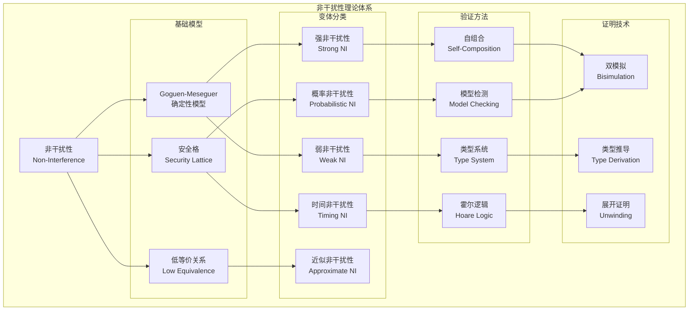
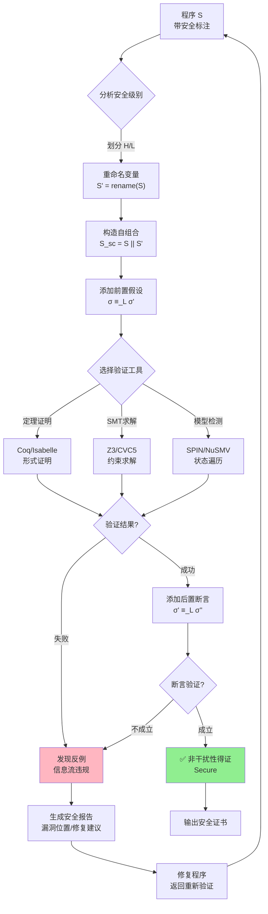
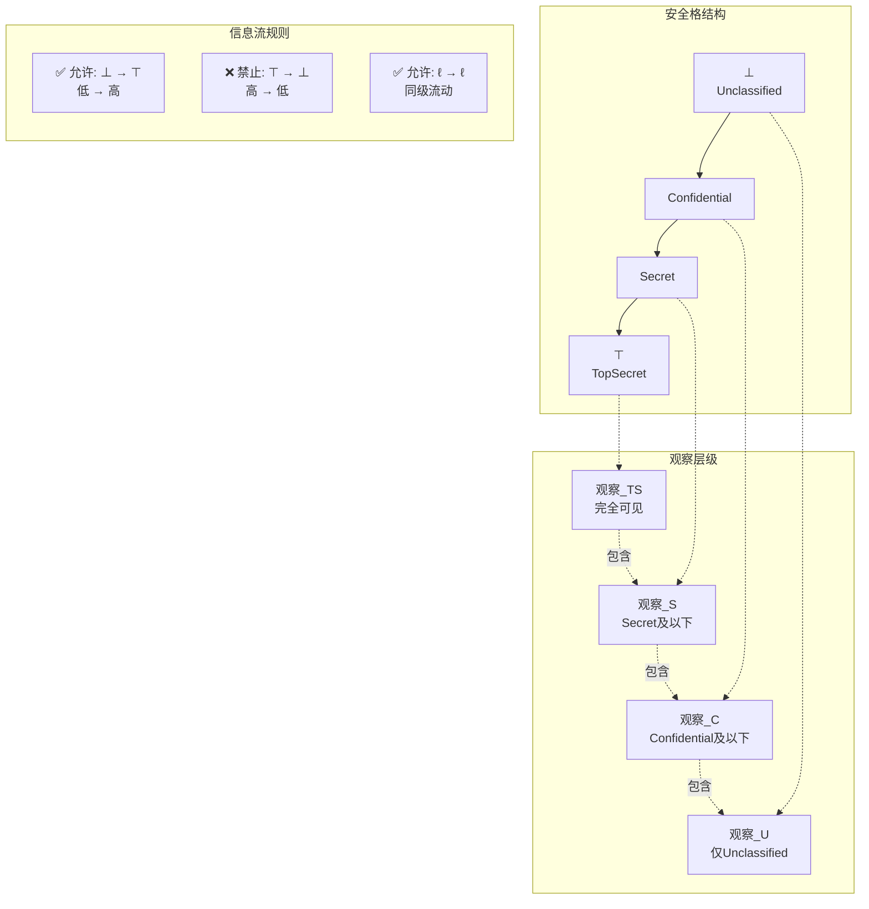
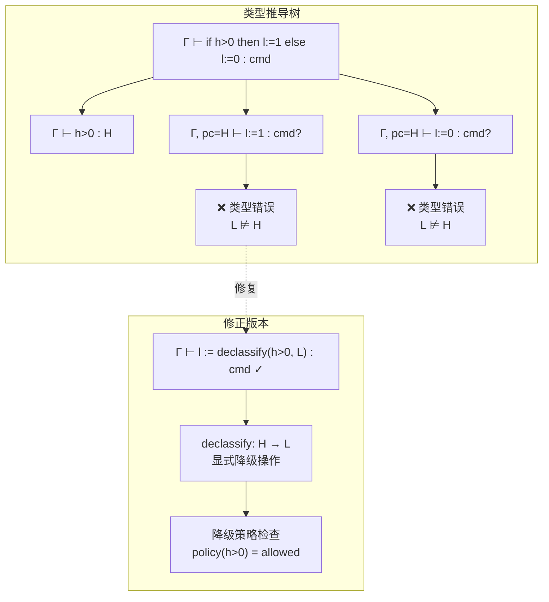

# 非干扰性 (Non-Interference)

> **所属阶段**: formal-methods/05-verification/04-security | 前置依赖: [01-information-flow.md](01-information-flow.md) | 形式化等级: L6

本文档全面阐述信息安全领域核心理论——非干扰性(Non-Interference)的形式化基础、验证方法与工程应用。非干扰性作为信息流安全(end-to-end security)的黄金标准，为系统安全策略的严格验证提供了数学基础。本文档涵盖从Goguen-Meseguer经典定义到现代近似非干扰性的完整理论体系，包括自组合、类型系统、霍尔逻辑和模型检测等多种验证技术。

---

## 1. 概念定义 (Definitions)

### 1.1 非干扰性概述

**Def-V-04-01** (非干扰性核心概念)。非干扰性是一种端到端安全策略，确保高安全级别主体的行为不会以任何可观测的方式影响低安全级别主体的观察：

$$
\text{NonInterference}(S) \triangleq \forall \vec{h}_1, \vec{h}_2 \in \mathbb{H}^{*}, \vec{l} \in \mathbb{L}^{*}: \text{obs}_{\mathbb{L}}(S(\vec{h}_1, \vec{l})) = \text{obs}_{\mathbb{L}}(S(\vec{h}_2, \vec{l}))
$$

其中：

- $\mathbb{H}$: 高机密(High/Secret)输入集合
- $\mathbb{L}$: 低公开(Low/Public)输入/输出集合
- $\text{obs}_{\mathbb{L}}(\cdot)$: 低安全级别的观测投影
- $S$: 被分析的系统

**直观解释**: 无论高安全级别的输入如何变化，低安全级别的观察者看到的系统行为完全一致。低级别主体无法通过任何方式推断高级别输入的信息。

**Def-V-04-02** (安全格与安全策略)。安全等级构成一个偏序集(安全格) $(\mathcal{L}, \sqsubseteq)$：

$$
\mathcal{L} = \{L_1, L_2, \ldots, L_n\}, \quad \sqsubseteq \subseteq \mathcal{L} \times \mathcal{L}
$$

标准安全格包含两个级别：

- $L \sqsubset H$ (公开 $\sqsubset$ 机密)
- 或扩展为多级安全格：$\text{Unclassified} \sqsubset \text{Confidential} \sqsubset \text{Secret} \sqsubset \text{TopSecret}$

信息流策略：信息只能从低级别流向高级别($l \sqsubseteq h$)，禁止反向流动。

### 1.2 Goguen-Meseguer模型

**Def-V-04-03** (Goguen-Meseguer确定性非干扰性)。设系统$S$为确定性状态机 $(Q, q_0, \Sigma, \delta, \lambda)$，其中：

- $Q$: 状态集合
- $q_0 \in Q$: 初始状态
- $\Sigma = \Sigma_H \cup \Sigma_L$: 输入字母表（高/低分区）
- $\delta: Q \times \Sigma \to Q$: 确定性转移函数
- $\lambda: Q \to \Sigma_L$: 低级别输出函数

**Def-V-04-04** (输入等价关系)。定义低输入序列的等价关系 $\approx_L$：

$$
\vec{i} \approx_L \vec{i}' \iff \text{purge}_H(\vec{i}) = \text{purge}_H(\vec{i}')
$$

其中$\text{purge}_H: \Sigma^{*} \to \Sigma_L^{*}$是删除所有高级别输入的函数：

$$
\text{purge}_H(\epsilon) = \epsilon
$$
$$
\text{purge}_H(a \cdot \vec{i}) = \begin{cases} \text{purge}_H(\vec{i}) & \text{if } a \in \Sigma_H \\ a \cdot \text{purge}_H(\vec{i}) & \text{if } a \in \Sigma_L \end{cases}
$$

**Def-V-04-05** (GM非干扰性)。系统$S$满足非干扰性当且仅当：

$$
\forall \vec{i}, \vec{i}' \in \Sigma^{*}: \vec{i} \approx_L \vec{i}' \Rightarrow \text{run}(S, \vec{i}) \approx_L \text{run}(S, \vec{i}')
$$

其中$\text{run}(S, \vec{i})$表示系统$S$在输入序列$\vec{i}$下的输出序列。

**等价形式**: 设$\text{obs}_L(\vec{i})$为系统执行$\vec{i}$后的低级别观测：

$$
\text{NonInterference}_{GM}(S) \iff \forall \vec{i} \in \Sigma^{*}: \text{obs}_L(\vec{i}) = \text{obs}_L(\text{purge}_H(\vec{i}))
$$

### 1.3 强非干扰性与弱非干扰性

**Def-V-04-06** (强非干扰性 / Strong Non-Interference)。强非干扰性要求系统在所有执行路径上严格满足非干扰：

$$
\text{StrongNI}(S) \triangleq \forall \vec{h}_1, \vec{h}_2, \vec{l}: \text{obs}_L(\llbracket S \rrbracket(\vec{h}_1, \vec{l})) = \text{obs}_L(\llbracket S \rrbracket(\vec{h}_2, \vec{l}))
$$

其中$\llbracket S \rrbracket$表示系统$S$的语义解释。

**Def-V-04-07** (弱非干扰性 / Weak Non-Interference)。弱非干扰性允许高输入影响执行的时间特性，但不影响最终输出：

$$
\text{WeakNI}(S) \triangleq \forall \vec{h}_1, \vec{h}_2, \vec{l}: \text{obs}_L^{\text{final}}(\llbracket S \rrbracket(\vec{h}_1, \vec{l})) = \text{obs}_L^{\text{final}}(\llbracket S \rrbracket(\vec{h}_2, \vec{l}))
$$

**Def-V-04-08** (时间非干扰性 / Timing Non-Interference)。考虑时间信道的非干扰性：

$$
\text{TimingNI}(S) \triangleq \forall \vec{h}_1, \vec{h}_2, \vec{l}, t: \text{obs}_L^{t}(\llbracket S \rrbracket(\vec{h}_1, \vec{l})) = \text{obs}_L^{t}(\llbracket S \rrbracket(\vec{h}_2, \vec{l}))
$$

其中$\text{obs}_L^{t}$表示在时间$t$的观测。

**Def-V-04-09** (概率非干扰性 / Probabilistic NI)。针对概率系统的非干扰性：

$$
\text{ProbNI}(S) \triangleq \forall \vec{h}_1, \vec{h}_2, \vec{l}, O_L: P(\text{obs}_L(\llbracket S \rrbracket(\vec{h}_1, \vec{l})) \in O_L) = P(\text{obs}_L(\llbracket S \rrbracket(\vec{h}_2, \vec{l})) \in O_L)
$$

### 1.4 近似非干扰性与定量信息流

**Def-V-04-10** (近似非干扰性 / Approximate Non-Interference)。实际系统往往无法满足严格的非干扰性，近似非干扰性引入容错：

$$
\text{ApproxNI}(S, \epsilon) \triangleq \forall \vec{h}_1, \vec{h}_2, \vec{l}: d(\text{obs}_L(\vec{h}_1, \vec{l}), \text{obs}_L(\vec{h}_2, \vec{l})) \leq \epsilon
$$

其中$d$是适当的距离度量，$\epsilon \geq 0$是容差阈值。当$\epsilon = 0$时退化为严格非干扰性。

**Def-V-04-11** (定量信息流 / Quantitative Information Flow)。使用信息论度量信息泄漏量：

$$
\text{QIF}(S) \triangleq I(H; L) = H(H) - H(H|L)
$$

其中：

- $I(H; L)$: 高输入$H$与低输出$L$的互信息
- $H(H)$: 高输入的熵
- $H(H|L)$: 给定低输出条件下高输入的条件熵

**Def-V-04-12** (容量与信道容量)。系统作为信息信道的容量：

$$
\mathcal{C}(S) \triangleq \max_{P_H} I(H; L)
$$

最大可能的信息泄漏量，用于评估系统最坏情况下的安全性。

---

## 2. 形式化定义 (Formal Definitions)

### 2.1 语义定义

**Def-V-04-13** (系统语义模型)。程序/系统$S$的指称语义定义为：

$$
\llbracket S \rrbracket: \text{State} \to \mathcal{P}(\text{State} \times \text{Obs}^{*})
$$

对于确定性系统：

$$
\llbracket S \rrbracket(\sigma) = (\sigma', \vec{o})
$$

**Def-V-04-14** (低等价关系)。状态上的低等价(观察等价)：

$$
\sigma \sim_L \sigma' \iff \text{obs}_L(\sigma) = \text{obs}_L(\sigma')
$$

扩展到低等价执行轨迹：

$$
\vec{\sigma} \sim_L \vec{\sigma}' \iff \forall i: \text{obs}_L(\sigma_i) = \text{obs}_L(\sigma'_i)
$$

**Def-V-04-15** (语义非干扰性)。基于语义的非干扰性定义：

$$
\text{SemNI}(S) \triangleq \forall \sigma_1, \sigma_2: \sigma_1 \sim_L \sigma_2 \Rightarrow \llbracket S \rrbracket(\sigma_1) \sim_L \llbracket S \rrbracket(\sigma_2)
$$

即：低等价输入状态产生低等价输出行为。

**Def-V-04-16** (进度不敏感 vs 进度敏感)。

- **进度不敏感非干扰性** (PINS): 忽略终止和非终止的区别
- **进度敏感非干扰性** (PSNI): 要求终止行为也满足非干扰

$$
\text{PSNI}(S) \triangleq \text{SemNI}(S) \land (\sigma_1 \uparrow \Leftrightarrow \sigma_2 \uparrow)
$$

其中$\sigma \uparrow$表示非终止。

### 2.2 语法定义

**Def-V-04-17** (命令式语言语法)。考虑简单命令式语言IMP的安全扩展：

$$
\begin{aligned}
c \Coloneqq &\ \textbf{skip} \mid x := e \mid c_1; c_2 \mid \textbf{if } b \textbf{ then } c_1 \textbf{ else } c_2 \mid \textbf{while } b \textbf{ do } c \\
& \mid x :=_H e \mid x :=_L e \mid \textbf{declassify}(x, e) \mid \textbf{endorse}(x, e)
\end{aligned}
$$

其中：

- $x :=_H e$: 高安全级赋值
- $x :=_L e$: 低安全级赋值
- $\textbf{declassify}$: 显式降级(declassification)
- $\textbf{endorse}$: 显式认可(endorsement)

**Def-V-04-18** (类型环境)。变量安全级别环境：

$$
\Gamma: \text{Var} \to \mathcal{L}
$$

记号：$\Gamma \vdash x : \ell$ 表示变量$x$的安全级别为$\ell$。

**Def-V-04-19** (表达式安全级别)。表达式$e$的安全级别：

$$
\text{level}(e, \Gamma) = \bigsqcup_{x \in \text{fv}(e)} \Gamma(x)
$$

即表达式中所有变量的最小上界。

### 2.3 非干扰性变体

**Def-V-04-20** (Possibilistic 非干扰性)。针对非确定性系统：

$$
\text{PossNI}(S) \triangleq \forall \sigma_1, \sigma_2: \sigma_1 \sim_L \sigma_2 \Rightarrow \text{obs}_L(\llbracket S \rrbracket(\sigma_1)) = \text{obs}_L(\llbracket S \rrbracket(\sigma_2))
$$

其中$\llbracket S \rrbracket(\sigma)$返回可能的状态集合。

**Def-V-04-21** (输入非干扰性 / Input-Non-Interference)。关注输入对输出的影响：

$$
\text{InputNI}(S) \triangleq \forall \vec{h}_1, \vec{h}_2, \vec{l}: \text{obs}_L^{\text{out}}(S, \vec{h}_1, \vec{l}) = \text{obs}_L^{\text{out}}(S, \vec{h}_2, \vec{l})
$$

**Def-V-04-22** (存储非干扰性 / Storage Non-Interference)。关注内存状态的非干扰：

$$
\text{StoreNI}(S) \triangleq \forall \mu_1, \mu_2: \mu_1 \sim_L \mu_2 \Rightarrow \text{store}_L(\llbracket S \rrbracket(\mu_1)) = \text{store}_L(\llbracket S \rrbracket(\mu_2))
$$

**Def-V-04-23** (观察函数族)。参数化观察函数：

$$
\mathcal{O} = \{\text{obs}_\ell: \text{State} \to \text{Obs}_\ell \mid \ell \in \mathcal{L}\}
$$

满足：$\ell_1 \sqsubseteq \ell_2 \Rightarrow \text{obs}_{\ell_2}$可以推导$\text{obs}_{\ell_1}$

---

## 3. 验证方法 (Verification Methods)

### 3.1 自组合 (Self-Composition)

**Def-V-04-24** (自组合原理)。自组合通过比较程序与自身的副本来验证非干扰性：

给定程序$S$，构造自组合程序$S_{sc}$：

$$
S_{sc} = S^{(1)}; S^{(2)}
$$

其中$S^{(1)}$和$S^{(2)}$是$S$的两个独立副本，分别操作状态$\sigma_1$和$\sigma_2$。

**Def-V-04-25** (自组合验证条件)。非干扰性等价于验证：

$$
\{\sigma_1 \sim_L \sigma_2\}\ S_{sc}\ \{\sigma'_1 \sim_L \sigma'_2\}
$$

即：在霍尔三元组语义中，低等价的前置条件蕴含低等价的后置条件。

**Lemma-V-04-01** (自组合完备性)。自组合方法对验证非干扰性是可靠且完备的：

$$
S \models \text{NI} \iff \models \{\sigma_1 \sim_L \sigma_2\}\ S_{sc}\ \{\sigma'_1 \sim_L \sigma'_2\}
$$

**自组合算法框架**:

```
输入: 程序 S, 安全级别划分 (H, L)
输出: 验证结果 (Secure / Insecure / Unknown)

1. 重命名变量: S' = rename(S, "'")
2. 构造自组合: S_sc = S || S'
3. 添加前置条件: assume(σ ≡_L σ')
4. 添加后置条件: assert(σ' ≡_L σ'')
5. 使用标准验证工具验证 S_sc
```

### 3.2 类型系统

**Def-V-04-26** (安全类型系统)。类型判断$\Gamma \vdash c : \tau \text{ cmd}$表示命令$c$的类型安全：

**类型规则**:

$$
\frac{\Gamma \vdash e : \ell}{\Gamma \vdash x := e : \text{cmd}} \text{ (assign)} \quad \text{if } \Gamma(x) \sqsupseteq \ell
$$

$$
\frac{\Gamma \vdash c_1 : \text{cmd} \quad \Gamma \vdash c_2 : \text{cmd}}{\Gamma \vdash c_1; c_2 : \text{cmd}} \text{ (seq)}
$$

$$
\frac{\Gamma \vdash b : \ell \quad \Gamma \vdash c_1 : \text{cmd} \quad \Gamma \vdash c_2 : \text{cmd}}{\Gamma \vdash \textbf{if } b \textbf{ then } c_1 \textbf{ else } c_2 : \text{cmd}} \text{ (if)} \quad \text{if } \ell \sqsubseteq \Gamma(\text{pc})
$$

**Def-V-04-27** (程序计数器安全级别)。引入程序计数器(pc)安全级别追踪隐式流：

$$
\Gamma_{pc} \in \mathcal{L}
$$

规则：条件分支内的赋值要求$\Gamma(x) \sqsupseteq \ell \sqcup \Gamma_{pc}$

**Lemma-V-04-02** (类型安全性)。良好类型程序满足非干扰性：

$$
\Gamma \vdash c : \text{cmd} \Rightarrow c \models \text{NI}
$$

**Def-V-04-28** (流敏感类型系统)。考虑控制流图的流敏感分析：

$$
\Gamma, pc \vdash c \Rightarrow \Gamma'
$$

其中$\Gamma'$是更新后的类型环境。

**Def-V-04-29** (依赖类型)。使用依赖类型表达更精细的安全策略：

$$
\text{Ref}_\ell(\phi) = \{x \mid \text{level}(x) = \ell \land \phi(x)\}
$$

### 3.3 霍尔逻辑扩展

**Def-V-04-30** (霍尔逻辑基础)。标准霍尔三元组：

$$
\{P\}\ c\ \{Q\}
$$

表示：若前置条件$P$成立且$c$终止，则后置条件$Q$成立。

**Def-V-04-31** (关系霍尔逻辑)。用于验证非干扰性的关系扩展：

$$
\{R\}\ c_1 \sim c_2\ \{S\}
$$

其中$R, S$是关系断言(连接两个执行状态)。

**Def-V-04-32** (双状态霍尔逻辑)。显式处理两个执行路径：

$$
\{\sigma_1 \sim_L \sigma_2\}\ c \ltimes c\ \{\sigma'_1 \sim_L \sigma'_2\}
$$

**Lemma-V-04-03** (关系组合)。顺序组合的关系规则：

$$
\frac{\{R\}\ c_1 \ltimes c_1\ \{S\} \quad \{S\}\ c_2 \ltimes c_2\ \{T\}}{\{R\}\ c_1;c_2 \ltimes c_1;c_2\ \{T\}}
$$

**Def-V-04-33** (超性质霍尔逻辑)。处理超性质(性质之性质)的扩展：

$$
\models_{\text{hyper}} \{\Phi\}\ S\ \{\Psi\}
$$

其中$\Phi, \Psi$是执行轨迹集合的性质。

### 3.4 模型检测

**Def-V-04-34** (符号模型检测)。使用BDD(二进制决策图)进行状态空间遍历：

$$
\text{BDD}(\text{obs}_L(\vec{h}_1, \vec{l}) = \text{obs}_L(\vec{h}_2, \vec{l}))
$$

**Def-V-04-35** (有界模型检测)。对有限展开进行SAT/SMT求解：

$$
\text{BMC}(S, k) = \bigwedge_{i=0}^{k} T(s_i, s_{i+1}) \land \text{obs}_L(s_k) \neq \text{obs}_L(s'_k)
$$

**Def-V-04-36** (抽象精化)。使用C反例引导的抽象精化(CEGAR)：

$$
S_{\text{abstract}} \models \text{NI} \Rightarrow S_{\text{concrete}} \models \text{NI}
$$

$$
S_{\text{abstract}} \not\models \text{NI} \stackrel{?}{\Rightarrow} S_{\text{concrete}} \not\models \text{NI}
$$

---

## 4. 证明技术 (Proof Techniques)

### 4.1 双模拟证明

**Def-V-04-37** (低双模拟)。关系$R \subseteq \text{State} \times \text{State}$是低双模拟，如果：

1. **初始条件**: $(\sigma_1, \sigma_2) \in R \Rightarrow \sigma_1 \sim_L \sigma_2$
2. **步进条件**: 若$(\sigma_1, \sigma_2) \in R$且$\sigma_1 \xrightarrow{a} \sigma'_1$，则存在$\sigma'_2$使得$\sigma_2 \xrightarrow{a} \sigma'_2$且$(\sigma'_1, \sigma'_2) \in R$（反之亦然）
3. **终止条件**: 若$(\sigma_1, \sigma_2) \in R$，则$\sigma_1 \downarrow \Leftrightarrow \sigma_2 \downarrow$

**Def-V-04-38** (最大低双模拟)。记$\sim_L^{\text{bis}}$为最大低双模拟：

$$
\sim_L^{\text{bis}} = \bigcup\{R \mid R \text{ 是低双模拟}\}
$$

**Lemma-V-04-04** (双模拟蕴含非干扰性)。若存在低双模拟包含所有低等价状态对，则系统满足非干扰性：

$$
\forall \sigma_1, \sigma_2: \sigma_1 \sim_L \sigma_2 \Rightarrow \sigma_1 \sim_L^{\text{bis}} \sigma_2 \Rightarrow S \models \text{NI}
$$

**Def-V-04-39** (弱双模拟)。忽略内部动作的扩展：

$$
\sigma_1 \approx_L \sigma_2 \text{ (弱低双模拟)}
$$

### 4.2 展开证明 (Unwinding Proof)

**Def-V-04-40** (展开条件)。Goguen-Meseguer展开证明技术定义局部条件：

设系统$S = (Q, q_0, \Sigma, \delta, \lambda)$，关系$\sim \subseteq Q \times Q$满足：

1. **输出一致性** (Output Consistency, OC):
   $$(q_1, q_2) \in \sim \Rightarrow \lambda(q_1) = \lambda(q_2)$$

2. **局部 respect** (Local Respect, LR):
   $$(q_1, q_2) \in \sim \land \delta(q_1, h) = q'_1 \Rightarrow (q'_1, q_2) \in \sim \quad (h \in \Sigma_H)$$

3. **局部步进一致性** (Local Step Consistency, SC):
   $$(q_1, q_2) \in \sim \land \delta(q_1, l) = q'_1 \Rightarrow \exists q'_2: \delta(q_2, l) = q'_2 \land (q'_1, q'_2) \in \sim \quad (l \in \Sigma_L)$$

**Thm-V-04-01** (展开定理)。若存在关系$\sim$满足OC、LR和SC，且初始状态满足$(q_0, q_0) \in \sim$，则系统满足非干扰性：

$$
\exists \sim: OC(\sim) \land LR(\sim) \land SC(\sim) \land (q_0, q_0) \in \sim \Rightarrow S \models \text{NI}
$$

**证明**: 通过对输入序列长度的归纳证明。基本情况($|\vec{i}| = 0$)由$(q_0, q_0) \in \sim$和OC保证。归纳步骤分别处理高低输入。

**Def-V-04-41** (展开证明算法)。

```
算法: UnwindingProof(S)
输入: 状态机 S = (Q, q₀, Σ, δ, λ)
输出: (Secure, ~) 或 (Insecure, counterexample)

R ← {(q, q) | q ∈ Q}  // 初始等价关系
Worklist ← {(q₀, q₀)}

while Worklist ≠ ∅:
    (q₁, q₂) ← pop(Worklist)

    // 检查OC
    if λ(q₁) ≠ λ(q₂):
        return (Insecure, (q₁, q₂))

    // 检查LR: 高输入不应改变低等价
    for h ∈ Σ_H:
        q₁' ← δ(q₁, h)
        if (q₁', q₂) ∉ R:
            R ← R ∪ {(q₁', q₂)}
            push(Worklist, (q₁', q₂))

    // 检查SC: 低输入应保持同步
    for l ∈ Σ_L:
        q₁' ← δ(q₁, l)
        q₂' ← δ(q₂, l)
        if (q₁', q₂') ∉ R:
            R ← R ∪ {(q₁', q₂')}
            push(Worklist, (q₁', q₂'))

return (Secure, R)
```

### 4.3 类型推导

**Def-V-04-42** (类型推导算法)。 Hindley-Milner风格的安全类型推导：

$$
\text{infer}(\Gamma, c) = (\Gamma', C)
$$

其中$C$是类型约束集合。

**约束求解**：

$$
C = \{\ell_1 \sqsubseteq \ell_2, \ell_3 \sqcup \ell_4 = \ell_5, \ldots\}
$$

**Def-V-04-43** (子类型推导)。支持子类型的扩展：

$$
\frac{\Gamma \vdash e : \ell_1 \quad \ell_1 \sqsubseteq \ell_2}{\Gamma \vdash e : \ell_2} \text{ (subsumption)}
$$

**Lemma-V-04-05** (类型推导完备性)。若程序可类型化，则类型推导算法能找到最一般类型：

$$
\exists \Gamma: \Gamma \vdash c : \text{cmd} \Rightarrow \text{infer}(c) = (\Gamma_{\text{principal}}, C) \land \text{solvable}(C)
$$

---

## 5. 形式定理 (Formal Theorems)

### 5.1 组合性 (Compositionality)

**Thm-V-04-02** (顺序组合性)。若$c_1$和$c_2$各自满足非干扰性，则$c_1; c_2$也满足：

$$
\frac{c_1 \models \text{NI} \quad c_2 \models \text{NI}}{c_1; c_2 \models \text{NI}}
$$

**证明**: 设$\sigma_1 \sim_L \sigma_2$。

- 由$c_1 \models \text{NI}$得$\llbracket c_1 \rrbracket(\sigma_1) \sim_L \llbracket c_1 \rrbracket(\sigma_2)$
- 由$c_2 \models \text{NI}$得$\llbracket c_2 \rrbracket(\llbracket c_1 \rrbracket(\sigma_1)) \sim_L \llbracket c_2 \rrbracket(\llbracket c_1 \rrbracket(\sigma_2))$
- 即$\llbracket c_1; c_2 \rrbracket(\sigma_1) \sim_L \llbracket c_1; c_2 \rrbracket(\sigma_2)$

**Thm-V-04-03** (条件组合性)。条件语句的组合性：

$$
\frac{\Gamma \vdash b : \ell \quad \Gamma, pc \sqcup \ell \vdash c_1 : \text{cmd} \quad \Gamma, pc \sqcup \ell \vdash c_2 : \text{cmd}}{\Gamma, pc \vdash \textbf{if } b \textbf{ then } c_1 \textbf{ else } c_2 : \text{cmd}}
$$

**Thm-V-04-04** (并行组合性)。并行组合的非干扰性：

$$
\frac{S_1 \models \text{NI} \quad S_2 \models \text{NI} \quad \text{disjoint}(S_1, S_2)}{S_1 \parallel S_2 \models \text{NI}}
$$

其中$\text{disjoint}$表示无共享高安全级状态。

**Thm-V-04-05** (细化和抽象保持)。细化保持非干扰性：

$$
S_1 \models \text{NI} \land S_2 \sqsubseteq S_1 \Rightarrow S_2 \models \text{NI}
$$

### 5.2 一致性 (Consistency)

**Thm-V-04-06** (类型一致性)。类型系统语义一致性：

$$
\Gamma \vdash c : \text{cmd} \land (\sigma_1 \sim_L \sigma_2) \Rightarrow \llbracket c \rrbracket(\sigma_1) \sim_L \llbracket c \rrbracket(\sigma_2)
$$

**Thm-V-04-07** (观察一致性)。不同观察级别的一致性：

$$
\ell_1 \sqsubseteq \ell_2 \Rightarrow \text{obs}_{\ell_1}(\sigma) = f(\text{obs}_{\ell_2}(\sigma))
$$

**Thm-V-04-08** (超性质一致性)。非干扰性作为超性质的一致性：

$$
S \models \text{NI} \iff \forall \pi_1, \pi_2 \in \llbracket S \rrbracket: \pi_1(0) \sim_L \pi_2(0) \Rightarrow \pi_1 \sim_L \pi_2
$$

### 5.3 安全性保证 (Security Guarantees)

**Thm-V-04-09** (终止敏感安全性)。终止敏感非干扰性保证：

$$
\text{TS-NI}(S) \Rightarrow \forall \sigma_1, \sigma_2: \sigma_1 \sim_L \sigma_2 \Rightarrow \llbracket S \rrbracket(\sigma_1) \sim_L^{*} \llbracket S \rrbracket(\sigma_2)
$$

其中$\sim_L^{*}$包含终止等价。

**Thm-V-04-10** (无时间信道保证)。时间非干扰性消除时间侧信道：

$$
\text{TimingNI}(S) \Rightarrow \neg\exists t: \text{time}(S, \vec{h}_1, \vec{l}) = t \neq \text{time}(S, \vec{h}_2, \vec{l})
$$

**Thm-V-04-11** (概率安全性)。概率非干扰性与信息论关系：

$$
\text{ProbNI}(S) \Rightarrow I(H; L) = 0
$$

**Thm-V-04-12** (降级边界)。受控降级的安全性边界：

$$
\text{DeclassifyNI}(S, D) \Rightarrow I(H; L) \leq H(D(H))
$$

其中$D$是降级策略，$D(H)$是被允许泄漏的高级信息。

---

## 6. 案例分析 (Case Studies)

### 6.1 简单程序验证

**案例6.1.1: 安全赋值验证**

```
// 程序 P1: 安全赋值
h := secret_input();  // h: High
l := 0;               // l: Low
l := h;               // 非法! 类型检查失败
l := public_value();  // OK
```

类型推导：

- $\Gamma(h) = H, \Gamma(l) = L$
- $h := \text{secret\_input}()$: OK，$H \sqsubseteq H$
- $l := 0$: OK，$L \sqsubseteq L$
- $l := h$: **失败**，$H \not\sqsubseteq L$

**案例6.1.2: 隐式流验证**

```
// 程序 P2: 隐式信息流
h := secret_input();  // h: High
l := 0;               // l: Low
if h > 0 then
    l := 1;           // 隐式流! pc = H
else
    l := 0;           // 隐式流! pc = H
```

类型检查：

- 条件$h > 0$的级别为$H$
- 分支内$pc$升级为$H$
- 赋值$l := 1$要求$L \sqsupseteq H$，**失败**

**修正版本**:

```
l := declassify(h > 0 ? 1 : 0, L);  // 显式降级
```

**案例6.1.3: 无干扰密码验证器**

```python
# 安全密码验证器
def verify_password(input_pwd, stored_hash):
    # input_pwd: Low (用户输入)
    # stored_hash: High (存储的密码哈希)

    result = constant_time_compare(hash(input_pwd), stored_hash)
    # 使用恒定时间比较防止时间侧信道

    return declassify(result, L)  # 显式降级结果
```

### 6.2 实际系统案例

**案例6.2.1: seL4微内核验证**

seL4是使用形式化方法验证的具有高安全保证的微内核：

```
系统: seL4 Microkernel
验证工具: Isabelle/HOL
性质: 信息流安全性
方法: 信息流的非干涉证明
```

**验证架构**:

- **抽象层**: 从C代码到Isabelle/HOL的语义保持转换
- **信息流追踪**: 使用标签传播机制
- **非干扰证明**: 基于展开证明的严格验证

**关键结果**: 证明从内核输出到用户空间的信息流仅通过显式定义的通道进行。

**案例6.2.2: AWS Zelkova策略分析**

AWS使用Zelkova自动验证IAM(身份和访问管理)策略的信息流安全性：

```
系统: AWS IAM Policy
验证工具: Zelkova (SMT-based)
性质: 权限非扩散
方法: 符号执行 + SMT求解
```

策略示例：

```json
{
    "Version": "2012-10-17",
    "Statement": [{
        "Effect": "Allow",
        "Principal": {"AWS": "arn:aws:iam::123:root"},
        "Action": "s3:GetObject",
        "Resource": "arn:aws:s3:::bucket/*",
        "Condition": {
            "StringEquals": {"aws:username": "${s3:username}"}
        }
    }]
}
```

验证：确保Principal不能访问超出授权范围的资源。

**案例6.2.3: 安全数据库系统**

多级别安全(MLS)数据库系统的非干扰性验证：

```
系统: MLS Database
安全等级: {Unclass, Secret, TopSecret}
验证目标: 查询结果仅包含授权级别数据
```

**挑战**:

- 聚合攻击(聚合多个低级别记录推断高级别信息)
- 推理攻击(通过否定信息推断)

**解决方案**:

- 查询改写：自动添加安全过滤器
- 审计日志：追踪所有访问模式
- 扰动机制：对敏感统计查询添加噪声

**案例6.2.4: 智能合约信息流分析**

区块链智能合约的非干扰性验证：

```solidity
// 安全拍卖合约片段
contract SecureAuction {
    mapping(address => uint256) private bids;  // High
    uint256 public highestBid;                  // Low
    address public highestBidder;               // Low

    function placeBid() public payable {
        uint256 newBid = bids[msg.sender] + msg.value;
        // 安全分析：确保出价信息不会泄露
        if (newBid > highestBid) {
            highestBid = newBid;        // 降级：仅公开获胜出价
            highestBidder = msg.sender; // 降级：仅公开获胜者
        }
        bids[msg.sender] = newBid;  // 保持秘密
    }
}
```

**验证目标**: 确保竞标者的历史出价不会从公开状态中推断出来。

---

## 7. 可视化 (Visualizations)

### 7.1 非干扰性概念层次图

非干扰性理论的核心概念及其相互关系：



### 7.2 自组合验证流程图

自组合方法验证非干扰性的详细流程：



### 7.3 信息流安全格与观察层级

多级安全格的信息流策略：



### 7.4 类型系统推导示例

命令式语言安全类型系统的推导过程：



---

## 8. 引用参考 (References)
