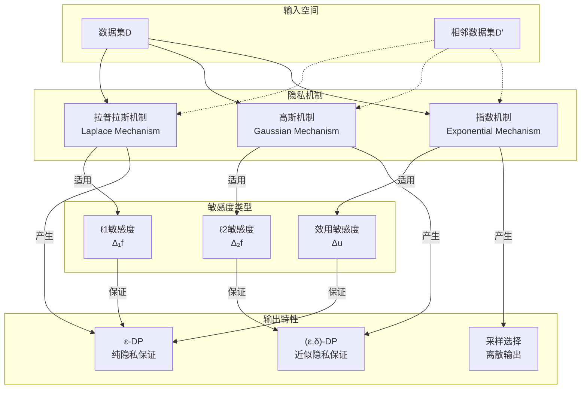
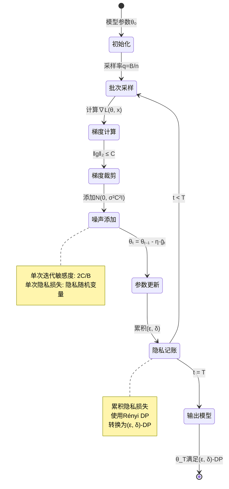
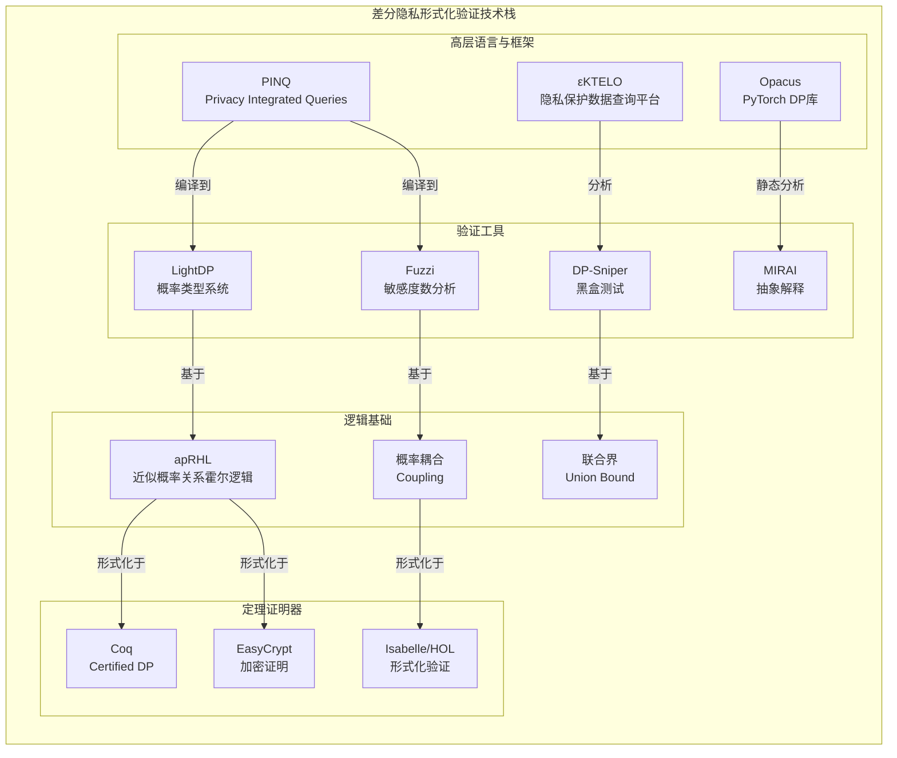

# 差分隐私的形式化验证

> 所属阶段: Formal Methods/Verification/Security | 前置依赖: [形式化验证基础](../01-verification-fundamentals.md), [概率系统验证](../02-probabilistic-systems.md) | 形式化等级: L5

## 1. 概念定义 (Definitions)

### 1.1 差分隐私概述

差分隐私（Differential Privacy, DP）是由Dwork等人于2006年提出的隐私保护框架，它通过向数据查询结果中引入精心校准的噪声，为个体数据提供数学上可证明的隐私保证。

**直观理解**：差分隐私确保攻击者无法从查询结果中推断特定个体是否存在于数据集中，即使攻击者拥有关于其他所有个体的完整信息（背景知识攻击）。

### 1.2 ε-差分隐私

**定义 Def-DP-01**（ε-差分隐私）：设$\mathcal{M}$是一个随机化机制，对于任意两个相邻数据集$D, D' \in \mathcal{D}$（相差至多一个记录），以及任意输出集合$S \subseteq \text{Range}(\mathcal{M})$，机制$\mathcal{M}$满足$\varepsilon$-差分隐私，当且仅当：

$$\Pr[\mathcal{M}(D) \in S] \leq e^{\varepsilon} \cdot \Pr[\mathcal{M}(D') \in S]$$

其中$\varepsilon > 0$称为**隐私预算**（Privacy Budget），衡量隐私保护强度：

- 较小的$\varepsilon$ → 更强的隐私保护，更多的噪声
- 较大的$\varepsilon$ → 较弱的隐私保护，较少的噪声
- 当$\varepsilon \to 0$时，输出分布几乎相同
- 当$\varepsilon \to \infty$时，隐私保护失效

**相邻数据集定义 Def-DP-02**：两个数据集$D$和$D'$称为相邻的（Neighbors），记为$D \sim D'$，当且仅当它们满足以下任一条件：

- **添加/删除模型**：$|D \setminus D'| + |D' \setminus D| = 1$
- **替换模型**：存在唯一$x \in D$和$x' \notin D$使得$D' = (D \setminus \{x\}) \cup \{x'\}$

### 1.3 (ε,δ)-差分隐私

**定义 Def-DP-03**（(ε,δ)-差分隐私）：机制$\mathcal{M}$满足$(\varepsilon, \delta)$-差分隐私，当且仅当对于所有相邻数据集$D \sim D'$和所有可测集$S \subseteq \text{Range}(\mathcal{M})$：

$$\Pr[\mathcal{M}(D) \in S] \leq e^{\varepsilon} \cdot \Pr[\mathcal{M}(D') \in S] + \delta$$

其中$\delta \in [0, 1]$表示允许的隐私保护失效概率。当$\delta = 0$时，退化为纯$\varepsilon$-差分隐私。

**直观解释**：

- 以至少$1-\delta$的概率，机制提供$\varepsilon$-差分隐私保护
- 允许极罕见情况下隐私保护失效（例如随机数生成器产生极端值）
- 实践中常用较小的$\delta$（如$\delta \ll 1/n$，$n$为数据集大小）

### 1.4 组合定理

**定义 Def-DP-04**（隐私损失随机变量）：对于机制$\mathcal{M}$和相邻数据集$D \sim D'$，给定输出$o$，隐私损失定义为：

$$\mathcal{L}^{(o)}_{D,D'} = \ln\frac{\Pr[\mathcal{M}(D) = o]}{\Pr[\mathcal{M}(D') = o]}$$

隐私损失随机变量描述了观察特定输出时，数据从$D$变为$D'$所泄露的信息量。

**定义 Def-DP-05**（$k$-组合）：给定机制$\mathcal{M}_1, \ldots, \mathcal{M}_k$，它们的$k$-组合是指对这些机制的适应性调用序列，其中第$i$个机制可能依赖于前$i-1$个机制的输出。

## 2. 属性推导 (Properties)

### 2.1 概率模型

**命题 Prop-DP-01**（输出分布的不可区分性）：若$\mathcal{M}$满足$\varepsilon$-DP，则对于所有相邻数据集$D \sim D'$，输出分布的统计距离满足：

$$\Delta(\mathcal{M}(D), \mathcal{M}(D')) \leq \frac{e^{\varepsilon} - 1}{e^{\varepsilon} + 1} = \tanh\frac{\varepsilon}{2}$$

**证明**：
令$P = \mathcal{M}(D)$，$Q = \mathcal{M}(D')$。统计距离定义为：
$$\Delta(P, Q) = \sup_{S} |P(S) - Q(S)|$$

由$\varepsilon$-DP定义，$P(S) \leq e^{\varepsilon}Q(S)$且$Q(S) \leq e^{\varepsilon}P(S)$。

对于任意可测集$S$：
$$|P(S) - Q(S)| \leq \max\{P(S) - Q(S), Q(S) - P(S)\}$$

假设$P(S) \geq Q(S)$，则：
$$P(S) - Q(S) \leq e^{\varepsilon}Q(S) - Q(S) = (e^{\varepsilon} - 1)Q(S)$$

同时$Q(S) \geq e^{-\varepsilon}P(S)$，因此：
$$P(S) - Q(S) \leq P(S) - e^{-\varepsilon}P(S) = (1 - e^{-\varepsilon})P(S)$$

综合两个上界并利用$P(S) + Q(S^c) = 1$的约束，可得：
$$\Delta(P, Q) \leq \frac{e^{\varepsilon} - 1}{e^{\varepsilon} + 1}$$

**引理 Lemma-DP-01**（隐私损失的期望界）：对于$\varepsilon$-DP机制，隐私损失随机变量的期望满足：

$$\mathbb{E}_{o \sim \mathcal{M}(D)}[\mathcal{L}^{(o)}_{D,D'}] \leq \varepsilon$$

### 2.2 机制定义

**定义 Def-DP-06**（随机化响应机制）：对于二元属性$x \in \{0, 1\}$，随机化响应机制$\mathcal{M}_{RR}$以概率$p$输出真实值，以概率$1-p$输出相反值：

$$\mathcal{M}_{RR}(x) = \begin{cases} x & \text{概率 } p \\ 1-x & \text{概率 } 1-p \end{cases}$$

**引理 Lemma-DP-02**：当$p = \frac{e^{\varepsilon}}{e^{\varepsilon} + 1}$时，$\mathcal{M}_{RR}$满足$\varepsilon$-DP。

**证明**：
对于任意输出$y \in \{0, 1\}$：
$$\frac{\Pr[\mathcal{M}_{RR}(0) = y]}{\Pr[\mathcal{M}_{RR}(1) = y]} \in \left\{\frac{p}{1-p}, \frac{1-p}{p}\right\}$$

要求：
$$\frac{p}{1-p} \leq e^{\varepsilon}$$

解得：
$$p \leq \frac{e^{\varepsilon}}{e^{\varepsilon} + 1}$$

取$p = \frac{e^{\varepsilon}}{e^{\varepsilon} + 1}$可达到隐私预算$\varepsilon$的上界。$\square$

### 2.3 隐私损失与隐私损失分布

**定义 Def-DP-07**（隐私损失分布 PLD）：机制$\mathcal{M}$在相邻数据集对$(D, D')$上的隐私损失分布是随机变量$\mathcal{L}_{D,D'}$的分布。

**命题 Prop-DP-02**（隐私损失分布的尾部界）：若$\mathcal{M}$满足$(\varepsilon, \delta)$-DP，则：

$$\Pr_{o \sim \mathcal{M}(D)}[\mathcal{L}^{(o)}_{D,D'} > \varepsilon] \leq \delta$$

**引理 Lemma-DP-03**（中心极限定理与组合）：当多个独立机制组合时，总隐私损失分布收敛于高斯分布（中心极限定理）。

### 2.4 敏感度

**定义 Def-DP-08**（全局敏感度）：对于函数$f: \mathcal{D} \to \mathbb{R}^d$，其$\ell_1$全局敏感度定义为：

$$\Delta_1 f = \max_{D \sim D'} \|f(D) - f(D')\|_1$$

$\ell_2$全局敏感度定义为：

$$\Delta_2 f = \max_{D \sim D'} \|f(D) - f(D')\|_2$$

**定义 Def-DP-09**（局部敏感度）：对于特定数据集$D$，函数$f$的$\ell_1$局部敏感度为：

$$LS_f(D) = \max_{D' \sim D} \|f(D) - f(D')\|_1$$

**命题 Prop-DP-03**（敏感度与相邻关系）：全局敏感度是所有可能数据集的局部敏感度的上界：

$$\Delta_1 f = \max_{D \in \mathcal{D}} LS_f(D)$$

## 3. 关系建立 (Relations)

### 3.1 差分隐私与其他隐私模型

**隐私模型层次结构**：

| 隐私模型 | 强度 | 形式化保证 | 计算复杂度 |
|---------|------|-----------|-----------|
| 信息论隐私 | 最强 | $I(X; Y) = 0$ | 不可行 |
| 差分隐私 | 强 | $e^{-\varepsilon} \leq \frac{P}{Q} \leq e^{\varepsilon}$ | 高效 |
| $k$-匿名 | 中 | $|EQ| \geq k$ | 高效 |
| $l$-多样性 | 中 | 熵约束 | 高效 |
| $t$-接近 | 弱 | 分布距离约束 | 高效 |

**命题 Prop-DP-04**：差分隐私蕴含$k$-匿名化的统计版本，反之不成立。

### 3.2 差分隐私与密码学

**关系1**：差分隐私与语义安全

- 语义安全：密文不泄露明文的任何信息
- 差分隐私：输出不泄露特定个体的存在性

**关系2**：差分隐私与零知识证明

- 零知识证明：验证者不获得除陈述真实性外的任何信息
- 差分隐私机制可以视为数据的"零知识"摘要

### 3.3 形式化验证技术的分类

```
┌─────────────────────────────────────────────────────────────────┐
│              差分隐私形式化验证技术分类                            │
├─────────────────────────────────────────────────────────────────┤
│                                                                 │
│  ┌─────────────────┐  ┌─────────────────┐  ┌─────────────────┐  │
│  │   类型系统方法   │  │  逻辑推理方法   │  │  自动机方法     │  │
│  │   (LightDP)     │  │  (apRHL)        │  │  (隐私自动机)   │  │
│  └────────┬────────┘  └────────┬────────┘  └────────┬────────┘  │
│           │                    │                    │          │
│  ┌────────▼────────┐  ┌────────▼────────┐  ┌────────▼────────┐  │
│  │ 概率类型系统    │  │ 近似关系霍尔逻辑 │  │ 转移系统建模    │  │
│  │ 线性类型        │  │ 耦合技术        │  │ 互模拟验证      │  │
│  └─────────────────┘  └─────────────────┘  └─────────────────┘  │
│                                                                 │
│  ┌─────────────────┐  ┌─────────────────┐  ┌─────────────────┐  │
│  │   程序分析      │  │  统计验证       │  │  符号执行       │  │
│  │   (Fuzzi)       │  │  (集中不等式)   │  │  (DP-Sniper)    │  │
│  └─────────────────┘  └─────────────────┘  └─────────────────┘  │
│                                                                 │
└─────────────────────────────────────────────────────────────────┘
```

### 3.4 与其他形式化方法的集成

**与定理证明器集成**：

- Coq: [Certified DP in Coq]
- Isabelle/HOL: [Differential Privacy in Isabelle]
- EasyCrypt: [Security proofs using EasyCrypt]

**与模型检测集成**：

- PRISM: 概率模型检测
- Storm: 概率模型检测器

## 4. 论证过程 (Argumentation)

### 4.1 组合性证明的复杂性分析

**基本组合定理的局限性**：

考虑$k$个机制，每个满足$\varepsilon$-DP。基本组合定理给出总隐私预算为$k\varepsilon$，这通常是过于悲观的估计。

**问题分析**：

1. 最坏情况假设：假设每个机制都在最坏情况下泄露隐私
2. 独立性假设：实际中机制间可能存在相关性
3. 输出维度：高维输出可能集中在某些区域

**高级组合的优势**：

高级组合定理利用隐私损失的集中性质，给出 tighter bound：

- 对于$k$个$(\varepsilon, \delta)$-DP机制，总隐私预算为$O(\sqrt{k\ln(1/\delta')}\varepsilon)$
- 相比线性增长$k\varepsilon$，平方根增长$\sqrt{k}$是显著的改进

### 4.2 后处理免疫性的形式化论证

**引理 Lemma-DP-04**（后处理免疫性）：若$\mathcal{M}$满足$\varepsilon$-DP，则对于任意（可能是随机的）函数$g$，复合机制$g \circ \mathcal{M}$也满足$\varepsilon$-DP。

**论证**：
对于任意相邻数据集$D \sim D'$和输出集合$S'$：

$$\Pr[g(\mathcal{M}(D)) \in S'] = \int \Pr[g(o) \in S'] d\mathcal{M}(D)(o)$$

由于$\Pr[g(o) \in S'] \in [0, 1]$，且$\mathcal{M}(D)(S) \leq e^{\varepsilon}\mathcal{M}(D')(S)$对所有$S$成立：

$$\Pr[g(\mathcal{M}(D)) \in S'] \leq e^{\varepsilon} \Pr[g(\mathcal{M}(D')) \in S']$$

**意义**：数据分析师可以对DP输出进行任意分析而不破坏隐私保证。

### 4.3 敏感性计算的形式化挑战

**挑战1：递归计算的敏感性**

考虑递归函数：

```
f(D) = if |D| = 0 then 0 else head(D) + f(tail(D))
```

其全局敏感度$\Delta f = \max |x|$（其中$x \in D$），但静态分析难以自动推导。

**挑战2：条件分支的敏感性**

```
f(D) = if count(D) > threshold then g(D) else h(D)
```

敏感度为$\max(\Delta g, \Delta h) + \text{阈值条件泄露}$。

**挑战3：迭代算法的敏感性**

梯度下降等迭代算法的敏感度随迭代次数累积，需要特殊的敏感度分析技术。

### 4.4 隐私预算分配策略

**均匀分配**：

- $k$个查询，每个分配$\varepsilon/k$预算
- 简单但可能低效

**非均匀分配**：

- 根据查询重要性分配不同预算
- 需要证明整体隐私保证

**自适应分配**：

- 根据前面查询结果调整后续预算
- 需要更复杂的组合定理支持

## 5. 形式证明 / 工程论证 (Proof / Engineering Argument)

### 5.1 基本组合定理

**定理 Thm-DP-01**（基本序列组合）：设$\mathcal{M}_i: \mathcal{D} \times \mathcal{R}_{i-1} \to \mathcal{R}_i$是自适应机制序列，其中$\mathcal{M}_i(\cdot, r_{i-1})$对所有$r_{i-1}$满足$\varepsilon_i$-DP。则$k$-组合机制$\mathcal{M}(D) = (\mathcal{M}_1(D), \ldots, \mathcal{M}_k(D, r_{k-1}))$满足$(\sum_{i=1}^k \varepsilon_i)$-DP。

**证明**：

对$k$进行归纳。

**基础情况**（$k=1$）：显然成立。

**归纳步骤**：假设对$k-1$成立。考虑机制$\mathcal{M}_{[1:k]} = (\mathcal{M}_{[1:k-1]}, \mathcal{M}_k)$。

对于任意相邻数据集$D \sim D'$和输出$(r_1, \ldots, r_k)$：

$$\frac{\Pr[\mathcal{M}_{[1:k]}(D) = (r_1, \ldots, r_k)]}{\Pr[\mathcal{M}_{[1:k]}(D') = (r_1, \ldots, r_k)]}$$

$$= \frac{\Pr[\mathcal{M}_{[1:k-1]}(D) = (r_1, \ldots, r_{k-1})]}{\Pr[\mathcal{M}_{[1:k-1]}(D') = (r_1, \ldots, r_{k-1})]} \cdot \frac{\Pr[\mathcal{M}_k(D, r_{k-1}) = r_k]}{\Pr[\mathcal{M}_k(D', r_{k-1}) = r_k]}$$

由归纳假设，第一项$\leq e^{\sum_{i=1}^{k-1}\varepsilon_i}$；由$\mathcal{M}_k$的$\varepsilon_k$-DP，第二项$\leq e^{\varepsilon_k}$。

因此整体$\leq e^{\sum_{i=1}^k \varepsilon_i}$。$\square$

**定理 Thm-DP-02**（并行组合）：设$\mathcal{D}_1, \ldots, \mathcal{D}_m$是数据集$D$的不相交子集，$\mathcal{M}_i$是在$\mathcal{D}_i$上满足$\varepsilon$-DP的机制。则联合机制$\mathcal{M}(D) = (\mathcal{M}_1(\mathcal{D}_1), \ldots, \mathcal{M}_m(\mathcal{D}_m))$满足$\varepsilon$-DP（而非$m\varepsilon$-DP）。

**证明**：

对于相邻数据集$D \sim D'$，它们最多在一个子集$\mathcal{D}_j$上不同（因为子集不相交）。

因此：
$$\frac{\Pr[\mathcal{M}(D) = (r_1, \ldots, r_m)]}{\Pr[\mathcal{M}(D') = (r_1, \ldots, r_m)]} = \frac{\prod_{i=1}^m \Pr[\mathcal{M}_i(\mathcal{D}_i) = r_i]}{\prod_{i=1}^m \Pr[\mathcal{M}_i(\mathcal{D}'_i) = r_i]}$$

由于$\mathcal{D}_i = \mathcal{D}'_i$对$i \neq j$，交叉项相消：

$$= \frac{\Pr[\mathcal{M}_j(\mathcal{D}_j) = r_j]}{\Pr[\mathcal{M}_j(\mathcal{D}'_j) = r_j]} \leq e^{\varepsilon}$$

$\square$

### 5.2 高级组合定理

**定理 Thm-DP-03**（高级组合定理）：设$\mathcal{M}_1, \ldots, \mathcal{M}_k$是机制序列，其中$\mathcal{M}_i$满足$(\varepsilon_i, \delta_i)$-DP。则对于任意$\delta' > 0$，组合机制满足$(\varepsilon, \delta)$-DP，其中：

$$\varepsilon = \sqrt{2\ln(1/\delta')\sum_{i=1}^k \varepsilon_i^2} + \sum_{i=1}^k \frac{e^{\varepsilon_i} - 1}{e^{\varepsilon_i} + 1}\varepsilon_i$$

$$\delta = \delta' + \sum_{i=1}^k \delta_i$$

**证明概要**：

1. 定义隐私损失随机变量$\mathcal{L}_i$为第$i$个机制的隐私损失
2. 总隐私损失$\mathcal{L} = \sum_{i=1}^k \mathcal{L}_i$
3. 由引理 Lemma-DP-01，$\mathbb{E}[\mathcal{L}_i] \leq \varepsilon_i$
4. 由Azuma不等式（有界差分鞅的不等式）：

$$\Pr[\mathcal{L} - \mathbb{E}[\mathcal{L}] \geq t] \leq \exp\left(-\frac{t^2}{2\sum_{i=1}^k \varepsilon_i^2}\right)$$

1. 取$t = \sqrt{2\ln(1/\delta')\sum_{i=1}^k \varepsilon_i^2}$，以至少$1-\delta'$概率，$\mathcal{L} \leq \mathbb{E}[\mathcal{L}] + t$
2. 结合$\delta_i$的累积，得到最终$\delta = \delta' + \sum \delta_i$

当所有$\varepsilon_i = \varepsilon_0$较小时，有近似形式：

$$\varepsilon \approx \sqrt{2k\ln(1/\delta')}\varepsilon_0$$

相比基本组合的$k\varepsilon_0$，这是$\sqrt{k}$ vs $k$的改进。$\square$

### 5.3 后处理定理

**定理 Thm-DP-04**（后处理免疫性）：若$\mathcal{M}: \mathcal{D} \to \mathcal{R}$满足$(\varepsilon, \delta)$-DP，则对于任意概率函数$g: \mathcal{R} \to \mathcal{R}'$，复合$g \circ \mathcal{M}$也满足$(\varepsilon, \delta)$-DP。

**证明**：

对于任意相邻数据集$D \sim D'$和任意$\mathcal{S}' \subseteq \mathcal{R}'$：

$$\Pr[g(\mathcal{M}(D)) \in S'] = \int_{\mathcal{R}} \Pr[g(r) \in S'] d\mu_{\mathcal{M}(D)}(r)$$

其中$\mu_{\mathcal{M}(D)}$是$\mathcal{M}(D)$的分布测度。

由于$0 \leq \Pr[g(r) \in S'] \leq 1$，可以应用DP定义：

$$\leq \int_{\mathcal{R}} \Pr[g(r) \in S'] (e^{\varepsilon} d\mu_{\mathcal{M}(D')}(r) + \delta d\nu(r))$$

其中$\nu$是适当测度。因此：

$$\leq e^{\varepsilon} \Pr[g(\mathcal{M}(D')) \in S'] + \delta$$

$\square$

**推论 Cor-DP-01**：数据分析师对DP机制输出的任意后处理（包括机器学习、统计分析、可视化）不会破坏隐私保证。

### 5.4 拉普拉斯机制的正确性

**定理 Thm-DP-05**（拉普拉斯机制）：对于函数$f: \mathcal{D} \to \mathbb{R}^d$，拉普拉斯机制定义为：

$$\mathcal{M}_{Lap}(D) = f(D) + (Y_1, \ldots, Y_d)$$

其中$Y_i \sim \text{Lap}(\Delta_1 f / \varepsilon)$是独立同分布的拉普拉斯噪声。则$\mathcal{M}_{Lap}$满足$\varepsilon$-DP。

**证明**：

拉普拉斯分布的密度函数为：$\text{Lap}(b)(y) = \frac{1}{2b}e^{-|y|/b}$。

对于任意输出$o \in \mathbb{R}^d$：

$$\frac{\Pr[\mathcal{M}_{Lap}(D) = o]}{\Pr[\mathcal{M}_{Lap}(D') = o]} = \frac{\prod_{i=1}^d \frac{\varepsilon}{2\Delta_1 f}e^{-\frac{\varepsilon|o_i - f(D)_i|}{\Delta_1 f}}}{\prod_{i=1}^d \frac{\varepsilon}{2\Delta_1 f}e^{-\frac{\varepsilon|o_i - f(D')_i|}{\Delta_1 f}}}$$

$$= \exp\left(\frac{\varepsilon}{\Delta_1 f}\sum_{i=1}^d (|o_i - f(D')_i| - |o_i - f(D)_i|)\right)$$

由三角不等式：
$$|o_i - f(D')_i| - |o_i - f(D)_i| \leq |f(D)_i - f(D')_i|$$

因此：
$$\frac{\Pr[\mathcal{M}_{Lap}(D) = o]}{\Pr[\mathcal{M}_{Lap}(D') = o]} \leq \exp\left(\frac{\varepsilon}{\Delta_1 f}\|f(D) - f(D')\|_1\right) \leq e^{\varepsilon}$$

最后一步由全局敏感度定义。$\square$

### 5.5 高斯机制的正确性

**定理 Thm-DP-06**（高斯机制）：对于函数$f: \mathcal{D} \to \mathbb{R}^d$，高斯机制定义为：

$$\mathcal{M}_{Gauss}(D) = f(D) + (Y_1, \ldots, Y_d)$$

其中$Y_i \sim \mathcal{N}(0, \sigma^2)$是独立同分布的高斯噪声，$\sigma^2 \geq 2\ln(1.25/\delta)\Delta_2^2 f / \varepsilon^2$。则$\mathcal{M}_{Gauss}$满足$(\varepsilon, \delta)$-DP。

**证明概要**：

1. 考虑隐私损失随机变量$\mathcal{L} = \ln\frac{\Pr[\mathcal{M}(D) = o]}{\Pr[\mathcal{M}(D') = o]} = \frac{1}{2\sigma^2}(\|o-f(D')\|_2^2 - \|o-f(D)\|_2^2)$

2. 当$o \sim \mathcal{M}(D)$时，令$\eta = o - f(D) \sim \mathcal{N}(0, \sigma^2 I_d)$

3. 则$\mathcal{L} = \frac{1}{2\sigma^2}(2\eta \cdot (f(D) - f(D')) + \|f(D) - f(D')\|_2^2)$

4. $\mathcal{L}$服从均值为$\mu = \frac{\Delta_2^2 f}{2\sigma^2}$、方差为$\sigma_{\mathcal{L}}^2 = \frac{\Delta_2^2 f}{\sigma^2}$的高斯分布

5. 由高斯尾概率，$\Pr[\mathcal{L} > \varepsilon] \leq \delta$当$\sigma^2 \geq 2\ln(1.25/\delta)\Delta_2^2 f / \varepsilon^2$

$\square$

## 6. 实例验证 (Examples)

### 6.1 计数查询

**场景**：统计数据集中满足某条件的记录数。

**朴素实现**：

```python
def count_query(D, predicate):
    return sum(1 for x in D if predicate(x))
```

**敏感度分析**：添加/删除一个记录最多改变计数1，因此$\Delta_1 f = 1$。

**DP实现**（拉普拉斯机制）：

```python
import numpy as np

def dp_count_query(D, predicate, epsilon):
    true_count = sum(1 for x in D if predicate(x))
    noise = np.random.laplace(loc=0, scale=1/epsilon)
    return true_count + noise
```

**隐私保证验证**：由定理 Thm-DP-05，此实现满足$\varepsilon$-DP。

**误差分析**：

- 拉普拉斯噪声方差：$2/\varepsilon^2$
- 标准差：$\sqrt{2}/\varepsilon$
- 95%置信区间：$\pm 3\sqrt{2}/\varepsilon \approx \pm 4.24/\varepsilon$

### 6.2 直方图发布

**场景**：发布数据分布的直方图（如年龄分布）。

**实现**：

```python
def dp_histogram(D, bins, epsilon):
    """
    D: 数据集
    bins: 分箱边界
    epsilon: 隐私预算
    """
    hist, _ = np.histogram(D, bins=bins)

    # 并行组合：每个分箱分配epsilon预算
    # 由于记录只属于一个分箱，总预算仍为epsilon
    noise = np.random.laplace(loc=0, scale=1/epsilon, size=len(hist))

    return hist + noise
```

**隐私保证验证**：

- 由定理 Thm-DP-02（并行组合），每个分箱独立加噪
- 由于每个记录只属于一个分箱，相邻数据集仅影响一个分箱的计数
- 总隐私预算仍为$\varepsilon$

**效用分析**：

- 每个分箱的噪声标准差：$\sqrt{2}/\varepsilon$
- 相对误差（对于计数为$n$的分箱）：$O(1/(\varepsilon\sqrt{n}))$

**一致性约束处理**：

原始DP直方图可能包含负数或总和与总记录数不符。后处理步骤：

```python
def post_process_histogram(dp_hist, total_count):
    # 裁剪负数
    clipped = np.maximum(dp_hist, 0)
    # 归一化
    normalized = clipped / clipped.sum() * total_count
    return normalized
```

由定理 Thm-DP-04，后处理不破坏隐私保证。

### 6.3 差分隐私随机梯度下降 (DP-SGD)

**场景**：训练机器学习模型时保护训练数据隐私。

**算法概述**：

```
算法: DP-SGD
输入: 数据集D, 损失函数L(θ, x), 学习率η,
      噪声乘数σ, 批次大小B, 迭代次数T, 梯度裁剪阈值C
输出: 模型参数θ_T

1. 初始化 θ_0
2. for t = 1 to T do:
3.   随机抽取批次 B_t ⊂ D, |B_t| = B
4.   for each x ∈ B_t do:
5.     g_t(x) = ∇_θ L(θ_{t-1}, x)  # 计算梯度
6.     ḡ_t(x) = g_t(x) / max(1, ‖g_t(x)‖_2/C)  # 裁剪
7.   ḡ_t = (1/B) ∑_{x∈B_t} ḡ_t(x) + N(0, σ²C²I)  # 加噪平均
8.   θ_t = θ_{t-1} - ηḡ_t  # 参数更新
9. return θ_T
```

**隐私分析**：

**步骤1：单迭代敏感度**

- 梯度裁剪确保$\|\bar{g}_t(x)\|_2 \leq C$
- 批次梯度平均的$\ell_2$敏感度：$2C/B$（相邻数据集相差一个记录）

**步骤2：单迭代隐私保证**

- 高斯噪声标准差$\sigma C$，敏感度$2C/B$
- 由定理 Thm-DP-06，每轮满足$(\varepsilon_0, \delta_0)$-DP

**步骤3：整体隐私保证**

- 由高级组合定理 Thm-DP-03，$T$轮迭代满足$(\varepsilon, \delta)$-DP
- 其中$\varepsilon \approx O(q\sqrt{T}\varepsilon_0)$，$q = B/|D|$为采样率

**隐私计算工具**：

使用Google的TensorFlow Privacy库中的Rényi DP accountant：

```python
from tensorflow_privacy.privacy.analysis import compute_dp_sgd_privacy

# 计算整体隐私保证
epsilon = compute_dp_sgd_privacy(
    n=num_samples,
    batch_size=batch_size,
    noise_multiplier=noise_multiplier,
    epochs=epochs,
    delta=delta
)
```

**收敛性分析**：

DP-SGD的收敛速度为$O(1/\sqrt{T} + \sqrt{d}/(\varepsilon n))$，其中：

- 第一项为标准SGD的收敛项
- 第二项为隐私噪声引入的额外误差
- $d$为模型参数维度，$n$为数据集大小

## 7. 可视化 (Visualizations)

### 可视化1：差分隐私核心概念思维导图

```mermaid
mindmap
  root((差分隐私<br/>核心概念))
    定义层面
      ε-差分隐私
        隐私预算ε
        相邻数据集
        概率比约束
      (ε,δ)-差分隐私
        近似松弛
        失败概率δ
      隐私损失
        随机变量
        分布分析
    机制层面
      拉普拉斯机制
        ℓ1敏感度
        标量/向量输出
      高斯机制
        ℓ2敏感度
        (ε,δ)-DP
      指数机制
        效用函数
        采样选择
    组合理论
      序列组合
        基本组合
        高级组合
      并行组合
        不相交子集
        隐私放大
    验证技术
      类型系统
        LightDP
        Fuzzi
      逻辑系统
        apRHL
        耦合技术
      自动化工具
        DP-Sniper
        PINQ
```

### 可视化2：差分隐私机制对比矩阵



### 可视化3：组合定理对比与选择决策树

```mermaid
flowchart TD
    A[开始：选择组合定理] --> B{机制类型?}

    B -->|同质机制| C[所有机制相同ε]
    B -->|异质机制| D[机制不同εᵢ]

    C --> E{组合方式?}
    D --> F{组合方式?}

    E -->|序列组合| G[基本组合定理<br/>ε_total = k·ε<br/>保守估计]
    E -->|序列组合| H[高级组合定理<br/>ε_total ≈ √(k·ln(1/δ'))·ε<br/>更紧界]
    E -->|并行组合| I[并行组合定理<br/>ε_total = ε<br/>最优界]

    F -->|序列组合| J[异质高级组合<br/>ε_total = √(2ln(1/δ')∑εᵢ²) + ...]
    F -->|自适应组合| K[自适应组合定理<br/>考虑机制依赖关系]

    G --> L{精度要求?}
    H --> L
    I --> M[输出：隐私保证]
    J --> M
    K --> M

    L -->|高精度| N[使用高级组合]
    L -->|快速估计| O[使用基本组合]

    N --> M
    O --> M

    style G fill:#ffcccc
    style H fill:#ccffcc
    style I fill:#ccffcc
    style J fill:#ccffcc
    style K fill:#ccccff
```

### 可视化4：DP-SGD隐私损失累积过程



### 可视化5：差分隐私验证技术栈



### 可视化6：隐私-效用权衡分析

```mermaid
xychart-beta
    title "差分隐私隐私-效用权衡曲线"
    x-axis "隐私预算 ε (对数尺度)" [0.01, 0.05, 0.1, 0.5, 1.0, 5.0, 10.0]
    y-axis "均方根误差 (RMSE)" 0 --> 10

    line "计数查询" [9.9, 4.0, 2.8, 0.8, 0.4, 0.08, 0.04]
    line "均值估计" [9.5, 3.8, 2.5, 0.7, 0.35, 0.07, 0.035]
    line "直方图(每分箱)" [9.9, 4.0, 2.8, 0.8, 0.4, 0.08, 0.04]

    annotation "强隐私<br/>高误差" at 0.01, 9.5
    annotation "弱隐私<br/>低误差" at 10.0, 0.04
    annotation "实用<br/>平衡点" at 1.0, 0.4
```

## 8. 引用参考 (References)


---

*本文档版本: v1.0 | 最后更新: 2026-04-10 | 形式化等级: L5*
