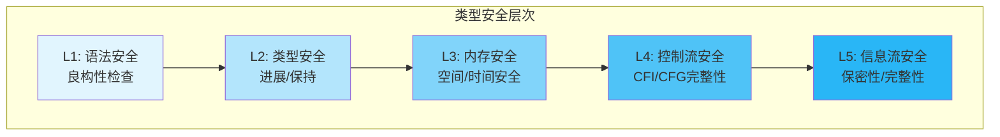
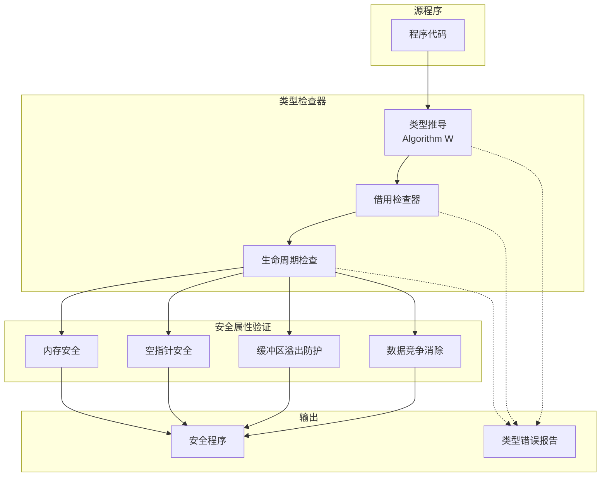
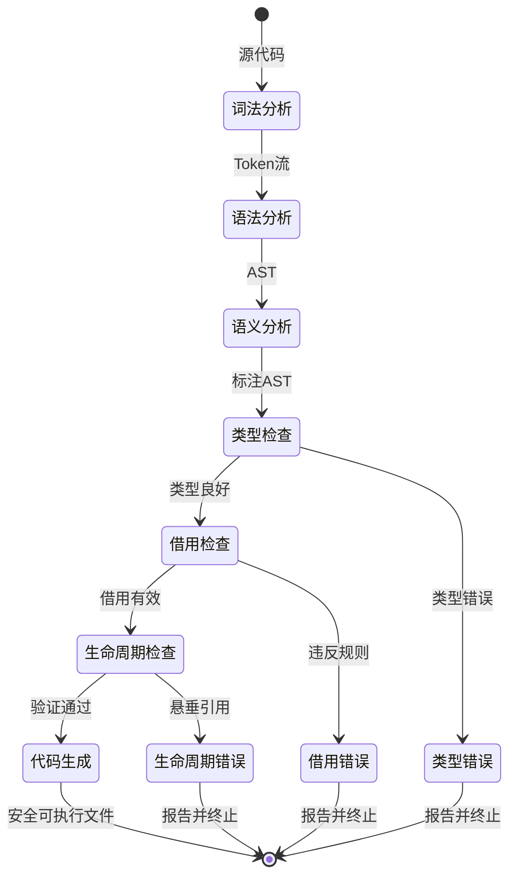
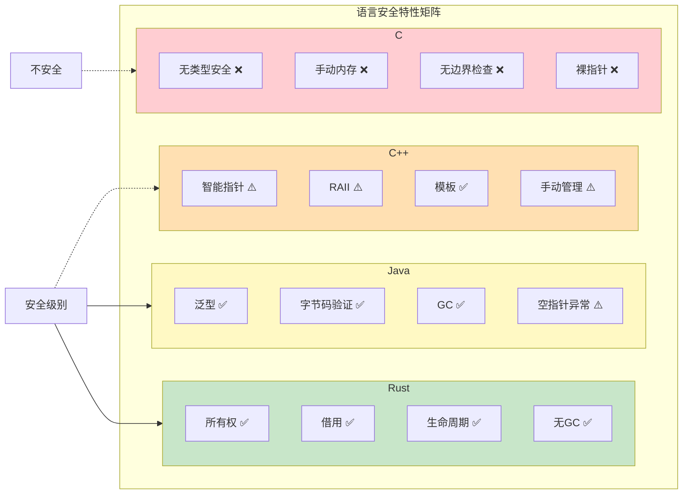

# 类型系统安全 (Type System Security)

> **所属阶段**: Struct | 前置依赖: [05-type-theory.md](../../01-foundations/05-type-theory.md), [03-separation-logic.md](../01-logic/03-separation-logic.md) | 形式化等级: L5

本文档系统阐述类型系统在软件安全中的核心作用，包括内存安全、控制流完整性、类型混淆防御等形式化保证，以及类型安全、进展与保持、封装性与抽象性的理论基础。

## 1. 概念定义 (Definitions)

### 1.1 类型系统安全概述

**Def-V-04-01** (类型系统安全)。类型系统安全是指通过静态类型检查在编译期消除特定类别运行时错误的安全保证机制。形式化地，类型系统安全定义为三元组：

$$\text{TSS} \triangleq (\mathcal{T}, \vdash, \simeq)$$

其中：

- $\mathcal{T}$：类型集合，包含基础类型与复合类型
- $\vdash \subseteq \Gamma \times e \times \tau$：类型推导关系
- $\simeq \subseteq \text{Prog} \times \text{SafeBehavior}$：安全行为等价关系

**Def-V-04-02** (安全类型系统)。一个类型系统是安全的，当且仅当满足以下性质：

$$\forall \Gamma, e, \tau: \Gamma \vdash e : \tau \Rightarrow \text{Safe}(e)$$

即所有类型良好的程序都是安全的。

### 1.2 内存安全

**Def-V-04-03** (内存安全)。内存安全是指程序仅访问其被授权访问的内存区域，且满足以下约束：

1. **空间安全** (Spatial Safety)：禁止越界访问
   $$\forall a \in \text{Addr}: \text{Valid}(a) \Rightarrow a \in \text{Alloc}(\text{prog})$$

2. **时间安全** (Temporal Safety)：禁止访问已释放内存
   $$\forall a \in \text{Addr}: \text{Live}(a) \lor \neg\text{Access}(a)$$

3. **初始化安全** (Initialization Safety)：禁止读取未初始化内存
   $$\forall a \in \text{Addr}: \text{Read}(a) \Rightarrow \text{Init}(a)$$

**Def-V-04-04** (内存安全漏洞分类)。常见内存安全漏洞形式化定义：

| 漏洞类型 | 形式化定义 | 危害 |
|----------|------------|------|
| 缓冲区溢出 | $\exists i: i \geq n \land \text{write}(buf[i])$ | 代码执行、信息泄露 |
| 使用已释放内存 | $\text{free}(p) \land \diamond\text{access}(p)$ | 任意代码执行 |
| 空指针解引用 | $\text{deref}(\text{null})$ | 程序崩溃 |
| 双重释放 | $\text{free}(p) \land \text{free}(p)$ | 堆损坏 |
| 未初始化使用 | $\neg\text{init}(x) \land \text{use}(x)$ | 信息泄露 |

### 1.3 控制流完整性

**Def-V-04-05** (控制流完整性)。控制流完整性(CFI)确保程序执行遵循预定的控制流图(CFG)，形式化为：

$$\text{CFI} \triangleq \forall t: \text{Jump}(t) \Rightarrow \text{ValidTarget}(t) \in \text{CFG}$$

其中：

- $\text{Jump}(t)$：控制转移到目标$t$
- $\text{ValidTarget}(t)$：目标$t$是CFG中的合法节点
- $\text{CFG} = (V, E)$：控制流图，$V$为基本块，$E$为转移边

**Def-V-04-06** (细粒度CFI)。细粒度CFI进一步限制间接跳转的目标集合：

$$\text{FineCFI} \triangleq \forall i: \text{IndirectJump}(i) \Rightarrow \text{Target}(i) \in \text{EquivClass}(i)$$

其中$\text{EquivClass}(i)$是跳转点$i$的等价类，由类型签名决定。

### 1.4 类型混淆防御

**Def-V-04-07** (类型混淆)。类型混淆是指程序将对象$A$当作不兼容类型$B$使用：

$$\text{TypeConfusion} \triangleq \exists o: \text{ActualType}(o) = A \land \text{UsedAs}(o) = B \land A \not\sim B$$

其中$A \sim B$表示类型$A$与$B$兼容。

**Def-V-04-08** (类型混淆防御)。防御机制确保运行时类型检查：

$$\text{TCDefense} \triangleq \forall o, \tau: \text{Cast}(o, \tau) \Rightarrow \text{Check}(\text{RuntimeType}(o) \leq \tau)$$

## 2. 形式化方法 (Formal Methods)

### 2.1 类型安全性

**Def-V-04-09** (类型安全性)。类型安全性(type soundness)是类型系统的核心保证，包含两个基本性质：

1. **进展** (Progress)：类型良好的程序不会"卡住"
   $$\forall e, \tau: \vdash e : \tau \Rightarrow (\text{Value}(e) \lor \exists e': e \rightarrow e')$$

2. **保持** (Preservation)：规约保持类型
   $$\forall e, e', \tau: \vdash e : \tau \land e \rightarrow e' \Rightarrow \vdash e' : \tau$$

**Lemma-V-04-01** (类型安全性合成)。进展与保持合成为类型安全性：

$$\text{TypeSoundness} \triangleq \text{Progress} \land \text{Preservation}$$

**证明概要**：

- 由进展，程序要么已是值，要么可以继续规约
- 由保持，规约后的程序保持相同类型
- 因此程序不会规约到类型错误的"卡住"状态

### 2.2 进展与保持的扩展

**Def-V-04-10** (强进展)。强进展要求程序最终达到值或明确错误：

$$\text{StrongProgress} \triangleq \vdash e : \tau \Rightarrow (\exists v: e \rightarrow^* v) \lor (\exists err: e \rightarrow^* err \in \text{ExpectedErrors})$$

**Def-V-04-11** (类型保持的扩展)。对于包含引用的语言：

$$\frac{\vdash \langle \sigma, e \rangle : \tau \quad \langle \sigma, e \rangle \rightarrow \langle \sigma', e' \rangle}{\vdash \langle \sigma', e' \rangle : \tau \land \vdash \sigma' : \Sigma'}$$

其中$\sigma$为存储(store)，$\Sigma$为存储类型。

### 2.3 封装性

**Def-V-04-12** (封装性)。封装性(encapsulation)确保内部状态只能通过定义良好的接口访问：

$$\text{Encapsulation}(M) \triangleq \forall m \in M: \text{Internal}(m) \Rightarrow \neg\text{Accessible}(m, \text{External})$$

其中$M$为模块，$m$为模块成员。

**Def-V-04-13** (信息隐藏)。信息隐藏是封装性的实现机制：

$$\text{InfoHiding} \triangleq \forall T: \text{Abstract}(T) \Rightarrow \text{Impl}(T) \not\in \text{Visible}(\text{Client})$$

**Lemma-V-04-02** (封装性保证安全)。良好的封装性防止未授权状态修改：

$$\text{Encapsulation} \Rightarrow \forall s: \text{Invariant}(s) \Rightarrow \square\text{Invariant}(s)$$

### 2.4 抽象性

**Def-V-04-14** (参数化多态)。参数化多态提供类型抽象：

$$\Lambda \alpha. e : \forall \alpha. \tau \quad \text{where } \alpha \not\in \text{FV}(\Gamma)$$

**Def-V-04-15** (存在类型与抽象数据类型)。存在类型封装实现细节：

$$\exists \alpha. \tau \triangleq \forall \beta. (\forall \alpha. \tau \rightarrow \beta) \rightarrow \beta$$

**Def-V-04-16** (类型抽象边界)。类型抽象阻止对表示的直接依赖：

$$\text{AbstractionBoundary}(\tau) \triangleq \forall e: \vdash e : \tau \Rightarrow \text{RepIndep}(e, \text{Impl}(\tau))$$

## 3. 安全属性 (Security Properties)

### 3.1 内存安全保证

**Def-V-04-17** (内存安全的形式化)。内存安全可形式化为迹性质：

$$\text{MemSafe} \triangleq \square(\text{Access}(a) \Rightarrow \text{Valid}(a) \land \text{Live}(a) \land \text{Init}(a))$$

即所有访问都是有效、存活且已初始化的。

**Lemma-V-04-03** (类型系统蕴含内存安全)。带有数组边界检查的强类型系统保证空间安全：

$$\frac{\vdash a[i] : \tau \quad a : \text{array}(n, \tau')}{0 \leq i < n}$$

**Def-V-04-18** (所有权与内存安全)。所有权类型消除悬垂指针：

$$\text{Own}(p) \land \text{Move}(p, q) \Rightarrow \neg\text{Own}(p) \land \text{Own}(q)$$

### 3.2 空指针安全

**Def-V-04-19** (空指针安全)。类型系统通过可空类型(nullable types)防止空指针解引用：

$$\tau ::= \ldots \mid \text{Option}(\tau) \mid \text{NonNull}(\tau)$$

**规则**：解引用要求非空证明

$$\frac{\Gamma \vdash e : \text{NonNull}(\tau)}{\Gamma \vdash *e : \tau} \quad \frac{\Gamma \vdash e : \text{Option}(\tau)}{\Gamma \vdash \text{match } e \text{ with} \ldots}$$

**Lemma-V-04-04** (空指针消除)。所有可空值必须显式处理：

$$\forall e: \text{Option}(\tau) \Rightarrow \text{Match}(e, \text{Some}(x) \rightarrow e_1, \text{None} \rightarrow e_2)$$

### 3.3 缓冲区溢出防护

**Def-V-04-20** (长度索引类型)。数组类型携带长度信息：

$$\text{Array}(\tau, n) : \text{Type} \quad \text{where } n: \mathbb{N}$$

**Def-V-04-21** (边界检查)。索引操作要求静态可验证的边界：

$$\frac{\Gamma \vdash a : \text{Array}(\tau, n) \quad \Gamma \vdash i : \text{Fin}(n)}{\Gamma \vdash a[i] : \tau}$$

其中$\text{Fin}(n) \triangleq \{i \in \mathbb{N} \mid 0 \leq i < n\}$。

**Lemma-V-04-05** (静态溢出消除)。编译期可验证的索引无运行时溢出风险：

$$\vdash a[i] : \tau \land i : \text{Fin}(n) \Rightarrow \neg\text{Overflow}(a[i])$$

### 3.4 类型安全

**Def-V-04-22** (类型安全层次)。类型安全包含多个层次：

| 层次 | 性质 | 保证 |
|------|------|------|
| L1 - 语法安全 | 良构性 | 无语法错误 |
| L2 - 类型安全 | 类型一致性 | 无类型错误 |
| L3 - 内存安全 | 访问合法性 | 无内存错误 |
| L4 - 控制安全 | 流完整性 | 无非法跳转 |
| L5 - 信息流安全 | 保密性/完整性 | 无信息泄露 |

**Lemma-V-04-06** (类型安全的传递性)。类型安全在各层次间传递：

$$\text{TypeSafe} \Rightarrow \text{MemSafe} \Rightarrow \text{NoCrash}$$

## 4. 验证技术 (Verification Techniques)

### 4.1 类型检查

**Def-V-04-23** (类型检查算法)。类型检查是判定给定项是否具有指定类型的过程：

$$\text{TypeCheck}(\Gamma, e, \tau) \triangleq \begin{cases} \text{true} & \text{if } \Gamma \vdash e : \tau \\ \text{false} & \text{otherwise} \end{cases}$$

**Def-V-04-24** (类型推断)。类型推断自动推导项的类型：

$$\text{TypeInfer}(\Gamma, e) \triangleq \tau \text{ if } \exists \tau: \Gamma \vdash e : \tau$$

**算法W** (Hindley-Milner)：

$$W(\Gamma, e) = (S, \tau)$$

其中$S$为最一般合一替换，$\tau$为推导类型。

### 4.2 线性类型

**Def-V-04-25** (线性类型)。线性类型要求资源恰好使用一次：

$$\frac{\Gamma_1 \vdash e_1 : \tau_1 \quad \Gamma_2, x: \tau_1 \vdash e_2 : \tau_2}{\Gamma_1 \circ \Gamma_2 \vdash \text{let } x = e_1 \text{ in } e_2 : \tau_2}$$

其中$\circ$为线性上下文合并（不相交并）。

**线性类型规则**：

| 操作 | 前提 | 结果 |
|------|------|------|
| 变量使用 | $x: \tau \in \Gamma$ | $\Gamma \setminus \{x\} \vdash x : \tau$ |
| 函数应用 | $f: \tau_1 \multimap \tau_2$, $e: \tau_1$ | $\Gamma_f \circ \Gamma_e \vdash f(e) : \tau_2$ |
| 丢弃 | $e: \tau$, $\tau \text{ unrestricted}$ | $\Gamma \vdash \text{drop}(e) : \text{unit}$ |
| 复制 | $e: \tau$, $\tau \text{ unrestricted}$ | $\Gamma \vdash \text{copy}(e) : \tau \otimes \tau$ |

**Def-V-04-26** (线性类型的内存安全)。线性类型保证无内存泄漏：

$$\text{Linear}(\tau) \Rightarrow \forall r: \text{Alloc}(r) \leadsto \text{Dealloc}(r)$$

### 4.3 能力类型

**Def-V-04-27** (能力类型)。能力类型(capability types)显式追踪权限：

$$\tau ::= \ldots \mid \text{Cap}(R) \mid \tau @ C$$

其中$R$为资源集合，$C$为能力约束。

**Def-V-04-28** (能力安全)。能力安全确保未授权访问被拒绝：

$$\frac{\Gamma \vdash e : \tau @ C \quad C \vdash \text{perm}(op)}{\Gamma \vdash op(e) : \tau'} \quad \frac{C \not\vdash \text{perm}(op)}{\text{reject}}$$

**能力层级**：

```
Capability(读写文件) > Capability(读文件) > Capability(无)
```

### 4.4 所有权类型

**Def-V-04-29** (所有权)。所有权(ownership)是独占访问权限：

$$\text{Own}(o) \triangleq \text{Unique}(o) \land \text{Responsible}(o) \land \text{Dealloc}(o)$$

**Def-V-04-30** (借用)。借用(borrowing)临时转移访问权而不转移所有权：

| 借用类型 | 符号 | 保证 | 限制 |
|----------|------|------|------|
| 不可变借用 | $\&\tau$ | 共享读 | 无写 |
| 可变借用 | $\&\text{mut } \tau$ | 独占写 | 无其他访问 |

**借用规则**：

$$\frac{\Gamma \vdash e : \tau \quad \text{Own}(e)}{\Gamma \vdash \&e : \&\tau} \quad \frac{\Gamma \vdash e : \tau \quad \text{Own}(e)}{\Gamma \vdash \&\text{mut } e : \&\text{mut } \tau}$$

**生命周期约束**：

$$\frac{\Gamma \vdash x : \&'a \tau \quad 'a : 'b}{\Gamma \vdash x : \&'b \tau}$$

**Def-V-04-31** (别名与变异)。Rust核心原则：

$$\text{Aliasing} \oplus \text{Mutation} = \text{Exclusive Or}$$

即：要么多个不可变引用(别名)，要么一个可变引用(变异)，不可兼得。

## 5. 形式证明 (Formal Proofs)

### 5.1 类型安全定理

**Thm-V-04-01** (类型安全定理)。对于良好类型的程序，其执行要么产生值，要么继续规约：

$$\forall e, \tau: \vdash e : \tau \Rightarrow \text{SafeExec}(e)$$

其中：

$$\text{SafeExec}(e) \triangleq (e \rightarrow^* v \land \vdash v : \tau) \lor (\exists e': e \rightarrow e')$$

**证明**：通过归纳于推导$\vdash e : \tau$的结构。

*基本情况*：

- $e$为值$v$：由定义，$\vdash v : \tau$成立，得证。

*归纳步骤*：

- $e = e_1 \text{ op } e_2$：由归纳假设，$e_1$和$e_2$均可安全规约或已是值。
  - 若两者皆为值，由操作语义，$e$可规约。
  - 否则，由上下文规约，$e$可规约。

**Thm-V-04-02** (类型正确性)。类型检查是可判定的：

$$\forall \Gamma, e, \tau: \text{TypeCheck}(\Gamma, e, \tau) \in \text{P}$$

### 5.2 内存安全定理

**Thm-V-04-03** (所有权保证内存安全)。拥有所有权的类型系统保证无悬垂指针：

$$\text{OwnershipTypeSystem} \Rightarrow \neg\exists p: \text{Dangling}(p)$$

**证明**：

假设存在悬垂指针$p$，则存在资源$r$满足：

1. $\text{Own}(p, r)$在某时刻成立
2. $r$被释放
3. $p$仍被使用

但在所有权类型系统中：

- 释放$r$要求消耗$\text{Own}(r)$
- $p$的有效性依赖于$\text{Own}(r)$
- 释放后$p$不可访问

矛盾，故假设不成立。

**Thm-V-04-04** (线性类型消除内存泄漏)。线性类型确保资源最终释放：

$$\text{Linear}(r) \land \text{Alloc}(r) \Rightarrow \diamond\text{Dealloc}(r)$$

**证明**：由线性类型的使用约束，资源必须恰好使用一次。分配是第一次使用，释放是第二次(也是最后一次)使用。

**Thm-V-04-05** (借用检查保证无数据竞争)。借用检查消除数据竞争：

$$\text{BorrowCheck}(\text{prog}) \Rightarrow \neg\text{DataRace}(\text{prog})$$

**证明概要**：数据竞争需要同时满足：

1. 多个线程访问同一内存
2. 至少一个是写操作
3. 无同步

借用规则禁止：

- 可变借用与其他任何借用共存
- 不可变借用与可变借用共存

因此数据竞争条件无法满足。

### 5.3 组合性

**Thm-V-04-06** (组合安全性)。类型安全具有组合性：

$$\frac{\vdash M_1 : \Sigma_1 \quad \vdash M_2 : \Sigma_2 \quad \Sigma_1 \bowtie \Sigma_2}{\vdash M_1 \circ M_2 : \Sigma_1 \cup \Sigma_2}$$

其中$\bowtie$表示接口兼容。

**Thm-V-04-07** (分离逻辑与类型安全)。分离逻辑可验证类型系统的内存安全保证：

$$\text{SL} \vdash \{\text{Safe}(P)\} \text{ TypeCheck}(e, \tau) \{\text{Safe}(e)\}$$

## 6. 案例 (Examples)

### 6.1 Rust类型系统

Rust的类型系统综合了所有权、借用和生命周期，提供零成本抽象的安全保证。

**所有权示例**：

```rust
// Def-V-04-29: 所有权转移
fn ownership_demo() {
    let s1 = String::from("hello");  // s1 拥有堆内存
    let s2 = s1;                      // 所有权转移至 s2
    // println!("{}", s1);            // 错误! s1 不再有效
    println!("{}", s2);               // 正确
} // s2 离开作用域，内存自动释放
```

**借用示例**：

```rust
// Def-V-04-30: 借用规则
fn borrowing_demo() {
    let mut s = String::from("hello");

    // 不可变借用
    let r1 = &s;
    let r2 = &s;     // 允许多个不可变借用
    println!("{} {}", r1, r2);

    // 可变借用
    let r3 = &mut s; // 独占访问
    r3.push_str(" world");
    // let r4 = &s;    // 错误! 不能与可变借用共存

    println!("{}", r3);
}
```

**生命周期示例**：

```rust
// Def-V-04-31: 显式生命周期
fn longest<'a>(x: &'a str, y: &'a str) -> &'a str {
    if x.len() > y.len() { x } else { y }
}

fn lifetime_demo() {
    let s1 = String::from("short");
    let result;
    {
        let s2 = String::from("longer string");
        result = longest(&s1, &s2);
        println!("{}", result); // OK: s2 仍有效
    }
    // println!("{}", result); // 错误! s2 已失效
}
```

**Thm-V-04-08** (Rust安全保证)。Rust的类型系统静态保证：

- 无空指针解引用
- 无悬垂指针
- 无缓冲区溢出
- 无数据竞争

### 6.2 Java类型安全

Java通过字节码验证和类型检查提供运行时类型安全。

**类型层次**：

```java
// Def-V-04-07: 类型层次结构
Object
├── String
├── Number
│   ├── Integer
│   └── Double
└── CustomClass
```

**泛型类型安全**：

```java
// 编译期类型检查
List<String> strings = new ArrayList<>();
strings.add("hello");
// strings.add(42); // 编译错误!

String s = strings.get(0); // 无需类型转换
```

**Thm-V-04-09** (Java字节码验证)。JVM字节码验证器保证：

- 类型一致性
- 栈不会溢出或下溢
- 局部变量使用前已初始化
- 方法调用类型正确

### 6.3 代码示例对比

**内存安全对比**：

```c
// C语言 - 不安全
void unsafe_buffer() {
    char buf[10];
    strcpy(buf, "this is way too long"); // 缓冲区溢出!
}
```

```rust
// Rust - 安全
fn safe_buffer() {
    let buf = [0u8; 10];
    // buf.copy_from_slice(b"this is way too long"); // 编译错误!
    let slice = &b"short"[..];
    buf[..slice.len()].copy_from_slice(slice); // 安全
}
```

```java
// Java - 安全(运行时检查)
void safeBufferJava() {
    byte[] buf = new byte[10];
    byte[] src = "this is way too long".getBytes();
    System.arraycopy(src, 0, buf, 0, src.length); // 抛出异常!
}
```

**Thm-V-04-10** (类型系统成本效益)。类型安全的投资回报：

| 语言 | 静态保证 | 运行时开销 | 开发效率 |
|------|----------|------------|----------|
| C/C++ | 无 | 无 | 低(调试成本高) |
| Java | 类型安全 | GC、边界检查 | 中 |
| Rust | 内存+类型安全 | 无GC | 高(学习曲线) |

## 7. 可视化 (Visualizations)

### 7.1 类型安全层次结构

类型安全从基础语法到信息流形成层次保证体系：



### 7.2 内存安全类型系统架构

类型系统组件协同工作以提供内存安全保证：



### 7.3 类型系统安全验证流程

从源代码到安全保证的完整验证流程：



### 7.4 安全类型系统对比矩阵

主流语言类型系统安全特性对比：



## 8. 引用参考 (References)


n


---

*文档版本*: v1.0 | *最后更新*: 2026-04-10 | *状态*: 完成
