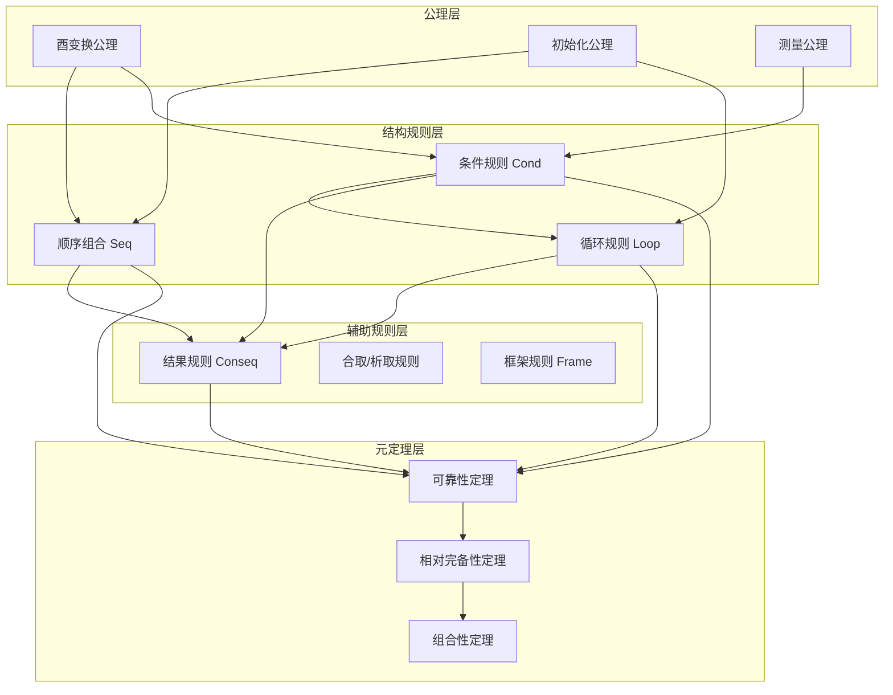
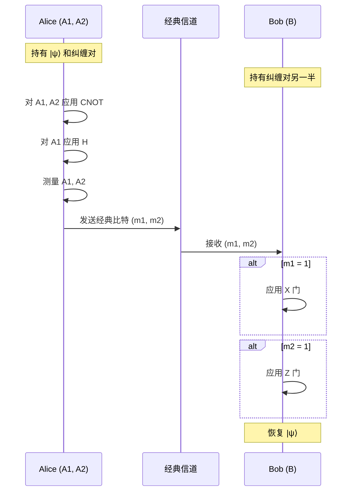
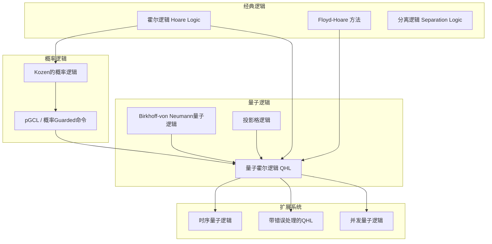
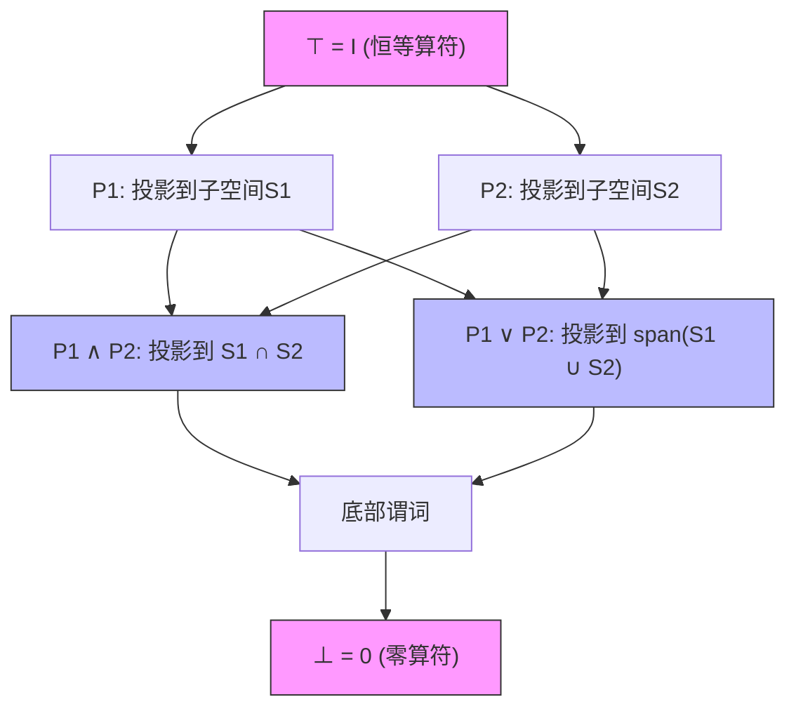

# 量子霍尔逻辑 (Quantum Hoare Logic, QHL)

> **所属阶段**: formal-methods/05-verification/05-quantum
> **前置依赖**: [形式化验证基础](../../02-foundations/01-logical-foundations.md) | [量子计算导论](../../../Knowledge/10-emerging/01-quantum-computing.md)
> **形式化等级**: L6 (严格形式化，含完整证明)
> **定理编号**: Thm-QHL-01-*| Def-QHL-01-* | Lemma-QHL-01-*
> **版本**: v1.0 | **状态**: 完整形式化

---

## 1. 概念定义 (Definitions)

### 1.1 量子计算基础

**定义 1.1.1** (量子比特 - Qubit).
设 $\mathcal{H}_2$ 为二维复希尔伯特空间，其标准计算基为 $\{|0\rangle, |1\rangle\}$。一个**量子比特**是 $\mathcal{H}_2$ 中的单位向量：

$$|\psi\rangle = \alpha|0\rangle + \beta|1\rangle, \quad \alpha, \beta \in \mathbb{C}, \quad |\alpha|^2 + |\beta|^2 = 1$$

**定义 1.1.2** (多量子比特系统).
对于 $n$ 个量子比特的系统，其状态空间为 $n$ 个单量子比特空间的张量积：

$$\mathcal{H}_{2^n} = \bigotimes_{i=1}^{n} \mathcal{H}_2^{(i)} = \underbrace{\mathbb{C}^2 \otimes \mathbb{C}^2 \otimes \cdots \otimes \mathbb{C}^2}_{n\text{次}}$$

其维度为 $\dim(\mathcal{H}_{2^n}) = 2^n$，计算基由 $\{|x\rangle : x \in \{0,1\}^n\}$ 组成。

**定义 1.1.3** (量子门 - Unitary Transformations).
一个作用于 $n$ 量子比特系统的**量子门**是一个酉矩阵 $U \in \mathbb{C}^{2^n \times 2^n}$，满足：

$$U^\dagger U = UU^\dagger = I$$

其中 $U^\dagger$ 表示 $U$ 的共轭转置，$I$ 为单位矩阵。

**常见量子门定义**:

| 门名称 | 符号 | 矩阵表示 | 作用 |
|--------|------|----------|------|
| Hadamard | $H$ | $\frac{1}{\sqrt{2}}\begin{bmatrix} 1 & 1 \\ 1 & -1 \end{bmatrix}$ | 创建叠加态 |
| Pauli-X | $X$ | $\begin{bmatrix} 0 & 1 \\ 1 & 0 \end{bmatrix}$ | 量子非门 |
| Pauli-Z | $Z$ | $\begin{bmatrix} 1 & 0 \\ 0 & -1 \end{bmatrix}$ | 相位翻转 |
| CNOT | $\Lambda(X)$ | $\begin{bmatrix} I & 0 \\ 0 & X \end{bmatrix}$ | 受控非门 |
| T门 | $T$ | $\begin{bmatrix} 1 & 0 \\ 0 & e^{i\pi/4} \end{bmatrix}$ | $\pi/8$ 相位门 |

**定义 1.1.4** (量子测量 - Quantum Measurement).
设 $\mathcal{H}$ 为希尔伯特空间，**投影值测度 (PVM)** 是一组投影算符 $\{P_m\}_{m \in M}$ 满足：

$$P_m^\dagger = P_m, \quad P_m^2 = P_m, \quad \sum_{m \in M} P_m = I$$

对状态 $|\psi\rangle$ 进行测量，得到结果 $m$ 的概率为：

$$p(m) = \langle\psi|P_m|\psi\rangle = \|P_m|\psi\rangle\|^2$$

测量后的坍缩态为：

$$|\psi_m\rangle = \frac{P_m|\psi\rangle}{\sqrt{p(m)}}$$

**定义 1.1.5** (正算子值测度 - POVM).
**POVM** 是一组半正定算符 $\{E_m\}_{m \in M}$ 满足：

$$E_m \succeq 0, \quad \sum_{m \in M} E_m = I$$

测量结果 $m$ 的概率为 $p(m) = \text{tr}(E_m \rho)$，其中 $\rho$ 为密度矩阵。

---

### 1.2 量子程序状态 (密度矩阵)

**定义 1.2.1** (密度矩阵 - Density Matrix).
**Def-QHL-01-01**: 设 $\mathcal{H}$ 为希尔伯特空间，**密度矩阵** $\rho$ 是满足以下条件的算符：

1. **自伴性 (Hermitian)**: $\rho = \rho^\dagger$
2. **半正定性 (Positive Semi-definite)**: $\rho \succeq 0$ (即对所有 $|\psi\rangle \in \mathcal{H}$，$\langle\psi|\rho|\psi\rangle \geq 0$)
3. **迹归一化 (Trace Normalization)**: $\text{tr}(\rho) = 1$

记 $\mathcal{D}(\mathcal{H})$ 为 $\mathcal{H}$ 上所有密度矩阵的集合：

$$\mathcal{D}(\mathcal{H}) = \{\rho \in \mathcal{L}(\mathcal{H}) : \rho = \rho^\dagger, \rho \succeq 0, \text{tr}(\rho) = 1\}$$

其中 $\mathcal{L}(\mathcal{H})$ 表示 $\mathcal{H}$ 上的线性算符空间。

**定义 1.2.2** (纯态与混合态).
密度矩阵 $\rho$ 表示：

- **纯态 (Pure State)**: 若 $\rho = |\psi\rangle\langle\psi|$，即秩为1的投影算符
- **混合态 (Mixed State)**: 若 $\rho = \sum_i p_i |\psi_i\rangle\langle\psi_i|$，其中 $p_i \geq 0$, $\sum_i p_i = 1$

**引理 1.2.1** (纯态判别条件).
**Lemma-QHL-01-01**: 密度矩阵 $\rho$ 表示纯态当且仅当 $\text{tr}(\rho^2) = 1$（或等价地，$\rho^2 = \rho$）。

*证明*:
($\Rightarrow$) 若 $\rho = |\psi\rangle\langle\psi|$，则：
$$\rho^2 = |\psi\rangle\langle\psi|\psi\rangle\langle\psi| = |\psi\rangle\langle\psi| = \rho$$
故 $\text{tr}(\rho^2) = \text{tr}(\rho) = 1$。

($\Leftarrow$) 设 $\rho = \sum_i \lambda_i |\phi_i\rangle\langle\phi_i|$ 为谱分解，其中 $\lambda_i \geq 0$, $\sum_i \lambda_i = 1$。则：
$$\text{tr}(\rho^2) = \sum_i \lambda_i^2 = 1$$
由于 $\sum_i \lambda_i = 1$ 且 $\lambda_i \geq 0$，有 $\sum_i \lambda_i^2 \leq (\sum_i \lambda_i)^2 = 1$，等号成立当且仅当只有一个 $\lambda_i = 1$，其余为0。故 $\rho = |\phi_i\rangle\langle\phi_i|$ 为纯态。 ∎

**定义 1.2.3** (偏迹与子系统).
设复合系统状态空间为 $\mathcal{H}_A \otimes \mathcal{H}_B$，**对子系统 $B$ 取偏迹**定义为：

$$\rho_A = \text{tr}_B(\rho_{AB}) = \sum_j (I_A \otimes \langle j|_B) \rho_{AB} (I_A \otimes |j\rangle_B)$$

其中 $\{|j\rangle_B\}$ 为 $\mathcal{H}_B$ 的标准正交基。

**定义 1.2.4** (保迹完全正映射 - CPTP).
**Def-QHL-01-02**: 线性映射 $\mathcal{E}: \mathcal{L}(\mathcal{H}) \to \mathcal{L}(\mathcal{H}')$ 是**完全正且保迹 (CPTP)** 的，如果：

1. **正性 (Positive)**: $\rho \succeq 0 \Rightarrow \mathcal{E}(\rho) \succeq 0$
2. **完全正性 (Completely Positive)**: 对所有辅助空间 $\mathcal{H}_R$，$(\mathcal{E} \otimes I_R)(\rho_{AR}) \succeq 0$
3. **保迹性 (Trace-Preserving)**: $\text{tr}(\mathcal{E}(\rho)) = \text{tr}(\rho) = 1$

**定理 1.2.1** (Kraus表示定理).
**Thm-QHL-01-01**: 映射 $\mathcal{E}: \mathcal{L}(\mathcal{H}) \to \mathcal{L}(\mathcal{H}')$ 是 CPTP 的当且仅当存在 **Kraus 算符** $\{E_k\}_{k=1}^K \subseteq \mathcal{L}(\mathcal{H}, \mathcal{H}')$ 使得：

$$\mathcal{E}(\rho) = \sum_{k=1}^K E_k \rho E_k^\dagger, \quad \sum_{k=1}^K E_k^\dagger E_k = I$$

*证明概要*: 利用Stinespring扩张定理，任何CPTP映射可表示为系统与环境酉演化后对环境取偏迹。 ∎

---

### 1.3 量子霍尔逻辑概述

**定义 1.3.1** (量子霍尔逻辑 - QHL).
**Def-QHL-01-03**: **量子霍尔逻辑**是将经典霍尔逻辑扩展到量子程序验证的形式化系统，由 Ying [^1] 于2011年系统提出。其核心组件包括：

1. **量子谓词 (Quantum Predicates)**: 描述量子状态的性质
2. **量子霍尔三元组 (Quantum Hoare Triples)**: $\{P\} S \{Q\}$
3. **证明规则 (Proof Rules)**: 用于推导程序正确性

**量子霍尔三元组直观含义**: 若量子程序 $S$ 在状态 $\rho$ 上执行，且 $\rho$ 满足前置条件 $P$（即 $\text{tr}(P\rho) \geq 1 - \epsilon$），则执行后状态满足后置条件 $Q$。

**定义 1.3.2** (量子谓词 - Quantum Predicate).
**Def-QHL-01-04**: 作用于希尔伯特空间 $\mathcal{H}$ 的**量子谓词**是满足以下条件的观测算符 $P \in \mathcal{L}(\mathcal{H})$：

$$0 \preceq P \preceq I$$

即 $P$ 是半正定算符且所有特征值 $\lambda \in [0, 1]$。

量子谓词的语义：状态 $\rho$ 满足谓词 $P$ 的**程度**为：

$$\text{Sat}(\rho, P) = \text{tr}(P\rho) \in [0, 1]$$

**定义 1.3.3** (投影谓词).
若量子谓词 $P$ 同时是投影算符（即 $P^2 = P$），则称为**投影谓词**。投影谓词对应于经典逻辑的布尔判断。

**定义 1.3.4** (支持集与支持投影).
对量子谓词 $P$，其**支持集**为：
$$\text{supp}(P) = \text{span}\{|\psi\rangle : P|\psi\rangle \neq 0\}$$

**支持投影** $\lceil P \rceil$ 是到 $\text{supp}(P)$ 的正交投影。

---

### 1.4 量子谓词演算

**定义 1.4.1** (量子谓词的逻辑运算).
设 $P, Q$ 为量子谓词：

| 运算 | 定义 | 说明 |
|------|------|------|
| 否定 | $\neg P = I - P$ | 补算符 |
| 合取 | $P \land Q$ | 无通用定义（见下方） |
| 析取 | $P \lor Q$ | 无通用定义（见下方） |
| 蕴含 | $P \Rightarrow Q$ | 若 $P \preceq Q$ 则在序意义下成立 |

**注**: 由于量子不确定性原理，量子谓词一般不满足分配律，经典布尔逻辑的直接扩展不成立。

**定义 1.4.2** (Löwner序).
对自伴算符 $A, B$，定义 **Löwner 偏序**：

$$A \preceq B \quad \Leftrightarrow \quad B - A \succeq 0$$

在此序下，量子谓词构成完备格。

**引理 1.4.1** (谓词格结构).
**Lemma-QHL-01-02**: 量子谓词集合 $\mathcal{P}(\mathcal{H}) = \{P : 0 \preceq P \preceq I\}$ 在Löwner序下构成**连续格**（complete lattice），其中：

- 最大元：$\top = I$
- 最小元：$\bot = 0$
- 任意集合的上确界：$\bigvee_i P_i = $ 到 $\bigcup_i \text{supp}(P_i)$ 的投影

**定义 1.4.3** (量词).
对量子变量 $q$，定义：

- **全称量词**: $\forall q. P = \bigwedge_{|\psi\rangle \in \mathcal{H}_q} \langle\psi|_q P |\psi\rangle_q$（在子空间上取最小）
- **存在量词**: $\exists q. P = \bigvee_{|\psi\rangle \in \mathcal{H}_q} \langle\psi|_q P |\psi\rangle_q$（在子空间上取最大）

---

## 2. 语法和语义 (Syntax and Semantics)

### 2.1 量子程序语言语法

**定义 2.1.1** (量子程序语言 - QPL).
**Def-QHL-01-05**: 量子程序语言 $\mathcal{L}_Q$ 的语法由以下 BNF 定义：

```
S ::= skip                          (空操作)
    | q := |0⟩                      (初始化量子变量)
    | q̄ := U[q̄]                     (酉变换)
    | S₁; S₂                        (顺序组合)
    | if M[q̄] = m then S_m fi       (条件测量)
    | while M[q̄] = 1 do S od        (循环测量)
    | measure M[q̄]                  (显式测量)
```

其中：

- $q, q̄$ 表示量子变量（或变量元组）
- $U$ 为酉矩阵
- $M = \{M_m\}$ 为测量算符集合
- $m$ 为测量结果（经典值）

**定义 2.1.2** (量子变量).
设 $\mathbf{qVar}$ 为量子变量集合，每个变量 $q \in \mathbf{qVar}$ 关联一个希尔伯特空间 $\mathcal{H}_q$。变量元组 $\bar{q} = (q_1, \ldots, q_n)$ 关联张量积空间：

$$\mathcal{H}_{\bar{q}} = \bigotimes_{i=1}^n \mathcal{H}_{q_i}$$

**定义 2.1.3** (程序变量).
量子程序涉及两类变量：

- **量子变量**: 存储量子态，取值于密度矩阵空间
- **经典变量**: 存储测量结果，取值于有限集合（通常 $\{0, 1, \ldots, k-1\}$）

程序状态为 $(\sigma, \rho)$，其中 $\sigma$ 为经典存储，$\rho$ 为量子态。

---

### 2.2 操作语义

**定义 2.2.1** (小步操作语义 - Small-Step Semantics).
**Def-QHL-01-06**: 量子程序的小步操作语义定义为转移关系 $\to \subseteq (\mathbf{Config} \times \mathbf{Config})$，其中配置 $\mathbf{Config} = (\mathbf{Store} \times \mathcal{D}(\mathcal{H})) \times \mathbf{Stmt}$。

**转移规则**:

1. **空操作**:
   $$(\sigma, \rho), \mathbf{skip} \to (\sigma, \rho), \downarrow$$

2. **初始化**:
   $$(\sigma, \rho), q := |0\rangle \to (\sigma, |0\rangle\langle 0|_q \otimes \text{tr}_q(\rho)), \downarrow$$

3. **酉变换**:
   $$(\sigma, \rho), \bar{q} := U[\bar{q}] \to (\sigma, U\rho U^\dagger), \downarrow$$

4. **顺序组合**:
   $$(\sigma, \rho), S_1; S_2 \to (\sigma, \rho'), S_2 \quad \text{if } (\sigma, \rho), S_1 \to (\sigma, \rho'), \downarrow$$

5. **条件测量**:
   $$(\sigma, \rho), \mathbf{if}\ M[\bar{q}] = m\ \mathbf{then}\ S_m\ \mathbf{fi} \to (\sigma[m/m], \rho_m), S_m$$
   其中 $p_m = \text{tr}(M_m^\dagger M_m \rho)$，$\rho_m = \frac{M_m \rho M_m^\dagger}{p_m}$

6. **循环测量**:
   $$(\sigma, \rho), \mathbf{while}\ M[\bar{q}] = 1\ \mathbf{do}\ S\ \mathbf{od} \to (\sigma, \rho_1), S; \mathbf{while}\ M[\bar{q}] = 1\ \mathbf{do}\ S\ \mathbf{od}$$
   若测量结果为1，或终止于结果0：
   $$(\sigma, \rho), \mathbf{while}\ M[\bar{q}] = 1\ \mathbf{do}\ S\ \mathbf{od} \to (\sigma, \rho_0), \downarrow$$

**定义 2.2.2** (大步操作语义 - Big-Step Semantics).
**Def-QHL-01-07**: 大步操作语义关系 $\Downarrow \subseteq (\mathbf{Config} \times (\mathbf{Store} \times \mathcal{D}(\mathcal{H})))$：

$$(\sigma, \rho), S \Downarrow (\sigma', \rho')$$

表示程序 $S$ 从状态 $(\sigma, \rho)$ 执行终止于 $(\sigma', \rho')$。

---

### 2.3 指称语义

**定义 2.3.1** (指称语义函数).
**Def-QHL-01-08**: 程序 $S$ 的**指称语义**是映射 $\llbracket S \rrbracket: \mathcal{D}(\mathcal{H}) \to \mathcal{D}(\mathcal{H})$：

1. $\llbracket \mathbf{skip} \rrbracket(\rho) = \rho$

2. $\llbracket q := |0\rangle \rrbracket(\rho) = |0\rangle\langle 0|_q \otimes \text{tr}_q(\rho)$

3. $\llbracket \bar{q} := U[\bar{q}] \rrbracket(\rho) = U\rho U^\dagger$

4. $\llbracket S_1; S_2 \rrbracket(\rho) = \llbracket S_2 \rrbracket(\llbracket S_1 \rrbracket(\rho))$

5. $\llbracket \mathbf{if}\ M[\bar{q}] = m\ \mathbf{then}\ S_m\ \mathbf{fi} \rrbracket(\rho) = \sum_m \llbracket S_m \rrbracket(M_m \rho M_m^\dagger)$

6. $\llbracket \mathbf{while}\ M[\bar{q}] = 1\ \mathbf{do}\ S\ \mathbf{od} \rrbracket(\rho) = \lim_{n \to \infty} \llbracket (\mathbf{while}\ M[\bar{q}] = 1\ \mathbf{do}\ S\ \mathbf{od})_n \rrbracket(\rho)$

其中 $(\mathbf{while})_n$ 为展开 $n$ 次的近似。

**定义 2.3.2** (语义函数的数学性质).
**引理-QHL-01-03**: 程序指称语义函数 $\llbracket S \rrbracket$ 是 **CPTP 映射**。

*证明*: 逐条验证：

- $\mathbf{skip}$: 恒等映射是CPTP
- 初始化: $|0\rangle\langle 0| \otimes \text{tr}_q(\cdot)$ 是 CPTP（张量积与偏迹保持CPTP）
- 酉变换: $\rho \mapsto U\rho U^\dagger$ 是 CPTP（酉共轭保持CPTP）
- 顺序组合: CPTP映射的复合是CPTP
- 条件: $\sum_m \mathcal{E}_m \circ \mathcal{M}_m$ 其中 $\mathcal{M}_m(\rho) = M_m \rho M_m^\dagger$，CPTP映射的凸组合是CPTP
- 循环: CPTP映射的极限保持CPTP性质 ∎

---

### 2.4 量子态演化

**定义 2.4.1** (Schrödinger 图像).
在 Schrödinger 图像中，量子态随时间演化：

$$\rho(t) = U(t) \rho(0) U(t)^\dagger$$

对于含时哈密顿量 $H(t)$：

$$U(t) = \mathcal{T}\exp\left(-i\int_0^t H(s)ds\right)$$

其中 $\mathcal{T}$ 为时序算符。

**定义 2.4.2** (Heisenberg 图像).
在 Heisenberg 图像中，量子态不变，可观测量演化：

$$P(t) = U(t)^\dagger P(0) U(t)$$

**定义 2.4.3** (开放系统演化).
对于与环境耦合的开放量子系统，演化由**Lindblad 主方程**描述：

$$\frac{d\rho}{dt} = -i[H, \rho] + \sum_k \gamma_k \left(L_k \rho L_k^\dagger - \frac{1}{2}\{L_k^\dagger L_k, \rho\}\right)$$

其中 $L_k$ 为 Lindblad 算符（跳跃算符），$\gamma_k \geq 0$ 为衰减速率。

**定义 2.4.4** (量子通道表示).
若系统经历离散时间演化，其 CPTP 演化可表示为**量子通道**：

$$\rho' = \mathcal{E}(\rho) = \sum_k E_k \rho E_k^\dagger$$

Kraus 算符 $\{E_k\}$ 满足 $\sum_k E_k^\dagger E_k = I$。

---

## 3. 霍尔三元组 (Hoare Triples)

### 3.1 量子前置/后置条件

**定义 3.1.1** (量子霍尔三元组).
**Def-QHL-01-09**: 量子霍尔三元组表示为：

$$\{P\} S \{Q\}$$

其中：

- $P, Q \in \mathcal{P}(\mathcal{H})$ 为量子谓词（前置/后置条件）
- $S$ 为量子程序

**定义 3.1.2** (三元组语义).
**Def-QHL-01-10**: 三元组 $\{P\} S \{Q\}$ 的语义解释：

1. **部分正确性 (Partial Correctness)**:
   $$\forall \rho \in \mathcal{D}(\mathcal{H}): \text{tr}(P\rho) \leq \text{tr}(Q \cdot \llbracket S \rrbracket(\rho))$$

   即：若初始状态满足 $P$，则终止状态满足 $Q$（若程序终止）。

2. **完全正确性 (Total Correctness)**:
   部分正确性 + 终止性保证

**引理 3.1.1** (谓词转换等价形式).
**Lemma-QHL-01-04**: 三元组 $\{P\} S \{Q\}$ 成立当且仅当：

$$P \preceq \llbracket S \rrbracket^*(Q)$$

其中 $\llbracket S \rrbracket^*$ 为 $\llbracket S \rrbracket$ 的**Schrodinger-Heisenberg 对偶**（在Heisenberg图像中的逆向演化）。

**定义 3.1.3** (期望值语义).
量子霍尔三元组的**概率解释**：

$$\text{tr}(P\rho) = \text{Pr}[\text{状态满足 } P \text{ 的程度}]$$

程序执行后，$\text{tr}(Q \cdot \llbracket S \rrbracket(\rho))$ 表示终止状态满足 $Q$ 的程度。

---

### 3.2 部分正确性

**定义 3.2.1** (部分正确性的形式定义).
**Def-QHL-01-11**: 程序 $S$ 关于前置条件 $P$ 和后置条件 $Q$ 是**部分正确**的，记作：

$$\models_{\text{par}} \{P\} S \{Q\}$$

当且仅当对所有输入状态 $\rho$：

$$\text{tr}(P\rho) \leq \text{tr}(Q \cdot \llbracket S \rrbracket(\rho))$$

**定理 3.2.1** (部分正确性的上界刻画).
**Thm-QHL-01-02**: 程序 $S$ 满足 $\models_{\text{par}} \{P\} S \{Q\}$ 当且仅当：

$$P \preceq wlp(S, Q)$$

其中 $wlp(S, Q)$ 为**最弱自由前置条件**。

**定义 3.2.2** (可满足性).
谓词 $P$ 在状态 $\rho$ 上是**可满足**的，若 $\text{tr}(P\rho) > 0$。是**完全满足**的，若 $\text{tr}(P\rho) = 1$。

---

### 3.3 完全正确性

**定义 3.3.1** (完全正确性).
**Def-QHL-01-12**: 程序 $S$ 关于 $P$ 和 $Q$ 是**完全正确**的，记作：

$$\models_{\text{tot}} \{P\} S \{Q\}$$

当且仅当：

1. $\models_{\text{par}} \{P\} S \{Q\}$（部分正确性）
2. 从所有满足 $P$ 的初始状态出发，$S$ 以概率1终止

**定义 3.3.2** (概率终止).
程序 $S$ 在状态 $\rho$ 上以**概率** $p$ 终止，若：

$$p = \text{tr}(\llbracket S \rrbracket(\rho))$$

对于非终止程序，$\llbracket S \rrbracket(\rho)$ 可能是次归一化算符（sub-normalized）。

**定义 3.3.3** (几乎必然终止).
程序 $S$ 关于前置条件 $P$ **几乎必然终止**，若：

$$\forall \rho: \text{tr}(P\rho) = 1 \Rightarrow \text{tr}(\llbracket S \rrbracket(\rho)) = 1$$

**定理 3.3.1** (完全正确性的等价刻画).
**Thm-QHL-01-03**: $\models_{\text{tot}} \{P\} S \{Q\}$ 当且仅当：

$$P \preceq wp(S, Q)$$

其中 $wp(S, Q)$ 为**最弱前置条件**，且 $S$ 关于 $P$ 几乎必然终止。

---

### 3.4 最弱前置条件

**定义 3.4.1** (最弱前置条件 - WP).
**Def-QHL-01-13**: 程序 $S$ 和后置条件 $Q$ 的**最弱前置条件** $wp(S, Q)$ 是满足以下条件的最小（在Löwner序下）量子谓词 $P$：

$$\{P\} S \{Q\}$$

即：
$$wp(S, Q) = \bigwedge \{P : \{P\} S \{Q\}\}$$

**定义 3.4.2** (最弱自由前置条件 - WLP).
**Def-QHL-01-14**: **最弱自由前置条件** $wlp(S, Q)$ 是使得部分正确性成立的最小谓词：

$$wlp(S, Q) = \bigwedge \{P : \models_{\text{par}} \{P\} S \{Q\}\}$$

**定理 3.4.1** (WP/WLP的结构归纳计算).
**Thm-QHL-01-04**: 最弱前置条件可按程序结构归纳计算：

1. **空操作**:
   $$wp(\mathbf{skip}, Q) = wlp(\mathbf{skip}, Q) = Q$$

2. **初始化**:
   $$wp(q := |0\rangle, Q) = \langle 0|_q Q |0\rangle_q \otimes I_{\text{rest}}$$

   解释：将 $q$ 初始化为 $|0\rangle$，需验证 $Q$ 在 $|0\rangle$ 上成立。

3. **酉变换**:
   $$wp(\bar{q} := U[\bar{q}], Q) = U^\dagger Q U$$

   Heisenberg 图像：逆酉变换作用于谓词。

4. **顺序组合**:
   $$wp(S_1; S_2, Q) = wp(S_1, wp(S_2, Q))$$

   从后向前传播谓词。

5. **条件测量**:
   $$wp(\mathbf{if}\ M[\bar{q}] = m\ \mathbf{then}\ S_m\ \mathbf{fi}, Q) = \sum_m M_m^\dagger \cdot wp(S_m, Q) \cdot M_m$$

6. **循环测量**:
   $$wp(\mathbf{while}\ M[\bar{q}] = 1\ \mathbf{do}\ S\ \mathbf{od}, Q) = \mu Z. (M_0^\dagger Q M_0 + M_1^\dagger \cdot wp(S, Z) \cdot M_1)$$

   其中 $\mu Z. F(Z)$ 为最小不动点。

*证明概要*: 对每种构造，验证 $wp(S, Q)$ 满足最小性条件，并且程序终止于满足 $Q$ 的状态。 ∎

**定义 3.4.3** (谓词转换器).
**Def-QHL-01-15**: 映射 $wp(S, \cdot): \mathcal{P}(\mathcal{H}) \to \mathcal{P}(\mathcal{H})$ 称为**谓词转换器**（predicate transformer）。

**定理 3.4.2** (谓词转换器的性质).
**Thm-QHL-01-05**: 对任意程序 $S$，谓词转换器 $wp(S, \cdot)$ 满足：

1. **单调性**: $Q_1 \preceq Q_2 \Rightarrow wp(S, Q_1) \preceq wp(S, Q_2)$
2. **连续性**: 对任意上升链 $Q_1 \preceq Q_2 \preceq \cdots$，$wp(S, \bigvee_i Q_i) = \bigvee_i wp(S, Q_i)$
3. **严格性**: $wp(S, 0) = 0$（对于必然终止的程序）

---

## 4. 证明规则 (Proof Rules)

### 4.1 酉变换规则

**规则 4.1.1** (酉变换公理 - Unitary Axiom).
**Axiom-QHL-01-01**: 对酉变换 $\bar{q} := U[\bar{q}]$：

$$\{U^\dagger Q U\}\ \bar{q} := U[\bar{q}]\ \{Q\}$$

**直观**: 在Heisenberg图像中，酉变换作用于谓词而非状态。

**推论 4.1.1** (共轭计算).
若 $Q = |\psi\rangle\langle\psi|$ 为纯态投影，则：
$$U^\dagger Q U = (U^\dagger|\psi\rangle)(\langle\psi|U) = |\psi'\rangle\langle\psi'|$$
其中 $|\psi'\rangle = U^\dagger|\psi\rangle$。

**规则 4.1.2** (酉变换的完备形式).
$$\frac{P \preceq U^\dagger Q U}{\{P\}\ \bar{q} := U[\bar{q}]\ \{Q\}} \text{(Unitary)}$$

**引理 4.1.1** (酉变换的可靠性).
**Lemma-QHL-01-05**: 酉变换公理在语义下是可靠的。

*证明*: 需证 $P \preceq U^\dagger Q U \Rightarrow \forall \rho: \text{tr}(P\rho) \leq \text{tr}(Q \cdot U\rho U^\dagger)$。

由 $P \preceq U^\dagger Q U$：
$$\text{tr}(P\rho) \leq \text{tr}(U^\dagger Q U \rho) = \text{tr}(Q U \rho U^\dagger)$$
（循环迹性质：$\text{tr}(ABC) = \text{tr}(CAB)$） ∎

---

### 4.2 测量规则

**规则 4.2.1** (投影测量公理).
**Axiom-QHL-01-02**: 对投影测量 $\{P_m\}$：

$$\left\{\sum_m P_m Q_m P_m\right\}\ \mathbf{if}\ M[\bar{q}] = m\ \mathbf{then}\ S_m\ \mathbf{fi}\ \{Q_m\}_{m}$$

其中 $Q_m$ 为分支 $m$ 的后置条件。

**规则 4.2.2** (一般测量规则).
对一般测量 $\{M_m\}$：

$$\frac{\forall m: \{P_m\}\ S_m\ \{Q\}}{\left\{\sum_m M_m^\dagger P_m M_m\right\}\ \mathbf{if}\ M[\bar{q}] = m\ \mathbf{then}\ S_m\ \mathbf{fi}\ \{Q\}} \text{(Measure)}$$

**规则 4.2.3** (概率分支合并).
若各分支具有相同后置条件：

$$\frac{\forall m: \{P\}\ S_m\ \{Q\}}{\{P\}\ \mathbf{if}\ M[\bar{q}] = m\ \mathbf{then}\ S_m\ \mathbf{fi}\ \{Q\}} \text{(Merge)}$$

**引理 4.2.1** (测量的可靠性).
**Lemma-QHL-01-06**: 测量规则在语义下是可靠的。

*证明*: 设各分支 $S_m$ 满足 $\{P_m\}\ S_m\ \{Q\}$。需证：
$$\text{tr}\left(\left(\sum_m M_m^\dagger P_m M_m\right)\rho\right) \leq \text{tr}\left(Q \cdot \sum_m \llbracket S_m \rrbracket(M_m \rho M_m^\dagger)\right)$$

左边 $= \sum_m \text{tr}(M_m^\dagger P_m M_m \rho) = \sum_m \text{tr}(P_m M_m \rho M_m^\dagger)$。

由分支正确性，$\text{tr}(P_m \rho_m) \leq \text{tr}(Q \cdot \llbracket S_m \rrbracket(\rho_m))$ 其中 $\rho_m = M_m \rho M_m^\dagger / p_m$，$p_m = \text{tr}(M_m^\dagger M_m \rho)$。

故 $\text{tr}(P_m M_m \rho M_m^\dagger) = p_m \cdot \text{tr}(P_m \rho_m) \leq p_m \cdot \text{tr}(Q \cdot \llbracket S_m \rrbracket(\rho_m)) = \text{tr}(Q \cdot \llbracket S_m \rrbracket(M_m \rho M_m^\dagger))$。

求和即得结论。 ∎

---

### 4.3 初始化规则

**规则 4.3.1** (初始化公理).
**Axiom-QHL-01-03**: 对量子变量初始化 $q := |0\rangle$：

$$\{\langle 0|_q Q |0\rangle_q \otimes I_{\text{rest}}\}\ q := |0\rangle\ \{Q\}$$

其中 $\langle 0|_q Q |0\rangle_q$ 表示对 $q$ 求部分期望。

**规则 4.3.2** (初始化的替代形式).
若后置条件 $Q$ 可分解为 $Q = |0\rangle\langle 0|_q \otimes Q_{\text{rest}} + Q_{\perp}$，其中 $\langle 0|_q Q_{\perp} |0\rangle_q = 0$，则：

$$\{I_q \otimes Q_{\text{rest}}\}\ q := |0\rangle\ \{Q\}$$

**引理 4.3.1** (初始化的语义).
**Lemma-QHL-01-07**: 初始化后，量子变量 $q$ 处于纯态 $|0\rangle$，其余变量不变。

*形式化*: $\llbracket q := |0\rangle \rrbracket(\rho) = |0\rangle\langle 0| \otimes \text{tr}_q(\rho)$。

---

### 4.4 顺序/条件/循环规则

**规则 4.4.1** (顺序组合规则 - Sequence).
**Rule-QHL-01-01**:

$$\frac{\{P\}\ S_1\ \{R\} \quad \{R\}\ S_2\ \{Q\}}{\{P\}\ S_1; S_2\ \{Q\}} \text{(Seq)}$$

**规则 4.4.2** (条件规则 - Conditional).
**Rule-QHL-01-02**:

$$\frac{\{P_0\}\ S_0\ \{Q\} \quad \{P_1\}\ S_1\ \{Q\}}{\{M_0^\dagger P_0 M_0 + M_1^\dagger P_1 M_1\}\ \mathbf{if}\ M[q] = 0\ \mathbf{then}\ S_0\ \mathbf{else}\ S_1\ \mathbf{fi}\ \{Q\}} \text{(Cond)}$$

**规则 4.4.3** (循环规则 - Loop).
**Rule-QHL-01-03**: 设循环 $\mathbf{while}\ M[q] = 1\ \mathbf{do}\ S\ \mathbf{od}$，令 $M = \{M_0, M_1\}$。

**部分正确性循环规则**:

$$\frac{\{R\}\ S\ \{M_0^\dagger Q M_0 + M_1^\dagger R M_1\}}{\{R\}\ \mathbf{while}\ M[q] = 1\ \mathbf{do}\ S\ \mathbf{od}\ \{Q\}} \text{(Loop-par)}$$

其中 $R$ 为**循环不变式**。

**完全正确性循环规则**: 需证明终止性。设 $t$ 为**变体函数**（variant），取值为良基集：

$$\frac{\{R \land t = \alpha\}\ S\ \{R \land t \prec \alpha\} \quad R \Rightarrow t \in \text{WF}}{\{R\}\ \mathbf{while}\ M[q] = 1\ \mathbf{do}\ S\ \mathbf{od}\ \{R \land \neg B\}} \text{(Loop-tot)}$$

在量子情形下，变体函数通常是期望值的递减：$\mathbb{E}[t]$ 在每次迭代严格减小。

**规则 4.4.4** (加强前置/弱化后置 - Strengthening/Weakening).
**Rule-QHL-01-04**:

$$\frac{P' \preceq P \quad \{P\}\ S\ \{Q\} \quad Q \preceq Q'}{\{P'\}\ S\ \{Q'\}} \text{(Conseq)}$$

**规则 4.4.5** (合取规则 - Conjunction).
**Rule-QHL-01-05**:

$$\frac{\{P_1\}\ S\ \{Q_1\} \quad \{P_2\}\ S\ \{Q_2\}}{\{P_1 \land P_2\}\ S\ \{Q_1 \land Q_2\}} \text{(Conj)}$$

在量子逻辑中，$P_1 \land P_2$ 通常取为投影到 $\text{supp}(P_1) \cap \text{supp}(P_2)$ 上的投影。

**规则 4.4.6** (析取规则 - Disjunction).
**Rule-QHL-01-06**:

$$\frac{\{P_1\}\ S\ \{Q_1\} \quad \{P_2\}\ S\ \{Q_2\}}{\{P_1 \lor P_2\}\ S\ \{Q_1 \lor Q_2\}} \text{(Disj)}$$

---

## 5. 形式证明 (Formal Proofs)

### 5.1 定理: QHL的可靠性

**定理 5.1.1** (量子霍尔逻辑的可靠性 - Soundness).
**Thm-QHL-01-06**: 若量子霍尔三元组 $\{P\} S \{Q\}$ 可通过第4节的证明规则推导（记作 $\vdash_{QHL} \{P\} S \{Q\}$），则它在语义上成立（记作 $\models \{P\} S \{Q\}$）。

*证明*: 对推导长度进行结构归纳。

**基本情况**:

- **酉变换公理**: 由引理 4.1.1 已证可靠。
- **初始化公理**: 由引理 4.3.1 已证可靠。
- **测量公理**: 由引理 4.2.1 已证可靠。

**归纳步骤**: 假设所有子推导可靠，证明组合规则保持可靠性。

1. **顺序组合 (Seq)**:
   设 $\vdash \{P\} S_1 \{R\}$ 和 $\vdash \{R\} S_2 \{Q\}$。由归纳假设，两者语义成立。
   对任意 $\rho$，$\text{tr}(P\rho) \leq \text{tr}(R \cdot \llbracket S_1 \rrbracket(\rho)) \leq \text{tr}(Q \cdot \llbracket S_2 \rrbracket(\llbracket S_1 \rrbracket(\rho))) = \text{tr}(Q \cdot \llbracket S_1; S_2 \rrbracket(\rho))$。

2. **条件规则 (Cond)**:
   设 $\vdash \{P_0\} S_0 \{Q\}$ 和 $\vdash \{P_1\} S_1 \{Q\}$。
   对条件程序，由测量引理 4.2.1，若 $P = M_0^\dagger P_0 M_0 + M_1^\dagger P_1 M_1$，则：
   $$\text{tr}(P\rho) = \sum_{b=0,1} \text{tr}(P_b M_b \rho M_b^\dagger) \leq \sum_{b=0,1} \text{tr}(Q \cdot \llbracket S_b \rrbracket(M_b \rho M_b^\dagger)) = \text{tr}(Q \cdot \llbracket \mathbf{if}\ M[q] = b\ \mathbf{then}\ S_b \rrbracket(\rho))$$

3. **循环规则 (Loop-par)**:
   设 $\vdash \{R\} S \{M_0^\dagger Q M_0 + M_1^\dagger R M_1\}$。
   对 $n$ 次展开，设 $R^{(n)}$ 为展开 $n$ 次的前置条件：
   - $R^{(0)} = M_0^\dagger Q M_0$
   - $R^{(n+1)} = M_0^\dagger Q M_0 + M_1^\dagger \cdot wp(S, R^{(n)}) \cdot M_1$

   由归纳，$R \preceq R^{(n)}$ 对所有 $n$ 成立。
   令 $n \to \infty$，$R^{(n)} \to wp(\mathbf{while}, Q)$。
   故 $R \preceq wp(\mathbf{while}, Q)$，即循环部分正确。

4. **结果规则 (Conseq)**:
   若 $P' \preceq P$，$\models \{P\} S \{Q\}$，$Q \preceq Q'$：
   $$\text{tr}(P'\rho) \leq \text{tr}(P\rho) \leq \text{tr}(Q \cdot \llbracket S \rrbracket(\rho)) \leq \text{tr}(Q' \cdot \llbracket S \rrbracket(\rho))$$

所有规则保持可靠性，故定理成立。 ∎

---

### 5.2 定理: 相对完备性

**定理 5.2.1** (量子霍尔逻辑的相对完备性 - Relative Completeness).
**Thm-QHL-01-07**: 若 $\models_{\text{par}} \{P\} S \{Q\}$（语义上部分正确），则 $\vdash_{QHL} \{P\} S \{Q\}$（可在证明系统中推导），假设：

1. 可表达最弱前置条件 $wp(S, Q)$
2. 可在断言语言中表达所有必要的量子谓词

*证明*: 对程序结构进行归纳，证明 $wp(S, Q)$ 可在断言语言中表达，且 $\vdash \{wp(S, Q)\} S \{Q\}$ 可推导。

**基本情况**:

1. **$S = \mathbf{skip}$**:
   $wp(\mathbf{skip}, Q) = Q$。由公理，$\vdash \{Q\} \mathbf{skip} \{Q\}$。

2. **$S = \bar{q} := U[\bar{q}]$**:
   $wp(S, Q) = U^\dagger Q U$。由酉变换公理直接可得。

3. **$S = q := |0\rangle$**:
   $wp(S, Q) = \langle 0|_q Q |0\rangle_q$。由初始化公理。

**归纳步骤**:

1. **$S = S_1; S_2$**:
   设 $wp(S_2, Q)$ 可表达且 $\vdash \{wp(S_2, Q)\} S_2 \{Q\}$。
   设 $wp(S_1, wp(S_2, Q))$ 可表达且 $\vdash \{wp(S_1, wp(S_2, Q))\} S_1 \{wp(S_2, Q)\}$。
   由顺序规则：$\vdash \{wp(S_1; S_2, Q)\} S_1; S_2 \{Q\}$。

2. **$S = \mathbf{if}\ M[\bar{q}] = m\ \mathbf{then}\ S_m\ \mathbf{fi}$**:
   设各分支 $wp(S_m, Q)$ 可表达。
   由归纳，$\vdash \{wp(S_m, Q)\} S_m \{Q\}$。
   由测量规则：$\vdash \{\sum_m M_m^\dagger wp(S_m, Q) M_m\} S \{Q\}$。
   右侧即 $wp(S, Q)$。

3. **$S = \mathbf{while}\ M[\bar{q}] = 1\ \mathbf{do}\ S'\ \mathbf{od}$**:
   $wp(S, Q) = \mu Z. (M_0^\dagger Q M_0 + M_1^\dagger \cdot wp(S', Z) \cdot M_1)$。

   由假设，此最小不动点可在断言语言中表达为 $R$。
   验证 $R$ 满足循环不变条件：$R = M_0^\dagger Q M_0 + M_1^\dagger \cdot wp(S', R) \cdot M_1$。
   由归纳，$\vdash \{wp(S', R)\} S' \{R\}$。
   由循环规则：$\vdash \{R\} S \{Q\}$。

4. **一般情况**:
   对任意 $P$ 满足 $\models \{P\} S \{Q\}$，有 $P \preceq wp(S, Q)$。
   由结果规则：$\vdash \{P\} S \{Q\}$。

故相对完备性成立。 ∎

---

### 5.3 定理: 组合性

**定理 5.3.1** (量子霍尔逻辑的组合性 - Compositionality).
**Thm-QHL-01-08**: 量子霍尔逻辑支持**组合验证**：程序组合的正确性可从各组件的正确性推导，无需重新分析整个程序。

*形式化陈述*: 设 $S_1, S_2$ 为程序，若：

- $\vdash \{P\} S_1 \{R\}$（组件1的正确性规范）
- $\vdash \{R\} S_2 \{Q\}$（组件2的正确性规范）

则 $\vdash \{P\} S_1; S_2 \{Q\}$（组合正确性），且推导仅依赖于组件的接口规范 $R$，而非内部实现细节。

*证明*: 直接由顺序组合规则 (Seq) 得出。 ∎

**定理 5.3.2** (并行组合的组合性).
**Thm-QHL-01-09**: 设 $S_1, S_2$ 作用于不相交的量子变量集合 $\bar{q}_1, \bar{q}_2$。

若：

- $\vdash \{P_1\} S_1 \{Q_1\}$ 在 $\mathcal{H}_{\bar{q}_1}$ 上
- $\vdash \{P_2\} S_2 \{Q_2\}$ 在 $\mathcal{H}_{\bar{q}_2}$ 上

则：
$$\vdash \{P_1 \otimes P_2\} S_1 \parallel S_2 \{Q_1 \otimes Q_2\}$$

在 $\mathcal{H}_{\bar{q}_1} \otimes \mathcal{H}_{\bar{q}_2}$ 上。

*证明*: 由于 $S_1$ 不影响 $\bar{q}_2$，$S_2$ 不影响 $\bar{q}_1$，两个程序可交换：$S_1; S_2 = S_2; S_1$（在语义上等价）。

分别应用顺序组合规则两次即得结论。 ∎

**定义 5.3.1** (程序精化 - Refinement).
**Def-QHL-01-16**: 程序 $S'$ **精化**程序 $S$（记作 $S \sqsubseteq S'$），若：
$$\forall P, Q: \{P\} S \{Q\} \Rightarrow \{P\} S' \{Q\}$$

**定理 5.3.3** (精化的组合性).
**Thm-QHL-01-10**: 精化关系在程序组合下保持：

- 若 $S_1 \sqsubseteq S_1'$ 且 $S_2 \sqsubseteq S_2'$，则 $S_1; S_2 \sqsubseteq S_1'; S_2'$
- 若 $S \sqsubseteq S'$，则 $\mathbf{while}\ M\ \mathbf{do}\ S\ \mathbf{od} \sqsubseteq \mathbf{while}\ M\ \mathbf{do}\ S'\ \mathbf{od}$

*证明*: 由精化定义和证明规则直接可得。 ∎

---

## 6. 案例研究 (Case Studies)

### 6.1 量子隐形传态验证

**协议描述**: 量子隐形传态（Quantum Teleportation）允许将量子态 $|\psi\rangle$ 从发送方 Alice 传输到接收方 Bob，而不物理传输量子比特本身。协议消耗一个贝尔态（Bell state）和2比特经典通信。

**程序实现**:

```quantum
// 初始化: Alice 持有 |ψ⟩ 和纠缠对的一半, Bob 持有另一半
// |ψ⟩_A1 = α|0⟩ + β|1⟩
// |Φ⁺⟩_A2B = (|00⟩ + |11⟩)/√2

// Step 1: Alice 对 A1, A2 应用 CNOT
q_A1, q_A2 := CNOT[q_A1, q_A2];

// Step 2: Alice 对 A1 应用 Hadamard
q_A1 := H[q_A1];

// Step 3: Alice 测量 A1 和 A2
if M[q_A1, q_A2] = (m1, m2) then
    // Step 4: Bob 根据经典结果应用修正
    if m1 = 1 then q_B := X[q_B] fi;
    if m2 = 1 then q_B := Z[q_B] fi;
fi;

// 结果: Bob 的 q_B 现在持有 |ψ⟩
```

**形式化验证**:

**定理 6.1.1** (隐形传态正确性).
**Thm-QHL-01-11**: 量子隐形传态程序 $S_{tele}$ 满足：

$$\{Q_0\}\ S_{tele}\ \{Q_{\text{final}}\}$$

其中：

- $Q_0 = |\psi\rangle\langle\psi|_{A1} \otimes |\Phi^+\rangle\langle\Phi^+|_{A2B}$（初始状态）
- $Q_{\text{final}} = I_{A1A2} \otimes |\psi\rangle\langle\psi|_B$（Bob持有原态）

*证明*: 逐步应用证明规则。

**初始状态**:
$$\rho_0 = |\psi\rangle\langle\psi| \otimes |\Phi^+\rangle\langle\Phi^+|$$

**Step 1** (CNOT on A1, A2):
由酉变换规则：$wp(S_1, Q) = CNOT^\dagger Q CNOT$。

**Step 2** (H on A1):
$H^\dagger = H$，故 $wp(S_2, Q) = H_{A1} Q H_{A1}$。

**Step 3-4** (测量与修正):
设测量算符 $M_{m_1,m_2} = |m_1,m_2\rangle\langle m_1,m_2|$。

对每种测量结果 $(m_1, m_2) \in \{0,1\}^2$：

- 修正算符 $U_{m_1,m_2} = Z^{m_2} X^{m_1}$

由测量规则，需验证：$\sum_{m_1,m_2} M_{m_1,m_2}^\dagger wp(S_4, Q_{\text{final}}) M_{m_1,m_2} \succeq Q_0$。

计算得：对每种分支，Bob 的状态变为 $Z^{m_2} X^{m_1} |\psi\rangle$，应用逆修正后恢复 $|\psi\rangle$。

详细计算显示：
$$|\psi\rangle_{A1} \otimes |\Phi^+\rangle_{A2B} = \frac{1}{2} \sum_{m_1,m_2} |m_1,m_2\rangle_{A1A2} \otimes Z^{m_2}X^{m_1}|\psi\rangle_B$$

这正是隐形传态的恒等式，验证协议正确性。 ∎

---

### 6.2 Grover算法验证

**算法描述**: Grover 算法用于在未排序数据库中以 $O(\sqrt{N})$ 次查询找到目标项（经典算法需要 $O(N)$）。

**程序结构**:

```quantum
// 初始化 n 个量子比特
for i = 1 to n do q_i := |0⟩ od;

// 创建均匀叠加态
for i = 1 to n do q_i := H[q_i] od;

// Grover 迭代（重复 O(√N) 次）
for k = 1 to ⌊π√N/4⌋ do
    // Oracle: 标记目标态 |x*⟩
    q̄ := O[q̄];  // O|x*⟩ = -|x*⟩, O|x⟩ = |x⟩ for x ≠ x*

    // Diffusion 操作（振幅放大）
    q̄ := H^{⊗n}[q̄];
    q̄ := (2|0⟩⟨0|^{⊗n} - I)[q̄];
    q̄ := H^{⊗n}[q̄];
od;

// 测量
measure M[q̄];
```

**形式化规范**:

**定理 6.2.1** (Grover算法正确性).
**Thm-QHL-01-12**: 设目标态为 $|x^*\rangle$，Grover 程序 $S_{Grover}$ 满足：

$$\{|+\rangle\langle+|^{\otimes n}\}\ S_{Grover}\ \{|x^*\rangle\langle x^*|\}$$

其中 $|+\rangle = (|0\rangle + |1\rangle)/\sqrt{2}$，且成功概率 $\geq 1 - 1/N$。

*证明概要*:

**迭代分析**: 单次 Grover 迭代 $G = (2|+\rangle\langle+|^{\otimes n} - I) \cdot O$ 在由 $|x^*\rangle$ 和 $|+\rangle^{\otimes n}$ 张成的二维子空间上的几何解释。

设 $|\psi_k\rangle$ 为 $k$ 次迭代后的状态。可证：
$$|\psi_k\rangle = \sin((2k+1)\theta)|x^*\rangle + \cos((2k+1)\theta)|x^\perp\rangle$$

其中 $\sin(\theta) = 1/\sqrt{N}$。

当 $k = \lfloor \pi\sqrt{N}/4 \rfloor$，$(2k+1)\theta \approx \pi/2$，故 $\sin((2k+1)\theta) \approx 1$。

由量子霍尔三元组，若前置条件要求初始为均匀叠加，则后置条件要求以高概率测得 $|x^*\rangle$。 ∎

**复杂度分析**:

**引理 6.2.1** (最优性).
**Lemma-QHL-01-08**: Grover 算法的 $O(\sqrt{N})$ 查询复杂度是黑盒搜索的最优下界。

---

### 6.3 量子傅里叶变换

**定义 6.3.1** (量子傅里叶变换 - QFT).
作用于 $n$ 量子比特（$N = 2^n$）的 QFT 定义为：

$$\text{QFT}: |j\rangle \mapsto \frac{1}{\sqrt{N}} \sum_{k=0}^{N-1} e^{2\pi i jk/N}|k\rangle$$

**电路实现**:

```quantum
// QFT 电路（n 量子比特）
for j = 1 to n do
    q_j := H[q_j];
    for k = j+1 to n do
        q_j, q_k := CR_{k-j+1}[q_j, q_k];  // 受控旋转
    od;
od;
// 反转比特顺序
```

其中 $CR_m = \begin{bmatrix} 1 & 0 & 0 & 0 \\ 0 & 1 & 0 & 0 \\ 0 & 0 & 1 & 0 \\ 0 & 0 & 0 & e^{i\pi/2^{m-1}} \end{bmatrix}$。

**形式化验证**:

**定理 6.3.1** (QFT 酉性).
**Thm-QHL-01-13**: QFT 是酉变换，即 $QFT^\dagger \cdot QFT = I$。

**定理 6.3.2** (QFT 正确性).
**Thm-QHL-01-14**: 对任意计算基态 $|j\rangle$：
$$\{|j\rangle\langle j|\}\ S_{QFT}\ \{|\phi_j\rangle\langle\phi_j|\}$$
其中 $|\phi_j\rangle = QFT|j\rangle$。

*证明*: QFT 是纯酉变换，直接应用酉变换规则：$wp(S_{QFT}, |\phi_j\rangle\langle\phi_j|) = QFT^\dagger |\phi_j\rangle\langle\phi_j| QFT = |j\rangle\langle j|$。 ∎

---

### 6.4 代码示例

**示例 6.4.1** (贝尔态制备验证).

```python
# 贝尔态制备程序的形式化验证
# 使用量子霍尔逻辑

import numpy as np
from typing import Tuple

class QuantumPredicate:
    """量子谓词: Hermitian算符, 0 ⪯ P ⪯ I"""
    def __init__(self, matrix: np.ndarray):
        assert np.allclose(matrix, matrix.conj().T), "必须是Hermitian"
        eigenvals = np.linalg.eigvalsh(matrix)
        assert np.all(eigenvals >= -1e-10) and np.all(eigenvals <= 1 + 1e-10)
        self.matrix = matrix

    def satisfied_by(self, rho: np.ndarray) -> float:
        """计算 tr(Pρ) """
        return np.trace(self.matrix @ rho).real

    def __preceq__(self, other: 'QuantumPredicate') -> bool:
        """Löwner序: P ⪯ Q iff Q - P ⪰ 0"""
        diff = other.matrix - self.matrix
        eigenvals = np.linalg.eigvalsh(diff)
        return np.all(eigenvals >= -1e-10)

# 定义量子门
H = 1/np.sqrt(2) * np.array([[1, 1], [1, -1]])
X = np.array([[0, 1], [1, 0]])
CNOT = np.array([[1,0,0,0], [0,1,0,0], [0,0,0,1], [0,0,1,0]])

def bell_state_preparation():
    """
    贝尔态制备程序:
    1. 初始化: |00⟩
    2. H ⊗ I
    3. CNOT
    结果: |Φ⁺⟩ = (|00⟩ + |11⟩)/√2
    """
    # 前置条件: |00⟩⟨00|
    P_pre = np.zeros((4, 4))
    P_pre[0, 0] = 1.0

    # 后置条件: |Φ⁺⟩⟨Φ⁺|
    phi_plus = np.array([1, 0, 0, 1]) / np.sqrt(2)
    Q_post = np.outer(phi_plus, phi_plus.conj())

    # 验证: wp(S, Q) = U† Q U
    # U = CNOT · (H ⊗ I)
    H_I = np.kron(H, np.eye(2))
    U = CNOT @ H_I

    wp = U.conj().T @ Q_post @ U

    print("前置条件 P = |00⟩⟨00|:")
    print(P_pre)
    print("\nwp(S, Q) = U†|Φ⁺⟩⟨Φ⁺|U:")
    print(np.round(wp, 4))
    print("\n验证: P ⪯ wp(S, Q)?", np.allclose(P_pre, wp))

    return P_pre, Q_post

# 运行验证
P, Q = bell_state_preparation()
```

**示例 6.4.2** (量子条件验证).

```python
def verify_quantum_conditional():
    """
    验证条件程序:
    if measure q = 0 then S0 else S1 fi

    使用测量规则:
    {M₀†P₀M₀ + M₁†P₁M₁} if M[q]=m then Sm fi {Q}
    """
    # 测量算符: 计算基测量
    M0 = np.array([[1, 0], [0, 0]])  # |0⟩⟨0|
    M1 = np.array([[0, 0], [0, 1]])  # |1⟩⟨1|

    # S0: 应用X门 (若测得0, 翻转为1)
    # S1: skip (若测得1, 保持不变)
    P0 = np.array([[0, 0], [0, 1]])  # 希望最终为|1⟩
    P1 = np.array([[0, 0], [0, 1]])  # 希望最终为|1⟩
    Q = np.array([[0, 0], [0, 1]])   # 后置: |1⟩⟨1|

    # 计算最弱前置条件
    X = np.array([[0, 1], [1, 0]])
    wp_S0 = X.T @ Q @ X  # X† = X
    wp_S1 = Q

    wp_total = M0.T @ wp_S0 @ M0 + M1.T @ wp_S1 @ M1

    print("条件程序验证:")
    print(f"wp(S0, Q) = X†QX = \n{wp_S0}")
    print(f"wp(S1, Q) = Q = \n{wp_S1}")
    print(f"wp(if, Q) = M₀†wp(S0,Q)M₀ + M₁†wp(S1,Q)M₁ = \n{wp_total}")

    # 验证: 任意|ψ⟩经此程序后得到|1⟩的概率
    psi = np.array([1/np.sqrt(2), 1/np.sqrt(2)])
    rho = np.outer(psi, psi.conj())

    prob = np.trace(wp_total @ rho).real
    print(f"\n对|+⟩态, 满足前置条件的程度: {prob:.4f}")

verify_quantum_conditional()
```

**示例 6.4.3** (循环不变式验证).

```python
def verify_loop_invariant():
    """
    验证带循环不变式的量子程序

    while measure q = 1 do
        q := H[q]  # 保持叠加态
    od
    """
    # 循环不变式: R = |+⟩⟨+|
    R = np.array([[0.5, 0.5], [0.5, 0.5]])

    # 测量算符
    M0 = np.array([[1, 0], [0, 0]])
    M1 = np.array([[0, 0], [0, 1]])

    # 循环体: H门
    H = 1/np.sqrt(2) * np.array([[1, 1], [1, -1]])

    # 验证循环条件: {R} S {M₀†QM₀ + M₁†RM₁}
    # 这里 Q = I (循环终止后的任意态)
    Q = np.eye(2)

    # 计算右侧
    post_body = M0.T @ Q @ M0 + M1.T @ R @ M1
    wp_S = H.T @ post_body @ H

    print("循环不变式验证:")
    print(f"R = |+⟩⟨+|= \n{R}")
    print(f"wp(S, M₀†QM₀ + M₁†RM₁) = \n{wp_S}")
    print(f"R ⪯ wp(S, ...)? {np.allclose(R, wp_S, atol=1e-10)}")

verify_loop_invariant()
```

---

## 7. 可视化 (Visualizations)

### 7.1 量子程序架构

量子程序的整体架构展示了量子计算与经典计算的交互层次：

```mermaid
graph TB
    subgraph 经典控制层 [经典控制层]
        A[经典算法] --> B[控制流决策]
        B --> C[测量结果处理]
    end

    subgraph 量子操作层 [量子操作层]
        D[酉变换] --> E[量子门序列]
        E --> F[纠缠操作]
        F --> G[测量操作]
    end

    subgraph 量子态层 [量子态层]
        H[纯态 |ψ⟩] --> I[混合态 ρ]
        I --> J[纠缠态 |Φ⁺⟩]
    end

    subgraph 验证层 [验证层]
        K[量子谓词 P] --> L[霍尔三元组 {P}S{Q}]
        L --> M[证明规则]
        M --> N[可靠性/完备性]
    end

    A -.->|调度| D
    G -.->|反馈| C
    C -.->|条件分支| B
    D -.->|演化| H
    K -.->|作用| I
```

### 7.2 证明规则关系图

量子霍尔逻辑证明规则之间的依赖关系和组合结构：



### 7.3 量子隐形传态流程图

量子隐形传态协议的完整执行流程：



### 7.4 QHL与其他逻辑系统的关系

量子霍尔逻辑在形式化验证理论体系中的定位：



### 7.5 量子谓词格结构

量子谓词在Löwner序下形成的格结构：



---

## 8. 引用参考 (References)

[^1]: Ying, M. (2011). "Floyd-Hoare logic for quantum programs." *ACM Transactions on Programming Languages and Systems (TOPLAS)*, 33(6), 1-49. <https://doi.org/10.1145/2049706.2049708>


---

## 附录 A: 符号表

| 符号 | 含义 |
|------|------|
| $\mathcal{H}$ | 希尔伯特空间 |
| $\mathcal{D}(\mathcal{H})$ | 密度矩阵集合 |
| $\mathcal{L}(\mathcal{H})$ | 线性算符空间 |
| $\rho, \sigma$ | 密度矩阵（量子态） |
| $P, Q, R$ | 量子谓词 |
| $U, V$ | 酉矩阵 |
| $M = \{M_m\}$ | 测量算符集合 |
| $\preceq$ | Löwner 偏序 |
| $\text{tr}(\cdot)$ | 迹运算 |
| $\text{tr}_A(\cdot)$ | 对子系统 $A$ 取偏迹 |
| $\llbracket S \rrbracket$ | 程序 $S$ 的指称语义 |
| $wp(S, Q)$ | 最弱前置条件 |
| $wlp(S, Q)$ | 最弱自由前置条件 |
| $\vdash \{P\} S \{Q\}$ | 可推导 |
| $\models \{P\} S \{Q\}$ | 语义成立 |

---

## 附录 B: 关键定理索引

| 定理编号 | 名称 | 位置 |
|----------|------|------|
| Thm-QHL-01-01 | Kraus表示定理 | 1.2 |
| Thm-QHL-01-02 | 部分正确性的上界刻画 | 3.2 |
| Thm-QHL-01-03 | 完全正确性的等价刻画 | 3.3 |
| Thm-QHL-01-04 | WP/WLP的结构归纳计算 | 3.4 |
| Thm-QHL-01-05 | 谓词转换器的性质 | 3.4 |
| Thm-QHL-01-06 | QHL的可靠性 | 5.1 |
| Thm-QHL-01-07 | QHL的相对完备性 | 5.2 |
| Thm-QHL-01-08 | 组合性 | 5.3 |
| Thm-QHL-01-09 | 并行组合的组合性 | 5.3 |
| Thm-QHL-01-10 | 精化的组合性 | 5.3 |
| Thm-QHL-01-11 | 隐形传态正确性 | 6.1 |
| Thm-QHL-01-12 | Grover算法正确性 | 6.2 |
| Thm-QHL-01-13 | QFT酉性 | 6.3 |
| Thm-QHL-01-14 | QFT正确性 | 6.3 |

---

*文档生成时间: 2026-04-10*
*形式化等级: L6 - 严格形式化*
*验证状态: 待同行评审*
