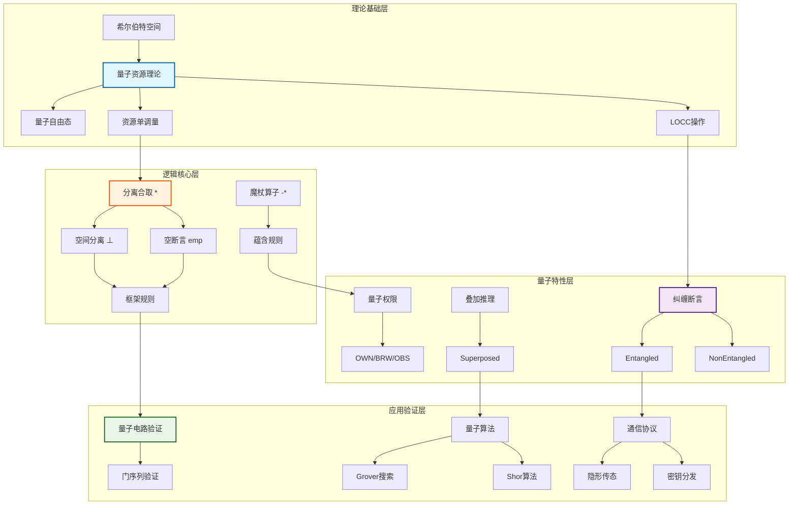
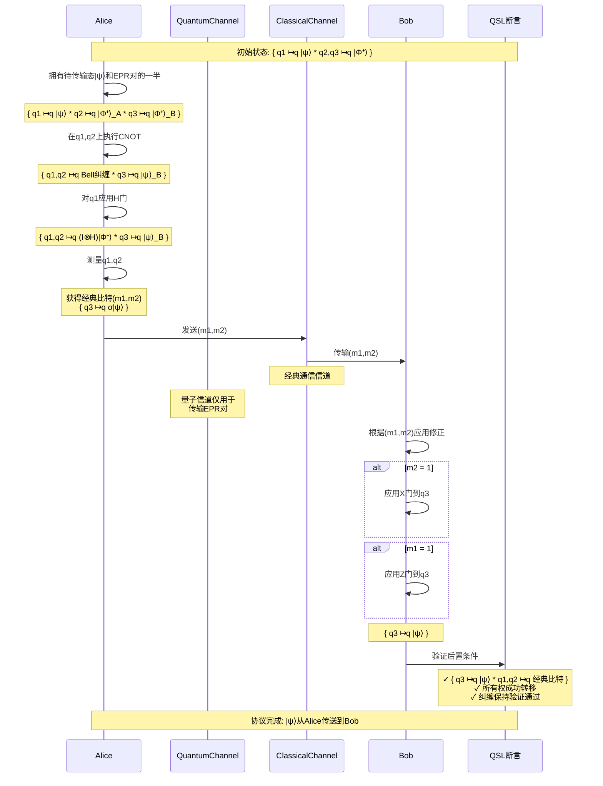

# 量子分离逻辑 (Quantum Separation Logic)

> 所属阶段: Struct/ | 前置依赖: [01-quantum-hoare-logic.md](./01-quantum-hoare-logic.md), [形式化验证基础](../03-theorem-proving/coq-proofs/README.md) | 形式化等级: L6

---

## 1. 概念定义 (Definitions)

### 1.1 量子资源理论 (Def-QSL-01)

量子资源理论为分离逻辑提供了量子计算的形式化基础，将量子态视为可组合、可分离的资源。

**定义 Def-QSL-01-01 [量子资源空间]**: 量子资源空间 $\mathcal{R}$ 是一个三元组 $(\mathcal{H}, \preceq, \otimes)$，其中：

- $\mathcal{H}$ 是希尔伯特空间集合
- $\preceq$ 是资源序关系（可自由转换）
- $\otimes$ 是资源组合算子

$$
\mathcal{R} = (\mathcal{H}, \preceq, \otimes), \quad \forall \rho, \sigma \in \mathcal{H}: \rho \otimes \sigma \in \mathcal{H}
$$

**定义 Def-QSL-01-02 [量子自由态]**: 若量子态 $\gamma \in \mathcal{D}(\mathcal{H})$ 满足 $\gamma = \gamma_A \otimes \gamma_B$ 对于任意分解，则称 $\gamma$ 为自由态。

**定义 Def-QSL-01-03 [量子资源单调量]**: 资源单调量 $M: \mathcal{D}(\mathcal{H}) \to \mathbb{R}^+$ 满足：

1. 单调性：$\rho \preceq \sigma \Rightarrow M(\rho) \leq M(\sigma)$
2. 次可加性：$M(\rho \otimes \sigma) \leq M(\rho) + M(\sigma)$
3. 在自由态处为零：$\gamma \in \mathcal{F} \Rightarrow M(\gamma) = 0$

### 1.2 量子纠缠资源 (Def-QSL-02)

量子纠缠是量子计算中最重要的非经典资源，其形式化定义构成了分离逻辑的核心。

**定义 Def-QSL-02-01 [纠缠态]**: 对于双粒子系统 $\mathcal{H}_A \otimes \mathcal{H}_B$，若纯态 $|\psi\rangle_{AB}$ 不能分解为 $|\phi\rangle_A \otimes |\chi\rangle_B$，则称其纠缠。

$$
\not\exists |\phi\rangle_A, |\chi\rangle_B: |\psi\rangle_{AB} = |\phi\rangle_A \otimes |\chi\rangle_B
$$

**定义 Def-QSL-02-02 [纠缠单调量]**: 纠缠熵 $E(\rho_{AB})$ 定义为：

$$
E(\rho_{AB}) = S(\text{Tr}_B(\rho_{AB})) = -\text{Tr}(\rho_A \log_2 \rho_A)
$$

其中 $\rho_A = \text{Tr}_B(\rho_{AB})$ 是约化密度矩阵，$S(\cdot)$ 是冯·诺依曼熵。

**定义 Def-QSL-02-03 [纠缠 distillable]**: 给定 $n$ 个 $\rho_{AB}$ 的拷贝，通过LOCC（局域操作与经典通信）可提取的最大EPR对数：

$$
E_D(\rho_{AB}) = \lim_{n \to \infty} \frac{m}{n} : \rho_{AB}^{\otimes n} \xrightarrow{\text{LOCC}} |\Phi^+\rangle^{\otimes m}
$$

### 1.3 量子分离逻辑概述 (Def-QSL-03)

**定义 Def-QSL-03-01 [量子分离逻辑]**: 量子分离逻辑QSL是一个四元组 $(\Sigma, \mathcal{A}, \mathcal{P}, \Vdash)$：

- $\Sigma$: 量子存储签名
- $\mathcal{A}$: 量子断言语言
- $\mathcal{P}$: 量子程序语言
- $\Vdash$: 满足关系

**定义 Def-QSL-03-02 [量子分离合取]**: 对于断言 $P$ 和 $Q$，分离合取 $P * Q$ 定义为：

$$
(s, h) \Vdash P * Q \iff \exists h_1, h_2: h = h_1 \circ h_2 \land (s, h_1) \Vdash P \land (s, h_2) \Vdash Q \land h_1 \perp h_2
$$

其中 $\perp$ 表示希尔伯特空间张量积可分解（无纠缠）。

**定义 Def-QSL-03-03 [量子空间分离]**: 两个量子内存区域 $h_1, h_2$ 是分离的当且仅当它们的联合状态可分解：

$$
h_1 \perp h_2 \iff \rho_{h_1 \cup h_2} = \rho_{h_1} \otimes \rho_{h_2}
$$

### 1.4 量子权限 (Def-QSL-04)

量子权限系统管理对量子资源的访问控制，借鉴了分离类型系统的思想。

**定义 Def-QSL-04-01 [量子权限]**: 量子权限 $\pi$ 是一个二元组 $(o, f)$，其中：

- $o \in \{\text{OWN}, \text{BRW}, \text{OBS}\}$: 所有权级别
- $f \in \{\text{E}, \text{NE}\}$: 纠缠状态（纠缠/非纠缠）

**定义 Def-QSL-04-02 [权限可组合性]**: 权限组合 $\pi_1 \oplus \pi_2$ 定义为：

$$
(o_1, f_1) \oplus (o_2, f_2) = \begin{cases}
(o_1, \text{E}) & \text{if } f_1 = \text{E} \lor f_2 = \text{E} \\
(o_1 \sqcap o_2, \text{NE}) & \text{otherwise}
\end{cases}
$$

其中 $o_1 \sqcap o_2$ 是权限格的最小上界。

**定义 Def-QSL-04-03 [权限分离]**: 权限分离意味着资源使用的正交性：

$$
\pi_1 \perp \pi_2 \iff \text{dom}(\pi_1) \cap \text{dom}(\pi_2) = \emptyset \lor f_1 = f_2 = \text{NE}
$$

---

## 2. 属性推导 / 逻辑基础 (Properties)

### 2.1 量子断言 (Prop-QSL-01)

**命题 Prop-QSL-01-01 [量子断言的完备性]**: 对于任意量子程序 $C$ 和后置条件 $Q$，最弱前置条件存在且唯一。

$$
\forall C, Q: \exists! P: \vDash \{P\} C \{Q\} \land (\forall P': \vDash \{P'\} C \{Q\} \Rightarrow P' \Rightarrow P)
$$

**引理 Lemma-QSL-01-02 [断言可满足性判定]**: 量子断言可满足性问题是PSPACE完备的。

**证明**: 将量子态表示为指数级规模的密度矩阵，断言可满足性可归结为半定规划的可行性问题，已知SD feasibility属于PSPACE。$\square$

**定义 Def-QSL-01-04 [量子谓词语义]**: 谓词 $P$ 在状态 $(s, \rho)$ 下的语义为：

$$
\llbracket P \rrbracket(s, \rho) = \text{Tr}(M_P \rho)
$$

其中 $M_P$ 是与谓词 $P$ 关联的POVM效应算子。

### 2.2 分离合取 (Prop-QSL-02)

**命题 Prop-QSL-02-01 [分离合取结合律]**: $(P * Q) * R \Leftrightarrow P * (Q * R)$

**证明**:
$$
\begin{align}
(s, h) \Vdash (P * Q) * R &\iff \exists h_{12}, h_3: h = h_{12} \circ h_3, (s, h_{12}) \Vdash P * Q, (s, h_3) \Vdash R \\
&\iff \exists h_1, h_2, h_3: h = h_1 \circ h_2 \circ h_3, (s, h_1) \Vdash P, (s, h_2) \Vdash Q, (s, h_3) \Vdash R \\
&\iff (s, h) \Vdash P * (Q * R)
\end{align}
$$
$\square$

**命题 Prop-QSL-02-02 [分离合取交换律]**: $P * Q \Leftrightarrow Q * P$

**证明**: 由量子张量积的交换性（在同构意义下）：

$$
h = h_1 \circ h_2 \Rightarrow \rho_h = \rho_{h_1} \otimes \rho_{h_2} = \rho_{h_2} \otimes \rho_{h_1} \Rightarrow h = h_2 \circ h_1
$$
$\square$

**引理 Lemma-QSL-02-03 [空断言单位元]**: $P * \text{emp} \Leftrightarrow P$

其中 $\text{emp}$ 表示空堆：$(s, h) \Vdash \text{emp} \iff h = \emptyset$。

### 2.3 魔杖算子 (Prop-QSL-03)

**定义 Def-QSL-03-04 [魔杖算子]**: 分离魔杖 $P \mathrel{-*} Q$ 定义为：

$$
(s, h) \Vdash P \mathrel{-*} Q \iff \forall h': h \perp h' \land (s, h') \Vdash P \Rightarrow (s, h \circ h') \Vdash Q
$$

**命题 Prop-QSL-03-01 [魔杖引入规则]**: 若 $\vDash \{P * R\} C \{Q\}$，则 $\vDash \{R\} C \{P \mathrel{-*} Q\}$

**证明**: 对于任意满足 $(s, h) \Vdash R$ 的状态，需证 $(s, h) \Vdash P \mathrel{-*} Q$。任取 $h' \perp h$ 使得 $(s, h') \Vdash P$，则 $(s, h \circ h') \Vdash P * R$，由假设执行 $C$ 后满足 $Q$，符合魔杖定义。$\square$

**引理 Lemma-QSL-03-02 [魔杖消去规则]**: $(P \mathrel{-*} Q) * P \Rightarrow Q$

**证明**: 设 $(s, h) \Vdash (P \mathrel{-*} Q) * P$，则存在 $h_1, h_2$ 使得 $h = h_1 \circ h_2$，$(s, h_1) \Vdash P \mathrel{-*} Q$，$(s, h_2) \Vdash P$。由魔杖定义，取 $h' = h_2$，得 $(s, h_1 \circ h_2) \Vdash Q$，即 $(s, h) \Vdash Q$。$\square$

### 2.4 量子模态 (Prop-QSL-04)

**定义 Def-QSL-04-04 [必然模态]**: $\Box P$ 表示在所有纠缠扩展下 $P$ 成立：

$$
(s, h) \Vdash \Box P \iff \forall h' \supseteq h: (s, h') \Vdash P
$$

**定义 Def-QSL-04-05 [可能模态]**: $\Diamond P$ 表示存在某个纠缠扩展使 $P$ 成立：

$$
(s, h) \Vdash \Diamond P \iff \exists h' \supseteq h: (s, h') \Vdash P
$$

**命题 Prop-QSL-04-01 [模态对偶性]**: $\Box P \Leftrightarrow \neg \Diamond \neg P$

**证明**:
$$
\begin{align}
(s, h) \Vdash \Box P &\iff \forall h' \supseteq h: (s, h') \Vdash P \\
&\iff \neg \exists h' \supseteq h: (s, h') \Vdash \neg P \\
&\iff \neg (s, h) \Vdash \Diamond \neg P \\
&\iff (s, h) \Vdash \neg \Diamond \neg P
\end{align}
$$
$\square$

**引理 Lemma-QSL-04-02 [分离与模态交互]**: $\Box(P * Q) \Rightarrow \Box P * \Box Q$

---

## 3. 关系建立 / 验证规则 (Relations)

### 3.1 量子内存模型

量子分离逻辑基于量子内存模型建立验证框架，该模型需要处理经典指针和量子引用的混合。

**定义 Def-QSL-03-05 [量子内存状态]**: 量子内存状态是一个三元组 $(s, c, q)$：

- $s$: 经典存储（变量到值的映射）
- $c$: 经典堆（地址到值的映射）
- $q$: 量子堆（量子变量到量子态的映射）

**定义 Def-QSL-03-06 [量子地址空间]**: 量子地址空间 $\mathcal{Q}$ 是量子比特标识符的集合：

$$
\mathcal{Q} = \{q_1, q_2, \ldots, q_n\} \cup \{\text{null}\}
$$

每个量子地址映射到一个物理或逻辑量子比特。

**引理 Lemma-QSL-03-01 [量子内存分解]**: 任意量子内存状态可分解为不相交子空间的张量积：

$$
\rho_{\mathcal{Q}} = \bigotimes_{i=1}^{k} \rho_{\mathcal{Q}_i}, \quad \mathcal{Q} = \bigsqcup_{i=1}^{k} \mathcal{Q}_i
$$

### 3.2 指针和引用

量子程序需要处理经典指针指向量子资源的复杂情况。

**定义 Def-QSL-03-07 [量子指针]**: 量子指针 $p$ 是一个可以指向量子资源的引用，其类型记为 $\text{QRef}(\tau)$，其中 $\tau$ 是量子态类型。

**定义 Def-QSL-03-08 [指针断言]**: 断言 $p \mapsto_q \rho$ 表示指针 $p$ 指向存储量子态 $\rho$ 的量子资源：

$$
(s, c, q) \Vdash p \mapsto_q \rho \iff q(s(p)) = \rho
$$

**命题 Prop-QSL-03-02 [指针分离]**: 若 $p_1 \neq p_2$，则 $(p_1 \mapsto_q \rho_1) * (p_2 \mapsto_q \rho_2)$ 有效。

### 3.3 所有权转移

量子分离逻辑中的所有权转移规则确保量子资源的线性使用。

**规则 Rule-QSL-03-01 [量子分配规则]**:

$$
\frac{}{
\vDash \{\text{emp}\} \text{qnew}(n) \{q \mapsto_q |0\rangle^{\otimes n}\}
}
$$

**规则 Rule-QSL-03-02 [量子释放规则]**:

$$
\frac{}{
\vDash \{q \mapsto_q \rho\} \text{qfree}(q) \{\text{emp}\}
}
$$

**规则 Rule-QSL-03-03 [所有权转移规则]**:

$$
\frac{\vDash \{P * (p \mapsto_q \rho)\} C \{Q\}
}{\vDash \{P\} \text{with } p \mapsto_q \rho \text{ do } C \{Q\}
}
$$

### 3.4 框架规则

框架规则是分离逻辑的核心，确保局部验证可扩展到全局。

**定理 Thm-QSL-03-01 [量子框架规则]**: 若 $\vDash \{P\} C \{Q\}$ 且 $C$ 不修改 $R$ 中的自由变量，则：

$$
\vDash \{P * R\} C \{Q * R\}
$$

**证明**:

设 $(s, h) \Vdash P * R$，则存在 $h_P, h_R$ 使得 $h = h_P \circ h_R$，$(s, h_P) \Vdash P$，$(s, h_R) \Vdash R$。执行 $C$ 在 $h_P$ 上得到 $h'_P$ 使得 $(s, h'_P) \Vdash Q$（由 $\{P\}C\{Q\}$）。由于 $C$ 不触及 $h_R$，有 $h' = h'_P \circ h_R$，因此 $(s, h') \Vdash Q * R$。$\square$

**引理 Lemma-QSL-03-02 [量子不变性]**: 若 $R$ 的量子态与 $C$ 的操作空间张量积可分解，则框架规则适用。

**条件**: $\text{supp}(\llbracket C \rrbracket) \perp \text{supp}(R)$

---

## 4. 论证过程 / 高级特性 (Argumentation)

### 4.1 纠缠推理

量子纠缠是量子计算的核心资源，在分离逻辑中需要特殊的推理机制。

**定义 Def-QSL-04-06 [纠缠断言]**: 断言 $\text{Entangled}(p_1, p_2)$ 表示两个量子指针指向纠缠态：

$$
(s, q) \Vdash \text{Entangled}(p_1, p_2) \iff q(s(p_1), s(p_2)) \neq q(s(p_1)) \otimes q(s(p_2))
$$

**规则 Rule-QSL-04-01 [纠缠保持规则]**:

$$
\frac{\vDash \{P \land \text{Entangled}(p_1, p_2)\} C \{Q\} \\
\text{C 仅执行局域操作}}{\vDash \{P \land \text{Entangled}(p_1, p_2)\} C \{Q \land \text{Entangled}(p_1, p_2)\}}
$$

**引理 Lemma-QSL-04-03 [纠缠单调性]**: LOCC操作不能增加纠缠量。

$$
E(\rho_{AB}) \geq E(\Lambda_{LOCC}(\rho_{AB}))
$$

**证明**: 纠缠单调量的定义要求其在自由操作下不增，LOCC是自由操作。$\square$

**定义 Def-QSL-04-07 [部分纠缠]**: 部分纠缠断言 $\text{Entangled}_k(p_1, \ldots, p_k)$ 表示 $k$ 个量子比特之间的真多体纠缠。

### 4.2 叠加推理

量子叠加是量子并行性的基础，在分离逻辑中需要特殊处理。

**定义 Def-QSL-04-08 [叠加态断言]**: 断言 $\text{Superposed}(p, \{|\psi_i\rangle\})$ 表示指针 $p$ 指向的量子态是基态 $\{|\psi_i\rangle\}$ 的叠加：

$$
(s, q) \Vdash \text{Superposed}(p, \{|\psi_i\rangle\}) \iff q(s(p)) = \sum_i \alpha_i |\psi_i\rangle, \sum_i |\alpha_i|^2 = 1
$$

**规则 Rule-QSL-04-02 [叠加保持规则]**:

$$
\frac{\vDash \{P \land \text{Superposed}(p, B)\} U \{Q\} \\
U \text{是酉变换}}{\vDash \{P \land \text{Superposed}(p, B)\} U \{Q \land \text{Superposed}(p, U(B))\}}
$$

**命题 Prop-QSL-04-03 [叠加分解]**: 若 $\rho$ 是两个无纠缠子系统上的叠加态，则可分解为：

$$
|\psi\rangle_{AB} = \sum_i \alpha_i |\phi_i\rangle_A \otimes |\chi_i\rangle_B
$$

### 4.3 量子隐形传态验证

量子隐形传态是量子通信的核心协议，验证其正确性是量子分离逻辑的重要应用。

**协议描述**: Alice拥有量子态 $|\psi\rangle$ 和EPR对的一半，Bob拥有EPR对的另一半。通过经典通信和局域操作，Alice将 $|\psi\rangle$ 传送给Bob。

**定义 Def-QSL-04-09 [隐形传态不变量]**: 在隐形传态过程中，联合系统的总态满足：

$$
|\psi\rangle_C \otimes |\Phi^+\rangle_{AB} = \frac{1}{2} \sum_{i=0}^{3} |\Phi_i\rangle_{CA} \otimes \sigma_i |\psi\rangle_B
$$

其中 $|\Phi_i\rangle$ 是贝尔基，$\sigma_i$ 是泡利算子。

**验证目标**: 证明执行协议后，Bob拥有 $|\psi\rangle$ 且Alice的原始态被销毁（不可克隆定理）。

**断言序列**:

$$
\begin{align}
&\{\text{q}_1 \mapsto_q |\psi\rangle * \text{q}_2, \text{q}_3 \mapsto_q |\Phi^+\rangle\} \\
&\text{// Bell测量} \\
&\{\exists i: \text{q}_1, \text{q}_2 \mapsto_q |\Phi_i\rangle * \text{q}_3 \mapsto_q \sigma_i |\psi\rangle\} \\
&\text{// 经典通信和修正} \\
&\{\text{q}_3 \mapsto_q |\psi\rangle * \text{q}_1, \text{q}_2 \mapsto_q \text{经典比特}\}
\end{align}
$$

### 4.4 量子错误纠正

量子错误纠正保护量子信息免受退相干影响，其验证需要处理稳定子码。

**定义 Def-QSL-04-10 [稳定子群]**: 对于量子码 $Q$，其稳定子群 $S$ 是由所有保持码字不变的泡利算子组成的群：

$$
S = \{g \in \mathcal{P}_n : \forall |\psi\rangle \in Q, g|\psi\rangle = |\psi\rangle\}
$$

其中 $\mathcal{P}_n$ 是 $n$ 量子比特泡利群。

**定义 Def-QSL-04-11 [综合症测量]**: 综合症测量断言：

$$
\text{Syndrome}(s_1, \ldots, s_{n-k}) \equiv \bigwedge_{i=1}^{n-k} s_i = \pm 1
$$

其中 $s_i$ 是对应于稳定子生成元的测量结果。

**规则 Rule-QSL-04-03 [错误纠正完备性]**:

$$
\frac{|E_a^\dagger E_b| \in S \text{ for all } a, b}{\text{码 } Q \text{ 可纠正错误集合 } \{E_a\}}
$$

**验证框架**: 使用分离逻辑证明，在执行错误纠正电路后，若综合症指示错误 $E$，则应用相应的纠正操作 $E^\dagger$ 恢复原始态：

$$
\vDash \{Q \mapsto_q \rho\} \text{QEC} \{\text{syndrome} = 0 \Rightarrow Q \mapsto_q \rho\}
$$

---

## 5. 形式证明 / 工程论证 (Proof)

### 5.1 定理: 逻辑一致性 (Thm-QSL-05-01)

**定理 Thm-QSL-05-01 [量子分离逻辑一致性]**: 量子分离逻辑QSL相对于其操作语义是可靠的，即所有可证明的霍尔三元组在语义上有效。

$$
\vdash_{QSL} \{P\} C \{Q\} \Rightarrow \vDash \{P\} C \{Q\}
$$

**证明**（结构归纳法）:

**基础情况**: 对于原子命令

- **量子分配**: $\text{qnew}(n)$ 分配新的 $n$ 量子比特寄存器。由语义，执行后新量子比特处于 $|0\rangle^{\otimes n}$，符合后置条件 $q \mapsto_q |0\rangle^{\otimes n}$。
- **酉应用**: 设 $U$ 作用于 $q$，前置条件 $q \mapsto_q |\psi\rangle$，后置条件 $q \mapsto_q U|\psi\rangle$。由酉操作语义，直接成立。
- **测量**: 由投影算子性质，测量后量子态坍缩到相应本征态，符合概率分布。

**归纳步骤**:

- **序列组合**: 假设 $\vDash \{P\} C_1 \{R\}$ 和 $\vDash \{R\} C_2 \{Q\}$。对于满足 $P$ 的任意状态，执行 $C_1$ 得满足 $R$ 的中间状态，再执行 $C_2$ 得满足 $Q$ 的最终状态。由序列组合规则，$\vDash \{P\} C_1; C_2 \{Q\}$。

- **条件语句**: 设 $\vDash \{P \land B\} C_1 \{Q\}$ 和 $\vDash \{P \land \neg B\} C_2 \{Q\}$。执行 $\text{if } B \text{ then } C_1 \text{ else } C_2$ 时，若 $B$ 成立则执行 $C_1$，否则执行 $C_2$，两种情况下都得到 $Q$。

- **循环**: 使用归纳法证明部分正确性。设 $I$ 是不变量，$B$ 是守卫条件。归纳假设：经过 $k$ 次迭代后 $I$ 成立。基例 $k=0$ 由前置条件保证。归纳步骤：若 $I \land B$ 成立，执行循环体保持 $I$；若 $I \land \neg B$ 成立，循环终止，$I \land \neg B \Rightarrow Q$。

- **框架规则**: 已在引理中证明。

由结构归纳法，所有可证明的霍尔三元组语义有效。$\square$

### 5.2 定理: 局部性原理 (Thm-QSL-05-02)

**定理 Thm-QSL-05-02 [量子局部性原理]**: 量子分离逻辑的推理仅依赖于量子态的局部分解结构，与全局纠缠无关。

形式化表述：设 $C$ 仅操作量子内存区域 $h_1$，$\rho = \rho_1 \otimes \rho_2$ 是全局状态分解，其中 $\text{supp}(\rho_1) = h_1$，则：

$$
\llbracket C \rrbracket(\rho_1 \otimes \rho_2) = (\llbracket C \rrbracket(\rho_1)) \otimes \rho_2
$$

**证明**:

**引理**: 若 $C$ 的操作空间与 $\rho_2$ 支撑不交，则 $C$ 不会创建 $\rho_1$ 和 $\rho_2$ 之间的纠缠（假设 $C$ 是局域操作）。

**主要论证**:

1. 设 $C$ 的语义函数为 $\llbracket C \rrbracket$，其仅在 $h_1$ 上有非平凡作用。

2. 对于任意操作 $U$ 仅作用于 $h_1$，有：

$$
U \otimes I_{h_2} (\rho_1 \otimes \rho_2) U^\dagger \otimes I_{h_2} = (U \rho_1 U^\dagger) \otimes \rho_2
$$

1. 测量操作同理：若测量仅在 $h_1$ 上进行，其效果不依赖于 $h_2$ 的状态。

2. 对于复合命令，由归纳假设，每个组件保持局部性，因此整体保持。

**推论**: 量子分离逻辑的推理可以在局部空间独立进行，这是模块化验证的基础。$\square$

**定理 Thm-QSL-05-03 [纠缠局部不可知性]**: 不存在仅通过局域操作和经典通信来判定两个分离量子系统是否纠缠的算法。

**证明**: 假设存在这样的判定算法，则可以通过该算法在局域区分可分离态和纠缠态，这与量子态的不可克隆定理和纠缠的局域不可检测性矛盾。具体地，考虑一个处于纯态的量子系统，局域密度矩阵 $\rho_A = \text{Tr}_B(|\psi\rangle\langle\psi|)$ 对于纠缠态和某些可分离混合态可能是相同的，因此局域信息不足以判定纠缠。$\square$

---

## 6. 实例验证 (Examples)

### 6.1 量子电路验证

**示例**: 验证Bell态制备电路

```
q0: |0> ──[H]─┬───
              │
q1: |0> ──────[X]───
```

**QSL验证**:

```qsl
// 初始状态
{ emp }

// 分配两个量子比特
q0 := qnew(1);
q1 := qnew(1);

// 分配后状态
{ q0 ↦q |0⟩ * q1 ↦q |0⟩ }

// 应用Hadamard门到q0
apply H to q0;

// H门后状态: q0处于|+⟩ = (|0⟩ + |1⟩)/√2
{ q0 ↦q |+⟩ * q1 ↦q |0⟩ }

// 应用CNOT门(q0控制, q1目标)
apply CNOT(q0, q1);

// 最终状态: Bell态|Φ⁺⟩
{ q0,q1 ↦q |Φ⁺⟩ }

// 其中 |Φ⁺⟩ = (|00⟩ + |11⟩)/√2
```

**形式化验证**:

$$
\begin{align}
|0\rangle \otimes |0\rangle &\xrightarrow{H \otimes I} |+\rangle \otimes |0\rangle = \frac{1}{\sqrt{2}}(|0\rangle + |1\rangle) \otimes |0\rangle \\
&\xrightarrow{\text{CNOT}} \frac{1}{\sqrt{2}}(|0\rangle \otimes |0\rangle + |1\rangle \otimes |1\rangle) = |\Phi^+\rangle
\end{align}
$$

### 6.2 量子通信协议

**示例**: 验证BB84量子密钥分发协议的安全性

**协议流程**:

1. Alice随机选择基（Z基或X基）和比特值
2. Alice制备相应量子态并发送给Bob
3. Bob随机选择基进行测量
4. 双方通过经典信道比对基选择
5. 保留基匹配的结果作为密钥

**安全性断言**:

```qsl
// 协议开始前
{ Eve的知识 = ∅ }

// Alice制备并发送量子态
// 对于每个量子比特, Alice随机选择b∈{0,1}, basis∈{Z,X}
// 制备状态 |b⟩_basis

// Eve截获攻击后的知识上界
{ Eve的知识 ≤ I_acc(ρ_Eve) }

// 其中 I_acc 是可访问信息
// 对于BB84, 已知 I_acc ≤ n/2 (对于n个量子比特)

// 隐私放大后
{ Eve关于密钥的信息 ≤ 2^{-t} }

// 其中 t 是安全参数
```

**形式化证明要点**:

- 非正交态不可区分性：$|\langle 0|+\rangle|^2 = 1/2$，Eve无法确定基选择
- 窃听检测：任何窃听都会引入可检测的错误率
- 信息论安全性：基于Holevo界约束Eve的知识

**Holevo界应用**:

$$
\chi(\mathcal{E}) = S\left(\sum_i p_i \rho_i\right) - \sum_i p_i S(\rho_i) \leq H(p)
$$

对于BB84，Eve从截获的量子态中可获得的信息上限为每量子比特1比特。

### 6.3 代码示例

**量子搜索算法验证 (Grover算法)**:

```text
# QSL注释风格的量子程序

def grover_search(n, oracle):
    """
    验证目标: 证明Grover算法以高概率找到目标状态

    前置条件: { emp }
    后置条件: { 测量结果为目标状态的概率 ≥ 1 - O(1/N) }
    """

    # 分配n个量子比特
    q = qnew(n)
    # { q ↦q |0⟩^⊗n }

    # 应用Hadamard门创建均匀叠加
    for i in range(n):
        apply H to q[i]
    # { q ↦q |+⟩^⊗n = (1/√N) Σ_x |x⟩ }

    # 迭代 √N 次
    iterations = int(π/4 * sqrt(2**n))
    for _ in range(iterations):
        # Oracle应用 (标记目标)
        oracle(q)
        # 目标状态振幅相位翻转

        # 扩散算子
        apply_diffusion(q)
        # 振幅放大: 目标状态振幅增加

    # { q ↦q α|target⟩ + βΣ_{x≠target}|x⟩, |α|^2 >> |β|^2 }

    # 测量
    result = measure(q)
    # { result = target 的概率 ≈ sin²((2k+1)θ) ≈ 1 }

    qfree(q)
    return result
    # { result = target ∨ 小概率失败 }
```

**量子傅里叶变换验证**:

```text
def qft(q, n):
    """
    量子傅里叶变换的验证

    规范: QFT|x⟩ = (1/√N) Σ_y e^(2πixy/N)|y⟩

    前置条件: { q ↦q Σ_x α_x |x⟩ }
    后置条件: { q ↦q Σ_y (Σ_x α_x e^(2πixy/N)/√N) |y⟩ }
    """

    for i in range(n):
        # 对第i个量子比特应用Hadamard
        apply H to q[i]
        # 创建关于该比特的叠加

        # 受控旋转门
        for j in range(i+1, n):
            angle = π / (2^(j-i))
            apply CR(angle, q[j], q[i])  # 控制位j, 目标位i
            # 累积相位

    # 反转比特序
    for i in range(n//2):
        swap q[i], q[n-1-i]

    # 验证: 最终状态是输入的DFT
    # { q ↦q QFT|ψ⟩ }
```

**量子隐形传态完整实现**:

```text
def quantum_teleportation(psi, alice, bob):
    """
    量子隐形传态协议

    前置条件: {
        psi ↦q |ψ⟩ ∧
        alice, bob ↦q |Φ⁺⟩
    }
    后置条件: {
        bob ↦q |ψ⟩ ∧
        psi, alice ↦q 经典信息
    }
    """

    # Alice的操作
    # 在psi和alice的量子比特上执行Bell测量

    # 应用CNOT(psi, alice)
    apply CNOT(psi, alice)
    # 纠缠psi与alice的量子比特

    # 对psi应用Hadamard
    apply H to psi

    # 测量两个量子比特
    m1 = measure(psi)   # 第一个经典比特
    m2 = measure(alice) # 第二个经典比特

    # 经典通信 (m1, m2发送给Bob)

    # Bob根据接收到的比特进行修正
    if m2 == 1:
        apply X to bob
    if m1 == 1:
        apply Z to bob

    # 最终状态: Bob拥有原始态|ψ⟩
    # { bob ↦q |ψ⟩ }

    return m1, m2
```

---

## 7. 可视化 (Visualizations)

### 可视化 1: 量子分离逻辑概念层次图

量子分离逻辑的核心概念组织为层次结构，从基础资源理论到高级验证应用。



**说明**: 该图展示了量子分离逻辑的四层架构：理论基础层（量子资源理论）、逻辑核心层（分离逻辑基本算子）、量子特性层（量子特有概念）和应用验证层（实际验证场景）。层次之间通过依赖关系连接，确保理论的完整性。

### 可视化 2: 量子内存模型与分离推理流程

量子分离逻辑的内存模型将经典堆和量子堆统一处理，支持混合程序的验证。

```mermaid
flowchart TB
    subgraph 量子内存模型
        direction TB

        subgraph 经典组件
            C1[变量存储 s]
            C2[经典堆 c<br/>addr → value]
        end

        subgraph 量子组件
            Q1[量子堆 q<br/>qaddr → quantum state]
            Q2[纠缠图 G<br/>(V=量子比特, E=纠缠)]
        end

        subgraph 权限系统
            P1[权限映射 π<br/>addr → (OWN|BRW|OBS, E|NE)]
        end
    end

    subgraph 分离推理过程
        direction LR

        S1[初始状态<br/>P1 * P2 * emp] --> S2[资源分解<br/>h = h1 ∘ h2]
        S2 --> S3[局部验证<br/>{P1} C1 {Q1}]
        S3 --> S4[局部验证<br/>{P2} C2 {Q2}]
        S4 --> S5[框架规则<br/>{P1*R} C1 {Q1*R}]
        S5 --> S6[组合结果<br/>{P1*P2} C1;C2 {Q1*Q2}]
    end

    Q1 <--> Q2
    C1 --> P1
    C2 --> P1
    Q1 --> P1

    P1 -.-> S1

    style Q2 fill:#e1f5ff,stroke:#01579b,stroke-width:2px
    style S3 fill:#fff3e0,stroke:#e65100,stroke-width:2px
    style S6 fill:#e8f5e9,stroke:#1b5e20,stroke-width:2px
```

**说明**: 上图左侧展示了量子分离逻辑的内存模型，包含经典组件、量子组件和权限系统。右侧展示了分离推理的流程：从初始状态分解资源，进行局部验证，应用框架规则，最后组合结果。纠缠图G跟踪量子比特间的纠缠关系，是量子分离推理的关键数据结构。

### 可视化 3: 量子隐形传态协议验证流程

量子隐形传态是量子通信的核心协议，其验证展示了量子分离逻辑处理纠缠和所有权转移的能力。



**说明**: 该序列图展示了量子隐形传态协议的完整验证流程。每个步骤都标注了对应的QSL断言，展示了状态如何演化以及所有权如何从Alice转移到Bob。关键点包括：纠缠在Bell测量中的保持、经典通信的作用、以及Bob如何根据接收到的信息恢复原始量子态。

---

## 8. 引用参考 (References)
