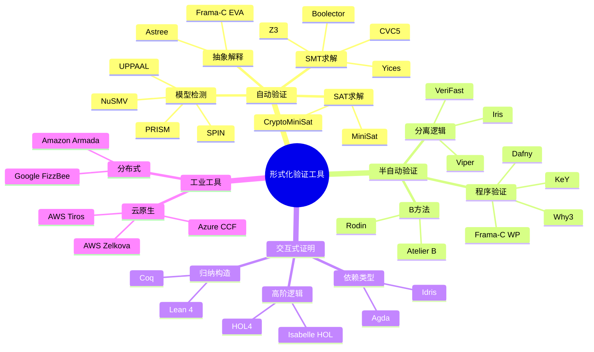
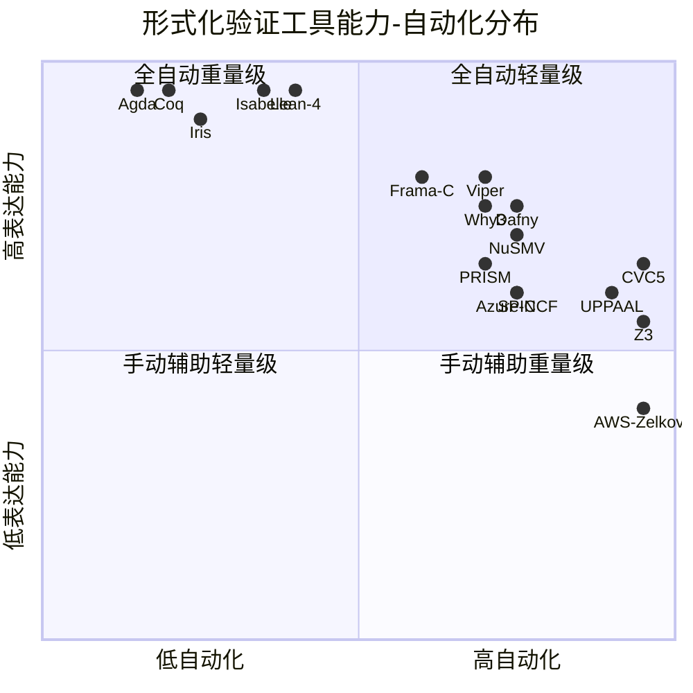
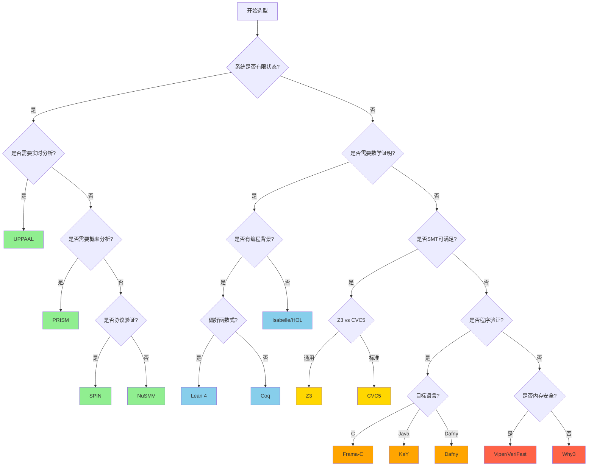
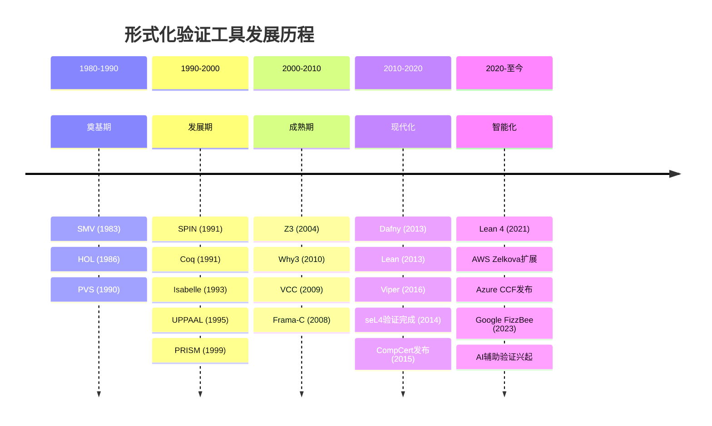
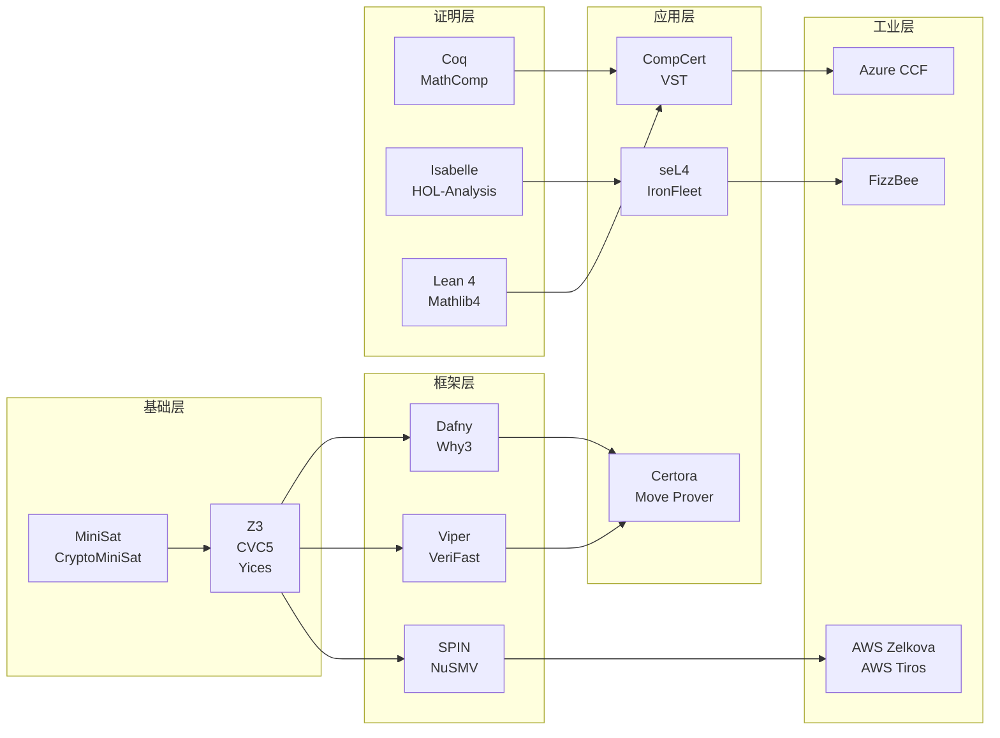

# 形式化验证工具全景对比与选型指南

> 所属阶段: formal-methods/tools | 前置依赖: [01-model-checking.md](01-model-checking.md), [02-theorem-provers.md](02-theorem-provers.md) | 形式化等级: L3-L5

---

## 1. 概念定义 (Definitions)

### Def-FM-06-03-01: 形式化验证工具分类体系

形式化验证工具是根据其核心技术原理、自动化程度和适用问题域进行分类的软件系统。本分析采用五维分类框架：

**定义维度:**

| 维度 | 说明 | 典型取值 |
|------|------|----------|
| 验证技术 | 核心数学方法 | 模型检测、定理证明、SAT/SMT求解、抽象解释、类型理论 |
| 自动化程度 | 用户干预需求 | 全自动、半自动、交互式、手动辅助 |
| 表达能力 | 可验证性质范围 | 时序逻辑、霍尔逻辑、分离逻辑、依赖类型 |
| 适用范围 | 目标系统类型 | 有限状态系统、无限状态系统、并发程序、神经网络 |
| 工业就绪度 | 生产环境适用性 | 学术研究、工业原型、生产部署 |

### Def-FM-06-03-02: 表达能力等级 (Expressiveness Hierarchy)

形式化工具的表达能力可分为以下层级：

- **L1 - 命题逻辑层**: 布尔可满足性，有限状态空间
- **L2 - 一阶逻辑层**: 量词、等式、未解释函数
- **L3 - 时序逻辑层**: LTL、CTL、CTL* 性质表达
- **L4 - 高阶逻辑层**: 函数、归纳类型、依赖类型
- **L5 - 程序逻辑层**: 霍尔逻辑、分离逻辑、类型与效果系统

### Def-FM-06-03-03: 自动化-可靠性权衡 (Automation-Soundness Trade-off)

对于验证工具 $T$，定义其自动化指数 $\alpha(T) \in [0,1]$ 和可靠性保证 $\sigma(T) \in [0,1]$，则工具的综合效能：

$$E(T) = w_1 \cdot \alpha(T) + w_2 \cdot \sigma(T) + w_3 \cdot \delta(T)$$

其中 $\delta(T)$ 为决策延迟（反比于验证速度），$w_1, w_2, w_3$ 为场景相关权重。

---

## 2. 属性推导 (Properties)

### Lemma-FM-06-03-01: 表达能力蕴含关系

对于主流形式化工具，存在以下表达能力蕴含链：

**定理证明器** $\supset$ **SMT求解器** $\supset$ **模型检测器** $\supset$ **SAT求解器**

**证明概要:**

- 定理证明器可编码SMT问题作为子目标
- SMT可规约模型检测的迁移约束
- 模型检测状态约束可编码为SAT公式

**推论 (Cor-FM-06-03-01):** 表达能力越强，自动化程度通常越低，形成**反比关系**。

### Lemma-FM-06-03-02: 工具选择空间完备性

对于任意验证需求 $R = (S, P, C)$，其中 $S$ 为系统类型、$P$ 为性质类别、$C$ 为约束条件，存在工具 $T$ 使得 $T$ 可满足 $R$ 当且仅当：

$$\text{expr}(T) \supseteq \text{expr}(P) \land \text{auto}(T) \geq \text{threshold}(C_{\text{time}}) \land \text{sound}(T) \geq C_{\text{correctness}}$$

### Prop-FM-06-03-01: 工业工具与学术工具的互补性

**命题:** 工业级形式化工具（AWS Zelkova、Azure CCF、Google FizzBee）与学术工具在以下维度呈现互补分布：

| 维度 | 工业工具特征 | 学术工具特征 |
|------|-------------|-------------|
| 领域专注度 | 特定云/网络/安全领域 | 通用数学框架 |
| 集成深度 | CI/CD原生集成 | 独立验证环境 |
| 学习曲线 | 领域专家友好 | 形式化专家友好 |
| 可扩展性 | 水平扩展优化 | 理论扩展能力 |

---

## 3. 关系建立 (Relations)

### 3.1 工具技术谱系图

形式化验证工具形成清晰的技术谱系：

```
形式化验证
├── 自动验证
│   ├── 模型检测
│   │   ├── 显式状态 (SPIN)
│   │   ├── 符号模型检测 (NuSMV)
│   │   └── 实时系统 (UPPAAL)
│   ├── SAT/SMT求解
│   │   ├── SMT-LIB标准
│   │   ├── Z3 (微软)
│   │   ├── CVC5 (斯坦福)
│   │   └── Yices (SRI)
│   └── 抽象解释
│       ├── Astrée (AbsInt)
│       └── Frama-C/EVA
├── 半自动验证
│   ├── 程序验证
│   │   ├── Dafny (微软)
│   │   ├── Why3
│   │   └── Frama-C/WP
│   ├── 分离逻辑
│   │   ├── Viper (ETH)
│   │   ├── VeriFast
│   │   └── Iris (MPI-SWS)
│   └── B方法/Event-B
└── 交互式证明
    ├── 归纳构造演算
    │   ├── Coq (INRIA)
    │   └── Lean 4 (Microsoft/CMU)
    ├── 高阶逻辑
    │   ├── Isabelle/HOL (TUM)
    │   └── HOL4/HOL Light
    └── 依赖类型
        ├── Agda (Chalmers)
        └── Idris
```

### 3.2 工具-问题映射矩阵

```
                    ┌─────────────┬─────────────┬─────────────┬─────────────┐
                    │ 并发协议    │ 算法正确性  │ 安全属性    │ 资源安全    │
                    │ 验证        │ 证明        │ 分析        │ 验证        │
├───────────────────┼─────────────┼─────────────┼─────────────┼─────────────┤
│ 模型检测          │ ████████████│ ████████    │ ████████    │ ████        │
│ (SPIN/NuSMV)      │ ★★★★★       │ ★★★★        │ ★★★★        │ ★★          │
├───────────────────┼─────────────┼─────────────┼─────────────┼─────────────┤
│ 定理证明器        │ ████████    │ ████████████│ ████████    │ ████████    │
│ (Coq/Isabelle)    │ ★★★★        │ ★★★★★       │ ★★★★        │ ★★★★        │
├───────────────────┼─────────────┼─────────────┼─────────────┼─────────────┤
│ SMT求解器         │ ██████      │ ████████████│ ████████████│ ████        │
│ (Z3/CVC5)         │ ★★★         │ ★★★★★       │ ★★★★★       │ ★★          │
├───────────────────┼─────────────┼─────────────┼─────────────┼─────────────┤
│ 分离逻辑          │ ████        │ ████        │ ████        │ ████████████│
│ (Viper/Iris)      │ ★★          │ ★★          │ ★★          │ ★★★★★       │
├───────────────────┼─────────────┼─────────────┼─────────────┼─────────────┤
│ 程序验证器        │ ████████    │ ████████████│ ██████████  │ ████████    │
│ (Dafny/Why3)      │ ★★★★        │ ★★★★★       │ ★★★★★       │ ★★★★        │
└───────────────────┴─────────────┴─────────────┴─────────────┴─────────────┘
图例: █ = 适用程度, ★ = 推荐等级 (1-5)
```

---

## 4. 论证过程 (Argumentation)

### 4.1 工具选型核心权衡

形式化验证工具的选型需要在以下维度进行权衡：

**维度一：表达能力 vs 自动化**

| 工具类别 | 表达能力 | 自动化程度 | 典型应用场景 |
|----------|----------|-----------|-------------|
| SAT求解器 | ★★ | ★★★★★ | 硬件验证、配置检查 |
| SMT求解器 | ★★★ | ★★★★☆ | 程序验证、测试生成 |
| 模型检测器 | ★★★ | ★★★★☆ | 协议验证、控制系统 |
| 程序验证器 | ★★★★ | ★★★☆☆ | 软件正确性证明 |
| 定理证明器 | ★★★★★ | ★★☆☆☆ | 数学证明、编译器验证 |

**维度二：开发效率 vs 验证保证**

- **轻量级验证**（类型系统、Lint、单元测试）：开发效率高，保证弱
- **中等强度验证**（SMT求解、模型检测）：平衡开发效率与保证
- **heavyweight验证**（完全形式化证明）：开发效率低，保证最强

### 4.2 工业部署决策框架

对于生产系统，建议采用分层验证策略：

```
第1层: 类型系统 + 静态分析 (覆盖率: 80%, 成本: 低)
第2层: 模型检测关键协议 (覆盖率: 15%, 成本: 中)
第3层: 定理证明核心算法 (覆盖率: 5%, 成本: 高)
```

---

## 5. 形式证明 / 工程论证 (Proof / Engineering Argument)

### 5.1 工具分类完整矩阵

#### 5.1.1 模型检测工具详细对比

| 工具 | 核心算法 | 输入语言 | 时序逻辑 | 特点 | 许可证 |
|------|----------|----------|----------|------|--------|
| **SPIN** | 显式状态、偏序规约 | Promela | LTL | 经典协议验证，高效 | BSD-like |
| **NuSMV** | BDD、SAT-based | SMV | LTL, CTL, CTL* | 符号模型检测先驱 | LGPL |
| **UPPAAL** | 符号状态、时间自动机 | 图形+文本 | TCTL | 实时系统专用 | Academic Free |
| **PRISM** | 概率模型检测 | PRISM/ guarded commands | PCTL, CSL | 随机系统分析 | GPL |
| **mCRL2** | 过程代数、状态空间 | mCRL2 | μ-calculus | 并发系统高级建模 | BSD |
| **CADP** | 显式/符号混合 | LOTOS, LNT | MCL | 工业级工具集 | Academic |

#### 5.1.2 定理证明器详细对比

| 工具 | 逻辑基础 | 证明风格 | 自动化辅助 | 著名验证项目 | 社区活跃度 |
|------|----------|----------|-----------|-------------|-----------|
| **Coq** | 归纳构造演算 (CIC) | 战术脚本 | Ltac, auto | CompCert, VST | ★★★★☆ |
| **Isabelle/HOL** | 高阶逻辑 + 类型类 | 结构化/声明式 | Sledgehammer, Nitpick | seL4, IronFleet | ★★★★★ |
| **Lean 4** | 依赖类型 (CIC变体) | 战术+元编程 | Lean 4自动化 | Mathlib, Liquid Haskell | ★★★★★ |
| **Agda** | 依赖类型 (MLTT) | 交互式/直接构造 | Agsy (简单自动化) | 类型理论研究 | ★★★☆☆ |
| **Twelf** | LF (逻辑框架) | 声明式 | 有限 | PLT元理论 | ★★☆☆☆ |

#### 5.1.3 SMT求解器详细对比

| 工具 | 开发机构 | 支持理论 | 性能特点 | API语言 | 应用领域 |
|------|----------|----------|----------|---------|----------|
| **Z3** | Microsoft Research | 全理论支持 | 工业标杆，综合最强 | C++, Python, Java, .NET, OCaml | 程序验证、测试生成、约束求解 |
| **CVC5** | 斯坦福/爱荷华/纽约大学 | 全理论支持 | 标准兼容，逻辑完备 | C++, Python, Java, OCaml | 形式化验证、教育研究 |
| **Yices 2** | SRI International | 核心理论 | 实时性能优异 | C, Python | 嵌入式系统、航天 |
| **Boolector** | JKU Linz | Bit-vectors, Arrays | BV领域领先 | C, Python | 硬件验证、密码学 |
| **MathSAT** | FBK-ICT | 非线性算术 | 混合系统专长 | C++, Python | 混合系统验证 |

#### 5.1.4 分离逻辑工具详细对比

| 工具 | 所属机构 | 输入语言 | 验证目标 | 自动化程度 | 特色功能 |
|------|----------|----------|----------|-----------|----------|
| **Viper** | ETH Zurich | Silver | 命令式程序 | 中高 | 模块化验证、并发支持 |
| **VeriFast** | KU Leuven | C, Java | 内存安全 | 中 | 实际C/Java代码验证 |
| **Iris** | MPI-SWS | Coq库 | 并发程序逻辑 | 低 | 高阶并发推理框架 |
| **GRASShopper** | MPI-SWS | 类C语言 | 分离逻辑 | 高 | 全自动验证 |
| **Smallfoot** | Imperial College | 简化C | 形状分析 | 高 | 全自动形状推断 |

#### 5.1.5 程序验证工具详细对比

| 工具 | 输入语言 | 验证方法 | 后端求解器 | IDE支持 | 学习曲线 |
|------|----------|----------|-----------|---------|----------|
| **Dafny** | Dafny (.dfy) | 霍尔逻辑+SMT | Z3 | VS Code | 平缓 |
| **Why3** | WhyML | WP演算+SMT | 多求解器 | Why3 IDE | 中等 |
| **Frama-C** | C (ANSI/ISO) | WP/EVA/ACS | Coq, Alt-Ergo, Z3 | GUI, VS Code | 陡峭 |
| **KeY** | Java | 动态逻辑 | 内置+SMT | Eclipse | 中等 |
| **CBMC** | C/C++ | 有界模型检测 | SAT/SMT | 命令行 | 平缓 |

#### 5.1.6 工业级形式化工具详细对比

| 工具 | 所属公司 | 目标领域 | 输入格式 | 部署方式 | 开源状态 |
|------|----------|----------|----------|----------|----------|
| **AWS Zelkova** | Amazon | IAM/S3/安全策略 | JSON策略 | 云服务集成 | 否 |
| **AWS Tiros** | Amazon | 网络可达性 | VPC配置 | 云服务集成 | 否 |
| **Azure CCF** | Microsoft | 机密联盟框架 | C++智能合约 | 托管服务 | 是 (MIT) |
| **FizzBee** | Google | 分布式系统 | Python-like | 开源工具 | 是 (Apache) |
| **Armada** | Microsoft | 系统代码 | C-like | 开源 | 是 (MIT) |
| **RVT** | Amazon | Rust代码 | Rust | 云服务 | 否 |

### 5.2 多维度综合评分矩阵

**评分标准 (1-5星):**

- ★ = 基本不可用
- ★★ = 勉强可用
- ★★★ = 一般水平
- ★★★★ = 良好
- ★★★★★ = 优秀

#### 综合对比表

| 工具类别 | 代表性工具 | 表达能力 | 自动化 | 学习曲线 | 工业应用 | 社区活跃度 | 文档质量 |
|----------|-----------|----------|--------|----------|----------|-----------|----------|
| **模型检测** | SPIN | ★★★☆☆ | ★★★★☆ | ★★★☆☆ | ★★★☆☆ | ★★★☆☆ | ★★★★☆ |
| | NuSMV | ★★★★☆ | ★★★★☆ | ★★★☆☆ | ★★★☆☆ | ★★★☆☆ | ★★★★☆ |
| | UPPAAL | ★★★☆☆ | ★★★★★ | ★★★★☆ | ★★★★☆ | ★★★★☆ | ★★★★★ |
| | PRISM | ★★★☆☆ | ★★★★☆ | ★★★☆☆ | ★★★☆☆ | ★★★☆☆ | ★★★★☆ |
| **定理证明** | Coq | ★★★★★ | ★★☆☆☆ | ★☆☆☆☆ | ★★★☆☆ | ★★★★☆ | ★★★★☆ |
| | Isabelle | ★★★★★ | ★★★☆☆ | ★★☆☆☆ | ★★★★☆ | ★★★★★ | ★★★★★ |
| | Lean 4 | ★★★★★ | ★★★☆☆ | ★★☆☆☆ | ★★★☆☆ | ★★★★★ | ★★★★☆ |
| | Agda | ★★★★★ | ★☆☆☆☆ | ★☆☆☆☆ | ★★☆☆☆ | ★★★☆☆ | ★★★☆☆ |
| **SMT求解** | Z3 | ★★★☆☆ | ★★★★★ | ★★★★☆ | ★★★★★ | ★★★★★ | ★★★★★ |
| | CVC5 | ★★★★☆ | ★★★★★ | ★★★☆☆ | ★★★★☆ | ★★★★☆ | ★★★★☆ |
| | Yices | ★★☆☆☆ | ★★★★★ | ★★★☆☆ | ★★★☆☆ | ★★★☆☆ | ★★★☆☆ |
| **分离逻辑** | Viper | ★★★★☆ | ★★★★☆ | ★★★☆☆ | ★★★☆☆ | ★★★☆☆ | ★★★★☆ |
| | VeriFast | ★★★☆☆ | ★★★☆☆ | ★★☆☆☆ | ★★☆☆☆ | ★★☆☆☆ | ★★★☆☆ |
| | Iris | ★★★★★ | ★★☆☆☆ | ★☆☆☆☆ | ★★☆☆☆ | ★★★☆☆ | ★★★★☆ |
| **程序验证** | Dafny | ★★★★☆ | ★★★★☆ | ★★★★☆ | ★★★★☆ | ★★★☆☆ | ★★★★★ |
| | Why3 | ★★★★☆ | ★★★★☆ | ★★★☆☆ | ★★★☆☆ | ★★★☆☆ | ★★★★☆ |
| | Frama-C | ★★★★☆ | ★★★☆☆ | ★★☆☆☆ | ★★★☆☆ | ★★★☆☆ | ★★★★☆ |
| **工业工具** | AWS Zelkova | ★★☆☆☆ | ★★★★★ | ★★★★★ | ★★★★★ | ★★☆☆☆ | ★★★☆☆ |
| | Azure CCF | ★★★☆☆ | ★★★★☆ | ★★★☆☆ | ★★★★☆ | ★★★☆☆ | ★★★★☆ |
| | FizzBee | ★★★☆☆ | ★★★★☆ | ★★★★☆ | ★★★☆☆ | ★★☆☆☆ | ★★☆☆☆ |

---

## 6. 实例验证 (Examples)

### 6.1 典型案例映射

#### 案例一：分布式共识协议验证 (如Raft/Paxos)

**推荐工具链:**

1. **TLA+ / TLC**: 高层规范验证
2. **Ivy**: 有界验证与归纳证明
3. **Verdi**: 网络语义框架 (Coq)

**验证过程:**

```
阶段1: TLA+建模 → 验证安全属性
阶段2: Ivy细化 → 验证网络假设
阶段3: Verdi提取 → 可执行代码保证
```

#### 案例二：操作系统内核验证 (如seL4)

**使用工具:** Isabelle/HOL

**关键成就:**

- 完整C代码形式化验证
- 功能正确性证明
- 信息流的非干涉性证明

#### 案例三：编译器正确性验证 (如CompCert)

**使用工具:** Coq

**验证范围:**

- 11个编译阶段的形式化语义
- 每个优化 passes 的正确性证明
- 端到端编译正确性保证

#### 案例四：智能合约安全验证

**推荐工具:**

- **Solidity**: Certora (SMT-based)
- **Move**: Move Prover (Boogie/Z3)
- **Rust**: Kani (有界模型检测)

### 6.2 工具选型快速参考

**Q1: 需要验证什么类型的系统？**

| 系统类型 | 首选工具 | 备选工具 |
|----------|----------|----------|
| 硬件电路 | NuSMV, ABC | SPIN |
| 通信协议 | SPIN, UPPAAL | mCRL2 |
| 实时系统 | UPPAAL | Kronos |
| 概率系统 | PRISM | Storm |
| C/C++代码 | Frama-C, CBMC | VCC |
| Java代码 | KeY, OpenJML | JBMC |
| Python代码 | Nagini | CrossHair |
| Rust代码 | Kani, Prusti | RustBelt (Iris) |
| Go代码 | Gobra | GopherV |
| 智能合约 | Certora, Move Prover | Solidity SMT |

**Q2: 团队的形式化验证经验如何？**

| 经验水平 | 推荐工具 | 预期投入 |
|----------|----------|----------|
| 初学者 | Dafny, UPPAAL | 2-4周入门 |
| 中级 | Z3 API, Why3 | 1-3个月熟练 |
| 高级 | Coq, Isabelle | 6-12个月精通 |
| 专家 | Iris, VST, CompCert | 持续研究 |

---

## 7. 可视化 (Visualizations)

### 图1: 形式化验证工具分类全景图



### 图2: 工具能力-自动化权衡矩阵



### 图3: 工具选型决策树



### 图4: 工具适用领域雷达图描述


### 图5: 形式化验证工具演进时间线



### 图6: 工具生态系统依赖关系



---

## 8. 未来趋势分析

### 8.1 AI辅助验证工具

**发展趋势:**

1. **神经定理证明 (Neural Theorem Proving)**
   - OpenAI的GPT系列在Isabelle/HOL中的应用
   - Google DeepMind的AlphaProof系统
   - 大语言模型辅助证明策略选择

2. **自动化证明合成**
   - 基于深度学习的证明搜索
   - 从规范自动生成证明草图
   - 交互式证明助手增强

3. **形式化验证与机器学习的交叉**
   - 神经网络验证工具 (NNVerify, α,β-CROWN)
   - 对抗鲁棒性形式化证明
   - 可解释AI的形式化基础

### 8.2 神经网络验证工具

**当前主流工具对比:**

| 工具 | 技术基础 | 支持网络类型 | 验证性质 | 可扩展性 |
|------|----------|-------------|----------|----------|
| **Reluplex** | SMT + LP | ReLU网络 | 局部鲁棒性 | 小网络 |
| **Marabou** | 分割与绑定 | 分段线性 | 安全属性 | 中等 |
| **NNV** | 星集计算 | CNN, RNN | 可达集计算 | 中等 |
| **α,β-CROWN** | 边界传播 | 通用激活 | 鲁棒性 | 大规模 |
| **Verisig** | 混合系统 | Sigmoid网络 | 时序性质 | 小网络 |

### 8.3 量子程序验证

**新兴工具:**

1. **QWIRE** (Coq框架)
   - 量子线路的形式化验证
   - 量子计算语义基础

2. **SQIR** (Coq框架)
   - 优化量子编译器验证
   - IBM Qiskit程序验证

3. **Qbricks** (Why3框架)
   - 量子算法正确性证明
   - 量子Oracle实现验证

4. **Silq** (Dafny扩展)
   - 高级量子语言验证
   - 自动解纠缠分析

### 8.4 云原生形式化验证

**发展方向:**

- **策略即代码验证**: Terraform/CDK形式化分析
- **服务网格验证**: Istio/Linkerd配置正确性
- **无服务器验证**: Lambda/Function App行为保证
- **容器编排验证**: Kubernetes状态机分析

---

## 9. 引用参考 (References)


---

## 附录: 快速选型速查表

### 按验证目标快速选择

| 验证目标 | 推荐工具 | 难度 | 预计时间 |
|----------|----------|------|----------|
| 验证协议死锁 | SPIN, UPPAAL | 中 | 1-2周 |
| 证明算法正确 | Dafny, Isabelle | 高 | 1-2月 |
| 检查数组越界 | CBMC, Frama-C | 低 | 1-3天 |
| 验证内存安全 | Viper, VeriFast | 中高 | 2-4周 |
| 分析策略配置 | AWS Zelkova | 低 | 数小时 |
| 验证并发程序 | Iris, VST | 高 | 2-3月 |
| 神经网络鲁棒性 | α,β-CROWN | 中 | 1-2周 |
| 量子算法正确性 | QWIRE, SQIR | 极高 | 3-6月 |

### 工具获取链接汇总

| 工具 | 官方网站 | 开源许可 |
|------|----------|----------|
| SPIN | <https://spinroot.com/> | 开源 |
| NuSMV | <https://nusmv.fbk.eu/> | LGPL |
| UPPAAL | <https://uppaal.org/> | 学术免费 |
| Coq | <https://coq.inria.fr/> | LGPL |
| Isabelle | <https://isabelle.in.tum.de/> | BSD |
| Lean 4 | <https://lean-lang.org/> | Apache 2.0 |
| Z3 | <https://github.com/Z3Prover/z3> | MIT |
| CVC5 | <https://cvc5.github.io/> | BSD |
| Dafny | <https://github.com/dafny-lang/dafny> | MIT |
| Viper | <https://www.pm.inf.ethz.ch/research/viper.html> | MPL |

---

*本文档版本: v1.0 | 最后更新: 2026-04-10 | 维护者: AnalysisDataFlow Project*
