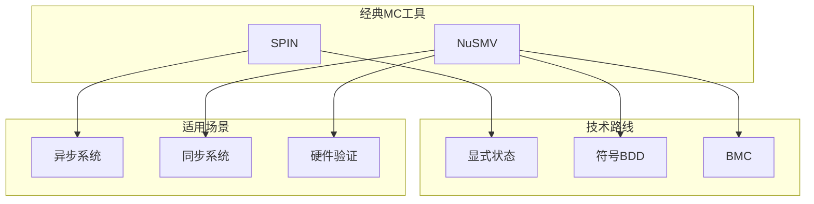
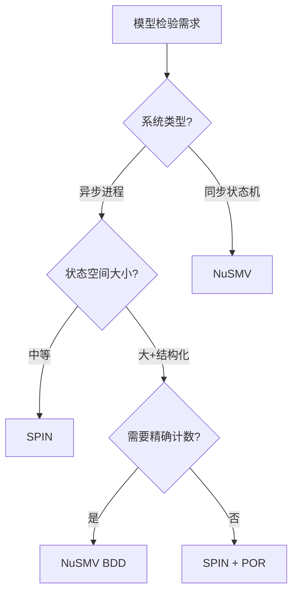
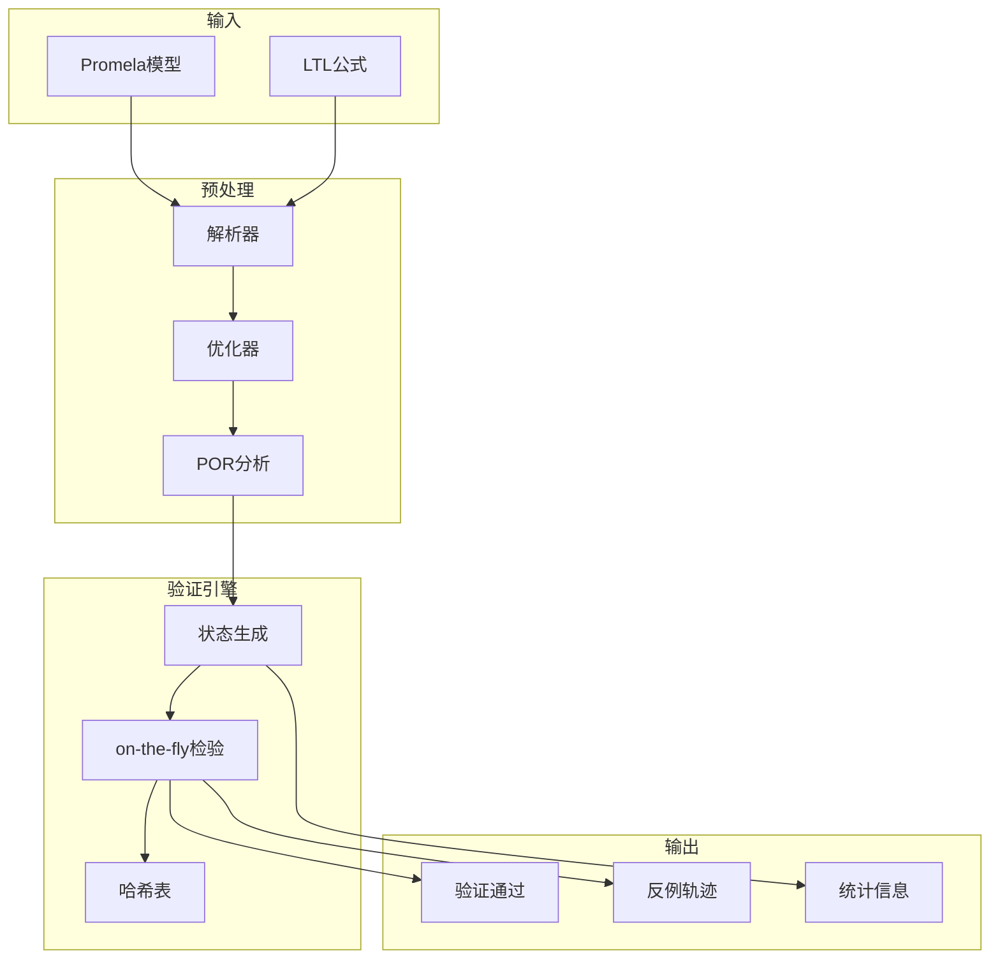
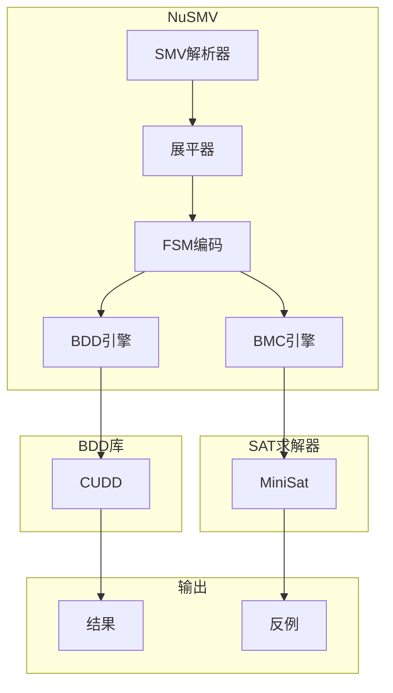

# SPIN和NuSMV

> **所属单元**: Tools/Academic | **前置依赖**: [显式状态模型检验](../../05-verification/02-model-checking/01-explicit-state.md) | **形式化等级**: L4

## 1. 概念定义 (Definitions)

### 1.1 SPIN模型检验器

**Def-T-01-01** (SPIN概述)。SPIN是基于Promela语言的显式状态模型检验器：

$$\text{SPIN} = \text{Promela} + \text{on-the-fly验证} + \text{部分序归约} + \text{比特状态哈希}$$

**Def-T-01-02** (Promela语言)。Promela (PROtocol/PROcess MEta-LAnguage) 建模并发系统：

```promela
/* 进程定义 */
proctype ProcessName(formal_params) {
    /* 局部声明 */
    /* 语句序列 */
}

/* 消息通道 */
chan name = [capacity] of { type_list }
```

**核心构造**：

- **进程** (`proctype`): 并发执行单元
- **通道** (`chan`): 进程间通信
- **原子序列** (`atomic`): 不可中断执行块
- **守卫语句** (`:: guard -> action`): 非确定性选择

### 1.2 NuSMV符号检验器

**Def-T-01-03** (NuSMV概述)。NuSMV是基于BDD和SAT的符号模型检验器：

$$\text{NuSMV} = \text{SMV语言} + \text{BDD-based MC} + \text{BMC} + \text{不变式生成}$$

**Def-T-01-04** (SMV语言结构)。

```smv
MODULE main
VAR
    variable_list: type;
ASSIGN
    init(variable) := initial_value;
    next(variable) := case
        condition : value;
        ...
    esac;
SPEC
    LTL_or_CTL_formula;
```

## 2. 属性推导 (Properties)

### 2.1 SPIN优化技术

**Lemma-T-01-01** (比特状态哈希压缩)。比特状态哈希将内存使用降至每位一个状态：

$$\text{Memory} = \frac{|S|}{8} \text{ bytes (最坏情况)}$$

存在漏检概率（哈希冲突），但实践中极低。

**Lemma-T-01-02** (SPIN on-the-fly验证)。验证与状态生成交错：

$$\text{No complete state space construction needed for checking properties}$$

发现反例时可立即终止。

### 2.2 NuSMV BDD优化

**Lemma-T-01-03** (动态变量重排序)。NuSMV实现动态变量排序减少BDD大小：

$$|BDD_{\text{dynamic}}| \leq |BDD_{\text{static}}| \text{ (通常显著小于)}$$

重排序算法：sifting, window, simulated annealing。

## 3. 关系建立 (Relations)

### 3.1 SPIN vs NuSMV对比



| 特性 | SPIN | NuSMV |
|------|------|-------|
| 建模语言 | Promela | SMV |
| 状态探索 | 显式 | 符号(BDD) |
| 并发模型 | 异步 | 同步/异步 |
| POR支持 | 是 | 有限 |
| SAT支持 | 无 | 有(BMC) |
| 最佳应用 | 通信协议 | 硬件/控制系统 |

## 4. 论证过程 (Argumentation)

### 4.1 工具选择指南



## 5. 形式证明 / 工程论证 (Proof / Engineering Argument)

### 5.1 SPIN验证正确性

**Thm-T-01-01** (SPIN验证完备性)。对于有限Promela模型，SPIN验证是完备且可靠的（忽略哈希冲突）：

$$\text{SPIN}(M, \varphi) = \begin{cases} \text{passed} \Rightarrow M \models \varphi \\ \text{error trail} \Rightarrow M \not\models \varphi \end{cases}$$

### 5.2 NuSMV BDD验证

**Thm-T-01-02** (NuSMV不动点收敛)。NuSMV的符号不动点算法正确计算CTL语义：

$$[\text{EG } p] = \nu Z. p \land \text{EX}(Z)$$

## 6. 实例验证 (Examples)

### 6.1 SPIN: 互斥协议

```promela
#define N 2
bool want[N];
bool critical[N];

proctype P(int i) {
    do
    :: want[i] = true;
       atomic { !want[1-i] -> critical[i] = true }
       /* 临界区 */
       critical[i] = false;
       want[i] = false
    od
}

init { run P(0); run P(1) }

/* LTL规范 */
ltl safety { [](!(critical[0] && critical[1])) }
ltl liveness { [](want[0] -> <>critical[0]) }
```

### 6.2 NuSMV: 交通灯控制

```smv
MODULE main
VAR
    light1: {red, green, yellow};
    light2: {red, green, yellow};
    timer: 0..10;

ASSIGN
    init(light1) := red;
    init(light2) := green;
    init(timer) := 0;

    next(light1) := case
        light1 = red & timer >= 5: green;
        light1 = green & timer >= 10: yellow;
        light1 = yellow & timer >= 2: red;
        TRUE: light1;
    esac;

    next(timer) := case
        next(light1) != light1: 0;
        TRUE: timer + 1;
    esac;

SPEC
    AG !(light1 = green & light2 = green)
SPEC
    AG (light1 = red -> AF light1 = green)
```

## 7. 可视化 (Visualizations)

### 7.1 SPIN验证流程



### 7.2 NuSMV架构



## 8. 引用参考 (References)
